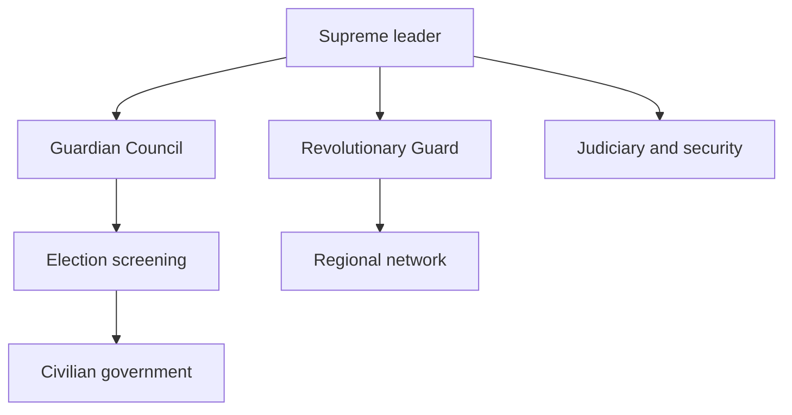
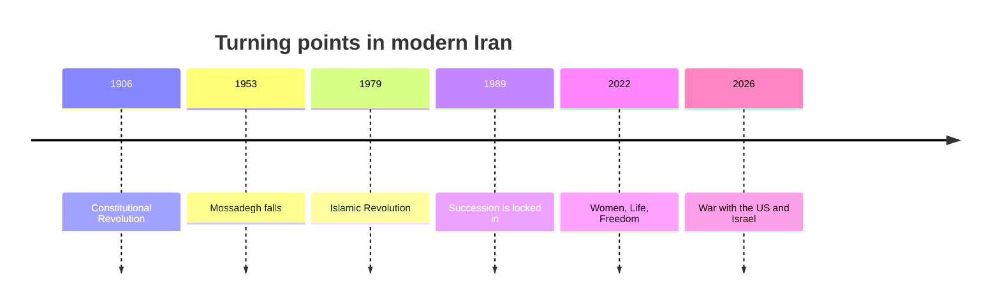

# Iran, a Revolutionary State Pulled Toward War

## 1. Executive Summary

Iran runs on a system that still holds elections, ministers, and a parliament, but concentrates final authority in the supreme leader and the Revolutionary Guard. As of September 2026, public reporting says the supreme leader is Mojtaba Khamenei, the civilian face is President Masoud Pezeshkian, and war with the United States and Israel plus the closure of the Strait of Hormuz dominate foreign relations. <SourceNote>[AP, Iran names Mojtaba Khamenei to succeed his father as supreme leader](https://apnews.com/article/f0b20dbffaea9351ae1e54183ffe53ff) and [AP, Where things stand after Iran's new pitch for a deal to open the Strait of Hormuz](https://apnews.com/article/4f949bd0fd2777fa6960b56d8bf3169b) support this reading.</SourceNote>

When you read Iran in the news, you have to follow sanctions, sea lanes, domestic control, and proxy networks together, not nuclear diplomacy alone. <SourceNote>[OFAC Iran Sanctions](https://ofac.treasury.gov/sanctions-programs-and-country-information/iran-sanctions) and [IAEA Verification and Monitoring in Iran](https://www.iaea.org/ja/newscenter/focus/iran) provide the baseline.</SourceNote>

The key point is that Iran is not a detached problem country. Nuclear politics, war, sanctions, and repression sit inside the same governing machine. <SourceNote>[Freedom House, Iran 2026](https://freedomhouse.org/country/iran/freedom-world/2026) and [IMF, Islamic Republic of Iran](https://www.imf.org/en/countries/irn) support that framing.</SourceNote>

## 2. History and Political Memory

Modern Iran still carries the memory of the 1906 constitutional revolution, the 1953 fall of Mossadegh, and the 1979 Islamic Revolution. Those events left behind distrust of foreign powers, a gap between elections and power, and the fusion of religion and state. <SourceNote>[Encyclopaedia Iranica, Constitutional Revolution](https://www.iranicaonline.org/articles/constitutional-revolution-i/) and [Britannica, Tehran: History](https://www.britannica.com/place/Tehran/History) support this background.</SourceNote>

The 1979 revolution overthrew the monarchy, built a theocratic republic, and placed the Revolutionary Guard and supervisory institutions at the center of the state. The post-1989 order turned revolution into a governing principle rather than an exception. <SourceNote>[JSTOR, Iran: A Modern History](https://www.jstor.org/stable/j.ctv19prrqm) and [Iranica, Constitution of the Islamic Republic of Iran](https://www.iranicaonline.org/articles/constitution-of-the-islamic-republic/) support this account.</SourceNote>

The 2022 Women, Life, Freedom movement made the tension between moral governance and civic dignity visible again. The 2026 war has pulled that tension into both domestic politics and external conflict. <SourceNote>[OHCHR, Iran fact-finding materials](https://www.ohchr.org/sites/default/files/documents/countries/iran/20240717-SR-Iran-Findings.pdf) and [HRW, World Report 2026: Iran](https://www.hrw.org/world-report/2026/country-chapters/iran) support this point.</SourceNote>

## 3. The Structure of Power

On paper, Iran is a republic with elections, but candidate vetting and final authority are tightly managed from above. The Guardian Council screens both laws and elections, and the supreme leader stands above the armed forces, the judiciary, broadcasting, and other strategic bodies. <SourceNote>[Iran constitution PDF](https://media.unesco.org/sites/default/files/webform/r2e002/1682115803c420149d27837b1a5aebdb50cdcc67.pdf) and [Freedom House, Iran 2026](https://freedomhouse.org/country/iran/freedom-world/2026) support this description.</SourceNote>

The current power map is easier to read as an interaction among Supreme Leader Mojtaba Khamenei, President Pezeshkian, the IRGC, the judiciary, the Guardian Council, and the Assembly of Experts. Civilian government exists, but when security and war logic dominate, policy room narrows quickly. <SourceNote>[AP, Iran names Mojtaba Khamenei to succeed his father as supreme leader](https://apnews.com/article/f0b20dbffaea9351ae1e54183ffe53ff) and [Iran constitution PDF](https://media.unesco.org/sites/default/files/webform/r2e002/1682115803c420149d27837b1a5aebdb50cdcc67.pdf) support this reading.</SourceNote>

| Role | Main actor | How to read it |
| --- | --- | --- |
| Final authority | Supreme leader | Controls the key points in the military, judiciary, and elections |
| Coercive core | IRGC | The center of deterrence and domestic control |
| Filter | Guardian Council | Screens candidates and reviews laws |
| Civilian interface | President and cabinet | Handles diplomacy and administration with limited autonomy |
| Legislature | Majles | A lawmaking arena constrained by higher bodies |

That structure makes elections function more as a redistribution of legitimacy than as real competition. <SourceNote>[Freedom House, Iran 2026](https://freedomhouse.org/country/iran/freedom-world/2026) and [Iran constitution PDF](https://media.unesco.org/sites/default/files/webform/r2e002/1682115803c420149d27837b1a5aebdb50cdcc67.pdf) support this point.</SourceNote>

## 4. Nuclear Politics, Sanctions, and War

In its June 2025 report, the IAEA said Iran continued to expand production of 60 percent enriched uranium and had accumulated stocks far above JCPOA limits. The agency also notes that Iran remains the only non-nuclear-weapon state under the NPT that produces and stockpiles highly enriched uranium. <SourceNote>[IAEA GOV/2025/24](https://www.iaea.org/sites/default/files/25/06/gov2025-24.pdf) and [IAEA Safeguards Report 2024](https://www.iaea.org/sites/default/files/25/06/sir-2024.pdf) support this statement.</SourceNote>

The U.S. Treasury's OFAC keeps updating the Iran sanctions program in September 2026, with coverage that reaches shipping, finance, oil, aviation, and digital assets. In other words, sanctions are not a quiet blockade. They are an operational pressure campaign that keeps narrowing exceptions and workarounds. <SourceNote>[OFAC Iran Sanctions](https://ofac.treasury.gov/sanctions-programs-and-country-information/iran-sanctions) supports this statement.</SourceNote>

The IMF's July 2026 outlook puts Iran's 2026 real GDP growth at -5.4 percent and consumer inflation at 68.9 percent. War and blockade are adding external stress to an economy that was already fragile. <SourceNote>[IMF, Islamic Republic of Iran](https://www.imf.org/en/countries/irn) and [IMF DataMapper profile](https://www.imf.org/external/datamapper/profile/IRN/) support this point.</SourceNote>

In September 2026, AP reported that mediators were exploring ways to connect a ceasefire with the reopening of the Strait of Hormuz, but the gaps remain wide. On the basis of public information, the nuclear file has shifted from a narrow technical negotiation into a security bargain that links ceasefire, sea lanes, and sanctions relief. <SourceNote>[AP, Where things stand after Iran's new pitch for a deal to open the Strait of Hormuz](https://apnews.com/article/4f949bd0fd2777fa6960b56d8bf3169b) and [AP, Mediators are working to broker a US-Iran deal](https://apnews.com/article/871504dbd98d9b08b226b9805d8f4606) support this reading.</SourceNote>

| External issue | What is at stake | What to watch |
| --- | --- | --- |
| Nuclear file | Enrichment, inspections, and stockpiles | Space for renewed talks |
| Sanctions | Oil, finance, and shipping | Transaction costs and insurance premiums |
| Hormuz | Safe passage and transit rights | Global energy prices |
| War | Direct conflict with the U.S. and Israel | Regime durability |

## 5. Civilian Life and Repression

Freedom House still rates Iran Not Free in 2026 and points to restrictions on speech, religion, online space, and due process. HRW and OHCHR continue to report punishment, executions, and pressure on minorities after the 2022 protests. <SourceNote>[Freedom House, Iran 2026](https://freedomhouse.org/country/iran/freedom-world/2026) and [HRW, World Report 2026: Iran](https://www.hrw.org/world-report/2026/country-chapters/iran) support this assessment.</SourceNote>

You miss the country if you treat civilian life as uniform. Urban and rural life, class, generation, ethnicity, religion, and diaspora ties all shape how the same policy is received. <SourceNote>[Freedom House, Iran 2026](https://freedomhouse.org/country/iran/freedom-world/2026) and [OHCHR special procedure communications](https://spcommreports.ohchr.org/TmSearch/Mandates?m=44) support this point.</SourceNote>

Women's public participation has grown, but political freedom has not expanded automatically. If you blur that distinction, you overread social change as reform. <SourceNote>[HRW, World Report 2026: Iran](https://www.hrw.org/world-report/2026/country-chapters/iran) and [Freedom House, Iran 2026](https://freedomhouse.org/country/iran/freedom-world/2026) support this point.</SourceNote>

## 6. Regional Networks

Iran's regional network is closer to a set of semi-autonomous nodes spread across Lebanon, Yemen, Iraq, and Syria than to a single proxy force. On the basis of public information, the network centers less on ideology than on deterrence, supply, deniability, and local political penetration. <SourceNote>[U.S. State Dept, Country Reports on Terrorism 2023](https://2021-2025.state.gov/reports/country-reports-on-terrorism-2023/) and [AP, Iranian advisers helped Houthis seize Yemen's Red Sea coast](https://apnews.com/article/e32ed78eb9b528642d043d4303192927) support this reading.</SourceNote>

| Region | Main node | Function for Iran | Constraint |
| --- | --- | --- | --- |
| Lebanon | Hezbollah | Deterrence against Israel | Risk of wider war |
| Yemen | Houthis | Pressure on the Red Sea and Bab el-Mandeb | International backlash |
| Iraq | Pro-Iran militias | Pressure on U.S. forces and Gulf states | Baghdad politics and retaliation |
| Syria | Logistics corridor and legacy positions | Regional linkage and supply | A changing battlefield |

The point of this table is that local actors do not move at the same speed. <SourceNote>[AP, UN envoy meets Houthi negotiators](https://apnews.com/article/049d586b6e8ca0a0394bc013e3322da3) and [AP, Iran tells the US public that Trump's war has failed](https://apnews.com/article/fb270c839b8c774788a09b3d1aeb0a84) support this point.</SourceNote>

Even when Iran has influence across the region, that influence is not one gear that turns all at once; it meshes with or slips against local disputes. <SourceNote>[AP, UN envoy meets Houthi negotiators](https://apnews.com/article/049d586b6e8ca0a0394bc013e3322da3) and [AP, Iran tells the US public that Trump's war has failed](https://apnews.com/article/fb270c839b8c774788a09b3d1aeb0a84) support this point.</SourceNote>

## 7. What It Means for Japan and East Asia

For Japan, the key is not to treat Iran only as a distant sanctions target. The Strait of Hormuz, insurance, LNG and crude, shipping, sanctions compliance, and the recoverability of private investment are all connected in the same file. <SourceNote>[OFAC Iran Sanctions](https://ofac.treasury.gov/sanctions-programs-and-country-information/iran-sanctions) and [AP, Iran proposes to reopen the Strait of Hormuz](https://apnews.com/article/d8b9749fee99a11dd77513d326b824b6) support this point.</SourceNote>

For companies and policy teams in East Asia, the real question is not whether to enter the Iranian market, but which risks are still acceptable and which exposures cross the line into sanctions, logistics, and reputational risk at the same time. <SourceNote>[OFAC Iran Sanctions](https://ofac.treasury.gov/sanctions-programs-and-country-information/iran-sanctions) and [IMF, Islamic Republic of Iran](https://www.imf.org/en/countries/irn) support this point.</SourceNote>

## 8. Monitoring Points and Limits

The next monitoring points are the alignment between the supreme leader and the IRGC, ceasefire talks around Hormuz, access for IAEA inspectors, sanction exceptions, and whether repression triggers another wave of protest. <SourceNote>[IAEA Verification and Monitoring in Iran](https://www.iaea.org/ja/newscenter/focus/iran) and [AP current Iran coverage](https://apnews.com/) support this framing.</SourceNote>

On the basis of public information, Iran cannot separate nuclear politics, war, and sanctions in the near term. In news reading, the question is less who sounds toughest than who has started paying what cost. <SourceNote>[IMF, Islamic Republic of Iran](https://www.imf.org/en/countries/irn) and [Freedom House, Iran 2026](https://freedomhouse.org/country/iran/freedom-world/2026) support this conclusion.</SourceNote>
