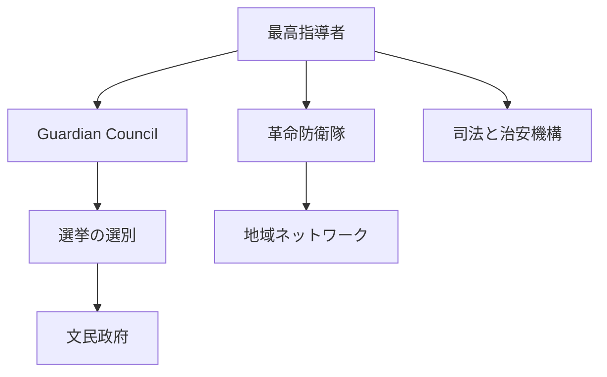
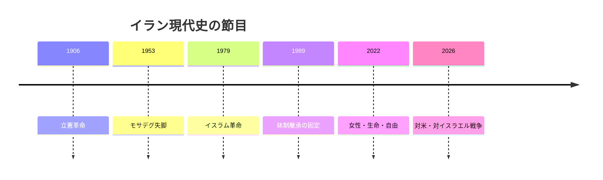

# 革命国家イラン、統治が戦場に引き寄せられる

## 1. エグゼクティブサマリー

イランは、選挙や閣僚や議会を持ちながら、最終的な権力が最高指導者と革命防衛隊に集中する体制で動いている。2026年9月時点の公表報道では、最高指導者はモフタバ・ハメネイ、文民の顔はマスード・ペゼシュキアン大統領であり、米国とイスラエルとの戦争とホルムズ海峡の封鎖が対外関係を覆っている。<SourceNote>[AP, Iran names Mojtaba Khamenei to succeed his father as supreme leader](https://apnews.com/article/f0b20dbffaea9351ae1e54183ffe53ff) と [AP, Where things stand after Iran's new pitch for a deal to open the Strait of Hormuz](https://apnews.com/article/4f949bd0fd2777fa6960b56d8bf3169b) に基づく。</SourceNote>

この国をニュースで読むときは、核交渉の行方だけでなく、制裁、海上交通、国内統制、代理勢力の連動を一体で追う必要がある。<SourceNote>[OFAC Iran Sanctions](https://ofac.treasury.gov/sanctions-programs-and-country-information/iran-sanctions) と [IAEA Verification and Monitoring in Iran](https://www.iaea.org/ja/newscenter/focus/iran) を参照した。</SourceNote>

要点は、イランが「孤立した問題国」なのではなく、核・戦争・制裁・抑圧が同じ統治機構に重なっている国だということだ。<SourceNote>[Freedom House, Iran 2026](https://freedomhouse.org/country/iran/freedom-world/2026) と [IMF, Islamic Republic of Iran](https://www.imf.org/en/countries/irn) を参照した。</SourceNote>

## 2. 歴史と政治記憶

現代イランの記憶の底には、1906年の立憲革命、1953年のモサデグ失脚、1979年のイスラム革命がある。これらは、外国勢力への不信、選挙と権力のずれ、宗教と国家の結合を同時に残した。<SourceNote>[Encyclopaedia Iranica, Constitutional Revolution](https://www.iranicaonline.org/articles/constitutional-revolution-i/) と [Britannica, Tehran: History](https://www.britannica.com/place/Tehran/History) を参照した。</SourceNote>

1979年革命は、君主制を倒し、神権的な共和制を作り、革命防衛隊と監督機構を国家の中枢に置いた。1989年にホメイニ死後の継承が固まり、その後の体制は革命を「例外」ではなく統治原理として固定した。<SourceNote>[JSTOR, Iran: A Modern History](https://www.jstor.org/stable/j.ctv19prrqm) と [Iranica, Constitution of the Islamic Republic of Iran](https://www.iranicaonline.org/articles/constitution-of-the-islamic-republic/) に基づく。</SourceNote>

2022年以降の「女性・生命・自由」運動は、道徳統治と市民の尊厳の緊張を再び可視化した。2026年の戦争は、その緊張を国内政治と対外戦争の両方に引き寄せている。<SourceNote>[OHCHR, Iran fact-finding materials](https://www.ohchr.org/sites/default/files/documents/countries/iran/20240717-SR-Iran-Findings.pdf) と [HRW, World Report 2026: Iran](https://www.hrw.org/world-report/2026/country-chapters/iran) を参照した。</SourceNote>

## 3. 体制の骨格

憲法上、イランは選挙制のある共和国だが、候補者の適格審査と最終的な権限は上から管理される。Guardian Councilは法律と選挙の両方をふるいにかけ、最高指導者は軍、司法、放送、重要機関の上に立つ。<SourceNote>[Iran constitution PDF](https://media.unesco.org/sites/default/files/webform/r2e002/1682115803c420149d27837b1a5aebdb50cdcc67.pdf) と [Freedom House, Iran 2026](https://freedomhouse.org/country/iran/freedom-world/2026) を参照した。</SourceNote>

現在の権力配置は、モフタバ・ハメネイ最高指導者、ペゼシュキアン大統領、IRGC、司法、Guardian Council、専門家会議の相互作用として見ると分かりやすい。文民政府は存在するが、治安と戦争の論理が優先されると、政策余地は狭くなる。<SourceNote>[AP, Iran names Mojtaba Khamenei to succeed his father as supreme leader](https://apnews.com/article/f0b20dbffaea9351ae1e54183ffe53ff) と [Iran constitution PDF](https://media.unesco.org/sites/default/files/webform/r2e002/1682115803c420149d27837b1a5aebdb50cdcc67.pdf) に基づく。</SourceNote>

| 役割 | 主体 | 読み方 |
| --- | --- | --- |
| 最終権力 | 最高指導者 | 軍事・司法・選挙の要所を押さえる |
| 強制装置 | IRGC | 対外抑止と国内統制の中核 |
| ふるい | Guardian Council | 候補者選別と法の審査を担う |
| 文民の窓口 | 大統領と内閣 | 交渉と行政を担当するが裁量は限定的 |
| 議会 | マジュレス | 立法の場だが、上位機関に制約される |

この構造のため、選挙は競争の代わりに正統性の再配分として機能しやすい。<SourceNote>[Freedom House, Iran 2026](https://freedomhouse.org/country/iran/freedom-world/2026) と [Iran constitution PDF](https://media.unesco.org/sites/default/files/webform/r2e002/1682115803c420149d27837b1a5aebdb50cdcc67.pdf) を参照した。</SourceNote>

## 4. 核・制裁・戦争

IAEAの2025年6月の報告では、イランは60%濃縮ウランの生産を拡大し続け、JCPOAの制限を大きく超える在庫を積み上げていた。IAEAはまた、イランが高濃縮ウランを生産・備蓄する唯一のNPT非核兵器国であると位置づけている。<SourceNote>[IAEA GOV/2025/24](https://www.iaea.org/sites/default/files/25/06/gov2025-24.pdf) と [IAEA Safeguards Report 2024](https://www.iaea.org/sites/default/files/25/06/sir-2024.pdf) を参照した。</SourceNote>

米国財務省のOFACは、2026年9月時点でもイラン制裁ページを更新し続けており、海運、金融、石油、航空、デジタル資産まで対象を広げている。つまり制裁は、静かな封鎖ではなく、例外と迂回をつぶし続ける運用型の圧力になっている。<SourceNote>[OFAC Iran Sanctions](https://ofac.treasury.gov/sanctions-programs-and-country-information/iran-sanctions) に基づく。</SourceNote>

IMFの2026年7月の見通しでは、2026年の実質GDP成長率は-5.4%、消費者物価は68.9%と見込まれている。戦争と封鎖は、すでに脆弱な経済に外圧を上乗せしている。<SourceNote>[IMF, Islamic Republic of Iran](https://www.imf.org/en/countries/irn) と [IMF DataMapper profile](https://www.imf.org/external/datamapper/profile/IRN/) を参照した。</SourceNote>

2026年9月のAP報道では、仲介国が米国とイランの間でホルムズ海峡再開と停戦を結びつける案を探っているが、隔たりは大きい。公表情報からの推定として、核問題は単独の技術交渉ではなく、停戦、海上交通、制裁緩和を束ねる安全保障取引に変質している。<SourceNote>[AP, Where things stand after Iran's new pitch for a deal to open the Strait of Hormuz](https://apnews.com/article/4f949bd0fd2777fa6960b56d8bf3169b) と [AP, Mediators are working to broker a US-Iran deal](https://apnews.com/article/871504dbd98d9b08b226b9805d8f4606) を参照した。</SourceNote>

| 対外論点 | 何が争点か | 何を読むべきか |
| --- | --- | --- |
| 核 | 濃縮度、査察、在庫 | 交渉再開の余地 |
| 制裁 | 石油、金融、海運 | 取引コストと保険料 |
| ホルムズ | 航行の安全と通行権 | 世界のエネルギー価格 |
| 戦争 | 米国・イスラエルとの衝突 | 体制の耐久力 |

## 5. 市民生活と抑圧

Freedom Houseは2026年版でもイランを Not Free と評価し、表現の自由、信教の自由、オンライン空間、手続的権利の制約を指摘している。HRWとOHCHRは、2022年抗議以降の処罰、処刑、少数派への圧力を繰り返し報告している。<SourceNote>[Freedom House, Iran 2026](https://freedomhouse.org/country/iran/freedom-world/2026) と [HRW, World Report 2026: Iran](https://www.hrw.org/world-report/2026/country-chapters/iran) を参照した。</SourceNote>

市民生活を一枚岩で見ると外す。都市と地方、階級、世代、民族、宗教、ディアスポラの立場は重なり方が違い、同じ政策でも受け止め方が違う。<SourceNote>[Freedom House, Iran 2026](https://freedomhouse.org/country/iran/freedom-world/2026) と [OHCHR special procedure communications](https://spcommreports.ohchr.org/TmSearch/Mandates?m=44) に基づく。</SourceNote>

女性の公的参加は広がったが、政治的自由が自動的に広がったわけではない。ここを取り違えると、社会変化を改革として過大評価してしまう。<SourceNote>[HRW, World Report 2026: Iran](https://www.hrw.org/world-report/2026/country-chapters/iran) と [Freedom House, Iran 2026](https://freedomhouse.org/country/iran/freedom-world/2026) を参照した。</SourceNote>

## 6. 地域ネットワーク

イランの地域ネットワークは、ひとつの代理勢力ではなく、レバノン、イエメン、イラク、シリアにまたがる半自律的な接点の集合として見る方が実態に近い。公開情報からの推定として、このネットワークの中心は、イデオロギーよりも、抑止、補給、否認可能性、現地政治への浸透にある。<SourceNote>[U.S. State Dept, Country Reports on Terrorism 2023](https://2021-2025.state.gov/reports/country-reports-on-terrorism-2023/) と [AP, Iranian advisers helped Houthis seize Yemen's Red Sea coast](https://apnews.com/article/e32ed78eb9b528642d043d4303192927) を参照した。</SourceNote>

| 地域 | 主な接点 | イランにとっての機能 | 制約 |
| --- | --- | --- | --- |
| レバノン | ヒズボラ | イスラエルへの抑止 | 戦争の巻き込み |
| イエメン | フーシ派 | 紅海・バブ・エル・マンデブへの圧力 | 国際的反発 |
| イラク | 親イラン民兵 | 米軍・湾岸諸国への圧力 | バグダッド政治と報復 |
| シリア | 物流回廊と旧拠点 | 地域連結と補給 | 戦局の変化 |

この表の読みどころは、各地の勢力が同じ速度で動かないことだ。イランが地域で影響力を持つとしても、その影響力は一斉に動く歯車ではなく、地元の争点に応じて噛み合ったり外れたりする。<SourceNote>[AP, UN envoy meets Houthi negotiators](https://apnews.com/article/049d586b6e8ca0a0394bc013e3322da3) と [AP, Iran tells the US public that Trump's war has failed](https://apnews.com/article/fb270c839b8c774788a09b3d1aeb0a84) を参照した。</SourceNote>

## 7. 日本・東アジアへの含意

日本にとっての焦点は、イランを「遠い制裁対象国」としてだけ見ないことだ。ホルムズ海峡、保険、LNGと原油、海運、対米制裁遵守、民間投資の回収可能性が、同じ案件の中でつながっている。<SourceNote>[OFAC Iran Sanctions](https://ofac.treasury.gov/sanctions-programs-and-country-information/iran-sanctions) と [AP, Iran proposes to reopen the Strait of Hormuz](https://apnews.com/article/d8b9749fee99a11dd77513d326b824b6) を参照した。</SourceNote>

東アジアの企業や政策担当者にとっての判断軸は、イラン市場に入るかどうかではなく、どのリスクが許容可能で、どの接触が制裁・物流・評判の三重リスクを越えるかである。<SourceNote>[OFAC Iran Sanctions](https://ofac.treasury.gov/sanctions-programs-and-country-information/iran-sanctions) と [IMF, Islamic Republic of Iran](https://www.imf.org/en/countries/irn) を参照した。</SourceNote>

## 8. 監視点と限界

今後の監視点は、最高指導者とIRGCの足並み、ホルムズ海峡をめぐる停戦交渉、IAEA査察へのアクセス、制裁の例外措置、そして国内の抑圧が再び抗議を呼ぶかどうかである。<SourceNote>[IAEA Verification and Monitoring in Iran](https://www.iaea.org/ja/newscenter/focus/iran) と [AP current Iran coverage](https://apnews.com/) に基づく。</SourceNote>

公表情報からの推定として、イランは当面、核・戦争・制裁の三つを別々に扱えない。ニュースで見るべきなのは、声明の強さよりも、誰がどのコストを払い始めたかである。<SourceNote>[IMF, Islamic Republic of Iran](https://www.imf.org/en/countries/irn) と [Freedom House, Iran 2026](https://freedomhouse.org/country/iran/freedom-world/2026) を参照した。</SourceNote>
