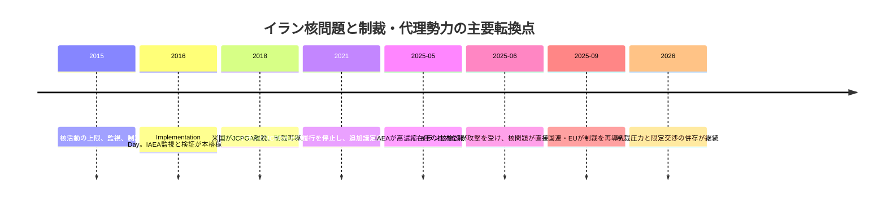
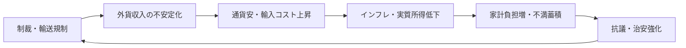
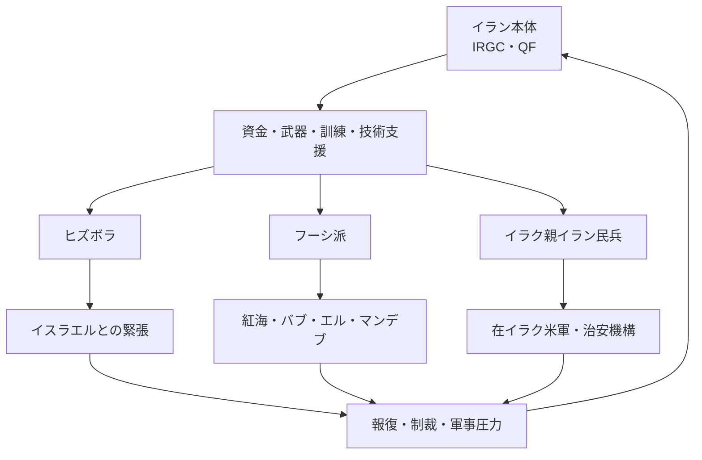

# イランの核開発・制裁・地域代理勢力

## 1. エグゼクティブサマリー

イラン問題は、核開発、制裁、地域代理勢力、国内統治が一体化した案件として見る必要がある。2015年のJCPOAは核開発を一定期間抑える枠組みだったが、米国の2018年離脱で実効性が失われ、2021年以降のイラン側の履行停止で監視も弱体化した。2025年5月時点のIAEA報告では、濃縮ウラン在庫は9,247.6 kg、うち60%濃縮は408.6 kgに達していた。2025年9月には国連制裁のスナップバックが発動し、EUも制裁を再導入したため、2026年時点の中心軸は「合意回復」よりも「圧力管理と限定交渉」にある。

<SourceNote>JCPOAの成立と後退は [White House Archives, JCPOA adoption statement](https://obamawhitehouse.archives.gov/the-press-office/2015/07/14/statement-president-adoption-joint-comprehensive-plan-action) と [White House Archives, 2018 withdrawal statement](https://trumpwhitehouse.archives.gov/briefings-statements/statement-president-donald-j-trump-ending-united-states-participation-unacceptable-iran-deal/) を起点に、履行停止は [IAEA GOV/2025/24](https://www.iaea.org/sites/default/files/25/06/gov2025-24.pdf) と [IAEA GOV/2025/25](https://www.iaea.org/sites/default/files/25/06/gov2025-25.pdf) で確認した。2025年9月の制裁再導入は [UN Department of Political and Peacebuilding Affairs](https://dppa.dfs.un.org/en/mtg-sc-10079-usg-dicarlo-23-dec-2025) と [Council of the EU, Iran restrictive measures](https://www.consilium.europa.eu/en/press/press-releases/2025/09/29/iran-council-re-imposes-sanctions/) に基づく。</SourceNote>

制裁は核問題だけでなく、イランの外貨獲得、海上輸送、保険、決済、代理勢力支援を同時に絞る。米財務省は2025年4月の航運勧告で、イランの原油・石油製品輸出が海上の「shadow fleet」に依存していると警告し、2026年4月には関連する船舶・企業ネットワークへの制裁を追加した。

<SourceNote>海上輸送と制裁回避の構図は [OFAC, Iran Shipping Advisory](https://ofac.treasury.gov/system/files/2025-04/Iran%20Shipping%20Advisory_4162025.pdf) と [U.S. Treasury, April 2026 sanctions action](https://home.treasury.gov/news/press-releases/sb0472) に基づく。後者は、イランの石油輸送ネットワークへの継続的圧力を示している。</SourceNote>

国内経済への打撃も大きい。世界銀行は2026年時点のイラン経済について、制裁、紛争、社会不安、水・エネルギー不足が活動を圧迫し、2025/26年の実質GDPが2.7%縮小すると見込む。高インフレと実質所得の低下は、家計の購買力と輸入調達をさらに弱める。

<SourceNote>経済見通しは [World Bank, Iran overview](https://www.worldbank.org/ext/en/country/iran) の2025/26年推計と説明文に依拠した。ここでの「打撃」は、単一の要因ではなく、制裁・輸送制約・国内供給不足の合成効果として読むのが妥当である。</SourceNote>

地域代理勢力は、単なる「外延的な影響力」ではない。イランにとっては、抑止、報復、交渉カード、情報戦、資金循環の回路として機能する。一方で、ヒズボラ、フーシ派、イラクの親イラン武装組織は、地域の戦域を広げ、イラン本土への軍事圧力を高めるフィードバックも生む。

<SourceNote>代理勢力の機能は、各組織に対する米財務省・国務省の制裁や指定で裏づけられる。たとえば [Treasury, Houthi sanctions action](https://home.treasury.gov/news/press-releases/sb0174) はフーシ派の海上攻撃能力を、[Treasury, Hizballah cash-economy networks](https://home.treasury.gov/news/press-releases/sb0420) はヒズボラの資金回路を、[Treasury, Iran-backed Iraqi militias](https://home.treasury.gov/news/press-releases/sb0277) はイラク武装組織へのイラン関与を示している。</SourceNote>

## 2. 背景と年表

JCPOAは、イランの濃縮、遠心分離機、在庫、検証を一定期間にわたり制約する代わりに、制裁緩和を与える「交換条件」だった。つまり、核兵器化を最終的に解決する条約ではなく、時間を買うための政治的取引である。米国の2018年離脱でこの取引は崩れ、イランは段階的に上限を外していった。

<SourceNote>JCPOAの基本構造は [White House Archives, 2015 adoption statement](https://obamawhitehouse.archives.gov/the-press-office/2015/07/14/statement-president-adoption-joint-comprehensive-plan-action) と [IAEA, Iran verification and monitoring reports](https://www.iaea.org/newscenter/focus/iran) で確認できる。2018年の離脱は [White House Archives, 2018 withdrawal statement](https://trumpwhitehouse.archives.gov/briefings-statements/statement-president-donald-j-trump-ending-united-states-participation-unacceptable-iran-deal/) による。</SourceNote>

2021年以降、IAEAはイランがJCPOA上の履行を止め、監視機器の撤去や追加議定書の暫定適用停止が発生したと繰り返し示している。2025年5月の理事会文書では、IAEAは17日時点の核物質在庫を9,247.6 kgとし、そのうち60%濃縮ウランは408.6 kg、20%濃縮は約275 kg、5%濃縮は約5.5 tとした。

<SourceNote>在庫水準は [IAEA GOV/2025/24](https://www.iaea.org/sites/default/files/25/06/gov2025-24.pdf) に基づく。IAEAは別文書で、2021年2月以降に包括的な監視・検証の連続性を失ったことも説明している [IAEA GOV/2025/25](https://www.iaea.org/sites/default/files/25/06/gov2025-25.pdf)。</SourceNote>

2025年9月のスナップバックは、合意の再建ではなく「合意外での再制裁」を意味した。国連側は、制裁再適用をめぐって政治的対立が続いていることを認めつつ、E3の通知を受けて旧制裁が復活したと説明している。EUも同日、核・ミサイル・軍需関連の制裁を再導入した。

<SourceNote>スナップバックの経緯は [UN DPPA brief](https://dppa.dfs.un.org/en/mtg-sc-10079-usg-dicarlo-23-dec-2025) と [Council of the EU press release](https://www.consilium.europa.eu/en/press/press-releases/2025/09/29/iran-council-re-imposes-sanctions/) を参照した。ここでの「再制裁」は、実務上は金融・輸送・貿易の締め付けを指す。</SourceNote>

## 3. 核開発の現在地

IAEAの最新の公開評価では、イランの濃縮能力そのものよりも、「検証可能性の低下」が問題である。JCPOA下では、在庫の厳密管理、遠心分離機の上限、オンライン監視、抜き打ち査察が重要だったが、履行停止後はこの前提が崩れた。2025年の報告は、申告済み施設での核物質量が巨大化している一方、監視の継続性が失われ、IAEAが過去と現在の一貫した状態を完全には追えないことを示している。

<SourceNote>監視・検証の断絶は [IAEA GOV/2025/24](https://www.iaea.org/sites/default/files/25/06/gov2025-24.pdf) と [IAEA focus page](https://www.iaea.org/newscenter/focus/iran) に依拠する。ここで重要なのは、単純な「何kgあるか」よりも、IAEAが連続的に追跡できているかどうかである。</SourceNote>

| 指標 | 2025年IAEA公表値 | 実務上の意味 |
| --- | --- | --- |
| 総濃縮ウラン在庫 | 9,247.6 kg | JCPOAの上限から大きく乖離している |
| 60%濃縮 | 408.6 kg | 高濃縮領域に近い在庫が相当に大きい |
| 20%濃縮 | 約275 kg | 技術的な「跳躍余地」を持つ |
| 5%濃縮 | 約5.5 t | 低濃縮でも大量在庫がある |
| 監視・検証 | 連続性が弱い | 過去と現在をつなぐ監視が欠ける |

<SourceNote>表は [IAEA GOV/2025/24](https://www.iaea.org/sites/default/files/25/06/gov2025-24.pdf) を要約した。数値は在庫管理の状況を示すが、兵器化の意図や完成度をそれだけで断定するものではない。</SourceNote>

また、IAEAは別の保障措置文書で、テヘラン近郊のLavisan-Shian、Varamin、Turquzabadを含む未申告サイト由来の痕跡をめぐり、イランが十分な説明を与えていないと整理している。これは「イランがすでに核兵器を保有している」という意味ではないが、過去の未申告活動と現在の保障措置上の未解決点が残っていることを示す。

<SourceNote>未申告サイトに関する整理は [IAEA GOV/2025/25](https://www.iaea.org/sites/default/files/25/06/gov2025-25.pdf) に基づく。IAEAは、未申告核物質や活動に関する説明が十分でないと明記している。</SourceNote>

2025年6月には、イランの核施設が軍事攻撃を受けた。IAEAはNatanz、Esfahan、Fordowの施設への損傷を報告し、当時の範囲では施設外の放射線レベル上昇は報告されなかったが、核施設が武力行使の対象になること自体が、抑止と交渉の構図を大きく変えた。

<SourceNote>2025年6月の攻撃に関する初動評価は [IAEA Director General statements](https://www.iaea.org/newscenter/focus/iran) にまとまっている。本文では「施設外放射線上昇が報告されなかった」という範囲に限定して扱うのが安全である。</SourceNote>

## 4. 制裁の構造

制裁は、国連、EU、米国の三層で理解すると整理しやすい。法的には別建てだが、金融機関、海運会社、保険会社、取引先にとっては相互補強的に働く。特にイランのようにドル決済と海上輸送への依存が高い経済では、制裁は「禁輸」だけでなく「信用コストの上昇」として現れる。

<SourceNote>制裁の三層構造は、[UN DPPA](https://dppa.dfs.un.org/en/mtg-sc-10079-usg-dicarlo-23-dec-2025)、[Council of the EU](https://www.consilium.europa.eu/en/press/press-releases/2025/09/29/iran-council-re-imposes-sanctions/) と [U.S. Treasury](https://home.treasury.gov/news/press-releases/sb0472) を見比べると把握しやすい。</SourceNote>

| 層 | 2026年時点の状態 | 何を縛るか | 実務上の影響 |
| --- | --- | --- | --- |
| 国連 | 2025年9月のスナップバックで旧制裁が復活 | 核・ミサイル関連、武器移転、資産凍結 | 対イラン取引の法的リスクを再上昇させる |
| EU | 2025年9月に核関連制裁を再導入 | 貿易、金融、輸送、個人・団体 | 欧州金融・海運の通過コストが上がる |
| 米国 | 2025-2026年も最大圧力を継続 | エネルギー、海運、保険、二次制裁 | 取引相手や船舶の再帰的なコンプライアンス負担 |

<SourceNote>国連とEUの再制裁は前節の出典に基づく。米国側は [OFAC Iran Shipping Advisory](https://ofac.treasury.gov/system/files/2025-04/Iran%20Shipping%20Advisory_4162025.pdf) と [Treasury April 2026 action](https://home.treasury.gov/news/press-releases/sb0472) を組み合わせると、海運・保険・受渡し・二次制裁の圧力が見える。</SourceNote>

2025年4月のOFAC勧告は、イランの原油と精製品の輸出が、AIS操作や船舶間移送を使う影の船団に依存していると警告した。これは、制裁が「輸出ゼロ」を実現するのではなく、迂回コストと可視性を引き上げる形で効いていることを示す。

<SourceNote>[OFAC Iran Shipping Advisory](https://ofac.treasury.gov/system/files/2025-04/Iran%20Shipping%20Advisory_4162025.pdf) は、海上輸送ネットワーク、船舶間移送、保険と仲介の役割を具体化している。本文の「迂回コストが上がる」はこの勧告からの要約である。</SourceNote>

## 5. 国内経済と市民生活への影響

制裁が国内経済に与える影響は、政府歳入の減少だけではない。外貨獲得の不安定化は通貨下落を招き、輸入価格、食料、医薬品、部品、エネルギー機材のコストを押し上げる。そこに国内の水不足、電力不足、物流制約が重なると、供給ショックは家計に直接波及する。

<SourceNote>世界銀行は、イラン経済に対する制約を制裁だけでなく、紛争、水・エネルギー不足、社会不安の複合として説明している [World Bank, Iran overview](https://www.worldbank.org/ext/en/country/iran)。ここでの「直接波及」は、輸入依存財の価格上昇と供給途絶を指す。</SourceNote>

世界銀行は2026年時点の説明で、制裁、紛争、社会不安、水・エネルギー不足が活動を圧迫し、2025/26年の実質GDPが2.7%縮小すると見込んでいる。これは、イラン経済が「資源があるから耐えられる」という単純な話ではなく、輸出の通路、決済、国内供給の脆弱性で制約されていることを示す。

<SourceNote>2025/26年の見通しは [World Bank, Iran overview](https://www.worldbank.org/ext/en/country/iran) に基づく。世界銀行はまた、高インフレと実質所得の低下が家計に圧力をかけると説明している。</SourceNote>

イランの石油収入は完全には止まっていない。米財務省は、2025年4月の海運勧告で、イランの海上原油輸出は依然として約160万バレル/日、石油製品・コンデンセートを含めると約200万バレル/日前後の規模があると説明した。つまり、制裁は「輸出遮断」ではなく、「見えにくい売り方と高い取引コスト」を生み、それが国家と準国家組織の資金循環を歪めている。

<SourceNote>輸出規模は [OFAC Iran Shipping Advisory](https://ofac.treasury.gov/system/files/2025-04/Iran%20Shipping%20Advisory_4162025.pdf) に基づく。ここでの数値は、制裁が効いていないという意味ではなく、通常の金融・保険・港湾ルートを経由しにくいことを示す。</SourceNote>

## 6. 地域代理勢力の機能

イランの地域政策は、IRGCとその外郭ネットワークを通じて、複数戦域へ分散した圧力を作る設計に近い。ヒズボラ、フーシ派、イラクの親イラン武装組織は、それぞれ別のローカル目的を持つが、イランにとっては対イスラエル、対サウジ・対UAE、対米国の抑止レイヤーとして接続される。

<SourceNote>代理勢力の役割は、米財務省の制裁対象や指定理由から読み取れる。たとえば [Treasury, Hizballah cash-economy networks](https://home.treasury.gov/news/press-releases/sb0420) は資金回路、[Treasury, Houthi sanctions action](https://home.treasury.gov/news/press-releases/sb0174) は海上攻撃、[Treasury, Iran-backed Iraqi militias](https://home.treasury.gov/news/press-releases/sb0277) はイラクでの影響力を示す。</SourceNote>

| アクター | 役割 | 直近の公表情報 | 実務上の意味 |
| --- | --- | --- | --- |
| ヒズボラ | レバノンの武装・政治組織、対イスラエル抑止の中核 | 2025年に米財務省が、イラン資金が両替商や現金経路でヒズボラに流れると指摘 | レバノン金融と地域対立が結びつく |
| フーシ派 | イエメンの反政府武装組織、紅海・バブ・エル・マンデブ航路の脅威 | 2025年に米国が海上攻撃能力と外部支援を理由に大規模制裁 | 海運、保険、コンテナ物流に直撃する |
| イラク親イラン民兵 | 対米・対イスラエルの圧力装置、イラク国内政治にも浸透 | 2025年に米財務省が、イラン関与のネットワークを制裁 | イラク国家の主権、治安、投資環境に影響 |
| IRGC-QF | 資金、訓練、兵器、顧客選別の中核 | 制裁と指定の主要対象 | 地域ネットワーク全体のハブ |

<SourceNote>表は各制裁発表を要約したもので、アクター間の厳密な指揮系統を示すものではない。特にヒズボラの資金経路は [Treasury, Hizballah cash-economy networks](https://home.treasury.gov/news/press-releases/sb0420)、フーシ派は [Treasury, Houthi sanctions action](https://home.treasury.gov/news/press-releases/sb0174) と [State Department Yemen Travel Advisory](https://travel.state.gov/content/travel/en/traveladvisories/traveladvisories/yemen-travel-advisory.html?os=avefgi) 、イラク民兵は [Treasury, Iran-backed Iraqi militias](https://home.treasury.gov/news/press-releases/sb0277) を参照した。</SourceNote>

公表情報からの推定として、代理勢力は「前線の拡大」と「本土防衛」の両方に使われるが、逆に言えば、攻撃の引き金が本土への報復や追加制裁を招きやすい。イラン政権にとっては、代理勢力は交渉力でもあるが、制御しきれないエスカレーション装置でもある。

<SourceNote>この段落は、上記の制裁発表を基にした推定である。推定であることを明示するのは、資金・指揮・意思決定の全容が公開情報だけでは追えないためである。</SourceNote>

## 7. イスラエル・湾岸諸国との対立

イスラエルとの対立は、核開発、ミサイル、代理勢力、情報戦が重なるため、最も直接的な軍事リスクになりやすい。2025年6月の攻撃では、IAEAがNatanz、Esfahan、Fordowの損傷を確認し、核施設は攻撃対象になりうるという現実が再び示された。ここで重要なのは、核問題が外交交渉だけでなく、実力行使とその報復の連鎖に移りうることだ。

<SourceNote>2025年6月の初動評価は [IAEA Director General Grossi’s Statement to UNSC](https://www.iaea.org/newscenter/statements/director-general-grossis-statement-to-unsc-on-situation-in-iran-13-june-2025) と [IAEA GOV/2025/50](https://www.iaea.org/sites/default/files/documents/gov2025-50.pdf) にまとめられている。後者は、6月13日から24日の攻撃と、その後のIAEA検証停止を報告している。</SourceNote>

湾岸諸国との対立は、イランが直接的に首都を標的にするという意味より、ホルムズ海峡、紅海、航空・海運保険、送金・再輸出の回路を通じた「巻き込みリスク」として理解したほうがよい。湾岸の経済は、原油輸出、港湾、金融、再輸出、国際物流に強く依存しており、イランとの緊張はエネルギー価格だけでなく、取引相手のリスク許容度を左右する。

<SourceNote>ホルムズ海峡と海上物流の脆弱性は [World Bank, Iran overview](https://www.worldbank.org/ext/en/country/iran) と [OFAC Iran Shipping Advisory](https://ofac.treasury.gov/system/files/2025-04/Iran%20Shipping%20Advisory_4162025.pdf) が実務上の入口になる。湾岸諸国への含意は、ここでは「航路・保険・再輸出の不確実性が高まる」という範囲で捉えるのが適切である。</SourceNote>

2025年9月の制裁再導入以後、イランは一方で核交渉再開を模索しつつ、他方で代理勢力を通じた抑止を維持するという二重戦略を続けている。湾岸諸国にとっては、イランとの直接戦争よりも、航路攻撃、ミサイル・ドローン、港湾保険、エネルギー設備への波及が実務上の脅威である。

<SourceNote>この見方は、国連とEUの再制裁、そして米財務省の対フーシ派・対海運制裁を並べて読むことで妥当になる [UN DPPA](https://dppa.dfs.un.org/en/mtg-sc-10079-usg-dicarlo-23-dec-2025) [Council of the EU](https://www.consilium.europa.eu/en/press/press-releases/2025/09/29/iran-council-re-imposes-sanctions/) [Treasury, Houthi sanctions action](https://home.treasury.gov/news/press-releases/sb0174)。</SourceNote>

## 8. 実務的な含意

日本の政策担当者と企業にとって、イランは「核合意の成否」だけでなく、エネルギー・海運・保険・制裁順守・地域紛争の同時管理問題である。とくに次の4点を別々にではなく一体で見る必要がある。

1. 制裁緩和を前提にした取引設計を置かない。
2. ホルムズ海峡、紅海、ペルシャ湾の航路リスクを保険・契約条件に反映する。
3. 二次制裁、再輸出、船舶間移送、実質支配者の確認を厳格にする。
4. イラン本土と代理勢力の両方を、同じ地政学リスクの束として扱う。

<SourceNote>これらは [OFAC Iran Shipping Advisory](https://ofac.treasury.gov/system/files/2025-04/Iran%20Shipping%20Advisory_4162025.pdf)、[Treasury April 2026 action](https://home.treasury.gov/news/press-releases/sb0472)、[World Bank, Iran overview](https://www.worldbank.org/ext/en/country/iran) から引ける実務上の結論である。ここでの「一体で見る」は、法務・物流・金融・安全保障を分離しすぎないという意味である。</SourceNote>

公表情報からの推定として、現時点のベースシナリオは「限定交渉は続くが、核制限の全面復元は当面難しい」「代理勢力への圧力は続くが、完全遮断は難しい」「経済悪化は短期的に制裁解除圧力を生むが、対外強硬を同時に強める」になる。したがって、実務では楽観シナリオより、制裁・航路・報復の同時悪化に耐える設計を優先すべきである。

<SourceNote>これは [IAEA GOV/2025/24](https://www.iaea.org/sites/default/files/25/06/gov2025-24.pdf)、[UN DPPA](https://dppa.dfs.un.org/en/mtg-sc-10079-usg-dicarlo-23-dec-2025)、[World Bank, Iran overview](https://www.worldbank.org/ext/en/country/iran) を踏まえた推定である。公式ロードマップは存在しないため、ここでは `公表情報からの推定` として扱う。</SourceNote>

## 9. リスク・限界

本稿の限界は三つある。第一に、IAEAが把握できるのは申告と査察の範囲であり、未申告活動の全体像は完全には見えない。第二に、制裁の実効性は国ごとの執行と民間セクターの回避行動で変わるため、同じ制裁でも経済への効き方は一定ではない。第三に、代理勢力の資金や命令系統は公開情報だけでは断片的にしか復元できない。

<SourceNote>IAEAの制約は [IAEA GOV/2025/25](https://www.iaea.org/sites/default/files/25/06/gov2025-25.pdf) と [IAEA GOV/2025/24](https://www.iaea.org/sites/default/files/25/06/gov2025-24.pdf) から、制裁執行の差は [OFAC Iran Shipping Advisory](https://ofac.treasury.gov/system/files/2025-04/Iran%20Shipping%20Advisory_4162025.pdf) から、代理勢力の断片性は各Treasury発表から読み取れる。</SourceNote>

そのため、数字は重要だが、数字だけで結論に飛びつかないほうがよい。実務上は、「核在庫の増減」「制裁の新規指定」「航路攻撃」「代理勢力への資金流入」「国内インフレ」を同じダッシュボードで監視するほうが判断精度は高い。

<SourceNote>この段落は、前節までに挙げた各公表資料を統合した実務提案である。単一の統計指標ではなく、複数のシグナルを束ねるべきだという意味である。</SourceNote>

## 10. 参考情報

- [IAEA GOV/2025/24](https://www.iaea.org/sites/default/files/25/06/gov2025-24.pdf)
- [IAEA GOV/2025/25](https://www.iaea.org/sites/default/files/25/06/gov2025-25.pdf)
- [IAEA GOV/2025/50](https://www.iaea.org/sites/default/files/documents/gov2025-50.pdf)
- [IAEA Iran focus page](https://www.iaea.org/newscenter/focus/iran)
- [UN DPPA on the 2025 snapback process](https://dppa.dfs.un.org/en/mtg-sc-10079-usg-dicarlo-23-dec-2025)
- [Council of the EU, Iran: Council re-imposes sanctions](https://www.consilium.europa.eu/en/press/press-releases/2025/09/29/iran-council-re-imposes-sanctions/)
- [World Bank, Iran overview](https://www.worldbank.org/ext/en/country/iran)
- [OFAC, Iran Shipping Advisory](https://ofac.treasury.gov/system/files/2025-04/Iran%20Shipping%20Advisory_4162025.pdf)
- [U.S. Treasury, April 2026 sanctions action](https://home.treasury.gov/news/press-releases/sb0472)
- [U.S. Treasury, Houthi sanctions action](https://home.treasury.gov/news/press-releases/sb0174)
- [U.S. Treasury, Hizballah cash-economy networks](https://home.treasury.gov/news/press-releases/sb0420)
- [U.S. Treasury, Iran-backed Iraqi militias](https://home.treasury.gov/news/press-releases/sb0277)
