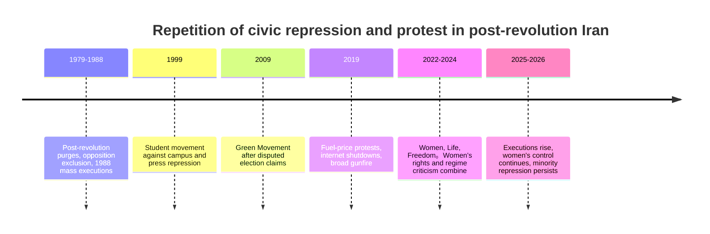
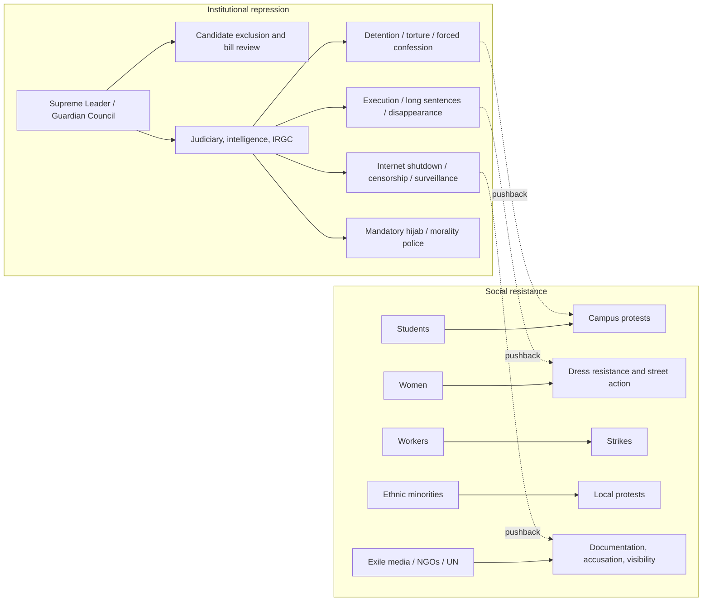

# History of civil oppression and protest movements by the Iranian regime

## 1. Executive Summary

In Iran after the 1979 revolution, repression of citizens was not a temporary repression, but became a fixed system that combined the judiciary, the Revolutionary Guards Corps (IRGC), intelligence agencies, election management, moral police, censorship, and executions. Protest movements have repeated themselves, starting with the purges in the 1980s, the student movements in 1999, the Green Movement in 2009, the protests in 2019, and the Women, Life, Freedom movement in 2022 and beyond, and each time the number of participants and demands expanded, but the state also adapted to a more detailed combination of surveillance, detention, internet shutdowns, forced confessions, and candidate exclusion.
The important point is that it is a mistake to view Iran's oppression only as "abstract oppression that occurs because it is a religious country." In reality, discipline that reaches down to the details of daily life is implemented through the legal system and security apparatus. Restrictions on women's clothing, exclusion from schools and workplaces, restrictions on speech, publishing, and the internet, focused repression of minority communities, and frequent use of executions have all been linked together to push protests back to the margins of society.
However, materials from exile media, citizen testimonies, UN reports, and human rights organizations each have their limitations. In particular, the UN's Independent Fact-Finding Mission collects much of its evidence from the testimonies of victims and witnesses, public footage, open source materials, and foreign stakeholders, so while it has a high degree of verifiability, it tends to miss out on the experiences of the majority who have been forced into silence domestically. Therefore, this article compares various materials to depict "what happened over and over again," and reads with the premise that the individual numbers of deaths and detainees will vary depending on the scope of the investigation.
Source note: The evaluation after 2022 focuses on [OHCHR 独立事実調査団の2024年更新報告](https://www.ohchr.org/sites/default/files/documents/hrbodies/hrcouncil/ffmi-iran/FFM-Iran-Update-13-September-2024.pdf) and [OHCHR 2024年報告要旨](https://www.ohchr.org/sites/default/files/documents/countries/iran/20240717-SR-Iran-Findings.pdf), and the continued suppression as of 2026 is reinforced with [Human Rights Watch, World Report 2026: Iran](https://www.hrw.org/world-report/2026/country-chapters/iran). For the complete history from the 1980s to 2009, refer to [Amnesty International の1988年虐殺報告](https://www.amnesty.org/en/latest/research/2018/12/iran-the-1988-prison-massacres/) and [Human Rights Watch, World Report 2010: Iran](https://www.hrw.org/world-report/2010/country-chapters/iran).

## 2. Why oppression became institutionalized

A feature of the post-revolutionary system is that while elections remain in place, non-electoral bodies control entry and exit points. When candidate screening, bill screening, integration of security agencies, appointment of top judicial officers, and management of broadcasting and information space are all integrated, protests will no longer be a "street problem" but will be incorporated into the system. As a result, the state detains leaders when the scale of protests is small, and moves to communication blackouts and mass detentions when protests grow large.
Within this structure, women, students, workers, ethnic minorities, and religious minorities are all subject to pressure for different reasons, but are connected to the same apparatus of oppression during protests. Restrictions on women's clothing appear to be a "cultural" issue, but they are actually political techniques for controlling the conditions for participation in public spaces, and repression of minority areas appears to be a "public security" issue, but in reality, it is an operation to proactively crush potential disobedience to central authority.

## 3. Chronology of major phases

| Timing          | Triggers                                                                               | Typical oppression                                                                           | Forms of resistance                                                | Where to read                                                        |
| --------------- | -------------------------------------------------------------------------------------- | -------------------------------------------------------------------------------------------- | ------------------------------------------------------------------ | -------------------------------------------------------------------- |
| 1980s           | Reorganization of power after the revolution, Iran-Iraq war, elimination of dissidents | Revolutionary trials, executions of political prisoners, long-term detention, disappearances | Underground activities, exile, family records                      | Physical erasure of dissidents became part of maintaining the regime |
| 1999            | Suppression of student movements and reformist newspapers                              | Invasion of universities, detention, torture, newspaper control                              | Student demonstrations, solidarity centered on university campuses | Hopes for reform shattered by security crackdown                     |
| 2009            | Suspicions of presidential election fraud and the Green Movement                       | Mass arrests, forced confessions, and media control                                          | Street protests by the urban middle class, symbolic movements      | Election protests led to criticism of the system                     |
| 2019            | Fuel prices soar                                                                       | Live ammunition firing, communication cutoff, widespread killings                            | Massive protests, including in local cities                        | Internet shutdown visualized as part of repression                   |
| 2022 and beyond | Mahsa Amini's death and demands for women's rights                                     | Surveillance, detention, increased executions, and reinforcing the moral police              | Women's dress resistance, general strikes, and school protests     | "Women, Life, Freedom" expands to criticize the system               |

Source note: 1980s purges and 1988 genocide see [OHCHR 特別報告者の2024年報告](https://www.ohchr.org/sites/default/files/documents/countries/iran/20240717-SR-Iran-Findings.pdf) and [Amnesty International の1988年報告](https://www.amnesty.org/en/latest/research/2018/12/iran-the-1988-prison-massacres/). In 1999, 2009, and 2019, [Human Rights Watch の1999年学生運動関連報告](https://www.hrw.org/reports/1999/iran/Iran99o.htm), [Human Rights Watch の学生抗議に関する記事](https://www.hrw.org/news/2004/07/06/iran-five-years-after-protests-release-students), [Amnesty International の2009年報告](https://www.amnesty.org/en/documents/MDE13/123/2009/en/), [Human Rights Watch, World Report 2010: Iran](https://www.hrw.org/world-report/2010/country-chapters/iran), [Amnesty International の2019年死亡者数集計](https://www.amnesty.org/en/latest/news/2020/09/iran-2019-protests-death-toll/), [Human Rights Watch Internet Shutdown Report](https://www.hrw.org/news/2019/11/15/iran-total-internet-blackout-following-fuel-price-protests). After 2022, [OHCHR 2024年更新報告](https://www.ohchr.org/sites/default/files/documents/hrbodies/hrcouncil/ffmi-iran/FFM-Iran-Update-13-September-2024.pdf) and [Human Rights Watch, World Report 2026: Iran](https://www.hrw.org/world-report/2026/country-chapters/iran) were referenced.

## 4. Purges and executions of political prisoners in the 1980s

The repression in the early 1980s began with the elimination of enemies of the revolution. Leftists, Islamic leftists, supporters of the monarchy, the Kurdish movement, and religious dissidents were treated as "threats to the revolution" and were punished outside of court or executed after short trials. The mass execution of political prisoners in 1988 was the culmination of this. The OHCHR Special Rapporteur points out that the executions and disappearances of the 1980s were systematic and that the mass executions of 1988 may constitute extremely serious human rights violations under international law.
The important point in this phase is that the executions were not just a "past mistake," but rather created the basis for fear of future repression. As families were buried without knowing the truth, and mourning and public memory were suppressed, state violence settled into society in a way that was difficult to record. In subsequent protests, a structure in which families of detainees are forced into silence has repeatedly emerged.
Source note: [OHCHR 特別報告者の調査報告](https://www.ohchr.org/sites/default/files/documents/countries/iran/20240717-SR-Iran-Findings.pdf) is the easiest to use for the 1980s, while [Amnesty International の1988年報告](https://www.amnesty.org/en/latest/research/2018/12/iran-the-1988-prison-massacres/) covers the contours of the 1988 mass executions.

## 5. 1999 Student Movement

The student movement of 1999 occurred at a time when there was still hope for reform. The closure of the reformist newspaper Salam sparked protests around Tehran University, where security forces and pro-regime militias attacked students. Human rights groups have documented at least one student death, detention, torture, increased surveillance of universities, and control of speech.
This phase shows that the Iranian regime has been particularly wary of the "space of intellectuals and students." Universities gather the future generations of society, and newspapers make political discourse visible, so suppressing this is tantamount to cutting off the circuit of criticism of the government. Since 1999, university campuses have come to be treated not just as educational spaces, but as objects of political surveillance.
Source memo: It is practical to compare [Human Rights Watch の1999年イラン報告](https://www.hrw.org/reports/1999/iran/Iran99o.htm) and [Human Rights Watch の回顧記事](https://www.hrw.org/news/2004/07/06/iran-five-years-after-protests-release-students) for the 1999 student movement, but the basic factual framework is consistent in that "student protests were suppressed by force in the wake of newspaper closures."

## 6. 2009 Green Movement

The 2009 Green Movement began with allegations of election fraud, but quickly turned into distrust of the system itself. HRW reports on violence against demonstrators, torture, detention, unfairness in courts, and control of the media, and official government figures say at least 30 people have died and thousands have been detained. The protests spread mainly among the urban middle class, but the regime did not absorb the reformers' expectations within the system and pushed back with surveillance and detention.
A turning point in 2009 was when international media and citizens' smartphone testimonies partially bypassed domestic censorship. However, the spread of the video did not stop the oppression itself. Instead, the state used a combination of detentions, forced confessions, arrests of journalists, and communications controls to ensure that information only arrived late.
Source note: The progress of 2009 was based on [Human Rights Watch, World Report 2010: Iran](https://www.hrw.org/world-report/2010/country-chapters/iran), and the suppression of speech at that time used [Amnesty International の2009年報告](https://www.amnesty.org/en/documents/MDE13/123/2009/en/) as an auxiliary line.

## 7. 2019 Protests and Internet Shutdowns

Fuel price hikes in November 2019 triggered a sudden eruption of cost of living and distrust of governance. Amnesty reported that at least 304 people were killed, and HRW noted that a nationwide internet shutdown in mid-November cut off the flow of protest information and made it difficult to track the killings. Protests spread to more than 100 cities and towns, occurring simultaneously in urban centers as well as rural areas.
The significance of 2019 lies in the fact that the state openly declared that "blocking communications is part of public security measures." Since then, internet shutdowns have come to be seen not simply as a byproduct of information control, but as a core technique for suppressing protests. The same context of censorship, speed reductions, app restrictions, and increased surveillance will be repeated in demonstrations in 2022 and beyond.
Source note: In 2019, reading [Amnesty International の死亡者数集計](https://www.amnesty.org/en/latest/news/2020/09/iran-2019-protests-death-toll/) and [Human Rights Watch の通信遮断報告](https://www.hrw.org/news/2019/11/15/iran-total-internet-blackout-following-fuel-price-protests) together makes it easier to understand casualties and information control at the same time.

## 8. “Women, Life, Freedom” after 2022

The protests triggered by the death of Mahsa Amini in 2022 have made the control of women's bodies itself visible as a political issue more clearly than past demands for reform. OHCHR's independent fact-finding mission examined systemic discrimination, forced dress codes, restraints, violence and killings against women and girls, and found that 551 people had been murdered in 2024. In addition, the investigation team indicated that these acts may amount to crimes against humanity.
In this phase, oppression extended beyond the streets into school commutes, work commutes, shopping, transportation, and social media use. OHCHR's updated report lists mandatory hijab regulations, surveillance cameras, movement restrictions, exclusion from schools and workplaces, pressure on pharmacies and shops, and restrictions on social media and travel. In other words, the control of women is not a matter of religious symbols, but rather works as a mechanism to control the very conditions of participation in public space.
In 2026, Human Rights Watch reports that compulsory hijab, arbitrary detention, increased executions, and repression of religious and ethnic minorities will continue. This means that the 2022 protests were not a "temporary women's movement," but rather penetrated deep into the system, causing the state to strengthen its governance techniques. Publicly available information suggests that authorities are prioritizing fragmented surveillance and punishment over symbolic concessions.
Source note: The main sources after 2022 are [OHCHR 2024年更新報告](https://www.ohchr.org/sites/default/files/documents/hrbodies/hrcouncil/ffmi-iran/FFM-Iran-Update-13-September-2024.pdf) and [Human Rights Watch, World Report 2026: Iran](https://www.hrw.org/world-report/2026/country-chapters/iran). The compulsory hijab, its impact on education, the workplace, and mobility, and the pressure on minorities can generally be traced through these two books.

## 9. Citizen narratives, exile media, and the limits of UN reporting

Citizen testimony, exile media, international NGOs, and UN reports have different roles. Exile media has a high rate of breaking news and can quickly pick up on the stories of those involved, but they tend to focus on urban areas, those with connections outside the country, and political activists. International NGOs are good at showing the systematicity of damage, but detailed geographic information and estimates of the number of people affected vary from report to report. UN reports are the most methodological and are good at cross-checking evidence, but they are subject to government non-cooperation and limited access to the field.
For this reason, it is better not to judge superiority or inferiority only by the size of the numbers. For example, the number of deaths in 2019 varies depending on the data, and the number of victims in 2022 also varies depending on the time of the investigation and the coverage area. What is important is to read what each document counts, what period it covers, and to what extent it has been verified. What should be compared is the method and range rather than the numbers themselves.
Source note: The focus of the methodology is [OHCHR 独立事実調査団の更新報告](https://www.ohchr.org/sites/default/files/documents/hrbodies/hrcouncil/ffmi-iran/FFM-Iran-Update-13-September-2024.pdf) and [OHCHR 2024年報告要旨](https://www.ohchr.org/sites/default/files/documents/countries/iran/20240717-SR-Iran-Findings.pdf). The exile media should be used as an auxiliary line and should not stand alone as a conclusion.

## 10. Reading protest and control risks

From a policy analysis perspective, Iran's repression of civilians should not be seen as a "single incident" but as a bundle of multiple devices. Surveillance cameras, the judiciary, moral police, election control, communications cutoffs, executions, and focused security efforts in minority areas may seem separate, but they work together the moment a protest occurs. Therefore, when looking at future trends, it is necessary to simultaneously track not only the number of street demonstrations, but also candidate screening, pressure on schools and universities, internet restrictions, the number of executions, and the deployment of security forces in minority areas.
The analytical takeaway has three parts. First, the relaxation of governance cannot be determined solely by the presence or absence of a reformist government. Second, women's rights are not a fringe issue, but a key indicator of regime legitimacy. Third, evaluations of protest movements should treat asylum and UN materials as complementary rather than in opposition. The conclusion here is not that Iranian resistance is weak, but that the costs of visible resistance are high because repression is institutionalized.

## 11. Reference information

- [OHCHR 独立事実調査団の2024年更新報告](https://www.ohchr.org/sites/default/files/documents/hrbodies/hrcouncil/ffmi-iran/FFM-Iran-Update-13-September-2024.pdf)
- [OHCHR 2024年報告要旨](https://www.ohchr.org/sites/default/files/documents/countries/iran/20240717-SR-Iran-Findings.pdf)
- [Human Rights Watch, World Report 2026: Iran](https://www.hrw.org/world-report/2026/country-chapters/iran)
- [Human Rights Watch, World Report 2010: Iran](https://www.hrw.org/world-report/2010/country-chapters/iran)
- [Amnesty International, Iran: The 1988 prison massacres](https://www.amnesty.org/en/latest/research/2018/12/iran-the-1988-prison-massacres/)
- [Amnesty International, Iran 2019 protests death toll](https://www.amnesty.org/en/latest/news/2020/09/iran-2019-protests-death-toll/)
