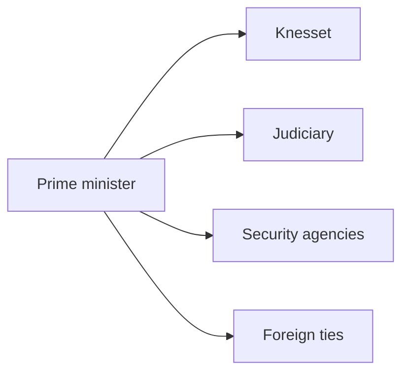
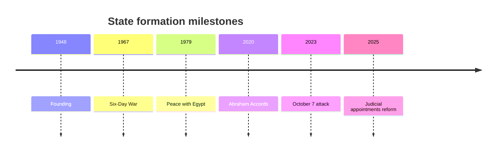

# A Country That Governs on the Edge

## 1. Executive Summary

Israel is a parliamentary democracy with free elections, but its 120-seat proportional system and 3.25 percent threshold make small-party coalitions routine and put bargaining at the prime minister's office at the center of policy. <SourceNote>[Knesset, Elections for the Knesset](https://main.knesset.gov.il/en/mk/pages/elections.aspx) supports this reading.</SourceNote>

As of 2026, Benjamin Netanyahu is serving as prime minister of the 37th government. <SourceNote>[Knesset, The Thirty-Seventh Government](https://main.knesset.gov.il/EN/mk/government/pages/governments.aspx) supports this reading.</SourceNote>

The fight over the judiciary has not gone away, and Freedom House still treats political pressure on the courts and unequal treatment of minorities as live issues. <SourceNote>[Freedom House, Israel 2026](https://freedomhouse.org/country/israel/freedom-world/2026) supports this reading.</SourceNote>

You cannot read Israel's news by separating domestic politics from regional war, because Gaza, the West Bank, the Lebanese border, and confrontation with Iran all move at once. <SourceNote>[UN OCHA, occupied Palestinian territory](https://www.ochaopt.org/) and [Freedom House, Israel 2026](https://freedomhouse.org/country/israel/freedom-world/2026) support this reading.</SourceNote>

The economy still leans on innovation and high-tech exports, but the IMF expects 2026 growth at 3.5 percent and flags heavy defense spending and mobilization-related labor constraints. <SourceNote>[IMF, Israel country page](https://www.imf.org/en/Countries/ISR) supports this reading.</SourceNote>

For Japan, the useful frame is not Israel as a distant conflict zone, but Israel as a node where the U.S. alliance, Gulf normalization, cyber and defense technology, and maritime risk intersect. <SourceNote>[U.S. Relations With Israel](https://www.state.gov/u-s-relations-with-israel/) and [IMF, Israel country page](https://www.imf.org/en/Countries/ISR) support this reading.</SourceNote>

## 2. History and State Formation

The 1948 founding of Israel is tied to the memory of war that began with independence. <SourceNote>[The State of Israel](https://www.gov.il/BlobFolder/generalpage/facts-about-israel-history/en/English_SiteTransfer_DOCUMENTS_History2010.pdf) supports this reading.</SourceNote>

The 1967 war, the 1973 war, the 1979 peace with Egypt, and the 2020 Abraham Accords each redrew Israel's security outlook and diplomacy in stages. <SourceNote>[U.S. Relations With Egypt](https://www.state.gov/u-s-relations-with-egypt/) and [The Abraham Accords](https://www.state.gov/the-abraham-accords/) support this reading.</SourceNote>

The October 7, 2023 attack, the Gaza war that followed, and the 2025 reform of judicial appointments blurred the line between external war and internal conflict even more. <SourceNote>[Freedom House, Israel 2026](https://freedomhouse.org/country/israel/freedom-world/2026) supports this reading.</SourceNote>

## 3. Political System and Power Structure

The Knesset has 120 seats and is elected by nationwide, proportional, direct, secret, and equal voting. <SourceNote>[Knesset, Elections for the Knesset](https://main.knesset.gov.il/EN/About/Knesset/pages/elections.aspx) supports this reading.</SourceNote>

The president asks a member of Knesset to form a government, and the government is collectively responsible to the Knesset. <SourceNote>[Knesset, The Government](https://main.knesset.gov.il/EN/Government/Pages/Government.aspx) supports this reading.</SourceNote>

The legal backbone is the Basic Laws, which work as a substitute for a single written constitution. <SourceNote>[Knesset, Basic Laws](https://main.knesset.gov.il/EN/activity/Pages/BasicLaws.aspx) supports this reading.</SourceNote>

The Judicial Selection Committee appoints judges and senior clerks, so it supports judicial independence and sits at the center of reform fights. <SourceNote>[The Judicial Authority, Judges and Registrars Division](https://www.gov.il/en/departments/units/judges_and_registrars_division) supports this reading.</SourceNote>

| Actor | Role | How to read it |
| --- | --- | --- |
| Prime minister and coalition | Set budget, security, and bill priorities | Coalition maintenance is the policy ceiling |
| Knesset | Arena for legislation and oversight | 61 seats define the majority line |
| Judiciary | Handles constitutionality, procedure, and rights | Reform fights center on it |
| Defense and security organs | Handle the front line, deterrence, and intelligence | Exceptional conditions push politics upward |

In this setup, party labels matter less than who can keep the coalition together, who can explain security, and who can change the courts. <SourceNote>[Freedom House, Israel 2026](https://freedomhouse.org/country/israel/freedom-world/2026) and [Knesset, Elections for the Knesset](https://main.knesset.gov.il/en/mk/pages/elections.aspx) support this reading.</SourceNote>

## 4. Security and Foreign Relations

Gaza is a space where humanitarian crisis and security operations overlap, while the West Bank has become a daily political variable through movement restrictions, settlement expansion, home demolitions, and armed attacks. <SourceNote>[UN OCHA, occupied Palestinian territory](https://www.ochaopt.org/) supports this reading.</SourceNote>

Iran is Israel's principal adversary, and the mix of missiles, drones, proxy forces, and nuclear risk defines the strategic environment. <SourceNote>[Freedom House, Israel 2026](https://freedomhouse.org/country/israel/freedom-world/2026) and [U.S. Relations With Israel](https://www.state.gov/u-s-relations-with-israel/) support this reading.</SourceNote>

On the Lebanese border, even a weaker Hezbollah front after the November 2024 ceasefire leaves room for renewed escalation. <SourceNote>[Freedom House, Israel 2026](https://freedomhouse.org/country/israel/freedom-world/2026) supports this reading.</SourceNote>

In Syria, the Israeli government denies territorial ambitions, but border and airspace security remain part of the picture. <SourceNote>[Government of Israel, EU-Israel Association Council remarks](https://www.gov.il/BlobFolder/generalpage/israel-eu-association-council-brussels-24-feb-2025/en/English_Documents_ISRAEL-EU-ASSOCIATION-COUNCIL-24FEB2025.pdf) supports this reading.</SourceNote>

The U.S. relationship bundles military aid, diplomatic cover, and technical cooperation, while the Abraham Accords extend the relationship with the UAE, Bahrain, and Morocco on a separate track. <SourceNote>[U.S. Relations With Israel](https://www.state.gov/u-s-relations-with-israel/) and [The Abraham Accords](https://www.state.gov/the-abraham-accords/) support this reading.</SourceNote>

| Partner or arena | Current position | How to read it |
| --- | --- | --- |
| United States | The core backer | Military aid and political cover both matter |
| Gaza and the West Bank | The closest conflict front | Humanitarian and security policy merge here |
| Iran | Main strategic enemy | Track missiles, nuclear risk, and proxies together |
| Lebanon | Northern front | Ceasefire and renewed escalation coexist |
| Syria | Border-management challenge | Security logic comes before diplomacy |
| Gulf states | Normalization partners | They buffer economics, technology, and Iran risk |

## 5. Economy and Technology

CBS says Israel's population on the eve of Independence Day 2026 stood at 10.244 million, with 76 percent Jewish and other, 21.1 percent Arab, and 2.9 percent foreign residents. <SourceNote>[CBS, Population on the Eve of Independence Day 2026](https://www.cbs.gov.il/en/mediarelease/Pages/2026/Population-on-the-Eve-of-Independence-Day-2026.aspx) supports this reading.</SourceNote>

That mix shows why secular urban Israelis, religious Israelis, Haredi communities, Arab citizens, and immigrants do not share one political language. <SourceNote>[Freedom House, Israel 2026](https://freedomhouse.org/country/israel/freedom-world/2026) and [CBS, Population on the Eve of Independence Day 2026](https://www.cbs.gov.il/en/mediarelease/Pages/2026/Population-on-the-Eve-of-Independence-Day-2026.aspx) support this reading.</SourceNote>

Israel's strength comes from the close overlap between military technology, cyber, defense industry, software, and medical and agricultural technology. <SourceNote>[Israel Innovation Authority, High-Tech Report 2026](https://innovationisrael.org.il/en/press_release/israeli-high-tech-report-2026/) supports this reading.</SourceNote>

That strength is not detached from wartime mobilization. <SourceNote>[IMF, Israel country page](https://www.imf.org/en/Countries/ISR) supports this reading.</SourceNote>

The IMF says heavy defense spending and labor-supply constraints will keep weighing on growth. <SourceNote>[IMF, Israel country page](https://www.imf.org/en/Countries/ISR) supports this reading.</SourceNote>

Israel looks like a tech powerhouse in both venture and defense, but political instability can push investment, hiring, research transfer, and overseas relocation at the same time. <SourceNote>[Israel Innovation Authority, High-Tech Report 2026](https://innovationisrael.org.il/en/press_release/israeli-high-tech-report-2026/) and [IMF, Israel country page](https://www.imf.org/en/Countries/ISR) support this reading.</SourceNote>

## 6. Civic Life and Social Fault Lines

Public sentiment is not uniform, because age, class, religion, ethnicity, city and periphery, and military service experience all split the country differently. <SourceNote>[Freedom House, Israel 2026](https://freedomhouse.org/country/israel/freedom-world/2026) supports this reading.</SourceNote>

Urban middle-class Israelis often connect judicial independence with living costs, while supporters of religious parties focus on state intervention in schools, family life, and communal autonomy. <SourceNote>[Freedom House, Israel 2026](https://freedomhouse.org/country/israel/freedom-world/2026) supports this reading.</SourceNote>

Arab citizens have formal citizenship, but they still face different constraints in security, land, budget allocation, and political participation. <SourceNote>[Freedom House, Israel 2026](https://freedomhouse.org/country/israel/freedom-world/2026) and [CBS, Population on the Eve of Independence Day 2026](https://www.cbs.gov.il/en/mediarelease/Pages/2026/Population-on-the-Eve-of-Independence-Day-2026.aspx) support this reading.</SourceNote>

The growth of the Haredi population will keep unsettling the state's design around conscription, labor participation, education, and welfare. <SourceNote>[CBS, Population on the Eve of Independence Day 2026](https://www.cbs.gov.il/en/mediarelease/Pages/2026/Population-on-the-Eve-of-Independence-Day-2026.aspx) and [IMF, Israel country page](https://www.imf.org/en/Countries/ISR) support this reading.</SourceNote>

## 7. Implications for Japan and East Asia

Japan should watch not just Israel's domestic fights but the spillovers into cyber cooperation, defense procurement, shipping, U.S. policy, and Gulf geopolitics. <SourceNote>[U.S. Relations With Israel](https://www.state.gov/u-s-relations-with-israel/) and [IMF, Israel country page](https://www.imf.org/en/Countries/ISR) support this reading.</SourceNote>

The public record suggests that a deterioration in Israel can lift not only oil and LNG risk, but also insurance costs, diversion routes, procurement screening, and cyber alert levels. <SourceNote>[IMF, Israel country page](https://www.imf.org/en/Countries/ISR) and [UN OCHA, occupied Palestinian territory](https://www.ochaopt.org/) support this reading.</SourceNote>

For business and policy readers, the main watch points are coalition stability, the next judicial move, security conditions in Gaza and the West Bank, the risk of renewed friction with Lebanon and Iran, and Washington's posture toward Israel. <SourceNote>[Freedom House, Israel 2026](https://freedomhouse.org/country/israel/freedom-world/2026) and [U.S. Relations With Israel](https://www.state.gov/u-s-relations-with-israel/) support this reading.</SourceNote>

Israel is a democracy, but it is also a state where emergency logic is always close to the center of politics. <SourceNote>[Knesset, Elections for the Knesset](https://main.knesset.gov.il/EN/About/Knesset/pages/elections.aspx) and [Freedom House, Israel 2026](https://freedomhouse.org/country/israel/freedom-world/2026) support this reading.</SourceNote>

If you miss that point, you will read elections, courts, diplomacy, technology, and social division as separate stories when they are actually one system. <SourceNote>[IMF, Israel country page](https://www.imf.org/en/Countries/ISR) and [Israel Innovation Authority, High-Tech Report 2026](https://innovationisrael.org.il/en/press_release/israeli-high-tech-report-2026/) support this reading.</SourceNote>

## 8. Monitoring Points

- Can the coalition absorb the next move on judicial reform and security spending?
- Will Gaza and West Bank deterioration weaken U.S. protection or Gulf normalization?
- Can defense spending and mobilization stay high without hurting growth and labor supply?
- Can the tech sector absorb wartime demand and political uncertainty at the same time?

If those constraints worsen, Israel stops looking like the country that makes Middle East news and starts looking like the country that Middle East news pulls along.
