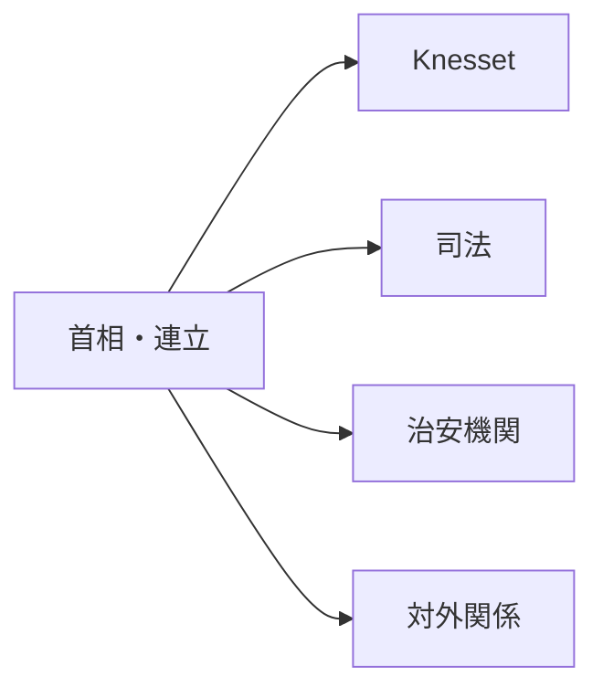
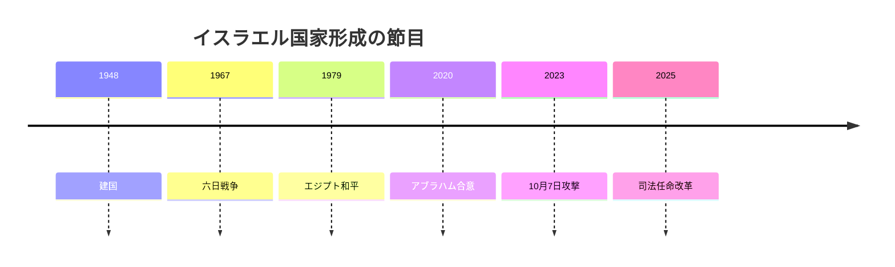

# 包囲を前提に統治する国

## 1. エグゼクティブサマリー

イスラエルは自由選挙を持つ議会制民主主義だが、120議席の比例代表制と3.25%の阻止条項が小党連立を常態化させ、首相官邸の交渉が政策の重心になる。<SourceNote>[Knesset, Elections for the Knesset](https://main.knesset.gov.il/en/mk/pages/elections.aspx) に基づく。</SourceNote>

2026年時点ではベンヤミン・ネタニヤフが第37次政府の首相を務めている。<SourceNote>[Knesset, The Thirty-Seventh Government](https://main.knesset.gov.il/EN/mk/government/pages/governments.aspx) に基づく。</SourceNote>

司法制度をめぐる対立は収まっておらず、Freedom Houseも司法への政治圧力と少数派格差を継続的な論点として扱っている。<SourceNote>[Freedom House, Israel 2026](https://freedomhouse.org/country/israel/freedom-world/2026) に基づく。</SourceNote>

ガザ戦争、ヨルダン川西岸の治安、レバノン国境、イランとの対立が同時に動くため、イスラエルのニュースは国内政治と地域戦争を分けて読めない。<SourceNote>[UN OCHA, occupied Palestinian territory](https://www.ochaopt.org/) と [Freedom House, Israel 2026](https://freedomhouse.org/country/israel/freedom-world/2026) を参照した。</SourceNote>

経済面では、イノベーションと高技術輸出が強みだが、IMFは2026年成長率を3.5%と見込み、防衛支出の高止まりと動員による労働供給制約を重く見ている。<SourceNote>[IMF, Israel country page](https://www.imf.org/en/Countries/ISR) に基づく。</SourceNote>

日本にとっての論点は、イスラエルを単なる中東紛争地ではなく、対米同盟、湾岸正常化、サイバー・防衛技術、海上交通リスクが交差する節点として読むことにある。<SourceNote>[U.S. Relations With Israel](https://www.state.gov/u-s-relations-with-israel/) と [IMF, Israel country page](https://www.imf.org/en/Countries/ISR) を参照した。</SourceNote>

## 2. 歴史と国家形成

1948年の建国は、独立宣言と同時に始まった戦争の記憶と結びついている。<SourceNote>[The State of Israel](https://www.gov.il/BlobFolder/generalpage/facts-about-israel-history/en/English_SiteTransfer_DOCUMENTS_History2010.pdf) に基づく。</SourceNote>

1967年戦争、1973年戦争、1979年のエジプト和平、2020年のアブラハム合意は、イスラエルの安全保障観と外交の輪郭を段階的に塗り替えた。<SourceNote>[U.S. Relations With Egypt](https://www.state.gov/u-s-relations-with-egypt/) と [The Abraham Accords](https://www.state.gov/the-abraham-accords/) を参照した。</SourceNote>

2023年10月7日の攻撃とその後のガザ戦争、さらに2025年の司法任命制度改革は、外戦と内戦の境界を一段と曖昧にした。<SourceNote>[Freedom House, Israel 2026](https://freedomhouse.org/country/israel/freedom-world/2026) に基づく。</SourceNote>

## 3. 政治体制と権力構造

Knessetは120議席で、全国比例・直接・秘密・平等選挙によって選ばれる。<SourceNote>[Knesset, Elections for the Knesset](https://main.knesset.gov.il/EN/About/Knesset/pages/elections.aspx) に基づく。</SourceNote>

首相は大統領の指名を受けて政府を組織し、政府はKnessetに対して連帯責任を負う。<SourceNote>[Knesset, The Government](https://main.knesset.gov.il/EN/Government/Pages/Government.aspx) に基づく。</SourceNote>

法律の骨格はBasic Lawsであり、憲法の代替物として働く。<SourceNote>[Knesset, Basic Laws](https://main.knesset.gov.il/EN/activity/Pages/BasicLaws.aspx) に基づく。</SourceNote>

司法任命委員会は裁判官と上級書記官を選任し、司法の独立を支えると同時に、改革争点の中心にもなる。<SourceNote>[The Judicial Authority, Judges and Registrars Division](https://www.gov.il/en/departments/units/judges_and_registrars_division) に基づく。</SourceNote>

| アクター | 役割 | 読み方 |
| --- | --- | --- |
| 首相・連立 | 予算、治安、法案の優先順位を決める | 連立維持が政策上限になる |
| Knesset | 法改正と監視の舞台 | 61議席が多数派の境界になる |
| 司法 | 合憲性、手続き、権利保護を扱う | 改革論争の焦点になる |
| 国防・治安機構 | 前線、抑止、情報を担う | 例外状態が政治を押し上げる |

この構図では、政党名よりも、誰が連立をつなぎ止めるか、誰が治安を説明するか、誰が司法に手を入れるかが重要になる。<SourceNote>[Freedom House, Israel 2026](https://freedomhouse.org/country/israel/freedom-world/2026) と [Knesset, Elections for the Knesset](https://main.knesset.gov.il/en/mk/pages/elections.aspx) を参照した。</SourceNote>

## 4. 安全保障と対外関係

ガザは人道危機と治安作戦が重なる空間であり、西岸は移動制限、入植、家屋破壊、武装襲撃が日常的な政治変数になっている。<SourceNote>[UN OCHA, occupied Palestinian territory](https://www.ochaopt.org/) に基づく。</SourceNote>

イランはイスラエルの主敵であり、ミサイル、無人機、代理勢力、核の組み合わせが戦略環境を決める。<SourceNote>[Freedom House, Israel 2026](https://freedomhouse.org/country/israel/freedom-world/2026) と [U.S. Relations With Israel](https://www.state.gov/u-s-relations-with-israel/) を参照した。</SourceNote>

レバノン国境では、ヒズボラとの衝突が2024年11月の停戦後に弱まったとしても、再燃余地は残る。<SourceNote>[Freedom House, Israel 2026](https://freedomhouse.org/country/israel/freedom-world/2026) に基づく。</SourceNote>

シリアでは、イスラエル政府が領土的野心を否定する一方で、国境と空域の安全保障は残る。<SourceNote>[Government of Israel, EU-Israel Association Council remarks](https://www.gov.il/BlobFolder/generalpage/israel-eu-association-council-brussels-24-feb-2025/en/English_Documents_ISRAEL-EU-ASSOCIATION-COUNCIL-24FEB2025.pdf) に基づく。</SourceNote>

米国との関係は、軍事支援、外交保護、技術協力を束ねる安全保障の基礎であり、アブラハム合意はUAE、バーレーン、モロッコとの関係を別の層で広げた。<SourceNote>[U.S. Relations With Israel](https://www.state.gov/u-s-relations-with-israel/) と [Abraham Accords](https://www.state.gov/the-abraham-accords/) に基づく。</SourceNote>

| 相手 | 現在の位置 | 読み方 |
| --- | --- | --- |
| 米国 | 最重要の後ろ盾 | 軍事支援と政治的保護の両方が効く |
| ガザ・西岸 | 最も近い紛争面 | 人道と治安が同じ政策束になる |
| イラン | 主要な戦略的敵対者 | ミサイル、核、代理勢力を一緒に見る |
| レバノン | 北部戦線 | 停戦と再燃が同居する |
| シリア | 国境管理の課題 | 直接外交より治安判断が先に立つ |
| 湾岸諸国 | 正常化の相手 | 経済、技術、対イランの緩衝材になる |

## 5. 経済と技術産業

CBSによると、2026年のイスラエル人口は1,024万4千人で、76%がユダヤ系とその他、21.1%がアラブ系、2.9%が外国人だった。<SourceNote>[CBS, Population on the Eve of Independence Day 2026](https://www.cbs.gov.il/en/mediarelease/Pages/2026/Population-on-the-Eve-of-Independence-Day-2026.aspx) に基づく。</SourceNote>

この人口構成は、都市部の世俗層、宗教層、ハレディ層、アラブ系市民、移民出身者が同じ政治言語を共有していないことを示している。<SourceNote>[Freedom House, Israel 2026](https://freedomhouse.org/country/israel/freedom-world/2026) と [CBS, Population on the Eve of Independence Day 2026](https://www.cbs.gov.il/en/mediarelease/Pages/2026/Population-on-the-Eve-of-Independence-Day-2026.aspx) を参照した。</SourceNote>

イスラエルの強みは、軍事技術、サイバー、防衛産業、ソフトウェア、医療・農業技術が近接している点にある。<SourceNote>[Israel Innovation Authority, High-Tech Report 2026](https://innovationisrael.org.il/en/press_release/israeli-high-tech-report-2026/) に基づく。</SourceNote>

ただし、その強みは戦時動員と切り離せない。<SourceNote>[IMF, Israel country page](https://www.imf.org/en/Countries/ISR) に基づく。</SourceNote>

IMFは、防衛支出の高止まりと労働供給の制約が成長の重しになると見ている。<SourceNote>[IMF, Israel country page](https://www.imf.org/en/Countries/ISR) に基づく。</SourceNote>

技術大国としてのイスラエルは、ベンチャーと防衛の両方で強いが、政治不安が投資、採用、研究移転、海外拠点化を同時に押す。<SourceNote>[Israel Innovation Authority, High-Tech Report 2026](https://innovationisrael.org.il/en/press_release/israeli-high-tech-report-2026/) と [IMF, Israel country page](https://www.imf.org/en/Countries/ISR) を参照した。</SourceNote>

## 6. 市民生活と社会の割れ目

市民感情は一枚岩ではなく、世代、階級、宗教、民族、都市と地方、軍務経験の差で大きく分かれる。<SourceNote>[Freedom House, Israel 2026](https://freedomhouse.org/country/israel/freedom-world/2026) を参照した。</SourceNote>

都市の中間層は司法の独立と生活費を結びつけて見る一方、宗教政党の支持層は学校、家族、共同体への国家介入を問題にする。<SourceNote>[Freedom House, Israel 2026](https://freedomhouse.org/country/israel/freedom-world/2026) に基づく。</SourceNote>

アラブ系市民は、形式的な市民権があっても、治安、土地、予算配分、政治参加で別の制約に直面する。<SourceNote>[Freedom House, Israel 2026](https://freedomhouse.org/country/israel/freedom-world/2026) と [CBS, Population on the Eve of Independence Day 2026](https://www.cbs.gov.il/en/mediarelease/Pages/2026/Population-on-the-Eve-of-Independence-Day-2026.aspx) を参照した。</SourceNote>

ハレディ層の人口増加は、兵役、労働参加、教育、福祉をめぐる国家の設計を長く揺らす。<SourceNote>[CBS, Population on the Eve of Independence Day 2026](https://www.cbs.gov.il/en/mediarelease/Pages/2026/Population-on-the-Eve-of-Independence-Day-2026.aspx) と [IMF, Israel country page](https://www.imf.org/en/Countries/ISR) を参照した。</SourceNote>

## 7. 日本・東アジアへの含意

日本が見るべきなのは、イスラエルの国内論争そのものより、そこから波及するサイバー協力、装備調達、海上輸送、米国政策、湾岸の地政学である。<SourceNote>[U.S. Relations With Israel](https://www.state.gov/u-s-relations-with-israel/) と [IMF, Israel country page](https://www.imf.org/en/Countries/ISR) を参照した。</SourceNote>

公表情報からの推定として、イスラエル情勢の悪化は、原油やLNGの価格だけでなく、保険料、迂回航路、調達審査、対サイバー警戒を同時に押し上げる。<SourceNote>[IMF, Israel country page](https://www.imf.org/en/Countries/ISR) と [UN OCHA, occupied Palestinian territory](https://www.ochaopt.org/) を参照した。</SourceNote>

日本企業が実務で見るべき監視点は、連立の安定、司法改革の次段、ガザと西岸の治安、レバノンとイランの再燃、そして米国の対イスラエル姿勢である。<SourceNote>[Freedom House, Israel 2026](https://freedomhouse.org/country/israel/freedom-world/2026) と [U.S. Relations With Israel](https://www.state.gov/u-s-relations-with-israel/) を参照した。</SourceNote>

イスラエルは、民主主義国家であると同時に、戦時の例外が常に政治に入り込む国家である。<SourceNote>[Knesset, Elections for the Knesset](https://main.knesset.gov.il/EN/About/Knesset/pages/elections.aspx) と [Freedom House, Israel 2026](https://freedomhouse.org/country/israel/freedom-world/2026) を参照した。</SourceNote>

その前提を外すと、選挙、司法、外交、技術産業、社会分断のどれも、ニュースとして半分しか読めない。<SourceNote>[IMF, Israel country page](https://www.imf.org/en/Countries/ISR) と [Israel Innovation Authority, High-Tech Report 2026](https://innovationisrael.org.il/en/press_release/israeli-high-tech-report-2026/) を参照した。</SourceNote>

## 8. 監視ポイント

- 連立が司法改革と安全保障予算をどこまで一体で処理できるか。
- ガザと西岸の治安悪化が、米国の保護と湾岸正常化をどこまで揺らすか。
- 防衛支出と動員が、成長と人材供給にどこまで残るか。
- イスラエルの技術産業が、戦時需要と政治不安の両方をどう吸収するか。

これが崩れると、イスラエルは「中東のニュースを作る国」ではなく、「中東のニュースに引きずられる国」として読まれる。
