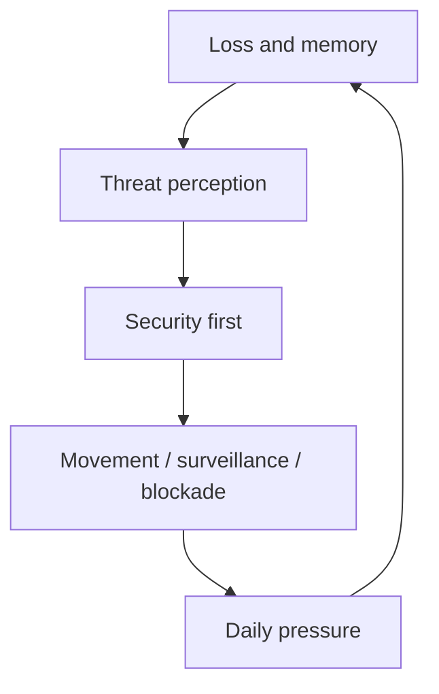
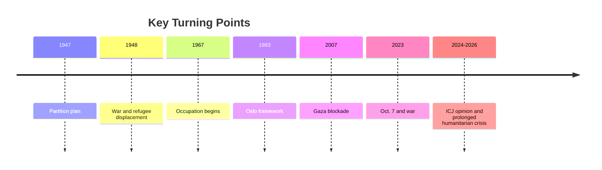
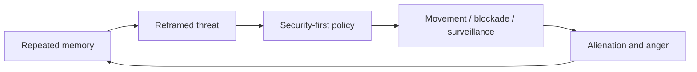

# Reading the Israel-Palestine Conflict Through Civilian Perspectives

## 1. Executive Summary

The Israel-Palestine conflict is not explained by territory, diplomacy, and military power alone. It is also shaped by what civilians fear, what they lose, what they remember, and how much ordinary life they can still preserve. In this report, "civilian sentiment" means public emotion, collective memory, daily fear, and political trust or mistrust as they appear in open information, not a clinical psychological diagnosis. <SourceNote>[PCPSR and Israel Democracy Institute polling](https://www.pcpsr.org/sites/default/files/Poll%2096%20press%20release%20FINAL%20ENGLISH%2028%20Oct%202025.pdf), [IDI, Israeli Voice Index 2025](https://en.idi.org.il/articles/61845), [OCHA updates](https://www.ochaopt.org/) support this framing.</SourceNote>

The most important finding is that the two sides' civilian emotions are not symmetrical, but they do mirror each other. On the Israeli side, the October 7, 2023 attack, the war that followed, rocket threats, reserve duty, and hostage anxiety made national security feel almost identical to personal safety. On the Palestinian side, blockade, occupation, airstrikes, checkpoints, home demolitions, arrest, and forced displacement have turned daily life itself into a political condition. On both sides, fear often becomes the story that the other side is trying to erase you. <SourceNote>[PCPSR July 2024 joint poll](https://www.pcpsr.org/en/node/987), [OCHA Gaza and West Bank updates](https://www.ochaopt.org/), [UNRWA, Palestine refugees](https://www.unrwa.org/palestine-refugees).</SourceNote>

Third, there is no single Palestinian public and no single Israeli public. Gaza residents, West Bank residents, Palestinian citizens of Israel, the diaspora, and Palestinian refugees in neighboring countries live under different constraints. The same is true on the Israeli side, where Jewish citizens, Arab citizens, settlement communities, reserve-duty families, hostage families, and anti-war activists are reading different realities. For policy analysis, a multi-layered map is more useful than a simple Israel-versus-Palestine binary. <SourceNote>[IDI, Israeli Voice Index 2025](https://en.idi.org.il/articles/61845), [OCHA West Bank updates](https://www.ochaopt.org/), [UNRWA, Palestine refugees](https://www.unrwa.org/palestine-refugees).</SourceNote>

The value of this perspective is simple: it helps explain why compromise is so hard without justifying violence. Fear and memory last longer than military operations or diplomatic statements. Anyone thinking about ceasefire, peace, reconstruction, or humanitarian support therefore needs to track loss and daily survival alongside borders and weapons. <SourceNote>[ICJ advisory opinion 2024](https://www.icj-cij.org/node/204176), [OCHA updates](https://www.ochaopt.org/), [UNRWA situation pages](https://www.unrwa.org/).</SourceNote>

## 2. What Counts as "Civilian Sentiment"

Civilian sentiment here is not a simple average of anger and sadness. It is a practical concept that brings together intergenerational memory, family loss, movement restrictions, school and workplace experience, social-media mistrust, and the political preferences visible in polls. That means looking not only at images of shock, but also at housing, food, school, checkpoints, healthcare access, detention, evacuation, and the possibility of return. <SourceNote>[OCHA humanitarian updates](https://www.ochaopt.org/), [UNRWA, Palestine refugees](https://www.unrwa.org/palestine-refugees), [IDI, Israeli Voice Index 2025](https://en.idi.org.il/articles/61845).</SourceNote>

The reason to use this lens is that sentiment is not a side effect of politics. It is part of the mechanism that moves politics. The stronger the fear, the more people prioritize security and interpret the other side as a threat. The longer the loss lasts, the more people ask for immediate protection rather than future promises. Reading sentiment is therefore a useful way to inspect the inputs that shape political behavior. <SourceNote>[PCPSR joint poll](https://www.pcpsr.org/en/node/987), [IDI survey](https://en.idi.org.il/articles/61845). The statement that sentiment drives politics is an inference from public polling.</SourceNote>

This diagram shows a loop, not a linear story. Sentiment is reproduced through policy and daily life, then fed back into the next round of politics. <SourceNote>[OCHA updates](https://www.ochaopt.org/), [UNRWA Gaza / West Bank pages](https://www.unrwa.org/), [PCPSR joint poll](https://www.pcpsr.org/en/node/987).</SourceNote>

## 3. The Historical Backbone

The fastest way to understand the conflict is through the 1947 partition plan, the 1948 war and refugee displacement, the 1967 war and occupation, the 1993 Oslo process, the Gaza blockade from 2007 onward, and the October 7, 2023 attack and subsequent war. The 1948 refugee experience is the starting point for today's diaspora and neighboring-country publics, while the 1967 occupation has structurally constrained everyday life in the West Bank and East Jerusalem ever since. <SourceNote>[UN chronology on the Palestine question](https://www.un.org/unispal/document/auto-insert-184145/), [UNRWA, Palestine refugees](https://www.unrwa.org/palestine-refugees), [ICJ advisory opinion 2024](https://www.icj-cij.org/node/204176).</SourceNote>

Oslo opened a framework for mutual recognition and interim administration, but it did not resolve sovereignty. Since the 2000s, settlement expansion, fragmentation, checkpoints, the Gaza blockade, rocket fire, and repeated military operations have shaped daily life more than peace language has. The 2024 ICJ advisory opinion made the legal character of occupation, and the problem of permanent control over the occupied territory including East Jerusalem, visible again. <SourceNote>[ICJ advisory opinion 2024](https://www.icj-cij.org/node/204176), [UNRWA situation pages](https://www.unrwa.org/), [OCHA updates](https://www.ochaopt.org/).</SourceNote>

The important point in this timeline is not a single event but repeated overwriting of land, movement, return, and sovereignty. Civilian sentiment is updated every time that overwriting happens. <SourceNote>[UNRWA, Palestine refugees](https://www.unrwa.org/palestine-refugees), [ICJ 2024 advisory opinion](https://www.icj-cij.org/node/204176).</SourceNote>

## 4. Four Layers of Civilian Sentiment

| Layer | Main memory / fear | Pressure on daily life | Political tendency |
| --- | --- | --- | --- |
| Jewish citizens of Israel | Oct. 7, hostages, rockets, reserve duty, fear of repetition | Alerts, mobilization, evacuation, repeated loss | Security-first politics, alongside war fatigue |
| Palestinian citizens of Israel | Discrimination, suspicion of dual loyalty, insecurity | Tension between citizenship and minority status | Demand for equality and democratic inclusion |
| Palestinians in Gaza and the West Bank | Occupation, blockade, airstrikes, arrest, house demolition, displacement | Unstable movement, food, water, school, and healthcare | Liberation demands with few credible exits |
| Diaspora and neighboring publics | Inherited refugeehood, blocked return, family division | Camps, remittances, documents, politicized memory | A mix of solidarity and exhaustion |

This table shows that "Israel" and "Palestine" conceal very different living conditions. A Palestinian citizen of Israel does not live under the same legal and spatial constraints as a Gaza resident, and a Gaza resident does not live under the same constraints as someone in the West Bank. On the Israeli side, Jewish majority fears and Arab minority fears are also not identical. <SourceNote>[IDI, Israeli Voice Index 2025](https://en.idi.org.il/articles/61845), [OCHA West Bank displacement updates](https://www.ochaopt.org/), [UNRWA, Palestine refugees](https://www.unrwa.org/palestine-refugees).</SourceNote>

For Jewish citizens of Israel, the core feeling is the collapse of safety. Hostages make national military action and civilian emotion almost inseparable. In the 2025 IDI survey, a majority said the time had come to end the war, and the main reason was concern for hostages and war fatigue. Here the emotional question is not simply who wins, but when it is safe to stop. <SourceNote>[IDI, Israeli Voice Index 2025](https://en.idi.org.il/articles/61845).</SourceNote>

For Palestinian citizens of Israel, the key experience is living inside the same state while seeing both its security logic and the pressure it places on minority life. IDI surveys show large gaps between Jewish and Arab citizens in the assessment of the security situation and future outlook. The same country contains multiple readings of the war. <SourceNote>[IDI, Israeli Voice Index 2025](https://en.idi.org.il/articles/61845).</SourceNote>

For Palestinians in Gaza and the West Bank, the core feeling is uncertainty about movement and survival. OCHA has repeatedly reported mass displacement, damaged housing, and restricted access to food, water, and medical care in Gaza. In the West Bank, military operations, checkpoints, settler violence, and forced displacement pressure daily life in different local forms. Here, emotion appears less as ideology than as a response to the need to survive. <SourceNote>[OCHA occupied Palestinian territory updates](https://www.ochaopt.org/), [UNRWA, Gaza Strip / West Bank](https://www.unrwa.org/).</SourceNote>

For diaspora communities and neighboring publics, the emotional update comes from the persistence of a state of "cannot return." UNRWA-registered refugees live with family history, rights claims, status, education, and work across borders. In camps and cities in Lebanon, Jordan, and Syria, the conflict persists not as foreign news, but as family memory. <SourceNote>[UNRWA, Palestine refugees](https://www.unrwa.org/palestine-refugees).</SourceNote>

## 5. Pressure on Everyday Life

To understand civilian sentiment, it is better to study daily movement than battlefield maps. In Gaza, housing loss, repeated displacement, shortages of food and water, unstable electricity and communications, and the inability of schools and hospitals to function normally update sentiment every day. In the West Bank, movement restrictions, military operations, settler violence, arrest, and home demolition keep breaking long-term plans. On the Israeli side, evacuation, alerts, reserve mobilization, grief, and political division also disrupt the rhythm of ordinary life. <SourceNote>[OCHA Gaza and West Bank updates](https://www.ochaopt.org/), [UNRWA, Gaza Strip / West Bank](https://www.unrwa.org/).</SourceNote>

OCHA's 2026 updates still describe Gaza's humanitarian situation as extremely severe, while displacement and violence continue in the West Bank. That means the destruction of daily life is not an exception limited to intense wartime periods. It is what happens when occupation, blockade, and military action accumulate over time. Reading civilian sentiment means not missing that normalization. <SourceNote>[OCHA occupied Palestinian territory updates](https://www.ochaopt.org/).</SourceNote>

What we are seeing is exhaustion that cannot be reduced to counts alone. When part of a family has been killed or injured, the rest displaced, schools closed, hospitals unavailable, communications cut, and future plans abandoned, political positions harden around survival rather than abstract theory. This is not only true on the Palestinian side. On the Israeli side as well, hostages, mobilization, rocket alerts, and repeated loss damage the time horizon of daily life. <SourceNote>[IDI, Israeli Voice Index 2025](https://en.idi.org.il/articles/61845), [OCHA Gaza updates](https://www.ochaopt.org/), [PCPSR joint poll](https://www.pcpsr.org/en/node/987).</SourceNote>

## 6. What Polling Tells Us

Polling does not measure sentiment itself, but it does show which issues are at the front of public consciousness. In the July 2024 joint PCPSR-Tel Aviv University survey, both Israelis and Palestinians showed deep mistrust and mirror-image fears of genocide. The key point is that fear is not a pathology on one side alone; it intensifies under asymmetric conditions on both sides. <SourceNote>[PCPSR joint poll, July 2024](https://www.pcpsr.org/en/node/987).</SourceNote>

On the Israeli side, the 2025 IDI survey found that a majority said it was time to end the war, with hostage danger and fatigue as the main reasons. In another question, Jewish and Arab citizens gave very different answers about the security situation. Israeli society therefore contains both a desire to keep fighting and a desire to stop. <SourceNote>[IDI, Israeli Voice Index 2025](https://en.idi.org.il/articles/61845).</SourceNote>

On the Palestinian side, the picture is also mixed. In PCPSR Poll 96 from October 2025, support for a two-state solution remained present, but support for Hamas's response to the Trump plan was also high, and many respondents expected the war to return. Gaza and the West Bank often differ in their responses, which suggests not a lack of feeling, but a lack of a credible political exit. <SourceNote>[PCPSR Poll 96, October 2025](https://www.pcpsr.org/sites/default/files/Poll%2096%20press%20release%20FINAL%20ENGLISH%2028%20Oct%202025.pdf).</SourceNote>

The broader lesson is that the surveys do not only show hardening. They also show that both sides have intense loss and intense mistrust, while the institutions that could translate those feelings into compromise are weak. Polling should therefore be used not to decide who is right, but to read what is making compromise so hard. <SourceNote>[PCPSR joint poll](https://www.pcpsr.org/en/node/987), [IDI, Israeli Voice Index 2025](https://en.idi.org.il/articles/61845). The claim about weak translation institutions is an inference from public information.</SourceNote>

## 7. Why Sentiment Hardens Politics

Sentiment hardens politics not because it is irrational, but because it is tied directly to security, movement, education, return, and trust in governance. For people who have lost homes, peace is not an abstract aim but a promise built on top of the fear of losing again. For people who have experienced hostages or rocket alerts, compromise is also a calculation about recurrence risk. <SourceNote>[OCHA Gaza and West Bank updates](https://www.ochaopt.org/), [IDI, Israeli Voice Index 2025](https://en.idi.org.il/articles/61845), [PCPSR joint poll](https://www.pcpsr.org/en/node/987).</SourceNote>

The loop moves in both directions, but in different forms. On the Israeli side, the memory of insufficient protection strengthens security-first politics. On the Palestinian side, the memory of occupation and blockade erodes trust in negotiation. Publicly available information suggests that authorities tend to prioritize fragmented surveillance and punishment over symbolic concessions. In that sense, sentiment is both the foundation of politics and one of the mechanisms by which politics reproduces sentiment. <SourceNote>[ICJ advisory opinion 2024](https://www.icj-cij.org/node/204176), [OCHA updates](https://www.ochaopt.org/), [UNRWA, Palestine refugees](https://www.unrwa.org/palestine-refugees).</SourceNote>

The important point is that dehumanizing language does not appear out of nowhere. It grows out of long, asymmetric experience. Ignoring that and focusing only on military and diplomatic moves is how the same mistakes are repeated. Sentiment is therefore both a target of manipulation and a record of structure. <SourceNote>[PCPSR joint poll](https://www.pcpsr.org/en/node/987), [IDI, Israeli Voice Index 2025](https://en.idi.org.il/articles/61845).</SourceNote>

## 8. Ceasefire and Reconstruction Lenses

Practitioners need to separate at least four issues.

1. Humanitarian access and ceasefire monitoring
1. Hostages, detainees, and family recovery
1. West Bank security, settler violence, and forced displacement
1. Refugees, diaspora communities, and neighboring-country reception capacity

If these are not separated, even the phrase "peace support" becomes ambiguous. For Japan's diplomacy, humanitarian assistance, academic cooperation, and corporate compliance, Gaza, the West Bank, Palestinian citizens of Israel, and diaspora communities should not be placed in one box. <SourceNote>[OCHA occupied Palestinian territory updates](https://www.ochaopt.org/), [UNRWA, Palestine refugees](https://www.unrwa.org/palestine-refugees), [IDI, Israeli Voice Index 2025](https://en.idi.org.il/articles/61845).</SourceNote>

A useful way to think about peace is not only as a border agreement, but as a process that restores the reversibility of daily life. Being able to send children to school, go to a hospital, return to a home after displacement, and see the other side as a negotiating counterpart rather than a permanent enemy all reduce emotional hardening. This is not idealism. It is a condition for any ceasefire or reconstruction to last. <SourceNote>[UNRWA Gaza / West Bank updates](https://www.unrwa.org/), [OCHA occupied Palestinian territory updates](https://www.ochaopt.org/). The phrase "reversibility" is a policy inference from public information.</SourceNote>

## 9. Limits and Monitoring Points

This kind of report has clear limits. First, UN, NGO, local media, and polling organizations reach different populations. Second, casualties in Gaza and the West Bank are hard to count completely because access is restricted. Third, collapsing Jewish citizens of Israel, Arab citizens of Israel, hostage families, anti-war activists, and settlement communities into one "Israeli public" distorts the picture. Fourth, the same is true on the Palestinian side if Gaza, the West Bank, refugee camps, and the diaspora are collapsed into one audience. <SourceNote>[OCHA updates](https://www.ochaopt.org/), [PCPSR polls](https://www.pcpsr.org/), [IDI, Israeli Voice Index 2025](https://en.idi.org.il/articles/61845), [UNRWA, Palestine refugees](https://www.unrwa.org/palestine-refugees).</SourceNote>

The most important signals to monitor next are:

1. Humanitarian access into Gaza and the durability of evacuation sites
1. Forced displacement and settler violence in the West Bank
1. Progress on hostage, detainee, and body return arrangements
1. Changes in Israeli fatigue with the war
1. Changes in Palestinian support for a two-state solution and in mutual mistrust

If these five signals do not improve, civilian sentiment will be slow to recover even if a peace text exists. If they do improve, the effects of legal and diplomatic agreements can finally reach everyday life. <SourceNote>[PCPSR Poll 96](https://www.pcpsr.org/sites/default/files/Poll%2096%20press%20release%20FINAL%20ENGLISH%2028%20Oct%202025.pdf), [IDI, Israeli Voice Index 2025](https://en.idi.org.il/articles/61845), [OCHA occupied Palestinian territory updates](https://www.ochaopt.org/).</SourceNote>

## 10. Reference Information

- [PCPSR, Israeli-Palestinian joint poll, July 2024](https://www.pcpsr.org/en/node/987)
- [PCPSR, Poll 96, October 2025](https://www.pcpsr.org/sites/default/files/Poll%2096%20press%20release%20FINAL%20ENGLISH%2028%20Oct%202025.pdf)
- [IDI, Israeli Voice Index 2025](https://en.idi.org.il/articles/61845)
- [OCHA, occupied Palestinian territory updates](https://www.ochaopt.org/)
- [UNRWA, Palestine refugees](https://www.unrwa.org/palestine-refugees)
- [UN, history of the Palestine question](https://www.un.org/unispal/history/)
- [ICJ, advisory opinion 2024](https://www.icj-cij.org/node/204176)
