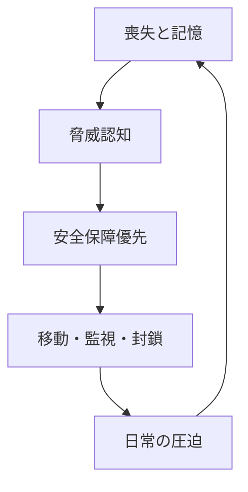
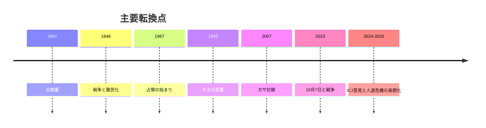

# イスラエル・パレスチナ問題を市民感情から整理する

## 1. エグゼクティブサマリー

イスラエル・パレスチナ問題は、領土、軍事、外交だけでなく、市民が何を恐れ、何を失い、何を記憶し、どの範囲まで日常を維持できるかで形が決まる。ここでいう市民感情は、心理学的な診断ではなく、公開情報から読める公共感情、集団記憶、生活上の恐怖、政治への信頼・不信の束として扱うほうが実務的である。<SourceNote>[PCPSR と Israel Democracy Institute の世論調査](https://www.pcpsr.org/sites/default/files/Poll%2096%20press%20release%20FINAL%20ENGLISH%2028%20Oct%202025.pdf)、[IDI, Israeli Voice Index 2025](https://en.idi.org.il/articles/61845)、[OCHA の occupied Palestinian territory 更新](https://www.ochaopt.org/) に基づく。</SourceNote>

最も重要なのは、双方の市民感情が「対称」ではないのに、互いに鏡像化している点である。イスラエル側では、2023年10月7日の攻撃とその後の戦争、ロケット脅威、予備役負担、拉致人質の不安が、国家の安全と個人の安全をほぼ同義に見せた。パレスチナ側では、封鎖、占領、空爆、検問、家屋破壊、逮捕、強制移動が、日常そのものを政治に変えてきた。両者の間で、恐怖はしばしば「相手が自分を消し去ろうとしている」という物語に変わる。<SourceNote>[PCPSR, July 2024 Israeli-Palestinian joint poll](https://www.pcpsr.org/en/node/987)、[OCHA, Gaza and West Bank humanitarian updates](https://www.ochaopt.org/)、[UNRWA, Palestine refugees](https://www.unrwa.org/palestine-refugees) に基づく。</SourceNote>

第三に、パレスチナ市民は一枚岩ではない。ガザ住民、ヨルダン川西岸住民、イスラエル国籍のパレスチナ系市民、ディアスポラ、そして周辺国のパレスチナ難民は、それぞれ異なる制約の下にいる。イスラエル側も同様で、ユダヤ系市民、アラブ系市民、入植地住民、軍事動員に近い家族、平和運動や人質家族で、見ている現実は違う。政策判断に使うなら、「イスラエル対パレスチナ」という二項対立より、複数の市民経験を並べて読む方が誤差が小さい。<SourceNote>[IDI, Israeli Voice Index 2025](https://en.idi.org.il/articles/61845)、[OCHA, West Bank displacement and violence updates](https://www.ochaopt.org/)、[UNRWA, Palestine refugees](https://www.unrwa.org/palestine-refugees) に基づく。</SourceNote>

結論として、この問題を市民感情から読む意味は、暴力の正当化を避けつつ、なぜ妥協が難しいのかを説明できることにある。恐怖と記憶は、軍事作戦や外交声明より長く残る。したがって、停戦、和平、復興、人道支援を考えるときは、兵器や国境だけでなく、喪失の記憶と日常生活の再建可能性を同時に扱わなければならない。<SourceNote>[ICJ の 2024 年勧告的意見](https://www.icj-cij.org/node/204176)、[OCHA, occupied Palestinian territory updates](https://www.ochaopt.org/)、[UNRWA, Gaza / West Bank situation pages](https://www.unrwa.org/) に基づく。</SourceNote>

## 2. 何を「市民感情」として読むか

ここでの市民感情は、怒りや悲しみの単純な平均ではない。何世代にもわたる記憶、家族の喪失、移動制限、学校や職場での経験、SNS 上の相互不信、選挙や世論調査に表れる政治的選好をまとめて読むための概念である。だから、写真や動画のショックだけでなく、住宅、食料、通学、検問、医療アクセス、拘束、避難、帰還の可否が、感情をどう形成しているかを見る必要がある。<SourceNote>[OCHA の人道状況更新](https://www.ochaopt.org/)、[UNRWA, Palestine refugees](https://www.unrwa.org/palestine-refugees)、[IDI, Israeli Voice Index 2025](https://en.idi.org.il/articles/61845) に基づく。</SourceNote>

この視点を取る理由は、感情が政治の副産物ではなく、政治そのものを動かす入力だからだ。恐怖が強いほど、人々は安全保障を優先し、相手を危険源として読みやすくなる。喪失が長引くほど、過去の約束よりも目の前の保護を求めやすくなる。したがって、市民感情を追うことは「感傷的」なのではなく、政治行動の前提を確認する実務的な方法である。<SourceNote>[PCPSR の共同調査](https://www.pcpsr.org/en/node/987)、[IDI の調査](https://en.idi.org.il/articles/61845) に基づく。ここでの「感情が政治を動かす」は、公開調査からの推定である。</SourceNote>

この図は、感情が政治へ戻っていく循環を示す。感情は個人の内面に閉じず、政策と生活を介して再生産される。<SourceNote>[OCHA の人道更新](https://www.ochaopt.org/)、[UNRWA のガザ・西岸情報](https://www.unrwa.org/)、[PCPSR の共同調査](https://www.pcpsr.org/en/node/987) に基づく。</SourceNote>

## 3. 歴史の骨格

この問題の歴史は、1947 年の分割案、1948 年戦争と難民化、1967 年戦争と占領、1993 年のオスロ合意、2007 年以降のガザ封鎖、そして 2023 年 10 月 7 日の攻撃とその後の戦争を通して理解するのが早い。特に 1948 年の難民化は、現在のディアスポラと周辺国の感情を作る出発点であり、1967 年以降の占領は、ヨルダン川西岸と東エルサレムの生活を構造的に制約してきた。<SourceNote>[UN のパレスチナ問題史](https://www.un.org/unispal/history/)、[UNRWA, Palestine refugees](https://www.unrwa.org/palestine-refugees)、[ICJ, advisory opinion 2024](https://www.icj-cij.org/node/204176) に基づく。</SourceNote>

1993 年のオスロは、相互承認と暫定統治の枠組みを開いたが、主権の最終決着には至らなかった。2000 年代以降は、入植、分断、検問、ガザの封鎖、ロケット攻撃と軍事作戦の反復が、和平の言葉よりも日常の現実を規定した。2024 年の ICJ 勧告的意見は、占領の法的性格と、東エルサレムを含む被占領地における永続的支配の問題を改めて可視化した。<SourceNote>[ICJ advisory opinion 2024](https://www.icj-cij.org/node/204176)、[UNRWA の Gaza Strip / West Bank pages](https://www.unrwa.org/)、[OCHA の occupied Palestinian territory updates](https://www.ochaopt.org/) に基づく。</SourceNote>

この年表で大事なのは、単発の事件ではなく、土地・移動・帰還・主権が何度も上書きされてきたことだ。市民感情は、その上書きのたびに更新される。<SourceNote>[UNRWA, Palestine refugees](https://www.unrwa.org/palestine-refugees)、[ICJ 2024 advisory opinion](https://www.icj-cij.org/node/204176) に基づく。</SourceNote>

## 4. 市民感情の四つの層

| 層 | 主な記憶 / 恐怖 | 日常への圧力 | 政治への向き方 |
| --- | --- | --- | --- |
| イスラエルのユダヤ系市民 | 10月7日、人質、ロケット、予備役、再発への恐怖 | 警報、動員、避難、喪失の反復 | 安全保障優先、強硬路線への傾きと戦争疲れの併存 |
| イスラエル国籍のパレスチナ系市民 | 差別感覚、二重忠誠の疑念、治安悪化への不安 | 市民権と少数者性の間の緊張 | 民主主義と平等の要求、ただし公共議論への参加は制約されやすい |
| ガザ・西岸のパレスチナ市民 | 占領、封鎖、空爆、逮捕、家屋破壊、避難 | 移動、食料、水、教育、医療の不安定化 | 解放要求、しかし制度的出口は細い |
| ディアスポラと周辺国の住民 | 難民化の継承、帰還不能、家族の分断 | キャンプ、送金、身分証、政治化された記憶 | 連帯と疲弊が混在し、現地政治に再接続しやすい |

この表は、同じ「パレスチナ」「イスラエル」という語が、実際には異なる生活条件を隠すことを示している。たとえばイスラエル国籍のパレスチナ系市民は、ガザ住民とは法的地位が違い、ガザ住民は西岸住民とも制約の形が違う。逆にイスラエル側でも、ユダヤ系多数派の安全不安と、アラブ系市民の治安・平等不安は同じではない。<SourceNote>[IDI, Israeli Voice Index 2025](https://en.idi.org.il/articles/61845)、[OCHA, West Bank displacement updates](https://www.ochaopt.org/)、[UNRWA, Palestine refugees](https://www.unrwa.org/palestine-refugees) に基づく。</SourceNote>

イスラエルのユダヤ系市民にとって中心にあるのは、安全の崩れである。人質の存在は、国家の軍事行動と市民の感情を強く結びつける。2025 年の IDI 調査でも、戦争を終わらせる時期が来たと答える人が多数派で、主な理由は人質の危険と疲労感にある。ここでは、勝敗だけでなく「いつ終えるか」が感情の争点になる。<SourceNote>[IDI, Israeli Voice Index 2025](https://en.idi.org.il/articles/61845) に基づく。</SourceNote>

イスラエル国籍のパレスチナ系市民は、同じ国家の中にいながら、国家の語る安全保障と、自分たちの日常が受ける治安圧力の両方を見ている。IDI の調査では、ユダヤ系とアラブ系市民の間で、治安状況や将来の見通しに対する回答が大きく割れる。これは、同じ国の中にも「戦争の読み方」が複数あることを示す。<SourceNote>[IDI, Israeli Voice Index 2025](https://en.idi.org.il/articles/61845) に基づく。</SourceNote>

ガザと西岸のパレスチナ市民にとって中心にあるのは、移動と生存の不確実性である。OCHA は、ガザでの大規模な避難、住居破壊、食料・水・医療へのアクセス制約を継続的に報告している。西岸でも、軍事作戦、検問、入植者暴力、強制移動の圧力が、地域ごとに異なる形で生活を削っている。ここでは、感情は政治的主張というより、日常を守るための応答として現れやすい。<SourceNote>[OCHA, occupied Palestinian territory updates](https://www.ochaopt.org/)、[UNRWA, West Bank and Gaza pages](https://www.unrwa.org/) に基づく。</SourceNote>

ディアスポラと周辺国の住民は、戦争そのものより「帰れない状態」の継続で感情が更新される。UNRWA が扱う登録難民は、家族史、権利、身分、教育、就労の問題を越境的に抱えたまま暮らしている。レバノン、ヨルダン、シリアのキャンプや都市部では、パレスチナ問題は他国のニュースではなく、家族の履歴そのものとして残っている。<SourceNote>[UNRWA, Palestine refugees](https://www.unrwa.org/palestine-refugees) に基づく。</SourceNote>

## 5. 日常生活への圧力

市民感情を理解するには、戦場の地図より生活の動線を見るほうがよい。ガザでは、住居喪失、避難の反復、食料と水の不足、電力・通信の不安定、学校と病院の継続困難が、感情を毎日更新している。西岸では、移動制限、軍事作戦、入植者暴力、逮捕、家屋取り壊しが、将来の計画を壊し続ける。イスラエル側でも、避難、警報、予備役動員、喪失、政治的分裂が、日常生活のリズムを崩す。<SourceNote>[OCHA, Gaza and West Bank updates](https://www.ochaopt.org/)、[UNRWA, Gaza Strip / West Bank](https://www.unrwa.org/) に基づく。</SourceNote>

2026 年時点の OCHA の更新では、ガザの人道状況は依然として極めて厳しく、西岸でも避難と暴力が続いている。つまり、日常生活の破壊は「戦争が激しい時期の例外」ではなく、占領、封鎖、軍事行動が重なった結果として常態化している。感情を読むとは、この常態化を見落とさないことだ。<SourceNote>[OCHA, occupied Palestinian territory updates](https://www.ochaopt.org/) に基づく。</SourceNote>

ここで起きているのは、被害の量だけでは説明できない疲労である。家族の一部が殺傷され、残りが避難し、学校が止まり、病院が動かず、通信が切れ、将来の予定が立てられない状態では、政治的立場は抽象論よりも生存感覚で固まる。これはパレスチナ側だけの話ではなく、イスラエル側でも人質、動員、ロケット警報、喪失が同じように生活の時間感覚を壊している。<SourceNote>[IDI, Israeli Voice Index 2025](https://en.idi.org.il/articles/61845)、[OCHA, Gaza updates](https://www.ochaopt.org/)、[PCPSR, joint poll](https://www.pcpsr.org/en/node/987) に基づく。</SourceNote>

## 6. 世論調査が示すもの

世論調査は、感情そのものを測る装置ではない。だが、何が政治問題として前面に出ているかはかなりよく映す。2024 年 7 月の PCPSR と Tel Aviv University の共同調査では、イスラエル人とパレスチナ人の双方に、相手を人間として見失うほどの不信と、相互に「ジェノサイド」の恐怖が広がっていることが示された。ここで重要なのは、恐怖が片側だけの病理ではなく、対称ではない条件の下で増幅している点である。<SourceNote>[PCPSR, Israeli-Palestinian joint poll, July 2024](https://www.pcpsr.org/en/node/987) に基づく。</SourceNote>

イスラエル側の 2025 年の IDI 調査では、戦争を終わらせる時期が来たとする回答が多数派で、理由として人質の危険と長期化疲れが大きい。別の設問では、ユダヤ系市民とアラブ系市民の間で、治安状況の評価に大きな差が出る。つまり、イスラエル社会の内部にも、戦争継続を求める感情と、終わらせたい感情が同居している。<SourceNote>[IDI, Israeli Voice Index 2025](https://en.idi.org.il/articles/61845) に基づく。</SourceNote>

パレスチナ側でも、支持や不支持の線は単純ではない。2025 年 10 月の PCPSR 調査では、二国家解決を支持する回答がなお一定数ありながら、同時にハマスの対応への支持や、戦争が再発するという悲観も強い。ガザと西岸で回答傾向が違うことも多く、ここから読めるのは「合意がない」ことではなく、「合意の出口が見えないまま、感情だけが先鋭化している」ことである。<SourceNote>[PCPSR, Poll 96, October 2025](https://www.pcpsr.org/sites/default/files/Poll%2096%20press%20release%20FINAL%20ENGLISH%2028%20Oct%202025.pdf) に基づく。</SourceNote>

要するに、調査が示すのは立場の硬直だけではない。双方ともに、強い喪失と強い不信があり、しかもそれを政治的に翻訳する制度が弱い。だから、世論調査は「どちらが正しいか」を決める資料ではなく、何が妥協を難しくしているかを読む資料として使うべきである。<SourceNote>[PCPSR の共同調査](https://www.pcpsr.org/en/node/987)、[IDI, Israeli Voice Index 2025](https://en.idi.org.il/articles/61845) に基づく。ここでの「制度が弱い」は、公表情報からの推定である。</SourceNote>

## 7. なぜ感情が政治を硬直させるのか

感情が政治を硬直させる理由は、感情が非合理だからではない。むしろ、感情が安全保障、移動、教育、帰還、統治への信頼と直結しているからだ。家を失った人にとっては、和平は抽象的な目標ではなく、再び失うかもしれない不安の上に乗る。人質やロケット警報を経験した人にとっても、譲歩は抽象論ではなく、再発リスクの計算になる。<SourceNote>[OCHA, Gaza and West Bank updates](https://www.ochaopt.org/)、[IDI, Israeli Voice Index 2025](https://en.idi.org.il/articles/61845)、[PCPSR, joint poll](https://www.pcpsr.org/en/node/987) に基づく。</SourceNote>

この循環は、双方で形を変えながら同時に進む。イスラエル側では、国家の保護が十分でなかった記憶が安全保障優先を強め、パレスチナ側では、占領と封鎖の記憶が交渉への信頼を削る。公表情報からの推定として、当局は象徴的な譲歩より、監視と処罰の細分化を優先しやすい。こうして、感情は政治の土台であると同時に、政治が感情を再生産する装置にもなる。<SourceNote>[ICJ 2024 advisory opinion](https://www.icj-cij.org/node/204176)、[OCHA, occupied Palestinian territory updates](https://www.ochaopt.org/)、[UNRWA, Palestine refugees](https://www.unrwa.org/palestine-refugees) に基づく。</SourceNote>

ここで重要なのは、相手を非人間化する言葉が突然生まれるのではなく、長期の非対称的経験から育つことだ。だからこそ、感情を軽視して軍事と外交だけを追うと、何度も同じ失敗を繰り返す。感情は操作対象でもあるが、同時に構造の記録でもある。<SourceNote>[PCPSR, joint poll](https://www.pcpsr.org/en/node/987)、[IDI, Israeli Voice Index 2025](https://en.idi.org.il/articles/61845) に基づく。</SourceNote>

## 8. 実務上の含意

この問題を扱う実務者は、少なくとも次の 4 点を分けて考える必要がある。

1. 人道アクセスと停戦監視
1. 人質、拘束者、遺体返還を含む家族の問題
1. 西岸の治安、入植者暴力、強制移動
1. 難民、ディアスポラ、周辺国の受け皿

この分け方をしないと、同じ「和平支援」でも、誰の恐怖を和らげ、誰の喪失を再固定化するのかが見えない。日本の外交・人道支援・学術連携・企業コンプライアンスでも、ガザ、西岸、イスラエル国籍のパレスチナ系市民、ディアスポラを同じ箱に入れないことが重要である。<SourceNote>[OCHA, occupied Palestinian territory updates](https://www.ochaopt.org/)、[UNRWA, Palestine refugees](https://www.unrwa.org/palestine-refugees)、[IDI, Israeli Voice Index 2025](https://en.idi.org.il/articles/61845) に基づく。</SourceNote>

実務的に有効なのは、和平を「国境線の合意」だけでなく、「日常の可逆性」を回復する工程として見ることだ。通学できること、病院に行けること、家を失っても戻る手段があること、相手を完全な敵ではなく交渉相手として見られることが、感情の硬化を少しだけ戻す。これは理想論ではなく、停戦や復興の持続条件である。<SourceNote>[UNRWA, Gaza / West Bank updates](https://www.unrwa.org/)、[OCHA, occupied Palestinian territory updates](https://www.ochaopt.org/) に基づく。ここでの「可逆性」は、公開情報からの政策含意である。</SourceNote>

## 9. 限界と監視ポイント

この種の報告には限界がある。第一に、UN、NGO、現地メディア、世論調査は、それぞれ到達できる人々が違う。第二に、ガザや西岸の被害は、アクセス制約のために完全なカウントが難しい。第三に、イスラエル社会内のユダヤ系市民、アラブ系市民、人質家族、反戦運動、入植地住民の差を、単一の「イスラエル世論」でまとめると歪む。第四に、パレスチナ側も、ガザ、西岸、難民キャンプ、ディアスポラを一つに束ねると誤る。<SourceNote>[OCHA, occupied Palestinian territory updates](https://www.ochaopt.org/)、[PCPSR polls](https://www.pcpsr.org/)、[IDI, Israeli Voice Index 2025](https://en.idi.org.il/articles/61845)、[UNRWA, Palestine refugees](https://www.unrwa.org/palestine-refugees) に基づく。</SourceNote>

今後の監視ポイントは、少なくとも次の 5 つである。

1. ガザへの人道アクセスと避難先の維持
1. 西岸の強制移動と入植者暴力
1. 人質・拘束者・遺体返還の進展
1. イスラエル国内の安全保障疲れと戦争継続支持の変化
1. パレスチナ側の二国家解決支持と、相互不信の持続

もしこの 5 点が改善しないなら、和平文書があっても市民感情は回復しにくい。逆に、ここが改善すれば、法的・外交的な合意の効果はようやく生活に降りてくる。<SourceNote>[PCPSR, Poll 96](https://www.pcpsr.org/sites/default/files/Poll%2096%20press%20release%20FINAL%20ENGLISH%2028%20Oct%202025.pdf)、[IDI, Israeli Voice Index 2025](https://en.idi.org.il/articles/61845)、[OCHA, occupied Palestinian territory updates](https://www.ochaopt.org/) に基づく。</SourceNote>

## 10. 参考情報

- [PCPSR, Israeli-Palestinian joint poll, July 2024](https://www.pcpsr.org/en/node/987)
- [PCPSR, Poll 96, October 2025](https://www.pcpsr.org/sites/default/files/Poll%2096%20press%20release%20FINAL%20ENGLISH%2028%20Oct%202025.pdf)
- [IDI, Israeli Voice Index 2025](https://en.idi.org.il/articles/61845)
- [OCHA, occupied Palestinian territory updates](https://www.ochaopt.org/)
- [UNRWA, Palestine refugees](https://www.unrwa.org/palestine-refugees)
- [UN, history of the Palestine question](https://www.un.org/unispal/history/)
- [ICJ, advisory opinion 2024](https://www.icj-cij.org/node/204176)
