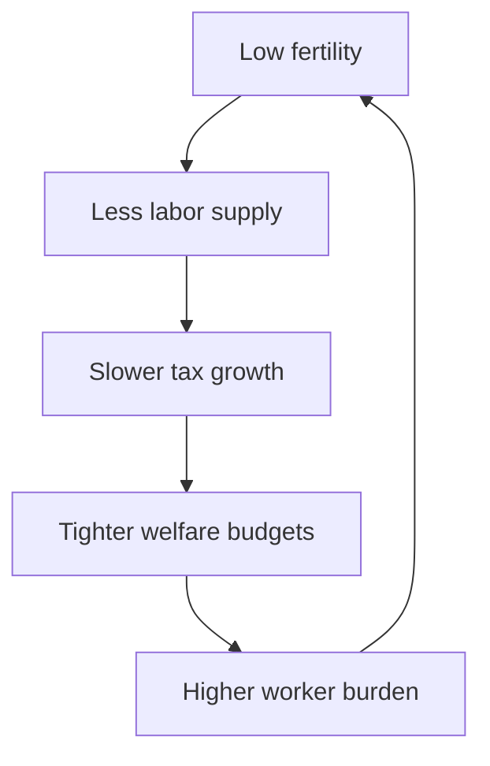

# Japan's Fiscal, Welfare, and Demographic Policy Tradeoffs

## 1. Executive Summary

As of June 4, 2026, Japan's fiscal, social security, and demographic problems are not separate agendas. They are one constraint stack. FY2026 general-account spending is 122.3 trillion yen, social security spending is 39.1 trillion yen, debt-service costs are 31.3 trillion yen, and new government-bond issuance is still large. Tax revenue is projected at 83.7 trillion yen, while the Ministry of Finance puts the FY2026 national burden rate at 45.7% and the potential burden rate at 48.4%. <SourceNote>[Ministry of Finance, FY2026 budget overview](https://www.mof.go.jp/public_relations/finance/202603/202603c.html) and [Ministry of Finance, FY2026 national burden rate](https://www.mof.go.jp/policy/budget/topics/futanritsu/20260305.html) support this reading.</SourceNote>

Low fertility is not a background issue. In Japan's vital statistics for FY2024, births fell to 686,000 and the total fertility rate was 1.15. The Cabinet Office's aging white paper says the aging rate is 29.3% and is projected to reach 38.7% in 2070. Japan therefore has to design child policy and elder-support policy at the same time, or labor supply, tax revenue, and care capacity will all tighten together. <SourceNote>[Ministry of Health, Labour and Welfare, FY2024 vital statistics](https://www.mhlw.go.jp/toukei/saikin/hw/jinkou/kakutei24/index.html) and [Cabinet Office, Annual Report on the Aging Society 2025](https://www8.cao.go.jp/kourei/whitepaper/w-2025/html/zenbun/s1_1_1.html) support this section.</SourceNote>

The core conclusion is straightforward.

1. Fiscal policy is the constraint, not the full solution.
1. Child policy needs more than cash transfers; it needs child care, education, housing, and work-style reform.
1. Medical and long-term care policy is no longer a simple choice between cutting or protecting benefits; it is a question of which costs should be shifted, and how transparently.
1. Intergenerational fairness is a budget problem, not just a moral debate.
1. Regional inequality is central because shrinking areas face higher per-capita costs to preserve transport, schools, clinics, and care.

## 2. What Is Constraining Policy Now?

The current issue is less about the existence of a fiscal deficit than about the composition of spending. In FY2026, social security is the largest major expenditure item and debt service is also very large. At the same time, tax revenue cannot quickly outrun demographic pressure, even if wages and prices keep rising. That is why the Finance Ministry publishes the national burden rate every year. The combined weight of taxes and social insurance premiums limits policy room. <SourceNote>[Ministry of Finance, FY2026 budget overview](https://www.mof.go.jp/public_relations/finance/202603/202603c.html) and [Ministry of Finance, FY2026 national burden rate](https://www.mof.go.jp/policy/budget/topics/futanritsu/20260305.html) support this paragraph.</SourceNote>

The debt stock also matters. As of December 2024, outstanding Japanese government bonds, borrowing, and treasury bills were about 1,317.7 trillion yen. That does not mean Japan is on the verge of crisis. It does mean that extra spending on short-term political fixes is harder to finance without crowding out future policy flexibility. <SourceNote>[Ministry of Finance, Outstanding government debt](https://www.mof.go.jp/jgbs/reference/gbb/202412.html) supports this point.</SourceNote>

Child policy is being built as a package rather than a single subsidy. The government's "Children's Future Strategy" and related acceleration plan combine child allowances, child care, work-family support, and financing arrangements. The important policy point is that Japan is already moving beyond a one-off cash-transfer model. <SourceNote>[Children and Families Agency, Children's Future Strategy](https://www.cfa.go.jp/policies/kodomo-mirai-senryaku) supports this description.</SourceNote>

## 3. What Are the Policy Choices?

The options can be grouped into four buckets.

1. Expand child policy.
1. Medical and long-term care reform.
1. Reallocate taxes and social insurance.
1. Expand labor participation.

| Option | Likely effect | Main limit | Political cost |
| --- | --- | --- | --- |
| Expand child policy | Better child care, allowances, and work-family support | Fertility effects are slow and incomplete | Financing and design must be explained |
| Reform medical and long-term care | Slower premium growth, more targeted benefits | Patients and older voters may resist | Rebalancing benefits and contributions |
| Reallocate taxes and social insurance | Higher disposable income for workers | Someone else still bears the cost | Intergenerational conflict |
| Expand labor participation | More tax base and less strain on services | Regional gaps and work norms are sticky | Changes to employment practice |

In health insurance, the government is pursuing reforms that include a review of high-cost medical expense rules and OTC-like drug coverage. The policy logic is to slow premium growth while preserving the system's legitimacy. In other words, this is not a simple question of whether to protect or cut benefits. It is a question of where to redesign the burden-sharing formula. <SourceNote>[Ministry of Health, Labour and Welfare, health insurance reform information](https://www.mhlw.go.jp/stf/newpage_57480.html) supports this section.</SourceNote>

On child policy, the public record points to a broad package implementation in 2026 and beyond. As a public-information inference, cash support alone is unlikely to lift fertility enough unless Japan also lowers child-care scarcity, housing costs, long working hours, and career interruption risk. <SourceNote>[Children and Families Agency, Children's Future Strategy](https://www.cfa.go.jp/policies/kodomo-mirai-senryaku) and [Cabinet Office, Annual Report on the Aging Society 2025](https://www8.cao.go.jp/kourei/whitepaper/w-2025/html/zenbun/s1_1_1.html) support this public-information inference.</SourceNote>

## 4. Intergenerational Fairness

Intergenerational fairness is ultimately about who pays, when, and for what. Working-age households are asked to support medical care, long-term care, and pensions today, while also trusting that their own future benefits will still be there. Older households want stable benefits from systems they have paid into. The practical challenge is not to choose one side, but to avoid leaving an even larger bill to the next generation. <SourceNote>[Ministry of Finance, FY2026 national burden rate](https://www.mof.go.jp/policy/budget/topics/futanritsu/20260305.html) and [Ministry of Finance, FY2026 budget overview](https://www.mof.go.jp/public_relations/finance/202603/202603c.html) support this framing.</SourceNote>

When the burden rate is high, a policy that raises take-home pay is attractive. But tax cuts, lower social insurance premiums, and better benefits cannot all be maximized at the same time. Some tradeoff has to be made explicit. <SourceNote>[Ministry of Finance, FY2026 national burden rate](https://www.mof.go.jp/policy/budget/topics/futanritsu/20260305.html) supports this point.</SourceNote>

## 5. Regional Gaps and Labor Participation

Population decline is not uniform. The aging white paper projects very large differences among prefectures, with Akita at 49.9% age 65 and over in 2045 and Tokyo at 29.6%. That means schools, clinics, transport, and care services can become much more expensive in some places even if the national averages still look manageable. Demographic policy is therefore also a regional infrastructure policy. <SourceNote>[Cabinet Office, Annual Report on the Aging Society 2025](https://www8.cao.go.jp/kourei/whitepaper/w-2025/html/zenbun/s1_1_1.html) supports this section.</SourceNote>

Labor participation is one of the few levers that helps both demographics and fiscal sustainability. More participation by women, older workers, foreign workers, and younger people who want stable employment expands the tax base and reduces pressure on the social security system. But this only works if childcare supply, regional transport, housing, and firm-level employment practices move together. <SourceNote>[Cabinet Office, Annual Report on the Aging Society 2025](https://www8.cao.go.jp/kourei/whitepaper/w-2025/html/zenbun/s1_1_1.html) supports this paragraph.</SourceNote>

## 6. What Should Come First?

Taken together, the public evidence suggests the following priority order.

1. Protect the long-term viability of health care, long-term care, and pensions.
1. Support working households through lower premium growth and higher wages.
1. Implement child policy as a package of child care, education, housing, and work-style reform rather than as cash alone.
1. Adapt local service models to regional population decline.
1. Keep fiscal management focused on future debt-service pressure and the burden rate, not on short-lived popularity.

This order is not a moral ranking. It is a practical ordering based on which constraints are most likely to break the system first. <SourceNote>[Ministry of Finance, FY2026 budget overview](https://www.mof.go.jp/public_relations/finance/202603/202603c.html), [Ministry of Finance, FY2026 national burden rate](https://www.mof.go.jp/policy/budget/topics/futanritsu/20260305.html), and [Cabinet Office, Annual Report on the Aging Society 2025](https://www8.cao.go.jp/kourei/whitepaper/w-2025/html/zenbun/s1_1_1.html) support this conclusion.</SourceNote>

## 7. Risks and Limits

The biggest risk is treating child policy as a one-year stimulus program. The second is postponing medical and long-term care reform until the bill is even larger. The third is assuming that a single national model can solve a problem that is becoming more different from prefecture to prefecture. <SourceNote>[Cabinet Office, Annual Report on the Aging Society 2025](https://www8.cao.go.jp/kourei/whitepaper/w-2025/html/zenbun/s1_1_1.html) and [Ministry of Health, Labour and Welfare, health insurance reform information](https://www.mhlw.go.jp/stf/newpage_57480.html) support this warning.</SourceNote>

As a public-information inference, fertility will not rebound quickly. That means policy evaluation should focus not only on births, but also on labor participation, cost growth in health and long-term care, and the ability of local governments to keep basic services open. <SourceNote>[Children and Families Agency, Children's Future Strategy](https://www.cfa.go.jp/policies/kodomo-mirai-senryaku) and [Cabinet Office, Annual Report on the Aging Society 2025](https://www8.cao.go.jp/kourei/whitepaper/w-2025/html/zenbun/s1_1_1.html) support this public-information inference.</SourceNote>

## 8. References

- [Ministry of Finance, FY2026 budget overview](https://www.mof.go.jp/public_relations/finance/202603/202603c.html)
- [Ministry of Finance, FY2026 national burden rate](https://www.mof.go.jp/policy/budget/topics/futanritsu/20260305.html)
- [Ministry of Finance, outstanding government debt](https://www.mof.go.jp/jgbs/reference/gbb/202412.html)
- [Ministry of Health, Labour and Welfare, FY2024 vital statistics](https://www.mhlw.go.jp/toukei/saikin/hw/jinkou/kakutei24/index.html)
- [Cabinet Office, Annual Report on the Aging Society 2025](https://www8.cao.go.jp/kourei/whitepaper/w-2025/html/zenbun/s1_1_1.html)
- [Children and Families Agency, Children's Future Strategy](https://www.cfa.go.jp/policies/kodomo-mirai-senryaku)
- [Ministry of Health, Labour and Welfare, health insurance reform information](https://www.mhlw.go.jp/stf/newpage_57480.html)
