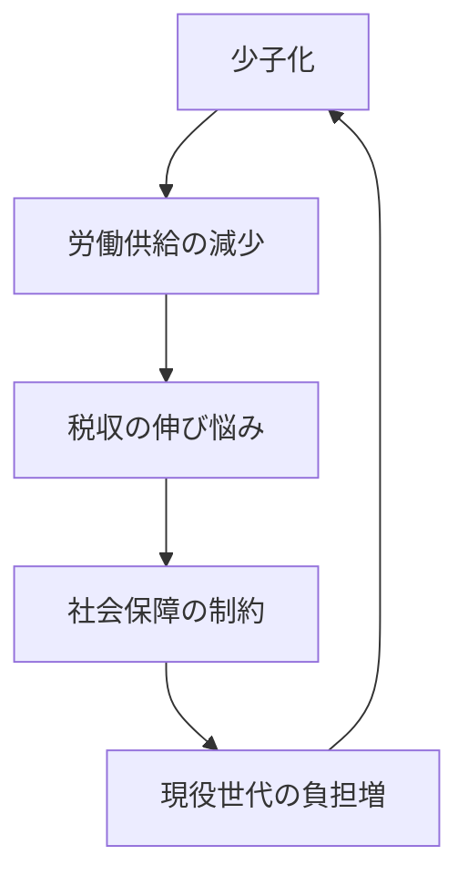

# 日本の財政・社会保障・少子化政策の争点

## 1. エグゼクティブサマリー

2026年6月4日時点で、日本の財政・社会保障・少子化は別々の政策ではなく、同じ制約条件の中にある。令和8年度一般会計予算は122.3兆円、社会保障関係費は39.1兆円、公債金は29.6兆円、国債費は31.3兆円である。税収は83.7兆円見込みだが、国民負担率は令和8年度に45.7%、潜在的国民負担率は48.4%とされ、負担余地は小さい。<SourceNote>[財務省, 令和8年度一般会計予算](https://www.mof.go.jp/public_relations/finance/202603/202603c.html), [財務省, 令和8年度の国民負担率](https://www.mof.go.jp/policy/budget/topics/futanritsu/20260305.html) に基づく。</SourceNote>

少子化は改善待ちの長期課題ではない。令和6年の人口動態統計では出生数は68.6万人、合計特殊出生率は1.15だった。内閣府の高齢社会白書では、高齢化率は29.3%で、2070年には38.7%に達すると見込まれる。つまり、日本は「子どもを増やす政策」と「高齢者を支える制度」を同時に設計しないと、労働供給、税収、医療・介護のすべてが細る。<SourceNote>[厚生労働省, 令和6年人口動態統計](https://www.mhlw.go.jp/toukei/saikin/hw/jinkou/kakutei24/index.html), [内閣府, 令和7年版高齢社会白書](https://www8.cao.go.jp/kourei/whitepaper/w-2025/html/zenbun/s1_1_1.html) に基づく。</SourceNote>

結論は次のとおりである。

1. 財政は制約条件であり、単独の論点ではない。
1. 少子化対策は現金給付だけでは足りず、保育、教育、住宅、雇用慣行、男女の無償労働配分まで含む。
1. 医療・介護は「削るか守るか」ではなく、給付の重点化と負担の説明責任を同時に問われる。
1. 世代間公平は抽象論ではなく、現役世代の可処分所得と将来の給付水準の配分問題である。
1. 地域格差は副次論点ではなく、人口減少の進む地域ほど生活インフラの維持費が上がる中心論点である。

## 2. 何が今の制約か

今の論点は、財政赤字そのものより「歳出構造をどう変えるか」にある。令和8年度予算では、社会保障関係費が最大級の支出項目で、国債費も大きい。これに対して税収の伸びは、物価と賃上げが続いても、人口構造の逆風をすぐに打ち消せるほど大きくない。財務省が国民負担率を毎年示すのは、税と社会保険料の合計負担が政策余地を狭めるからである。合計負担が高いほど、政策余地は狭くなる。<SourceNote>[財務省, 令和8年度一般会計予算](https://www.mof.go.jp/public_relations/finance/202603/202603c.html), [財務省, 令和8年度の国民負担率](https://www.mof.go.jp/policy/budget/topics/futanritsu/20260305.html) に基づく。</SourceNote>

財政の重みをもう少し長い目で見ると、国債・借入金等の残高は令和6年12月末で1,317.7兆円規模にある。これは、短期の景気対策や単発給付を積み増すだけでは、将来の利払いと財政運営の自由度を圧迫しやすいことを意味する。<SourceNote>[財務省, 国債・借入金等の現在高](https://www.mof.go.jp/jgbs/reference/gbb/202412.html) に基づく。</SourceNote>

一方で、少子化対策の中心は「出生数を一度に戻す」政策ではない。政府のこども未来戦略関連の支援は、子ども・子育て支援加速化プランや財源の仕組みまで含めて設計されており、保育、児童手当、両立支援、教育費の負担軽減を束ねている。単独の現金給付より、制度の束を組み替える政策になっている点が重要である。<SourceNote>[こども家庭庁, こども未来戦略](https://www.cfa.go.jp/policies/kodomo-mirai-senryaku) に基づく。</SourceNote>

## 3. 政策の選択肢は何か

政策の選択肢は、大きく4つに整理できる。

1. 少子化対策の拡充。
1. 医療・介護改革。
1. 税・社会保険料の再配分。
1. 労働参加の拡大。

| 選択肢 | 期待できる効果 | 限界 | 主な政治コスト |
| --- | --- | --- | --- |
| 少子化対策の拡充 | 保育、手当、両立支援の改善 | 出生率への効果は遅く、単独では弱い | 財源と制度設計の説明 |
| 医療・介護改革 | 保険料上昇の抑制、重点化 | 患者・高齢者の反発が大きい | 受益と負担の見直し |
| 税・社会保険料の再配分 | 現役世代の手取り改善 | 別世代への移転が不可避 | 世代間対立 |
| 労働参加の拡大 | 税収と供給制約の緩和 | 地域差と企業慣行が強い | 働き方の見直し |

医療・介護では、政府は高額療養費制度やOTC類似薬の保険給付の見直しを含む改革を進め、現役世代の負担増を抑えつつ制度の持続性を保とうとしている。これは「給付を守るか、負担を抑えるか」の二択ではなく、支出と負担の配分をどこで再設計するかの問題である。<SourceNote>[厚生労働省, 医療保険制度改革関連情報](https://www.mhlw.go.jp/stf/newpage_57480.html) に基づく。</SourceNote>

こども・子育て分野では、2026年度からの制度実施に向けて、給付とサービスを組み合わせる政策が前面に出ている。公表情報からの推定として、出生率を押し上げるには現金給付だけでは不十分で、保育の利用可能性、住宅費、長時間労働、キャリア中断のリスクを同時に下げる必要がある。<SourceNote>[こども家庭庁, こども未来戦略](https://www.cfa.go.jp/policies/kodomo-mirai-senryaku) と [内閣府, 令和7年版高齢社会白書](https://www8.cao.go.jp/kourei/whitepaper/w-2025/html/zenbun/s1_1_1.html) に基づく公表情報からの推定である。</SourceNote>

## 4. 世代間公平の争点

世代間公平は、税と社会保険料の負担を誰がどの時点で持つかという問題である。現役世代は、医療・介護・年金を支えながら、自分たちの老後給付の持続性も信じられる制度を求める。他方で、高齢世代は、これまで拠出してきた保険制度の給付安定性を求める。ここで重要なのは、どちらか一方を切ることではなく、将来世代に過大な先送りを残さないことだ。<SourceNote>[財務省, 令和8年度の国民負担率](https://www.mof.go.jp/policy/budget/topics/futanritsu/20260305.html), [財務省, 令和8年度一般会計予算](https://www.mof.go.jp/public_relations/finance/202603/202603c.html) に基づく。</SourceNote>

国民負担率が高止まりする局面では、現役世代の手取りを増やす政策は歓迎されやすいが、その財源をどこに置くかが必ず問われる。政策設計上は、税の引き下げ、社会保険料の軽減、給付の重点化を同時に満たすことはできない。どこかで優先順位をつける必要がある。<SourceNote>[財務省, 令和8年度の国民負担率](https://www.mof.go.jp/policy/budget/topics/futanritsu/20260305.html) に基づく。</SourceNote>

## 5. 地域格差と労働参加

人口減少は全国一律ではない。内閣府の白書では、2045年時点で65歳以上比率が高い県と低い県の差が大きく、例えば秋田県は49.9%、東京都は29.6%と見込まれている。地域によっては学校、医療、交通、介護事業の維持費が急に上がる。したがって、人口政策は首都圏だけの話ではなく、地域の生活基盤をどう残すかの話である。<SourceNote>[内閣府, 令和7年版高齢社会白書](https://www8.cao.go.jp/kourei/whitepaper/w-2025/html/zenbun/s1_1_1.html) に基づく。</SourceNote>

労働参加の拡大は、少子化対策と財政の両方に効く数少ない手段だ。女性、高齢者、外国人材、就労意欲のある若年層が、より働きやすい環境に移るほど、社会保障の担い手は増え、税と保険料の負担分散も進む。ただし、これは企業の雇用慣行、保育供給、地域交通、住居費と一体でないと進まない。<SourceNote>[内閣府, 令和7年版高齢社会白書](https://www8.cao.go.jp/kourei/whitepaper/w-2025/html/zenbun/s1_1_1.html) に基づく。</SourceNote>

## 6. 何を優先すべきか

公表情報を総合すると、優先順位は次の順になる。

1. 医療・介護・年金の持続可能性を守ること。
1. 現役世代の手取りを、社会保険料の抑制と賃上げで支えること。
1. 少子化対策を、現金給付だけでなく保育・教育・住宅・働き方の束として実装すること。
1. 地域ごとの人口減少に合わせて、交通、医療、学校の維持モデルを変えること。
1. 財政運営では、短期の人気策より、将来の利払いと負担率の上昇を抑えること。

この順番は、道徳的な優劣ではない。限られた財源と人手をどう配ると、制度が先に壊れないかという政策上の優先順位である。<SourceNote>[財務省, 令和8年度一般会計予算](https://www.mof.go.jp/public_relations/finance/202603/202603c.html), [財務省, 令和8年度の国民負担率](https://www.mof.go.jp/policy/budget/topics/futanritsu/20260305.html), [内閣府, 令和7年版高齢社会白書](https://www8.cao.go.jp/kourei/whitepaper/w-2025/html/zenbun/s1_1_1.html) に基づく。</SourceNote>

## 7. リスク・限界

最大のリスクは、少子化対策を単年度の景気対策として扱うことだ。もう一つのリスクは、医療・介護改革を先送りして、将来世代により重い負担を残すことだ。三つ目のリスクは、地域差を見ずに全国一律の制度だけで対応しようとして、実際の生活圏の維持に失敗することである。<SourceNote>[内閣府, 令和7年版高齢社会白書](https://www8.cao.go.jp/kourei/whitepaper/w-2025/html/zenbun/s1_1_1.html), [厚生労働省, 医療保険制度改革関連情報](https://www.mhlw.go.jp/stf/newpage_57480.html) に基づく。</SourceNote>

公表情報からの推定として、少子化の改善は短期には起こりにくい。したがって、政策評価は「出生率がすぐ上がるか」だけでなく、「労働参加が増えたか」「医療・介護の費用伸び率を抑えられたか」「地域サービスを維持できたか」で見るべきである。<SourceNote>[こども家庭庁, こども未来戦略](https://www.cfa.go.jp/policies/kodomo-mirai-senryaku) と [内閣府, 令和7年版高齢社会白書](https://www8.cao.go.jp/kourei/whitepaper/w-2025/html/zenbun/s1_1_1.html) に基づく公表情報からの推定である。</SourceNote>

## 8. 参考情報

- [財務省, 令和8年度一般会計予算](https://www.mof.go.jp/public_relations/finance/202603/202603c.html)
- [財務省, 令和8年度の国民負担率](https://www.mof.go.jp/policy/budget/topics/futanritsu/20260305.html)
- [財務省, 国債・借入金等の現在高](https://www.mof.go.jp/jgbs/reference/gbb/202412.html)
- [厚生労働省, 令和6年人口動態統計](https://www.mhlw.go.jp/toukei/saikin/hw/jinkou/kakutei24/index.html)
- [内閣府, 令和7年版高齢社会白書](https://www8.cao.go.jp/kourei/whitepaper/w-2025/html/zenbun/s1_1_1.html)
- [こども家庭庁, こども未来戦略](https://www.cfa.go.jp/policies/kodomo-mirai-senryaku)
- [厚生労働省, 医療保険制度改革関連情報](https://www.mhlw.go.jp/stf/newpage_57480.html)
