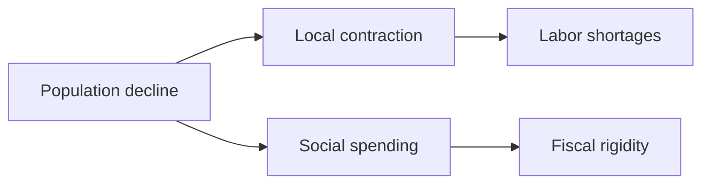
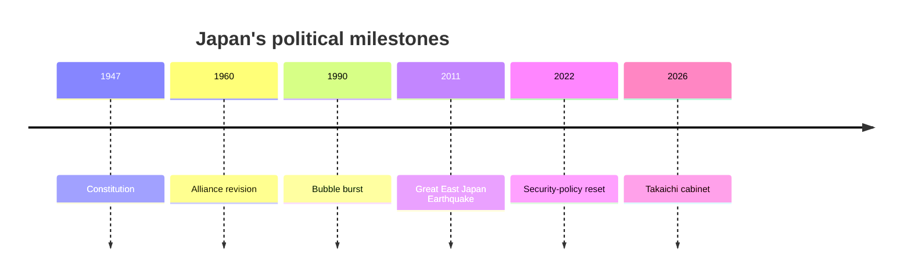
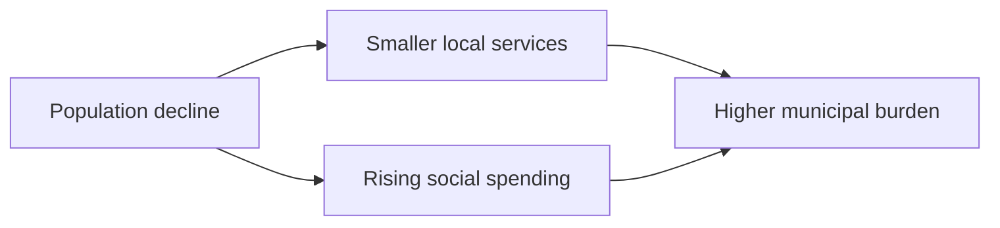
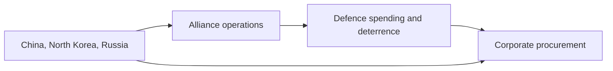

# Japan Does Not Get Lighter as It Shrinks

## 1. Executive Summary

Japan is a G7 power, a core U.S. ally, and a manufacturing economy, but population decline and aging are thinning that weight. <SourceNote>[Prime Minister's Office of Japan](https://japan.kantei.go.jp/) shows Prime Minister Takaichi Sanae and the government's "strong Japanese economy" framing, while [Ministry of Defense, English site](https://www.mod.go.jp/en/) shows the security environment and the weight of the alliance. [Statistics Bureau of Japan, Population Estimates](https://www.stat.go.jp/english/data/jinsui/2.html) confirms the demographic decline and aging.</SourceNote>

Prime Minister Takaichi's government is framing "a strong Japanese economy" while treating defence, prices, local areas, and household budgets as one political problem. <SourceNote>[Prime Minister's Office of Japan](https://japan.kantei.go.jp/) puts the prime minister and the economic-measures agenda at the front of the page.</SourceNote>

Read Japan as a country where security and economics overlap. Population, fiscal policy, labor, and security move at the same time, so one-off measures rarely last.

The diagram shows how population decline tightens local services, labor, social spending, and fiscal room at the same time. No single ministry can solve that on its own. <SourceNote>[Statistics Bureau of Japan, Population Estimates](https://www.stat.go.jp/english/data/jinsui/2.html) and [Ministry of Finance, FY2026 budget](https://www.mof.go.jp/policy/budget/budger_workflow/budget/fy2026/index.html) support the structure; the policy coupling is an inference from public information.</SourceNote>

## 2. Historical and Institutional Frame

Postwar Japan's institutional memory comes from the 1947 Constitution, the 1960 revision of the U.S.-Japan security treaty, the long slump after the 1990 bubble burst, the 2011 earthquake and tsunami, and the 2022 security-policy reset. Parliamentary government, bicameralism, the bureaucracy, and local government keep adjusting policy speed.

In practice, the cabinet can set direction, but the Diet, ministries, local governments, courts, and industry groups all reshape execution. Japan's foreign policy is easier to read from budgets and implementation than from speeches alone.

## 3. Current Political Layout

The cabinet is the center of power, but the Diet, the ruling camp, the bureaucracy, local governments, and public opinion are all veto points. <SourceNote>[Prime Minister's Office of Japan](https://japan.kantei.go.jp/) and [Statistics Bureau of Japan, Population Estimates](https://www.stat.go.jp/english/data/jinsui/2.html) show a center of gravity in the cabinet and an implementation burden that is spread across society.</SourceNote>

The Takaichi cabinet is pushing stimulus and security reinforcement at the same time. <SourceNote>[Prime Minister's Office of Japan](https://japan.kantei.go.jp/) presents the government's economic agenda and current prime minister together.</SourceNote>

| Actor | Role |
| --- | --- |
| Cabinet | Sets budgets and priorities |
| Ruling camp | Passes and revises bills |
| Opposition | Presses on prices, taxes, and accountability |
| Bureaucracy | Designs rules and operations |
| Local governments | Handle care, childcare, transport, and migration response |
| Public opinion and media | Test legitimacy |

Japanese politics does not move in a simple win-the-election-and-everything-changes pattern. Cabinet speed, ruling-camp consensus, local capacity, and public tolerance all move the same policy at different speeds.

## 4. Population, Local Areas, and Fiscal Strain

As of 1 October 2024, Japan's estimated population was 123.802 million, down for the 14th straight year. People aged 65 or older made up 29.3 percent, the top five prefectures accounted for 37.9 percent, and 45 prefectures lost population. Foreign residents increased. <SourceNote>[Statistics Bureau of Japan, Population Estimates](https://www.stat.go.jp/english/data/jinsui/2.html)</SourceNote>

That combination puts pressure on schools, hospitals, care, transport, and local government finance at the same time. Japan's local decline is a reordering of everyday life.

Foreign residents help fill labor gaps, but they also create more work for schools, hospitals, language support, and local coordination. <SourceNote>[Statistics Bureau of Japan, Population Estimates](https://www.stat.go.jp/english/data/jinsui/2.html)</SourceNote>

Fiscal policy now tends to work through an annual budget and a supplemental budget layered on top. The FY2026 budget was enacted on 7 April, and a supplemental budget followed on 5 June. <SourceNote>[Ministry of Finance, FY2026 budget](https://www.mof.go.jp/policy/budget/budger_workflow/budget/fy2026/index.html)</SourceNote>

Social spending rises faster than revenue flexibility, so it narrows the room for other spending. The public record shows that allocation strategy matters as much as growth strategy. <SourceNote>[Ministry of Finance, FY2026 budget](https://www.mof.go.jp/policy/budget/budger_workflow/budget/fy2026/index.html) and [Statistics Bureau of Japan, Population Estimates](https://www.stat.go.jp/english/data/jinsui/2.html) support this reading; future fiscal room is an inference from public information.</SourceNote>

## 5. Security and the Alliance

The Ministry of Defense groups China's activity in the East China Sea, Western Pacific, and Sea of Japan, North Korea's missile and nuclear development, and Russian military activity around Japan into one security picture. <SourceNote>[Ministry of Defense, Defense of Japan 2025](https://www.mod.go.jp/j/press/wp/wp2025/html/nd200000.html), [MOFA, Diplomatic Bluebook 2025 China and Mongolia chapter](https://www.mofa.go.jp/policy/other/bluebook/2025/en_html/chapter2/c020202.html), and [MOFA, Diplomatic Bluebook 2025 Korean Peninsula chapter](https://www.mofa.go.jp/policy/other/bluebook/2025/en_html/chapter2/c020203.html)</SourceNote>

The U.S.-Japan alliance is an operational framework that links bases, intelligence, munitions, and joint operations. Japan cannot close security by relying on the Self-Defense Forces alone, so the alliance sits at the center of foreign policy. <SourceNote>[Ministry of Defense, English site](https://www.mod.go.jp/en/) explains Japan's security posture and the alliance as core policy infrastructure.</SourceNote>

Defence spending now hinges on whether Japan can turn budget increases into equipment, personnel, ammunition, and joint operations. <SourceNote>[Ministry of Defense, Defence budget](https://www.mod.go.jp/en/d_act/d_budget/index.html)</SourceNote>

The diagram shows how external pressure reaches corporate procurement and investment as well as defence policy. It is cheaper to review inventories, communications, and vendors in peacetime than after a crisis hits. <SourceNote>[Ministry of Defense, Defense of Japan 2025](https://www.mod.go.jp/j/press/wp/wp2025/html/nd200000.html) and [Ministry of Defense, Defence budget](https://www.mod.go.jp/en/d_act/d_budget/index.html) support the structure; the spillover into corporate behavior is an inference from public information.</SourceNote>

## 6. Industrial Policy, Economic Security, and Semiconductors

The Bank of Japan has been guiding the uncollateralized overnight call rate to around 1.0 percent since 17 June 2026. <SourceNote>[Bank of Japan](https://www.boj.or.jp/en/) shows the June 2026 policy operation.</SourceNote>

That does not restore a zero-rate world. It leaves households, companies, and the government exposed to higher interest costs. Mortgage payments, borrowing costs, and bond servicing now move in the same direction.

METI's semiconductor page lists materials, equipment, front-end and back-end production, and supply-assurance plans as individual cases. <SourceNote>[Ministry of Economy, Trade and Industry, Semiconductor supply assurance](https://www.meti.go.jp/policy/economy/economic_security/semicon/index.html)</SourceNote>

Economic security in Japan now works through subsidies, permits, procurement, and technology protection, not slogans. The issue now stretches beyond semiconductors to critical minerals, batteries, cloud services, satellites, and rocket parts.

## 7. Daily Life

Daily life now mixes prices, wages, elder care, school consolidation, shrinking transport, and vacant housing. City commuters and rural residents do not live in the same pressure pattern, even when they read the same headline.

The debate over migration has security and labor dimensions. Local governments, schools, hospitals, language support, and community coordination all sit in the same frame. More foreign residents also raise the coordination burden from the other side. <SourceNote>[Statistics Bureau of Japan, Population Estimates](https://www.stat.go.jp/english/data/jinsui/2.html)</SourceNote>

National newspapers, television, online media, municipalities, business groups, and labor unions all move the focus of the debate. Public opinion is therefore not a single block, and policy legitimacy does not travel in a straight line.

## 8. External Relations and Watchpoints

| Partner or region | Core issue | Japanese reading |
| --- | --- | --- |
| United States | Alliance, bases, burden sharing | The security foundation |
| China | East China Sea, dependency, supply chains | Competition and dependence at once |
| North Korea | Missiles, nuclear weapons, abductions | An immediate security risk |
| Russia | Northern waters, sanctions, sea lanes | A long-term watch item |
| Taiwan Strait | Crisis chain, logistics, semiconductors | A risk amplifier |
| ASEAN and Europe | Standards, investment, supply diversification | Alternative partners and routes |

Japan's diplomacy runs on the U.S. alliance while it also has to manage economic ties with China, deterrence toward North Korea, sanctions on Russia, and crisis management around the Taiwan Strait. The right unit of analysis is a network of actors connected by the same sea lanes and supply chains.

Five watchpoints are enough.

1. Can the cabinet run social security, local services, and security out of the same budget?
1. Can labor shortages be eased through foreign workers and labor-saving technology together?
1. Can defence spending turn into equipment, personnel, ammunition, and training?
1. Can semiconductor and economic-security subsidies improve productivity instead of only funding projects?
1. How much pressure will interest-rate normalization add to households and government debt?

This profile relies on public information. An election result, prices, interest rates, defence spending, the Taiwan Strait, or U.S.-China relations can change the reading quickly.
