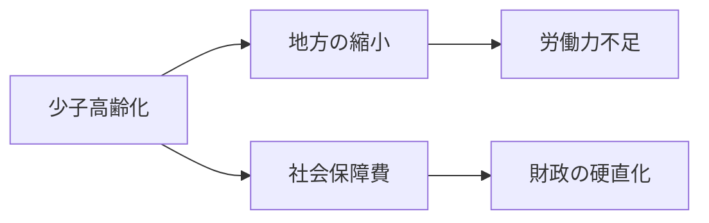
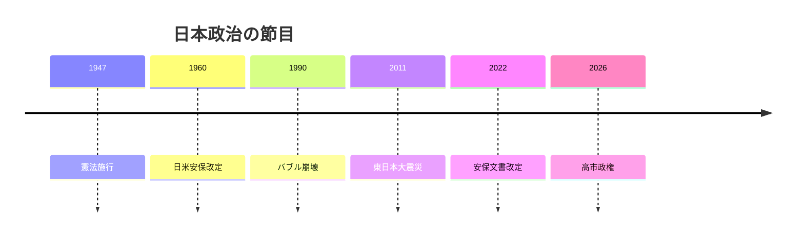
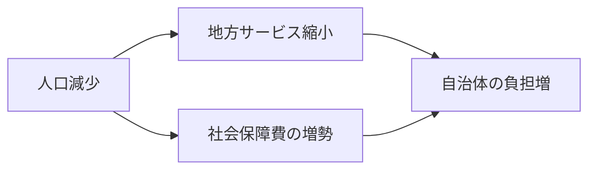
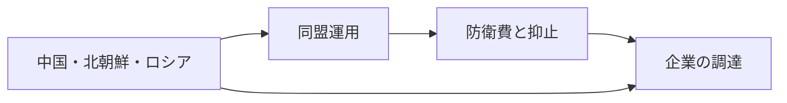

# 人口減少でも、日本は軽くならない

## 1. エグゼクティブサマリー

日本は、G7の大国であり、日米同盟の中核であり、製造業の厚みも持つ一方、人口減少と高齢化がその厚みを削っている。<SourceNote>[首相官邸](https://japan.kantei.go.jp/) は高市早苗首相と「強い日本経済」の政策枠組みを示し、[防衛省・自衛隊](https://www.mod.go.jp/en/) は日本の安全保障環境と日米同盟の重みを示している。[総務省統計局, 人口推計](https://www.stat.go.jp/english/data/jinsui/2.html) も減少と高齢化を確認できる。</SourceNote>

2026年時点の高市政権は、「強い日本経済」を掲げながら、防衛、物価、地方、家計を同じ政権課題として扱っている。<SourceNote>[首相官邸](https://japan.kantei.go.jp/) のトップページは、高市早苗首相と経済対策を前面に出している。</SourceNote>

ニュースを読むときは、日本を安全保障と経済が重なる国として読む方がよい。人口、財政、労働、安保の四つが同時に動くので、単独の政策では変わりにくい。

この図は、人口減少が地方、労働、社会保障、財政を同時に締める構図を示している。ひとつの省庁だけでは解けない問題だ。<SourceNote>[総務省統計局, 人口推計](https://www.stat.go.jp/english/data/jinsui/2.html) と [財務省, 令和8年度予算](https://www.mof.go.jp/policy/budget/budger_workflow/budget/fy2026/index.html) をもとにした構図であり、政策連動の読みは公開情報からの推定である。</SourceNote>

## 2. 歴史と制度の骨格

戦後日本の制度感覚は、1947年憲法、1960年の日米安保改定、1990年代の長期停滞、2011年の東日本大震災、2022年の安保再定義の重なりでできている。議院内閣制、二院制、官僚機構、地方自治が、政策の速度を調整する。

制度の実務では、官邸が方針を出しても、国会、各省庁、自治体、裁判所、業界団体が実装を細かく変える。日本の対外政策も、表向きの宣言より、予算と執行で読むほうが外しにくい。

## 3. 現在の政治配置

今の権力の中心は官邸だが、国会、与党、官僚機構、自治体、世論がそれぞれ veto point になる。<SourceNote>[首相官邸](https://japan.kantei.go.jp/) と [総務省統計局, 人口推計](https://www.stat.go.jp/english/data/jinsui/2.html) は、政策の中心が官邸にあっても、実装の重心が分散していることを示す。</SourceNote>

高市首相の官邸は、景気刺激と安全保障強化を同時に押している。<SourceNote>[首相官邸](https://japan.kantei.go.jp/) の政策掲示は、経済対策と安全保障の両方を前面に出している。</SourceNote>

| アクター | 役割 |
| --- | --- |
| 官邸 | 予算と優先順位を決める |
| 与党 | 法案を通し、修正する |
| 野党 | 物価、増税、説明責任を追及する |
| 官僚機構 | 細則と運用を設計する |
| 自治体 | 介護、保育、交通、移民対応を担う |
| 世論とメディア | 政策の正当性を評価する |

この国の政治は、選挙で勝てば全部動く仕組みではない。実際には、官邸の速度、与党の合意、自治体の人手、世論の許容度が、同じ政策を別々の速度で進める。

## 4. 人口、地方、財政

2024年10月1日時点の日本の推計人口は1億2380万2000人で、14年連続の減少だった。65歳以上は29.3%で、東京を含む上位5都道府県に全体の37.9%が集中する。45道府県で人口が減り、外国人は増えた。<SourceNote>[総務省統計局, 人口推計](https://www.stat.go.jp/english/data/jinsui/2.html)</SourceNote>

この組み合わせは、学校、病院、介護、交通、自治体財政を同時に圧迫する。日本の地方衰退は、景気の循環ではなく、生活圏の再編として進んでいる。

外国人住民の増加は、労働力の穴を埋める一方、学校、医療、言語支援、地域調整の仕事を増やす。<SourceNote>[総務省統計局, 人口推計](https://www.stat.go.jp/english/data/jinsui/2.html)</SourceNote>

財政は、当初予算と補正予算を重ねて配る運営になりやすい。2026年度予算は4月7日に成立し、6月5日には補正予算も成立した。<SourceNote>[財務省, 令和8年度予算](https://www.mof.go.jp/policy/budget/budger_workflow/budget/fy2026/index.html)</SourceNote>

社会保障費は景気回復よりも速く増えるため、歳出の自由度を削る。公開資料で見えるのは、成長戦略と同じくらい、配分戦略が重要だという事実である。<SourceNote>[財務省, 令和8年度予算](https://www.mof.go.jp/policy/budget/budger_workflow/budget/fy2026/index.html) と [総務省統計局, 人口推計](https://www.stat.go.jp/english/data/jinsui/2.html) をもとにした読みであり、将来の財政余地は公開情報からの推定である。</SourceNote>

## 5. 安全保障と同盟

防衛省は、中国の東シナ海・西太平洋・日本海での活動、北朝鮮のミサイル・核開発、ロシア軍の日本周辺での動きを並べている。<SourceNote>[防衛省・自衛隊, 防衛白書2025](https://www.mod.go.jp/j/press/wp/wp2025/html/nd200000.html), [外務省, 外交青書2025 中国・モンゴル編](https://www.mofa.go.jp/policy/other/bluebook/2025/en_html/chapter2/c020202.html), [外務省, 外交青書2025 朝鮮半島編](https://www.mofa.go.jp/policy/other/bluebook/2025/en_html/chapter2/c020203.html)</SourceNote>

日米同盟は、軍事抑止だけでなく、基地、情報、弾薬、統合作戦をつなぐ実務の枠組みである。日本は自衛隊だけで安全を完結できないので、同盟は対外政策の軸になる。<SourceNote>[防衛省・自衛隊](https://www.mod.go.jp/en/) の安全保障関連ページは、日本の防衛と日米同盟を中心に説明している。</SourceNote>

防衛費は単発の増額ではなく、装備、人員、弾薬、統合作戦に落とし込めるかが問われている。<SourceNote>[防衛省・自衛隊, 防衛予算](https://www.mod.go.jp/en/d_act/d_budget/index.html)</SourceNote>

この図は、外圧が防衛政策だけでなく、企業の調達と投資にも波及する構図を示している。危機が起きてから動くより、平時に在庫、通信、委託先を見直すほうが安い。<SourceNote>[防衛省・自衛隊, 防衛白書2025](https://www.mod.go.jp/j/press/wp/wp2025/html/nd200000.html) と [防衛省・自衛隊, 防衛予算](https://www.mod.go.jp/en/d_act/d_budget/index.html) をもとにした構図であり、企業行動への波及は公開情報からの推定である。</SourceNote>

## 6. 産業政策、経済安保、半導体

日本銀行は2026年6月17日以降、無担保翌日物コールレートをおおむね1.0%に誘導している。<SourceNote>[日本銀行](https://www.boj.or.jp/en/) の金融政策ページは、2026年6月の政策運営を示している。</SourceNote>

ゼロ金利の時代は終わっても、金利上昇の負担は家計、企業、政府の全てに残る。住宅ローン、借入、国債利払いが同じ方向で効いてくるからだ。

経済産業省の半導体ページは、材料、製造装置、前工程、後工程、供給確保計画を個別案件として並べている。<SourceNote>[経済産業省, 半導体の安定供給確保の取組](https://www.meti.go.jp/policy/economy/economic_security/semicon/index.html)</SourceNote>

経済安全保障は、抽象的なスローガンではなく、補助金、許認可、調達、技術保全の手順になっている。半導体だけでなく、重要鉱物、電池、クラウド、衛星、ロケット部品へも論点が広がる。

## 7. 市民生活

市民生活では、物価、賃金、介護、学校統廃合、交通縮小、空き家が同じ景色に並ぶ。都市の通勤圏と地方の生活圏では、同じニュースでも受け止め方が違う。

移民をめぐる議論には、治安と労働の両面がある。自治体の受け入れ、学校、医療、言語支援、地域調整を一緒に見る必要がある。外国人住民の増加は、その調整コストを裏側から押し上げる。<SourceNote>[総務省統計局, 人口推計](https://www.stat.go.jp/english/data/jinsui/2.html)</SourceNote>

全国紙、テレビ、ネット、自治体、業界団体、労組が、それぞれ争点の焦点をずらす。だから世論は一枚岩にならず、政策の正当化も単線では通らない。

## 8. 対外関係と監視点

| 相手・地域 | 争点 | 日本側の読み |
| --- | --- | --- |
| 米国 | 同盟、基地、負担分担 | 安保の基盤 |
| 中国 | 東シナ海、経済依存、供給網 | 競争と依存の同居 |
| 北朝鮮 | ミサイル、核、拉致 | 即時の安全保障リスク |
| ロシア | 北方周辺、制裁、海上交通 | 長期の警戒対象 |
| 台湾海峡 | 危機連鎖、物流、半導体 | 有事の増幅器 |
| ASEAN・欧州 | 標準、投資、供給網分散 | 代替先と連携先 |

日本の外交は、米国との同盟を軸にしながら、中国との経済関係、北朝鮮への抑止、ロシアへの制裁、台湾海峡の危機管理を同時に扱う。単純な二国間関係ではなく、複数の相手が同じ海路と供給網を通じてつながっていると見るほうが正確だ。

今後の監視点は五つで足りる。

1. 官邸が社会保障、地方、安保を同じ予算で回せるか。
1. 労働力不足を、外国人材と省人化の両方で埋められるか。
1. 防衛費を、装備、人員、弾薬、訓練に変換できるか。
1. 半導体と経済安保の補助が、生産性の上昇につながるか。
1. 金利正常化が、家計と政府債務の圧力をどこまで強めるか。

このプロファイルは公開情報に基づく。選挙結果、物価、金利、防衛費、台湾海峡、米中関係のどれかが動けば、日本の読み方もすぐ変わる。
