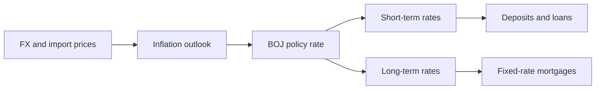
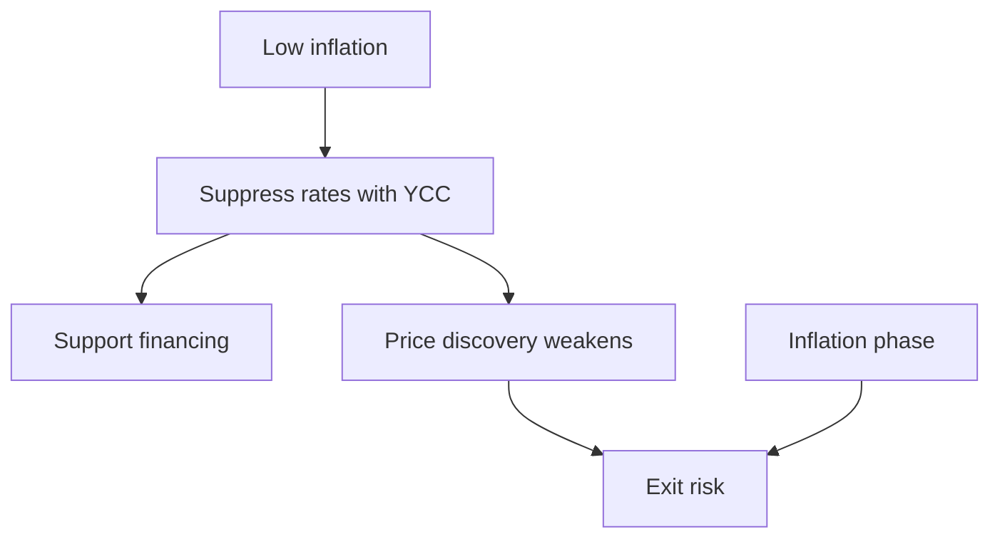

## 1. Executive Summary

As of May 14, 2026, Japan is in a phase where "inflation appears to be temporarily slowing, but underlying inflation, wages, and long-term interest rates have already moved away from the era of zero interest rates." At its meeting on April 28, 2026, the Bank of Japan kept the overnight uncollateralized call rate, which corresponds to the policy interest rate, unchanged at around 0.75%. However, the vote was 6-3, with three voting for a rate hike to 1.0%. This indicates that the decision to leave the rate unchanged was not a statement of intent to continue easing, but rather a decision to adjust the pace of interest rate hikes while taking into consideration the uncertainty surrounding the situation in the Middle East, crude oil prices, and supply constraints.
Source memo: The policy statement dated April 28, 2026 states that the uncollateralized overnight call rate will be maintained at around 0.75%, with the opposing committee members Nakagawa, Takada, and Tamura proposing 1.0%. [日本銀行, Statement on Monetary Policy, 2026-04-28](https://www.boj.or.jp/en/mopo/mpmdeci/mpr_2026/k260428a.pdf).
The conclusions of this report are as follows.

1. Policy interest rates have a ripple effect on savings deposits, short-term prime rates, variable housing loans, and corporate loans through banks' short-term funding costs. Long-term fixed mortgages are more strongly influenced by 10-year, 20-year, and 30-year government bond yields and the issuance conditions of MBS/organizational bonds than by the policy interest rate itself.
2. As of May 2026, the impact on variable mortgages will be gradual, but fixed mortgages and long-term interest rates have already risen significantly. The most common interest rate for Flat 35 in May 2026 is 2.71%, and the 10-year government bond yield has been hovering around 2.6% as of May 14th.
3. The Bank of Japan's current policy is to continue raising interest rates if underlying inflation approaches 2%, with a temporary pause at 0.75%. The April Outlook Report projects the median CPI excluding fresh food in 2026 to be 2.8% and the median real GDP to be 0.5%.
4. The long-term policy that Japan should adopt is to return to a normal inflation targeting policy using short-term policy interest rates as the main instrument, and not to reintroduce a permanent YCC. YCC is likely to damage market functioning, fiscal discipline, and the credibility of the yen. Even if they are used, they should be limited to emergency tools that specify deadlines, conditions, and exits in the event of financial market malfunction.
5. Raising interest rates too quickly or too slowly is dangerous. The most realistic policy is a data-based normalization based on gradual interest rate hikes in 0.25% increments and simultaneous monitoring of wages, service prices, expected inflation, yen depreciation and import prices, mortgage delinquencies, and unrealized losses of regional financial institutions.

## 2. Interest rate relationship: from policy interest rates to banks and housing loans

The policy rate is the shortest interest rate that the central bank induces in the money market. In Japan, the Bank of Japan currently guides the uncollateralized overnight call rate, which affects the interest rate on funds held by financial institutions in their current accounts at the Bank, the transaction rate on short-term funds, and banks' funding costs. Banks adjust savings deposit interest rates, fixed deposit interest rates, short-term prime rates, and home loan over-the-counter interest rates while looking at their funding costs and competitive environment.
Source note: As of May 14, 2026, the Bank of Japan's website indicates a policy of guiding the supplementary current account facility applicable interest rate to 0.75%, the standard lending rate to 1.0%, and the unsecured overnight call rate to around 0.75%. [日本銀行ホームページ](https://www.boj.or.jp/en/index.htm).
For variable housing loans, the applicable interest rate is often determined based on the short-term prime rate or the bank's over-the-counter standard interest rate, minus individual preferential treatment ranges. Therefore, when the policy interest rate rises, it affects banks' short-term funding costs, short-term prime rates, and over-the-counter home loan interest rates, in that order. However, the actual applicable interest rate will lag depending on competition among banks, the range of preferential treatment, rules for reviewing existing contracts, and the presence or absence of the 5-year rule and 125% rule.
Source note: The Bank of Japan's long-term and short-term prime rate statistics show that the short-term prime rate mode for major banks rose to 1.875% in March 2025 and 2.125% in February 2026, and the long-term prime rate was 3.05% on May 8, 2026. [日本銀行, 長・短期プライムレート（主要行）の推移](https://www.boj.or.jp/statistics/dl/loan/prime/prime.htm).
Fixed mortgages are closer to long-term interest rates than short-term policy rates. Long-term fixed loans like Flat 35 depend on securitization of loans, Japan Housing Finance Agency bonds, government bond yields, and spreads demanded by investors. Therefore, the understanding that "the 35-year fixed rate will be around 0.75% because the Bank of Japan is 0.75%" is incorrect. The most common interest rate for Flat 35 in May 2026 is 2.71% with a loan rate of 90% or less and a new institutional credit, which is considerably higher than the policy rate.
Source note: The Flat 35 official website shows the most common interest rate for May 2026 as 2.71% from the 6th year onward for Flat 35 and 2.39% from the 6th year onwards for Flat 20. [フラット35公式サイト](https://www.flat35.com/).

## 3. Latest indicators: as of May 14, 2026

The latest national CPI is for March 2026. The total CPI was 1.5% compared to the previous year, the total excluding fresh food was 1.8%, and the total excluding fresh food and energy was 2.4%. On the surface, core CPI was below 2%, but because it is a reaction to energy subsidies and food price increases from the previous year, it is necessary to look at service prices, wages, expected inflation, and core-core together to determine underlying inflation.
Source memo: The National CPI for March 2026 from the Statistics Bureau of the Ministry of Internal Affairs and Communications shows a total of 112.7, 1.5% compared to the previous year, a total of 112.1, excluding fresh food, 1.8% compared to the previous year, and a total of 111.9, excluding fresh food and energy, 2.4% compared to the previous year. [総務省統計局, 2026年3月全国CPI PDF](https://www.stat.go.jp/data/cpi/sokuhou/tsuki/pdf/zenkoku.pdf).
The labor market is still tight. The unemployment rate in March 2026 was 2.7% on a seasonally adjusted basis. Although the unemployment rate is low, it is necessary to look at real wages, labor participation, regular/non-regular workers, and wage differences by company size. If the Bank of Japan raises interest rates too quickly, there is a risk of dampening demand before the rise in nominal wages leads to a recovery in real incomes.
Source note: The Statistics Bureau English top page shows the unemployment rate in March 2026 as 2.7%. [Statistics Bureau of Japan](https://www.stat.go.jp/english/index.htm).
GDP requires attention. As of May 14, 2026, the first preliminary report on GDP for the January-March period of 2026 has not yet been published. According to the Cabinet Office ESRI's publication schedule, the first preliminary report for the January-March period of 2026 will be released at 8:50 on May 19, 2026. Therefore, the latest official quarterly GDP figure available in this report is the second preliminary report for the October-December period of 2025, in which real GDP was 0.6% compared to the previous quarter, or 2.6% annually.
Source note: The Cabinet Office ESRI is scheduled to release the first preliminary report on GDP for the January-March period of 2026 at 8:50 on May 19, 2026. [ESRI, Release Schedule](https://www.esri.cao.go.jp/en/sna/kouhyou/kouhyou_top.html). The real GDP in the second preliminary report for October-December 2025 is 0.6% compared to the previous quarter, and the annual rate is 2.6% based on [ESRI, Quarterly Estimates of GDP Oct.-Dec. 2025 Second Preliminary](https://www.esri.cao.go.jp/en/sna/data/sokuhou/files/2025/qe254_2/pdf/gaiyou2542_e.pdf).
Long-term interest rates have already moved to a different level from the YCC era. In the domestic bond market on May 14, 2026, the yield on 10-year government bonds generally hovered around 2.6%. This has a direct effect on fixed home loans, interest payments on government bonds, securities valuations for banks and insurance companies, and long-term financing for companies.
Source note: The 10-year government bond yield on May 14, 2026 is around 2.599% in the market report, and 2.635% as of 21:51 on Investing.com Japan version. These are preliminary figures and are treated separately from final figures and daily statistics. [LIMO, 2026-05-14 国債利回り](https://limo.media/articles/-/124478), [Investing.com 日本 国債利回り](https://jp.investing.com/rates-bonds/).
| Indicators | Latest values/point of time | How to read for policy decisions |
| --------------------------- | ---------------------------------: | ---------------------------------------- |
| Bank of Japan policy interest rate | Around 0.75%, maintained at the 2026-04-28 meeting | Real interest rates are still significantly negative. The degree of relaxation remains |
| National CPI Comprehensive | 1.5%, March 2026 | Surface value including energy subsidy and reaction |
| National CPI excluding fresh food | 1.8%, March 2026 | Temporarily below the BOJ target of 2% |
| National CPI excluding fresh food and energy | 2.4%, March 2026 | Underlying price pressure remains |
| Unemployment rate | 2.7%, March 2026 | Labor market still tight |
| Real GDP | 0.6% compared to the previous quarter, 2.6% annual rate, October-December 2025 | The latest official GDP is solid, but the data for January-March 2026 has not been released |
| Flat 35 most frequent interest rate | 2.71%, May 2026 | Long-term fixed loans clearly rising |
| 10-year government bond yield | Approximately 2.6%, May 14, 2026 | Effective for evaluating fixed interest rates, public finances, and financial institutions |

## 4. Current and future policies of the Bank of Japan

The Bank of Japan's current policy is not a simple "wait and see" approach. The April 2026 Outlook Report set the median real GDP growth rate for FY2026 as 0.5%, the median CPI excluding fresh food as 2.8%, and the median CPI excluding fresh food and energy as 2.6%. In FY2027, the median CPI excluding fresh food is 2.3% and core-core is 2.6%. This means that the Bank of Japan believes that "growth will slow in 2026, but prices will likely exceed the target."
Source Note: The April 2026 Outlook Report shows median real GDP of 0.5% in FY26, median CPI excluding fresh food of 2.8%, median CPI excluding fresh food and energy of 2.6%, and median real GDP of 0.7%, 2.3%, and 2.6% in FY2027. [日本銀行, Outlook for Economic Activity and Prices, April 2026](https://www.boj.or.jp/en/mopo/outlook/gor2604a.pdf).
The main opinions from the April meeting indicate that the committee's center of gravity is in the direction of rate hikes. Several opinions said that with underlying inflation approaching 2% and real policy rates extremely low, it would be appropriate to raise policy rates and adjust the degree of easing. On the other hand, due to the great uncertainty surrounding the situation in the Middle East and supply constraints, it was decided to leave prices unchanged as of April.
Source memo: The main opinions from the April 2026 meeting are that it is appropriate to continue raising interest rates because "the underlying CPI is close to 2% and real interest rates are extremely low," and that the April meeting needs to assess the situation in the Middle East. [日本銀行, Summary of Opinions, April 27 and 28, 2026](https://www.boj.or.jp/en/mopo/mpmsche_minu/opinion_2026/opi260428.pdf).
Based on publicly available information, the Bank of Japan's future policy is likely to resume interest rate hikes under the following three conditions.

1. Service prices, wages, and expected inflation will settle at around 2%.
2. High crude oil prices will not end up being a temporary supply shock, but will spread to a wide range of price pass-throughs through the weaker yen, import prices, and logistics costs.
3. GDP and household consumption in January-March 2026 will be strong enough to withstand interest rate hikes.
   Conversely, if supply constraints are strongly manifested in stagnation in production, deterioration in employment, and a slowdown in consumption, the Bank of Japan should delay raising interest rates. Monetary policy during supply shocks is difficult. If you only look at prices, it will raise interest rates, but if real income and production are hurt at the same time, raising interest rates will further dampen demand. Therefore, the correct reaction function for the Bank of Japan is not to "mechanically raise interest rates because the inflation rate is high," but "to raise interest rates if underlying inflation and expected inflation exceed the target and the economy remains close to its potential growth rate."
   The IMF supports broadly the same direction. Article IV 2026 stated that the Bank of Japan's withdrawal of easing was appropriate and that it should continue to gradually raise interest rates toward a neutral rate as underlying inflation approaches its target. At the same time, there is uncertainty in the external environment, neutral interest rates, and the impact of monetary policy, so flexible and data-dependent operations are necessary.
   Source note: IMF 2026 Article IV states that the Bank of Japan has appropriately withdrawn easing and should continue to raise rates gradually towards a neutral policy stance as underlying inflation approaches target. [IMF, 2026 Article IV Consultation with Japan](https://www.imf.org/en/news/articles/2026/04/02/pr-26105-japan-imf-executive-board-concludes-2026-article-iv-consult).

## 5. What was YCC?

Yield curve control is a policy in which the central bank purchases government bonds targeting not only short-term interest rates but also long-term interest rates. In Japan, it was introduced in September 2016 as "Quantitative and Qualitative Monetary Easing with Long-term and Short-term Interest Rate Control", and was a framework that led to negative short-term interest rates and 10-year government bond yields to around 0%. The objective was to continue the relaxation necessary to overcome deflation, while also suppressing the side effects of lower interest rates that lasted too long, hurting financial institutions' profits and pension and insurance investments.
Source note: The Bank of Japan's QQE reference page explains that it decided to introduce YCC in September 2016 and control short-term and long-term interest rates through market operations. [日本銀行, Monetary Policy under QQE Introduced in 2013](https://www.boj.or.jp/en/mopo/outline/ref_qqe.htm).
YCC was rational during the deflationary period. At a time when expected inflation was low, nominal interest rates were stuck at the zero lower bound, and the government, businesses, and households had become accustomed to low interest rates, it was possible to strongly ease financial conditions by suppressing long-term interest rates. However, in a situation where the inflation rate approaches 2% and the Bank of Japan itself expects to maintain a "mechanism in which wages and prices gradually increase relative to each other", the side effects of artificially suppressing government bond yields become significant.

In March 2024, the Bank of Japan determined that QQE with YCC and the negative interest rate policy had played their role, and shifted to a framework in which short-term interest rates are the main policy tool. This is an important institutional change. The Bank of Japan has not completely ignored long-term interest rates, and has said that it can respond to sudden increases in long-term interest rates by increasing its purchases of government bonds and limit-market operations, but its permanent 10-year interest rate target has ended.
Source note: The policy framework change on March 19, 2024 stated that QQE with YCC and negative interest rate policy had played a role, and indicated a policy to make short-term interest rates the main policy tool. At the same time, if long-term interest rates rise sharply, the Bank will respond flexibly by increasing purchases of government bonds and limit market operations. [日本銀行, Changes in the Monetary Policy Framework, 2024-03-19](https://www.boj.or.jp/en/mopo/mpmdeci/state_2024/k240319a.htm).

## 6. Long-term desirable policies for Japan

The desirable long-term monetary policy is a flexible inflation targeting policy that uses short-term interest rates as the main instrument. The Bank of Japan will move its policy interest rate closer to the neutral rate while maintaining its 2% inflation target. However, Japan's neutral interest rate has a large estimation error. A specific number should not be a fixed target, as it will change depending on demographic trends, potential growth rate, fiscal premium, global interest rates, and yen risk premium.
In this framework, the Bank of Japan should conduct policy in the following order.

1. The main indicators are underlying inflation, service prices, wages, and expected inflation.
2. Decisions on whether to raise or keep interest rates unchanged will be made at each meeting based on 0.25% increments.
3. While the real policy interest rate is significantly negative, the degree of easing will be reduced unless the economy collapses.
4. Long-term interest rates allow the market to discover prices.
5. Use liquidity provision, increased purchases, and limit operations only when the government bond market becomes dysfunctional.
   YCC should not be reinstated as a permanent policy. There are three reasons.
   First, YCC during an inflationary phase worsens the yen's depreciation and import prices. If long-term interest rates are artificially suppressed, the interest rate differential with other countries will widen, and pressure on the yen to depreciate will likely increase. Inflation in Japan is strongly influenced by energy, food, and imported goods, so a weak yen hurts real household income.
   Second, YCC blurs the line with fiscal finance. If the Bank of Japan continues to suppress long-term government bond yields, it will be easier for the government to assume low interest payments even with high debt. This weakens monetary policy independence and fiscal discipline. The fiscal burden caused by rising interest rates is a real problem, but hiding it through monetary policy will make the exit cost even greater.
   Third, YCC destroys market function. Government bond yields are important prices that reflect prices, growth, fiscal conditions, and risk premiums. If the central bank fixes it for a long period of time, it will distort price discovery, hedging, collateral valuation, and ALM for banks and insurance companies. Upon exit, interest rates that had been suppressed will move suddenly, increasing financial stability risks.
   However, YCC-like methods should not be completely rejected. When the government bond market loses liquidity, leading to fire sales, collateral concerns, and settlement concerns instead of price discovery, the central bank needs to intervene as the last market stabilizing agent. In that case, instead of permanently adhering to the target interest rate, the deadline, size of purchases, target year, and termination conditions should be clearly stated, and it should be made clear that the purpose of monetary policy is not "fiscal support" but "recovery of market functioning."

## 7. Effects on mortgages, banks, and fiscal policy

For home loan users, what is more important is what interest rate their loan is linked to, rather than what the policy interest rate is. Floating types must look at the short-term prime rate and banks' standard interest rates, while fixed types must look at long-term government bond yields and market funding costs. As of May 2026, the rise in fixed interest rates is already clear, and the effect on variable interest rates is likely to be delayed by further hikes in the future.
For banks, raising interest rates both improves interest margins and increases valuation losses. If deposit rates are slow to rise, interest margins will improve, but this will put pressure on valuation losses on government bond holdings, the profitability of fixed-rate loans, mortgage arrears, and regional banks' securities portfolios. If the Bank of Japan completely suppresses long-term interest rates, the valuation losses will be temporarily hidden, but the recovery of market functioning will be delayed.
For the government, normalizing interest rates is a process of restoring reality to fiscal management. Gone are the days when spending was planned on the assumption that low interest rates would persist forever. Fiscal policy should focus on targeted support for low-income groups, small businesses, and energy security, rather than blanket transfers and broad subsidies that stimulate inflation. While monetary policy moves to curb inflation, if fiscal policy stimulates demand too much, the Bank of Japan will be forced to respond with higher interest rates.

## 8. Recommended policy

The report's recommendations are as follows:

1. The Bank of Japan should not stay at 0.75% for too long. If GDP in January-March 2026, the spread of spring labor wage hikes, service prices, and expected inflation are stable, additional interest rate hikes should be continued.
2. There is no rush to raise interest rates. If the crude oil/Middle East situation simultaneously hurts production and income as a supply constraint, there is flexibility to leave it unchanged across meetings.
3. YCC will not be revived. The government will leave long-term interest rates to the market, and adjust government bond purchases based on the balance between quantitative tightening and market functions.
4. Clarify rules for intervention in the event of market dysfunction. The purpose is not to protect the level of long-term interest rates, but to stabilize liquidity and payments.
5. The government will not hinder the Bank of Japan with fiscal policy. Inflation subsidies will be targeted at low-income groups, supply constraints, and structural investments, and will not create expectations in the government bond market that "monetary policy will protect public finances."
6. Standardize variable rate stress tests for mortgage customers. The repayment amount for policy interest rates of 1.0%, 1.5%, and 2.0% will be indicated before the contract is signed, and the presence or absence of the 5-year rule and 125% rule will be clearly stated.
   As a final judgment, Japan should move from "ultra-low interest rates as a measure against deflation" to "normal policies that balance price stability and financial stability." YCC becomes the strongest temptation during that transition period. This is because they want to limit the pain in government bond yields, mortgages, and fiscal interest payments. However, if the central bank hides the pain by fixing long-term interest rates, it will return as a weaker yen, imported inflation, a decline in market function, and a deterioration in fiscal discipline. What Japan needs is not a return to YCC, but adjustments to its fiscal, housing, and financial systems that can withstand an economy with interest rates.

## Reference information

- [日本銀行, Statement on Monetary Policy, 2026-04-28](https://www.boj.or.jp/en/mopo/mpmdeci/mpr_2026/k260428a.pdf)
- [日本銀行, Outlook for Economic Activity and Prices, April 2026](https://www.boj.or.jp/en/mopo/outlook/gor2604a.pdf)
- [日本銀行, Summary of Opinions, April 27 and 28, 2026](https://www.boj.or.jp/en/mopo/mpmsche_minu/opinion_2026/opi260428.pdf)
- [日本銀行, Changes in the Monetary Policy Framework, 2024-03-19](https://www.boj.or.jp/en/mopo/mpmdeci/state_2024/k240319a.htm)
- [総務省統計局, 2026年3月全国CPI PDF](https://www.stat.go.jp/data/cpi/sokuhou/tsuki/pdf/zenkoku.pdf)
- [Statistics Bureau of Japan](https://www.stat.go.jp/english/index.htm)
- [ESRI, Release Schedule](https://www.esri.cao.go.jp/en/sna/kouhyou/kouhyou_top.html)
- [ESRI, Quarterly Estimates of GDP Oct.-Dec. 2025 Second Preliminary](https://www.esri.cao.go.jp/en/sna/data/sokuhou/files/2025/qe254_2/pdf/gaiyou2542_e.pdf)- [フラット35公式サイト](https://www.flat35.com/)
- [日本銀行, 長・短期プライムレート（主要行）の推移](https://www.boj.or.jp/statistics/dl/loan/prime/prime.htm)
- [IMF, 2026 Article IV Consultation with Japan](https://www.imf.org/en/news/articles/2026/04/02/pr-26105-japan-imf-executive-board-concludes-2026-article-iv-consult)
