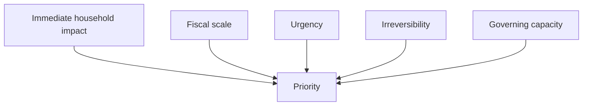

## 1. Executive Summary

As of June 3, 2026, the most important issues in Japanese national politics are household real income, the sustainability of social security, and fiscal constraints. The Takaichi cabinet is a coalition government of the Liberal Democratic Party and the Japan Innovation Party, and it puts strong growth, household relief, and stronger diplomacy, defense, and intelligence capacity at the center of its agenda. <SourceNote>[Prime Minister's Office of Japan, Basic Policy for June 2026](https://japan.kantei.go.jp/105/decisions/2026/_00001.html), [Prime Minister's Office of Japan, statement on the LDP-JIP coalition government](https://www.kantei.go.jp/jp/kakugikettei/2026/_00004.html), [Liberal Democratic Party and Japan Innovation Party coalition agreement](https://storage2.jimin.jp/pdf/news/information/211626.pdf)</SourceNote>

This report ranks the issues by combining four criteria: immediate household impact, fiscal scale, urgency, and irreversibility. The ranking therefore favors issues that are costlier to postpone than issues that are merely visible in election campaigns.

1. Inflation, wages, and disposable income
1. Social security
1. Fiscal policy and taxation
1. Foreign affairs, security, and economic security
1. Demographic decline, labor supply, and regional sustainability
1. Political reform and political finance

This order is not absolute. But as a practical guide to what will dominate Diet debate over time, it is reasonable to put households and social security first, then fiscal constraints, foreign affairs and security, demographic decline, and political reform.

## 2. How the ranking is built

The report puts the issues with the clearest effect on daily life at the top. It then adds points for the size of the spending commitment needed to sustain a system and for how hard it is to reverse the damage once it is done. Inflation hits households every month. Social security hits public finances every year. Demographic decline is hard to reverse once it advances. Political reform matters, but its immediate effect on household budgets is smaller.

Seen this way, Japan is simultaneously dealing with how to soften short-term pain and how to redesign long-term institutions without breaking them. That is also where the government's and the major parties' agendas are clustering. <SourceNote>[Statistics Bureau of Japan, Consumer Price Index for April 2026](https://www.stat.go.jp/data/cpi/sokuhou/tsuki/pdf/zenkoku.pdf), [Statistics Bureau of Japan, Labour Force Survey April 2026](https://www.stat.go.jp/english/index.html), [Ministry of Health, Labour and Welfare, Monthly Labour Survey for March 2026](https://www.mhlw.go.jp/toukei/list/30-1a.html)</SourceNote>

## 3. Ranked issues

### 1. Inflation, wages, and disposable income

The top issue remains inflation. In the Statistics Bureau's April 2026 CPI, the headline index was up 1.4% year on year, the index excluding fresh food was up 1.2%, and the index excluding fresh food and energy was up 2.5%. The unemployment rate was 2.5%, so the labor market was still tight. The Ministry of Health, Labour and Welfare reported that total cash earnings in March 2026 rose 3.3% year on year, but household purchasing power still does not look fully restored. <SourceNote>[Statistics Bureau of Japan, Consumer Price Index for April 2026](https://www.stat.go.jp/data/cpi/sokuhou/tsuki/pdf/zenkoku.pdf), [Statistics Bureau of Japan, Labour Force Survey April 2026](https://www.stat.go.jp/english/index.html), [Ministry of Health, Labour and Welfare, Monthly Labour Survey for March 2026](https://www.mhlw.go.jp/toukei/list/30-1a.html)</SourceNote>

The government is trying to support households through lower food-tax burden and refundable tax credits. The Constitutional Democratic Party wants a zero tax rate on food, Komeito combines tax relief with transfers, the Democratic Party for the People emphasizes higher take-home pay, and the Japanese Communist Party wants the consumption tax cut to 5%. The real conflict is not whether households need relief. The real conflict is how relief should be delivered: through permanent tax cuts, temporary transfers, or a wage-and-tax package. <SourceNote>[Prime Minister's Office of Japan, Basic Policy for June 2026](https://japan.kantei.go.jp/105/decisions/2026/_00001.html), [Constitutional Democratic Party of Japan, policy platform 2025](https://cdp-japan.jp/visions/policies2025), [Komeito manifesto 2025](https://www.komei.or.jp/content/manifesto2025/), [Democratic Party for the People policies 2025](https://new-kokumin.jp/policies2025), [Japanese Communist Party policy 2025](https://www.jcp.or.jp/web_policy/11419.html)</SourceNote>

### 2. Social security

Social security is a top-tier issue both in money terms and in institutional terms. The Cabinet Office's 2025 Annual Report on the Aging Society says Japan's aging rate stood at 29.3% on October 1, 2024, with a total population of 123.8 million, and projects an aging rate of 38.7% by 2070. The Ministry of Finance's FY2026 initial budget assigns 39.1 trillion yen to social security, out of a 122.3 trillion yen general account. That means health care, long-term care, pensions, and child support are not a one-off policy item; they are a permanent state capacity issue. <SourceNote>[Cabinet Office, Annual Report on the Aging Society 2025](https://www8.cao.go.jp/kourei/whitepaper/w-2025/html/zenbun/s1_1_1.html), [Ministry of Finance, FY2026 General Account budget](https://www.mof.go.jp/policy/budget/budger_workflow/budget/fy2026/seifuan2026/index.html)</SourceNote>

On this issue, both ruling and opposition parties talk about what should be protected before they talk about what should be cut, but they differ a lot on burden sharing and benefit design. The government and the ruling side emphasize sustainability and prioritization, while the opposition more often calls for lower out-of-pocket costs, lower premiums, or more generous benefits. Social security ranks second because it affects daily life now, but once the system is damaged, recovery takes a long time. <SourceNote>[Prime Minister's Office of Japan, Basic Policy for June 2026](https://japan.kantei.go.jp/105/decisions/2026/_00001.html), [Constitutional Democratic Party of Japan, policy platform 2025](https://cdp-japan.jp/visions/policies2025), [Komeito manifesto 2025](https://www.komei.or.jp/content/manifesto2025/), [Japanese Communist Party policy 2025](https://www.jcp.or.jp/web_policy/11419.html)</SourceNote>

### 3. Fiscal policy and taxation

Fiscal policy is the binding constraint on almost every other issue. Japan's FY2026 general account is 122.3 trillion yen, and social security, debt service, and defense take large shares of it. Defense-related spending has also reached 8.8 trillion yen. The core question is how to fund social security and security at the same time, and how much of that should be covered by taxes versus debt. <SourceNote>[Ministry of Finance, FY2026 General Account budget](https://www.mof.go.jp/policy/budget/budger_workflow/budget/fy2026/seifuan2026/index.html)</SourceNote>

The government's basic policy is to keep a responsible but expansionary fiscal stance, secure needed spending in the initial budget, and widen the tax base through growth and wage gains. The Constitutional Democratic Party and the Japanese Communist Party want a more redistributive fiscal stance. The Democratic Party for the People emphasizes higher take-home pay, but still frames the issue as one of avoiding permanent fiscal deterioration. The real fiscal dispute is who should bear the burden and how much of it should be delayed. <SourceNote>[Prime Minister's Office of Japan, Basic Policy for June 2026](https://japan.kantei.go.jp/105/decisions/2026/_00001.html), [Constitutional Democratic Party of Japan, policy platform 2025](https://cdp-japan.jp/visions/policies2025), [Democratic Party for the People policies 2025](https://new-kokumin.jp/policies2025), [Japanese Communist Party policy 2025](https://www.jcp.or.jp/web_policy/11419.html)</SourceNote>

### 4. Foreign affairs, security, and economic security

Foreign affairs and security rank lower than household issues in normal times, but they can jump to the top in a crisis. The current government wants to strengthen the Japan-U.S. alliance, deterrence, intelligence, cyber capacity, and economic security. The coalition agreement between the LDP and the Japan Innovation Party also gives weight to defense and governance reform. <SourceNote>[Prime Minister's Office of Japan, Basic Policy for June 2026](https://japan.kantei.go.jp/105/decisions/2026/_00001.html), [Liberal Democratic Party and Japan Innovation Party coalition agreement](https://storage2.jimin.jp/pdf/news/information/211626.pdf)</SourceNote>

By contrast, the Constitutional Democratic Party emphasizes realistic security within the limits of exclusive defense, and Komeito emphasizes peace diplomacy and balance. The real disputes are how far to expand deterrence, how to treat arms transfers and the defense industrial base, and how to translate China, North Korea, and Russia risks into policy. Security does not always look like a household issue, but energy, shipping, semiconductors, and cyber risk feed back into both households and firms. <SourceNote>[Constitutional Democratic Party of Japan, policy platform 2025](https://cdp-japan.jp/visions/policies2025), [Komeito manifesto 2025](https://www.komei.or.jp/content/manifesto2025/), [Prime Minister's Office of Japan, Basic Policy for June 2026](https://japan.kantei.go.jp/105/decisions/2026/_00001.html)</SourceNote>

### 5. Demographic decline, labor supply, and regional sustainability

Demographic decline is the most irreversible issue. If Japan is already at a 29.3% aging rate and moving toward 38.7% in the long run, then labor supply, tax revenue, long-term care, regional transport, schools, and medical access all get squeezed at the same time. The reason the government's basic policy talks not only about fertility policy but also about regional transport and orderly coexistence with foreign nationals is that the problem is systemic. <SourceNote>[Cabinet Office, Annual Report on the Aging Society 2025](https://www8.cao.go.jp/kourei/whitepaper/w-2025/html/zenbun/s1_1_1.html), [Prime Minister's Office of Japan, Basic Policy for June 2026](https://japan.kantei.go.jp/105/decisions/2026/_00001.html)</SourceNote>

The hard part is that this is not a one-off subsidy problem. Child care, education, work styles, migration and settlement, foreign-worker policy, local government finance, and transport networks all have to be redesigned together. That is why demographic decline is only fifth in the ranking, but close to first in terms of being a precondition for all the other issues. <SourceNote>[Cabinet Office, Annual Report on the Aging Society 2025](https://www8.cao.go.jp/kourei/whitepaper/w-2025/html/zenbun/s1_1_1.html), [Prime Minister's Office of Japan, Basic Policy for June 2026](https://japan.kantei.go.jp/105/decisions/2026/_00001.html)</SourceNote>

### 6. Political reform and political finance

Political reform has a smaller direct effect on household budgets, but it matters for public trust and for the government's ability to pass legislation. The Liberal Democratic Party is pushing transparency and digital filing while staying cautious about a total ban on corporate and organizational donations. The Constitutional Democratic Party and the Japanese Communist Party want a ban. Komeito also treats political reform as a major issue, while the Democratic Party for the People emphasizes transparency and design rather than an outright ban. <SourceNote>[Liberal Democratic Party political finance reform page](https://www.jimin.jp/news/information/210284.html), [Constitutional Democratic Party of Japan, policy platform 2025](https://cdp-japan.jp/visions/policies2025), [Komeito manifesto 2025](https://www.komei.or.jp/content/manifesto2025/), [Democratic Party for the People policies 2025](https://new-kokumin.jp/policies2025), [Japanese Communist Party policy 2025](https://www.jcp.or.jp/web_policy/11419.html)</SourceNote>

This issue matters because it is not just about money. It affects whether the government, the ruling parties, and the opposition can compromise on everything else. If political reform stalls, confidence in inflation policy, social security reform, fiscal policy, and security policy all suffers. That is why it ranks sixth here, but cannot be treated as minor. <SourceNote>[Liberal Democratic Party political finance reform page](https://www.jimin.jp/news/information/210284.html), [Constitutional Democratic Party of Japan, policy platform 2025](https://cdp-japan.jp/visions/policies2025), [Komeito manifesto 2025](https://www.komei.or.jp/content/manifesto2025/)</SourceNote>

## 4. Party conflict lines

The main conflict lines are not left versus right. They are household relief versus system preservation, tax cuts versus transfers, deterrence versus restraint, and disclosure versus prohibition.

1. The ruling LDP-JIP coalition combines growth, wage gains, responsible but expansionary fiscal policy, stronger security, and governance reform.
1. The Constitutional Democratic Party puts food-tax cuts, transfers, stronger social security, realistic security, and political finance reform front and center.
1. Komeito balances household relief, social security, peace diplomacy, and political reform.
1. The Democratic Party for the People pushes higher take-home pay, lighter taxes, and support for working households.
1. The Japanese Communist Party consistently calls for a lower consumption tax, higher minimum wages, stronger social security, and a ban on corporate and organizational donations.

This is a summary of the government's basic policy and the public policy documents released by the major parties since 2025. It is not a perfect map of every policy detail, but it does capture the core lines that actually shape Diet debate. <SourceNote>[Prime Minister's Office of Japan, Basic Policy for June 2026](https://japan.kantei.go.jp/105/decisions/2026/_00001.html), [Liberal Democratic Party and Japan Innovation Party coalition agreement](https://storage2.jimin.jp/pdf/news/information/211626.pdf), [Constitutional Democratic Party of Japan, policy platform 2025](https://cdp-japan.jp/visions/policies2025), [Komeito manifesto 2025](https://www.komei.or.jp/content/manifesto2025/), [Democratic Party for the People policies 2025](https://new-kokumin.jp/policies2025), [Japanese Communist Party policy 2025](https://www.jcp.or.jp/web_policy/11419.html)</SourceNote>

## 5. Practical implications

For households, the near-term watch items are not just food and energy prices. They are real wages, tax credits, social insurance contributions, medical costs, and long-term care costs. For firms, the most important items are wage growth, labor shortages, defense and cyber procurement, and only then tax changes. For policy watchers, the key is to follow the initial budget, supplemental budgets, political finance bills, social security reform, and security-related amendments in parallel.

## 6. Limits and outlook

This ranking is based on public information as of June 3, 2026. If energy prices surge because of an external shock, foreign affairs and security would move up quickly. If a major political finance scandal appears, political reform could jump to the top. If inflation cools materially and wage gains spread more broadly, the balance would shift further toward fiscal and social security reform.

In other words, this report is not a fixed declaration of what will matter forever. It is a public-information-based snapshot of which issues are constraining households, institutions, and governing capacity most strongly right now.

## Reference information

- [Prime Minister's Office of Japan, Basic Policy for June 2026](https://japan.kantei.go.jp/105/decisions/2026/_00001.html)
- [Prime Minister's Office of Japan, statement on the LDP-JIP coalition government](https://www.kantei.go.jp/jp/kakugikettei/2026/_00004.html)
- [Liberal Democratic Party and Japan Innovation Party coalition agreement](https://storage2.jimin.jp/pdf/news/information/211626.pdf)
- [Statistics Bureau of Japan, Consumer Price Index for April 2026](https://www.stat.go.jp/data/cpi/sokuhou/tsuki/pdf/zenkoku.pdf)
- [Statistics Bureau of Japan, Labour Force Survey April 2026](https://www.stat.go.jp/english/index.html)
- [Ministry of Health, Labour and Welfare, Monthly Labour Survey for March 2026](https://www.mhlw.go.jp/toukei/list/30-1a.html)
- [Cabinet Office, Annual Report on the Aging Society 2025](https://www8.cao.go.jp/kourei/whitepaper/w-2025/html/zenbun/s1_1_1.html)
- [Ministry of Finance, FY2026 General Account budget](https://www.mof.go.jp/policy/budget/budger_workflow/budget/fy2026/seifuan2026/index.html)
- [Liberal Democratic Party political finance reform page](https://www.jimin.jp/news/information/210284.html)
- [Constitutional Democratic Party of Japan, policy platform 2025](https://cdp-japan.jp/visions/policies2025)
- [Komeito manifesto 2025](https://www.komei.or.jp/content/manifesto2025/)
- [Democratic Party for the People policies 2025](https://new-kokumin.jp/policies2025)
- [Japanese Communist Party policy 2025](https://www.jcp.or.jp/web_policy/11419.html)
