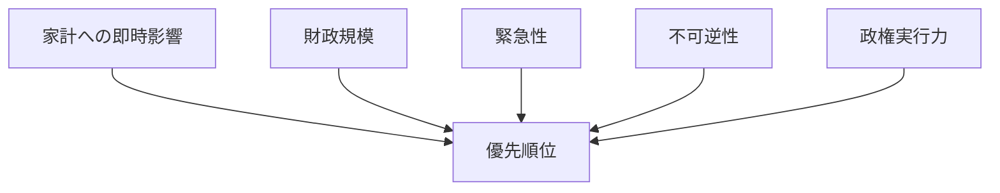

## 1. エグゼクティブサマリー

2026年6月3日時点の日本の国政で最優先なのは、家計の実質所得、社会保障の持続可能性、そして財政制約の三つである。高市内閣は自民党・日本維新の会の連立政権として、強い経済、生活防衛、外交・防衛・情報能力の強化を前面に置いている。<SourceNote>[首相官邸, 2026年6月の基本方針](https://japan.kantei.go.jp/105/decisions/2026/_00001.html), [首相官邸, 自民党・日本維新の会連立政権に関する発表](https://www.kantei.go.jp/jp/kakugikettei/2026/_00004.html), [自由民主党・日本維新の会 連立政権合意書](https://storage2.jimin.jp/pdf/news/information/211626.pdf)</SourceNote>

本稿の順位づけは、次の四基準を合成したものである。家計への即時影響、財政規模、緊急性、不可逆性である。したがって、選挙向けの話題性よりも、先送りしたときの損失が大きい論点を上に置く。

1. 物価高・賃上げ・可処分所得
1. 社会保障
1. 財政・税制
1. 外交安保・経済安全保障
1. 人口減少・労働供給・地方維持
1. 政治改革・政治資金

この順は絶対順位ではない。だが、国会で実際に長く争われる順序としては、家計と社会保障が最上位に来て、その下に財政制約、外交安保、人口、政治改革が続くとみるのが妥当である。

## 2. 順位の付け方

このレポートは、国民生活に最も直接効くものを上に置く。そのうえで、制度の維持に必要な歳出の大きさと、後戻りしにくさを加点する。たとえば、物価高は毎月の家計に効く。社会保障は毎年の財政に効く。人口減少は一度進むと戻しにくい。政治改革は重要だが、家計への即時影響は相対的に小さい。

この見方を採ると、今の日本では「短期の痛みをどう和らげるか」と「中期の制度をどう壊さずに組み替えるか」が同時に問われていると分かる。政府と主要政党の争点も、実際にはその二層に集まっている。<SourceNote>[総務省統計局, 2026年4月の消費者物価指数](https://www.stat.go.jp/data/cpi/sokuhou/tsuki/pdf/zenkoku.pdf), [総務省統計局, 労働力調査 2026年4月](https://www.stat.go.jp/english/index.html), [厚生労働省, 毎月勤労統計調査 2026年3月分](https://www.mhlw.go.jp/toukei/list/30-1a.html)</SourceNote>

## 3. 論点別ランキング

### 1. 物価高・賃上げ・可処分所得

最重要論点は、依然として物価高である。総務省統計局の2026年4月の全国CPIは、総合1.4%、生鮮食品を除く総合1.2%、生鮮食品及びエネルギーを除く総合2.5%だった。失業率は2.5%で、労働市場はなお引き締まっている。厚生労働省の2026年3月毎月勤労統計では現金給与総額が前年同月比3.3%増だったが、家計の体感としては、賃上げが物価上昇を十分に上回っているとはまだ言いがたい。<SourceNote>[総務省統計局, 2026年4月の消費者物価指数](https://www.stat.go.jp/data/cpi/sokuhou/tsuki/pdf/zenkoku.pdf), [総務省統計局, 労働力調査 2026年4月](https://www.stat.go.jp/english/index.html), [厚生労働省, 毎月勤労統計調査 2026年3月分](https://www.mhlw.go.jp/toukei/list/30-1a.html)</SourceNote>

政府は、食料品の消費税負担の軽減や給付付き税額控除を軸に家計の下支えを打ち出している。立憲民主党は食料品税率ゼロを掲げ、公明党は減税と給付を組み合わせる姿勢が強い。国民民主党は手取り増を前面に出し、日本共産党は消費税5%への引き下げを主張する。争点は、家計支援が必要かどうかではない。どの方式で支援するか、つまり恒久減税にするのか、時限的な給付にするのか、それとも賃上げと税制を組み合わせるのか、という設計の違いにある。<SourceNote>[Prime Minister's Office of Japan, Basic Policy for June 2026](https://japan.kantei.go.jp/105/decisions/2026/_00001.html), [Constitutional Democratic Party of Japan, policy platform 2025](https://cdp-japan.jp/visions/policies2025), [Komeito manifesto 2025](https://www.komei.or.jp/content/manifesto2025/), [Democratic Party for the People policies 2025](https://new-kokumin.jp/policies2025), [Japanese Communist Party policy 2025](https://www.jcp.or.jp/web_policy/11419.html)</SourceNote>

### 2. 社会保障

社会保障は金額でも構造でも最大級の争点だ。内閣府の高齢社会白書では、2024年10月1日現在の高齢化率は29.3%、総人口は1億2380万人で、2070年には高齢化率が38.7%に達すると見込まれている。財務省の2026年度予算では、社会保障関係費は39.1兆円で、一般会計総額122.3兆円の中核を占める。これは、医療、介護、年金、子育て支援を同時にどう維持するかが、単発の政策ではなく国家の恒常課題であることを示している。<SourceNote>[内閣府, 令和7年版高齢社会白書](https://www8.cao.go.jp/kourei/whitepaper/w-2025/html/zenbun/s1_1_1.html), [財務省, 令和8年度一般会計予算](https://www.mof.go.jp/policy/budget/budger_workflow/budget/fy2026/seifuan2026/index.html)</SourceNote>

この論点では、与党も野党も「何を減らすか」より「何を守るか」を先に語るが、負担と給付の組み合わせはかなり違う。政府と与党は制度の持続性と重点化を重視し、野党は窓口負担や保険料の軽減、あるいは給付の拡充を強く訴える。社会保障は、今すぐ生活に効く一方で、制度を壊すと回復に長い時間がかかるため、順位は2位に置くのが妥当である。<SourceNote>[Prime Minister's Office of Japan, Basic Policy for June 2026](https://japan.kantei.go.jp/105/decisions/2026/_00001.html), [Constitutional Democratic Party of Japan, policy platform 2025](https://cdp-japan.jp/visions/policies2025), [Komeito manifesto 2025](https://www.komei.or.jp/content/manifesto2025/), [Japanese Communist Party policy 2025](https://www.jcp.or.jp/web_policy/11419.html)</SourceNote>

### 3. 財政・税制

財政は、ほぼすべての国政論点の制約条件である。2026年度の一般会計は122.3兆円で、その中で社会保障と国債費、防衛費が大きな比重を占める。防衛関係費も8.8兆円に達しており、社会保障と安全保障を同時に拡張しながら、税収と国債でどう賄うかが焦点になっている。<SourceNote>[財務省, 令和8年度一般会計予算](https://www.mof.go.jp/policy/budget/budger_workflow/budget/fy2026/seifuan2026/index.html)</SourceNote>

政府の基本方針は、責任ある積極財政の枠内で、必要な政策は初年度予算で確保しつつ、成長と賃上げで税収基盤を広げるという考え方である。立憲民主党や日本共産党は、より再分配色の強い財政運営を求める。国民民主党は家計の手取り増を重視するが、恒常的な財政悪化は避けるべきだという建て付けを取る。財政論争は、結局は「誰に、いつ、どこまで負担を先送りするか」の争いである。<SourceNote>[Prime Minister's Office of Japan, Basic Policy for June 2026](https://japan.kantei.go.jp/105/decisions/2026/_00001.html), [Constitutional Democratic Party of Japan, policy platform 2025](https://cdp-japan.jp/visions/policies2025), [Democratic Party for the People policies 2025](https://new-kokumin.jp/policies2025), [Japanese Communist Party policy 2025](https://www.jcp.or.jp/web_policy/11419.html)</SourceNote>

### 4. 外交安保・経済安全保障

外交安保は、平時には家計論点より順位が下がりやすいが、危機が起きると一気に上がる論点である。現在の政府は、日米同盟、抑止力、情報能力、サイバー、経済安全保障を強化する方向にある。自民党・維新の連立合意書でも、防衛・安全保障と統治機構改革が重視されている。<SourceNote>[首相官邸, 2026年6月の基本方針](https://japan.kantei.go.jp/105/decisions/2026/_00001.html), [自由民主党・日本維新の会 連立政権合意書](https://storage2.jimin.jp/pdf/news/information/211626.pdf)</SourceNote>

これに対し、立憲民主党は専守防衛と現実的な安全保障を掲げ、公明党は平和外交と抑止のバランスを重視する。争点は、抑止力をどこまで強めるか、装備移転や防衛産業をどう扱うか、そして対中・対北・対露リスクをどう政策に落とし込むかである。外交安保は生活実感に直結しにくいが、エネルギー、海上輸送、半導体、サイバーを通じて家計と企業に跳ね返る。<SourceNote>[Constitutional Democratic Party of Japan, policy platform 2025](https://cdp-japan.jp/visions/policies2025), [Komeito manifesto 2025](https://www.komei.or.jp/content/manifesto2025/), [Prime Minister's Office of Japan, Basic Policy for June 2026](https://japan.kantei.go.jp/105/decisions/2026/_00001.html)</SourceNote>

### 5. 人口減少・労働供給・地方維持

人口減少は最も不可逆な論点だ。高齢化率が29.3%に達し、将来は38.7%へ向かうという構造の下では、労働供給、税収、介護、地域交通、学校、医療のすべてが同時に圧迫される。政府の基本方針が、少子化対策だけでなく、地域交通や外国人との秩序ある共生まで含めているのは、そのためである。<SourceNote>[内閣府, 令和7年版高齢社会白書](https://www8.cao.go.jp/kourei/whitepaper/w-2025/html/zenbun/s1_1_1.html), [首相官邸, 2026年6月の基本方針](https://japan.kantei.go.jp/105/decisions/2026/_00001.html)</SourceNote>

この論点の難しさは、補助金を一度出して終わりにはならないことだ。保育、教育、働き方、移住・定住、外国人受け入れ、地方自治体の財政と交通網を同時に組み替える必要がある。したがって、人口問題は順位としては5位でも、他の論点の前提条件としては実質1位に近い。<SourceNote>[内閣府, 令和7年版高齢社会白書](https://www8.cao.go.jp/kourei/whitepaper/w-2025/html/zenbun/s1_1_1.html), [首相官邸, 2026年6月の基本方針](https://japan.kantei.go.jp/105/decisions/2026/_00001.html)</SourceNote>

### 6. 政治改革・政治資金

政治改革は、家計への即時効果は小さいが、政権の信頼と法案成立能力に直接効く。自民党は、透明化とオンライン化を進めつつ、企業・団体献金の全面禁止には慎重である。立憲民主党と日本共産党は、企業・団体献金の禁止を強く求める。公明党も政治改革を重要論点として扱っており、国民民主党は透明性の強化を重視するが、全面禁止より制度設計を重視する。<SourceNote>[自由民主党, 政治資金改革関連ページ](https://www.jimin.jp/news/information/210284.html), [Constitutional Democratic Party of Japan, policy platform 2025](https://cdp-japan.jp/visions/policies2025), [Komeito manifesto 2025](https://www.komei.or.jp/content/manifesto2025/), [Democratic Party for the People policies 2025](https://new-kokumin.jp/policies2025), [Japanese Communist Party policy 2025](https://www.jcp.or.jp/web_policy/11419.html)</SourceNote>

この論点が重要なのは、単なる「カネの問題」ではなく、政府・与党・野党が他の政策で妥協できるかを左右するからである。政治改革が止まると、物価、社会保障、財政、安保のどれも不安定になる。だからこそ順位は6位でも、制度の信頼を支える意味では軽く扱えない。<SourceNote>[Liberal Democratic Party political finance reform page](https://www.jimin.jp/news/information/210284.html), [Constitutional Democratic Party of Japan, policy platform 2025](https://cdp-japan.jp/visions/policies2025), [Komeito manifesto 2025](https://www.komei.or.jp/content/manifesto2025/)</SourceNote>

## 4. 党派別の対立軸

主要な対立軸は、右左よりも、家計重視か制度重視か、減税か給付か、抑止強化か抑制か、公開か禁止か、に分かれる。

1. 与党の自民・維新は、成長、賃上げ、責任ある積極財政、安保強化、統治機構改革を組み合わせる。
1. 立憲民主党は、食料品税率ゼロ、給付、社会保障の充実、現実的な安全保障、政治資金改革を前面に出す。
1. 公明党は、家計負担の軽減、社会保障、平和外交、政治改革をバランスよく並べる。
1. 国民民主党は、手取り増、税負担の軽減、働く世代の支援を強く押し出す。
1. 日本共産党は、消費税減税、最低賃金引き上げ、社会保障の拡充、企業・団体献金禁止を一貫して訴える。

この整理は、各党の2025年以降の公開政策文書と政府の基本方針を比較した要約である。完全な一致ではないが、国会審議の実際の軸はほぼこの五本に収まる。<SourceNote>[Prime Minister's Office of Japan, Basic Policy for June 2026](https://japan.kantei.go.jp/105/decisions/2026/_00001.html), [Liberal Democratic Party and Japan Innovation Party coalition agreement](https://storage2.jimin.jp/pdf/news/information/211626.pdf), [Constitutional Democratic Party of Japan, policy platform 2025](https://cdp-japan.jp/visions/policies2025), [Komeito manifesto 2025](https://www.komei.or.jp/content/manifesto2025/), [Democratic Party for the People policies 2025](https://new-kokumin.jp/policies2025), [Japanese Communist Party policy 2025](https://www.jcp.or.jp/web_policy/11419.html)</SourceNote>

## 5. 政策を見るための判断材料

家計にとっては、当面の注目点は、食料品やエネルギーの値下がりではなく、実質賃金、税額控除、社会保険料、医療・介護負担である。企業にとっては、賃上げと人手不足が最重要で、次に防衛・サイバー・公共調達、最後に税制変更の順で影響が出やすい。政策を読む側は、補正予算だけでなく、当初予算、政治資金改革法案、社会保障改革、外交安保関連の改正案を並行して追う必要がある。

## 6. 限界と見通し

この順位は、2026年6月3日時点の公開情報に基づく。外部ショックでエネルギー価格が急騰すれば、外交安保とエネルギー政策の順位は上がる。重大な政治資金スキャンダルが出れば、政治改革は一気に最上位へ上がる。逆に、物価が十分に落ち着き、賃上げが実感を伴って広がれば、財政と社会保障の比重がさらに上がる。

つまり、このレポートは固定順位の宣言ではない。現在の日本で、どの論点が家計、制度、政権運営を最も強く縛っているかを、公開情報から暫定的に並べたものである。

## 参考情報

- [首相官邸, 2026年6月の基本方針](https://japan.kantei.go.jp/105/decisions/2026/_00001.html)
- [首相官邸, 自民党・日本維新の会連立政権に関する発表](https://www.kantei.go.jp/jp/kakugikettei/2026/_00004.html)
- [自由民主党・日本維新の会 連立政権合意書](https://storage2.jimin.jp/pdf/news/information/211626.pdf)
- [総務省統計局, 2026年4月の消費者物価指数](https://www.stat.go.jp/data/cpi/sokuhou/tsuki/pdf/zenkoku.pdf)
- [総務省統計局, 労働力調査 2026年4月](https://www.stat.go.jp/english/index.html)
- [厚生労働省, 毎月勤労統計調査 2026年3月分](https://www.mhlw.go.jp/toukei/list/30-1a.html)
- [内閣府, 令和7年版高齢社会白書](https://www8.cao.go.jp/kourei/whitepaper/w-2025/html/zenbun/s1_1_1.html)
- [財務省, 令和8年度一般会計予算](https://www.mof.go.jp/policy/budget/budger_workflow/budget/fy2026/seifuan2026/index.html)
- [自由民主党, 政治資金改革関連ページ](https://www.jimin.jp/news/information/210284.html)
- [立憲民主党, 2025年政策集](https://cdp-japan.jp/visions/policies2025)
- [公明党, 2025年政策・マニフェスト](https://www.komei.or.jp/content/manifesto2025/)
- [国民民主党, 2025年政策](https://new-kokumin.jp/policies2025)
- [日本共産党, 2025年政策](https://www.jcp.or.jp/web_policy/11419.html)
