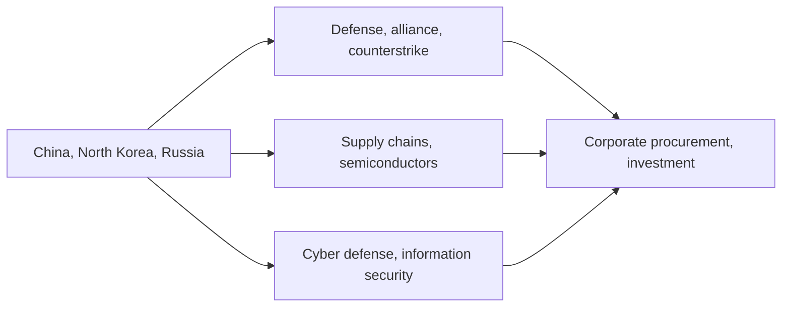

# Japan's Foreign Security and Economic Security Agenda, 2026

## 1. Executive Summary

Japan’s foreign security agenda and its economic-security agenda are no longer separate policy lanes. Tensions involving China, the Taiwan Strait, North Korea, and Russia now tie together alliance management, defense spending, counterstrike capability, cyber defense, supply chains, semiconductors, and critical-technology controls. The Ministry of Defense’s 2025 Defense White Paper says Japan faces the “most severe and complex security environment” of the postwar period. <SourceNote>[Ministry of Defense, Defense of Japan 2025](https://www.mod.go.jp/j/press/wp/wp2025/html/nd200000.html), [MOFA, Diplomatic Bluebook 2025: China and Mongolia](https://www.mofa.go.jp/policy/other/bluebook/2025/en_html/chapter2/c020202.html), [MOFA, Diplomatic Bluebook 2025: Korean Peninsula](https://www.mofa.go.jp/policy/other/bluebook/2025/en_html/chapter2/c020203.html)</SourceNote>

The practical reading is straightforward. First, how can Japan sustain deterrence and alliance operations? Second, how can it protect critical goods, semiconductors, cloud systems, power, and telecom networks? Third, how do those policy choices show up in procurement, inventory, investment, and cyber controls inside firms? This article uses current primary sources to separate those three layers. <SourceNote>[Cabinet Office, Economic Security Promotion Act portal](https://www.cao.go.jp/keizai_anzen_hosho/index.html), [METI, semiconductor supply-security initiatives](https://www.meti.go.jp/policy/economy/economic_security/semicon/index.html), [Cabinet Secretariat, cyber security policy efforts](https://www.cas.go.jp/jp/seisaku/cyber_anzen_hosyo_torikumi/)</SourceNote>

The diagram shows how geopolitical pressure flows beyond defense policy into procurement and investment decisions. Treating defense, supply chains, and cyber as separate topics makes it easy to miss the operational risk. <SourceNote>The structure is a simplified synthesis of the Defense White Paper 2025, Diplomatic Bluebook 2025, the economic-security portal, and the semiconductor supply-security page. The “flow” here is an inference from public information, not an official roadmap.</SourceNote>

## 2. What Has Changed

The center of China policy is the risk that the Taiwan Strait and the East and South China Seas could become a connected zone of instability. Diplomatic Bluebook 2025 describes China’s external posture and military activity as a “serious concern” and states that peace and stability across the Taiwan Strait are important. In other words, the Japanese government now treats China as a deterrence and crisis-management issue, not just an economic counterpart. <SourceNote>[MOFA, Diplomatic Bluebook 2025: China and Mongolia](https://www.mofa.go.jp/policy/other/bluebook/2025/en_html/chapter2/c020202.html)</SourceNote>

North Korea continues ballistic-missile launches and space-related activity and has not moved toward the complete dismantlement of its nuclear and missile programs. Diplomatic Bluebook 2025 also treats the abduction issue as directly relevant to Japan’s security. In operational terms, that means interception, warning and surveillance, intelligence collection, and sanctions enforcement must all run continuously in peacetime. <SourceNote>[MOFA, Diplomatic Bluebook 2025: Korean Peninsula](https://www.mofa.go.jp/policy/other/bluebook/2025/en_html/chapter2/c020203.html)</SourceNote>

For Russia, the baseline is a prolonged war in Ukraine and continued sanctions coordination. MOFA’s sanctions notices were updated again in 2025, and Japanese firms must think beyond direct trade to third-country routing, dual-use items, shipping, and insurance. <SourceNote>[MOFA, sanctions against Russia](https://www.mofa.go.jp/mofaj/press/release/pressit_000001_02377.html), [MOFA, additional sanctions measures against Russia](https://www.mofa.go.jp/mofaj/press/release/pressit_000001_02712.html)</SourceNote>

The Japan-U.S. alliance is now weighted more heavily toward information, space, cyber, missile defense, and integrated operations than in the past. The 2025 Defense White Paper describes force-building toward a Joint Operations Command and an effective counterstrike capability. The FY2026 initial budget already puts defense-related spending at about JPY 8.8 trillion. <SourceNote>[Ministry of Defense, Defense of Japan 2025](https://www.mod.go.jp/j/press/wp/wp2025/html/nd200000.html), [Ministry of Finance, FY2026 general account budget](https://www.mof.go.jp/policy/budget/budger_workflow/budget/fy2026/seifuan2026/index.html)</SourceNote>

## 3. The Defense and Alliance Baseline

Current Japanese security policy is not just about adding equipment. It is moving toward a system that ties together command, intelligence, logistics, bases, and communications. The 2025 Defense White Paper places force development under the goal of reaching defense spending equal to 2 percent of GDP by FY2027. What matters is not only counterstrike and stand-off capability, but also the logistics and command-and-control required to keep forces operating over time. <SourceNote>[Ministry of Defense, Defense of Japan 2025](https://www.mod.go.jp/j/press/wp/wp2025/html/nd200000.html)</SourceNote>

| Layer | Current pillar | Practical meaning |
| --- | --- | --- |
| Defense | Force development through FY2027, Joint Operations Command, sustained operations | Continued investment in procurement, bases, logistics, and training |
| Alliance | U.S.-Japan extended deterrence, joint operations, missile defense | Interoperability, joint planning, communication security |
| Intelligence | Surveillance, warning, information sharing | Early warning, threat assessment, classified handling |
| Cyber | Active cyber defense, critical-infrastructure protection | Logs, monitoring, incident reporting, vendor control |
| Economic security | Critical goods, core infrastructure, critical technologies | Supplier diversification, inventory, anti-leakage controls |

This structure is implemented through budgets, enforcement, and public-private coordination rather than through a single law. In practice, policy effectiveness depends on whether ministries execute the rules and whether firms actually prepare. <SourceNote>[Ministry of Defense, Defense of Japan 2025](https://www.mod.go.jp/j/press/wp/wp2025/html/nd200000.html), [Ministry of Finance, FY2026 general account budget](https://www.mof.go.jp/policy/budget/budger_workflow/budget/fy2026/seifuan2026/index.html)</SourceNote>

## 4. The Economic-Security Framework

The Economic Security Promotion Act is easiest to understand as a four-layer system. First is supply assurance for designated critical goods. Second is prior screening for core infrastructure. Third is public-private work on advanced critical technologies. Fourth is protection and utilization of important economic-security information. The Cabinet Office’s portal makes clear that the framework is built to cover supply, infrastructure, R&D, and information control together. <SourceNote>[Cabinet Office, Economic Security Promotion Act portal](https://www.cao.go.jp/keizai_anzen_hosho/index.html)</SourceNote>

The list of designated critical goods has also expanded over time. The Cabinet Office’s supply-chain page includes antibiotics, fertilizers, magnets, machine tools, industrial robots, aircraft parts, semiconductors, batteries, cloud programs, natural gas, critical minerals, ship parts, electronic components, uranium, ventilators, drones, satellites, and rocket parts. This is not a narrow stockpiling policy; it is a broad attempt to secure strategically sensitive material and industrial inputs. <SourceNote>[Cabinet Office, supply assurance for designated critical goods](https://www.cao.go.jp/keizai_anzen_hosho/suishinhou/supply_chain/supply_chain.html)</SourceNote>

Semiconductor policy is also broader than subsidies. METI’s semiconductor page emphasizes secure supply for legacy chips, manufacturing equipment, materials, and feedstock, while also supporting domestic production, technology protection, and supply-chain resilience. In February 2026, METI also announced the first batch under the Japan-U.S. Strategic Investment Initiative, showing that economic security is moving together with industrial policy. <SourceNote>[METI, semiconductor supply-security initiatives](https://www.meti.go.jp/policy/economy/economic_security/semicon/index.html), [METI, first batch of the Japan-U.S. Strategic Investment Initiative](https://www.meti.go.jp/english/press/2026/0218_002.html)</SourceNote>

## 5. Cyber and Information Defense

Cyber is no longer a side issue. Japan passed cyber countermeasure legislation in 2025 and moved toward active cyber defense. The 2025 Defense White Paper also emphasizes the ability to preserve command-and-control and key systems under attack. In other words, routine logging, intrusion detection, and contractor oversight are now part of national-security readiness. <SourceNote>[Cabinet Secretariat, cyber security policy efforts](https://www.cas.go.jp/jp/seisaku/cyber_anzen_hosyo_torikumi/), [Cyber Security Strategy Headquarters related page](https://www.cyber.go.jp/law/lawlink.html), [Ministry of Defense, Defense of Japan 2025](https://www.mod.go.jp/j/press/wp/wp2025/html/nd200000.html)</SourceNote>

METI is also pushing security assessments and contractor management for companies that support critical infrastructure and supply chains. That means cyber defense is no longer only an IT department issue; it becomes a procurement, legal, internal-control, and management-board issue. Manufacturing, logistics, telecom, finance, and power companies are especially likely to be judged on the maturity of their vendors. <SourceNote>[METI, supply-chain strengthening and security measures](https://www.meti.go.jp/policy/netsecurity/sme/information_security/index.html)</SourceNote>

## 6. Practical Implications

For firms, the first task is mapping critical dependencies. That means semiconductors, control systems, cloud services, satellite data, specialty materials, shipping, insurance, customs, and cyber vendors should be mapped and stress-tested for single-country or single-vendor dependence. The second task is sanctions, export-control, and dual-use screening. This applies not only to Russia-related exposure, but also to North Korea-related routing and third-country transactions. <SourceNote>[MOFA, sanctions against Russia](https://www.mofa.go.jp/mofaj/press/release/pressit_000001_02377.html), [MOFA, North Korea sanctions and export-control materials](https://www.mofa.go.jp/mofaj/region/n_korea/sanctions.html), [METI, semiconductor supply-security initiatives](https://www.meti.go.jp/policy/economy/economic_security/semicon/index.html)</SourceNote>

For governments and infrastructure operators, the first task is redundancy in command-and-control, communications, power, ports, satellites, and backups. Geopolitical shocks often damage availability before they affect price, so the priority is not only cost minimization in peacetime but also shorter recovery time under disruption. Households feel the effects indirectly through energy prices, logistics costs, telecom fees, and eventually taxes. <SourceNote>[Ministry of Defense, Defense of Japan 2025](https://www.mod.go.jp/j/press/wp/wp2025/html/nd200000.html), [Ministry of Finance, FY2026 general account budget](https://www.mof.go.jp/policy/budget/budger_workflow/budget/fy2026/seifuan2026/index.html)</SourceNote>

## 7. Risks and Limits

This report has three limits. First, Taiwan, North Korea, and Russia make decisions that cannot be fully observed from public sources alone. Second, economic-security and cyber laws do not become effective simply because they are enacted; secondary rules and field implementation matter. Third, if U.S. alliance policy or sanctions policy changes, Japan’s priorities will also move. The map here therefore includes inference from public information, not only direct facts. <SourceNote>[MOFA, Diplomatic Bluebook 2025](https://www.mofa.go.jp/policy/other/bluebook/2025/en_html/), [Cabinet Office, Economic Security Promotion Act portal](https://www.cao.go.jp/keizai_anzen_hosho/index.html), [Cabinet Secretariat, cyber security policy efforts](https://www.cas.go.jp/jp/seisaku/cyber_anzen_hosyo_torikumi/)</SourceNote>

Three signals are enough to watch month by month. Those signals are defense budget execution, implementation of economic-security law, and private investment in semiconductors and cyber. If all three move forward together, Japan’s security posture is shifting from “budget accumulation” to “operational maturity.” If one stalls, the weaknesses in the other layers become visible very quickly. <SourceNote>[Ministry of Defense, Defense of Japan 2025](https://www.mod.go.jp/j/press/wp/wp2025/html/nd200000.html), [METI, semiconductor supply-security initiatives](https://www.meti.go.jp/policy/economy/economic_security/semicon/index.html), [Cyber Security Strategy Headquarters related page](https://www.cyber.go.jp/law/lawlink.html)</SourceNote>

## 8. Recommended Approach

Policymakers should treat defense, economic security, and cyber as one risk portfolio rather than separate ministerial agendas. Companies should design supplier redundancy, vendor audits, sanctions response, and exit options together. Readers should track three monthly indicators: 1) defense-budget execution, 2) enforcement of economic-security rules, and 3) changes in the China, North Korea, and Russia situations. <SourceNote>[Ministry of Defense, Defense of Japan 2025](https://www.mod.go.jp/j/press/wp/wp2025/html/nd200000.html), [Cabinet Office, Economic Security Promotion Act portal](https://www.cao.go.jp/keizai_anzen_hosho/index.html), [MOFA, Diplomatic Bluebook 2025](https://www.mofa.go.jp/policy/other/bluebook/2025/en_html/)</SourceNote>

## Reference Information

- [Ministry of Defense, Defense of Japan 2025](https://www.mod.go.jp/j/press/wp/wp2025/html/nd200000.html)
- [MOFA, Diplomatic Bluebook 2025: China and Mongolia](https://www.mofa.go.jp/policy/other/bluebook/2025/en_html/chapter2/c020202.html)
- [MOFA, Diplomatic Bluebook 2025: Korean Peninsula](https://www.mofa.go.jp/policy/other/bluebook/2025/en_html/chapter2/c020203.html)
- [MOFA, sanctions against Russia](https://www.mofa.go.jp/mofaj/press/release/pressit_000001_02377.html)
- [Cabinet Office, Economic Security Promotion Act portal](https://www.cao.go.jp/keizai_anzen_hosho/index.html)
- [Cabinet Office, supply assurance for designated critical goods](https://www.cao.go.jp/keizai_anzen_hosho/suishinhou/supply_chain/supply_chain.html)
- [METI, semiconductor supply-security initiatives](https://www.meti.go.jp/policy/economy/economic_security/semicon/index.html)
- [METI, first batch of the Japan-U.S. Strategic Investment Initiative](https://www.meti.go.jp/english/press/2026/0218_002.html)
- [Cabinet Secretariat, cyber security policy efforts](https://www.cas.go.jp/jp/seisaku/cyber_anzen_hosyo_torikumi/)
- [Cyber Security Strategy Headquarters related page](https://www.cyber.go.jp/law/lawlink.html)
- [Ministry of Finance, FY2026 general account budget](https://www.mof.go.jp/policy/budget/budger_workflow/budget/fy2026/seifuan2026/index.html)
