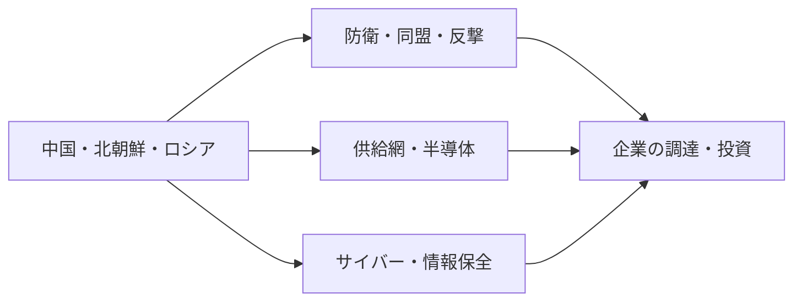

# 日本の外交安全保障と経済安全保障 2026年版

## 1. エグゼクティブサマリー

日本の外交安全保障と経済安全保障は、いまや別々の政策ではない。中国、台湾海峡、北朝鮮、ロシアをめぐる緊張が、同盟運用、防衛費、反撃能力、サイバー防衛、供給網、半導体、重要技術の管理をひとつの政策束にしている。防衛省の防衛白書2025は、日本が「戦後最も厳しく複雑な安全保障環境」に直面していると位置づけている。<SourceNote>[防衛省・自衛隊, 令和7年版防衛白書](https://www.mod.go.jp/j/press/wp/wp2025/html/nd200000.html), [外務省, 外交青書2025 中国・モンゴル編](https://www.mofa.go.jp/policy/other/bluebook/2025/en_html/chapter2/c020202.html), [外務省, 外交青書2025 朝鮮半島編](https://www.mofa.go.jp/policy/other/bluebook/2025/en_html/chapter2/c020203.html)</SourceNote>

実務上の見方は単純でよい。第一に、軍事的な抑止と同盟運用をどう維持するか。第二に、重要物資、半導体、クラウド、電力、通信をどう守るか。第三に、これらを企業の調達、在庫、投資、サイバー統制にどう落とし込むかである。この記事は、最新の一次情報を使って、その三層を分けて読むための整理を提供する。<SourceNote>[内閣官房国家安全保障局関連資料](https://www.cas.go.jp/jp/seisaku/anzenhosho/), [内閣府, 経済安全保障推進法関連ページ](https://www.cao.go.jp/keizai_anzen_hosho/index.html), [経済産業省, 半導体の安定供給確保の取組](https://www.meti.go.jp/policy/economy/economic_security/semicon/index.html)</SourceNote>

この図は、地政学上の圧力が、防衛政策だけでなく、企業の調達と投資判断にまで波及する構図を示している。防衛、供給網、サイバーを別案件として扱うと、実務上のリスクを見落としやすい。<SourceNote>図の関係は、防衛白書2025、外交青書2025、経済安全保障推進法関連ページ、半導体安定供給ページを単純化してまとめた。ここでの「波及」は、公開情報からの推定である。</SourceNote>

## 2. 何が変わったか

対中政策の中心は、台湾海峡と東シナ海・南シナ海の一体的な不安定化リスクにある。外交青書2025は、中国の対外姿勢と軍事動向を「深刻な懸念」とし、台湾海峡の平和と安定の重要性を明示している。つまり、日本政府は、中国を単なる経済相手国ではなく、抑止と危機管理の対象として扱っている。<SourceNote>[外務省, 外交青書2025 中国・モンゴル編](https://www.mofa.go.jp/policy/other/bluebook/2025/en_html/chapter2/c020202.html)</SourceNote>

北朝鮮は、弾道ミサイル発射と宇宙関連活動を繰り返し、核・ミサイル能力の完全な廃棄に向かっていない。外交青書2025は、拉致問題を含め、北朝鮮の行動が日本の安全保障に直接の影響を与えると整理している。実務的には、迎撃、警戒監視、情報収集、制裁実施を平時から回す必要がある。<SourceNote>[外務省, 外交青書2025 朝鮮半島編](https://www.mofa.go.jp/policy/other/bluebook/2025/en_html/chapter2/c020203.html)</SourceNote>

ロシアについては、ウクライナ侵略の長期化と、対ロ制裁の継続が前提になっている。外務省は2025年以降も制裁措置と価格上限の運用を更新しており、日本の企業にとっては、直接取引だけでなく、第三国経由の迂回、デュアルユース、海運・保険まで注意対象が広がっている。<SourceNote>[外務省, ロシアに対する制裁措置](https://www.mofa.go.jp/mofaj/press/release/pressit_000001_02377.html), [外務省, ロシアに対する制裁措置の追加等](https://www.mofa.go.jp/mofaj/press/release/pressit_000001_02712.html)</SourceNote>

日米同盟は、従来の抑止と防衛協力に加えて、情報、宇宙、サイバー、ミサイル防衛、統合運用の比重が増している。防衛白書2025は、統合作戦司令部の整備や、実効的な反撃能力の整備を含む防衛力強化を、国家安全保障の中心に置いている。2026年度当初予算でも、防衛関係費は約8.8兆円規模で積み上がっている。<SourceNote>[防衛省・自衛隊, 令和7年版防衛白書](https://www.mod.go.jp/j/press/wp/wp2025/html/nd200000.html), [財務省, 令和8年度一般会計予算](https://www.mof.go.jp/policy/budget/budger_workflow/budget/fy2026/seifuan2026/index.html)</SourceNote>

## 3. 防衛・同盟の基盤

現在の日本安全保障政策は、装備を増やすだけではなく、司令部、情報、補給、基地、通信を束ねる方向に進んでいる。防衛白書2025は、2027年度に防衛費をGDP比2%水準へ引き上げる方針の下で、能力ベースの整備を進めていると整理する。ここで重要なのは、反撃能力やスタンドオフだけでなく、持続運用を支えるロジスティクスとC2が同じ重みを持つことだ。<SourceNote>[防衛省・自衛隊, 令和7年版防衛白書](https://www.mod.go.jp/j/press/wp/wp2025/html/nd200000.html)</SourceNote>

| 層 | 現在の柱 | 実務上の意味 |
| --- | --- | --- |
| 防衛 | 2027年度までの能力整備、統合作戦司令部、持続運用 | 調達、基地、補給、訓練の継続投資 |
| 同盟 | 日米の拡大抑止、共同運用、ミサイル防衛 | 相互運用、共同計画、通信保全 |
| 情報 | 監視、警戒、インテリジェンス共有 | 早期警戒、脅威評価、秘密管理 |
| サイバー | 能動的サイバー防御、重要インフラ保護 | ログ、監視、通報、委託先統制 |
| 経済安保 | 重要物資、基幹インフラ、重要技術 | 調達先の多様化、在庫、技術流出防止 |

この層構造は、単独の法改正ではなく、予算、法執行、民間連携を通じて実装される。つまり、政府文書を読んで終わりではなく、各省の運用と企業側の準備が進んだかどうかで、政策の実効性が決まる。<SourceNote>[防衛省・自衛隊, 令和7年版防衛白書](https://www.mod.go.jp/j/press/wp/wp2025/html/nd200000.html), [財務省, 令和8年度一般会計予算](https://www.mof.go.jp/policy/budget/budger_workflow/budget/fy2026/seifuan2026/index.html)</SourceNote>

## 4. 経済安全保障の制度

経済安全保障推進法の実務は、少なくとも四層で見ると理解しやすい。第一に、特定重要物資の供給確保。第二に、基幹インフラの事前審査。第三に、先端重要技術の官民連携。第四に、重要経済安保情報の保護と活用である。内閣府の制度ページは、この法体系が供給だけでなく、インフラ、研究開発、情報管理を束ねる設計であることを示している。<SourceNote>[内閣府, 経済安全保障推進法](https://www.cao.go.jp/keizai_anzen_hosho/index.html)</SourceNote>

特定重要物資の対象は、2022年の初回指定から拡大している。内閣府の供給網ページでは、抗菌性物質、肥料、磁石、工作機械、産業用ロボット、航空機部品、半導体、蓄電池、クラウドプログラム、天然ガス、重要鉱物、船舶部品に加え、電子部品、ウラン、人工呼吸器、無人機、人工衛星、ロケット部品などが示されている。これは、単なる備蓄政策ではなく、戦略物資の裾野を広く取りに行く政策だと理解すべきだ。<SourceNote>[内閣府, 特定重要物資の供給確保](https://www.cao.go.jp/keizai_anzen_hosho/suishinhou/supply_chain/supply_chain.html)</SourceNote>

半導体政策も、補助金だけではない。経産省の半導体ページは、従来型半導体、製造装置、材料、原材料まで含めた安定供給確保を掲げており、国内生産、技術保全、サプライチェーン強靭化を同時に進める構えを見せている。2026年2月には、日米の戦略的投資イニシアティブの初回案件も公表され、経済安全保障が産業政策と同時に進んでいることが分かる。<SourceNote>[経済産業省, 半導体の安定供給確保の取組](https://www.meti.go.jp/policy/economy/economic_security/semicon/index.html), [経済産業省, 日米戦略的投資イニシアティブの第1弾](https://www.meti.go.jp/english/press/2026/0218_002.html)</SourceNote>

## 5. サイバー・情報防衛

サイバーは、もはや補助論点ではない。政府は2025年にサイバー対処能力強化法制を成立させ、能動的サイバー防御へ移行する枠組みを整えた。防衛白書2025も、指揮統制や重要システムを攻撃下でも維持する能力を重視している。つまり、平時のログ管理、侵入検知、委託先監査が、そのまま国家安全保障の前提になっている。<SourceNote>[内閣官房, サイバー安全保障分野の取組](https://www.cas.go.jp/jp/seisaku/cyber_anzen_hosyo_torikumi/), [サイバーセキュリティ戦略本部関連ページ](https://www.cyber.go.jp/law/lawlink.html), [防衛省・自衛隊, 令和7年版防衛白書](https://www.mod.go.jp/j/press/wp/wp2025/html/nd200000.html)</SourceNote>

経産省は、重要インフラやサプライチェーンを支える企業に対して、セキュリティ評価や委託先管理の強化を進めている。これが意味するのは、サイバー対策がIT部門だけの話ではなく、調達、法務、内部統制、経営会議の議題になることだ。とくに製造業、物流、通信、金融、電力は、取引先の成熟度まで含めて見られる。<SourceNote>[経済産業省, サプライチェーン強化とセキュリティ対策](https://www.meti.go.jp/policy/netsecurity/sme/information_security/index.html)</SourceNote>

## 6. 実務への含意

企業にとっての第一の課題は、重要依存の見える化である。半導体、制御機器、クラウド、衛星データ、特殊材料、海運、保険、通関、サイバー委託先まで洗い出し、単一国・単一社依存を減らす必要がある。第二は、制裁・輸出管理・デュアルユースの確認である。ロシア関連だけでなく、北朝鮮関連の迂回や第三国取引も、法務と貿易実務でチェックし続ける必要がある。<SourceNote>[外務省, ロシアに対する制裁措置](https://www.mofa.go.jp/mofaj/press/release/pressit_000001_02377.html), [外務省, 北朝鮮関連の制裁・輸出管理関連資料](https://www.mofa.go.jp/mofaj/region/n_korea/sanctions.html), [経済産業省, 半導体の安定供給確保の取組](https://www.meti.go.jp/policy/economy/economic_security/semicon/index.html)</SourceNote>

公共部門とインフラ企業にとっての第一の課題は、C2、通信、電力、港湾、衛星、バックアップの冗長化である。地政学上の危機は、しばしば価格より先に可用性を壊すため、平時のコスト最小化より、障害時の復旧時間を短くする設計が重要になる。家計への影響は直接的ではないが、エネルギー価格、物流費、通信費、税負担を通じて遅れて表れる。<SourceNote>[防衛省・自衛隊, 令和7年版防衛白書](https://www.mod.go.jp/j/press/wp/wp2025/html/nd200000.html), [財務省, 令和8年度一般会計予算](https://www.mof.go.jp/policy/budget/budger_workflow/budget/fy2026/seifuan2026/index.html)</SourceNote>

## 7. リスク・限界

この報告の限界は三つある。第一に、台湾海峡や北朝鮮、ロシアの意思決定は、公開情報だけでは追えない。第二に、経済安保法制とサイバー法制は、成立しても運用細則と現場実装が進まなければ実効性が出ない。第三に、米国の同盟政策や制裁政策が変われば、日本の優先順位も動く。したがって、ここでの整理は、公開情報からの推定を含む現時点の政策地図である。<SourceNote>[外務省, 外交青書2025](https://www.mofa.go.jp/policy/other/bluebook/2025/en_html/), [内閣府, 経済安全保障推進法](https://www.cao.go.jp/keizai_anzen_hosho/index.html), [内閣官房, サイバー安全保障分野の取組](https://www.cas.go.jp/jp/seisaku/cyber_anzen_hosyo_torikumi/)</SourceNote>

今後の注目点は三つで足りる。防衛費と装備移転、経済安保法制の執行、半導体とサイバーの民間投資である。これらが同時に前に進むなら、日本の安全保障は「予算の積み上げ」から「運用の定着」へ移る。逆に、どれか一つでも止まると、他の層の脆弱性が露呈する。<SourceNote>[防衛省・自衛隊, 令和7年版防衛白書](https://www.mod.go.jp/j/press/wp/wp2025/html/nd200000.html), [経済産業省, 半導体の安定供給確保の取組](https://www.meti.go.jp/policy/economy/economic_security/semicon/index.html), [サイバーセキュリティ戦略本部関連ページ](https://www.cyber.go.jp/law/lawlink.html)</SourceNote>

## 8. 推奨方針

政策担当者は、防衛、経済安保、サイバーを別の省庁案件として扱わず、同じリスク台帳で管理するべきである。企業は、重要部材の二重化、委託先の監査、制裁対応、出口戦略を一体で設計するべきだ。読者が毎月追うべき指標は、①防衛予算の執行、②経済安保法制の運用、③中国・北朝鮮・ロシアをめぐる情勢変化の三つである。<SourceNote>[防衛省・自衛隊, 令和7年版防衛白書](https://www.mod.go.jp/j/press/wp/wp2025/html/nd200000.html), [内閣府, 経済安全保障推進法](https://www.cao.go.jp/keizai_anzen_hosho/index.html), [外務省, 外交青書2025](https://www.mofa.go.jp/policy/other/bluebook/2025/en_html/)</SourceNote>

## 参考情報

- [防衛省・自衛隊, 令和7年版防衛白書](https://www.mod.go.jp/j/press/wp/wp2025/html/nd200000.html)
- [外務省, 外交青書2025 中国・モンゴル編](https://www.mofa.go.jp/policy/other/bluebook/2025/en_html/chapter2/c020202.html)
- [外務省, 外交青書2025 朝鮮半島編](https://www.mofa.go.jp/policy/other/bluebook/2025/en_html/chapter2/c020203.html)
- [外務省, ロシアに対する制裁措置](https://www.mofa.go.jp/mofaj/press/release/pressit_000001_02377.html)
- [内閣府, 経済安全保障推進法](https://www.cao.go.jp/keizai_anzen_hosho/index.html)
- [内閣府, 特定重要物資の供給確保](https://www.cao.go.jp/keizai_anzen_hosho/suishinhou/supply_chain/supply_chain.html)
- [経済産業省, 半導体の安定供給確保の取組](https://www.meti.go.jp/policy/economy/economic_security/semicon/index.html)
- [経済産業省, 日米戦略的投資イニシアティブの第1弾](https://www.meti.go.jp/english/press/2026/0218_002.html)
- [内閣官房, サイバー安全保障分野の取組](https://www.cas.go.jp/jp/seisaku/cyber_anzen_hosyo_torikumi/)
- [サイバーセキュリティ戦略本部関連ページ](https://www.cyber.go.jp/law/lawlink.html)
- [財務省, 令和8年度一般会計予算](https://www.mof.go.jp/policy/budget/budger_workflow/budget/fy2026/seifuan2026/index.html)
