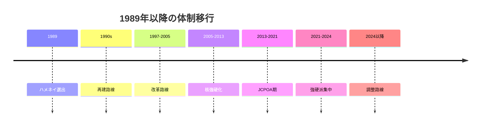
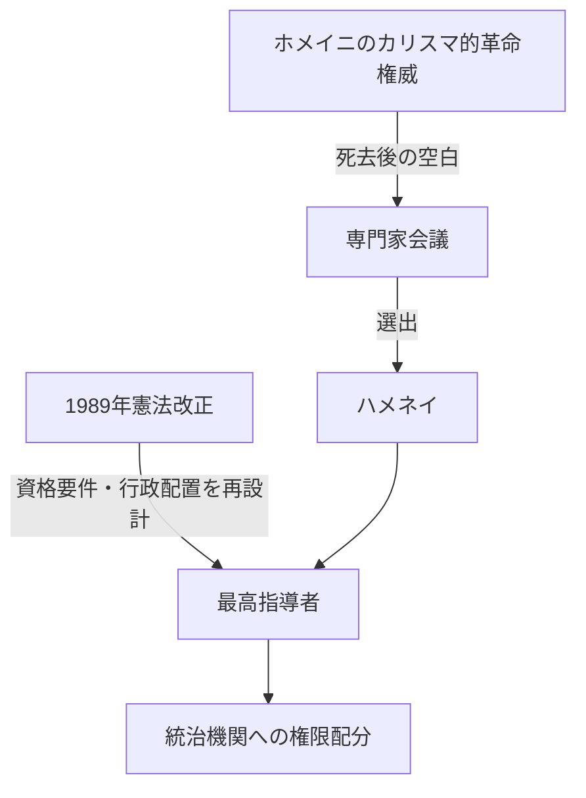
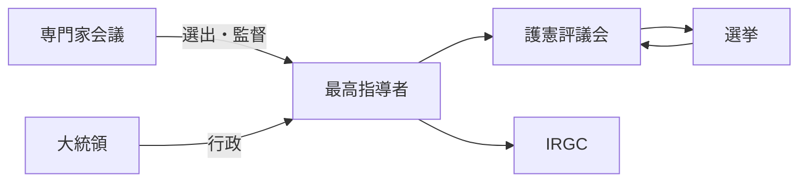

# ホメイニからハメネイへの体制移行とイラン権力構造の再編

## 1. エグゼクティブサマリー

ホメイニ死去後のイラン体制は、単に「次の宗教指導者が自然に継いだ」のではない。実際には、1989年の憲法改正、専門家会議による選出、ラフサンジャニを中心とする政治連合、革命防衛隊（IRGC）を含む治安機構、護憲評議会による入口管理が重なって、ハメネイを中心とする新しい統治の重心が作られた。ここで重要なのは、宗教的正統性が純粋な神学的権威だけで決まったのではなく、制度改正と政治連合によって再構成された点である。<SourceNote>1989年の憲法改正と指導者選出の経緯は [Encyclopaedia Iranica, Constitution of the Islamic Republic](https://www.iranicaonline.org/articles/constitution-of-the-islamic-republic/) と [USIP Iran Primer, The Assembly of Experts](https://iranprimer.usip.org/resource/assembly-experts) を参照した。</SourceNote>

この移行の本質は三つある。第一に、ハメネイの権威は「革命の創始者の後継者」という象徴性だけでなく、憲法上の最高指導者権限を通じて軍事・司法・監督機構を束ねる仕組みに支えられた。第二に、1989年改正は、最高指導者の資格要件と国家機関の配置を調整し、個人のカリスマより制度の継続性を優先する方向で体制を再設計した。第三に、その後の各政権は、自由に政策を変えたというより、最高指導者が許容する範囲で経済・外交・核政策の揺れを作ったにすぎない。<SourceNote>憲法上の最高指導者権限は [Constitute Project, Constitution of the Islamic Republic of Iran](https://www.constituteproject.org/constitution/Iran_1989.pdf) と [USIP Iran Primer, The Supreme Leader](https://iranprimer.usip.org/resource/supreme-leader) に基づく。</SourceNote>

対外政策では、この体制は「革命輸出」の直接的言語を抑えながら、核開発、制裁耐性、地域代理勢力の運用を通じて抑止と交渉を併用する方向へ進んだ。ラフサンジャニ期の再建、ハータミー期の有限な開放、アフマディネジャド期の対米対決と核加速、ロウハニ期のJCPOA、ライシ期の強硬化、そして2024年のペゼシュキアン政権でも、最終的な戦略決定は最高指導者とその周辺機構に残っている。<SourceNote>各政権との関係は [USIP Iran Primer, Seven Presidents](https://iranprimer.usip.org/resource/seven-presidents) と [Reuters, July 2024 Iran election coverage](https://www.investing.com/news/world-news/iranians-vote-in-runoff-presidential-election-amid-widespread-apathy-3508560) による。2024年以降も、改革派大統領の選出はあっても戦略権限は最高指導者側に残るという見立ては公表情報からの推定である。</SourceNote>

## 2. 1989年の継承はどう成立したか

1989年6月3日にホメイニが死去すると、体制は継承の空白を避ける必要に迫られた。専門家会議はハメネイを指導者に選び、その後の憲法改正で、最高指導者を支える制度配置が整えられた。ここで重要なのは、選出が「既に完成した宗教的権威の自動継承」ではなく、革命の正統性を維持するための政治的決定だったことだ。<SourceNote>ホメイニ死去後の継承と専門家会議の役割は [USIP Iran Primer, The Assembly of Experts](https://iranprimer.usip.org/resource/assembly-experts) と [Britannica, Ruhollah Khomeini](https://www.britannica.com/biography/Ruhollah-Khomeini) を参照した。</SourceNote>

1989年改正の制度的意味は大きい。IRANICA は、ホメイニが死の直前に憲法改正を求めたこと、改正で最高指導者資格要件が調整され、`marja` 要件が外れ、単独の最高指導者を前提とする方向に再設計されたことを示している。さらに、首相職は廃止され、行政権は大統領中心へ再編された。これによって、権威の中心は「複数の宗教権威の合議」から「ひとりの指導者に集中した憲法上の頂点」へ移った。<SourceNote>1989年改正の位置づけは [Encyclopaedia Iranica, Constitution of the Islamic Republic](https://www.iranicaonline.org/articles/constitution-of-the-islamic-republic/) と [USIP Iran Primer, Seven Presidents](https://iranprimer.usip.org/resource/seven-presidents) を参照した。</SourceNote>

憲法本文もこの再配置を裏づける。第5条は法学者統治を、第107条は専門家会議による指導者選出を、第110条は軍の最高指揮、司法長任命、護憲評議会法学者任命などの権限を定める。第91条・第94条・第99条は護憲評議会による法案審査と選挙監督を、第143条・第150条は通常軍と革命防衛隊の役割分担を示す。つまり、1989年の継承は、単なる人事ではなく、制度の配線変更だった。<SourceNote>条文確認は [Constitute Project, Constitution of the Islamic Republic of Iran](https://www.constituteproject.org/constitution/Iran_1989.pdf) を参照した。</SourceNote>

## 3. ハメネイの権威基盤は何に支えられたか

ハメネイの権威基盤は、神学的資格だけでは説明できない。公開資料から見ると、少なくとも五つの支柱があった。第一に、専門家会議による指導者選出。第二に、ラフサンジャニを軸とする移行期の政治連合。第三に、護憲評議会による候補者・法案の入口管理。第四に、司法と治安機構への任命権。第五に、IRGC を中核にした革命防衛の安全保障基盤である。<SourceNote>専門家会議、護憲評議会、司法、IRGC の制度的位置づけは [USIP Iran Primer, The Assembly of Experts](https://iranprimer.usip.org/resource/assembly-experts)、[The Guardian Council](https://iranprimer.usip.org/resource/guardian-council)、[The Judiciary](https://iranprimer.usip.org/resource/judiciary)、[The Islamic Revolutionary Guard Corps](https://iranprimer.usip.org/resource/islamic-revolutionary-guard-corps) に整理されている。</SourceNote>

ラフサンジャニは、この移行のキーパーソンだった。USIP は、1989年から1997年を「最も強力な公職者としてのラフサンジャニ」の時代として描き、彼が体制再建と戦後復興の実務を担ったと説明する。ハメネイは、宗教的権威と政治的実務の両方を、ラフサンジャニを含む制度連合の上で組み立てた、と読むのが妥当である。ここでの「支持」は、単純な忠誠ではなく、体制維持のための相互依存であった。<SourceNote>[USIP Iran Primer, Seven Presidents](https://iranprimer.usip.org/resource/seven-presidents) を参照した。</SourceNote>

憲法上、最高指導者は軍の最高指揮、国家放送の長の任命、司法長の任命、護憲評議会法学者の任命などを通じて、選挙で選ばれる機関より上位に置かれる。したがって、ハメネイの権威は「宗教的に偉いから」ではなく、制度的に他機関へ配線された権限の束として作動する。これはホメイニ期の革命指導を、より長期持続する統治装置へ変換したものだ。<SourceNote>最高指導者権限は [Constitute Project, Constitution of the Islamic Republic of Iran](https://www.constituteproject.org/constitution/Iran_1989.pdf) と [USIP Iran Primer, The Supreme Leader](https://iranprimer.usip.org/resource/supreme-leader) を参照した。</SourceNote>

一方で、この基盤は固定ではない。専門家会議は最高指導者を選出・監督するとされるが、その候補者は護憲評議会の審査を受けるため、監督する側も監督される。ここに、制度が自己再生産しやすいが、完全には閉じきらない緊張がある。ハメネイ体制は「個人独裁」よりも、「入口管理された準寡頭制」と呼ぶ方が実態に近い。これは公表情報からの推定である。<SourceNote>[USIP Iran Primer, The Assembly of Experts](https://iranprimer.usip.org/resource/assembly-experts) と [The Guardian Council](https://iranprimer.usip.org/resource/guardian-council) を参照した。</SourceNote>

## 4. 各政権との関係をどう時系列化するか

### 4.1 ラフサンジャニ期: 再建と実務国家化

1989年から1997年のラフサンジャニ期は、革命期の戦時体制を、再建と制度安定に寄せた時期だった。対外的には、革命輸出の強硬語りは抑えられ、対内的には経済復興、行政再編、体制の正常化が優先された。ハメネイはこの局面で、革命の純化を掲げるというより、体制維持の最終審級として立つ役割を強めた。<SourceNote>[USIP Iran Primer, Seven Presidents](https://iranprimer.usip.org/resource/seven-presidents) を参照した。</SourceNote>

### 4.2 ハータミー期: 改革は拡大したが、上限は残った

1997年から2005年のハータミー期は、言論の自由、法の支配、市民社会を掲げる改革路線が注目された。しかし、護憲評議会の審査、司法、保守派の制度的拒否権により、改革は制度上の上限を超えられなかった。ここで見えたのは、選挙政治が拡張しても、最終決定権は最高指導者側に残るという構造だった。<SourceNote>ハータミー期と制度上限の関係は [USIP Iran Primer, Seven Presidents](https://iranprimer.usip.org/resource/seven-presidents) と [USIP Iran Primer, The Guardian Council](https://iranprimer.usip.org/resource/guardian-council) を参照した。</SourceNote>

### 4.3 アフマディネジャド期: 対決姿勢と安全保障国家の強化

2005年から2013年のアフマディネジャド期には、反西側、革命的レトリック、核強硬化が前面に出た。これは単純な「大統領の個性」ではない。制裁、国内統制、IRGC の経済・政治的影響力が増し、対外対決が国内統治の道具にもなったからである。ハメネイ体制はこの時期、宗教的権威を安全保障国家の言語へさらに接続した。<SourceNote>[USIP Iran Primer, Seven Presidents](https://iranprimer.usip.org/resource/seven-presidents) と [USIP Iran Primer, The Islamic Revolutionary Guard Corps](https://iranprimer.usip.org/resource/islamic-revolutionary-guard-corps) を参照した。</SourceNote>

### 4.4 ロウハニ期: 核交渉と制裁緩和の試み

2013年から2021年のロウハニ期は、核問題の管理と対外緊張の低減を掲げ、2015年のJCPOA に到達した。だが、2018年に米国が JCPOA から離脱し、経済制裁を再強化すると、改革派・穏健派が示した外交的成果は大きく削られた。ロウハニ路線は、最高指導者の許容範囲内での戦術的緩和であり、戦略の根本転換ではなかった。<SourceNote>JCPOA と米国離脱は [White House, Statement by the President on the JCPOA](https://trumpwhitehouse.archives.gov/briefings-statements/statement-president-jcpoa/) と [USIP Iran Primer, Seven Presidents](https://iranprimer.usip.org/resource/seven-presidents) を参照した。</SourceNote>

### 4.5 ライシ期: 強硬派の再集中

2021年にライシが大統領になると、体制は再び強硬派に寄った。彼はもともと最高指導者への近さで知られ、2021年の記事でも、ハメネイに対する忠誠と、革命的価値観の維持が強調されていた。これにより、行政部門は最高指導者の政治線にさらに整列した。<SourceNote>[USIP Iran Primer, Raisi's Ties to the Supreme Leader](https://iranprimer.usip.org/blog/2021/jul/21/raisi-ties-supreme-leader) を参照した。</SourceNote>

### 4.6 ライシ死去後とペゼシュキアン期: トーン調整、戦略は不変

2024年のライシ死去後、暫定体制を経てペゼシュキアンが当選した。これは対外関係のトーンを多少和らげる可能性を示したが、最高指導者の戦略権限が変わったわけではない。Reuters は、2024年7月の選挙でペゼシュキアンが勝利したことを報じ、同時にイランの権力構造では大統領の権限がなお制約されることを示唆している。ここでの結論は、選挙結果の変化と体制の中枢変化は別物だということだ。<SourceNote>[Reuters, Moderate Pezeshkian wins Iran's presidential runoff](https://www.investing.com/news/world-news/iranians-vote-in-runoff-presidential-election-amid-widespread-apathy-3508560) と [USIP Iran Primer, The Supreme Leader](https://iranprimer.usip.org/resource/supreme-leader) を参照した。大統領交代があっても戦略権限は最高指導者側に残るという見立ては公表情報からの推定である。</SourceNote>

## 5. 核開発・制裁・地域代理勢力へどうつながるか

ハメネイ体制の対外政策は、三つのレイヤーで読むと分かりやすい。第一に、核開発は安全保障上の交渉カードであり、体制の生存戦略でもある。第二に、制裁は痛手だが、同時に国内の統制を強める口実にもなる。第三に、地域代理勢力は、直接戦争のコストを抑えつつ影響力を拡大する装置である。<SourceNote>核・制裁・地域介入の枠組みは [Congressional Research Service, Iran: Background and U.S. Policy](https://crsreports.congress.gov/product/pdf/RL/RL32048) と [CFR, Iran's Regional Armed Network](https://www.cfr.org/article/irans-regional-armed-network/) を参照した。</SourceNote>

核政策では、ロウハニ期の JCPOA が「交渉による封じ込め」の一時的成功を示した一方、2018年の米国離脱で、ハメネイ体制は「交渉すれば報われる」という国内物語を失った。これ以降、核は単なる技術問題ではなく、制裁解除の信頼性、抑止、国内政治の正統性を同時に扱う問題になった。IAEA は近年も、イランの濃縮・査察・監視をめぐる懸念を継続的に報告している。<SourceNote>[IAEA, Iran-related verification and monitoring reports](https://www.iaea.org/topics/iran) と [White House, JCPOA withdrawal statement](https://trumpwhitehouse.archives.gov/briefings-statements/statement-president-jcpoa/) を参照した。</SourceNote>

制裁は、経済的圧力であると同時に、体制内部の権力分配を変える。制裁下では、通常の民間企業や改革派行政は成果を出しにくくなり、資金・物流・安全保障にアクセスできる IRGC 系のネットワークや半官半民の経済主体が相対的に強くなる。結果として、制裁は体制を弱めるだけでなく、しばしば最も強硬な機構を太らせる。これは公開資料からの推定だが、長期傾向としては整合的である。<SourceNote>[Congressional Research Service, Iran: Background and U.S. Policy](https://crsreports.congress.gov/product/pdf/RL/RL32048) と [USIP Iran Primer, The Islamic Revolutionary Guard Corps](https://iranprimer.usip.org/resource/islamic-revolutionary-guard-corps) を参照した。</SourceNote>

地域代理勢力では、ヒズボラ、シリア政権側勢力、イラクの親イラン民兵、フーシ派などが、イランの影響力投射の受け皿になってきた。ここでも中心は「革命の理念」そのものではなく、抑止、報復、交渉、制裁回避、国内正統性を束ねる国家戦略である。ハメネイ体制は、革命の普遍主義を前面に出すより、地域ネットワークを通じて安全保障上の深さを作る方向へ移ったと見るのが妥当である。<SourceNote>[CFR, Iran's Regional Armed Network](https://www.cfr.org/article/irans-regional-armed-network/) と [USIP Iran Primer, The Islamic Revolutionary Guard Corps](https://iranprimer.usip.org/resource/islamic-revolutionary-guard-corps) を参照した。</SourceNote>

## 6. 実務上どう読むべきか

この体制を実務で読むときは、「大統領が誰か」より「どの制度が候補者、法案、軍、司法、放送、治安、資金を握るか」を見る方が有効である。イランの権力中心は、選挙で見える部分と、選挙を包む部分に分かれている。後者を見落とすと、対イラン外交、制裁設計、核交渉、地域紛争の予測を誤る。<SourceNote>[USIP Iran Primer, The Supreme Leader](https://iranprimer.usip.org/resource/supreme-leader)、[The Guardian Council](https://iranprimer.usip.org/resource/guardian-council)、[The Assembly of Experts](https://iranprimer.usip.org/resource/assembly-experts) を参照した。</SourceNote>

重要なのは、ハメネイ体制が「固定された独裁」ではないことだ。制度は安定しているが、派閥均衡、制裁、戦争、世代交代、地域代理勢力の損耗で実際の運用は変わる。したがって、将来を読むには、宗教的資格だけでなく、IRGC の人事、護憲評議会の審査傾向、専門家会議の構成、核交渉の可否、制裁緩和の見込みをセットで追う必要がある。ここは公表情報からの推定である。

## 7. 限界と残る論点

本稿は、公開資料から見える制度設計と政治連合を中心に整理したため、非公開の派閥交渉、予算配分、革命防衛隊内部の分業、宗教財産の実態、最高指導者周辺の個人関係までは十分に扱っていない。また、2024年以降のペゼシュキアン政権が中長期的にどこまで政策余地を広げるかは、まだ確定していない。現時点でいえるのは、行政のトーンは変えられても、制度上の最終権限は最高指導者に残るということまでである。<SourceNote>制度上の最終権限は [USIP Iran Primer, The Supreme Leader](https://iranprimer.usip.org/resource/supreme-leader) と [Constitute Project, Constitution of the Islamic Republic of Iran](https://www.constituteproject.org/constitution/Iran_1989.pdf) に基づく。</SourceNote>

## 8. 参考情報

- [Encyclopaedia Iranica, Constitution of the Islamic Republic](https://www.iranicaonline.org/articles/constitution-of-the-islamic-republic/)
- [Britannica, Ruhollah Khomeini](https://www.britannica.com/biography/Ruhollah-Khomeini)
- [USIP Iran Primer, The Assembly of Experts](https://iranprimer.usip.org/resource/assembly-experts)
- [USIP Iran Primer, The Supreme Leader](https://iranprimer.usip.org/resource/supreme-leader)
- [USIP Iran Primer, The Guardian Council](https://iranprimer.usip.org/resource/guardian-council)
- [USIP Iran Primer, The Judiciary](https://iranprimer.usip.org/resource/judiciary)
- [USIP Iran Primer, The Islamic Revolutionary Guard Corps](https://iranprimer.usip.org/resource/islamic-revolutionary-guard-corps)
- [USIP Iran Primer, Seven Presidents](https://iranprimer.usip.org/resource/seven-presidents)
- [USIP Iran Primer, Raisi's Ties to the Supreme Leader](https://iranprimer.usip.org/blog/2021/jul/21/raisi-ties-supreme-leader)
- [Constitute Project, Constitution of the Islamic Republic of Iran](https://www.constituteproject.org/constitution/Iran_1989.pdf)
- [White House, Statement by the President on the JCPOA](https://trumpwhitehouse.archives.gov/briefings-statements/statement-president-jcpoa/)
- [IAEA, Iran-related verification and monitoring reports](https://www.iaea.org/topics/iran)
- [Congressional Research Service, Iran: Background and U.S. Policy](https://crsreports.congress.gov/product/pdf/RL/RL32048)
- [CFR, Iran's Regional Armed Network](https://www.cfr.org/article/irans-regional-armed-network/)
