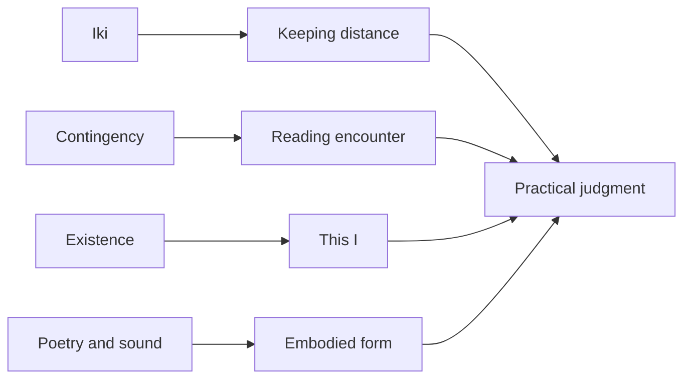

# Reading Shuzo Kuki Through Distance and Contingency

## 1. Main Argument

Shuzo Kuki’s philosophy becomes too small when readers treat it only as an explanation of Japanese taste. He used Western philosophical tools to examine Edo style, accidental encounter, the existing individual, and the sonic work of poetry. One question runs through those fields: how can a person relate to another person or to the world without dissolving the distance between them?

_The Structure of Iki_ gives that question its clearest form. Kuki describes iki through three moments: coquetry, pride, and resignation. A person approaches without closing the relation, keeps a proud independence, and lets attachment clear. When these three moments meet, relation does not collapse into possession or fusion. It gains tension as a lived distance. <SourceNote>Kuki Shuzo, [The Structure of Iki](https://www.aozora.gr.jp/cards/000065/files/393_1765.html), analyzes coquetry, pride, and resignation as marks of iki. Aozora Bunko’s [author page](https://www.aozora.gr.jp/index_pages/person65.html) lists Kuki’s public-domain texts and biographical dates.</SourceNote>

In Kuki’s work on contingency, the same distance becomes ontology. I do not enter the world as a general example of humanity. I appear through this time, this place, this body, and this encounter. Kuki treats contingency not as a casual accident but as a way individuality comes into view. Kyoto University’s Japanese philosophy page reads Kuki through dualities between West and Japan, contingency and necessity, self and other, and connects those dualities with the individuality of “this I.” <SourceNote>Kyoto University Graduate School of Letters, [Kuki Shuzo](https://www.bun.kyoto-u.ac.jp/japanese-philosophy/guidance-kuki/), summarizes Kuki’s biography, major works, duality, contingency, and existential concern.</SourceNote>

Kuki can be used as a practical thinker of approach. In love, conversation, city life, research, design, and organizational judgment, a person can damage the object by trying to grasp it too completely. Kuki gives form to distance instead of erasing it. He gives contour to chance instead of excluding it. He brings elusive texture into view without turning it into mysticism.

## 2. Kuki’s Problem

Kuki was born in 1888, studied philosophy at Tokyo Imperial University, spent roughly eight years in Europe from 1921, and taught at Kyoto Imperial University after returning to Japan in 1929. Kyoto University’s overview notes his encounters with Rickert, Husserl, Heidegger, and Bergson, and lists _The Structure of Iki_, _The Problem of Contingency_, and _Human Being and Existence_ as major works. <SourceNote>For biography and works, see Kyoto University’s [Kuki Shuzo](https://www.bun.kyoto-u.ac.jp/japanese-philosophy/guidance-kuki/). A Konan University-related release also describes Kuki’s European study, return, and publication of _The Structure of Iki_.</SourceNote>

Kuki’s originality does not lie in applying imported philosophy to Japanese culture. He treated lived cultural feeling as a philosophical object. Iki appears in streets, gesture, clothing, speech, and erotic distance. Contingency appears in encounter, birth, fate, and decision. Rhyme and sound in poetry appear as formal force that cannot be reduced to meaning.

That scope makes Kuki’s older vocabulary easier to read. He does not treat taste as decoration. Taste names a posture by which a person relates to the world. Kuki found philosophy in how people approach, where they hold back, and which forms they feel as beautiful.

## 3. Iki as Non-Possessive Relation

In _The Structure of Iki_, Kuki begins from experience. Edo city culture, pleasure quarters, kabuki, clothing, speech, and music all supply material. The Stanford Encyclopedia of Philosophy presents the book as a major work of twentieth-century Japanese aesthetics and notes that Kuki drafted it in Paris in 1926 before publishing it after returning to Japan. <SourceNote>Stanford Encyclopedia of Philosophy, [Japanese Aesthetics](https://plato.stanford.edu/entries/japanese-aesthetics/), introduces Kuki’s _The Structure of “Iki”_ as a significant work in twentieth-century Japanese aesthetics.</SourceNote>

Kuki’s iki has three supports.

| Moment      | Work it does              | Everyday image             |
| ----------- | ------------------------- | -------------------------- |
| Coquetry    | Opens a possible relation | Approaches without closing |
| Pride       | Preserves self-respect    | Does not flatter or submit |
| Resignation | Clears attachment         | Leaves space after desire  |

Coquetry is not only a psychology of seduction. Kuki defines it as a dual attitude that constitutes a possible relation between self and other. The key point is that the relation remains possible. If a person fully possesses the other, the tension disappears. The closer the approach, the more the relation needs an unclosed distance.

Pride gives that distance a spine. If a person only wants to be chosen, coquetry loses force. Refusing to bow to money or status, avoiding complaint, and carrying oneself with dignity all matter for Kuki. In his Edo vocabulary, coquetry contains resistance and pride.

Resignation is not cold renunciation. Attachment clears. Desire remains, but it does not run toward possession. A person approaches the other without turning the other into property. Iki becomes a technique of love and an ethic of relation.

## 4. The Aesthetic Cube

Kuki did not leave iki as an impressionistic word. He arranged elegant, vulgar, showy, subdued, sweet, austere, iki, and boorish tastes in a cube. This odd formal move shows his strength. He used diagrams to catch a sensation that tends to escape.

The diagram does not kill feeling. It makes internal differences visible. Sweetness and iki are close, but they are not the same. Sweetness can dissolve distance. Austerity strengthens negation and darkens feeling. Elegance can lack the erotic duality of iki. Boorishness breaks the tension of relation. Kuki placed these differences inside a structure. <SourceNote>The later part of [The Structure of Iki](https://www.aozora.gr.jp/cards/000065/files/393_1765.html) relates sweetness, austerity, elegance, boorishness, and other tastes through a cubic schema.</SourceNote>

In practice, this resembles judgment in design and writing. A garment feels too showy, a sentence feels too sweet, or an attitude feels boorish. In such cases, a reader does not judge one isolated element. Color, distance, setting, silence, price, and pride work together. Kuki reads that whole relation in philosophical prose.

## 5. Contingency Reveals This I

In _The Problem of Contingency_, Kuki moves from aesthetics to ontology. The National Diet Library records _The Problem of Contingency_ in bibliographic materials, and a Konan University-related release explains that Kuki’s own annotated copies of _The Structure of Iki_ and _The Problem of Contingency_ have scholarly value. It also notes that the Kuki collection preserves many newspaper clippings related to contingency. <SourceNote>National Diet Library Search, [Kyoto Philosophy Selection vol. 5](https://ndlsearch.ndl.go.jp/books/R100000002-I000002971253), lists _The Problem of Contingency_. A [University Press Center article](https://www.u-presscenter.jp/article/18280) explains the publication of Kuki’s annotated copies at the Konan University Digital Archive.</SourceNote>

Kuki’s theory begins from the claim that contingency negates necessity. He first examines forms of necessity and then classifies contingency as their negation. Lecture materials from the University of Tokyo’s Asahi Lectures summarize _The Problem of Contingency_ through three pairs: categorical necessity and categorical contingency, hypothetical necessity and hypothetical contingency, and disjunctive necessity and disjunctive contingency. <SourceNote>University of Tokyo OCW, Izumi Suzuki’s lecture material [Philosophy of Necessitarianism](https://ocw.u-tokyo.ac.jp/lecture_files/11399/8/notes/ja/08suzuki20171129_final.pdf), uses Kuki’s _The Problem of Contingency_ to organize the three modes through concept and mark, reason and consequence, and whole and part.</SourceNote>

| Mode of contingency      | Where necessity breaks | Everyday image                               |
| ------------------------ | ---------------------- | -------------------------------------------- |
| Categorical contingency  | Concept and mark       | A rare feature that does not always appear   |
| Hypothetical contingency | Reason and consequence | One causal or purposive series meets another |
| Disjunctive contingency  | Whole and part         | One possibility becomes real among several   |

Categorical contingency appears when a property does not belong to a concept as its essence. A person meets an acquaintance in a town, or a rare sign appears. There is no necessity that it always happen. Hypothetical contingency appears when another series interrupts a causal or purposive series. A person goes to visit someone ill and meets another visitor, or heads for a destination and meets an accident. Kuki’s concern with encounter belongs here.

Disjunctive contingency deepens the problem. A whole contains several possibilities, yet only one becomes actual. A die can show one through six, but this throw shows only one face. A life has the same structure. Another era, family, body, or partner may seem possible, yet this self lives this life.

From here Kuki moves toward primitive contingency. Why is the world this way, and why am I this I? Causal explanation eventually reaches the ungrounded fact that this reality exists. A paper from Osaka University reads the present in _The Problem of Contingency_ as primitive contingency, something existing as fact without ground, and argues that Kuki tries to reconstruct the acting subject from that point. <SourceNote>Kazuaki Oda, [Genjitsu in The Problem of Contingency](https://ir.library.osaka-u.ac.jp/repo/ouka/all/60470/ahs38_035.pdf), discusses primitive contingency, the present, and reconstruction of the acting subject. Lu Huang, [Two Dimensions of Possibility in Kuki’s Theory of Contingency](https://philosophy-japan.org/wpdata/wp-content/uploads/2021/03/ec1a7aba9ea9b539c9cfc4470d76055d.pdf), reads Kuki’s dynamic movement from contingency back toward necessity through possibility.</SourceNote>

Contingency is not a hole in explanation. For Kuki, contingency brings individuality into view while pressing against necessity. I am not born as humanity in general. I am born into this family, this era, this body, and this language. Meeting someone, reading a book, or stopping in a city can later change the shape of a life.

A person who treats contingency lightly tries to understand the world only through plans. Kuki thinks from the other direction. Encounters shape the self. Necessity cannot fully explain why this self met this other person. That is where existential texture appears.

This reading helps research and work. A new question does not always appear on schedule. A footnote, a conversation, a street sign, or a failed experiment can open the next inquiry. If a team discards contingency as noise, it also discards individuality. Kuki would treat contingency not only as material still awaiting explanation but also as the trace of contact between self and world. In practice, contingency can be read in three moves: notice a rare mark, record an encounter between series, and consider the weight of this one actual path among several possibilities.

## 6. Existence Begins From This I

Kyoto University lists _Human Being and Existence_ among Kuki’s major works and describes his central concern as an eye for the individuality and existence of “this I.” Google Books’ description of _Human Being and Existence_ also notes the range of his thought, including time, contingency, iki, and rhyme in Japanese poetry. <SourceNote>Kyoto University’s [Kuki Shuzo](https://www.bun.kyoto-u.ac.jp/japanese-philosophy/guidance-kuki/) includes _Human Being and Existence_ among his major works. Google Books’ [Human Being and Existence](https://books.google.com/books/about/%E4%BA%BA%E9%96%93%E3%81%A8%E5%AE%9F%E5%AD%98.html?id=IBcmvgAACAAJ) description points to Kuki’s work on time, contingency, iki, and rhyme.</SourceNote>

Kuki’s existence becomes weaker if readers turn it into private inwardness. His “this I” takes shape through distance from others, accidental encounter, cultural form, and verbal resonance. Existence is not a bare ego. I become this particular self when I meet someone, feel drawn to something, let something go, and choose a word.

That view of existence fits modern self-understanding. Career, research theme, intimate relation, and city of residence do not come only from free choice. A person gets drawn into encounters, relies on inherited forms, and moves because of discomfort that is not yet explicit. Kuki does not romanticize that ambiguity. He gives it contour through contingency, duality, distance, and form.

## 7. Poetry and Sound Carry What Meaning Cannot Absorb

Kuki also studied poetry and rhyme. That interest should not be treated as a side hobby. Rhyme is not decoration outside meaning. Repeated and displaced sound creates expectation, and language gains density beyond information.

The same thing happens in iki. Clothing pattern, gait, phrasing, shamisen sound, and verbal pause cannot be exhausted by propositions. Yet they have meaning. Kuki does not discard what resists paraphrase. He treats it as form. Poetics becomes a field where that method can work.

In practice, this changes writing and product judgment. Sentence endings, button spacing, notification timing, and speed of voice matter. Users do not receive only function. They receive form and read distance. Kuki’s philosophy treats such details not as taste in the thin sense but as structures that make relation.

## 8. How To Use Kuki

Kuki is useful when his method enters judgment.

### 8.1 Do Not Close Relation Too Quickly

When a team reduces another person’s intent, a customer’s desire, or a reader’s reaction to one answer too quickly, relation loses tension. Iki preserves possibility as possibility. Listening without exhausting, explaining without overclosing, and refusing to push too hard can create room for the other person to participate.

### 8.2 Build Pride Into Design

People do not move only because something is convenient. They feel how they appear, which setting fits them, and what they refuse to bow to. Kuki’s pride helps designers read the user’s dignity. Even when price or efficiency matters, a presentation that lowers the other person’s standing turns boorish.

### 8.3 Observe Contingency

Before discarding a deviation from the plan as a failure log, look at it. Why did that encounter occur? Why did that sentence catch attention? Why did that street corner stop movement? Contingency can reveal an interest that has not yet gained a concept.

### 8.4 Take Form Seriously

Kuki treats sensation as structure. Modern work needs the same discipline. Word order, screen spacing, meeting silence, clothing, and tone of voice do not sit outside content. They decide distance in a relation.

## 9. Limits

_The Structure of Iki_ depends on the vocabulary of pleasure quarters, heterosexual relation, and Edo taste. A reader who turns it into a present-day norm will miss problems of gender, class, and commercialized intimacy. Kuki’s historical material and the structure that can be drawn from it need separate treatment.

Kuki should also not be simplified into a thinker of a fixed Japanese essence. University of Hawaiʻi Press’ description of Hiroshi Nara’s translation and essays explains that _The Structure of Iki_ reintroduced an Edo-derived urbane style in the context of 1930 Japan while using Western Continental methodology. Kuki thought Japanese culture through translation, comparison, and interpretive tension. <SourceNote>University of Hawaiʻi Press, [The Structure of Detachment](https://uhpress.hawaii.edu/title/the-structure-of-detachment-the-aesthetic-vision-of-kuki-shuzo/), describes _The Structure of Iki_ as a work that used Western Continental frameworks to reinterpret an Edo-derived style.</SourceNote>

Kuki’s appeal lies in the fact that theory and style do not separate. He did not turn contingency, love, taste, and poetry into marginal philosophical examples. He placed subtle lived distance at the center of philosophy. Reading Kuki requires reading concepts and moments in one’s own experience where distance changes.

## 10. Conclusion

Kuki’s philosophy is not a system that explains the whole world. It is a technique for receiving what slips out of explanation as structure. Iki shows the tension of non-possessive relation. Contingency shows the opening where “this I” meets the world. Existence asks about an individual who lives through chance and distance. Poetry and sound reveal the power of form that does not become pure meaning.

The practical phrase for Kuki is “do not approach too closely.” Approach the other person, object, word, and chance. Do not swallow them. Leave distance. Because that distance remains, relation can continue, judgment can clear, and an event can become part of a life rather than mere noise.
