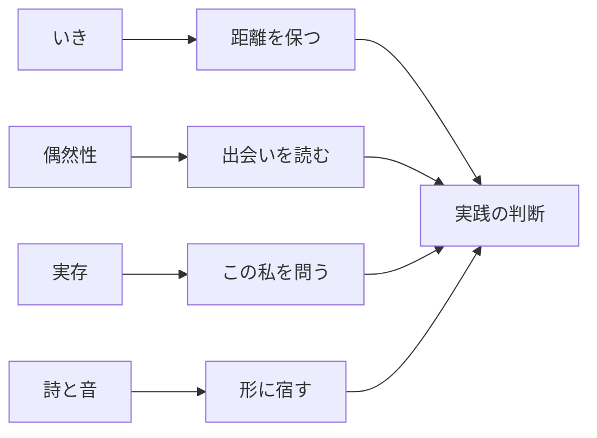

# 九鬼周造の哲学を距離と偶然から読む

## 1. 要点

九鬼周造の哲学は、「日本的美意識の説明」として読むだけでは狭い。彼は西洋哲学の概念装置を使いながら、江戸の趣味、偶然の出会い、実存する個人、詩の音の働きを、同じ問いの周囲に置いた。問いはこう言い換えられる。人は、相手や世界と一つに溶けないまま、どのように関係を持つのか。

「いき」は、その問いを最も目に見えやすくした著作である。九鬼は「いき」を、媚態、意気地、諦めの三契機から説明した。近づきたいのに近づき切らない、相手に依存しない誇りを保つ、執着を手放して澄む。この三つがそろうと、関係は所有や同化へ落ちず、張りのある距離として立ち上がる。<SourceNote>九鬼周造「[『いき』の構造](https://www.aozora.gr.jp/cards/000065/files/393_1765.html)」は「いき」の徴表として媚態、意気地、諦めを順に分析する。青空文庫の [作家別作品リスト](https://www.aozora.gr.jp/index_pages/person65.html) は公開中テキストと生没年を示している。</SourceNote>

偶然性の研究では、この距離が存在論に変わる。私は世界のどこかに一般例として置かれるのではなく、たまたまこの時、この場所、この相手と出会う。九鬼は偶然を、軽い「たまたま」ではなく、個体性が世界に現れる入口として扱った。京都大学日本哲学史専修の解説も、九鬼の哲学を西洋と日本、偶然性と必然性、自己と他者の二元性から捉え、「この私」の個体性と実存への眼差しとして整理している。<SourceNote>京都大学大学院文学研究科の [九鬼周造ページ](https://www.bun.kyoto-u.ac.jp/japanese-philosophy/guidance-kuki/) は、九鬼の略歴、主要著作、二元性、偶然性、実存の問題をまとめている。</SourceNote>

九鬼を実践に引き寄せるなら、彼の哲学は「近づき方の技法」として読める。恋愛、会話、都市のふるまい、研究、デザイン、組織の意思決定では、対象をつかもうとするほど、対象を壊すことがある。九鬼は、距離を消すのではなく、距離を形にする。偶然を排除するのではなく、偶然に輪郭を与える。言葉にできない手触りを神秘化するのではなく、構造として見える位置まで押し出す。

## 2. 九鬼の問題設定

九鬼は1888年に生まれ、東京帝国大学で哲学を学び、1921年から約八年にわたってヨーロッパに滞在した。京都大学の解説は、彼がリッケルト、フッサール、ハイデッガー、ベルクソンらから学び、1929年の帰国後に京都帝国大学で教えたと整理している。代表作として『「いき」の構造』、『偶然性の問題』、『人間と実存』が挙げられる。<SourceNote>略歴と主要著作は京都大学大学院文学研究科 [九鬼周造](https://www.bun.kyoto-u.ac.jp/japanese-philosophy/guidance-kuki/) を参照。甲南大学の公開資料も、九鬼が1921年から1929年にかけて欧州で学び、帰国後に『「いき」の構造』を発表した経緯を述べている。</SourceNote>

九鬼の独自性は、西洋哲学を翻訳して日本文化に当てはめた点だけにない。彼は、文化の中で生きている感覚を、哲学の対象として扱った。「いき」は、街、身ぶり、衣装、言葉、恋の距離に宿る。「偶然性」は、出会い、出生、運命、選択に宿る。詩の押韻や音は、意味に還元しきれない形の力として宿る。

この射程を押さえると、九鬼の文章にある古風な語彙も読みやすくなる。彼は趣味を飾りとして扱わない。趣味は、人が世界と関係を結ぶ姿勢である。人がどう近づき、どこで踏みとどまり、どの形を美しいと感じるか。そこに、九鬼は哲学の入口を見た。

## 3. 「いき」は所有しない関係の構造である

『「いき」の構造』で九鬼は、まず「いき」を経験の中でつかまえる。江戸の町、遊里、歌舞伎、衣装、言葉、音曲が素材になる。Stanford Encyclopedia of Philosophy は、この本を20世紀日本美学の重要作品と位置づけ、九鬼が1926年にパリで初稿を書き、帰国後の1929年頃に刊行したと説明する。<SourceNote>Stanford Encyclopedia of Philosophy の [Japanese Aesthetics](https://plato.stanford.edu/entries/japanese-aesthetics/) は、Kuki Shuzo の _The Structure of “Iki”_ を twentieth-century Japanese aesthetics の重要作品として紹介している。</SourceNote>

九鬼の「いき」には三つの柱がある。

| 契機   | 何をしているか           | 日常での見え方                 |
| ------ | ------------------------ | ------------------------------ |
| 媚態   | 相手との可能的関係を開く | 近づくが、完全には閉じない     |
| 意気地 | 自分の誇りを保つ         | 迎合せず、値踏みに屈しない     |
| 諦め   | 執着を澄ませる           | 得ることに固着せず、余白を残す |

媚態は、相手を誘うだけの心理ではない。九鬼は、自己と異性の間に可能的関係を構成する二元的態度として説明する。ここで重要なのは、関係が可能性として残る点である。完全に得てしまえば、緊張は消える。近づくほど、なお届き切らない距離が必要になる。

意気地は、その距離に背骨を入れる。相手に選ばれたいだけなら、媚態は弱くなる。金や地位に屈しない、泣き言を言わない、身のこなしに格を保つ。九鬼は江戸文化の語彙を使い、媚態の中に反抗と誇りが含まれると見る。

諦めは、冷めた断念ではない。執着が抜け、関係が澄む。欲望が消えるのではなく、欲望が所有へ走らない。人は相手に近づくが、相手を自分の物にしない。ここで「いき」は、恋の技法であると同時に、関係の倫理になる。

## 4. 六面体の美学

九鬼は「いき」を感想語のまま放置しなかった。彼は、上品、下品、派手、地味、甘味、渋味、意気、野暮などを配置し、趣味の関係を直六面体で表そうとした。ここに九鬼の奇妙な強さがある。彼は、逃げてしまう感覚をつかまえるために、図式を使う。

この図式化は、感覚を殺すためではない。逆に、感覚の内部にある差を見えるようにする。たとえば「甘味」と「いき」は近いが、同じではない。甘味は距離を溶かす方向へ行きやすい。渋味はさらに否定が強くなり、情感がくすむ。上品は二元的な色気を欠く場合があり、野暮は関係の張りを壊す。九鬼はこうした微妙な違いを、立体の中に置いて考えた。<SourceNote>「[『いき』の構造](https://www.aozora.gr.jp/cards/000065/files/393_1765.html)」後半は、甘味、渋味、上品、野暮などを関係づけ、直六面体による趣味体系を提示する。</SourceNote>

実践的には、この発想はデザインや文章の判断に近い。ある服装が派手すぎる、ある言葉が甘い、ある態度が野暮に見える。そう感じるとき、私たちは単独の要素だけを見ていない。色、距離、場、相手、沈黙、値段、誇りが重なった全体を読んでいる。九鬼は、その全体読解を哲学の文体で行った。

## 5. 偶然性は「この私」を現す

『偶然性の問題』では、九鬼の関心は美意識から存在論へ移る。国立国会図書館の資料情報は、同書を1935年の主著として扱い、京都哲学撰書の内容細目にも「偶然性の問題」が収められている。甲南大学の資料公開記事は、同書の手拓本に九鬼本人の書き入れがあり、九鬼周造文庫には偶然性に関する新聞記事も多く収められていると紹介している。<SourceNote>国立国会図書館 [京都哲学撰書 第5巻](https://ndlsearch.ndl.go.jp/books/R100000002-I000002971253) は「偶然性の問題」を内容細目に含む。甲南大学関連の [大学プレスセンター記事](https://www.u-presscenter.jp/article/18280) は、『「いき」の構造』と『偶然性の問題』の手拓本公開と書き入れの学術的価値を説明している。</SourceNote>

九鬼の偶然論は、「偶然は必然性の否定である」という出発点を持つ。彼はまず必然性の型を考え、その否定として偶然性を分ける。東京大学朝日講座の講義資料は、『偶然性の問題』の整理として、定言的必然と定言的偶然、仮説的必然と仮説的偶然、離接的必然と離接的偶然の三組を示している。<SourceNote>東京大学OCWの鈴木泉講義資料 [必然主義の哲学](https://ocw.u-tokyo.ac.jp/lecture_files/11399/8/notes/ja/08suzuki20171129_final.pdf) は、九鬼『偶然性の問題』を参照し、必然性と偶然性の三様態を、概念と徴表、理由と帰結、全体と部分の関係として整理している。</SourceNote>

| 偶然性の型 | どこで必然が破れるか | 身近なイメージ                                       |
| ---------- | -------------------- | ---------------------------------------------------- |
| 定言的偶然 | 概念と徴表の結びつき | 「茶柱が立つ」のように、いつも起きるとは限らない稀有 |
| 仮説的偶然 | 理由と帰結の結びつき | 予定した因果や目的が、別系列との遭遇で外れる         |
| 離接的偶然 | 全体と部分の結びつき | 複数の可能性のうち、この一つが現実になる             |

定言的偶然では、ある性質が本質として概念に含まれない。人がある町で知人に会う、茶柱が立つ、ふだん起きない徴表が現れる。そこには「常にそうである」という必然がない。仮説的偶然では、原因や目的の系列に別の系列が割り込む。病人の見舞いに行った先で別の人物に会う、目的地へ行く道で事故に遭う。九鬼が重視する「邂逅」は、この系列同士の交差に宿る。

離接的偶然では、問いはさらに深くなる。全体としては複数の可能性があるのに、現実にはその一つだけが現れる。サイコロは一から六までのどれかを出しうるが、今ここで出る目は一つである。人生も同じ構造を持つ。別の時代、別の家、別の身体、別の相手も可能だったように見えるのに、私はこの生を生きている。

ここから九鬼は、原始偶然の問題へ向かう。なぜ世界はこのようにあり、なぜ私はこの私としてあるのか。因果をたどっても、どこかで「この現実がある」という無根拠に突き当たる。大阪大学の論文は、『偶然性の問題』における現在を「事実として存在しているが無根拠なもの」としての原始偶然に結びつけ、九鬼がそこから行為主体を再構築しようとしたと読む。<SourceNote>織田和明「[九鬼周造の『偶然性の問題』における『現実』](https://ir.library.osaka-u.ac.jp/repo/ouka/all/60470/ahs38_035.pdf)」は、原始偶然、現在、行為主体の再構築を論じる。黄璐「[九鬼周造の偶然論における二つの次元の可能性の調和](https://philosophy-japan.org/wpdata/wp-content/uploads/2021/03/ec1a7aba9ea9b539c9cfc4470d76055d.pdf)」は、偶然性から必然性へ戻る動的構造を可能性の問題として読む。</SourceNote>

偶然とは、説明できない穴ではない。九鬼にとって偶然は、必然とぶつかりながら個体を浮かび上がらせる働きである。私は人間一般として生まれるのではなく、この家、この時代、この身体、この言葉の中に生まれる。誰かに会うことも、ある本を読むことも、ある都市で立ち止まることも、後から見ると人生の形を変える。

偶然を軽く扱う人は、予定と計画だけで世界を理解しようとする。九鬼は逆の方向から考える。計画ではなく、出会いが私をつくる。必然的な法則だけでは、なぜこの私がこの相手と出会ったのかを言い切れない。そこに、実存の手触りが出る。

この読み方は、研究や仕事にも効く。新しいテーマは、計画通りに見つかるとは限らない。読んだ論文の脚注、偶然入った会話、街で見た看板、失敗した実験が、次の問いを開く。偶然をただのノイズとして捨てると、個別性も消える。九鬼なら、偶然を「まだ理由づけられていない素材」としてだけではなく、「私が世界と接触した跡」として扱うはずである。実践では、偶然を三段階で読むとよい。稀に現れた徴表を拾う。別系列との遭遇を記録する。複数の可能性のうち、この一つが現実になった重みを考える。

## 6. 実存は抽象的人間ではなく「この私」から始まる

京都大学の解説は、『人間と実存』を九鬼の主要著作に挙げ、九鬼哲学の核心を「この私」の個体性と実存への眼差しとして説明している。Google Books の『人間と実存』紹介も、九鬼が時間論、偶然性、「いき」、日本詩の押韻など多岐にわたる思索を展開したとまとめる。<SourceNote>京都大学 [九鬼周造](https://www.bun.kyoto-u.ac.jp/japanese-philosophy/guidance-kuki/) は『人間と実存』を主要著作に含める。Google Books の [『人間と実存』](https://books.google.com/books/about/%E4%BA%BA%E9%96%93%E3%81%A8%E5%AE%9F%E5%AD%98.html?id=IBcmvgAACAAJ) 紹介は、時間論、偶然性、「いき」、押韻を含む九鬼の射程を示している。</SourceNote>

九鬼の実存理解を、孤独な内面主義として読むと弱くなる。彼の「この私」は、他者との距離、偶然の出会い、文化の型、言葉の響きの中で形を取る。つまり、実存は裸の自我ではない。私は、誰かと会い、何かに惹かれ、何かを諦め、ある言葉を選ぶ。そのたびに、私は一般的な「人間」から少し外れ、「この私」になる。

この実存の考え方は、現代の自己理解にも近い。キャリア、研究テーマ、親密な関係、住む街は、完全に自由な選択だけで決まらない。偶然の出会いに巻き込まれ、過去の型に支えられ、言葉にできない違和感に動かされる。九鬼はその曖昧さを、曖昧なまま美化しない。偶然性、二元性、距離、形という概念で、曖昧さに輪郭を与える。

## 7. 詩と音は、意味になり切らないものを運ぶ

九鬼は詩や押韻にも関心を向けた。これを余技と見ると、九鬼哲学の実践面を見落とす。押韻は、意味の外側にある装飾ではない。音が反復し、ずれ、予期を作ることで、言葉は情報以上の密度を持つ。

「いき」でも同じことが起きている。着物の柄、歩き方、言い回し、三味線の音、言葉の余白は、命題として説明しきれない。しかし、それらは意味を持たないわけではない。九鬼は、言葉にしにくいものを切り捨てず、形式として考える。詩論はその実験場になる。

実践に移すと、文章やプロダクトの細部が変わる。説明文の語尾、ボタンの余白、通知のタイミング、声の速度。人は機能だけを受け取らない。形式を受け取り、距離を読む。九鬼の哲学は、こうした細部を「好み」の一語で片づけず、関係を作る構造として扱う。

## 8. 九鬼哲学の使い方

九鬼を読む価値は、概念を暗記することにない。彼の読み方を、判断の場で使うことにある。

### 8.1 関係をすぐに閉じない

相手の意図、顧客の欲望、読者の反応を、すぐに一つの答えへ閉じると、関係の張りが消える。「いき」は、可能性を可能性のまま保つ。聞き切らない、説明し切らない、押し切らない。対話やデザインでは、この未完の距離が、相手の参加余地になる。

### 8.2 誇りを設計に含める

人は便利さだけで動かない。自分がどう見られるか、どの場にふさわしいか、何に屈したくないかを感じている。九鬼の意気地は、利用者や読者の誇りを読む視点を与える。安さや効率を出せばよい場面でも、相手の格を下げる見せ方をすると野暮になる。

### 8.3 偶然を観察対象にする

計画から外れた出来事を、失敗ログとして捨てる前に見る。なぜその出会いが起きたのか。なぜその一文に引っかかったのか。なぜその街角で足が止まったのか。偶然は、まだ概念化していない関心を知らせる。

### 8.4 形式を軽く見ない

九鬼は、感覚を構造として扱った。現代の仕事でも同じである。言葉の順序、画面の余白、会議の沈黙、服装、声の調子は、内容の外側にある飾りではない。それらは、関係の距離を決める。

## 9. 読むときの注意

九鬼の『「いき」の構造』は、遊里、異性愛、江戸趣味の語彙に強く依存している。そのまま現代の規範として使うと、ジェンダーや階層、商業化された親密性の問題を見落とす。読者は、九鬼が分析した素材と、そこから取り出せる関係の構造を分けて読む必要がある。

また、九鬼を「日本精神の本質」を語る思想家として単純化してはいけない。Hiroshi Nara の英訳研究を紹介する University of Hawaiʻi Press の解説は、『「いき」の構造』が1930年の文化的文脈の中で、日本の趣味を西洋大陸哲学の方法により再定義しようとした著作だったと述べる。九鬼は日本文化を固定した本質としてではなく、翻訳、比較、解釈の緊張の中で考えた。<SourceNote>University of Hawaiʻi Press の [The Structure of Detachment](https://uhpress.hawaii.edu/title/the-structure-of-detachment-the-aesthetic-vision-of-kuki-shuzo/) は、『「いき」の構造』が1930年の文脈で江戸由来の urbane style を再導入し、西洋大陸哲学の枠組みを使ったと説明している。</SourceNote>

最後に、九鬼の魅力は、理論と文体が分かれていない点にある。彼は偶然、恋、趣味、詩を、哲学の周辺素材にしなかった。人が生きる場で感じる微妙な距離を、哲学の中心へ持ってきた。だから九鬼を読むときは、概念だけでなく、自分の経験の中で距離が変わる瞬間を一緒に読む必要がある。

## 10. まとめ

九鬼周造の哲学は、世界を完全に説明する体系ではない。むしろ、説明しようとするとこぼれるものを、構造として受け止める技法である。「いき」は、所有しない関係の張りを示す。偶然性は、「この私」が世界と出会う裂け目を示す。実存は、抽象的人間ではなく、偶然と距離の中で生きる個体を問う。詩と音は、意味になり切らない形式の力を見せる。

実践の場で九鬼を使うなら、合言葉は「近づきすぎない」でよい。相手、対象、言葉、偶然に近づく。ただし、飲み込まない。距離を残す。その距離があるから、関係は続き、判断は澄み、出来事はただのノイズではなく人生の形になる。
