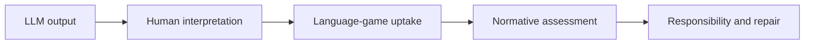
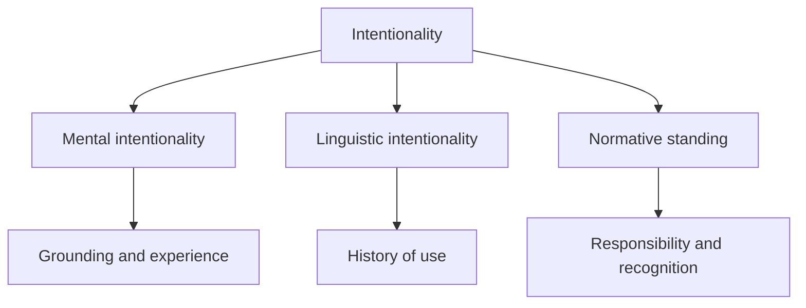

# Language Games, Intentionality, and LLMs

## 1. Executive Summary

The philosophical question raised by LLMs is not only whether they possess inner understanding. A more useful question is how their outputs enter human practices, become accepted or rejected, gain authority, and create responsibilities.

This report reaches seven conclusions.

1. The language-game frame helps avoid the binary of "mere string generator" versus "human-equivalent speaker."
2. Intentionality should be divided into mental intentionality, linguistic intentionality, and normative standing.
3. Marie Theresa O'Connor argues that LLMs should be treated as participants in language games because they make linguistic moves in response to prompts and reshape subsequent human moves.
4. Jumbly Grindrod argues that LLMs need not possess human-like mental intentionality to count as using words meaningfully in a linguistic sense.
5. Enzo Fenoglio treats human-LLM interaction as asymmetric communication: LLM outputs can be taken up as moves, but their correctness, authority, and force depend on human uptake and accountability.
6. Bender and Koller, Shanahan, and Harnad provide the skeptical counterweight: form is not meaning, anthropomorphic vocabulary is risky, and grounding remains a serious problem.
7. The practical recommendation is to treat LLMs as `asymmetric components of language games`: their outputs can function as meaningful moves, but responsibility and normative assessment remain with humans and institutions.

<SourceNote>Core sources include O'Connor's [AIs as fellow participants in the language game](https://link.springer.com/article/10.1007/s00146-025-02663-6), Grindrod's [Large language models and linguistic intentionality](https://link.springer.com/article/10.1007/s11229-024-04723-8), and Fenoglio's [Large Language Models and Language Games: Asymmetric Communication](https://papers.ssrn.com/sol3/papers.cfm?abstract_id=6678558). The skeptical baseline is supported by Bender and Koller's [Climbing towards NLU](https://aclanthology.org/2020.acl-main.463/) and Shanahan's [Talking About Large Language Models](https://arxiv.org/abs/2212.03551).</SourceNote>

The key point is that an LLM output does not complete meaning or responsibility by itself. It gains practical force when humans cite it, correct it, rely on it, reject it, or embed it in institutional workflows.

## 2. Framing the Question

The initial question asks whether there are papers that discuss language games through intentionality and connect the discussion to LLMs. That question contains three subquestions.

1. How can a Wittgensteinian account of language games treat LLM language use?
2. Can intentionality, the directedness of thought or representation toward something, be attributed to LLM states or outputs?
3. Is human-LLM interaction conversation, tool use, simulation, or a different kind of social practice?

Conflating these questions turns the discussion into the oversized question "do LLMs have minds?" This report instead separates mental intentionality, linguistic intentionality, and normative standing.

| Dimension                 | Question                                             | LLM issue                                     |
| ------------------------- | ---------------------------------------------------- | --------------------------------------------- |
| Mental intentionality     | Do internal states have world-directed content?      | Grounding, embodiment, goals, experience      |
| Linguistic intentionality | Can words and sentences be meaningfully used?        | Dependence on human language practices        |
| Normative standing        | Can utterances generate responsibility or authority? | Human uptake and institutional accountability |

<SourceNote>Grindrod distinguishes mental metasemantics from linguistic intentionality. Bender and Koller emphasize the distinction between form and meaning, arguing that a system trained only on form cannot learn meaning by form alone.</SourceNote>

## 3. Reading LLMs Through Language Games

In later Wittgenstein, meaning is not a simple correspondence relation. It is constituted through use in forms of life. The language-game metaphor shows that commands, reports, jokes, promises, calculations, and explanations work within different practical settings.

Applied to LLMs, the question shifts from "is there an inner semantic representation?" to "what kind of move does this output become within a human practice?" The same sentence can have different normative statuses in medical advice, fiction, code review, customer support, or a private joke.

O'Connor pushes this point strongly. LLMs respond to prompts, produce linguistic moves, and change how humans continue to describe the world, themselves, and one another. Her argument is not an internal proof of machine mentality. It is an observational argument about what happens in language. <SourceNote>O'Connor argues that LLMs make linguistic moves in response to prompts and should be described as thinkers rather than mere tools. See the [Springer article page](https://link.springer.com/article/10.1007/s00146-025-02663-6).</SourceNote>

The participant view depends on how thickly "participation" is defined. If participation includes responsibility and mutual recognition, current LLMs are not human-like participants. If participation means that outputs function as moves inside an ongoing practice, the participant view becomes much more plausible.

## 4. Reading LLMs Through Intentionality

Intentionality is the "aboutness" of thought or representation. For LLMs, two questions should be kept apart.

First, do LLM internal states have world-directed content? Skeptics argue that a system trained on textual form lacks causal, practical, and embodied contact with the world. Bender and Koller argue that form alone is not meaning, and Harnad's symbol grounding problem remains a crucial background issue. <SourceNote>Bender and Koller's ACL 2020 paper explicitly argues that a system trained only on form has no a priori route to meaning. Bibliographic details and DOI are available from [ACL Anthology](https://aclanthology.org/2020.acl-main.463/).</SourceNote>

Second, do the words produced by LLMs inherit meaningful roles from human linguistic practices? Grindrod focuses on this second question. His view is that LLMs differ from simple n-gram systems because large-scale pretraining analyzes historical patterns of word use in ways that can encode meaning-relevant latent structure. This does not make LLM intentionality human-like, but it makes total semantic dismissal too quick. <SourceNote>Grindrod treats the success of LLMs as a partial vindication of distributional semantics and argues that LLMs may satisfy conditions for meaningful use in a distinctively non-human way. See [Synthese](https://link.springer.com/article/10.1007/s11229-024-04723-8).</SourceNote>

The important move is not to treat intentionality as all-or-nothing. Denying human-like experience and world-grounded goals is compatible with acknowledging that LLM outputs can function meaningfully inside human linguistic practices.

## 5. Asymmetric Communication

Fenoglio's 2026 working paper can be read as a middle position between the participant view and grounding skepticism. It accepts that LLM outputs may be interpreted and taken up as moves in language games. But the correctness, authority, and force of those moves depend on human uptake and accountability.

On this view, LLMs are not meaningless noise. They are also not responsible speakers in the human sense. They are components in sociotechnical systems that generate communicative events while normative responsibility remains with people, organizations, and institutions.

<SourceNote>Fenoglio's [SSRN paper page](https://papers.ssrn.com/sol3/papers.cfm?abstract_id=6678558) summarizes the framework as asymmetric communication built from Wittgenstein, Luhmann, Esposito, and Brandom. As of May 2026, it should be treated as a working paper.</SourceNote>

This position is especially useful in practice. LLM outputs clearly shape decisions in writing, research, coding, education, and advice. Yet misinformation, discrimination, security incidents, or high-stakes legal and medical decisions cannot be made the responsibility of the model itself. Guardrails, review, logging, source checks, and permissions are therefore not external additions. They are structural conditions for asymmetric language games.

## 6. The Role of Skepticism

Skepticism is not only a way to downplay LLM capabilities. It clarifies which capacities belong to the model and which belong to human interpretation, social institutions, and accountable practice.

Shanahan warns that words such as "knows," "believes," and "thinks" can intensify anthropomorphism when applied uncritically to LLMs. His later clarification frames the project as Wittgensteinian attention to language use rather than simple reductionism. <SourceNote>Shanahan's [Talking About Large Language Models](https://arxiv.org/abs/2212.03551) warns against anthropomorphic use of philosophically loaded vocabulary. [Still "Talking About Large Language Models"](https://arxiv.org/abs/2412.10291) clarifies the Wittgensteinian character of the project.</SourceNote>

Bender and Koller's argument does not imply that LLMs are useless. The issue is whether task performance should be equated with understanding. Without separating form from meaning, benchmarks and deployments become unclear about what they are measuring.

| Easier to delegate to LLMs | Should remain with humans and institutions |
| -------------------------- | ------------------------------------------ |
| Drafting and summarization | Acceptance or rejection                    |
| Rephrasing within context  | Fact-checking                              |
| Issue mapping              | Responsibility                             |
| Generating objections      | Normative and ethical judgment             |

## 7. Argument Map

The literature is better mapped by where it locates participation, meaning, intentionality, and responsibility than by a simple pro/con division.

| Position                       | Core claim                                                | Strength                          | Risk                                      |
| ------------------------------ | --------------------------------------------------------- | --------------------------------- | ----------------------------------------- |
| Participant view               | LLMs make moves inside language games                     | Tracks actual interaction         | Can flatten differences in responsibility |
| Linguistic intentionality view | Meaningful use need not require human-like mentality      | Avoids an all-or-nothing binary   | Conditions for meaning remain contested   |
| Asymmetric communication       | Outputs can be taken up, but responsibility remains human | Connects well to system design    | Leaves LLM-side capacities partly open    |
| Grounding skepticism           | Textual form alone is not grounded meaning                | Reduces anthropomorphic inflation | May understate social uptake              |

This report adopts asymmetric communication as the most practical interim frame because it can hold two facts together: LLM outputs already reshape human language games, and current LLMs are not human-like responsible agents.

## 8. Practical Implications

In AI deployment, asking whether the LLM "has an intention" is too abstract. The practical question is what kind of intentionality users will attribute, in which setting, and where the human handoff occurs.

If an internal knowledge assistant says "this customer has a high churn risk," the output functions as a business move. A sales team may change behavior. But the evidence, proxy variables, fairness concerns, customer impact, and accountability must be determined by the organization, not by the model.

In this sense, LLM deployment is a design problem for language games, not only a model-performance problem.

1. Define which practice the output belongs to.
2. Treat model language as candidate moves, not decisions.
3. Keep sources, evidence, counterevidence, and applicability conditions close to the output.
4. Log human acceptance, rejection, and correction.
5. Use UI and policy to create distance in settings where users easily over-attribute intention or emotion.

<SourceNote>Recent work using Dennett's intentional stance also discusses why users attribute intention and emotional qualities to LLM outputs. See [Symmetries and asymmetries between attitudes and interaction in relation to the emotional uses of LLMs](https://link.springer.com/article/10.1007/s00146-026-03069-8).</SourceNote>

## 9. Recommendation

For research, the most useful triangle is O'Connor, Grindrod, and Fenoglio. O'Connor offers the strongest participant reading. Grindrod separates human-like mentality from linguistic intentionality. Fenoglio accepts language-game uptake while keeping responsibility and normative authority on the human side.

For practice, the following formulation is the most usable:

> An LLM is an asymmetric component that inserts outputs into human language games. Its outputs can function as meaningful moves, but their correctness, authority, and responsibility depend on human uptake and institutional design.

This avoids both underestimation and anthropomorphic overreach. LLMs are not intentional colleagues in the ordinary human sense. But they are no longer well described as tools that merely emit meaningless strings. Once human practices treat their outputs as meaningful, the design target becomes the language game itself.

## References

- Marie Theresa O'Connor, [AIs as fellow participants in the language game](https://link.springer.com/article/10.1007/s00146-025-02663-6), AI & SOCIETY, 2026.
- Jumbly Grindrod, [Large language models and linguistic intentionality](https://link.springer.com/article/10.1007/s11229-024-04723-8), Synthese, 2024.
- Enzo Fenoglio, [Large Language Models and Language Games: Asymmetric Communication](https://papers.ssrn.com/sol3/papers.cfm?abstract_id=6678558), SSRN working paper, 2026.
- Emily M. Bender and Alexander Koller, [Climbing towards NLU: On Meaning, Form, and Understanding in the Age of Data](https://aclanthology.org/2020.acl-main.463/), ACL, 2020.
- Murray Shanahan, [Talking About Large Language Models](https://arxiv.org/abs/2212.03551), arXiv, 2022/2023.
- Murray Shanahan, [Still "Talking About Large Language Models": Some Clarifications](https://arxiv.org/abs/2412.10291), arXiv, 2024.
- Stevan Harnad, [The Symbol Grounding Problem](https://www.sciencedirect.com/science/article/pii/0167278990900876), Physica D, 1990.
- Ludwig Wittgenstein, _Philosophical Investigations_, 1953.
- Daniel C. Dennett, _The Intentional Stance_, MIT Press, 1987.
