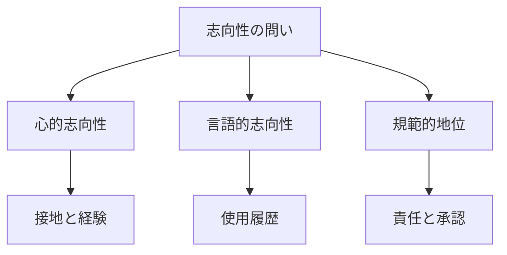

# 言語ゲーム・志向性・LLM

## 1. エグゼクティブサマリー

LLMをめぐる哲学的な争点は、「LLMは本当に理解しているか」という内面の有無だけでは捉えにくい。むしろ、LLMの出力が人間の実践の中でどのように受け取られ、訂正され、権威づけられ、責任づけられるかを見た方が、導入現場にも研究にも役に立つ。

本稿の結論は次の通りである。

1. 言語ゲームの観点は、LLMを「単なる文字列生成器」か「人間同等の話者」かという二分法から外す助けになる。
2. 志向性の観点は、LLMの内部状態が世界についての内容を持つかという問題と、LLMの語が人間の言語実践に由来する意味を帯びるかという問題を分ける。
3. Marie Theresa O'Connor は、LLMがプロンプトに応じて言語の手を打ち、人間の後続発話を変えることから、LLMを言語ゲームの参加者として扱うべきだと論じる。
4. Jumbly Grindrod は、LLMに人間的な心的志向性を認める必要はないが、言語的志向性や意味ある語の使用は一定程度認められると論じる。
5. Enzo Fenoglio は、LLMの出力は言語ゲーム内の手として取り込まれうるが、その正しさ、権威、責任は人間側の uptake と accountability に依存するため、人間-LLM関係は非対称なコミュニケーションだと整理する。
6. Bender and Koller、Shanahan、Harnad らの懐疑的議論は、テキスト形式、擬人化、記号接地、身体性、責任の欠如を強調し、LLMへの安易な「理解」「信念」「意図」の帰属を戒める。
7. 推奨方針は、LLMを「意図を持つ同僚」とも「無意味な道具」とも固定せず、`非対称な言語ゲームの構成要素` として扱うことである。つまり、出力は言語実践の中で意味を持ちうるが、責任と規範的判断は人間と制度に残る。

<SourceNote>中心文献は O'Connor の [AIs as fellow participants in the language game](https://link.springer.com/article/10.1007/s00146-025-02663-6)、Grindrod の [Large language models and linguistic intentionality](https://link.springer.com/article/10.1007/s11229-024-04723-8)、Fenoglio の [Large Language Models and Language Games: Asymmetric Communication](https://papers.ssrn.com/sol3/papers.cfm?abstract_id=6678558)。懐疑側の基礎として Bender and Koller の [Climbing towards NLU](https://aclanthology.org/2020.acl-main.463/) と Shanahan の [Talking About Large Language Models](https://arxiv.org/abs/2212.03551) を参照した。</SourceNote>

この図の要点は、LLMの出力が単独で意味や責任を完結させるわけではないことだ。意味は、出力が人間の実践に入り、訂正・引用・採用・拒否される過程で制度的な効力を持つ。

## 2. 問いの立て方

ユーザーの問いは、「言語ゲームを志向性から論じて、LLMと重ねて論じている論文はあるか」だった。ここには少なくとも三つの問いが含まれる。

1. ウィトゲンシュタイン的な言語ゲーム論は、LLMの言語使用をどう扱えるか。
2. 志向性、つまり「何かについてであること」は、LLMの内部状態や出力に帰属できるか。
3. 人間とLLMの対話は、会話、道具使用、シミュレーション、または別種の社会的実践のどれか。

この三つを混ぜると、「LLMは心を持つのか」という大きすぎる問いに吸い込まれる。そこで本稿では、心的志向性、言語的志向性、社会的・規範的地位を分ける。

| 観点         | 問い                                 | LLMでの争点                    |
| ------------ | ------------------------------------ | ------------------------------ |
| 心的志向性   | 内部状態が世界についての内容を持つか | 接地、身体性、目的、経験の欠如 |
| 言語的志向性 | 語や文が意味ある使用になっているか   | 学習済み言語実践への依存       |
| 規範的地位   | 発話が責任、権威、約束を生むか       | 人間側の uptake と制度的責任   |

<SourceNote>Grindrod は、心的メタ意味論と区別して、語の再生産やコミュニケーション上の機能から linguistic intentionality を検討する。Bender and Koller は、形式だけで訓練されたシステムは意味を学べないとする立場から、form と meaning の区別を強調する。</SourceNote>

## 3. 言語ゲームからLLMを見る

ウィトゲンシュタインの後期哲学では、意味は単独の対応関係ではなく、生活形式に埋め込まれた使用の中で成立する。言語ゲームという比喩は、命令、報告、質問、冗談、約束、計算、説明などが、それぞれ異なる規則と実践の中で働くことを示す。

LLMにこの枠組みを重ねると、論点は「内部に意味表象があるか」だけではなく、「その出力がどの実践の中でどんな手として扱われるか」に移る。たとえば、同じ「大丈夫です」という出力でも、医療判断、友人への返答、テストデータの生成、物語中の台詞では規範的地位が異なる。

O'Connor の議論は、この点を最も強く押し出す。彼女は、LLMがプロンプトに応答し、その応答が人間の記述、感情、自己理解、社会的やり取りを変える以上、LLMを言語ゲームの参加者として扱うべきだとする。これは、LLMの内面を証明する議論ではなく、言語実践で何が起きているかを観察する議論である。<SourceNote>O'Connor は結論部で、LLMはプロンプトに応じて言語内の手を打ち、それが人間側の後続の手を促すため、道具よりも thinker として記述されるべきだと論じる。本文は [Springer の論文ページ](https://link.springer.com/article/10.1007/s00146-025-02663-6) を参照。</SourceNote>

ただし、この参加者説には強い前提がある。言語ゲームの「参加」を、責任や相互承認まで含む厚い意味で捉えるなら、LLMはまだ人間と同じ参加者ではない。逆に、出力が実践内の手として機能するという薄い意味で捉えるなら、参加者説はかなり説得力を持つ。

## 4. 志向性からLLMを見る

志向性とは、意識や表象が「何かについてである」性質を指す。LLMの場合、ここで二つの議論が分かれる。

第一に、LLMの内部状態が世界についての内容を持つかという問題がある。懐疑側は、LLMがテキスト分布から形式的パターンを学ぶだけなら、世界との因果的・実践的接続を欠くと主張する。Bender and Koller は、形式だけから意味は学べないと論じ、Harnad の記号接地問題もこの線上にある。<SourceNote>Bender and Koller の ACL 2020 論文は、形式だけで訓練されたシステムは意味を学べないと明示する。書誌情報と DOI は [ACL Anthology](https://aclanthology.org/2020.acl-main.463/) で確認できる。Harnad の symbol grounding problem は LLM懐疑論の背景として頻繁に参照される。</SourceNote>

第二に、LLMが使う語が、人間の言語実践に由来する意味を帯びるかという問題がある。Grindrod はこの第二の問題に注目する。彼の議論では、LLMは単純な n-gram 生成器とは異なり、大規模な使用履歴の統計的分析を通じて、語が再生産される要因を高次元表現として捉える。したがって、人間的な心的志向性とは異なるが、語の意味ある使用を完全に否定するのも早すぎる。<SourceNote>Grindrod は、LLMの成功を distributional semantics の部分的な正当化として扱い、LLMが意味ある使用の条件を非人間的な仕方で満たしうると論じる。本文と DOI は [Synthese の論文ページ](https://link.springer.com/article/10.1007/s11229-024-04723-8) を参照。</SourceNote>

ここで重要なのは、志向性を一枚岩にしないことだ。LLMに人間と同じ世界経験や目的形成を認めないことと、LLM出力が人間の言語実践の中で意味ある働きをすることは両立する。

## 5. 非対称コミュニケーションという中間案

Fenoglio の 2026年ワーキングペーパーは、O'Connor の参加者説と懐疑側の警戒をつなぐ中間案として読める。彼は、LLMの出力が人間に解釈され、言語ゲームの手として取り込まれることを認める一方で、その手の正しさ、権威、現場での効力は人間側の uptake と accountability に依存すると論じる。

この整理では、LLMは単なる無意味なノイズではない。しかし、人間と同じ意味で責任を負う話者でもない。LLMは、社会技術システムの中でコミュニケーションを発生させる構成要素であり、規範的な最終責任は人間、組織、制度側に残る。

<SourceNote>Fenoglio の [SSRN 論文ページ](https://papers.ssrn.com/sol3/papers.cfm?abstract_id=6678558) は、Wittgenstein、Luhmann、Esposito、Brandom を用いて human-LLM interaction を asymmetric communication として整理し、discursive standing が human uptake and accountability に依存すると要約している。2026年5月時点ではワーキングペーパーとして扱うのが妥当である。</SourceNote>

この見方は導入現場でも強い。LLMに文章作成、要約、調査、コード生成、相談を任せる現場では、出力は明らかに人間の意思決定を動かす。しかし、誤情報、差別、権利侵害、セキュリティ事故、医療・法律・金融判断の責任をLLMに負わせることはできない。したがって、ガードレール、レビュー、監査ログ、出典確認、権限管理は、外付けの安全策ではなく、非対称な言語ゲームを成立させる構造条件である。

## 6. 懐疑論の役割

懐疑論は、LLMの能力を過小評価するためだけの議論ではない。むしろ、どこまでをLLMの能力として認め、どこからを人間側の解釈、制度、責任として残すべきかを明確にする。

Shanahan は、LLMについて語るときに「知っている」「信じている」「考えている」といった哲学的に重い語を安易に使うと、擬人化を強めると警告する。さらに 2024年の補足では、自分の立場を単純な還元主義ではなく、言葉の使い方を点検するウィトゲンシュタイン的なプロジェクトとして位置づけ直している。<SourceNote>Shanahan の [Talking About Large Language Models](https://arxiv.org/abs/2212.03551) は、LLMの擬人化と「know」「believe」「think」の語り方に注意を促す。補足の [Still "Talking About Large Language Models"](https://arxiv.org/abs/2412.10291) は、この議論をウィトゲンシュタイン的な言葉の点検として説明する。</SourceNote>

Bender and Koller の議論も、LLMが便利であることを否定するものではない。彼らの論点は、タスク性能を「意味理解」と同一視してよいかである。形式と意味を区別しないと、ベンチマークや導入評価が、何を測っているのか分からなくなる。

懐疑論を通すと、次のような導入時の線引きが見える。

| LLMに任せやすいこと    | 人間・制度が残すべきこと |
| ---------------------- | ------------------------ |
| 下書き、要約、候補生成 | 採否判断                 |
| 既存文脈内の言い換え   | 事実確認                 |
| 論点整理               | 責任の引き受け           |
| 反論候補の生成         | 規範的・倫理的評価       |

## 7. 論点マップ

ここまでの文献は、単純な賛否ではなく、参加、意味、志向性、責任をどこに置くかで分かれる。

| 立場                       | 中心主張                                   | 強み                       | 弱み                               |
| -------------------------- | ------------------------------------------ | -------------------------- | ---------------------------------- |
| 参加者説                   | LLMは言語ゲーム内で手を打っている          | 実際の相互作用を捉えやすい | 責任や承認の差を薄めやすい         |
| 言語的志向性説             | 心的志向性なしでも意味ある語使用はありうる | 二分法を避けられる         | どの条件で意味が成立するかが難しい |
| 非対称コミュニケーション説 | 出力は取り込まれるが責任は人間側に残る     | 導入設計に接続しやすい     | LLM側の能力をどこまで認めるか曖昧  |
| 接地懐疑論                 | テキスト形式だけでは意味理解に届かない     | 過剰な擬人化を抑える       | 社会的使用の効力を過小評価しがち   |

本稿では、非対称コミュニケーション説を暫定的な導入フレームとして採用する。理由は、LLMの出力がすでに人間の言語ゲームを変えていることと、LLMが人間と同じ責任主体ではないことの両方を同時に扱えるからである。

## 8. 導入現場での判断軸

AI導入の現場では、「LLMに意図があるか」を抽象的に問うだけでは足りない。重要なのは、どの場面でどの種類の志向性を仮に帰属し、どの時点で人間が引き取るかである。

たとえば、社内ナレッジ検索でLLMが「この顧客は解約リスクが高い」と出力した場合、その文は業務上の手として機能する。営業担当者は対応を変えるかもしれない。しかし、その出力がどのデータに基づくか、差別的な代理変数を含むか、顧客に不利益を与えるか、誰が説明責任を負うかは、LLMの内部ではなく組織の制度で決める必要がある。

この意味で、LLM利用設計は、モデル性能だけでなく、言語ゲームの設計である。

1. 出力がどの実践の中の手なのかを明確にする。
2. LLMの語りを、決定ではなく候補として扱う。
3. 出典、根拠、反証、適用条件を近くに置く。
4. 人間の承認、拒否、訂正をログとして残す。
5. ユーザーが意図や感情を過剰帰属しやすい場面では、UIとポリシーで距離を作る。

<SourceNote>LLM利用で人間が意図や感情を帰属しやすい点は、Dennett の intentional stance を使った近年の議論でも扱われる。たとえば AI & SOCIETY の [Symmetries and asymmetries between attitudes and interaction in relation to the emotional uses of LLMs](https://link.springer.com/article/10.1007/s00146-026-03069-8) は、LLMとの情緒的相互作用における design stance から intentional stance への移行を論じる。</SourceNote>

## 9. 推奨方針

研究としては、O'Connor、Grindrod、Fenoglio を並べるとよい。O'Connor は、LLMを言語ゲームの参加者として強く読む。Grindrod は、志向性を心的なものと言語的なものに分け、LLMに一定の意味ある使用を認める。Fenoglio は、言語ゲームへの取り込みを認めつつ、責任と規範性を人間側に残す。

導入時には、次の定式が最も扱いやすい。

> LLMは、人間の言語ゲームに出力を差し込む非対称な構成要素である。出力は意味ある手として機能しうるが、その正しさ、権威、責任は人間側の uptake と制度設計に依存する。

この定式なら、LLMを過小評価せず、同時に過剰な擬人化も避けられる。LLMは「意図を持つ同僚」ではない。しかし、もはや「無意味な文字列を出すだけの道具」とも言いにくい。人間の実践がLLM出力を意味あるものとして扱う以上、設計すべき対象はモデルだけではなく、言語ゲームそのものになる。

## 参考情報

- Marie Theresa O'Connor, [AIs as fellow participants in the language game](https://link.springer.com/article/10.1007/s00146-025-02663-6), AI & SOCIETY, 2026.
- Jumbly Grindrod, [Large language models and linguistic intentionality](https://link.springer.com/article/10.1007/s11229-024-04723-8), Synthese, 2024.
- Enzo Fenoglio, [Large Language Models and Language Games: Asymmetric Communication](https://papers.ssrn.com/sol3/papers.cfm?abstract_id=6678558), SSRN working paper, 2026.
- Emily M. Bender and Alexander Koller, [Climbing towards NLU: On Meaning, Form, and Understanding in the Age of Data](https://aclanthology.org/2020.acl-main.463/), ACL, 2020.
- Murray Shanahan, [Talking About Large Language Models](https://arxiv.org/abs/2212.03551), arXiv, 2022/2023.
- Murray Shanahan, [Still "Talking About Large Language Models": Some Clarifications](https://arxiv.org/abs/2412.10291), arXiv, 2024.
- Stevan Harnad, [The Symbol Grounding Problem](https://www.sciencedirect.com/science/article/pii/0167278990900876), Physica D, 1990.
- Ludwig Wittgenstein, _Philosophical Investigations_, 1953.
- Daniel C. Dennett, _The Intentional Stance_, MIT Press, 1987.
