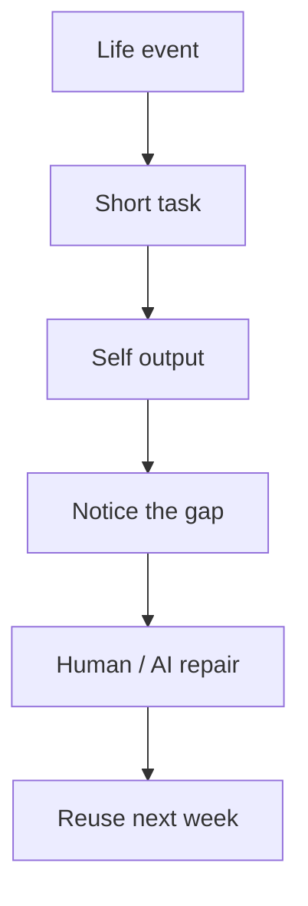
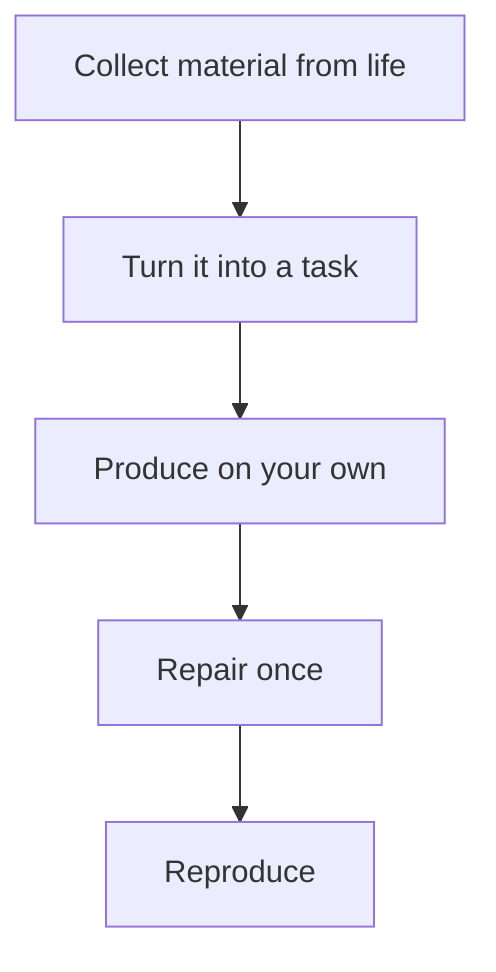

# How to build a living-language view through second-language learning

## 1. Executive Summary

The difficulty of second-language learning is not only a lack of vocabulary or grammar. In many cases, learners first think in their first language and then translate, so language does not emerge directly inside lived situations. A living-language view treats learning as a habit of building language from `situation, intention, interlocutor, and outcome` rather than from word-for-word substitution. <SourceNote>This report synthesizes public research on task-based language teaching, technology-mediated tasks, noticing, output, interaction, and informal learning. It starts from [Ellis (2000)](https://journals.sagepub.com/doi/10.1177/136216880000400302), [Kim & Namkung (2024)](https://www.cambridge.org/core/journals/annual-review-of-applied-linguistics/article/methodological-characteristics-in-technologymediated-taskbased-language-teaching-research-current-practices-and-future-directions/DF84D3B22455E694A8617A486C629A57), [Truscott & Sharwood Smith (2015)](https://www.sciencedirect.com/science/article/pii/S1877042815045267), and [Izumi et al. (1999)](https://www.sciencedirect.com/science/article/pii/S0346251X98000025).</SourceNote>

The practical conclusion is straightforward.

1. The communicative approach creates a reason to use language.
2. Task-based language teaching turns that reason into a bounded activity.
3. Noticing makes form differences visible.
4. The output hypothesis makes gaps visible through speaking and writing.
5. Life-context learning connects study to the outside classroom.
6. AI feedback and conversational AI can help, but they also raise risks of hallucination, standardization, and dependence.

The recommendation in this report is to make the loop `collect in life context -> produce on your own -> repair the difference -> reuse again` small enough to run every week. <SourceNote>This loop is a practical synthesis of communicative and task-based design, noticing, output, interaction, and informal learning. It should be treated as a `public-information inference`, not as an official roadmap.</SourceNote>

## 2. Background and research lineage

The communicative approach developed as a response to methods that treated grammar explanation as the center of learning. But simply adding speaking activities is not enough. Learners need a structure in which they accomplish something, influence another person, and carry a result forward. Task-based language teaching made those requirements explicit by emphasizing meaning-focused, goal-oriented activity with an outcome beyond language practice itself. <SourceNote>Ellis frames tasks as meaning-focused activities rather than form drills. Kim & Namkung summarize recent technology-mediated task research in the same way: the central activity is meaning-focused, goal-oriented, and has an outcome beyond mere language practice.[Ellis (2000)](https://journals.sagepub.com/doi/10.1177/136216880000400302), [Kim & Namkung (2024)](https://www.cambridge.org/core/journals/annual-review-of-applied-linguistics/article/methodological-characteristics-in-technologymediated-taskbased-language-teaching-research-current-practices-and-future-directions/DF84D3B22455E694A8617A486C629A57).</SourceNote>

This line of work does not stop at classroom study. Recent second-language research treats informal learning and informal digital learning of English as important variables for vocabulary, expression, and fluency. In that literature, purpose matters: the reason the learner engages in the activity affects the outcome. <SourceNote>Informal learning is discussed in [Arndt & Kusyk (2026)](https://www.cambridge.org/core/journals/annual-review-of-applied-linguistics/article/informal-second-language-learning/016951C039DD20345022F20FE861F82A) and [Lai & Wang (2025)](https://www.cambridge.org/core/journals/recall/article/online-informal-learning-of-english-and-receptive-vocabulary-knowledge-purpose-matters/F62BDCAAEE08FD11CA22FB9DB06E443C). Related work on extramural English also suggests that learning cannot be reduced to classroom exposure alone.[Extramural English review](https://www.cambridge.org/core/journals/annual-review-of-applied-linguistics/article/extramural-english-as-an-individual-difference-variable-in-l2-research-methodology-matters/6CD3085CF7AE6C7EA35DC16F77953405).</SourceNote>

The key historical point is that `more input automatically leads to acquisition` is too simple. The mainstream view now combines input with noticing, output, feedback, and reuse.

## 3. Four learning principles

### 3.1 Noticing

Noticing is the learner's attention to form and form differences inside input. In second-language learning, differences that are not noticed are hard to acquire. The practical implication is simple: when a learner pauses at `Why does this work here?`, learning becomes more likely. <SourceNote>Truscott & Sharwood Smith's review treats noticing of form as important for second-language acquisition.[Truscott & Sharwood Smith (2015)](https://www.sciencedirect.com/science/article/pii/S1877042815045267).</SourceNote>

### 3.2 Output hypothesis

The output hypothesis argues that speaking, writing, summarizing, and paraphrasing reveal the distance between `I think I understand this` and `I can actually use it`. Once a learner has to build a sentence, word order, collocations, missing links, and vague phrasing become visible. That is when the learner can see what needs to be learned next. <SourceNote>Izumi et al. show that output is not only practice; it also promotes noticing and hypothesis testing.[Izumi et al. (1999)](https://www.sciencedirect.com/science/article/pii/S0346251X98000025).</SourceNote>

### 3.3 Interaction and feedback

Output alone can stabilize errors. That is why interaction and feedback matter. Good feedback does not correct everything in red. It shows what sounds odd, how far the repair should go, and what a more natural alternative would be so that the next output is easier. <SourceNote>Long's interaction research places meaning negotiation and repair at the center of learning, while Brown et al.'s meta-analysis shows that corrective feedback is generally beneficial but context dependent.[Long (1996)](https://doi.org/10.1016/B978-012589042-7/50015-3), [Brown et al. (2016)](https://doi.org/10.1177/1362168814563200).</SourceNote>

### 3.4 Life-context acquisition

Life-context acquisition means collecting vocabulary and constructions from things the learner actually wants to say, rather than following textbook units in isolation. Meetings, trips, hobbies, family, work, learning problems, and other recurring situations create better memory cues because they are emotionally and socially meaningful. They also recur, which gives the learner multiple chances to reuse the same pattern. <SourceNote>In informal learning research, `purpose matters` for vocabulary outcomes. Related work suggests that personal and social meaning are not optional extras; they shape learning results.[Lai & Wang (2025)](https://www.cambridge.org/core/journals/recall/article/online-informal-learning-of-english-and-receptive-vocabulary-knowledge-purpose-matters/F62BDCAAEE08FD11CA22FB9DB06E443C), [Arndt & Kusyk (2026)](https://www.cambridge.org/core/journals/annual-review-of-applied-linguistics/article/informal-second-language-learning/016951C039DD20345022F20FE861F82A).</SourceNote>

## 4. Comparing methods

| Method | Strength | Risk | Best use |
| --- | --- | --- | --- |
| Communicative approach | Creates a reason to use language | Can become loose conversation | When you need speaking pressure |
| Task-based learning | Adds a goal and an outcome | Can stay superficial without reflection | Travel, meetings, negotiation, explanation |
| Noticing | Makes form differences visible | Can stop at awareness only | When an error repeats |
| Output hypothesis | Exposes gaps through production | Too much output can be tiring | Journaling, summaries, oral explanation |
| Life-context acquisition | Sticks because it is personally relevant | Can become too narrow | When you need durable learning |
| AI correction / conversation AI | Fast and repetitive practice | Hallucination, standardization, dependence | Drafting and controlled rehearsal |

The important point is that none of these methods is sufficient alone. The stronger pattern is `build a task from life context -> produce -> repair -> reuse`. <SourceNote>This comparison is a practical synthesis of the SLA literature and informal learning research above. It is a `public-information inference` rather than a single-study conclusion.</SourceNote>

## 5. Benefits and risks of AI correction and conversation AI

AI can accelerate second-language learning. It can serve as a conversation partner that never gets tired, rewrite a sentence in multiple ways, suggest grammar repairs instantly, and generate practice material aligned with the learner's topic. <SourceNote>Recent LLM-oriented language-learning reviews discuss AI support for feedback, role-play, customized practice, and study planning.[Goh & Aryadoust (2025)](https://www.cambridge.org/core/journals/annual-review-of-applied-linguistics/article/developing-and-assessing-second-language-listening-and-speaking-does-ai-make-it-better/4F4CB8BFA5A5B21D5ABACBEE1A0F8B5F), [Pegrum (2025)](https://www.cambridge.org/core/journals/language-teaching/article/from-revolution-to-evolution-what-generative-ai-really-means-for-language-learning/85C1CD006782BA6B629AA0D53D48614A).</SourceNote>

The risks are also real. First, AI can produce plausible but wrong answers or unsupported citations. Second, the output tends to flatten context and drift toward safe, standardized English. Third, if the learner uploads sensitive material to an external service, privacy and confidentiality become issues. Fourth, if AI replaces the learner's own production and repair process, the learner's language muscles weaken. <SourceNote>Pegrum explicitly flags hallucination, standardization, privacy risk, and the need to keep human input and teacher mediation in the loop.[Pegrum (2025)](https://www.cambridge.org/core/journals/language-teaching/article/from-revolution-to-evolution-what-generative-ai-really-means-for-language-learning/85C1CD006782BA6B629AA0D53D48614A).</SourceNote>

The safest use of AI is to ask it for hypotheses, not final answers. In other words, AI should widen the set of candidates, paraphrases, counterexamples, and check points. It should not be the final judge. <SourceNote>This boundary follows the practical implications of recent reviews: AI is useful, but human review, responsibility, and context still matter.[Goh & Aryadoust (2025)](https://www.cambridge.org/core/journals/annual-review-of-applied-linguistics/article/developing-and-assessing-second-language-listening-and-speaking-does-ai-make-it-better/4F4CB8BFA5A5B21D5ABACBEE1A0F8B5F), [Pegrum (2025)](https://www.cambridge.org/core/journals/language-teaching/article/from-revolution-to-evolution-what-generative-ai-really-means-for-language-learning/85C1CD006782BA6B629AA0D53D48614A).</SourceNote>

## 6. Weekly learning protocol

A practical weekly protocol can be kept small.

1. **Monday**: Collect three things you wanted to say in daily life.
2. **Tuesday**: Turn one of them into a short spoken or written task.
3. **Wednesday**: Ask AI or a human to repair it once, then note one awkward point.
4. **Thursday**: Say or write the same content again without looking at the repair.
5. **Friday**: Extract three phrases you can reuse in similar situations.

The point of this protocol is not to make study bigger. It is to keep language alive by running a small loop of `find it in life -> say it once -> repair it once -> use it again`. <SourceNote>This weekly design is a practical synthesis of task-based learning, noticing, output, feedback, and informal learning. It should be read as a `public-information inference`.</SourceNote>

## 7. Risks and limits

If input is too thin, both noticing and output stall. If output is unlimited, errors can fossilize. If AI correction is overused, the feeling of speaking in one's own words weakens. And if learner goals differ, the ideal balance also differs. Work-related English and travel English do not need the same ratio of input and output. <SourceNote>Corrective feedback research shows that repair is helpful but context dependent, and informal learning research shows that learner purpose cannot be ignored.[Brown et al. (2016)](https://doi.org/10.1177/1362168814563200), [Lai & Wang (2025)](https://www.cambridge.org/core/journals/recall/article/online-informal-learning-of-english-and-receptive-vocabulary-knowledge-purpose-matters/F62BDCAAEE08FD11CA22FB9DB06E443C).</SourceNote>

Another limit is that a life-context focus can become too narrow. If learners only study what they already like, they may miss general-purpose expressions and other people's contexts. So life context is an entry point, not an end point.

## 8. Recommended approach

The most practical policy is to design second-language learning as a task-based round trip that starts from lived context. Classroom explanation, out-of-class activity, and AI support should not compete with one another. They should divide labor. The classroom organizes principles, life expands expressions, AI widens candidates, and humans make the final judgment. <SourceNote>This recommendation integrates task-based teaching, informal learning, and AI-in-language-learning research into one operating model. It is a `public-information inference`, not an official roadmap.[Ellis (2000)](https://journals.sagepub.com/doi/10.1177/136216880000400302), [Arndt & Kusyk (2026)](https://www.cambridge.org/core/journals/annual-review-of-applied-linguistics/article/informal-second-language-learning/016951C039DD20345022F20FE861F82A), [Pegrum (2025)](https://www.cambridge.org/core/journals/language-teaching/article/from-revolution-to-evolution-what-generative-ai-really-means-for-language-learning/85C1CD006782BA6B629AA0D53D48614A).</SourceNote>

The goal of second-language learning is not to solve grammar problems. It is to be able to carry your own experiences, emotions, and judgments in the second language. To get there, the better habit is not memorization alone but a cycle of using, repairing, and using again.

## Reference information

- [Ellis (2000), Task-based research and language pedagogy](https://journals.sagepub.com/doi/10.1177/136216880000400302)
- [Kim & Namkung (2024), Methodological characteristics in technology-mediated task-based language teaching research](https://www.cambridge.org/core/journals/annual-review-of-applied-linguistics/article/methodological-characteristics-in-technologymediated-taskbased-language-teaching-research-current-practices-and-future-directions/DF84D3B22455E694A8617A486C629A57)
- [Truscott & Sharwood Smith (2015), The role of noticing in second language acquisition](https://www.sciencedirect.com/science/article/pii/S1877042815045267)
- [Izumi et al. (1999), The role of output in second language acquisition](https://www.sciencedirect.com/science/article/pii/S0346251X98000025)
- [Long (1996), The role of the linguistic environment in second language acquisition](https://doi.org/10.1016/B978-012589042-7/50015-3)
- [Brown et al. (2016), Corrective feedback in second language writing](https://doi.org/10.1177/1362168814563200)
- [Lai & Wang (2025), Online informal learning of English and receptive vocabulary knowledge: purpose matters](https://www.cambridge.org/core/journals/recall/article/online-informal-learning-of-english-and-receptive-vocabulary-knowledge-purpose-matters/F62BDCAAEE08FD11CA22FB9DB06E443C)
- [Arndt & Kusyk (2026), Informal second language learning](https://www.cambridge.org/core/journals/annual-review-of-applied-linguistics/article/informal-second-language-learning/016951C039DD20345022F20FE861F82A)
- [Goh & Aryadoust (2025), Developing and assessing second language listening and speaking: does AI make it better?](https://www.cambridge.org/core/journals/annual-review-of-applied-linguistics/article/developing-and-assessing-second-language-listening-and-speaking-does-ai-make-it-better/4F4CB8BFA5A5B21D5ABACBEE1A0F8B5F)
- [Pegrum (2025), From revolution to evolution: what generative AI really means for language learning](https://www.cambridge.org/core/journals/language-teaching/article/from-revolution-to-evolution-what-generative-ai-really-means-for-language-learning/85C1CD006782BA6B629AA0D53D48614A)
