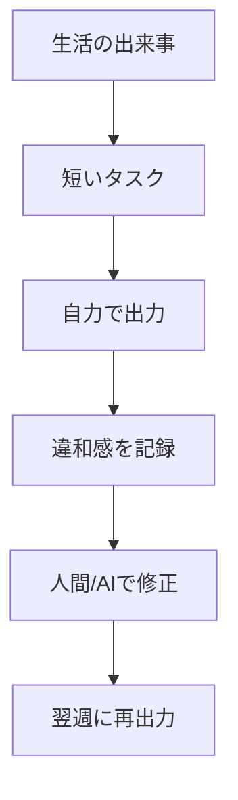
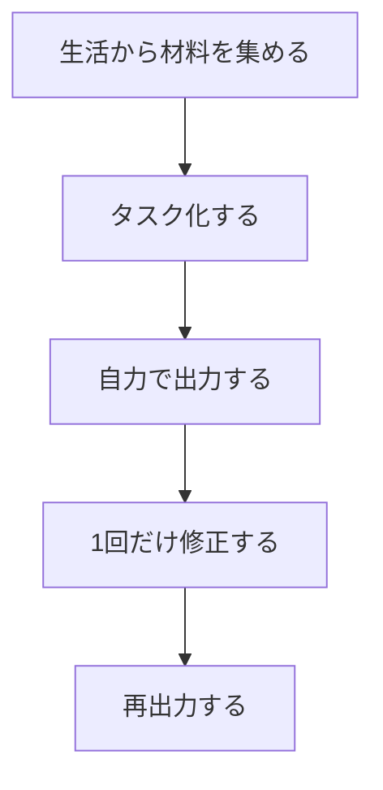

# 生きた言語観を作る第二言語学習法

## 1. エグゼクティブサマリー

第二言語学習の難しさは、語彙や文法の量が足りないことだけではない。多くの場合、学習者は「日本語でどう言うか」を先に考え、その後で英語に置き換えるため、言葉が生活の場面の中で直接立ち上がらない。生きた言語観を作る学習とは、この順序を逆にし、`状況・意図・相手・成果` から言語を組み立てる習慣を育てることだ。<SourceNote>本稿は、意味中心で成果物を伴うタスク設計を扱う Ellis の task-based language teaching、技術媒介タスク研究のレビュー、そして第二言語習得の noticing・output・interaction 文献を統合した公表研究の整理である。[Ellis (2000)](https://journals.sagepub.com/doi/10.1177/136216880000400302)、[Kim & Namkung (2024)](https://www.cambridge.org/core/journals/annual-review-of-applied-linguistics/article/methodological-characteristics-in-technologymediated-taskbased-language-teaching-research-current-practices-and-future-directions/DF84D3B22455E694A8617A486C629A57)、[Truscott & Sharwood Smith (2015)](https://www.sciencedirect.com/science/article/pii/S1877042815045267)、[Izumi et al. (1999)](https://www.sciencedirect.com/science/article/pii/S0346251X98000025) を起点にしている。</SourceNote>

実務的な結論はシンプルである。

1. コミュニカティブ・アプローチは、言語を「使う理由」を作る。
2. タスク中心学習は、その理由を「終わりのある活動」に落とす。
3. noticing は、気づかなかった形式差を見える化する。
4. output hypothesis は、自分で言う・書くことで穴を発見させる。
5. 生活文脈からの獲得は、学習を教室の外に接続する。
6. AI 添削や会話 AI は補助になるが、誤答、標準化、依存の危険も増やす。

このレポートの推奨方針は、`生活文脈で集める → 自力で出す → 差分を直す → もう一度使う` の4段階を、毎週回せる粒度にすることだ。<SourceNote>この循環は、communicative / task-based 設計、noticing、output、interaction、そして informal learning の研究をつないだ実務上の推定である。`公表情報からの推定` として扱うのが妥当である。</SourceNote>

## 2. 背景と研究史

コミュニカティブ・アプローチは、文法の説明を増やすよりも、意味のあるやり取りを増やす発想として発展してきた。ただし、単に「話す活動」を増やすだけでは不十分で、学習者が何かを達成し、相手に働きかけ、結果を持ち帰る構造が必要になる。そこで task-based language teaching が、`意味中心` `目的志向` `成果物あり` という条件を明確にした。<SourceNote>Ellis は task-based teaching を、言語形式の練習ではなく meaning-focused activity として整理している。Kim & Namkung は、技術媒介タスク研究でも同じく meaning-focused で goal-oriented、しかも language practice 以外の outcome を持つ活動が中心になると要約している。[Ellis (2000)](https://journals.sagepub.com/doi/10.1177/136216880000400302)、[Kim & Namkung (2024)](https://www.cambridge.org/core/journals/annual-review-of-applied-linguistics/article/methodological-characteristics-in-technologymediated-taskbased-language-teaching-research-current-practices-and-future-directions/DF84D3B22455E694A8617A486C629A57)。</SourceNote>

この流れは、教室内学習だけで完結しない。近年の第二言語研究では、教室外の informal learning や IDLE（informal digital learning of English）が、語彙、表現、流暢さの差を説明する重要な変数として扱われている。しかも、単に触れる量ではなく、`なぜその活動をするのか` という目的が成果に関係する。<SourceNote>教室外学習の重要性は [Arndt & Kusyk (2026)](https://www.cambridge.org/core/journals/annual-review-of-applied-linguistics/article/informal-second-language-learning/016951C039DD20345022F20FE861F82A) と [Lai & Wang (2025)](https://www.cambridge.org/core/journals/recall/article/online-informal-learning-of-english-and-receptive-vocabulary-knowledge-purpose-matters/F62BDCAAEE08FD11CA22FB9DB06E443C) がよく示している。関連して、[積極的な利用経験が語彙知識と結びつく研究](https://www.cambridge.org/core/journals/annual-review-of-applied-linguistics/article/extramural-english-as-an-individual-difference-variable-in-l2-research-methodology-matters/6CD3085CF7AE6C7EA35DC16F77953405) も、学習の場を教室に閉じない方がよいことを示唆する。</SourceNote>

背景史として重要なのは、`入力を増やせば自然に身につく` という単純化が、すでに十分ではないと分かっている点だ。現在の主流は、入力に加えて、気づき、出力、修正、再利用を組み込んだ設計である。

## 3. 4つの学習原理

### 3.1 Noticing

Noticing は、学習者が入力の中の形式差や意味差に注意を向けることを指す。第二言語では、見えていない差は習得されにくい。逆に言えば、少しでも「なぜここはこうなるのか」と立ち止まれた瞬間に、学習は進みやすくなる。<SourceNote>Truscott & Sharwood Smith の review は、第二言語習得では学習者が form に気づき、その違いを意識的に登録することが重要だと整理する。[Truscott & Sharwood Smith (2015)](https://www.sciencedirect.com/science/article/pii/S1877042815045267)。</SourceNote>

### 3.2 Output hypothesis

Output hypothesis は、話す・書く・要約する・言い換えるといった出力が、`分かっているつもり` と `実際に使える` の差を可視化すると考える。自分で文を作ると、語順、語法、足りない接続、曖昧な表現が露出する。そこで初めて、次に何を学ぶべきかが分かる。<SourceNote>Izumi らの研究は、出力が単なる練習ではなく、気づきと仮説検証を促すことを示している。[Izumi et al. (1999)](https://www.sciencedirect.com/science/article/pii/S0346251X98000025)。</SourceNote>

### 3.3 Interaction and feedback

出力だけでは、誤りが固定化することがある。そこで意味交渉とフィードバックが必要になる。良いフィードバックは、すべてを赤で直すことではない。`何が不自然か` `どこまで直すべきか` `別の自然な言い方は何か` を示し、次の出力に接続することだ。<SourceNote>Long 系の interaction 研究は、意味交渉と修復が学習に重要だと位置づける。Brown らの corrective feedback のメタ分析は、フィードバックは概して有効だが、効果は文脈依存であることを示す。[Long (1996)](https://doi.org/10.1016/B978-012589042-7/50015-3)、[Brown et al. (2016)](https://doi.org/10.1177/1362168814563200)。</SourceNote>

### 3.4 Life-context acquisition

生活文脈からの獲得とは、教科書の単元を追うことではなく、`自分が本当に言いたいこと` から語彙と構文を取り出すことだ。会議、旅行、趣味、家族、仕事、学習の悩みなど、自分の生活に紐づくテーマは、反復しやすく、感情も乗るので、記憶の手がかりが増える。しかも、同じ表現が何度も必要になるため、1回きりの暗記より定着しやすい。<SourceNote>オンラインの informal learning では、語彙知識との関係が `purpose matters` であると示される。加えて、第二言語の関連研究は、量だけでなく、活動の個人的・社会的意味が重要であることを示唆する。[Lai & Wang (2025)](https://www.cambridge.org/core/journals/recall/article/online-informal-learning-of-english-and-receptive-vocabulary-knowledge-purpose-matters/F62BDCAAEE08FD11CA22FB9DB06E443C)、[Arndt & Kusyk (2026)](https://www.cambridge.org/core/journals/annual-review-of-applied-linguistics/article/informal-second-language-learning/016951C039DD20345022F20FE861F82A)。</SourceNote>

## 4. 方法の比較

| 方法 | 強み | 落とし穴 | 使いどころ |
| --- | --- | --- | --- |
| コミュニカティブ・アプローチ | 使う理由を作れる | 活動が雑談で終わりやすい | まず話す必然性を作るとき |
| タスク中心学習 | 目的と成果物を置ける | 反省がないと表面だけになる | 旅行、会議、交渉、説明 |
| Noticing | 形式差に気づける | 気づくだけで終わることがある | 誤りが繰り返されるとき |
| Output hypothesis | ギャップを露出できる | 量だけ増やすと疲れる | 日記、要約、口頭説明 |
| 生活文脈の獲得 | 自分事として残りやすい | 範囲が狭くなりすぎる | 継続したい学習テーマ |
| AI 添削 / 会話 AI | 即時性がある | 誤り、標準化、依存の危険 | 反復練習と下書き |

この比較で重要なのは、どれか一つだけが正しいわけではないことだ。むしろ、`生活文脈でタスクを作り、出力で穴を見つけ、フィードバックで直し、再出力で定着させる` という組み合わせが強い。<SourceNote>この比較は、上記の SLA 文献と informal learning 研究を、実務向けに組み替えた `公表情報からの推定` である。</SourceNote>

## 5. AI添削・会話AIの利点と危険

AI は、第二言語学習を加速できる。たとえば、会話相手として何度も付き合ってくれること、同じ文を別の言い方に変えること、文法の修正候補をすぐ出せること、学習テーマに合わせて練習文を作れることは明確な利点だ。<SourceNote>近年の LLM 研究では、AI が feedback、role-play、customized practice、study planning を支える可能性が議論されている。[Goh & Aryadoust (2025)](https://www.cambridge.org/core/journals/annual-review-of-applied-linguistics/article/developing-and-assessing-second-language-listening-and-speaking-does-ai-make-it-better/4F4CB8BFA5A5B21D5ABACBEE1A0F8B5F) と [Pegrum (2025)](https://www.cambridge.org/core/journals/language-teaching/article/from-revolution-to-evolution-what-generative-ai-really-means-for-language-learning/85C1CD006782BA6B629AA0D53D48614A) を参照。</SourceNote>

ただし、危険も大きい。第一に、AI はもっともらしい誤答や根拠のない引用を返しうる。第二に、AI が返す文は、個人の文脈を平らにして、無難で均質な英語に寄りがちだ。第三に、入力した内容が外部サービスに残る場合、プライバシーや機密の問題が出る。第四に、AI だけで完結すると、学習者自身の出力と修正の筋肉が弱る。<SourceNote>Pegrum は、generative AI の欠点として hallucination、standardization、privacy risk を明示し、人間の input と teacher mediation を残す必要を論じる。[Pegrum (2025)](https://www.cambridge.org/core/journals/language-teaching/article/from-revolution-to-evolution-what-generative-ai-really-means-for-language-learning/85C1CD006782BA6B629AA0D53D48614A)。</SourceNote>

したがって、AI の使い方は `答えをもらう` ではなく `仮説を出してもらう` に寄せるべきだ。つまり、AI は最終判定者ではない。候補、言い換え、反例、確認事項を増やす装置として使う方が安全である。<SourceNote>この線引きは、LLM の利点を認めつつ、人間側の責任とレビューを残すべきだという近年のレビューに沿う。とくに、[Goh & Aryadoust (2025)](https://www.cambridge.org/core/journals/annual-review-of-applied-linguistics/article/developing-and-assessing-second-language-listening-and-speaking-does-ai-make-it-better/4F4CB8BFA5A5B21D5ABACBEE1A0F8B5F) と [Pegrum (2025)](https://www.cambridge.org/core/journals/language-teaching/article/from-revolution-to-evolution-what-generative-ai-really-means-for-language-learning/85C1CD006782BA6B629AA0D53D48614A) の実務的含意からの推定である。</SourceNote>

## 6. 週次学習プロトコル

現場で回しやすい週次プロトコルは、次の5ステップで十分である。

1. **月曜**: 生活の中で言いたかったことを 3 つ集める。
2. **火曜**: そのうち 1 つをタスク化し、短い英文か口頭文にする。
3. **水曜**: 1 回だけ AI または人間に直してもらい、違和感を 1 行メモする。
4. **木曜**: 同じ内容を、修正版を見ずにもう一度言う・書く。
5. **金曜**: 類似場面に転用できる表現を 3 つ抜き出す。

このプロトコルの狙いは、学習を大きくしないことにある。毎日長く勉強するより、`生活で拾う → 1つ出す → 1つ直す → もう1回使う` を小さく回した方が、言語が生きたまま残る。<SourceNote>この週次手順は、task-based learning、noticing、output、feedback、informal learning の研究を、継続可能な粒度にした実務上の推定である。</SourceNote>

## 7. リスク・限界

第一に、入力が少なすぎると、気づきも出力も空回りする。第二に、出力が多すぎるだけでは、誤りが固まる。第三に、AI で直しすぎると、`自分の言葉で言う` 感覚が弱くなる。第四に、学習者の目的が違えば、最適な比率も違う。仕事で必要な表現と、旅行で必要な表現は同じではない。<SourceNote>corrective feedback の研究は、修正が有効でも文脈依存であることを示し、informal learning 研究は学習目的の差を無視できないことを示す。[Brown et al. (2016)](https://doi.org/10.1177/1362168814563200)、[Lai & Wang (2025)](https://www.cambridge.org/core/journals/recall/article/online-informal-learning-of-english-and-receptive-vocabulary-knowledge-purpose-matters/F62BDCAAEE08FD11CA22FB9DB06E443C)。</SourceNote>

もう一つの限界は、`生活文脈` を強調しすぎると、学習範囲が狭くなりうることだ。自分の関心だけを追うと、汎用表現や他者の文脈に弱くなる。したがって、生活文脈は入口であって終点ではない。

## 8. 推奨方針

最も実務的な方針は、第二言語学習を `生活文脈から始めるタスク中心の往復運動` として設計することだ。教室内の説明、教室外の活動、AI の補助を対立させず、役割分担させる。教室は原理を整理する場所、生活は表現を増やす場所、AI は候補を増やす場所、最終判断は人間が担う場所である。<SourceNote>この方針は、task-based teaching、informal learning、AI in language learning の公表研究を一つの運用モデルにまとめたものであり、公式ロードマップではなく `公表情報からの推定` である。[Ellis (2000)](https://journals.sagepub.com/doi/10.1177/136216880000400302)、[Arndt & Kusyk (2026)](https://www.cambridge.org/core/journals/annual-review-of-applied-linguistics/article/informal-second-language-learning/016951C039DD20345022F20FE861F82A)、[Pegrum (2025)](https://www.cambridge.org/core/journals/language-teaching/article/from-revolution-to-evolution-what-generative-ai-really-means-for-language-learning/85C1CD006782BA6B629AA0D53D48614A)。</SourceNote>

要するに、第二言語学習の目標は、文法問題を解けるようになることではなく、`自分の経験・感情・判断を、第二言語でそのまま運べる` ようになることだ。そのためには、暗記よりも、使う、直す、もう一度使う、という循環を習慣化した方がよい。

## 参考情報

- [Ellis (2000), Task-based research and language pedagogy](https://journals.sagepub.com/doi/10.1177/136216880000400302)
- [Kim & Namkung (2024), Methodological characteristics in technology-mediated task-based language teaching research](https://www.cambridge.org/core/journals/annual-review-of-applied-linguistics/article/methodological-characteristics-in-technologymediated-taskbased-language-teaching-research-current-practices-and-future-directions/DF84D3B22455E694A8617A486C629A57)
- [Truscott & Sharwood Smith (2015), The role of noticing in second language acquisition](https://www.sciencedirect.com/science/article/pii/S1877042815045267)
- [Izumi et al. (1999), The role of output in second language acquisition](https://www.sciencedirect.com/science/article/pii/S0346251X98000025)
- [Long (1996), The role of the linguistic environment in second language acquisition](https://doi.org/10.1016/B978-012589042-7/50015-3)
- [Brown et al. (2016), Corrective feedback in second language writing](https://doi.org/10.1177/1362168814563200)
- [Lai & Wang (2025), Online informal learning of English and receptive vocabulary knowledge: purpose matters](https://www.cambridge.org/core/journals/recall/article/online-informal-learning-of-english-and-receptive-vocabulary-knowledge-purpose-matters/F62BDCAAEE08FD11CA22FB9DB06E443C)
- [Arndt & Kusyk (2026), Informal second language learning](https://www.cambridge.org/core/journals/annual-review-of-applied-linguistics/article/informal-second-language-learning/016951C039DD20345022F20FE861F82A)
- [Goh & Aryadoust (2025), Developing and assessing second language listening and speaking: does AI make it better?](https://www.cambridge.org/core/journals/annual-review-of-applied-linguistics/article/developing-and-assessing-second-language-listening-and-speaking-does-ai-make-it-better/4F4CB8BFA5A5B21D5ABACBEE1A0F8B5F)
- [Pegrum (2025), From revolution to evolution: what generative AI really means for language learning](https://www.cambridge.org/core/journals/language-teaching/article/from-revolution-to-evolution-what-generative-ai-really-means-for-language-learning/85C1CD006782BA6B629AA0D53D48614A)
