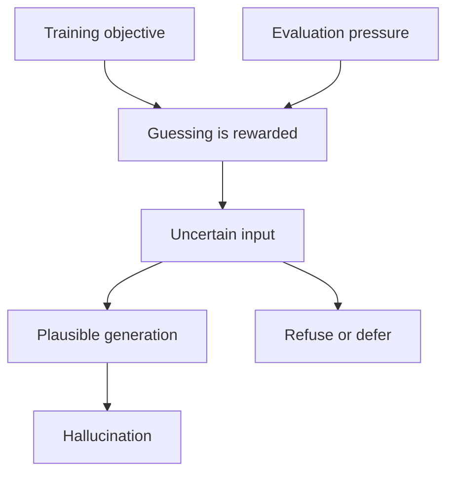
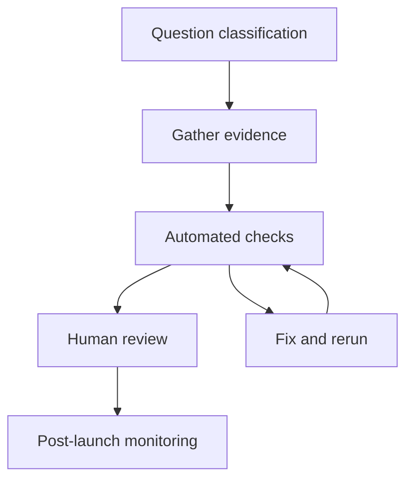

# LLM Limits and Hallucinations: Factuality, Evaluation, and QA

## 1. Executive Summary

LLMs generate plausible text, but they are not truth checkers. Training optimizes next-token prediction, and evaluation often rewards guessing, so uncertainty can still produce confident-looking answers. <SourceNote>[Why Language Models Hallucinate](https://arxiv.org/abs/2509.04664) and [Calibrated Language Models Must Hallucinate](https://arxiv.org/abs/2311.14648) support this framing.</SourceNote>

Hallucination is therefore not just a bug. It is a predictable result of learning objectives, scoring rules, and decoding behavior that can make guessing attractive. <SourceNote>[Why Language Models Hallucinate](https://arxiv.org/abs/2509.04664) argues that training and evaluation push models toward guessing, and [Calibrated Language Models Must Hallucinate](https://arxiv.org/abs/2311.14648) shows that a lower bound remains for arbitrary facts.</SourceNote>

The practical question is not whether hallucination exists. The practical question is how much uncertainty the system should tolerate, when it should abstain, and what external checks it needs. <SourceNote>[Holistic Evaluation of Language Models](https://arxiv.org/abs/2211.09110) argues for multiple evaluation axes, and [NIST AI RMF](https://www.nist.gov/itl/ai-risk-management-framework) treats evaluation as ongoing risk management.</SourceNote>

Benchmarks are useful because they standardize comparison, but benchmark scores do not equal field performance. Public and static datasets can be contaminated, and operational metrics such as latency, cost, refusal rate, and auditability also matter. <SourceNote>[An Open Source Data Contamination Report for Large Language Models](https://arxiv.org/abs/2310.17589) and [The Vulnerability of Language Model Benchmarks: Do They Accurately Reflect True LLM Performance?](https://arxiv.org/abs/2412.03597) show why benchmark readings must be cautious.</SourceNote>

RAG, citations, tools, and verification help, but none of them guarantee truth. Unsupported claims still appear, citations can fail to reflect the real basis for an answer, and external retrieval opens a path for injection and poisoning. <SourceNote>[RAGTruth: A Hallucination Corpus for Developing Trustworthy Retrieval-Augmented Language Models](https://arxiv.org/abs/2401.00396), [Language Models Don't Always Say What They Think: Unfaithful Explanations in Chain-of-Thought Prompting](https://arxiv.org/abs/2305.04388), and [Indirect Prompt Injection in the Wild: An Empirical Study of Prevalence, Techniques, and Objectives](https://arxiv.org/abs/2604.27202) support this claim.</SourceNote>

The key takeaways are four.

1. Hallucination is a side effect of probabilistic generation and depends heavily on training and evaluation design.
2. Benchmarks are useful, but contamination, overfitting, and distribution shift must always be suspected.
3. RAG and citations improve grounding, but they do not automatically guarantee fidelity or safety.
4. Production systems need quality assurance that combines refusal, verification, human review, and audit logs.

This diagram treats hallucination as a design outcome rather than a mysterious failure. In practice, the important control point is the ability to stop at D by refusing or verifying.

## 2. Background and Research History

The starting point of LLM research is Transformer-based autoregressive generation. The model looks at an input sequence and then chooses the next token step by step. Truth checking is not the central operation in that loop. <SourceNote>[Attention Is All You Need](https://arxiv.org/abs/1706.03762) and [Language Models are Few-Shot Learners](https://arxiv.org/abs/2005.14165) show this basic structure.</SourceNote>

RAG then spread as a way to inject external documents into context. Long context, tool use, benchmark expansion, calibration, and explainability research followed in parallel. <SourceNote>[Retrieval-Augmented Generation for Knowledge-Intensive NLP Tasks](https://arxiv.org/abs/2005.11401), [Lost in the Middle: How Language Models Use Long Contexts](https://arxiv.org/abs/2307.03172), and [Holistic Evaluation of Language Models](https://arxiv.org/abs/2211.09110) fit that trajectory.</SourceNote>

Hallucination research moved from describing wrong answers to explaining why wrong answers happen systematically. By 2023, the key themes were training-data extraction, position effects in long context, and the limits of calibration and refusal. From 2024 to 2026, RAG fidelity, benchmark contamination, injection attacks, and unfaithful explanations became clearer. <SourceNote>[Extracting Training Data from Large Language Models](https://arxiv.org/abs/2012.07805), [Scalable Extraction of Training Data from (Production) Language Models](https://arxiv.org/abs/2311.17035), [RAGTruth](https://arxiv.org/abs/2401.00396), and [An Open Source Data Contamination Report for Large Language Models](https://arxiv.org/abs/2310.17589) support this summary.</SourceNote>

The lesson from that history is that LLM limits are not confined to one layer. Pretraining, inference, retrieval, evaluation, and auditing can all fail, so a single fix is not enough. <SourceNote>[Why Language Models Hallucinate](https://arxiv.org/abs/2509.04664) and [Holistic Evaluation of Language Models](https://arxiv.org/abs/2211.09110) both point toward system-level analysis.</SourceNote>

## 3. Why Hallucinations Happen

The first point is that LLMs are not optimized to tell the truth. In many training setups, the model learns to predict the next token, and evaluation mainly rewards the right answer. That means guessing can be more attractive than saying "I do not know." <SourceNote>[Why Language Models Hallucinate](https://arxiv.org/abs/2509.04664) explains the incentive structure from training and evaluation, and [Calibrated Language Models Must Hallucinate](https://arxiv.org/abs/2311.14648) gives a lower bound for arbitrary facts.</SourceNote>

The second point is that decoding is not evidence checking. The model simply emits high-probability continuations step by step, so plausibility and correctness do not always match. Lower temperature does not remove the underlying uncertainty. <SourceNote>[Language Models are Few-Shot Learners](https://arxiv.org/abs/2005.14165) shows the autoregressive setup, and [Calibrated Language Models Must Hallucinate](https://arxiv.org/abs/2311.14648) shows that uncertainty remains at inference time.</SourceNote>

The third point is that memory and factuality are different things. A model can memorize parts of training data, but it cannot always retrieve them reliably. A fact may be in memory and still be replaced by a plausible alternative when the context shifts. <SourceNote>[Extracting Training Data from Large Language Models](https://arxiv.org/abs/2012.07805) and [Scalable Extraction of Training Data from (Production) Language Models](https://arxiv.org/abs/2311.17035) show the gap between memory and retrieval.</SourceNote>

The fourth point is that hallucination is not only about low confidence. When the prompt is ambiguous or the context is incomplete, the model may still fill the gap with a plausible completion. That is statistical completion, not semantic verification. <SourceNote>[Why Language Models Hallucinate](https://arxiv.org/abs/2509.04664) and [Holistic Evaluation of Language Models](https://arxiv.org/abs/2211.09110) make this distinction easier to see.</SourceNote>

The fifth point is that hallucination is not always a fully wrong answer. A sentence can be mostly right while the number, attribute, causal link, or citation target is wrong. In practice, those partial errors are often the most dangerous. <SourceNote>[RAGTruth](https://arxiv.org/abs/2401.00396) shows that unsupported and contradictory content still appears in RAG systems.</SourceNote>

## 4. Benchmark Evaluation vs Practical Evaluation

A benchmark is a comparison instrument. Practical evaluation is a failure-prevention instrument for a real workflow. They look similar, but they serve different purposes. <SourceNote>[Holistic Evaluation of Language Models](https://arxiv.org/abs/2211.09110) argues for broader evaluation than a single benchmark score.</SourceNote>

Benchmarks are reproducible. But the more public, static, and popular a benchmark becomes, the more likely it is to be affected by overlap with training data or by overfitting. That is why a score alone is not enough. <SourceNote>[An Open Source Data Contamination Report for Large Language Models](https://arxiv.org/abs/2310.17589) and [The Vulnerability of Language Model Benchmarks: Do They Accurately Reflect True LLM Performance?](https://arxiv.org/abs/2412.03597) address this problem empirically.</SourceNote>

Practical evaluation must be built around the failures that matter in the actual workflow. In legal, medical, financial, support, and internal-search settings, refusal quality, provenance tracking, latency, cost, and stability under reruns can matter more than a plain accuracy number. <SourceNote>[NIST AI RMF](https://www.nist.gov/itl/ai-risk-management-framework) and [Holistic Evaluation of Language Models](https://arxiv.org/abs/2211.09110) both imply that accuracy alone is not enough.</SourceNote>

| Dimension | Benchmark evaluation | Practical evaluation |
| --- | --- | --- |
| Goal | Compare models | Avoid failures in your workflow |
| Data | Public and fixed | Internal docs, logs, hidden cases |
| Weakness | Contamination, overfitting, staleness | Distribution shift, operational cost, permissions |
| Metrics | accuracy, calibration, robustness | correctness, refusal rate, provenance rate, latency, cost |
| Change rate | Low | High |
| Failure visibility | Often hidden on a leaderboard | Exposed in real use |

The point of the table is not to reject benchmarks. The point is that benchmarks are necessary but not sufficient. <SourceNote>[Holistic Evaluation of Language Models](https://arxiv.org/abs/2211.09110) supports a multi-metric design, and contamination research warns against reading static scores too literally.</SourceNote>

## 5. What Helps and What Remains

RAG inserts external documents into context. That improves freshness and makes internal knowledge easier to use. But if the retrieved material is wrong, the answer can still be wrong. <SourceNote>[Retrieval-Augmented Generation for Knowledge-Intensive NLP Tasks](https://arxiv.org/abs/2005.11401) gives the basic RAG design, and [RAGTruth](https://arxiv.org/abs/2401.00396) shows that hallucination can remain even with evidence present.</SourceNote>

Citations help expose provenance. But a citation attached by the model is not the same thing as the real basis for the answer. Citations show provenance, but they do not prove fidelity. <SourceNote>[Language Models Don't Always Say What They Think: Unfaithful Explanations in Chain-of-Thought Prompting](https://arxiv.org/abs/2305.04388) shows that a plausible explanation may not reflect the actual reasoning path.</SourceNote>

Tool use can add factual checks through calculation, search, database lookups, and external APIs. That is useful, but it also requires permissions, auditing, rollback, and protection against polluted inputs. The convenience of external retrieval creates a new attack surface. <SourceNote>[Indirect Prompt Injection in the Wild: An Empirical Study of Prevalence, Techniques, and Objectives](https://arxiv.org/abs/2604.27202) and [Backdoored Retrievers for Prompt Injection Attacks on Retrieval Augmented Generation of Large Language Models](https://arxiv.org/abs/2410.14479) demonstrate that attack surface.</SourceNote>

Long context is not a universal fix either. When the relevant information sits in the middle of a long input, the model can still miss it. It is better to decide what should be retrieved, what should be structured, and what should be refused before you simply make the input longer. <SourceNote>[Lost in the Middle: How Language Models Use Long Contexts](https://arxiv.org/abs/2307.03172) shows the positional limitation.</SourceNote>

| Method | What it improves | What remains |
| --- | --- | --- |
| RAG | Freshness, evidence access | Retrieval errors, contamination, injection |
| Citations | Traceability | Not a guarantee of fidelity |
| Tool use | Fact checking, calculation, lookup | Permissions and auditing are required |
| Long context | More material to reference | Positional weakness and missed details |
| Calibration and refusal | Less overconfident behavior | A lower bound remains for arbitrary facts |

The point is not that one method solves everything. The point is that the failure mode you want to reduce usually needs a stack of methods, not one trick. <SourceNote>[RAGTruth](https://arxiv.org/abs/2401.00396), [Lost in the Middle](https://arxiv.org/abs/2307.03172), and [Calibrated Language Models Must Hallucinate](https://arxiv.org/abs/2311.14648) make that clear.</SourceNote>

## 6. A Quality Assurance Process

What follows is a public-information inference. In high-risk LLM use, you need quality assurance for the whole system, not only for the model. <SourceNote>[NIST AI RMF](https://www.nist.gov/itl/ai-risk-management-framework) and [Holistic Evaluation of Language Models](https://arxiv.org/abs/2211.09110) support this inference.</SourceNote>

First, separate questions into facts, reasoning, summaries, calculations, and actions. Facts go to source checks, reasoning goes to condition checks, summaries go to fidelity checks, calculations go to tools, and actions go to permission checks. <SourceNote>This split is a public-information inference from the separate roles of RAG, tools, and evaluation axes.</SourceNote>

Next, keep evaluation in three layers. Use public benchmarks to check breadth, a private holdout to check workflow fit, and an adversarial set to check hallucination and injection. <SourceNote>[An Open Source Data Contamination Report for Large Language Models](https://arxiv.org/abs/2310.17589) and [Indirect Prompt Injection in the Wild](https://arxiv.org/abs/2604.27202) support why a single fixed set is not enough.</SourceNote>

Then measure the following every time.

1. Factuality.
2. Citation support.
3. Refusal quality.
4. Latency.
5. Cost.
6. Stability under reruns.

The point of the flow is not to hope that the model becomes correct. The point is to find failures early, reproduce them, isolate them, and watch for regressions. <SourceNote>[NIST AI RMF](https://www.nist.gov/itl/ai-risk-management-framework) emphasizes ongoing management, and [Holistic Evaluation of Language Models](https://arxiv.org/abs/2211.09110) emphasizes multi-dimensional measurement.</SourceNote>

## 7. Risks and Limits

First, zero hallucination is not realistic. For arbitrary facts, there will always be residual error under the structure of training and evaluation. The practical question is not zero hallucination, but the acceptable failure rate. <SourceNote>[Calibrated Language Models Must Hallucinate](https://arxiv.org/abs/2311.14648) and [Why Language Models Hallucinate](https://arxiv.org/abs/2509.04664) support that point.</SourceNote>

Second, explanations are not proofs. LLMs can produce plausible reasons, but those reasons may not reflect the actual internal process. Explanations should therefore not replace audit evidence. <SourceNote>[Language Models Don't Always Say What They Think: Unfaithful Explanations in Chain-of-Thought Prompting](https://arxiv.org/abs/2305.04388) shows this limitation.</SourceNote>

Third, RAG improves freshness, but it is not a truth guarantee. Retrieval sources can be contaminated, and injection attacks can slip in instructions or malicious documents that should not have been there. <SourceNote>[RAGTruth](https://arxiv.org/abs/2401.00396) and [Indirect Prompt Injection in the Wild](https://arxiv.org/abs/2604.27202) show the residual risk.</SourceNote>

Fourth, benchmarks are fragile. Public data is easy to contaminate, and a number does not map cleanly to a workflow failure mode. A high score is not the same as practical usefulness. <SourceNote>[An Open Source Data Contamination Report for Large Language Models](https://arxiv.org/abs/2310.17589) and [The Vulnerability of Language Model Benchmarks: Do They Accurately Reflect True LLM Performance?](https://arxiv.org/abs/2412.03597) are the main warnings here.</SourceNote>

## 8. Recommendations

1. Separate questions the model can answer from questions it should refuse.
2. Decide on refusal and deferral behavior before deployment.
3. Externalize evidence through RAG and tool use.
4. Keep citations, but do not treat citations themselves as proof.
5. Use benchmarks, but supplement them with internal holdouts and adversarial sets.
6. For high-risk use cases, retain human review and audit logs.

This sequence is sensible because finding and stopping failures early is often more effective than trying to make the model smarter. <SourceNote>[NIST AI RMF](https://www.nist.gov/itl/ai-risk-management-framework), [Holistic Evaluation of Language Models](https://arxiv.org/abs/2211.09110), and [RAGTruth](https://arxiv.org/abs/2401.00396) together support this public-information inference.</SourceNote>

## References

- [Why Language Models Hallucinate](https://arxiv.org/abs/2509.04664)
- [Calibrated Language Models Must Hallucinate](https://arxiv.org/abs/2311.14648)
- [Holistic Evaluation of Language Models](https://arxiv.org/abs/2211.09110)
- [An Open Source Data Contamination Report for Large Language Models](https://arxiv.org/abs/2310.17589)
- [The Vulnerability of Language Model Benchmarks: Do They Accurately Reflect True LLM Performance?](https://arxiv.org/abs/2412.03597)
- [Lost in the Middle: How Language Models Use Long Contexts](https://arxiv.org/abs/2307.03172)
- [RAGTruth: A Hallucination Corpus for Developing Trustworthy Retrieval-Augmented Language Models](https://arxiv.org/abs/2401.00396)
- [Language Models Don't Always Say What They Think: Unfaithful Explanations in Chain-of-Thought Prompting](https://arxiv.org/abs/2305.04388)
- [Indirect Prompt Injection in the Wild: An Empirical Study of Prevalence, Techniques, and Objectives](https://arxiv.org/abs/2604.27202)
- [Backdoored Retrievers for Prompt Injection Attacks on Retrieval Augmented Generation of Large Language Models](https://arxiv.org/abs/2410.14479)
- [NIST AI RMF](https://www.nist.gov/itl/ai-risk-management-framework)
- [Attention Is All You Need](https://arxiv.org/abs/1706.03762)
- [Language Models are Few-Shot Learners](https://arxiv.org/abs/2005.14165)
- [Retrieval-Augmented Generation for Knowledge-Intensive NLP Tasks](https://arxiv.org/abs/2005.11401)
- [Extracting Training Data from Large Language Models](https://arxiv.org/abs/2012.07805)
- [Scalable Extraction of Training Data from (Production) Language Models](https://arxiv.org/abs/2311.17035)
