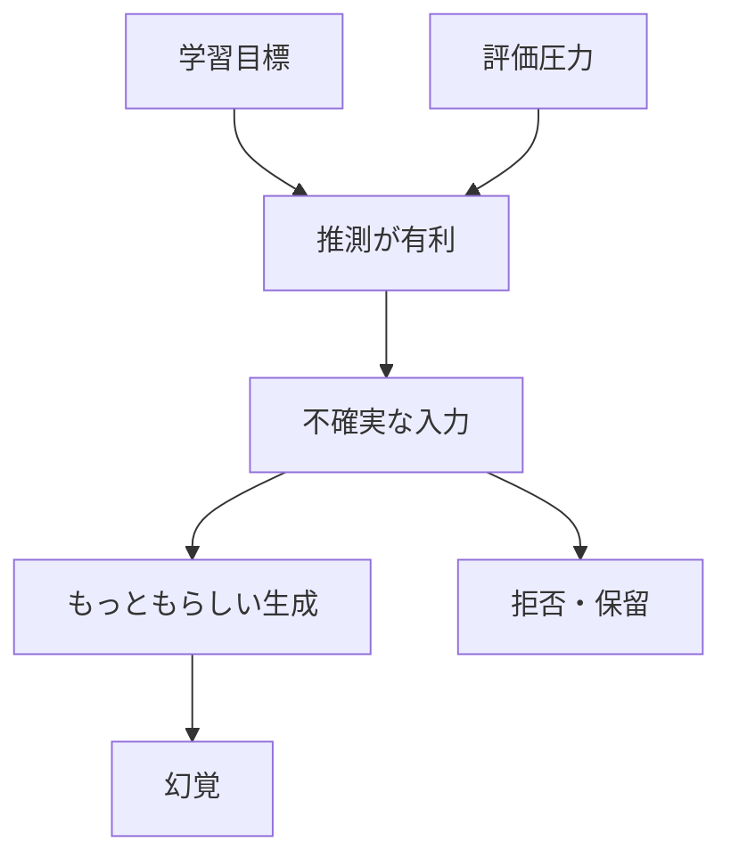
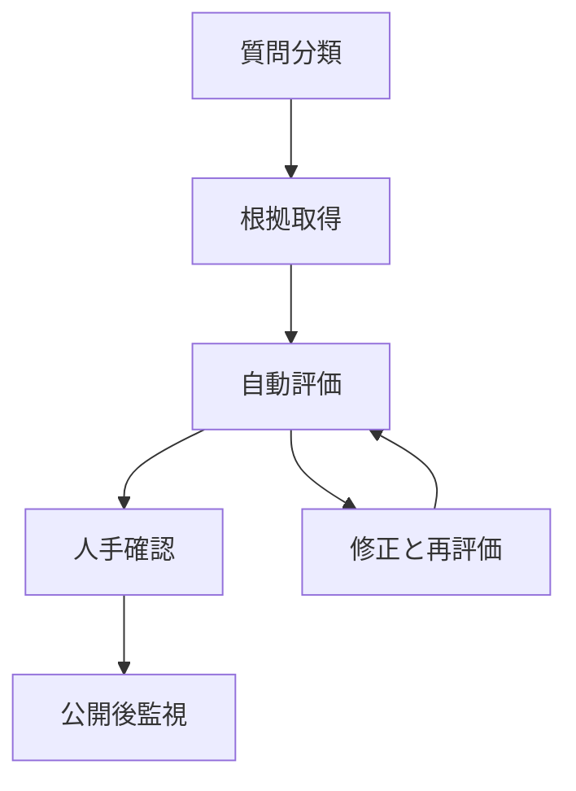

# LLMの限界と幻覚: 事実性・評価・品質保証をどう設計するか

## 1. エグゼクティブサマリー

LLMは、もっともらしい文を生成する装置であって、真偽を照合する装置ではない。学習では次トークン予測が最適化され、評価ではしばしば正解を当てることが褒められるため、不確実な場面でも推測が有利になる。<SourceNote>[Why Language Models Hallucinate](https://arxiv.org/abs/2509.04664) と [Calibrated Language Models Must Hallucinate](https://arxiv.org/abs/2311.14648) に基づく整理である。</SourceNote>

したがって、幻覚は単なるバグではない。学習目的、採点方法、推論時のデコーディングが重なって、推測が報われる条件ができると起きやすい。<SourceNote>[Why Language Models Hallucinate](https://arxiv.org/abs/2509.04664) は訓練と評価が推測を押しやすいと論じ、[Calibrated Language Models Must Hallucinate](https://arxiv.org/abs/2311.14648) は任意の事実に対して幻覚の下限が残ることを示している。</SourceNote>

実務の問いは、幻覚をゼロにできるかではない。どの程度の不確実性を許容し、どの場面で拒否させ、どの外部検証を挟むかである。<SourceNote>[Holistic Evaluation of Language Models](https://arxiv.org/abs/2211.09110) は単一精度ではなく複数の評価軸を見よと示し、[NIST AI RMF](https://www.nist.gov/itl/ai-risk-management-framework) は評価を継続的なリスク管理として扱う。</SourceNote>

ベンチマークは比較に有効だが、現場の性能と同義ではない。公開固定データは汚染されうるし、業務では latency、費用、拒否率、監査可能性、権限設計も効く。<SourceNote>[An Open Source Data Contamination Report for Large Language Models](https://arxiv.org/abs/2310.17589) と [The Vulnerability of Language Model Benchmarks: Do They Accurately Reflect True LLM Performance?](https://arxiv.org/abs/2412.03597) は、ベンチマーク汚染と一般化のずれを示している。</SourceNote>

RAG、引用、ツール利用、検証は助けになるが、真実保証ではない。RAGでも unsupported claim は残り、出典は付いていても忠実性は別問題であり、外部取得は注入攻撃や汚染の入口にもなる。<SourceNote>[RAGTruth: A Hallucination Corpus for Developing Trustworthy Retrieval-Augmented Language Models](https://arxiv.org/abs/2401.00396)、[Language Models Don't Always Say What They Think: Unfaithful Explanations in Chain-of-Thought Prompting](https://arxiv.org/abs/2305.04388)、[Indirect Prompt Injection in the Wild: An Empirical Study of Prevalence, Techniques, and Objectives](https://arxiv.org/abs/2604.27202) に基づく。</SourceNote>

要点は四つである。

1. 幻覚は確率生成の副作用であり、学習と評価の設計に強く依存する。
2. ベンチマークは便利だが、汚染、過学習、分布ずれを常に疑う必要がある。
3. RAG と引用は正確性を上げやすいが、忠実性と安全性を自動保証しない。
4. 実務では、拒否、検証、人手確認、監査を組み合わせた品質保証が必要になる。

この図は、幻覚を「モデルが壊れている」現象ではなく、「推測が選ばれやすい設計条件」の帰結として見るための簡略図である。実務では、D で止めるための拒否設計と外部検証が重要になる。

## 2. 背景と研究史

LLM研究の出発点は、Transformer による自己回帰生成である。モデルは入力文を見て、次に来そうなトークンを順に選ぶ。そこでは真偽よりも、文脈上もっともらしい続きを作ることが中心になる。<SourceNote>[Attention Is All You Need](https://arxiv.org/abs/1706.03762) と [Language Models are Few-Shot Learners](https://arxiv.org/abs/2005.14165) が、この基本構造を示している。</SourceNote>

その後、RAG は外部文書を文脈に差し込む設計として広まった。さらに、長文脈、ツール利用、ベンチマーク拡張、校正、説明可能性の研究が並走した。<SourceNote>[Retrieval-Augmented Generation for Knowledge-Intensive NLP Tasks](https://arxiv.org/abs/2005.11401)、[Lost in the Middle: How Language Models Use Long Contexts](https://arxiv.org/abs/2307.03172)、[Holistic Evaluation of Language Models](https://arxiv.org/abs/2211.09110) に沿った流れである。</SourceNote>

幻覚の研究は、単なる誤答の記述から、なぜ誤答が体系的に起きるかの分析へ進んだ。2023年には、訓練データの抽出、長文脈の位置依存、校正と拒否の限界が論点になった。2024年から2026年にかけては、RAG の忠実性、ベンチマーク汚染、注入攻撃、説明の不忠実性がより明確になった。<SourceNote>[Extracting Training Data from Large Language Models](https://arxiv.org/abs/2012.07805)、[Scalable Extraction of Training Data from (Production) Language Models](https://arxiv.org/abs/2311.17035)、[RAGTruth](https://arxiv.org/abs/2401.00396)、[An Open Source Data Contamination Report for Large Language Models](https://arxiv.org/abs/2310.17589) に基づく要約である。</SourceNote>

この研究史から見えるのは、LLM の限界が一つの層で完結していないことである。事前学習、推論、検索、評価、監査の各層で失敗しうるため、対策も一つでは足りない。<SourceNote>[Why Language Models Hallucinate](https://arxiv.org/abs/2509.04664) と [Holistic Evaluation of Language Models](https://arxiv.org/abs/2211.09110) は、単層ではなく系として見る必要を後押ししている。</SourceNote>

## 3. 幻覚はなぜ起きるか

最初の要点は、LLM が真実を当てるように最適化されているわけではないことである。多くの訓練設定では、モデルは次の語を当てることを学び、評価では正しい答えを出したかどうかだけが目立つ。その結果、分からないときに「分からない」と言うより、推測する方が報酬的に有利になりうる。<SourceNote>[Why Language Models Hallucinate](https://arxiv.org/abs/2509.04664) はこの問題を訓練と評価のインセンティブから説明し、[Calibrated Language Models Must Hallucinate](https://arxiv.org/abs/2311.14648) は任意事実での下限を与えている。</SourceNote>

第二の要点は、推論時のデコーディングが証拠確認ではないことである。モデルは高い確率を持つ続きを順に出すだけなので、もっともらしさと正確さは一致しない。温度を下げても、基礎的な不確実性が消えるわけではない。<SourceNote>[Language Models are Few-Shot Learners](https://arxiv.org/abs/2005.14165) は自己回帰生成の枠組みを示し、[Calibrated Language Models Must Hallucinate](https://arxiv.org/abs/2311.14648) は推論時の不確実性が残ることを示している。</SourceNote>

第三の要点は、記憶と事実性が別物であることである。モデルは訓練データの一部を覚えうるが、覚えたことを常に正しく取り出せるわけではない。記憶はあっても、文脈が少し変わると別のもっともらしい答えを作ってしまう。<SourceNote>[Extracting Training Data from Large Language Models](https://arxiv.org/abs/2012.07805) と [Scalable Extraction of Training Data from (Production) Language Models](https://arxiv.org/abs/2311.17035) は、記憶と抽出のズレを示している。</SourceNote>

第四の要点は、幻覚の中心が「自信のなさ」そのものではないことである。自信が低い場面で拒否できればよいが、実際には、曖昧な問いや欠損した文脈の下で、もっともらしい補完が生成される。これは統計的な補完であって、意味論的な検証ではない。<SourceNote>[Why Language Models Hallucinate](https://arxiv.org/abs/2509.04664) と [Holistic Evaluation of Language Models](https://arxiv.org/abs/2211.09110) を合わせて読むと、この違いが分かりやすい。</SourceNote>

第五の要点は、幻覚は「完全な誤り」だけではないことである。部分的に正しい文の中に、数字、属性、因果、引用先だけがずれることがある。実務上は、この半分だけ合っている誤りの方が危険である。<SourceNote>[RAGTruth](https://arxiv.org/abs/2401.00396) は、RAG システムでも unsupported かつ contradictory な内容が出うることを示している。</SourceNote>

## 4. ベンチマーク評価と実務評価の違い

ベンチマークは比較のための装置である。実務評価は、実際の業務で失敗しないかを確かめる装置である。両者は似ているが、目的が違う。<SourceNote>[Holistic Evaluation of Language Models](https://arxiv.org/abs/2211.09110) は、単一ベンチマークではなく多面的評価を提案している。</SourceNote>

ベンチマークは再現性が高い。だが、公開され、静的で、よく使われるほど、訓練データとの重複や過学習の影響を受けやすい。したがって、スコアだけで能力を語るのは危険である。<SourceNote>[An Open Source Data Contamination Report for Large Language Models](https://arxiv.org/abs/2310.17589) と [The Vulnerability of Language Model Benchmarks: Do They Accurately Reflect True LLM Performance?](https://arxiv.org/abs/2412.03597) は、この問題を実証的に扱っている。</SourceNote>

実務評価は、業務の失敗モードに合わせて作る必要がある。たとえば、法務、医療、金融、サポート、社内検索では、単純な正解率より、拒否の妥当性、根拠の追跡可能性、遅延、コスト、再実行時の安定性が重要になる。<SourceNote>[NIST AI RMF](https://www.nist.gov/itl/ai-risk-management-framework) と [Holistic Evaluation of Language Models](https://arxiv.org/abs/2211.09110) を合わせると、評価は単なる accuracy では足りない。</SourceNote>

| 観点 | ベンチマーク評価 | 実務評価 |
| --- | --- | --- |
| 目的 | 他モデルとの比較 | 自分の業務での失敗回避 |
| データ | 公開固定データ | 自社文書、ログ、隠しケース |
| 弱点 | 汚染、過学習、古さ | 分布変化、運用コスト、権限差 |
| 指標 | accuracy, calibration, robustness | 正確性, 拒否率, 根拠率, latency, cost |
| 変更頻度 | 低い | 高い |
| 失敗の見え方 | リーダーボードで隠れる | 実利用で露出する |

この表の意味は、ベンチマークを捨てることではない。ベンチマークは必要だが、十分ではないということだ。<SourceNote>[Holistic Evaluation of Language Models](https://arxiv.org/abs/2211.09110) は複数の指標を組み合わせる設計を示し、汚染研究は固定スコアの読み方に注意を促している。</SourceNote>

## 5. RAG・検証・引用・ツール利用で何が改善し、何が残るか

RAG は、外部文書を文脈に入れて答えを作る。これは古い知識を減らし、社内文書や最新情報を使いやすくする。だが、検索した文書が誤っていれば答えも誤る。<SourceNote>[Retrieval-Augmented Generation for Knowledge-Intensive NLP Tasks](https://arxiv.org/abs/2005.11401) は RAG の基本構造を示し、[RAGTruth](https://arxiv.org/abs/2401.00396) は証拠があっても幻覚が残ることを示している。</SourceNote>

引用は出典を見せるのに役立つ。だが、モデルが付けた引用が、その主張の本当の根拠であるとは限らない。引用は provenance を見せるが、忠実性の証明ではない。<SourceNote>[Language Models Don't Always Say What They Think: Unfaithful Explanations in Chain-of-Thought Prompting](https://arxiv.org/abs/2305.04388) は、もっともらしい説明が実際の判断過程を表していない場合があることを示している。</SourceNote>

ツール利用は、計算、検索、DB 照会、外部 API 呼び出しで事実確認を補える。これは有効だが、権限、監査、ロールバック、入力汚染への対策が必要になる。外部取得の便利さは、新しい攻撃面でもある。<SourceNote>[Indirect Prompt Injection in the Wild: An Empirical Study of Prevalence, Techniques, and Objectives](https://arxiv.org/abs/2604.27202) と [Backdoored Retrievers for Prompt Injection Attacks on Retrieval Augmented Generation of Large Language Models](https://arxiv.org/abs/2410.14479) は、その攻撃面を示している。</SourceNote>

長文脈も万能ではない。必要な情報が長い入力の中央にあると、モデルが見落とすことがある。だから、長く入れる前に、何を検索に回し、何を構造化し、何を拒否させるかを決める方がよい。<SourceNote>[Lost in the Middle: How Language Models Use Long Contexts](https://arxiv.org/abs/2307.03172) は、位置依存の限界を示している。</SourceNote>

| 手法 | 改善する点 | 残る点 |
| --- | --- | --- |
| RAG | 最新性、根拠の提示 | 検索誤り、汚染、注入 |
| 引用 | 追跡可能性 | 忠実性の保証ではない |
| ツール利用 | 事実確認、計算、照会 | 権限と監査が必要 |
| 長文脈 | 参照可能な材料の増加 | 位置依存と取りこぼし |
| 校正・拒否 | 不確実時の暴発抑制 | 任意事実の幻覚下限 |

この比較は、どれか一つを入れれば解決するという話ではない。改善したい失敗モードに応じて、複数の手段を重ねる必要がある。<SourceNote>[RAGTruth](https://arxiv.org/abs/2401.00396)、[Lost in the Middle](https://arxiv.org/abs/2307.03172)、[Calibrated Language Models Must Hallucinate](https://arxiv.org/abs/2311.14648) を合わせると、その現実が見えやすい。</SourceNote>

## 6. 実務での品質保証プロセス

以下は公表情報からの推定である。高リスクの LLM 利用では、モデル単体の精度ではなく、運用全体の品質保証が必要になる。<SourceNote>[NIST AI RMF](https://www.nist.gov/itl/ai-risk-management-framework) と [Holistic Evaluation of Language Models](https://arxiv.org/abs/2211.09110) を踏まえた推定である。</SourceNote>

まず、質問を事実、推論、要約、計算、操作に分ける。事実は出典照合、推論は条件検査、要約は忠実性検査、計算はツール実行、操作は権限確認に回す。<SourceNote>この分解は、RAG、ツール利用、評価軸を別に扱う方が安全だという public information inference である。</SourceNote>

次に、評価セットを三層で持つ。公開ベンチマークで広さを確認し、社内の固定ホールドアウトで業務適合を確認し、意地悪な adversarial set で幻覚と注入を確認する。<SourceNote>[An Open Source Data Contamination Report for Large Language Models](https://arxiv.org/abs/2310.17589) と [Indirect Prompt Injection in the Wild](https://arxiv.org/abs/2604.27202) は、固定セットだけでは足りない理由を補強している。</SourceNote>

そのうえで、次の指標を毎回見る。

1. 事実性。
2. 引用の支持率。
3. 拒否の適切さ。
4. latency。
5. cost。
6. 再実行時の安定性。

この流れの狙いは、モデルに「正しさ」を祈ることではない。失敗を早く見つけ、失敗を再現し、失敗を隔離し、再発を監視することである。<SourceNote>[NIST AI RMF](https://www.nist.gov/itl/ai-risk-management-framework) は継続的な管理を、[Holistic Evaluation of Language Models](https://arxiv.org/abs/2211.09110) は多面的な測定を、それぞれ重視している。</SourceNote>

## 7. リスク・限界

第一に、幻覚をゼロにするのは現実的ではない。任意の事実に関する答えでは、学習と評価の構造上、誤りの余地が残る。だから重要なのはゼロ幻覚ではなく、許容可能な失敗率をどこに置くかである。<SourceNote>[Calibrated Language Models Must Hallucinate](https://arxiv.org/abs/2311.14648) と [Why Language Models Hallucinate](https://arxiv.org/abs/2509.04664) に基づく。</SourceNote>

第二に、説明は証明ではない。LLM はもっともらしい理由を語れるが、その理由が実際の内部過程を反映しているとは限らない。したがって、説明を監査証跡の代わりに使ってはいけない。<SourceNote>[Language Models Don't Always Say What They Think: Unfaithful Explanations in Chain-of-Thought Prompting](https://arxiv.org/abs/2305.04388) がこの限界を示している。</SourceNote>

第三に、RAG は知識の鮮度を上げるが、真実保証ではない。検索対象が汚染されることもあるし、注入攻撃により、見せたくない指示や悪性文書が入り込むこともある。<SourceNote>[RAGTruth](https://arxiv.org/abs/2401.00396) と [Indirect Prompt Injection in the Wild](https://arxiv.org/abs/2604.27202) がその残余リスクを示している。</SourceNote>

第四に、ベンチマークは壊れやすい。公開データは汚染されやすく、数字は業務の失敗モードをそのまま表さない。だから、スコアが高いことと実用的であることは別である。<SourceNote>[An Open Source Data Contamination Report for Large Language Models](https://arxiv.org/abs/2310.17589) と [The Vulnerability of Language Model Benchmarks: Do They Accurately Reflect True LLM Performance?](https://arxiv.org/abs/2412.03597) を参照。</SourceNote>

## 8. 推奨方針

1. まず、答えられる問いと、答えてはいけない問いを分ける。
2. 次に、拒否と保留の設計を決める。
3. そのうえで、RAG とツール利用で根拠を外部化する。
4. 引用は残すが、引用そのものを証明扱いしない。
5. ベンチマークは使うが、社内ホールドアウトと adversarial set で補う。
6. 高リスク用途では、人手確認と監査ログを残す。

この順序が妥当なのは、モデルの賢さを上げるよりも、失敗を早く見つけて止める方が、現実の事故率を下げやすいからである。<SourceNote>[NIST AI RMF](https://www.nist.gov/itl/ai-risk-management-framework)、[Holistic Evaluation of Language Models](https://arxiv.org/abs/2211.09110)、[RAGTruth](https://arxiv.org/abs/2401.00396) を総合した公表情報からの推定である。</SourceNote>

## 参考情報

- [Why Language Models Hallucinate](https://arxiv.org/abs/2509.04664)
- [Calibrated Language Models Must Hallucinate](https://arxiv.org/abs/2311.14648)
- [Holistic Evaluation of Language Models](https://arxiv.org/abs/2211.09110)
- [An Open Source Data Contamination Report for Large Language Models](https://arxiv.org/abs/2310.17589)
- [The Vulnerability of Language Model Benchmarks: Do They Accurately Reflect True LLM Performance?](https://arxiv.org/abs/2412.03597)
- [Lost in the Middle: How Language Models Use Long Contexts](https://arxiv.org/abs/2307.03172)
- [RAGTruth: A Hallucination Corpus for Developing Trustworthy Retrieval-Augmented Language Models](https://arxiv.org/abs/2401.00396)
- [Language Models Don't Always Say What They Think: Unfaithful Explanations in Chain-of-Thought Prompting](https://arxiv.org/abs/2305.04388)
- [Indirect Prompt Injection in the Wild: An Empirical Study of Prevalence, Techniques, and Objectives](https://arxiv.org/abs/2604.27202)
- [Backdoored Retrievers for Prompt Injection Attacks on Retrieval Augmented Generation of Large Language Models](https://arxiv.org/abs/2410.14479)
- [NIST AI RMF](https://www.nist.gov/itl/ai-risk-management-framework)
- [Attention Is All You Need](https://arxiv.org/abs/1706.03762)
- [Language Models are Few-Shot Learners](https://arxiv.org/abs/2005.14165)
- [Retrieval-Augmented Generation for Knowledge-Intensive NLP Tasks](https://arxiv.org/abs/2005.11401)
- [Extracting Training Data from Large Language Models](https://arxiv.org/abs/2012.07805)
- [Scalable Extraction of Training Data from (Production) Language Models](https://arxiv.org/abs/2311.17035)
