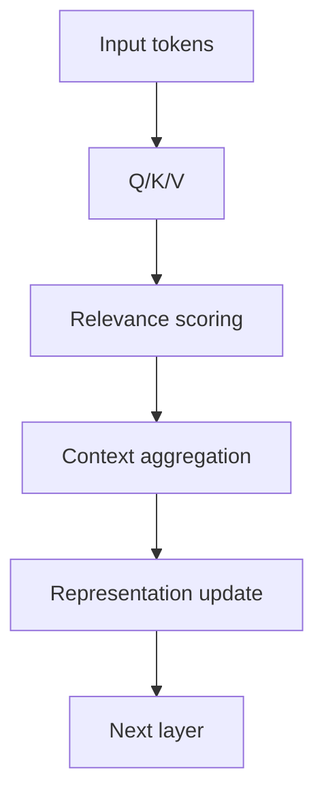

## 1. Executive Summary

An LLM may look as if it reads text directly, but in practice it receives a sequence of tokens and computes probabilities for the next likely token. It is more accurate to think of it as a large probabilistic model that generates continuations matching the context than as a system that directly understands the world like a human. <SourceNote>[Attention Is All You Need](https://arxiv.org/abs/1706.03762) presents Transformer as a sequence model centered on attention, and [Language Models are Few-Shot Learners](https://arxiv.org/abs/2005.14165) pushes large autoregressive models into practical use as context-conditioned generators.</SourceNote>

The easiest way to understand the pipeline is to split it into tokenization, embedding, contextualization with Transformer self-attention, and next-token prediction. The “knowledge” inside an LLM is not stored like a dictionary of explicit facts; it is distributed across learned weights. That said, the model can also memorize passages verbatim. <SourceNote>[Neural Machine Translation with Byte-Level Subwords](https://arxiv.org/abs/1909.03341) covers subword tokenization, and [Attention Is All You Need](https://arxiv.org/abs/1706.03762) combines input embeddings with positional information. Memorization and extractability are shown in [Extracting Training Data from Large Language Models](https://arxiv.org/abs/2012.07805) and [Scalable Extraction of Training Data from (Production) Language Models](https://arxiv.org/abs/2311.17035).</SourceNote>

For practical work, the important question is not whether the model is “smart,” but which inputs, external references, and verification steps you give it. Context length is useful, but it is not a magic fix, and longer inputs do not automatically make a model more reliable. LLM use should therefore be treated as system design: prompt design, retrieval, permissions, auditing, and review all matter. <SourceNote>Long-context models still miss information or over-focus on certain regions, as shown in [Lost in the Middle: How Language Models Use Long Contexts](https://arxiv.org/abs/2307.03172). The standard idea of combining retrieval with generation comes from [Retrieval-Augmented Generation for Knowledge-Intensive NLP Tasks](https://arxiv.org/abs/2005.11401) and [REALM: Retrieval-Augmented Language Model Pre-Training](https://proceedings.mlr.press/v119/guu20a.html).</SourceNote>

## 2. The Big Picture

An LLM does not “understand the whole sentence” in one step. It first splits the input into smaller units, maps them into numeric representations, computes which words should matter to each other in context, and then ranks output candidates. The core idea is not to look up a meaning dictionary, but to produce a probability distribution over continuations. <SourceNote>[Attention Is All You Need](https://arxiv.org/abs/1706.03762) and [Language Models are Few-Shot Learners](https://arxiv.org/abs/2005.14165) describe the autoregressive generation setup that underlies Transformer LLMs.</SourceNote>

The pipeline can be sketched like this.

This diagram is simplified, but it is good enough as a map for a first reading. In real models, the flow includes multiple Transformer blocks, normalization, feed-forward layers, and a learned output head. <SourceNote>[Attention Is All You Need](https://arxiv.org/abs/1706.03762) defines Transformer as a stacked sequence-to-sequence architecture built from attention and feed-forward layers.</SourceNote>

## 3. Tokenization and Embeddings

Tokenization breaks text into units that the model can process more easily. In practice, those units are usually subwords rather than full words or characters, because subwords handle rare words and symbols more robustly. So the model does not memorize raw strings as-is; it learns reusable pieces. <SourceNote>[Neural Machine Translation with Byte-Level Subwords](https://arxiv.org/abs/1909.03341) discusses byte-level subword tokenization, and [Language Models are Few-Shot Learners](https://arxiv.org/abs/2005.14165) assumes token sequences as the basic input format.</SourceNote>

Embeddings map each token into a high-dimensional vector. You can think of that vector as a coordinate in a semantic space, where tokens used in similar ways tend to end up near each other. Because order matters, position information is added as well. Transformer combines token embeddings with positional encoding to process sequences. <SourceNote>[Attention Is All You Need](https://arxiv.org/abs/1706.03762) explicitly includes input embeddings and positional encoding. Embeddings are best understood as distributed representations shaped by co-occurrence and usage, not as dictionary definitions.</SourceNote>

In plain language, the model does not hold “meaning” directly; it holds numbers that capture how text is used. That is why the same word can end up represented differently in different contexts, and why words with similar roles can be close together. <SourceNote>This is a summary of how contextual representations are produced by embeddings plus self-attention in [Attention Is All You Need](https://arxiv.org/abs/1706.03762).</SourceNote>

## 4. Transformer and Self-Attention

The center of Transformer is self-attention. Each token decides which other tokens in the sentence it should pay attention to, and how much. Pronouns, conditions, and references often need to connect to distant words. Transformer computes those links through attention weights rather than through sequential recurrence. <SourceNote>[Attention Is All You Need](https://arxiv.org/abs/1706.03762) showed that sequence transformation can be done with attention alone, without recurrence or convolution.</SourceNote>

Self-attention often uses the terms Q, K, and V. It helps to think of them as the question, the thing being matched against, and the information being collected. Each token compares itself with others, decides which ones matter, and then pulls in the context it needs. Multi-head attention repeats this process in parallel. <SourceNote>Q, K, and V are the implementation roles defined by Transformer self-attention, and [Attention Is All You Need](https://arxiv.org/abs/1706.03762) provides the basic structure.</SourceNote>

Self-attention is powerful because it can pick up the relevant clue wherever it appears in the context. At the same time, the attention weights themselves should not be treated as a full explanation, and the actual basis for a model’s answer still needs separate verification. <SourceNote>The practical lesson from Transformer is that attention helps model context, but output verification must be handled in the surrounding system design.</SourceNote>

## 5. Pretraining and Next-Token Prediction

Most LLMs are built first through pretraining. Pretraining means reading huge amounts of text and code and repeatedly practicing the task of predicting the next token. Instead of manually labeling every example, the model learns from the text itself by turning continuation into a prediction problem. GPT-3 showed that scaling this autoregressive setup produces behavior that generalizes to unseen tasks through context. <SourceNote>[Language Models are Few-Shot Learners](https://arxiv.org/abs/2005.14165) reports that large autoregressive language models exhibit few-shot behavior.</SourceNote>

At this stage, the model absorbs grammar, phrasing, factual fragments, code patterns, article structure, and dialogue flow. But this is closer to building a broad pattern compressor than to building a knowledge base. Pretraining is not magical understanding; it is a way to learn generally useful statistical regularities. <SourceNote>[Language Models are Few-Shot Learners](https://arxiv.org/abs/2005.14165) and [BERT: Pre-training of Deep Bidirectional Transformers for Language Understanding](https://arxiv.org/abs/1810.04805) show how pretraining creates transferable representations.</SourceNote>

After that, extra training is often added for instruction following and safety. Human feedback and principle-based methods are both used in practice. But these methods do not mean the model has ethics built into it; they only shift output behavior. Responsibility, approval, and audit still belong in the system. <SourceNote>[Training language models to follow instructions with human feedback](https://arxiv.org/abs/2203.02155) and [Constitutional AI: Harmlessness from AI Feedback](https://arxiv.org/abs/2212.08073) show the post-pretraining direction.</SourceNote>

## 6. Inference and Context Length

Inference here does not mean human-style deliberation or mathematical proof. At runtime, the learned weights stay fixed, and the model selects one token after another from the prompt and its current context. Different temperatures or sampling rules can produce different outputs from the same input because generation is probabilistic. LLM inference is best understood as reusing learned patterns at runtime. <SourceNote>[Attention Is All You Need](https://arxiv.org/abs/1706.03762) and [Language Models are Few-Shot Learners](https://arxiv.org/abs/2005.14165) both assume autoregressive generation. Here, “inference” refers to machine-learning inference.</SourceNote>

Context length is the maximum number of tokens the model can directly condition on at once. If you give it a long document, it does not see every part with equal strength, and it can lose track of important material as the input gets longer. Long context helps, but it is not a cure-all. <SourceNote>[Lost in the Middle: How Language Models Use Long Contexts](https://arxiv.org/abs/2307.03172) shows that models may underuse information in the middle of long inputs.</SourceNote>

So it is risky to think that choosing the longest-context model will solve everything. In many cases, it is better to summarize the relevant parts, retrieve only the documents that matter, and keep structured data outside the prompt. <SourceNote>The basic retrieval-plus-generation idea comes from [Retrieval-Augmented Generation for Knowledge-Intensive NLP Tasks](https://arxiv.org/abs/2005.11401) and [REALM: Retrieval-Augmented Language Model Pre-Training](https://proceedings.mlr.press/v119/guu20a.html).</SourceNote>

## 7. What “Storing Knowledge” Really Means

Saying that an LLM stores knowledge is partly right and partly misleading. It is right in the sense that facts and patterns are distributed across the learned weights and can help the model respond. It is misleading if you imagine a human-like understanding or a database-style lookup table hidden inside the model. <SourceNote>[Extracting Training Data from Large Language Models](https://arxiv.org/abs/2012.07805) and [Scalable Extraction of Training Data from (Production) Language Models](https://arxiv.org/abs/2311.17035) show that models can sometimes memorize and reveal training data.</SourceNote>

The key point is that “the model remembers something” and “the model can retrieve it correctly” are different claims. It may behave plausibly in one context and fail when conditions change slightly. It may also complete facts correctly from learned regularities even when the exact passage was never memorized. So LLM knowledge should be treated as a mix of memory, generalization, completion, and confusion. <SourceNote>This is the practical synthesis of memorization research and scaling results from [Extracting Training Data from Large Language Models](https://arxiv.org/abs/2012.07805) and [Language Models are Few-Shot Learners](https://arxiv.org/abs/2005.14165).</SourceNote>

That is why production systems should not expect the model alone to be the source of truth. If you need the canonical answer, connect the model to search, SQL, APIs, rule engines, audit logs, and approval flows. LLMs are strong at drafting and summarization, but they are not the final authority for correctness. <SourceNote>The retrieval-augmented design logic in [RAG](https://arxiv.org/abs/2005.11401) and [REALM](https://proceedings.mlr.press/v119/guu20a.html) is the right starting point.</SourceNote>

## 8. Common Questions

### Q1. Does an LLM really “understand”?

Strictly speaking, it is hard to say that it understands in the same sense as a human. The model’s core job is next-token prediction conditioned on context. So even if its behavior looks like understanding, it is too early to equate that behavior with human understanding. <SourceNote>This answer is a practical inference from autoregressive training and memorization research in [Language Models are Few-Shot Learners](https://arxiv.org/abs/2005.14165) and [Extracting Training Data from Large Language Models](https://arxiv.org/abs/2012.07805).</SourceNote>

### Q2. Why does an LLM make mistakes so confidently?

Because it is not trained as a truth-checking engine. It is optimized first to produce the most plausible continuation, so ambiguity, data bias, and weak context can lead to plausible but wrong answers. <SourceNote>[Language Models are Few-Shot Learners](https://arxiv.org/abs/2005.14165) describes the autoregressive setup, and [Training language models to follow instructions with human feedback](https://arxiv.org/abs/2203.02155) explains why extra alignment steps are needed.</SourceNote>

### Q3. Does longer context always improve accuracy?

No. Longer context gives the model more material to work with, but it can also hide important facts or make the middle of the input less useful. In many cases, it is better to extract the essentials and feed only the relevant sources. <SourceNote>[Lost in the Middle: How Language Models Use Long Contexts](https://arxiv.org/abs/2307.03172) shows the position-dependent weakness of long-context use.</SourceNote>

### Q4. Can an LLM replace search?

Not completely. Search is good at finding evidence, while an LLM is good at reorganizing and explaining what it found. The best pattern is to use both, not to force one tool to do both jobs. <SourceNote>RAG and REALM show the basic structure for connecting external evidence to generation [RAG](https://arxiv.org/abs/2005.11401) [REALM](https://proceedings.mlr.press/v119/guu20a.html).</SourceNote>

## 9. How to Use LLMs Safely

In practice, it is better to decide first what the model should see every time than what it should “remember.” Fast-changing information, high-accuracy information, and responsibility-bearing information should be passed in as external data rather than trusted as internal memory. <SourceNote>This follows from the combination of broad generalization and training-data memorization shown in [Language Models are Few-Shot Learners](https://arxiv.org/abs/2005.14165) and [Extracting Training Data from Large Language Models](https://arxiv.org/abs/2012.07805).</SourceNote>

Next, the output should not be used raw. Route it through retrieval, rules, computation, and review. LLMs are strong at explanations, drafts, summaries, and classification, but final correctness should come from other mechanisms. In short, an LLM should be embedded as a component that proposes candidates from context, not as an isolated thinking subject. <SourceNote>The retrieval-augmented generation literature and long-context studies support the view that the model should be connected to stable external facts rather than used alone [RAG](https://arxiv.org/abs/2005.11401) [Lost in the Middle](https://arxiv.org/abs/2307.03172).</SourceNote>

Finally, do not confuse the model’s strengths and weaknesses. Its strengths are handling vague input, turning it into text, and consolidating related information. Its weaknesses are truth guarantees, permanent memory, responsible agency, and self-management over long tasks. If you keep that distinction clear, LLMs become a very useful tool. <SourceNote>This summary integrates autoregressive generation, long-context limits, and memorization research [Attention Is All You Need](https://arxiv.org/abs/1706.03762) [Lost in the Middle](https://arxiv.org/abs/2307.03172) [Scalable Extraction of Training Data from (Production) Language Models](https://arxiv.org/abs/2311.17035).</SourceNote>
