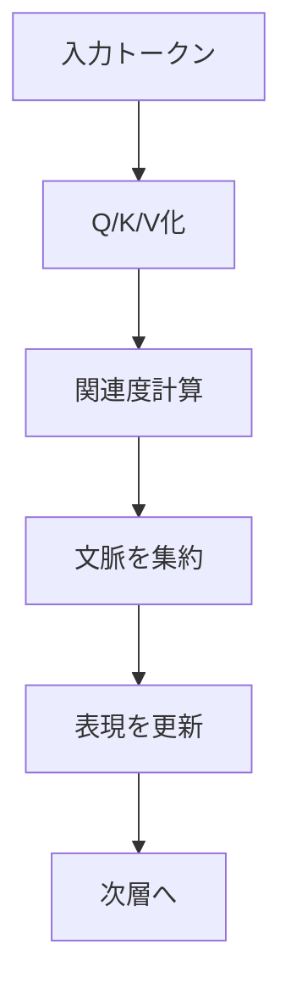

## 1. エグゼクティブサマリー

LLMは、文章をそのまま読んでいるように見えて、実際にはトークン列を受け取り、次に来そうなトークンの確率を計算しているモデルである。人間のように世界を直接理解していると考えるより、「巨大な確率モデルが、文脈に合う続きを生成している」と捉える方が正確である。<SourceNote>[Attention Is All You Need](https://arxiv.org/abs/1706.03762) はTransformerを注意機構中心の系列モデルとして示し、[Language Models are Few-Shot Learners](https://arxiv.org/abs/2005.14165) は大規模自己回帰モデルが文脈に応じて次の出力を作る枠組みを実務に押し上げた。</SourceNote>

理解の順番としては、まずトークン化で文字列を部品に分け、埋め込みで数値ベクトルにし、Transformerの自己注意で文脈上の関係を重み付けし、最後に次トークン予測として出力する、と分けるとよい。LLMの「知識」は辞書のように明示的に保存されるのではなく、学習された重みの中に分布的に埋め込まれる。ただし、その知識はときに文面を丸ごと覚える形でも残る。<SourceNote>[Neural Machine Translation with Byte-Level Subwords](https://arxiv.org/abs/1909.03341) はサブワード型のトークン化を扱い、[Attention Is All You Need](https://arxiv.org/abs/1706.03762) は入力埋め込みと位置情報を組み合わせる。LLMの訓練データの記憶と抽出可能性は [Extracting Training Data from Large Language Models](https://arxiv.org/abs/2012.07805) と [Scalable Extraction of Training Data from (Production) Language Models](https://arxiv.org/abs/2311.17035) が示している。</SourceNote>

実務上の重要点は、LLMを「賢い回答装置」として評価するより、どの入力を与え、どの外部情報を検索し、どの検証手段を通すかで性能を設計することにある。文脈長は万能ではなく、長くすればするほど自動的に賢くなるわけでもない。したがって、LLMの活用は、モデル単体の理解ではなく、入力設計、外部参照、権限、監査、再確認を含むシステム設計として考えるべきである。<SourceNote>長文脈でも情報の取りこぼしや位置依存が残ることは [Lost in the Middle: How Language Models Use Long Contexts](https://arxiv.org/abs/2307.03172) が示している。外部検索を組み合わせる基本発想は [Retrieval-Augmented Generation for Knowledge-Intensive NLP Tasks](https://arxiv.org/abs/2005.11401) と [REALM: Retrieval-Augmented Language Model Pre-Training](https://proceedings.mlr.press/v119/guu20a.html) に沿う。</SourceNote>

## 2. まず全体像をつかむ

LLMは、入力を受けた瞬間に「文全体の意味」を一気に理解するわけではない。実際には、入力を短い単位に切り、順番に数値表現へ変え、文脈の中でどの語がどの語に結びつくかを計算し、出力候補を並べる。ここでの本質は、意味の辞書を引くことではなく、次に続く表現の確率分布を作ることである。<SourceNote>[Attention Is All You Need](https://arxiv.org/abs/1706.03762) と [Language Models are Few-Shot Learners](https://arxiv.org/abs/2005.14165) は、Transformer系LLMが自己回帰的に出力を積み上げる枠組みを明示している。</SourceNote>

この仕組みを一枚で見ると、次の流れになる。

この図は単純化しているが、LLMを理解する最初の地図としては十分である。実際のモデルでは、この流れの中に多層のTransformerブロック、正規化、フィードフォワード層、学習済みの出力ヘッドが入る。<SourceNote>[Attention Is All You Need](https://arxiv.org/abs/1706.03762) は、Transformerを複数層の注意機構とフィードフォワード層で構成する系列変換器として定義している。</SourceNote>

## 3. トークン化と埋め込み

トークン化は、文章をモデルが扱いやすい単位に分割する作業である。文字単位でも単語単位でもなく、実務でよく使われるのはサブワード単位で、見慣れない単語や記号でも分解して扱えるようにする。つまりLLMは、原文をそのまま丸暗記するのではなく、再利用しやすい部品へ分けて学習する。<SourceNote>[Neural Machine Translation with Byte-Level Subwords](https://arxiv.org/abs/1909.03341) は byte-level のサブワード化を扱い、[Language Models are Few-Shot Learners](https://arxiv.org/abs/2005.14165) は大規模言語モデルがトークン列を入力として扱う前提で設計されている。</SourceNote>

埋め込みは、各トークンを数百次元のような高次元ベクトルに写す層である。ここでベクトルは「意味の座標」のようなもので、似た使われ方をするトークンほど近い場所に置かれやすい。加えて、文章は順番が大事なので、位置情報も足される。Transformerは、入力埋め込みと位置エンコーディングを組み合わせて系列を処理する。<SourceNote>[Attention Is All You Need](https://arxiv.org/abs/1706.03762) は入力埋め込みと positional encoding を明示している。埋め込みは辞書的な定義ではなく、学習データ中の共起と使用法を反映した分布的表現として理解するのが適切である。</SourceNote>

埋め込みまでを直感で言い換えると、LLMは「単語の意味」を直接持っているのではなく、「使われ方の近さ」を数字で持っている。だから同じ語でも文脈が変わると表現が変わり、似た働きをする語は近づく。<SourceNote>この説明は、Transformerの埋め込み表現と自己注意が文脈依存表現を作るという設計からの要約である [Attention Is All You Need](https://arxiv.org/abs/1706.03762)。</SourceNote>

## 4. Transformerと自己注意

Transformerの中心は自己注意である。自己注意は、各トークンが文中の他のどのトークンをどの程度参照するかを決める仕組みだと思えばよい。たとえば「彼」「それ」「この条件」のような参照語は、近くの単語だけでなく、離れた場所の名詞や条件文とも結びつく必要がある。その結びつきを、RNNのような逐次処理ではなく、注意の重みとして一度に計算する。<SourceNote>[Attention Is All You Need](https://arxiv.org/abs/1706.03762) は、再帰や畳み込みを使わず attention のみで系列変換を行えることを示した。</SourceNote>

自己注意では、よくQ, K, Vと呼ばれる三つの役割を使う。問いかける側、照合される側、集められた情報だと思うと分かりやすい。各トークンは、他のトークンとの相性を見て重みを決め、必要な文脈を引き寄せる。これを複数の「頭」で同時に行うのが多頭注意である。<SourceNote>Q, K, V の表現は Transformer で定式化された自己注意の実装上の役割であり、[Attention Is All You Need](https://arxiv.org/abs/1706.03762) がその基本構造を与えている。</SourceNote>

自己注意が強いのは、文脈のどこに重要な手掛かりがあるかを柔軟に拾えるからである。一方で、注意の重みをそのまま「説明」とみなすのは危険であり、モデルが何を根拠にしているかは別途検証が必要になる。<SourceNote>Transformerの設計上の強みは文脈関係の学習にあるが、モデルの出力を説明可能性と同一視してはいけないという注意は、注意機構の実装そのものよりも、出力を検証する実務設計から出てくる。</SourceNote>

## 5. 事前学習と次トークン予測

LLMの大半は、まず事前学習で作られる。事前学習とは、大量のテキストやコードを読み込み、次に来るトークンを当てる練習を繰り返すことだと考えてよい。ここでは正解ラベルを人が細かく付けるのではなく、データそのものから「続きを予測する」課題を作る。GPT-3は、この自己回帰的な学習を大規模化すると、未知のタスクでも文脈に応じて振る舞えることを示した。<SourceNote>[Language Models are Few-Shot Learners](https://arxiv.org/abs/2005.14165) は、自己回帰言語モデルを大規模化すると few-shot 性能が現れることを報告している。</SourceNote>

この段階でモデルは、文法、言い回し、事実の断片、コードの定型、文章の構成、会話の流れを広く吸収する。ただし、それは「知識ベースを作る」というより、「次の語を当てるために役立つパターンを広く学ぶ」ことに近い。つまり、事前学習は万能な理解の付与ではなく、汎用性のある圧縮を作る工程である。<SourceNote>[Language Models are Few-Shot Learners](https://arxiv.org/abs/2005.14165) と [BERT: Pre-training of Deep Bidirectional Transformers for Language Understanding](https://arxiv.org/abs/1810.04805) は、事前学習が下流タスクへの汎用化を生む基本構造を示している。</SourceNote>

その後に、指示追従や安全性のための追加学習が入る。たとえば人間のフィードバックを使う方法や、原則に従わせる方法がある。だが、こうした追加学習は「モデルに倫理が宿る」ことを意味しない。出力傾向を調整しているだけであり、実務での責任、承認、監査は別に必要である。<SourceNote>[Training language models to follow instructions with human feedback](https://arxiv.org/abs/2203.02155) と [Constitutional AI: Harmlessness from AI Feedback](https://arxiv.org/abs/2212.08073) は、事前学習のあとに指示追従と安全性を整える方向を示している。</SourceNote>

## 6. 推論と文脈長

ここでいう推論は、数学の証明や人間の熟考と同義ではない。実行時には、学習済みの重みが固定され、与えられたプロンプトと文脈をもとに、次のトークン候補を順に選ぶ。温度やサンプリング方法を変えると、同じ入力からでも違う文が出るのはこのためである。LLMの推論は、学習で得たパターンをその場で再利用する工程だと考えるとよい。<SourceNote>[Attention Is All You Need](https://arxiv.org/abs/1706.03762) と [Language Models are Few-Shot Learners](https://arxiv.org/abs/2005.14165) は、自己回帰的な生成が前提であることを示している。ここでの「推論」は、機械学習の inference を指す。</SourceNote>

文脈長は、モデルが一度に直接見られるトークン数の上限である。長い文書を渡しても、その全部が同じ強さで見えるわけではないし、長くなるほどどこに重要情報があるかを取りこぼすこともある。長文脈は有効だが、万能ではない。<SourceNote>[Lost in the Middle: How Language Models Use Long Contexts](https://arxiv.org/abs/2307.03172) は、長文脈でも中央付近の情報が使われにくい場合があることを示している。</SourceNote>

したがって、「文脈長が長いモデルを選べばすべて解決する」と考えるのは危険である。長い入力を入れる前に、どの情報を要約し、どの情報を外部検索に回し、どの情報を構造化データとして別に持つかを決める方が重要だ。<SourceNote>外部検索と生成を組み合わせる基本発想は [Retrieval-Augmented Generation for Knowledge-Intensive NLP Tasks](https://arxiv.org/abs/2005.11401) と [REALM: Retrieval-Augmented Language Model Pre-Training](https://proceedings.mlr.press/v119/guu20a.html) にある。</SourceNote>

## 7. 「知識を保存している」の正確さと限界

LLMが知識を保存している、という言い方は半分正しく、半分不正確である。正しい部分は、学習を通じて事実やパターンが重みの中に分布的に保持され、応答に役立つことである。不正確な部分は、そこに人間のような意味理解や、データベースのような明示的検索がそのまま入っていると考えることだ。<SourceNote>[Extracting Training Data from Large Language Models](https://arxiv.org/abs/2012.07805) と [Scalable Extraction of Training Data from (Production) Language Models](https://arxiv.org/abs/2311.17035) は、モデルが訓練データを部分的に記憶しうることを示している。</SourceNote>

この点で重要なのは、LLMが「覚えている」ことと「正しく取り出せる」ことは別だということだ。似た文脈ではもっともらしく振る舞えても、少し条件が変わると誤ることがある。逆に、記憶していないはずの情報でも、学習済みの規則性からうまく補完することがある。つまり、LLMの知識は、記憶、一般化、補完、混同が入り混じったものとして扱う必要がある。<SourceNote>記憶と抽出の問題は [Extracting Training Data from Large Language Models](https://arxiv.org/abs/2012.07805) に、一般化とスケールの利点は [Language Models are Few-Shot Learners](https://arxiv.org/abs/2005.14165) に対応する。</SourceNote>

だから実務では、LLM単体に「正しい知識の所在」を期待しない方がよい。正本が必要なら、検索、SQL、API、ルールエンジン、監査ログ、承認フローとつなぐべきである。LLMは文章化と要約に強く、根拠の固定化と最終判断には向かない。<SourceNote>検索拡張の設計思想は [RAG](https://arxiv.org/abs/2005.11401) と [REALM](https://proceedings.mlr.press/v119/guu20a.html) が出発点になる。</SourceNote>

## 8. よくある誤解Q&A

### Q1. LLMは本当に「理解」しているのか

厳密には、人間と同じ意味で理解していると断言するのは難しい。少なくとも、LLMがやっている中心作業は、文脈に応じた次トークン予測である。だから、理解に見える振る舞いは出せても、それをそのまま人間の理解と同一視するのは早い。<SourceNote>この回答は、自己回帰的な学習目標と訓練データ記憶の研究を踏まえた実務的推論である [Language Models are Few-Shot Learners](https://arxiv.org/abs/2005.14165) [Extracting Training Data from Large Language Models](https://arxiv.org/abs/2012.07805)。</SourceNote>

### Q2. なぜLLMは平気で間違うのか

LLMは、真偽を照合する装置として訓練されているわけではない。まずはもっともらしい続きを出すことに最適化されているので、入力の曖昧さ、訓練データの偏り、文脈不足があると、もっともらしい誤りを出しやすい。<SourceNote>[Language Models are Few-Shot Learners](https://arxiv.org/abs/2005.14165) は自己回帰的生成の枠組みを示し、[Training language models to follow instructions with human feedback](https://arxiv.org/abs/2203.02155) は追加学習が必要な理由を説明している。</SourceNote>

### Q3. 文脈長を長くすれば精度は必ず上がるのか

上がるとは限らない。長い文脈は参照できる材料を増やすが、長すぎると重要情報が埋もれたり、中央部の情報が使われにくくなったりする。長く入れるより、要点を抽出し、必要な資料だけを渡す方が強い場合がある。<SourceNote>[Lost in the Middle: How Language Models Use Long Contexts](https://arxiv.org/abs/2307.03172) は、長文脈の位置依存を示している。</SourceNote>

### Q4. LLMは検索エンジンの代わりになるのか

完全な代わりにはならない。検索は根拠を見つけるのが得意で、LLMは見つけた材料を読みやすくまとめるのが得意である。両者を組み合わせると、調査と要約の分業ができる。<SourceNote>RAG と REALM は、外部知識を生成に接続する基本構造を示している [RAG](https://arxiv.org/abs/2005.11401) [REALM](https://proceedings.mlr.press/v119/guu20a.html)。</SourceNote>

## 9. 実務でどう使うか

LLMを実務で使うなら、まず「何を覚えさせるか」より「何を毎回見せるか」を決める方がよい。頻繁に変わる情報、正確さが重要な情報、責任が伴う情報は、モデル内部の記憶に頼らず、外部データとして渡す方がよい。<SourceNote>この方針は、自己回帰モデルの一般化能力と訓練データ記憶の両方を踏まえた設計上の帰結である [Language Models are Few-Shot Learners](https://arxiv.org/abs/2005.14165) [Extracting Training Data from Large Language Models](https://arxiv.org/abs/2012.07805)。</SourceNote>

次に、出力をそのまま採用せず、検索、ルール、計算、レビューを通す。LLMは説明文、候補案、下書き、要約、分類には強いが、最終的な正確性保証は別の仕組みが担うべきである。要するに、LLMは「考える主体」ではなく、「文脈を受けて候補を出す部品」として組み込むのがよい。<SourceNote>検索拡張生成と長文脈研究は、LLMを単体で使うより、外部の確定情報を接続する方が実務的であることを示している [RAG](https://arxiv.org/abs/2005.11401) [Lost in the Middle](https://arxiv.org/abs/2307.03172)。</SourceNote>

最後に、LLMの強みと弱みを混同しないことが大事である。強みは、あいまいな入力を扱い、文章の形にして返し、関連情報をまとめることにある。弱みは、真偽保証、恒久記憶、責任主体性、長い作業の自己管理にある。ここを取り違えなければ、LLMはかなり有用な道具になる。<SourceNote>このまとめは、Transformerの自己回帰生成、長文脈の限界、訓練データ記憶の研究を統合した実務的整理である [Attention Is All You Need](https://arxiv.org/abs/1706.03762) [Lost in the Middle](https://arxiv.org/abs/2307.03172) [Scalable Extraction of Training Data from (Production) Language Models](https://arxiv.org/abs/2311.17035)。</SourceNote>
