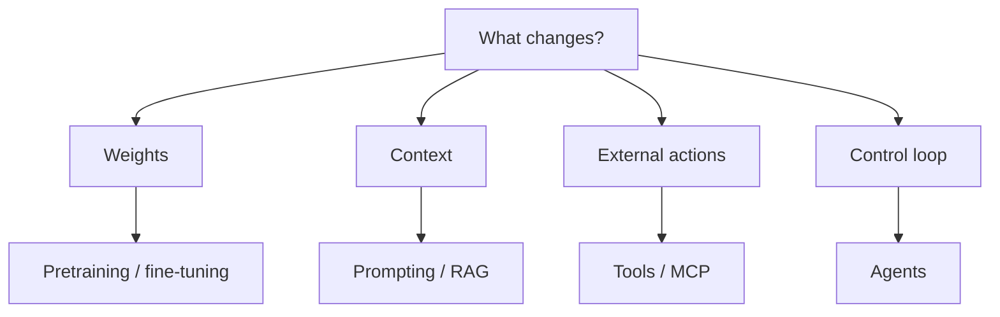
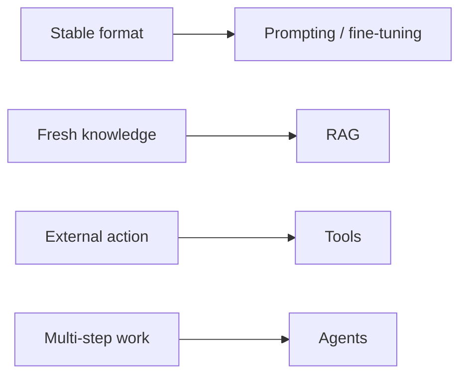

# How LLM Training, Fine-Tuning, RAG, and Agents Differ

## 1. Executive Summary

The most common mistake in LLM discussions is to treat pretraining, fine-tuning, prompting, RAG, tool use, and agents as if they were all the same kind of improvement. In reality, pretraining and fine-tuning change model weights, prompting and RAG change runtime context, tool use expands what the model can do in the outside world, and agents add a control loop that can plan, act, and verify across multiple steps. <SourceNote>[OpenAI fine-tuning guide](https://platform.openai.com/docs/guides/fine-tuning), [OpenAI function calling guide](https://platform.openai.com/docs/guides/function-calling), [Building effective agents](https://www.anthropic.com/engineering/building-effective-agents), and [MCP specification](https://modelcontextprotocol.io/specification/2025-03-26) support this framing.</SourceNote>

In practice, the fastest way to choose is to ask what you are trying to change. If you want stable wording or format, start with prompting and then consider fine-tuning. If you want answers grounded in current company documents or frequently changing facts, use RAG. If the system must read from or write to external systems, add tools. If the job requires several steps, retries, or branching decisions, use an agent. MCP sits in the integration layer, not the learning layer, so it helps standardize tool and data connections rather than alter model behavior. <SourceNote>[Effective context engineering for AI agents](https://www.anthropic.com/engineering/effective-context-engineering-for-ai-agents) and [MCP specification](https://modelcontextprotocol.io/specification/2025-03-26) both point to runtime system design rather than model training as the relevant layer here.</SourceNote>

Three rules cover most decisions.

1. Techniques that change weights are broad but expensive and slow to update.
2. Techniques that change runtime context are cheaper and faster, but depend heavily on input quality and retrieval quality.
3. Techniques that add external actions can automate real work, but they require permissions, logging, and blast-radius control.

This diagram separates the options by layer. Once you touch weights, you usually need retraining to change behavior again. Once you rely on runtime context, you can change behavior immediately, but the change is only as strong as the input you provide. Once you add tools and agents, the design problem shifts from intelligence alone to safe execution.

## 2. The Layers

Pretraining builds broad generalization on top of a massive corpus. Fine-tuning adds task-specific examples, style rules, labels, or policy constraints on top of that base. Prompting is the instruction you give at runtime without changing the model. RAG retrieves external documents and injects them into context so the model can answer with fresher or domain-specific information. Tool use lets the model call calculators, search systems, databases, and business APIs. Agents wrap those capabilities in a plan-act-check loop. <SourceNote>[RAG paper](https://arxiv.org/abs/2005.11401), [OpenAI fine-tuning guide](https://platform.openai.com/docs/guides/fine-tuning), [OpenAI function calling guide](https://platform.openai.com/docs/guides/function-calling), and [Building effective agents](https://www.anthropic.com/engineering/building-effective-agents) are the main references behind this distinction.</SourceNote>

The practical comparison looks like this.

| Technique | What it changes | Update frequency | Cost level | Best for | Main risk |
| --- | --- | --- | --- | --- | --- |
| Pretraining | Model weights | Low | Very high | Broad capability building | Data, compute, and time are all heavy |
| Fine-tuning | Model weights | Medium | High | Format, classification, tone, policy | Weak for new facts |
| Prompting | Runtime context | Very high | Low | Fast instruction shaping | Brittle when long or complex |
| RAG | Retrieved context | High | Medium | Fresh documents and grounded answers | Retrieval quality and document quality matter |
| Tool use | External actions | High | Medium to high | Calculation, lookup, writes, execution | Permissions and failure handling matter |
| Agents | Control loop | High | Medium to high | Multi-step work with retries and branching | Error chains and runaway behavior |

This is a structural comparison, not a vendor price sheet. Real costs vary by model, token volume, document volume, execution count, and compliance requirements. Even so, the ordering is usually stable: changing weights is the most expensive route, and changing context or actions is usually the cheapest way to iterate.

## 3. How to Choose

The first question is whether the problem is really about knowledge or about procedure. If the problem is knowledge, RAG is the strongest default when the source material changes often or when you need citations. If the problem is procedure, start with prompting; if the same failure keeps recurring, consider fine-tuning. <SourceNote>[OpenAI fine-tuning guide](https://platform.openai.com/docs/guides/fine-tuning) and [RAG paper](https://arxiv.org/abs/2005.11401) fit neatly into this division of labor.</SourceNote>

The second question is whether the system must merely read external systems or also write to them. Read-only use cases often stop at search, database lookup, or file retrieval. Write access demands approval, diff review, rollback, and logging. That is where the difference between tool use and agents becomes important. A single API call is a tool use case. A sequence that can replan, retry, and verify is an agent use case. <SourceNote>[OpenAI function calling guide](https://platform.openai.com/docs/guides/function-calling) and [Building effective agents](https://www.anthropic.com/engineering/building-effective-agents) are useful for understanding this boundary.</SourceNote>

The rule of thumb is simple.

1. If you only need better wording or structure, start with prompting.
2. If you need the same behavior at scale, consider fine-tuning.
3. If you need current facts or internal documents, use RAG.
4. If you need external calculation, lookup, or writeback, add tools.
5. If the work involves multiple steps and possible retries, use an agent.
6. If the number of connectors keeps growing, use MCP to normalize the interface.

This ordering is an inference from public information, not an official universal roadmap. In real systems, the common pattern is to combine them: prompt plus RAG, fine-tuning plus RAG, or tools plus agents.

## 4. MCP and External Tooling

MCP is a protocol for connecting context, tools, and resources to LLM applications in a standardized way. The key point is that MCP does not add knowledge to the model. It standardizes how connections are exposed. In practice, that makes it easier to plug documents, APIs, developer tools, and operations tools into different clients without rebuilding every integration from scratch. <SourceNote>[MCP specification](https://modelcontextprotocol.io/specification/2025-03-26) defines MCP as an open standard for connecting context, tools, and resources to LLM apps.</SourceNote>

So MCP is not a substitute for RAG or tool use. It is closer to a wiring layer that helps those capabilities travel across assistants and environments. Once you reach this layer, authorization, logging, and reversibility matter more than the model name.

## 5. Risks and Limits

First, RAG does not guarantee correctness. If the retrieved document is wrong, the answer can still be wrong. If the right document is not retrieved, the answer can still miss the mark. RAG makes grounded answers easier, but it does not automatically produce truth. <SourceNote>[RAG paper](https://arxiv.org/abs/2005.11401) and [Effective context engineering for AI agents](https://www.anthropic.com/engineering/effective-context-engineering-for-ai-agents) both make retrieval quality and context design a prerequisite.</SourceNote>

Second, fine-tuning is not a substitute for freshness. If facts change often, retraining is a slow way to keep up. It is usually better to keep changing facts outside the model and use the model for stable behavior.

Third, the more useful tools and agents become, the larger the blast radius of mistakes. A wrong write operation, overuse of an API, a permission leak, prompt injection, or an unexpected retry can do more harm than a plain wrong answer. That is why the NIST AI RMF treats AI risk management as an ongoing Govern / Map / Measure / Manage process. <SourceNote>[NIST AI RMF](https://www.nist.gov/itl/ai-risk-management-framework) frames AI risk management as a continuous process rather than a one-time checklist.</SourceNote>

Fourth, agents are not the answer to everything. Predictable jobs often belong in workflows, and only the exploratory or retry-heavy parts belong in an agent loop. That is a design choice aimed at lowering failure rates, not a style preference. <SourceNote>[Building effective agents](https://www.anthropic.com/engineering/building-effective-agents) distinguishes workflows for predictable tasks from agents for tasks that require flexible exploration.</SourceNote>

## 6. Recommended Sequence

The least risky rollout path, inferred from public information, is this:

1. Try prompting first.
2. Add RAG when external knowledge matters.
3. Consider fine-tuning when a format or classification pattern repeats at scale.
4. Add tools when the system has to affect the outside world.
5. Move to agents when multi-step automation becomes necessary.
6. Standardize the connectors with MCP once integrations start to proliferate.

The value of this sequence is that it avoids jumping straight to expensive retraining or high-risk autonomy. Fine-tuning and agents are not goals in themselves. They are tools you use only when the quality target, update frequency, audit needs, and operational permissions justify them.

## 7. References

- [OpenAI fine-tuning guide](https://platform.openai.com/docs/guides/fine-tuning)
- [OpenAI function calling guide](https://platform.openai.com/docs/guides/function-calling)
- [Building effective agents](https://www.anthropic.com/engineering/building-effective-agents)
- [Effective context engineering for AI agents](https://www.anthropic.com/engineering/effective-context-engineering-for-ai-agents)
- [MCP specification](https://modelcontextprotocol.io/specification/2025-03-26)
- [Retrieval-Augmented Generation paper](https://arxiv.org/abs/2005.11401)
- [NIST AI RMF](https://www.nist.gov/itl/ai-risk-management-framework)
