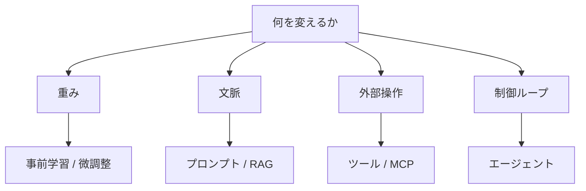
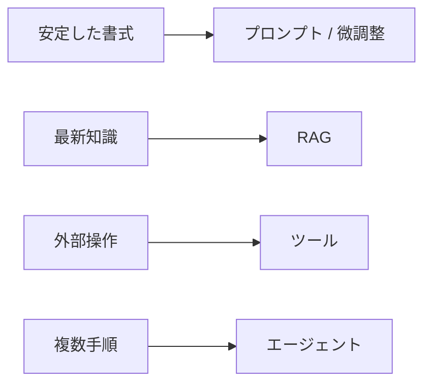

# LLMの学習・微調整・RAG・エージェントの使い分け

## 1. エグゼクティブサマリー

LLMの議論で最も混同されやすいのは、事前学習、ファインチューニング、プロンプト、RAG、ツール利用、エージェントを同じ種類の「改善策」と見なすことである。実際には、事前学習とファインチューニングはモデルの重みを変え、プロンプトとRAGは実行時の文脈を変え、ツール利用は外部操作を増やし、エージェントはそれらを複数手順で回す制御ループを加える。<SourceNote>[OpenAI fine-tuning guide](https://platform.openai.com/docs/guides/fine-tuning), [OpenAI function calling guide](https://platform.openai.com/docs/guides/function-calling), [Building effective agents](https://www.anthropic.com/engineering/building-effective-agents), [MCP specification](https://modelcontextprotocol.io/specification/2025-03-26) に基づく整理である。</SourceNote>

実務の判断は、まず「何を変えたいか」を分けると速い。出力の書式や口調を安定させたいなら、まずプロンプトを試し、必要ならファインチューニングを検討する。社内文書や最新情報を根拠付きで返したいならRAGが向く。外部システムに書き込みたいならツール利用が必要になる。複数ステップを自律的に進めたいならエージェントが候補になる。MCPはこのうち学習方法ではなく、外部ツールやデータ接続を標準化するための層に位置する。<SourceNote>[Effective context engineering for AI agents](https://www.anthropic.com/engineering/effective-context-engineering-for-ai-agents) と [MCP specification](https://modelcontextprotocol.io/specification/2025-03-26) を踏まえると、プロンプトと接続の設計は実行時システムの一部として扱うのが妥当である。</SourceNote>

要点は三つである。

1. 重みを変える技術は、広く効くが高コストで、更新が遅い。
2. 文脈を変える技術は、安くて速いが、入力品質と検索品質に強く依存する。
3. 外部操作を増やす技術は、業務を自動化できる一方、権限、監査、失敗時の損害管理が必要になる。

この図は、各技術を「どのレイヤーを触るか」で分けている。重みを触ると振る舞いの傾向は変わるが、再学習が要る。文脈を触ると即時に挙動を変えられるが、長期的な固定化は弱い。ツールとエージェントはモデルの賢さよりも、どこまで安全に実行させるかが設計の中心になる。

## 2. レイヤーの切り分け

事前学習は、巨大なコーパスで広い一般化能力を作る工程である。ファインチューニングは、その土台に対して、特定のタスク、書式、分類基準、用語集、応答方針を追加学習する工程である。プロンプトは、学習済みモデルに与える実行時指示であり、モデル自体は変えない。RAGは、検索で外部文書を拾って文脈に差し込む設計であり、知識の置き場をモデル内部から外部へずらす。ツール利用は、計算機、検索、DB、業務APIなどを呼べるようにする。エージェントは、それらを計画・実行・検証のループにまとめる。<SourceNote>[RAG paper](https://arxiv.org/abs/2005.11401), [OpenAI fine-tuning guide](https://platform.openai.com/docs/guides/fine-tuning), [OpenAI function calling guide](https://platform.openai.com/docs/guides/function-calling), [Building effective agents](https://www.anthropic.com/engineering/building-effective-agents) を参照した。</SourceNote>

比較すると、こうなる。

| 技術 | 何を変えるか | 更新頻度 | コスト感 | 得意な用途 | 主な注意点 |
| --- | --- | --- | --- | --- | --- |
| 事前学習 | モデルの重み | 低い | 非常に高い | 汎用能力の獲得 | データ、計算資源、期間が重い |
| ファインチューニング | モデルの重み | 中 | 高い | 書式、分類、口調、業務ルールの固定 | 新しい事実の追随には弱い |
| プロンプト | 実行時文脈 | 非常に高い | 低い | すぐ試したい指示調整 | 長く複雑になると壊れやすい |
| RAG | 検索結果と実行時文脈 | 高い | 中 | 最新文書、社内ナレッジ、根拠提示 | 検索精度と文書品質に依存 |
| ツール利用 | 外部操作 | 高い | 中〜高 | 計算、照会、書き込み、実行 | 権限と失敗時の被害管理が必要 |
| エージェント | 制御ループ | 高い | 中〜高 | 複数手順、再試行、探索 | 誤りの連鎖と暴走を抑える設計が要る |

この表は厳密な市場価格表ではなく、構造比較である。実際の費用はベンダー、モデル、トークン量、文書量、実行回数、監査要件で大きく変わる。ただし、重みを変えるほど高コストで、文脈と操作を変えるほど低コストかつ即時に試せる、という序列はほぼ崩れない。

## 3. 使い分けの判断基準

まず確認すべきなのは、その問題が「知識の問題」か「手順の問題」かである。知識の問題ならRAGが有力で、特に更新頻度が高い社内文書や、根拠を提示したい回答に向く。手順の問題なら、まずプロンプトで十分かを見て、繰り返し同じ失敗をするならファインチューニングを検討する。<SourceNote>[OpenAI fine-tuning guide](https://platform.openai.com/docs/guides/fine-tuning) と [RAG paper](https://arxiv.org/abs/2005.11401) の役割分担を踏まえた判断である。</SourceNote>

次に確認するのは、外部システムを「読むだけ」か「書き込む」かである。読むだけなら検索、DB照会、ファイル参照で足りることが多い。書き込むなら、承認、差分確認、ロールバック、監査ログが必要になる。ここでツール利用とエージェントの差が出る。単発のAPI呼び出しならツール利用で足りる。再計画、再試行、検証が必要ならエージェントの用途である。<SourceNote>[OpenAI function calling guide](https://platform.openai.com/docs/guides/function-calling) と [Building effective agents](https://www.anthropic.com/engineering/building-effective-agents) は、この境界を理解するのに有用である。</SourceNote>

判断の目安は次の通りである。

1. 出力の書式を変えたいだけなら、まずプロンプト。
2. 同じ出力形式を大量に安定供給したいなら、ファインチューニング。
3. 最新情報や社内文書を答えに混ぜたいなら、RAG。
4. 外部計算、検索、更新、送信が必要なら、ツール利用。
5. 途中で計画変更や再試行が必要なら、エージェント。
6. 接続先が増えて運用が辛いなら、MCPでインターフェースを揃える。

この順番は公表情報からの推定である。実際には、プロンプト + RAG、ファインチューニング + RAG、ツール + エージェントのような組み合わせが多い。単独で完結する技術は少なく、たいていはレイヤーの重ね合わせになる。

## 4. MCP と外部ツール連携

MCPは、LLMが使う外部ツールやデータ接続を、個別実装ではなく共通プロトコルで扱うための仕組みである。ここで重要なのは、MCPがモデルの知識を増やすわけではない点である。MCPが変えるのは接続の標準化であり、実務上は「どのLLMクライアントでも同じ種類の文脈・ツールを接続しやすくする」ことに価値がある。<SourceNote>[MCP specification](https://modelcontextprotocol.io/specification/2025-03-26) は、MCP を context, tools, resources を LLM アプリに接続するためのオープン標準として定義している。</SourceNote>

その意味で、MCPはRAGやツール利用の上位互換ではない。むしろ、RAG用の文書ソース、社内API、開発ツール、運用ツールを、同じ接続方式で提供するための配線層に近い。モデルの選択よりも、権限、認証、ログ、取り消し可能性をどう設計するかが重要になる。

## 5. リスク・限界

第一に、RAGは正しさを保証しない。検索で拾う文書が誤っていれば、回答も誤る。逆に、文書が正しくても、検索で拾えなければ使えない。したがって、RAGは「根拠付き回答を作りやすくする」技術であって、「真実を自動保証する」技術ではない。<SourceNote>[RAG paper](https://arxiv.org/abs/2005.11401) と [Effective context engineering for AI agents](https://www.anthropic.com/engineering/effective-context-engineering-for-ai-agents) によると、検索品質と文脈設計が性能の前提になる。</SourceNote>

第二に、ファインチューニングは最新性の代替ではない。頻繁に変わる事実を埋め込む用途では、再学習の遅さがそのまま欠点になる。更新頻度が高い知識は外部に置き、モデルは振る舞いの安定化に使う方がよい。

第三に、ツール利用とエージェントは、便利になるほど損害半径も広がる。誤った書き込み、過剰なAPI利用、権限漏れ、プロンプト注入、想定外の再試行は、モデル単体の誤答よりも被害が大きい。NISTのAI RMFのように、評価、監視、是正を継続プロセスとして回す前提が要る。<SourceNote>[NIST AI RMF](https://www.nist.gov/itl/ai-risk-management-framework) は、AIリスク管理を継続的な Govern / Map / Measure / Manage の活動として扱っている。</SourceNote>

第四に、エージェントは万能ではない。予測可能な仕事はworkflowで十分なことが多く、探索や再試行が本当に必要な部分だけをagentに任せる方が安定する。これは設計上の好みではなく、失敗率を下げるための分業である。<SourceNote>[Building effective agents](https://www.anthropic.com/engineering/building-effective-agents) は、予測可能なタスクには workflow、柔軟な探索が必要なタスクには agent が向くと整理している。</SourceNote>

## 6. 推奨方針

公表情報からの推定として、実務では次の順で導入するのが最も無理が少ない。

1. まずプロンプトで試す。
2. 次にRAGで外部知識を足す。
3. 反復する書式や分類があるならファインチューニングを検討する。
4. システムが外部世界に作用するならツールを追加する。
5. 複数手順の自動化が必要になった時点でエージェント化する。
6. 接続先が増えたらMCPで配線を標準化する。

この順序の利点は、最初から高コストな再学習や高リスクな自律化に飛ばずに済むことだ。逆に言えば、ファインチューニングやエージェントは「使うこと自体」が目的ではない。必要な品質、更新頻度、監査要件、運用権限に照らして、最も安いレイヤーから積み上げるのが合理的である。

## 7. 参考情報

- [OpenAI fine-tuning guide](https://platform.openai.com/docs/guides/fine-tuning)
- [OpenAI function calling guide](https://platform.openai.com/docs/guides/function-calling)
- [Building effective agents](https://www.anthropic.com/engineering/building-effective-agents)
- [Effective context engineering for AI agents](https://www.anthropic.com/engineering/effective-context-engineering-for-ai-agents)
- [MCP specification](https://modelcontextprotocol.io/specification/2025-03-26)
- [Retrieval-Augmented Generation paper](https://arxiv.org/abs/2005.11401)
- [NIST AI RMF](https://www.nist.gov/itl/ai-risk-management-framework)
