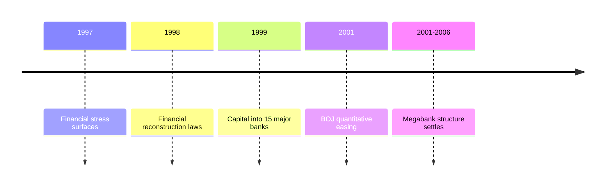

## 1. Executive Summary

Japan's megabank consolidation was the result of overlapping pressures: post-bubble non-performing loans, the 1997-1998 financial crisis, redesign of financial supervision, public capital injections, and stricter accounting and inspection rules. The three current megabank groups were not just voluntary large mergers. They were formed while the authorities tried to stabilize the financial system and force a banking sector with too many weakly capitalized institutions into a more durable structure. <SourceNote>The FSA says Japan's financial system was severely shaken in 1997-1998, and that the Financial Reconstruction Law and the Financial Function Early Strengthening Law were enacted in October 1998 to deal with failed institutions and authorize public fund injections into banks. See [FSA, Japan's Financial Sector Reform: Progress and Challenges](https://www.fsa.go.jp/en/announce/state/p20010903.html).</SourceNote>

The claim that "the BOJ bought government bonds at that time" touches part of the truth but can easily compress separate causal chains. The BOJ introduced a quantitative easing framework in March 2001 that allowed it to increase outright purchases of long-term JGBs. The main bank rescue mechanism, however, was a public funding framework centered on the Deposit Insurance Corporation and fiscal measures by the government. It is not accurate to describe the bank rescue as direct BOJ underwriting of government bonds. Article 5 of the Fiscal Act prohibits the BOJ from underwriting public bonds except within an amount approved by the Diet for special reasons. <SourceNote>In March 2001, the BOJ said it would increase outright purchases of long-term government bonds if necessary to provide liquidity while setting a ceiling at the outstanding amount of banknotes issued. See [Bank of Japan, New Steps for Monetary Easing](https://www.boj.or.jp/en/mopo/mpmdeci/mpr_2001/k010319b.htm) and [Minutes of the Monetary Policy Meeting on March 19, 2001](https://www.boj.or.jp/en/mopo/mpmsche_minu/minu_2001/g010319.htm). For Article 5 of the Fiscal Act, see [Ministry of Finance, Relevant Laws](https://www.mof.go.jp/policy/exchequer/reference/laws/law.htm).</SourceNote>

As of the BOJ accounts for May 20, 2026, the Bank held 531.8 trillion yen of JGBs. The Ministry of Finance's March 2026 data put domestic government bonds at 1,207.2 trillion yen and total government bonds and borrowings at 1,343.8 trillion yen. The dates do not perfectly match, but the BOJ's holdings were roughly 44 percent of domestic government bonds and about 40 percent of the broader bonds-and-borrowings total. <SourceNote>The BOJ figure is 531,835,781,598 thousand yen of Japanese government bonds in [Bank of Japan, Bank of Japan Accounts (May 20, 2026)](https://www.boj.or.jp/en/statistics/boj/other/acmai/release/2026/ac260520.htm). The government debt figures use domestic government bonds of 12,072,188 hundred million yen and a total of 13,438,426 hundred million yen from [Ministry of Finance, Outstanding Government Bonds and Borrowings as of March 2026](https://www.mof.go.jp/jgbs/reference/gbb/202603.html), with author calculations.</SourceNote>

It does not follow that all fiscal-risk arguments about Japan are baseless because the BOJ holds a large amount of JGBs. It is also too crude to treat BOJ-held JGBs as if they created exactly the same rollover risk as debt held by private investors. The issue is not whether the debt simply disappears. The issue is how it interacts with interest rates, inflation, interest paid on BOJ current accounts, JGB market liquidity, exchange rates, and future fiscal space.

## 2. What happened: from banking crisis to three major groups

Japan's banking problem in the 1990s began when falling land and equity prices weakened collateral values and expanded non-performing corporate loans. This was not a simple business-cycle problem. Major banks carried structural weaknesses: lending to affiliated groups and large firms, cross-shareholdings, regulation by sector and geography, low-return branch networks, and incentives to postpone loss recognition.

The crisis forced institutional reform. In 1998, the Financial Supervisory Agency inspected 19 major banks in cooperation with the BOJ. The Long-Term Credit Bank of Japan and Nippon Credit Bank were nationalized that year. In March 1999, 7.5 trillion yen of public capital was injected into 15 major banks. <SourceNote>The FSA says the concentrated inspections of 19 major banks began in July 1998, LTCB and Nippon Credit Bank were nationalized in 1998, and 7.5 trillion yen was injected into 15 major banks in March 1999. See [FSA, On the Establishment of the Financial Services Agency](https://www.fsa.go.jp/en/announce/state/p20000913.html).</SourceNote>

Banks then had to thicken capital, dispose of bad loans, and secure enough scale to support system investment and international operations. Mizuho created a holding company in 2000 from Dai-Ichi Kangyo Bank, Fuji Bank, and the Industrial Bank of Japan, then reorganized banking operations in 2002. Sumitomo Mitsui Banking Corporation was formed by the 2001 merger of Sumitomo Bank and Sakura Bank. Mitsubishi UFJ took shape through the 2005 merger of Mitsubishi Tokyo Financial Group and UFJ Group, followed by the 2006 merger of their core banking units. <SourceNote>For the group histories, see [Mizuho Financial Group, Our History](https://www.mizuhogroup.com/who-we-are/company-information/history), [SMBC Group, The 20-Year History of SMBC Group](https://www.smfg.co.jp/english/chronicle20/company/smbc.html), and [MUFG EMEA, Introducing MUFG Bank](https://www.mufgemea.com/mufg-bank/).</SourceNote>

## 3. How public capital was funded

The rescue framework separated depositor protection, failed-institution resolution, and recapitalization of viable banks. According to the FSA, the authorities set aside a financial reconstruction account of 18 trillion yen, a special operations account of 17 trillion yen, and an early-strengthening account of 25 trillion yen, for a total stabilization framework of 60 trillion yen, later expanded to 70 trillion yen. This was not a single line in which "banks were saved because the BOJ bought JGBs from them." It was a fiscal and supervisory program involving the government, the Deposit Insurance Corporation, the Financial Reconstruction Commission, and the FSA. <SourceNote>The stabilization framework is described in [FSA, On the Establishment of the Financial Services Agency](https://www.fsa.go.jp/en/announce/state/p20000913.html), including the 18 trillion yen, 17 trillion yen, and 25 trillion yen accounts.</SourceNote>

This period is easy to misread because JGBs, government guarantees, and the BOJ appear in the same historical frame. Public capital injections involved government guarantees, funding by the Deposit Insurance Corporation, and fiscal measures. The BOJ also supplied liquidity and cooperated in inspections to stabilize the financial system. But outright JGB purchases as open market operations are monetary-policy operations in which the BOJ buys bonds from the market to supply funds. They are institutionally distinct from direct underwriting of government debt to finance fiscal deficits. <SourceNote>The BOJ describes outright purchases of JGBs as open market operations that supply funds to financial markets, and states that they are conducted for monetary policy, not to finance fiscal deficits. See [Bank of Japan, What are outright purchases of Japanese government bonds?](https://www.boj.or.jp/en/about/education/oshiete/seisaku/b35.htm).</SourceNote>

The accurate conclusion is that JGBs, public funds, and the BOJ all mattered during the bank-restructuring era. But saying that "the BOJ bought JGBs to rescue the megabanks" merges two different policies. Bank rescue was a fiscal and supervisory program for financial-system stabilization. The expansion of BOJ JGB purchases was monetary easing under deflation. They responded to the same crisis environment, but they were not the same transaction.

## 4. How many JGBs does the BOJ hold now?

The BOJ's May 20, 2026 accounts show 531.8 trillion yen of Japanese government securities on the asset side. The breakdown is 531.8 trillion yen of Japanese government bonds and zero treasury discount bills. The same statement shows total BOJ assets of 663.1 trillion yen and current deposits of 450.3 trillion yen. <SourceNote>[Bank of Japan, Bank of Japan Accounts (May 20, 2026)](https://www.boj.or.jp/en/statistics/boj/other/acmai/release/2026/ac260520.htm) reports Japanese government bonds of 531,835,781,598 thousand yen, total assets of 663,079,210,885 thousand yen, and current deposits of 450,283,783,604 thousand yen.</SourceNote>

The Ministry of Finance's March 2026 data show 1,207.2 trillion yen of domestic government bonds, 1,104.3 trillion yen of general bonds, and 1,343.8 trillion yen of total government bonds and borrowings. The BOJ data are as of May 20, while the MOF data are as of end-March, so this is not a precise same-day comparison. Still, it is enough for scale: the BOJ's 531.8 trillion yen of JGB holdings are roughly 44 percent of domestic government bonds and roughly 40 percent of total government bonds and borrowings.

| Metric                                | Date           |               Amount | How to read it                                                  |
| ------------------------------------- | -------------- | -------------------: | --------------------------------------------------------------- |
| BOJ JGB holdings                      | May 20, 2026   |   531.8 trillion yen | Long-term JGBs on the BOJ asset side                            |
| Domestic government bonds             | End-March 2026 | 1,207.2 trillion yen | Domestic bonds including general bonds and FILP bonds           |
| Government bonds and borrowings total | End-March 2026 | 1,343.8 trillion yen | Broader debt statistic including borrowings and financing bills |
| BOJ holdings / domestic bonds         | Approx.        |                44.1% | Approximation with date mismatch                                |
| BOJ holdings / total                  | Approx.        |                39.6% | Approximation with date mismatch                                |

That scale is large. It means BOJ-held debt should not be analyzed as if every bond were held by private investors. It also does not mean the debt can be consolidated away with no remaining economic constraint.

## 5. Does fiscal risk disappear when the BOJ holds the bonds?

When a central bank holds government bonds, part of the interest paid by the government becomes BOJ income and can eventually flow back to the government through remittances. In that sense, the fiscal burden looks different from JGBs held by private investors. During the low-rate, low-inflation period, this structure helped contain the visible interest burden.

The analysis breaks down if we forget that BOJ assets are matched by BOJ liabilities, especially current account balances held by financial institutions. If the BOJ pays interest on those balances and policy rates rise, the BOJ's interest expenses also rise. A central bank that holds a large amount of low-yielding long-term bonds can see its income compressed during a rising-rate phase. This does not imply immediate sovereign insolvency, but it can reduce remittances to the treasury, create political pressure around BOJ finances, and generate confusion about monetary-policy operations.

The second constraint is JGB market functioning. A large BOJ presence can push yields down and stabilize government funding. It can also reduce private free float and weaken price discovery and liquidity. The BOJ's own broad review and the IMF's 2026 Japan consultation both treat balance-sheet reduction, JGB market functioning, fiscal risk, and rising interest costs as real policy issues. <SourceNote>The IMF's 2026 Article IV mission statement says BOJ balance-sheet reduction is progressing, but also points to the BOJ's outsized participation in the JGB market, rising interest payments as debt rolls over at higher yields, and the need to monitor JGB market liquidity. See [IMF, Japan: 2026 Article IV Mission Concluding Statement](https://www.imf.org/en/news/articles/2026/02/13/imf-cs-02172026-japan-staff-concluding-statement-of-the-2026-article-iv-mission).</SourceNote>

The practical assessment has three layers.

| Claim                                                            | Assessment                                                                                                                                              |
| ---------------------------------------------------------------- | ------------------------------------------------------------------------------------------------------------------------------------------------------- |
| BOJ-held JGBs make the debt disappear completely                 | Incorrect. Interest flows inside the consolidated public sector change, but inflation, interest-rate, currency, and market-function constraints remain. |
| BOJ-held JGBs carry exactly the same risk as privately held JGBs | Too crude. The BOJ is the currency issuer, so rollover liquidity constraints differ from debt held by private investors.                                |
| All fiscal-risk arguments about Japan are baseless               | Incorrect. Alarmist default narratives are weak, but interest costs, demographics, growth, taxes, and JGB market functioning are real issues.           |

## 6. Reading bank earnings and rate risk

The key is to separate two questions.

First, what was the bank consolidation of the late 1990s and early 2000s? It was a process of disposing of post-bubble bad loans, redesigning financial administration, filling capital shortfalls with public funds, and consolidating banks into larger groups so that the financial system could keep functioning.

Second, how does BOJ JGB ownership change the interpretation of Japan's economy? It changes the form of debt risk, but it does not erase fiscal, price, and market constraints. A larger BOJ holding reduces short-term pressure from private absorption. As rate normalization proceeds, however, government interest payments, interest on BOJ current accounts, BOJ income, JGB market liquidity, and exchange-rate reactions move together.

Any strong claim about Japan should track at least four numbers: BOJ JGB holdings, total government debt, the gap between nominal growth and the effective interest rate, and JGB market liquidity. Arguments that use only one of those numbers to conclude either "no problem" or "imminent crisis" do not fit the history or the institutional structure.
