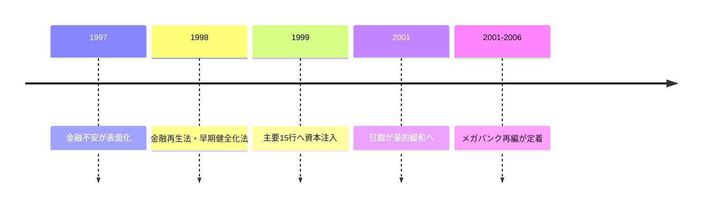

## 1. エグゼクティブサマリー

日本のメガバンク再編は、バブル崩壊後の不良債権、1997-1998年の金融危機、金融行政の再設計、公的資金注入、会計・検査ルールの厳格化が重なって起きた。現在の三大メガバンクは、単なる自主的な大型合併ではなく、金融システムを安定させながら過剰な銀行数と弱い自己資本を整理する過程で形成された。<SourceNote>金融庁は、1997-1998年に金融システムが大きく動揺し、1998年10月に金融再生法と金融機能早期健全化法が制定され、公的資金注入が認められたと説明している。[金融庁, Japan's Financial Sector Reform: Progress and Challenges](https://www.fsa.go.jp/en/announce/state/p20010903.html) を参照。</SourceNote>

「その時に日銀が国債を買い取った」という見方は、半分は事実に触れているが、因果関係を短絡しやすい。日銀は2001年3月の量的緩和で長期国債買入を増やす枠組みを導入した。しかし、銀行救済の主な財源は、預金保険機構を軸にした公的資金枠と政府の財政措置であり、銀行救済のために日銀が政府から国債を直接引き受けた、という整理ではない。財政法第5条は、例外的に国会議決を経た範囲を除き、日銀による公債引受を禁じている。<SourceNote>日銀は2001年3月に、流動性供給のため必要なら長期国債買入を増やすと同時に、保有上限を銀行券発行残高に置くとした。[日本銀行, New Steps for Monetary Easing](https://www.boj.or.jp/en/mopo/mpmdeci/mpr_2001/k010319b.htm) と [2001年3月19日金融政策決定会合議事要旨](https://www.boj.or.jp/en/mopo/mpmsche_minu/minu_2001/g010319.htm) を参照。財政法第5条は [財務省, 関係法令（抜粋）](https://www.mof.go.jp/policy/exchequer/reference/laws/law.htm) を参照。</SourceNote>

2026年5月20日時点の日銀勘定では、日銀の国債保有は531.8兆円である。財務省の2026年3月末統計では、内国債残高は1,207.2兆円、国債及び借入金等の合計は1,343.8兆円である。厳密には時点がそろわないが、日銀保有額は内国債残高の約44%、国債及び借入金等合計の約40%に相当する規模である。<SourceNote>日銀保有額は [日本銀行, Bank of Japan Accounts (May 20, 2026)](https://www.boj.or.jp/en/statistics/boj/other/acmai/release/2026/ac260520.htm) の国債531,835,781,598千円。政府債務側は [財務省, 国債及び借入金並びに政府保証債務現在高（令和8年3月末現在）](https://www.mof.go.jp/jgbs/reference/gbb/202603.html) の内国債12,072,188億円、合計13,438,426億円から筆者計算。</SourceNote>

したがって、「日銀が大量に国債を持っているから日本経済の財政リスク論は全部無根拠」とは言えない。一方で、「日銀保有国債は民間債務と同じ速度で資金繰り危機を生む」と見るのも粗い。論点は、債務が消えるかどうかではなく、金利、インフレ、日銀当座預金への付利、国債市場の流動性、為替、将来の財政余地にどう波及するかである。

## 2. 何が起きたのか：銀行危機から三大グループへ

1990年代の銀行問題は、地価と株価の下落で担保価値が崩れ、企業向け貸出の不良債権が膨らんだことから始まった。問題は単なる景気循環ではなかった。大手行は系列企業・大企業向け融資、株式持ち合い、地域・業態別の規制、低収益な店舗網を抱え、損失処理を先送りしやすい構造にあった。

危機が制度改革を強制した。1998年、金融監督庁は日銀と協力して主要19行を集中検査し、同年に日本長期信用銀行と日本債券信用銀行が国有化された。1999年3月には、主要15行に合計7.5兆円の公的資本が注入された。<SourceNote>金融庁は、1998年7月から主要19行の集中検査を行い、1998年に長銀・日債銀を国有化し、1999年3月に主要15行へ7.5兆円を注入したと説明している。[金融庁, On the Establishment of the Financial Services Agency](https://www.fsa.go.jp/en/announce/state/p20000913.html) を参照。</SourceNote>

この流れの中で銀行は、自己資本を厚くし、不良債権を処理し、システム投資や国際業務を支える規模を確保する必要に迫られた。みずほは第一勧業銀行、富士銀行、日本興業銀行の統合で2000年に持株会社を作り、2002年に銀行機能を再編した。三井住友銀行は住友銀行とさくら銀行の2001年合併で発足した。三菱UFJは、三菱東京フィナンシャル・グループとUFJグループの2005年統合、2006年の銀行合併で現在の形に近づいた。<SourceNote>各社の沿革は [Mizuho Financial Group, Our History](https://www.mizuhogroup.com/who-we-are/company-information/history)、[SMBC Group, The 20-Year History of SMBC Group](https://www.smfg.co.jp/english/chronicle20/company/smbc.html)、[MUFG EMEA, Introducing MUFG Bank](https://www.mufgemea.com/mufg-bank/) を参照。</SourceNote>

## 3. 公的資金注入はどう資金化されたのか

銀行救済の制度面では、預金者保護、破綻金融機関処理、健全行の資本増強を別々に設計した。金融庁の説明では、金融再生勘定18兆円、特別業務勘定17兆円、早期健全化勘定25兆円、合計60兆円の安定化枠が用意され、後に70兆円へ拡大された。これは「日銀が銀行から国債を買ったから銀行が助かった」という単線ではなく、政府・預金保険機構・金融再生委員会・金融庁が関わる財政・監督政策だった。<SourceNote>安定化枠の内訳は [金融庁, On the Establishment of the Financial Services Agency](https://www.fsa.go.jp/en/announce/state/p20000913.html) の金融再生勘定18兆円、特別業務勘定17兆円、早期健全化勘定25兆円の説明を参照。</SourceNote>

この時代に「国債」「政府保証」「日銀」が同時に出てくるため、誤解が起きやすい。公的資金注入には、政府保証や預金保険機構の資金調達、政府の財政措置が絡む。日銀も金融システム安定のための流動性供給や検査協力を行った。しかし、日銀の公開市場操作としての国債買入は、金融政策のために市場から国債を買って資金を供給する操作であり、政府の財政赤字を直接穴埋めするための国債引受とは制度上区別される。<SourceNote>日銀は、国債買入を金融市場に資金を供給する公開市場操作と説明し、財政赤字のファイナンス目的ではないと明記している。[日本銀行, What are outright purchases of Japanese government bonds?](https://www.boj.or.jp/en/about/education/oshiete/seisaku/b35.htm) を参照。</SourceNote>

結論として、銀行再編期に国債・公的資金・日銀の役割が重なったのは本当である。ただし、「メガバンク救済のために日銀が国債を買い取った」と表現すると、少なくとも二つの別の政策を混ぜてしまう。銀行救済は金融システム安定化の財政措置、日銀の国債買入拡大はデフレ下の金融緩和であり、相互に同じ危機環境に反応したが、同一の取引ではない。

## 4. 今の日銀はどれだけ国債を持っているのか

日銀の2026年5月20日時点の営業毎旬報告では、資産側の「Japanese government securities」は531.8兆円、内訳は長期国債531.8兆円、国庫短期証券0円である。同じ表で日銀の総資産は663.1兆円、当座預金は450.3兆円である。<SourceNote>[日本銀行, Bank of Japan Accounts (May 20, 2026)](https://www.boj.or.jp/en/statistics/boj/other/acmai/release/2026/ac260520.htm) は、国債531,835,781,598千円、総資産663,079,210,885千円、当座預金450,283,783,604千円を示している。</SourceNote>

財務省の2026年3月末統計では、内国債は1,207.2兆円、普通国債は1,104.3兆円、国債及び借入金等の合計は1,343.8兆円である。日銀統計は5月20日、財務省統計は3月末なので厳密な同日比較ではない。それでも大きさをつかむには、日銀保有国債531.8兆円は内国債の約44%、国債及び借入金等合計の約40%という見方で十分である。

| 指標                 | 時点          |        金額 | 読み方                                 |
| -------------------- | ------------- | ----------: | -------------------------------------- |
| 日銀の国債保有       | 2026年5月20日 |   531.8兆円 | 日銀資産側の長期国債                   |
| 内国債残高           | 2026年3月末   | 1,207.2兆円 | 普通国債、財投債などを含む国内債       |
| 国債及び借入金等合計 | 2026年3月末   | 1,343.8兆円 | 借入金、政府短期証券も含む政府債務統計 |
| 日銀保有 / 内国債    | 概算          |       44.1% | 時点差を含む概算                       |
| 日銀保有 / 合計      | 概算          |       39.6% | 時点差を含む概算                       |

この規模は大きい。だからこそ、「民間が全部持っている債務」と同じではない一方で、「統合政府内で相殺できるから何も問題がない」とも言えない。

## 5. 日銀保有なら財政リスクは消えるのか

中央銀行が国債を持つと、政府が払う利息の一部は日銀収益となり、最終的に国庫納付を通じて政府へ戻りうる。この意味で、民間投資家が保有する国債とは財政負担の見え方が違う。低金利・低インフレの時代には、この構造が政府の利払い負担を和らげた。

しかし、日銀の資産側に国債があり、負債側に日銀当座預金があることを忘れると誤る。金融機関の日銀当座預金に付利が行われ、政策金利が上がれば、日銀の支払利息も増える。長期国債を低利回りで大量に持つ中央銀行は、金利上昇局面で収益が圧迫される。これは直ちに国家破綻を意味しないが、国庫納付の減少、日銀財務への政治的圧力、金融政策運営への誤解を生みやすい。

もう一つの制約は、国債市場の機能である。日銀が大きな買い手になると、利回りを押し下げ、政府の資金調達を安定させる効果がある。同時に、民間保有分が減り、価格発見や市場流動性が弱まる副作用もある。日銀自身の広範なレビューやIMFの2026年対日審査も、日銀バランスシート縮小、国債市場機能、財政リスク、金利上昇時の利払い負担を主要論点としている。<SourceNote>IMFは2026年対日4条協議のスタッフ声明で、日銀のバランスシート縮小は進んでいるが、日銀の国債市場参加が大きいこと、金利上昇に伴う利払い増、国債市場流動性の監視が重要だと述べている。[IMF, Japan: 2026 Article IV Mission Concluding Statement](https://www.imf.org/en/news/articles/2026/02/13/imf-cs-02172026-japan-staff-concluding-statement-of-the-2026-article-iv-mission) を参照。</SourceNote>

したがって、妥当な評価は次の三段階になる。

| 論点                                           | 評価                                                                                                         |
| ---------------------------------------------- | ------------------------------------------------------------------------------------------------------------ |
| 日銀が国債を持つと債務は完全に消える           | 誤り。統合政府内の利払い循環は変わるが、インフレ、金利、通貨価値、市場機能の制約は残る。                     |
| 日銀保有国債は民間保有国債と全く同じ危険を持つ | 粗い。日銀は通貨発行主体であり、償還・借換の流動性制約は民間投資家保有分と違う。                             |
| 日本の財政リスク論はすべて無根拠               | 誤り。破綻確率を単純に煽る議論は弱いが、利払い、人口動態、成長率、税制、国債市場機能をめぐる論点は実在する。 |

## 6. 銀行決算と金利リスクの読み方

このテーマで重要なのは、二つの問いを分けることである。

第一に、1990年代後半から2000年代前半の銀行再編は何だったのか。答えは、バブル後の不良債権を処理し、金融行政を再設計し、資本不足を公的資金で埋め、銀行を大きなグループへ統合して金融システムを保たせるプロセスだった。

第二に、日銀の国債保有は日本経済の見方をどう変えるのか。答えは、「債務危機の形」を変えるが、「財政・物価・市場の制約」を消さない、である。日銀保有分が大きいほど、短期的な民間消化圧力は弱まる。しかし、金利正常化が進むと、政府の利払い、日銀当座預金への付利、日銀の収益、国債市場の流動性、為替市場の反応が同時に動く。

日本について強い断定をするなら、見るべき数字は少なくとも四つある。日銀の国債保有額、政府債務全体、名目成長率と実効金利の差、そして国債市場の流動性である。どれか一つだけを見て「問題なし」または「すぐ危機」と結論づける議論は、歴史にも制度にも合っていない。
