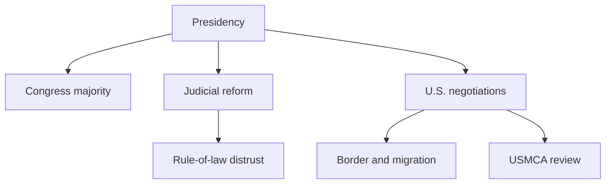
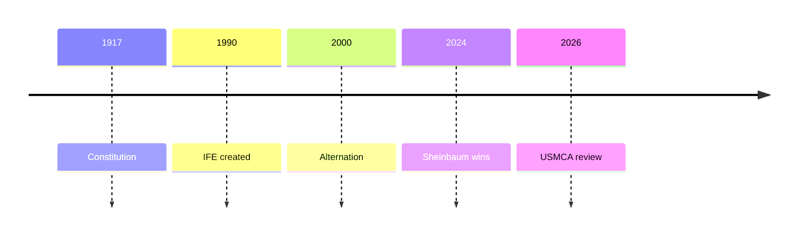

# Mexico Between Border Growth and Public Security 2026

## 1. Executive Summary

Mexico is a country shaped by the border economy with the United States, fragmented security, judicial reform, and export manufacturing at the same time. <SourceNote>[Constitución Política de los Estados Unidos Mexicanos](https://www.diputados.gob.mx/LeyesBiblio/ref/cpeum.htm), [INE, resultados electorales](https://www.ine.mx/voto-y-elecciones/resultados-electorales/), [Presidencia de la República](https://www.gob.mx/presidencia/) support this framing.</SourceNote> The 2024 election brought the Sheinbaum administration to power, and in 2026 USMCA review, border control, and security cooperation sit on the same diplomatic agenda. <SourceNote>[INE, cómputos distritales](https://centralelectoral.ine.mx/2024/06/09/ine-dio-a-conocer-el-resultado-final-de-los-computos-distritales-para-la-presidencia-de-la-republica/), [USTR, USMCA joint review](https://ustr.gov/about/policy-offices/press-office/press-releases/2026/july/ambassador-greer-issues-statement-usmca-joint-review), [SRE, security and migration](https://www.gob.mx/sre/prensa/mexico-y-estados-unidos-fortalecen-coordinacion-bilateral-en-seguridad-y-migracion?idiom=es) support that reading.</SourceNote> Mexico should not be read only as a risky emerging market. <SourceNote>[USTR, Mexico](https://www.ustr.gov/countries-regions/americas/mexico) and [Banxico, nearshoring presentation](https://www.banxico.org.mx/publications-and-press/presentations/%7BA39E8143-85DD-0574-E1E9-80EC0CF03CF5%7D.pdf) support that point.</SourceNote> It is in fact a North American production corridor, while at home local politics and criminal networks continue to compete. <SourceNote>[SSPC, homicide reduction](https://www.gob.mx/sspc/prensa/estrategia-nacional-de-seguridad-reduce-51-el-promedio-diario-de-homicidio-doloso) and [CNB/RNPDNO](https://consultapublicarnpdno.segob.gob.mx/) support that point.</SourceNote>

## 2. Historical Background and Institutions

The 1917 Constitution and the post-independence republic established federalism, but state-building after the 1910 Revolution produced a long period of centralization. <SourceNote>[Constitución Política de los Estados Unidos Mexicanos](https://www.diputados.gob.mx/LeyesBiblio/ref/cpeum.htm) and [Presidencia, 200 años de la República](https://www.gob.mx/presidencia/articulos/version-estenografica-ceremonia-conmemorativa-de-los-200-anos-de-la-republica?idiom=es) support this background.</SourceNote> The creation of the IFE in 1990 and the 2000 alternation advanced democratization, but Morena's rise in 2018 and Sheinbaum's victory in 2024 have strengthened executive-led politics again. <SourceNote>[INE, Historia](https://www.ine.mx/historia/) and [INE, 2024 presidential results](https://centralelectoral.ine.mx/2024/06/09/ine-dio-a-conocer-el-resultado-final-de-los-computos-distritales-para-la-presidencia-de-la-republica/) support this reading.</SourceNote> Mexican politics therefore moves with both competitive democracy and a strong presidency in the same frame. <SourceNote>[INE, Historia](https://www.ine.mx/historia/) supports that characterization.</SourceNote>

## 3. Main Actors

The main actors are listed below. <SourceNote>[Constitución](https://www.diputados.gob.mx/LeyesBiblio/ref/cpeum.htm), [Senado Jucopo](https://comunicacionsocial.senado.gob.mx/informacion/comunicados/9548-queda-constituida-la-junta-de-coordinacion-politica-del-senado-de-la-republica), [DOF judicial reform](https://dof.gob.mx/nota_detalle.php?codigo=5738985&fecha=15/09/2024), and [SRE security and migration](https://www.gob.mx/sre/prensa/mexico-y-estados-unidos-fortalecen-coordinacion-bilateral-en-seguridad-y-migracion?idiom=es) support the table.</SourceNote>

| Actor | Role | How to read it |
| --- | --- | --- |
| Presidency | Source of foreign policy, security policy, and fiscal direction | It sets the pace, but states and courts push back. |
| Morena, PVEM, PT | Legislative majority | Lawmaking is faster, but internal coordination still matters. |
| State governments and municipalities | Security and investment climate | Differences across states are too large to read Mexico as one block. |
| Armed forces and National Guard | Security and logistics | Their role has expanded in border control and internal security. |
| Judiciary | Check on power | The 2024 reform unsettled selection rules and legitimacy. |
| U.S. government | Biggest external pressure | Trade, migration, and drug policy all shape domestic choices. |

## 4. External Relations

External relations are best understood through the United States, Canada, Japan, and Central America. <SourceNote>[USTR, Mexico trade summary](https://www.ustr.gov/countries-regions/americas/mexico), [SRE, border security and migration](https://www.gob.mx/sre/prensa/mexico-y-estados-unidos-fortalecen-coordinacion-bilateral-en-seguridad-y-migracion?idiom=es), [MOFA Japan-Mexico relations](https://www.mofa.go.jp/region/latin/mexico/), and [JETRO Mexico investment report](https://www.jetro.go.jp/world/cs_america/mx/gtir/) support that framing.</SourceNote>

| Partner | Main issues | How to read it |
| --- | --- | --- |
| United States | Trade, border, migration, fentanyl, USMCA review | It is the center of Mexican diplomacy. |
| Canada | USMCA, manufacturing, energy | It is the other pillar of North American integration. |
| Japan | EPA, Japanese automakers, inward investment | It supports Mexico as a manufacturing base. |
| Central America | Migration, transit, return | It links domestic politics to the U.S. talks. |

U.S.-Mexico goods and services trade reached $964.1 billion in 2025, making the bilateral relationship the center of Mexican diplomacy. <SourceNote>[USTR, Mexico page](https://www.ustr.gov/countries-regions/americas/mexico)</SourceNote> The 2026 USMCA review has made bilateral negotiations continuous, not ceremonial. <SourceNote>[USTR, USMCA joint review](https://ustr.gov/about/policy-offices/press-office/press-releases/2026/july/ambassador-greer-issues-statement-usmca-joint-review) supports that claim.</SourceNote> The Mexican government says border management and security cooperation belong inside sovereignty and shared responsibility. <SourceNote>[SRE, security and migration](https://www.gob.mx/sre/prensa/mexico-y-estados-unidos-fortalecen-coordinacion-bilateral-en-seguridad-y-migracion?idiom=es) supports that claim.</SourceNote> Migration and border management are now both security and labor-mobility issues. <SourceNote>[SRE, security and migration](https://www.gob.mx/sre/prensa/mexico-y-estados-unidos-fortalecen-coordinacion-bilateral-en-seguridad-y-migracion?idiom=es) supports that claim.</SourceNote>

## 5. Security, Justice, and Civic Life

The government stresses security gains and says daily homicides fell from 86.9 to 42.5 between October 2024 and July 2026. <SourceNote>[SSPC, homicide reduction](https://www.gob.mx/sspc/prensa/estrategia-nacional-de-seguridad-reduce-51-el-promedio-diario-de-homicidio-doloso) supports this claim.</SourceNote> But the missing-persons registry still holds 394,645 cases, so violence has slowed without disappearing. <SourceNote>[Presidencia transcript, 2026-03-27](https://www.gob.mx/presidencia/articulos/version-estenografica-conferencia-de-prensa-de-la-presidenta-claudia-sheinbaum-pardo-del-27-de-marzo-de-2026?idiom=es) and [CNB/RNPDNO](https://consultapublicarnpdno.segob.gob.mx/) support this claim.</SourceNote> RSF reported the seventh journalist killing in 2026, showing that press safety remains fragile. <SourceNote>[RSF Mexico](https://rsf.org/es/pais/m%C3%A9xico) supports this claim.</SourceNote> Disappearances, extortion, and violence against reporters continue to vary by state. <SourceNote>[HRW World Report 2026 Mexico](https://www.hrw.org/world-report/2026/country-chapters/mexico) and [Amnesty 2026](https://www.amnesty.org/en/wp-content/uploads/2026/04/IOR1008372026ENGLISH.pdf) provide the wider context.</SourceNote>

## 6. Economy and Energy

Nearshoring is real, but it is not an automatic windfall. <SourceNote>[Banxico nearshoring presentation](https://www.banxico.org.mx/publications-and-press/presentations/%7BA39E8143-85DD-0574-E1E9-80EC0CF03CF5%7D.pdf) supports this point.</SourceNote> Banxico's surveys confirm increases in production, sales, and investment from relocation, while also naming weak rule of law and insecurity as obstacles to growth. <SourceNote>[Banxico quarterly report boxes](https://www.banxico.org.mx/publicaciones-y-prensa/informes-trimestrales/recuadros/recuadros-informe-trimestral-001.html) supports this point.</SourceNote> Energy policy is state-led, and PROSENER 2025-2030 and PLADESE assume energy sovereignty, transmission networks, and public investment. <SourceNote>[SENER PROSENER 2025-2030](https://www.gob.mx/sener/es/articulos/programa-sectorial-de-energia-2025-2030) and [SENER PLADESE](https://www.gob.mx/sener/articulos/plan-de-desarrollo-del-sector-electrico-pladese) support this point.</SourceNote> In practice, factory decisions depend not only on demand but also on permitting, grid capacity, water, and the pace of public investment. <SourceNote>[Banxico quarterly report boxes](https://www.banxico.org.mx/publicaciones-y-prensa/informes-trimestrales/recuadros/recuadros-informe-trimestral-001.html) and [IMF Article IV Mexico 2025](https://www.banxico.org.mx/publications-and-press/imf-article-iv-consultation-for-mexico/%7B27E9C215-AA16-4857-085A-AE04E85E5AE6%7D.pdf) support this point.</SourceNote>

## 7. Implications for Japan and East Asia

For Japan, the key point is that Mexico is not just an export destination but a base that absorbs institutional risk in North American supply chains. <SourceNote>[MOFA Japan-Mexico relations](https://www.mofa.go.jp/region/latin/mexico/) and [JETRO Mexico report](https://www.jetro.go.jp/world/cs_america/mx/gtir/) support this point.</SourceNote> The Japan-Mexico EPA and Japanese investment would be hit directly if that corridor broke down. <SourceNote>[MOFA Japan-Mexico EPA](https://www.mofa.go.jp/mofaj/gaiko/fta/j_mexico/index.html) supports this point.</SourceNote> So the right lens on Mexico is North American institutional infrastructure rather than a simple emerging market. <SourceNote>[USTR Mexico](https://www.ustr.gov/countries-regions/americas/mexico) and [SRE, security and migration](https://www.gob.mx/sre/prensa/mexico-y-estados-unidos-fortalecen-coordinacion-bilateral-en-seguridad-y-migracion?idiom=es) support this reading.</SourceNote>

## 8. Monitoring Points

- Whether the USMCA review leaves flash points in rules of origin, labor, energy, and customs.
- Whether the implementation of judicial reform weakens court independence and trust in institutions.
- Whether improved security indicators translate into lower violence, disappearances, and extortion by state.
- Whether power, transmission, and permitting constraints can widen the space for nearshoring.
