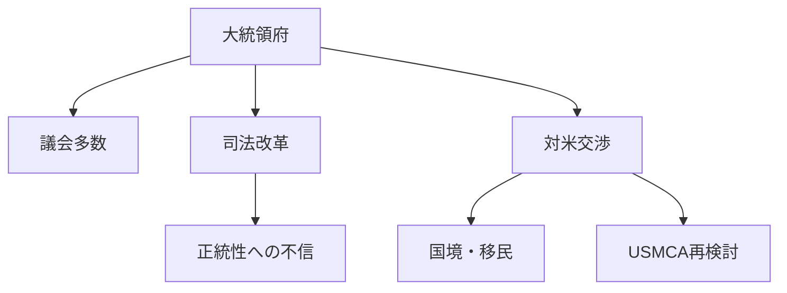
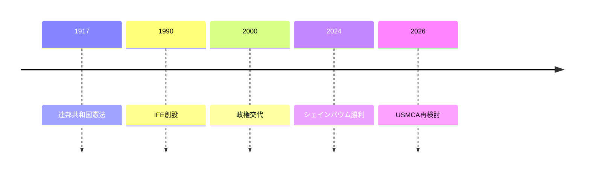

# 国境経済が押し上げ、治安が引き戻すメキシコ 2026

## 1. エグゼクティブサマリー

メキシコは、米国との国境経済、治安の断片化、司法改革、そして輸出製造業の三つ巴で動く国である。<SourceNote>[Constitución Política de los Estados Unidos Mexicanos](https://www.diputados.gob.mx/LeyesBiblio/ref/cpeum.htm), [INE, resultados electorales](https://www.ine.mx/voto-y-elecciones/resultados-electorales/), [Presidencia de la República](https://www.gob.mx/presidencia/) に基づく。</SourceNote> 2024年の選挙でシェインバウム政権が誕生し、2026年にはUSMCA再検討、国境管理、治安協力が同じ外交議題に並んでいる。<SourceNote>[INE, cómputos distritales](https://centralelectoral.ine.mx/2024/06/09/ine-dio-a-conocer-el-resultado-final-de-los-computos-distritales-para-la-presidencia-de-la-republica/), [USTR, USMCA joint review](https://ustr.gov/about/policy-offices/press-office/press-releases/2026/july/ambassador-greer-issues-statement-usmca-joint-review), [SRE, security and migration](https://www.gob.mx/sre/prensa/mexico-y-estados-unidos-fortalecen-coordinacion-bilateral-en-seguridad-y-migracion?idiom=es) を参照した。</SourceNote> ニュースを読むときは、メキシコを「治安の悪い新興国」とだけ見ない方がよい。<SourceNote>[USTR, Mexico](https://www.ustr.gov/countries-regions/americas/mexico) と [Banxico, nearshoring presentation](https://www.banxico.org.mx/publications-and-press/presentations/%7BA39E8143-85DD-0574-E1E9-80EC0CF03CF5%7D.pdf) に基づく。</SourceNote> 実際には、北米の生産回廊であり、国内では地方政治と犯罪組織のせめぎ合いが続いている。<SourceNote>[SSPC, homicide reduction](https://www.gob.mx/sspc/prensa/estrategia-nacional-de-seguridad-reduce-51-el-promedio-diario-de-homicidio-doloso) と [CNB/RNPDNO](https://consultapublicarnpdno.segob.gob.mx/) を参照した。</SourceNote>

## 2. 歴史と制度

1917年憲法と独立後の共和国は連邦制を定め、1910年革命後の国家建設は長い中央集権を生んだ。<SourceNote>[Constitución Política de los Estados Unidos Mexicanos](https://www.diputados.gob.mx/LeyesBiblio/ref/cpeum.htm) と [Presidencia, 200 años de la República](https://www.gob.mx/presidencia/articulos/version-estenografica-ceremonia-conmemorativa-de-los-200-anos-de-la-republica?idiom=es) に基づく。</SourceNote> 1990年のIFE創設と2000年の政権交代は民主化を前に進めたが、2018年のMorena台頭と2024年のシェインバウム勝利で、行政主導の政治が再び強まっている。<SourceNote>[INE, Historia](https://www.ine.mx/historia/) と [INE, 2024 presidential results](https://centralelectoral.ine.mx/2024/06/09/ine-dio-a-conocer-el-resultado-final-de-los-computos-distritales-para-la-presidencia-de-la-republica/) を参照した。</SourceNote> その結果、メキシコ政治は「競争的民主主義」と「強い大統領制」の両方を抱えたまま動いている。<SourceNote>[INE, Historia](https://www.ine.mx/historia/) に基づく。</SourceNote>

## 3. 主要アクター

主要アクターは次の通りである。<SourceNote>[Constitución](https://www.diputados.gob.mx/LeyesBiblio/ref/cpeum.htm), [Senado Jucopo](https://comunicacionsocial.senado.gob.mx/informacion/comunicados/9548-queda-constituida-la-junta-de-coordinacion-politica-del-senado-de-la-republica), [DOF judicial reform](https://dof.gob.mx/nota_detalle.php?codigo=5738985&fecha=15/09/2024), [SRE security and migration](https://www.gob.mx/sre/prensa/mexico-y-estados-unidos-fortalecen-coordinacion-bilateral-en-seguridad-y-migracion?idiom=es) に基づく。</SourceNote>

| アクター | 役割 | 読み方 |
| --- | --- | --- |
| 大統領府 | 外交、治安、財政の起点 | 政策速度を決める中心だが、州や司法の反作用を受ける。 |
| Morena・PVEM・PT | 立法多数派 | 法案成立は早いが、内部調整が必要である。 |
| 州政府・自治体 | 治安と投資環境 | 州ごとの差が大きく、国全体を一枚岩で読めない。 |
| 軍・海軍・GN | 治安と物流 | 治安と国境管理で存在感が増した。 |
| 司法 | 権力抑制 | 2024年改革で選出方式が揺れ、正統性が争点になった。 |
| 米国政府 | 最大の対外圧力 | 通商、移民、麻薬対策の三つで政策を左右する。 |

## 4. 対外関係

対外関係は、米国、カナダ、日本、そして中米との関係でほぼ説明できる。<SourceNote>[USTR, Mexico trade summary](https://www.ustr.gov/countries-regions/americas/mexico), [SRE, border security and migration](https://www.gob.mx/sre/prensa/mexico-y-estados-unidos-fortalecen-coordinacion-bilateral-en-seguridad-y-migracion?idiom=es), [MOFA Japan-Mexico relations](https://www.mofa.go.jp/region/latin/mexico/), [JETRO Mexico investment report](https://www.jetro.go.jp/world/cs_america/mx/gtir/) に基づく。</SourceNote>

| 相手 | 主要論点 | 読み方 |
| --- | --- | --- |
| 米国 | 貿易、国境、移民、フェンタニル、USMCA再検討 | メキシコ外交の中心である。 |
| カナダ | USMCA、製造業、エネルギー | 北米統合のもう一つの支柱である。 |
| 日本 | EPA、日系自動車、対内投資 | 製造拠点としてのメキシコを支える。 |
| 中米 | 移民、通過、帰還 | 国内政治と対米交渉をつなぐ。 |

2025年の米国との財・サービス貿易は9641億ドルに達し、対米関係はメキシコ外交の中心である。<SourceNote>[USTR, Mexico page](https://www.ustr.gov/countries-regions/americas/mexico)</SourceNote> 2026年のUSMCA再検討は、二国間交渉を儀礼ではなく継続案件にした。<SourceNote>[USTR, USMCA joint review](https://ustr.gov/about/policy-offices/press-office/press-releases/2026/july/ambassador-greer-issues-statement-usmca-joint-review) に基づく。</SourceNote> メキシコ政府は、国境管理と治安協力が主権尊重と共有責任の枠内にあると説明している。<SourceNote>[SRE, security and migration](https://www.gob.mx/sre/prensa/mexico-y-estados-unidos-fortalecen-coordinacion-bilateral-en-seguridad-y-migracion?idiom=es) に基づく。</SourceNote> 移民と国境管理は、いまや治安と労働移動の両方の問題である。<SourceNote>[SRE, security and migration](https://www.gob.mx/sre/prensa/mexico-y-estados-unidos-fortalecen-coordinacion-bilateral-en-seguridad-y-migracion?idiom=es) に基づく。</SourceNote>

## 5. 治安・司法・市民生活

政府は治安改善を強調し、2024年10月から2026年7月にかけて日次殺人件数が86.9件から42.5件へ下がったと説明する。<SourceNote>[SSPC, homicide reduction](https://www.gob.mx/sspc/prensa/estrategia-nacional-de-seguridad-reduce-51-el-promedio-diario-de-homicidio-doloso) に基づく。</SourceNote> しかし、失踪者登録簿には394645件が積み上がり、暴力は減速しても消えてはいない。<SourceNote>[Presidencia transcript, 2026-03-27](https://www.gob.mx/presidencia/articulos/version-estenografica-conferencia-de-prensa-de-la-presidenta-claudia-sheinbaum-pardo-del-27-de-marzo-de-2026?idiom=es) と [CNB/RNPDNO](https://consultapublicarnpdno.segob.gob.mx/) に基づく。</SourceNote> RSFは2026年に7人目の記者殺害を伝え、報道の安全は依然として脆い。<SourceNote>[RSF Mexico](https://rsf.org/es/pais/m%C3%A9xico) に基づく。</SourceNote> 失踪、恐喝、記者への暴力は、州ごとに形を変えて残る。<SourceNote>[HRW World Report 2026 Mexico](https://www.hrw.org/world-report/2026/country-chapters/mexico) と [Amnesty 2026](https://www.amnesty.org/en/wp-content/uploads/2026/04/IOR1008372026ENGLISH.pdf) を参照した。</SourceNote>

## 6. 経済とエネルギー

近接生産は本物だが、自動的な恩恵ではない。<SourceNote>[Banxico nearshoring presentation](https://www.banxico.org.mx/publications-and-press/presentations/%7BA39E8143-85DD-0574-E1E9-80EC0CF03CF5%7D.pdf) に基づく。</SourceNote> Banxicoは、企業調査で近接生産による生産・販売・投資の増加を確認しつつ、成長の妨げとして法の支配の弱さと治安悪化を挙げた。<SourceNote>[Banxico quarterly report boxes](https://www.banxico.org.mx/publicaciones-y-prensa/informes-trimestrales/recuadros/recuadros-informe-trimestral-001.html) に基づく。</SourceNote> エネルギー政策は国家主導で、PROSENER 2025-2030とPLADESEは、エネルギー主権、送配電網、公共投資を前提にしている。<SourceNote>[SENER PROSENER 2025-2030](https://www.gob.mx/sener/es/articulos/programa-sectorial-de-energia-2025-2030) と [SENER PLADESE](https://www.gob.mx/sener/articulos/plan-de-desarrollo-del-sector-electrico-pladese) に基づく。</SourceNote> そのため、工場の意思決定は市場需要だけではなく、許認可、系統容量、水、公共投資の速度に左右される。<SourceNote>[Banxico quarterly report boxes](https://www.banxico.org.mx/publicaciones-y-prensa/informes-trimestrales/recuadros/recuadros-informe-trimestral-001.html) と [IMF Article IV Mexico 2025](https://www.banxico.org.mx/publications-and-press/imf-article-iv-consultation-for-mexico/%7B27E9C215-AA16-4857-085A-AE04E85E5AE6%7D.pdf) に基づく。</SourceNote>

## 7. 日本・東アジアへの含意

日本にとっての要点は、メキシコが単なる輸出先ではなく、北米サプライチェーンの制度リスクを吸収する拠点だという点にある。<SourceNote>[MOFA Japan-Mexico relations](https://www.mofa.go.jp/region/latin/mexico/) と [JETRO Mexico report](https://www.jetro.go.jp/world/cs_america/mx/gtir/) に基づく。</SourceNote> 日墨EPAと日系企業の投資は、この回廊が壊れれば直撃を受ける。<SourceNote>[MOFA Japan-Mexico EPA](https://www.mofa.go.jp/mofaj/gaiko/fta/j_mexico/index.html) に基づく。</SourceNote> したがって、メキシコを見る視点は「新興市場」よりも「北米の制度インフラ」である。<SourceNote>[USTR Mexico](https://www.ustr.gov/countries-regions/americas/mexico) と [SRE security and migration](https://www.gob.mx/sre/prensa/mexico-y-estados-unidos-fortalecen-coordinacion-bilateral-en-seguridad-y-migracion?idiom=es) に基づく。</SourceNote>

## 8. 監視ポイント

- USMCA再検討が、原産地規則、労働、エネルギー、通関のどこに火種を残すか。
- 司法改革の実装が、裁判の独立性と制度への信頼をどこまで損なうか。
- 治安指標の改善が、州ごとの暴力、失踪、恐喝の減少に結びつくか。
- 電力、送電、許認可の制約が、近接生産の受け皿を広げられるか。
