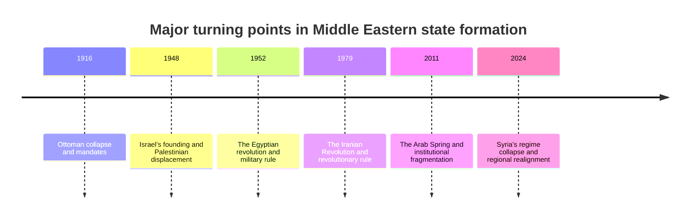
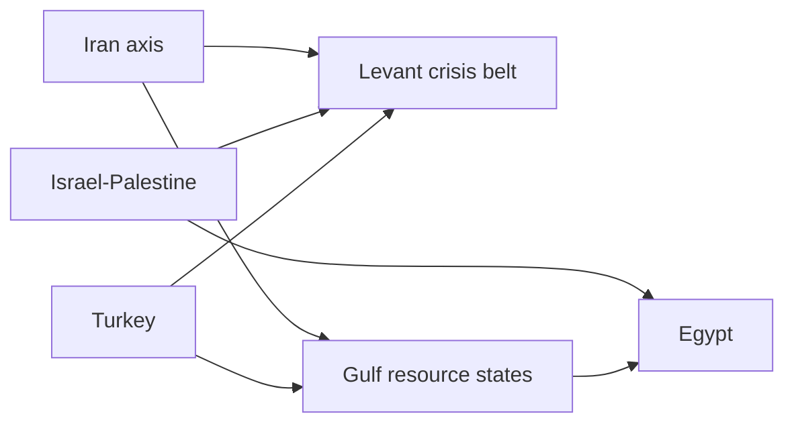

# Historical Formation and Current Fault Lines of Major Middle Eastern Countries

## 1. Executive Summary

The present-day Middle East cannot be explained by sectarian conflict alone. The collapse of the Ottoman Empire, the French and British mandates, wars of state formation, oil rents, revolutions, civil wars, refugees, and renewed authoritarianism have produced very different political orders from country to country. The main questions today are not simply religious identity, but whether each state can monopolize force, distribute resources, and absorb demographic pressure and labor-market stress. <SourceNote>[Freedom House, Freedom in the World 2026](https://freedomhouse.org/report/freedom-world/2026/middle-east-and-north-africa), [World Bank, MENAAP Economic Update 2026](https://www.worldbank.org/en/region/mena/publication/economy-update), [IMF, Regional Economic Outlook for the Middle East and Central Asia 2026](https://www.imf.org/en/Publications/REO/MCD) support this reading.</SourceNote>

Across the region, Iran is a revolutionary republic, Iraq is a politics-of-distribution state with militia influence, Syria is in post-war transition, Lebanon is a confessional system with a weak state, Israel-Palestine is defined by asymmetrical sovereignty, Saudi Arabia and the Gulf states are resource monarchies, and Turkey and Egypt are authoritarian systems that still preserve elections. The right comparison is therefore not “sectarian versus secular,” but state formation, coercive capacity, resource dependence, and the ability to absorb generational frustration. <SourceNote>[Freedom House country scores](https://freedomhouse.org/countries/freedom-world/scores), [Britannica, Middle East country histories](https://www.britannica.com/place/Middle-East) support this comparison.</SourceNote>

For Japan, the practical implication is straightforward. The region is a single risk space for the Strait of Hormuz, the Red Sea, the Suez Canal, LNG, crude oil, marine insurance, sanctions compliance, refugees, and reconstruction deals. If the country-level differences are ignored, decisions on energy, supply chains, security, and foreign investment are likely to be misread. <SourceNote>[World Bank, MENAAP Economic Update 2026](https://www.worldbank.org/en/region/mena/publication/economy-update), [IMF, Regional Economic Outlook for the Middle East and Central Asia 2026](https://www.imf.org/en/Publications/REO/MCD), [OCHA, Gaza updates](https://www.ochaopt.org/) support this point.</SourceNote>

## 2. Analytical Lens

Historically, the region sat on the margins of empires. In the late Ottoman period, self-determination and great-power intervention overlapped, and after World War I the mandates of Britain and France fixed borders and institutions. Many of the later states were not built first as liberal democracies; they were built around armies, royal houses, religious authorities, or security services. <SourceNote>[Britannica, Iraq](https://www.britannica.com/place/Iraq), [Britannica, Syria](https://www.britannica.com/place/Syria), [Britannica, Lebanon](https://www.britannica.com/place/Lebanon), [Britannica, Egypt](https://www.britannica.com/place/Egypt), [Britannica, Turkey](https://www.britannica.com/place/Turkey) support this historical framing.</SourceNote>

The key point is that sectarian conflict is only one layer. Urban-rural divides, center-periphery tensions, tribes versus the state, old elites versus new generations, citizens versus migrant labor, and domestic elites versus foreign patrons all sit beneath the sectarian label. If Lebanon and Iraq are read only through sectarianism, corruption, unemployment, and the externalization of state functions disappear from view. If the Gulf states are read only through wealth, the narrowness of citizenship and dependence on migrant labor disappear from view. <SourceNote>[Arab Opinion Index 2025](https://www.arabbarometer.org/2025/07/arab-opinion-index-2025/), [Freedom House, Middle East and North Africa 2026](https://freedomhouse.org/report/freedom-world/2026/middle-east-and-north-africa), [World Bank, GCC economies update](https://www.worldbank.org/en/region/mena/publication/gcc-economies-update) support this interpretation.</SourceNote>

The region is easier to compare through four axes.

1. State formation
1. Regime structure
1. Social cleavages
1. External dependence

State formation differs by revolution, independence war, mandate rule, military coup, anti-colonial independence, and federation. Regime structure differs by monarchy, revolutionary republic, military rule, electoral authoritarianism, and fragile power-sharing. Social cleavages appear as sect, ethnicity, class, region, generation, and the political status of refugees and migrant workers. External dependence appears in oil and gas, aid, remittances, security guarantees, shipping lanes, and sanctions evasion. <SourceNote>[IMF, Regional Economic Outlook for the Middle East and Central Asia 2026](https://www.imf.org/en/Publications/REO/MCD), [World Bank, MENAAP Economic Update 2026](https://www.worldbank.org/en/region/mena/publication/economy-update), [Freedom House country reports](https://freedomhouse.org/countries/freedom-world/scores) support this framework.</SourceNote>

## 3. Comparative Table

| Country or area | Core historical formation | Current political order | Main social problem | Reading of public mood |
| --- | --- | --- | --- | --- |
| Iran | The 1979 Revolution replaced monarchy and institutionalized clerical rule | Revolutionary republic with Supreme Leader dominance | Sanctions, inflation, water and power shortages, repression | Fatigue with repression and economic decline, with narrow reform channels |
| Iraq | Ottoman rule and the British mandate, then reconstruction after 2003 | Electoral system with strong corruption and militia influence | Public services, jobs, corruption, oil dependence | Demand for services and deep distrust of elites |
| Syria | French mandate, Ba'ath rule, civil war, and post-2024 transition | Transitional politics and fragmented armed space | Reconstruction, displaced people, electricity, water, legitimacy | Survival-first society, exhaustion, and return anxiety |
| Lebanon | Ottoman legacy, French mandate, and confessional independence | Confessional politics and a weak state, with Hezbollah influence | Financial collapse, administrative paralysis, youth emigration | Anger at elites mixed with resignation |
| Israel-Palestine | 1948 statehood war, 1967 occupation, Gaza blockade and war | Israel is democratic; the Palestinian side faces asymmetrical sovereignty | Security, occupation, statehood, humanitarian crisis | Polarization in Israel and despair on the Palestinian side |
| Saudi Arabia | Unified in 1932 and built a fiscal state on oil | Absolute monarchy with Vision 2030 reform | Jobs, housing, control, oil dependence | Demand for security and opportunity, with limited political space |
| Turkey | The Ottoman successor state became a republic in 1923 | Increasingly authoritarian electoral system | Inflation, judicial politicization, refugees, Kurdish issue | Economic frustration, nationalism, and reform fatigue |
| Egypt | The 1952 revolution created a military-led republic | Classic state-led authoritarianism | Debt, prices, subsidies, demographic pressure | A stability-seeking public under rising cost-of-living pressure |
| Gulf states | Protectorates and small emirates later became resource states | Monarchies, emirates, and federation | Migrant labor, diversification, water, climate, youth jobs | Transactional loyalty and narrow political participation |

In one sentence each, Iran was transformed by the 1979 Revolution, which replaced monarchy and institutionalized clerical rule. Iraq combines Ottoman rule, the British mandate, and post-2003 reconstruction into a politics of distribution. Syria now combines mandate history, Ba'ath rule, civil war, and post-2024 transition. Lebanon's confessional independence created pluralism, but it also weakened the state. Israel-Palestine is defined by the asymmetry of sovereignty rather than a symmetric state-to-state rivalry. Saudi Arabia and the Gulf states became resource monarchies after unification or independence. Turkey and Egypt are authoritarian systems that still keep elections, but their social pressures are different.

<SourceNote>The table synthesizes [Freedom House country scores](https://freedomhouse.org/countries/freedom-world/scores), [Britannica country histories](https://www.britannica.com/), [World Bank, West Bank and Gaza overview](https://www.worldbank.org/en/country/westbankandgaza/overview), and [OCHA, Gaza updates](https://www.ochaopt.org/). The “reading of public mood” is an inference from public data and reporting, not a full measurement of sentiment.</SourceNote>

## 4. Country-by-Country Reading

### 4.1 Iran

Iran is a case where the current order was shaped less by colonial rule than by the overthrow of monarchy and the creation of a revolutionary state. The Supreme Leader, the Guardian Council, and the Islamic Revolutionary Guard Corps control the entry and exit points of power, so elections exist but competition is tightly bounded. The current issues are sanctions, currency weakness, inflation, water shortages, power outages, and generational frustration. The core problem is not sectarian conflict alone, but the erosion of state capacity and everyday security. <SourceNote>[Freedom House, Iran 2026](https://freedomhouse.org/country/iran/freedom-world/2026), [World Bank, Iran overview](https://www.worldbank.org/en/country/iran), [IAEA Iran focus page](https://www.iaea.org/newscenter/focus/iran) support this reading.</SourceNote>

### 4.2 Iraq

Iraq has carried ethnic, sectarian, and regional fractures since its early state formation, and after 2003 it became a system held together by electoral politics, party networks, militias, and external patrons. The key issue is not a simple Sunni-Shia binary, but how oil revenue is allocated, how Baghdad relates to the provinces, and how militias become institutionalized. Public demand is aimed more at services and jobs than at ideology. <SourceNote>[Freedom House, Iraq 2025](https://freedomhouse.org/country/iraq/freedom-world/2025), [World Bank, Iraq overview](https://www.worldbank.org/en/country/iraq) support this reading.</SourceNote>

### 4.3 Syria

Syria now combines the legacy of the French mandate, Ba'ath rule, a long civil war, mass displacement, and the post-2024 collapse of the old regime. The main issue is no longer just factional competition, but whether the state can be reconstructed at all: security, administration, refugee return, and the balance among external patrons all come first. Sect and ethnicity matter, but the deeper question is institutional survival. <SourceNote>[Freedom House, Syria 2026](https://freedomhouse.org/country/syria/freedom-world/2026), [Britannica, Syria](https://www.britannica.com/place/Syria), [World Bank, Syria overview](https://www.worldbank.org/en/country/syria) support this reading.</SourceNote>

### 4.4 Lebanon

Lebanon tried to protect pluralism by institutionalizing confessional power-sharing, but that arrangement also multiplied veto points and made the state weak. The 2019 financial collapse, the slow recovery after the port explosion, political paralysis, and the conflict between Hezbollah and Israel exposed how fragile communal politics had become. Public mood mixes anger at elites with resignation and a desire to leave. <SourceNote>[Freedom House, Lebanon 2025](https://freedomhouse.org/country/lebanon/freedom-world/2025), [World Bank, Lebanon overview](https://www.worldbank.org/en/country/lebanon) support this reading.</SourceNote>

### 4.5 Israel-Palestine

Israel-Palestine is not a symmetric state-to-state rivalry. Israel has elections, while the Palestinian side in Gaza and the West Bank faces occupation, blockade, fragmentation, and the effects of war. The 2025-2026 Gaza ceasefire and humanitarian response do not mean the war is over. They show instead that hostages, refugees, governance, reconstruction, and statehood remain tied together as one unresolved bundle. <SourceNote>[Freedom House, Israel 2025](https://freedomhouse.org/country/israel/freedom-world/2025), [Freedom House, West Bank 2025](https://freedomhouse.org/country/west-bank/freedom-world/2025), [Freedom House, Gaza Strip 2025](https://freedomhouse.org/country/gaza-strip/freedom-world/2025), [OCHA, Gaza updates](https://www.ochaopt.org/) support this reading.</SourceNote>

### 4.6 Saudi Arabia

Saudi Arabia was unified through tribal coalitions and religious authority, and then built its social contract on oil. Today Vision 2030 is pushing diversification and social opening, but political participation is still narrow and reform is delivered from above. Public sentiment is generally shaped by expectations for jobs and future opportunity, while the channels for open political contestation remain limited. <SourceNote>[Freedom House, Saudi Arabia 2025](https://freedomhouse.org/country/saudi-arabia/freedom-world/2025), [World Bank, GCC economies update](https://www.worldbank.org/en/region/mena/publication/gcc-economies-update) support this reading.</SourceNote>

### 4.7 The Gulf States

The Gulf states should not be treated as a single bloc, but the UAE, Qatar, Kuwait, Bahrain, and Oman do share important features. Each combines resource income, foreign labor, monarchy or emirate rule, limited electoral participation, and dependence on external security guarantees. Domestic frustration often comes less from absolute wealth than from citizenship boundaries, labor-market dualism, climate and water stress, and rising expectations among younger citizens. <SourceNote>[Freedom House, UAE 2025](https://freedomhouse.org/country/united-arab-emirates/freedom-world/2025), [Freedom House, Qatar 2025](https://freedomhouse.org/country/qatar/freedom-world/2025), [Freedom House, Kuwait 2025](https://freedomhouse.org/country/kuwait/freedom-world/2025), [Freedom House, Bahrain 2025](https://freedomhouse.org/country/bahrain/freedom-world/2025), [Freedom House, Oman 2025](https://freedomhouse.org/country/oman/freedom-world/2025), [World Bank, GCC economies update](https://www.worldbank.org/en/region/mena/publication/gcc-economies-update) support this reading.</SourceNote>

### 4.8 Turkey

Turkey is a successor state to the Ottoman Empire, but its republican legacy has been increasingly centralized. It still holds elections, yet power concentration has deepened. The main problems are inflation, judicial politicization, pressure on the opposition, the Kurdish issue, refugee politics, and the divide between cities and the rest of the country. Public mood is more shaped by economic frustration and distrust than by reform optimism. <SourceNote>[Freedom House, Turkey 2025](https://freedomhouse.org/country/turkey/freedom-world/2025), [Britannica, Turkey](https://www.britannica.com/place/Turkey), [IMF, Turkey Article IV](https://www.imf.org/en/Countries/TUR) support this reading.</SourceNote>

### 4.9 Egypt

Egypt became a military-led republic after the 1952 Revolution and remains a major regional state because of its population and geography. Yet population growth, debt, subsidies, currency pressure, water stress, and proximity to Gaza and the Suez Canal keep shrinking policy room. Public sentiment tends to prioritize prices and jobs over political reform, but the system offers only limited ways to absorb that pressure. <SourceNote>[Freedom House, Egypt 2025](https://freedomhouse.org/country/egypt/freedom-world/2025), [Britannica, Egypt](https://www.britannica.com/place/Egypt), [IMF, Egypt Article IV](https://www.imf.org/en/Countries/EGY) support this reading.</SourceNote>

## 5. Regional Relationship Map

This is not a military alliance chart. It is a map of spillovers: conflict, money, displacement, shipping, mediation, and sanctions. Iran projects pressure through proxies into the Levant, Israel-Palestine remains the emotional center of the region, the Gulf supplies capital and energy, Egypt is the hinge between Gaza and the Suez route, and Turkey connects refugee flows with security and economic pressure. <SourceNote>[World Bank, MENAAP Economic Update 2026](https://www.worldbank.org/en/region/mena/publication/economy-update), [IMF, Regional Economic Outlook for the Middle East and Central Asia 2026](https://www.imf.org/en/Publications/REO/MCD), [OCHA, Gaza updates](https://www.ochaopt.org/), [Freedom House country reports](https://freedomhouse.org/countries/freedom-world/scores) support this map.</SourceNote>

## 6. Practical Implications

For Japanese policymakers and companies, the important variable is not sect or ideology, but which country exports which risk to the outside world. Iran exports sanctions and shipping risk, Israel-Palestine exports humanitarian shock and regional mobilization, the Levant exports reconstruction and refugee pressure, the Gulf exports energy and investment, and Turkey and Egypt export currency and demographic stress. Contracts, insurance, logistics, and sanctions screening should therefore start from country-level institutional differences. <SourceNote>[IMF, Regional Economic Outlook for the Middle East and Central Asia 2026](https://www.imf.org/en/Publications/REO/MCD), [World Bank, MENAAP Economic Update 2026](https://www.worldbank.org/en/region/mena/publication/economy-update), [OCHA, Gaza updates](https://www.ochaopt.org/) support this point.</SourceNote>

In practice, four separate signals should be monitored.

1. Shipping risks in the Strait of Hormuz, the Red Sea, and the Suez Canal
1. Compliance risks that cut across sanctions and re-export networks
1. Refugees, internally displaced persons, and reconstruction demand
1. Youth unemployment, inflation, subsidies, and public services

These are not isolated national problems. They are the outward leakage of regional institutional fatigue. <SourceNote>[World Bank, West Bank and Gaza overview](https://www.worldbank.org/en/country/westbankandgaza/overview), [World Bank, Lebanon overview](https://www.worldbank.org/en/country/lebanon), [World Bank, Iraq overview](https://www.worldbank.org/en/country/iraq), [World Bank, Iran overview](https://www.worldbank.org/en/country/iran) support this interpretation.</SourceNote>

## 7. Limits and Outlook

This report has three limits. First, the Middle East varies so much by country that regional averages can mislead operational decisions. Second, public information shows only the visible layer of institutions; internal security decisions, informal finance, proxy forces, and religious authority are only partly observable. Third, high-volatility arenas such as Syria and Gaza can change their premises within months. <SourceNote>[Freedom House, Syria 2026](https://freedomhouse.org/country/syria/freedom-world/2026), [OCHA, Gaza updates](https://www.ochaopt.org/), [World Bank, MENAAP Economic Update 2026](https://www.worldbank.org/en/region/mena/publication/economy-update) support this caution.</SourceNote>

This is therefore not a fixed ranking table. What matters is how each country loses legitimacy, reallocates resources, and exports crisis to its neighbors. Reading the Middle East through state formation and political economy, rather than sect alone, is the most practical way to use the comparison. <SourceNote>[Arab Opinion Index 2025](https://www.arabbarometer.org/2025/07/arab-opinion-index-2025/), [IMF, Regional Economic Outlook for the Middle East and Central Asia 2026](https://www.imf.org/en/Publications/REO/MCD) support this conclusion.</SourceNote>

## References

- [Freedom House, Freedom in the World 2026](https://freedomhouse.org/report/freedom-world/2026/middle-east-and-north-africa)
- [Freedom House, country scores](https://freedomhouse.org/countries/freedom-world/scores)
- [World Bank, MENAAP Economic Update 2026](https://www.worldbank.org/en/region/mena/publication/economy-update)
- [World Bank, GCC economies update](https://www.worldbank.org/en/region/mena/publication/gcc-economies-update)
- [World Bank, Iraq overview](https://www.worldbank.org/en/country/iraq)
- [World Bank, Iran overview](https://www.worldbank.org/en/country/iran)
- [World Bank, Lebanon overview](https://www.worldbank.org/en/country/lebanon)
- [World Bank, West Bank and Gaza overview](https://www.worldbank.org/en/country/westbankandgaza/overview)
- [IMF, Regional Economic Outlook for the Middle East and Central Asia 2026](https://www.imf.org/en/Publications/REO/MCD)
- [IMF, Egypt Article IV](https://www.imf.org/en/Countries/EGY)
- [IMF, Turkey Article IV](https://www.imf.org/en/Countries/TUR)
- [OCHA, Gaza updates](https://www.ochaopt.org/)
- [Arab Opinion Index 2025](https://www.arabbarometer.org/2025/07/arab-opinion-index-2025/)
- [Britannica, Middle East country histories](https://www.britannica.com/place/Middle-East)
