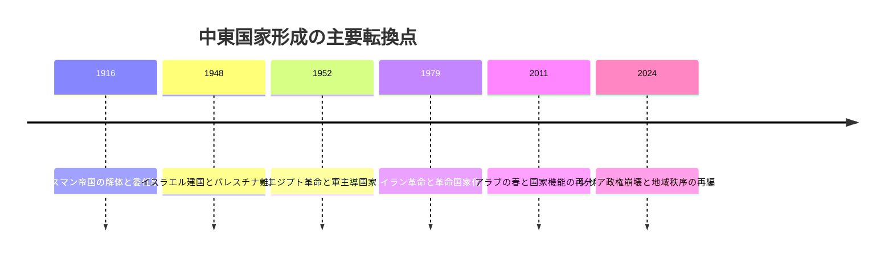
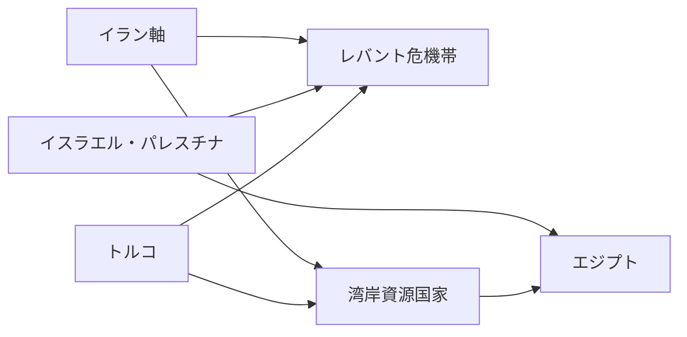

# 中東主要国の形成史と現在の争点

## 1. エグゼクティブサマリー

中東の現在を宗派対立だけで説明すると、ほぼ必ず見落としが出る。実際には、オスマン帝国の崩壊、英仏委任統治、建国戦争、石油収入、革命、内戦、難民、権威主義の再強化が重なって、国ごとにまったく違う国家のかたちができた。現在の争点も、単なる「イスラム世界の一枚岩」ではなく、国家が暴力を独占できるか、資源を配分できるか、人口動態と雇用を吸収できるか、という問題に分解できる。<SourceNote>[Freedom House, Freedom in the World 2026](https://freedomhouse.org/report/freedom-world/2026/middle-east-and-north-africa)、[World Bank, MENAAP Economic Update 2026](https://www.worldbank.org/en/region/mena/publication/economy-update)、[IMF, Regional Economic Outlook for the Middle East and Central Asia 2026](https://www.imf.org/en/Publications/REO/MCD) に基づく。</SourceNote>

同じ中東でも、イランは革命後体制、イラクは配分政治と民兵政治、シリアは内戦後の再編、レバノンは分権化しすぎた共同体政治、イスラエル・パレスチナは主権の非対称性、サウジアラビアと湾岸諸国は資源国家、トルコとエジプトは選挙を残した権威主義という具合に、制度の骨格が違う。したがって、比較の軸は「宗派か世俗か」だけではなく、国家形成の経路、暴力装置の分散度、資源の依存先、世代間の不満の吸収力で見るべきである。<SourceNote>[Freedom House 各国報告](https://freedomhouse.org/countries/freedom-world/scores)、[Britannica, Middle East country histories](https://www.britannica.com/place/Middle-East) に基づく。</SourceNote>

日本から見ると、この地域は一つのリスク空間である。ホルムズ海峡、紅海、スエズ運河、LNG、原油、海運保険、制裁遵守、難民、復興案件は相互に結びついている。中東の国別差を理解せずに地域全体を一括りにすると、エネルギー、サプライチェーン、安全保障、対外投資の判断を誤りやすい。<SourceNote>[World Bank, MENAAP Economic Update 2026](https://www.worldbank.org/en/region/mena/publication/economy-update)、[IMF, Regional Economic Outlook for the Middle East and Central Asia 2026](https://www.imf.org/en/Publications/REO/MCD)、[OCHA, Gaza humanitarian updates](https://www.ochaopt.org/) に基づく。</SourceNote>

## 2. 比較の見取り図

この地域は、歴史的には帝国の辺境だった。オスマン帝国の末期に民族自決と列強の干渉が重なり、第一次世界大戦後は英仏の委任統治と国境線の固定が進んだ。その後の独立国家は、議会制民主主義として育ったものより、軍、王家、宗教権威、治安機構のいずれかを核にして立ち上がったものが多い。<SourceNote>[Britannica, Iraq](https://www.britannica.com/place/Iraq)、[Britannica, Syria](https://www.britannica.com/place/Syria)、[Britannica, Lebanon](https://www.britannica.com/place/Lebanon)、[Britannica, Egypt](https://www.britannica.com/place/Egypt)、[Britannica, Turkey](https://www.britannica.com/place/Turkey) に基づく。</SourceNote>

ここで重要なのは、宗派対立は原因の一部にすぎないことだ。現実には、都市と地方、中心と周辺、部族と国家、旧支配層と新興世代、国民と移民労働者、国内エリートと外部スポンサーの関係が、宗派ラベルの下に重なっている。だから、レバノンやイラクを宗派だけで読むと、腐敗、雇用不足、国家機能の外部化を見失うし、湾岸諸国を富だけで読むと、市民権の狭さと移民労働への依存を見失う。<SourceNote>[Arab Opinion Index 2025](https://www.arabbarometer.org/2025/07/arab-opinion-index-2025/)、[Freedom House, Middle East and North Africa 2026](https://freedomhouse.org/report/freedom-world/2026/middle-east-and-north-africa)、[World Bank, GCC economies update](https://www.worldbank.org/en/region/mena/publication/gcc-economies-update) に基づく。</SourceNote>

中東を理解するうえで有効なのは、次の4軸である。

1. 国家形成の経路
1. 体制の骨格
1. 社会の亀裂
1. 外部依存

国家形成の経路は、革命、建国戦争、委任統治、軍事クーデタ、植民地からの独立、連邦形成に分かれる。体制の骨格は、君主制、革命共和国、軍政、選挙を残した権威主義、脆弱な権力分有に分かれる。社会の亀裂は、宗派、民族、階級、地域、世代、難民・移民の位置づけとして現れる。外部依存は、石油・ガス、援助、送金、軍事保証、海上輸送、制裁回避に表れる。<SourceNote>[IMF, Regional Economic Outlook for the Middle East and Central Asia 2026](https://www.imf.org/en/Publications/REO/MCD)、[World Bank, MENAAP Economic Update 2026](https://www.worldbank.org/en/region/mena/publication/economy-update)、[Freedom House country reports](https://freedomhouse.org/countries/freedom-world/scores) に基づく。</SourceNote>

## 3. 国別比較表

| 国・地域 | 形成史の要点 | 現在の政治秩序 | 主要な社会問題 | 市民感情の読み |
| --- | --- | --- | --- | --- |
| イラン | 1979年革命で王制を倒し、法学者統治を制度化 | 最高指導者優位の革命共和国 | 制裁、インフレ、水・電力不足、抑圧 | 抑圧と生活悪化への疲弊、改革回路の狭さ |
| イラク | オスマン帝国領と英委任統治を経て、2003年以降に再建 | 選挙制だが腐敗と民兵が強い国家 | 公共サービス、雇用、汚職、油依存 | サービス要求と政治不信 |
| シリア | フランス委任統治、バアス体制、内戦を経て再編段階 | 2024年以降の移行政治と断片化した武装環境 | 復興、避難民、電力、水、正統性 | 生存優先、疲弊、帰還不安 |
| レバノン | オスマン帝国後にフランス委任統治、宗派分有で独立 | 共同体政治と弱い国家、ヒズボラの影響 | 金融崩壊、行政麻痺、若年流出 | 反エリート感情と諦念の混在 |
| イスラエル・パレスチナ | 1948年建国戦争、1967年占領、ガザ封鎖と戦争 | イスラエルは民主制、パレスチナ側は主権非対称 | 安全保障、占領、国家性、人道危機 | イスラエル国内の極端な分極、パレスチナ側の絶望感 |
| サウジアラビア | 1932年に統一、石油で国家財政を確立 | 絶対王政と2030年改革 | 雇用、住宅、統制、油依存 | 安定と機会への期待、政治空間は狭い |
| トルコ | オスマン帝国から1923年に共和国化 | 選挙を残した権威主義化が進行 | インフレ、司法の政治化、難民、クルド問題 | 経済不満と民族主義、改革疲れ |
| エジプト | 1952年革命で軍主導の共和国を形成 | 典型的な国家主導の権威主義 | 債務、物価、補助金、人口圧力 | 安定志向だが生活費圧力が強い |
| 湾岸諸国 | 保護領と小王国から、独立後に資源国家化 | 君主制・首長制・連邦制の組合せ | 移民労働、気候、水、分散化、若年雇用 | 取引型の忠誠と限定された政治参加 |

一行で要点を言えば、イランは1979年革命で王制を倒し、法学者統治を制度化した。イラクはオスマン帝国領と英委任統治を経て、2003年以降に再建された。シリアはフランス委任統治、バアス体制、内戦を経て再編段階にある。レバノンは宗派分有で独立したが、その仕組みは国家を弱くもした。イスラエル・パレスチナは、主権の非対称性そのものが争点である。サウジアラビアと湾岸諸国は、統一や独立の後に資源国家化した。トルコとエジプトは選挙を残した権威主義だが、社会圧力の出方は異なる。

<SourceNote>表は [Freedom House, country scores](https://freedomhouse.org/countries/freedom-world/scores)、[Britannica 各国史](https://www.britannica.com/)、[World Bank, West Bank and Gaza overview](https://www.worldbank.org/en/country/westbankandgaza/overview)、[OCHA Gaza updates](https://www.ochaopt.org/) を統合した要約である。ここでの「市民感情の読み」は、公開統計と調査からの推定であり、国民感情の完全な測定ではない。</SourceNote>

## 4. 国別の読み方

### 4.1 イラン

イランは、植民地支配そのものより、王制の打倒と革命国家化が現在の制度を作った例である。最高指導者、護憲評議会、革命防衛隊が権力の入口と出口を押さえ、選挙は存在しても競争の幅が狭い。現在の問題は、制裁、通貨安、インフレ、水不足、停電、若年層の閉塞感が重なっていることで、宗派対立よりも国家能力と生活保障の崩れが核心にある。<SourceNote>[Freedom House, Iran 2026](https://freedomhouse.org/country/iran/freedom-world/2026)、[World Bank, Iran overview](https://www.worldbank.org/en/country/iran)、[IAEA Iran files](https://www.iaea.org/newscenter/focus/iran) に基づく。</SourceNote>

### 4.2 イラク

イラクは、建国時から民族・宗派・地域の断層を抱え、2003年以降の体制は選挙で回りながらも、党派、民兵、外部勢力、腐敗ネットワークの均衡で保たれてきた。ここでの問題は、シーア派対スンニ派という単純図式ではなく、国家予算の配分、石油収入の分け方、バグダッドと地方の関係、民兵の制度化である。市民感情は、革命よりもサービス、理念よりも雇用を求める方向に寄っている。<SourceNote>[Freedom House, Iraq 2025](https://freedomhouse.org/country/iraq/freedom-world/2025)、[World Bank, Iraq overview](https://www.worldbank.org/en/country/iraq) に基づく。</SourceNote>

### 4.3 シリア

シリアは、フランス委任統治の遺産、バアス党体制、長期内戦、難民流出、そして2024年以降の政権崩壊と移行政治が折り重なっている。現在は国家再建よりも、治安の再編、行政の再接続、避難民の帰還条件、外部スポンサーの競合が先に立つ。宗派と民族の対立は存在するが、それ以上に、国家そのものがどこまで再構築できるかが問題である。<SourceNote>[Freedom House, Syria 2026](https://freedomhouse.org/country/syria/freedom-world/2026)、[Britannica, Syria](https://www.britannica.com/place/Syria)、[World Bank, Syria overview](https://www.worldbank.org/en/country/syria) に基づく。</SourceNote>

### 4.4 レバノン

レバノンは、宗派分有を制度化したことで多元性を守ろうとしたが、結果として拒否権が増え、国家が自前の能力を持ちにくくなった。2019年以降の金融崩壊、港湾爆発後の復旧遅れ、政治的麻痺、ヒズボラとイスラエルの対立が、共同体政治の脆さを可視化した。市民感情は、移住したいという諦めと、もう一度国家を作り直したいという怒りが併存している。<SourceNote>[Freedom House, Lebanon 2025](https://freedomhouse.org/country/lebanon/freedom-world/2025)、[World Bank, Lebanon overview](https://www.worldbank.org/en/country/lebanon) に基づく。</SourceNote>

### 4.5 イスラエル・パレスチナ

イスラエル・パレスチナは、国家の対称戦ではない。イスラエルは選挙制度を持つが、ガザとヨルダン川西岸のパレスチナ側は、占領、封鎖、分断、戦争の影響の下にある。2025年から2026年にかけてのガザ停戦と人道対応は、戦争が終わったことを意味しない。むしろ、捕虜、難民、統治、復興、国家性の問題が一つの束として残っていることを示す。<SourceNote>[Freedom House, Israel 2025](https://freedomhouse.org/country/israel/freedom-world/2025)、[Freedom House, West Bank 2025](https://freedomhouse.org/country/west-bank/freedom-world/2025)、[Freedom House, Gaza Strip 2025](https://freedomhouse.org/country/gaza-strip/freedom-world/2025)、[OCHA, Gaza updates](https://www.ochaopt.org/) に基づく。</SourceNote>

### 4.6 サウジアラビア

サウジアラビアは、部族連合と宗教権威を基盤に統一され、石油で国家と社会契約を作ってきた。現在は2030年改革で経済多角化と社会開放を進めるが、政治参加の幅は依然として狭く、改革は上からの再配分として実施されている。市民感情は、雇用と将来機会への期待が強い一方で、政治的な異議申し立ての回路は限定的である。<SourceNote>[Freedom House, Saudi Arabia 2025](https://freedomhouse.org/country/saudi-arabia/freedom-world/2025)、[World Bank, GCC economies update](https://www.worldbank.org/en/region/mena/publication/gcc-economies-update) に基づく。</SourceNote>

### 4.7 湾岸諸国

湾岸諸国を一括りにすると見誤るが、UAE、カタール、クウェート、バーレーン、オマーンには共通点がある。いずれも資源収入、外国人労働力、君主制または首長制、限定的な選挙参加、対外安全保障への依存を組み合わせている。内部の不満は、富の絶対量より、国籍の線引き、労働市場の二重構造、気候と水、若年層の期待値の上昇から生まれやすい。<SourceNote>[Freedom House, UAE 2025](https://freedomhouse.org/country/united-arab-emirates/freedom-world/2025)、[Freedom House, Qatar 2025](https://freedomhouse.org/country/qatar/freedom-world/2025)、[Freedom House, Kuwait 2025](https://freedomhouse.org/country/kuwait/freedom-world/2025)、[Freedom House, Bahrain 2025](https://freedomhouse.org/country/bahrain/freedom-world/2025)、[Freedom House, Oman 2025](https://freedomhouse.org/country/oman/freedom-world/2025)、[World Bank, GCC economies update](https://www.worldbank.org/en/region/mena/publication/gcc-economies-update) に基づく。</SourceNote>

### 4.8 トルコ

トルコは、オスマン帝国の後継国家として共和国を作り、世俗主義と国民国家を柱にしてきたが、近年は選挙を維持しながら権力の集中が進んだ。現在の争点は、インフレ、司法の政治化、野党への圧力、クルド問題、難民問題、都市と地方の分断である。市民感情は、改革期待よりも、生活費と制度への不信が強い。<SourceNote>[Freedom House, Turkey 2025](https://freedomhouse.org/country/turkey/freedom-world/2025)、[Britannica, Turkey](https://www.britannica.com/place/Turkey)、[IMF, Turkey Article IV](https://www.imf.org/en/Countries/TUR) に基づく。</SourceNote>

### 4.9 エジプト

エジプトは、1952年革命以後に軍が国家中枢を握り、人口規模と地政学的位置で地域大国になった。だが、人口増、債務、補助金、通貨、水不足、ガザとスエズの近接性が、政策余地を狭めている。市民感情は、政治改革よりもまず物価と雇用を求める方向に寄りやすいが、その不満を制度内で吸収する回路は限られている。<SourceNote>[Freedom House, Egypt 2025](https://freedomhouse.org/country/egypt/freedom-world/2025)、[Britannica, Egypt](https://www.britannica.com/place/Egypt)、[IMF, Egypt Article IV](https://www.imf.org/en/Countries/EGY) に基づく。</SourceNote>

## 5. 地域相互関係図

この図は軍事同盟図ではない。むしろ、衝突、資金、避難、海上輸送、仲介、制裁の流れを表した関係図である。イランは代理勢力と抑止を通じてレバント全体に圧力をかけ、イスラエル・パレスチナは地域の感情的中心であり続ける。湾岸は資源と投資の供給源であり、エジプトはガザとスエズの結節点、トルコは難民と安全保障、レバントは国家崩壊と再建の集積地である。<SourceNote>[World Bank, MENAAP Economic Update 2026](https://www.worldbank.org/en/region/mena/publication/economy-update)、[IMF, Regional Economic Outlook for the Middle East and Central Asia 2026](https://www.imf.org/en/Publications/REO/MCD)、[OCHA, Gaza updates](https://www.ochaopt.org/)、[Freedom House, country reports](https://freedomhouse.org/countries/freedom-world/scores) に基づく。</SourceNote>

## 6. 日本が見るべきリスクの束

日本の政策担当者と企業にとって重要なのは、宗派やイデオロギーではなく、どの国がどのリスクを外部に輸出するかである。イランは制裁と航路リスク、イスラエル・パレスチナは人道危機と地域動員、レバントは復興と難民、湾岸はエネルギーと投資、トルコとエジプトは通貨と人口圧力を周辺に波及させる。中東を扱う契約、保険、物流、制裁審査では、国ごとの制度差を前提にしないと、リスクを過小評価する。<SourceNote>[IMF, Regional Economic Outlook for the Middle East and Central Asia 2026](https://www.imf.org/en/Publications/REO/MCD)、[World Bank, MENAAP Economic Update 2026](https://www.worldbank.org/en/region/mena/publication/economy-update)、[OCHA, Gaza updates](https://www.ochaopt.org/) に基づく。</SourceNote>

見るべき論点は、次の4点に分けられる。

1. ホルムズ海峡、紅海、スエズ運河の航路リスク
1. 制裁と再輸出をまたぐコンプライアンス
1. 難民、国内避難民、復興需要
1. 若年失業、物価、補助金、公共サービス

これらは、単一国の問題ではなく、地域の制度疲労が外部に漏れ出したものとして現れる。<SourceNote>[World Bank, West Bank and Gaza overview](https://www.worldbank.org/en/country/westbankandgaza/overview)、[World Bank, Lebanon overview](https://www.worldbank.org/en/country/lebanon)、[World Bank, Iraq overview](https://www.worldbank.org/en/country/iraq)、[World Bank, Iran overview](https://www.worldbank.org/en/country/iran) に基づく。</SourceNote>

## 7. 限界と見通し

本稿の限界は三つある。第一に、中東は国ごとの差が大きく、地域平均で語ると政策実務を誤りやすい。第二に、公開情報で見えるのは制度の表層であり、治安機構、非公式資金、代理勢力、宗教権威の内部意思決定は断片的にしか追えない。第三に、2026年時点のシリアやガザのような高変動領域では、数か月で前提が変わる。<SourceNote>[Freedom House, Syria 2026](https://freedomhouse.org/country/syria/freedom-world/2026)、[OCHA, Gaza updates](https://www.ochaopt.org/)、[World Bank, MENAAP Economic Update 2026](https://www.worldbank.org/en/region/mena/publication/economy-update) に基づく。</SourceNote>

したがって、ここでの比較は固定順位表ではない。読むべきなのは、どの国がどの経路で統治の正統性を失い、どの経路で再び資源を配分し、どの経路で隣国へ危機を輸出するかである。中東を宗派だけでなく国家形成と政治経済で読むことが、最も誤読を減らす近道である。<SourceNote>[Arab Opinion Index 2025](https://www.arabbarometer.org/2025/07/arab-opinion-index-2025/)、[IMF, Regional Economic Outlook for the Middle East and Central Asia 2026](https://www.imf.org/en/Publications/REO/MCD) に基づく。</SourceNote>

## 参考情報

- [Freedom House, Freedom in the World 2026](https://freedomhouse.org/report/freedom-world/2026/middle-east-and-north-africa)
- [Freedom House, country scores](https://freedomhouse.org/countries/freedom-world/scores)
- [World Bank, MENAAP Economic Update 2026](https://www.worldbank.org/en/region/mena/publication/economy-update)
- [World Bank, GCC economies update](https://www.worldbank.org/en/region/mena/publication/gcc-economies-update)
- [World Bank, Iraq overview](https://www.worldbank.org/en/country/iraq)
- [World Bank, Iran overview](https://www.worldbank.org/en/country/iran)
- [World Bank, Lebanon overview](https://www.worldbank.org/en/country/lebanon)
- [World Bank, West Bank and Gaza overview](https://www.worldbank.org/en/country/westbankandgaza/overview)
- [IMF, Regional Economic Outlook for the Middle East and Central Asia 2026](https://www.imf.org/en/Publications/REO/MCD)
- [IMF, Egypt Article IV](https://www.imf.org/en/Countries/EGY)
- [IMF, Turkey Article IV](https://www.imf.org/en/Countries/TUR)
- [OCHA, Gaza updates](https://www.ochaopt.org/)
- [Arab Opinion Index 2025](https://www.arabbarometer.org/2025/07/arab-opinion-index-2025/)
- [Britannica, Middle East country histories](https://www.britannica.com/place/Middle-East)
