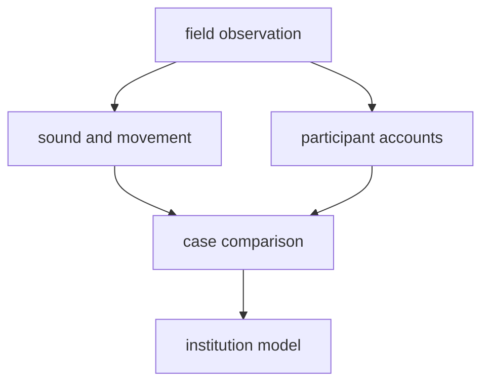

# How Musical Trance Illuminates the Origins of Religion

## 1. Executive Summary

The culturally useful research theme is not whether present-day rave-like trance groups are remnants of "primitive religion." That framing would turn living communities into evolutionary specimens. The stronger question is this:

> Under what conditions does music-induced collective altered consciousness become religious meaning, healing, social memory, and durable ritual form?

The answer requires three layers. First, there are contemporary groups and scenes in which repetitive sound, dance, chant, fasting, sleep loss, or drugs are used to cultivate altered states. Gnawa, Mevlevi Sema, zār, shamanic practices, charismatic worship, rave, and psytrance festivals all belong in the comparison, but they do not mean the same thing. Second, these cases are not fossils of early religion. They show how similar bodily affordances can be institutionalized in different ways. Third, physiology matters, but it does not settle interpretation. Rhythm, synchrony, exertion, attention, reward, arousal, and pain threshold can help produce powerful states; communities decide whether those states count as spirit possession, mystical discipline, divine presence, healing, awe, or a festival vibe.

This is not a linear claim that sound automatically causes religion. It is a research model: sound can coordinate bodies; coordinated bodies can enter unusual states; communities interpret those states; repeated interpretation can become ritual institution.

## 2. Reframing The Question

"Primitive religion" is a historically loaded phrase. Nineteenth-century theorists such as E.B. Tylor linked religion's origin to animism, comparison, and cultural evolution. Contemporary anthropology cannot simply inherit that frame, because it often treats present communities as survivals of an earlier human stage rather than as historical actors shaped by migration, slavery, urbanization, media, law, commerce, and self-interpretation.<SourceNote>Timothy Larsen's [E.B. Tylor, religion and anthropology](https://www.cambridge.org/core/journals/british-journal-for-the-history-of-science/article/eb-tylor-religion-and-anthropology/9108520252707FA2B1623D0DD6402410) examines Tylor's work on religion, animism, comparison, and cultural evolution in the history of anthropology.</SourceNote>

The research problem should therefore be stated as a mechanism and institution problem:

> How do music-induced trance practices translate bodily synchrony and altered awareness into spirit relations, healing authority, social bonding, or self-transformation?

Rave is valuable here precisely because it is not usually a doctrinal religion. Rave and psytrance festivals can combine repetitive sound, night-long dance, sleep loss, psychoactive drugs, threshold spaces, and strong group emotion. They allow comparison between explicitly religious ritual and secular or para-religious forms of collective transformation.<SourceNote>Newson et al., [I Get High With a Little Help From My Friends](https://www.frontiersin.org/journals/psychology/articles/10.3389/fpsyg.2021.719596/full), study the "4Ds" of dance, drums, sleep deprivation, and drugs in raves/free parties, linking liminality and awe with personal transformation, local group bonding, and prosocial behavior.</SourceNote>

## 3. Contemporary Comparative Cases

Contemporary music-induced trance cannot be reduced to one type. A workable comparison needs to separate spirit possession, disciplined mysticism, healing, charismatic attention, and festival transformation.

| Case | Contemporary form | Historical background | Religious or cultural interpretation |
| --- | --- | --- | --- |
| Gnawa | Moroccan music, brotherhood practice, healing ritual, and festival culture | At least the sixteenth-century history of slavery and slave trade, layered with Sufi, African, Arab-Muslim, and Berber elements | Invocation of ancestors and spirits, therapeutic possession, all-night rhythm and trance, and a mixture of sacred and secular forms |
| Mevlevi Sema | Sufi ceremony sustained in Konya, Istanbul, and Turkish communities worldwide | The Mevlevi order was founded in Konya in 1273 | Whirling, fasting, ney and tanbur music, disciplined transmission, and the soul's ascent |
| zār | A possession ritual that continues in changing forms in Egypt, Sudan, Ethiopia, Iran, and diasporic contexts | A northeastern African possession complex altered by migration, public-space restrictions, recordings, and smartphones | Spirit possession, embodied distress, choric-musical therapy, gendered healing networks |
| Shamanic trance | Indigenous traditions and contemporary neo-shamanic practices, with large regional variation | Not one universal institution; the category must be used carefully | Drumming, chant, dance, fasting, sensory restriction, and other methods are interpreted as engagement with an invisible world |
| Rave and psytrance festival | Free parties, raves, psytrance festivals, and festival spirituality | Electronic sound technology, club culture, psychedelic counterculture, and drug policy | Not usually doctrinal religion, but often interpreted through liminality, awe, identity fusion, neotrance, and "the vibe" |

Gnawa is one of the clearest contemporary cases. UNESCO describes it as a set of musical events, fraternal practices, and therapeutic rituals mixing the secular and the sacred, with urban therapeutic possession rituals through all-night rhythm and trance ceremonies.<SourceNote>UNESCO Intangible Cultural Heritage, [Gnawa](https://ich.unesco.org/en/RL/gnawa-01170), describes Gnawa as Sufi brotherhood music with ancestors and spirits, a history linked to slavery and slave trade, and therapeutic possession rituals.</SourceNote>

Mevlevi Sema provides an important contrast. It is not a rave-like release but a trained ceremonial discipline. UNESCO describes the Mevleviye as an ascetic Sufi order founded in 1273 in Konya and practiced today in Turkish communities worldwide, especially Konya and Istanbul.<SourceNote>UNESCO Intangible Cultural Heritage, [Mevlevi Sema ceremony](https://ich.unesco.org/en/RL/mevlevi-sema-ceremony-00100), summarizes whirling dance, fasting, music, symbolic ascent, and intergenerational transmission.</SourceNote>

zār is useful because it shows persistence through transformation. A 2025 OpenEdition article traces Cairo and Nile Delta zār recordings from the 1932 Arab Music Congress to village practitioner recordings from the 1970s through 1990s and contemporary circulation on smartphones. The point is not that zār is static. It persists by moving between public and private space, sacred space and recorded sound, marginalization and new media.<SourceNote>Kawkab Tawfik, [History, Technologies, and Circulation of Zâr Recordings in Cairo and the Nile Delta](https://journals.openedition.org/esma/7272?lang=en), treats zār as a northeastern African possession ritual involving choric-musical therapy, trance, recordings, smartphone circulation, and privatized ritual space.</SourceNote>

Rave and psytrance should stay in the comparison without being forced into the category of religion. St John analyzes psytrance festivals as a form of "neotrance," where technology, New Age spirituality, liminality, and collective effervescence intersect.<SourceNote>Graham St John, [Neotrance and the Psychedelic Festival](https://dj.dancecult.net/index.php/dancecult/article/view/270/230), analyzes religio-spiritual characteristics of psytrance festivals, the relation between New Age and techno, technology, liminality, and the festival vibe.</SourceNote>

## 4. Historical Background: Convergence, Not Survival

These cases do not form one continuous lineage. Mevlevi Sema belongs to Sufi discipline. Gnawa crosses slavery, Sufi practice, urban festival culture, and healing ritual. zār has been reshaped by sound recording, public-space constraints, and smartphones. Rave emerged from late twentieth-century electronic sound, club culture, counterculture, and drug politics.

The better hypothesis is convergence. Human bodies respond to repetitive rhythm, synchronized movement, breathing, darkness, fatigue, expectation, attention, and loud sound. Societies then interpret those responses through different vocabularies: spirits, ancestors, healing, prayer, self-transformation, friendship, resistance, or commerce.

Rouget's classic argument remains decisive. He accepted that ritual trance is often associated with music, but rejected a universal law linking music and trance. The relation depends on systems of meaning and cultural behavior.<SourceNote>University of Chicago Press, [Music and Trance](https://press.uchicago.edu/ucp/books/book/chicago/M/bo5956162.html), summarizes Rouget's argument that music and trance are related in many culturally specific ways and should not be reduced to a universal neurophysiological law.</SourceNote> Becker extends this problem by joining scientific and cultural approaches to music, emotion, and trancing.<SourceNote>Indiana University Press, [Deep Listeners](https://iupress.org/9780253216724/deep-listeners/), presents Judith Becker's work as a synthesis of scientific and cultural approaches to music, emotion, and trancing.</SourceNote>

This changes how "origins of religion" should be studied. Religion need not begin as doctrine, scripture, or theology. It may also be modeled as a repeated linkage among body, sound, place, specialists, taboo, healing, gift, death, spirit, and memory. That is not proof of the true origin of religion. It is a comparative model of conditions under which religious institutions can form.

## 5. Religious Interpretation: Communities Classify The State

The same bodily alteration can be interpreted differently.

In possession settings, music can summon or index spirits and help participants enter a relation with them. Gnawa and zār are close to this type, though possession should not be reduced to "takeover." It can include diagnosis, negotiation, care, gendered authority, and ritual expertise.

In mystical discipline, music and movement symbolize approach to God, self-emptying, and disciplined transformation. Mevlevi Sema's whirling belongs here: it is an embodied technique within a trained Sufi order.

In charismatic worship, music orients attention toward God and can intensify divine presence as experienced by the worshipper. A 2022 experiment with 60 believers found that stronger focus on God corresponded with stronger religious experience and that religious music generated deeper worship experience than secular music.<SourceNote>Walter and Altorfer, [The psychological role of music and attentional control for religious experiences in worship](https://pmc.ncbi.nlm.nih.gov/articles/PMC9619243/), Quarterly Journal of Experimental Psychology, DOI [10.1177/17470218221075330](https://doi.org/10.1177/17470218221075330), studied music conditions, attention, and worship experience.</SourceNote>

In rave and psytrance settings, experience is not usually explained through spirits or doctrine. Participants may instead speak of awe, liminality, vibe, tribe, self-transformation, and belonging. This makes rave analytically useful: it shows how strong collective experience can emerge without a church, lineage, or explicit theology.

## 6. Physiological Mechanisms

Physiology is necessary but not sufficient. The strongest current claims concern synchrony, arousal, attention, reward, pain threshold, and affiliation.

| Input | Plausible mechanism | Evidence status | Anthropological caution |
| --- | --- | --- | --- |
| Repetitive rhythm | Prediction, entrainment, attentional fixation | Moderate | Rhythm alone does not create religious meaning |
| Synchronized movement | Self-other merging, coordination, trust | Moderate to strong | Who synchronizes, and who is excluded, matters |
| Exertive movement | Higher pain threshold and possible endogenous opioid involvement | Moderate | Pain threshold is a proxy, not a direct endorphin measure |
| Music-evoked emotion | Dopamine, cortisol, oxytocin, opioid peptides, and related systems | Moderate | Clinical and everyday music studies cannot be transferred wholesale to ritual |
| Ritual context | Expectation, role, permission, interpretation, memory | Strong qualitative grounding | Social classification turns body state into religious experience |

Tarr, Launay, Cohen, and Dunbar experimentally showed that synchrony and exertion during dance independently raised pain threshold and encouraged in-group bonding.<SourceNote>Biology Letters, [Synchrony and exertion during dance independently raise pain threshold and encourage social bonding](https://royalsocietypublishing.org/doi/10.1098/rsbl.2015.0767), DOI [10.1098/rsbl.2015.0767](https://doi.org/10.1098/rsbl.2015.0767), reports experimental findings on dance, pain threshold, and bonding.</SourceNote>

Tarr, Launay, and Dunbar also review music and social bonding through self-other merging and neurohormonal mechanisms. Their key point for anthropology is that music supplies an external rhythmic framework capable of coordinating large groups.<SourceNote>Frontiers in Psychology, [Music and social bonding: self-other merging and neurohormonal mechanisms](https://www.frontiersin.org/journals/psychology/articles/10.3389/fpsyg.2014.01096/full), DOI [10.3389/fpsyg.2014.01096](https://doi.org/10.3389/fpsyg.2014.01096), reviews rhythm, synchrony, endorphins, and social bonding.</SourceNote>

Music neurochemistry remains promising but incomplete. Chanda and Levitin review evidence that music engages systems related to reward, motivation, pleasure, stress, arousal, immunity, and social affiliation, while noting that scientific inquiry into music's neurochemical effects is still early.<SourceNote>PubMed, [The neurochemistry of music](https://pubmed.ncbi.nlm.nih.gov/23541122/), records Chanda and Levitin, Trends in Cognitive Sciences, 2013, DOI [10.1016/j.tics.2013.02.007](https://doi.org/10.1016/j.tics.2013.02.007).</SourceNote>

Recent shamanic trance research shows the same caution. A 2024 scoping review identified 27 eligible studies across phenomenology, psychology, neurophysiological functions, and clinical applications. It suggests that shamanic trances can be non-pathological and different from ordinary consciousness, but the evidence base remains small and heterogeneous.<SourceNote>Marie et al., [Scoping review on shamanistic trances practices](https://link.springer.com/article/10.1186/s12906-024-04678-w), BMC Complementary Medicine and Therapies, 2024, DOI [10.1186/s12906-024-04678-w](https://doi.org/10.1186/s12906-024-04678-w), emphasizes both multidisciplinary findings and methodological limitations.</SourceNote>

## 7. Proposed Research Theme

The proposed research theme is:

> A comparative ethnography of how acoustic synchrony becomes institutionalized as religious meaning.

The unit of analysis is not "groups that enter trance through sound." It is the full cycle through which trance is classified, authorized, narrated, remembered, and connected to future participation.

### Research Questions

1. Which combinations of repetitive sound, dance, chant, fasting, sleep loss, drugs, and prayer reliably shape participants' altered states?
2. Which vocabulary classifies the state: possession, ecstasy, healing, divine presence, awe, vibe, or identity fusion?
3. What remains after the event: healing, belonging, obligation, donation, taboo, discipleship, friendship, political sentiment, or consumption?
4. How do recordings, smartphones, large sound systems, social media, and festival economies change ritual legitimacy and transmission?

### Comparative Design

The design should be comparative ethnography, not a short impressionistic visit. Candidate cases include Gnawa lila, Mevlevi Sema, private zār practice, psytrance festivals, and charismatic worship. Each case should be observed through the same units: preparation, first sound, bodily synchrony, peak experience, expert intervention, post-event interpretation, and connection to future participation.

Physiological measures can be added only with restraint: heart rate, movement synchrony, subjective altered-state scales, pain threshold, sleep loss, sound level, and tempo. Recording and wearables touch sacredness, secrecy, gender, safety, drugs, and legal risk, so consent and ethics review are not optional. The aim is not to debunk mystical experience. It is to explain how bodily conditions, cultural interpretation, and institutional consequences join.

## 8. Hypotheses And Implications

This theme can test five hypotheses.

1. Bodily synchrony is not sufficient for religious trance, but it is a major condition for intensified group experience.
2. Trance becomes religious institution when specialists, stories, diagnosis, taboo, repeated schedules, participant roles, and post-event interpretation stabilize it.
3. Rave-like experience approaches religion not simply when sound or drugs are intense, but when liminality and awe become personal transformation and durable belonging.
4. Recording and smartphones do not only weaken ritual. In zār, they can help practices persist in private spaces after public space becomes harder to use.
5. The origins of religion can be studied as a process in which bodily synchrony, transcendence interpretation, healing, spirit relations, and collective memory become repeatable.

The practical implications extend beyond religion. Music festivals, sports crowds, political rallies, military training, corporate events, and online communities all use rhythm, synchrony, threshold time, and strong feeling to create belonging. The difference is what remains afterward: obligation, ethics, salvation, healing, lineage, authority, and prohibition are much thicker in religious ritual than in most commercial events.

## 9. Risks And Limits

The first risk is calling contemporary practice "primitive religion." That does not explain; it freezes living people in someone else's past. The more precise phrase is "contemporary comparative cases that illuminate hypotheses about early religious formation."

The second risk is pathologizing trance. zār and possession trance intersect with psychiatric categories, but they cannot be exhausted by them. Mianji and Semnani examine zār in relation to DSM-IV and DSM-5 while treating it as a cultural concept of distress.<SourceNote>Mianji and Semnani, [Zār Spirit Possession in Iran and African Countries](https://ijps.tums.ac.ir/index.php/ijps/article/view/574), Iranian Journal of Psychiatry, analyze zār as group distress, culture-bound syndrome, and cultural concept of distress.</SourceNote>

The third risk is physiological reductionism. Rhythm, EEG, dopamine, endorphins, and oxytocin matter, but they do not explain why a state is read as God, spirit, healing, or community.

The fourth risk is overgeneralizing rave studies. Retrospective self-report and drug-use contexts limit causal claims. Awe and identity fusion for one participant may be entertainment, escape, commercial consumption, or danger for another.

## 10. Conclusion

Groups that use music, repetitive rhythm, and dance to cultivate trance-like states do exist today. Some are explicitly religious, such as Gnawa, Mevlevi Sema, zār, shamanic practices, and charismatic worship. Others, such as rave and psytrance festivals, are secular or para-religious comparison cases.

The anthropologically valuable question is not whether these are primitive religion. It is how acoustic synchrony changes bodies, and how changed bodies are translated into spirits, healing, community, self-transformation, and institutions.

This theme does not prove the origin of religion. It decomposes possible conditions of religious formation: repeated sound, synchronized bodies, threshold time, interpreting community, and institutions that carry the experience forward. That combination lets us see religion not only as belief, but as a cultural technology for organizing body and society at the same time.

## References

- Gilbert Rouget, [Music and Trance](https://press.uchicago.edu/ucp/books/book/chicago/M/bo5956162.html), University of Chicago Press.
- Judith Becker, [Deep Listeners](https://iupress.org/9780253216724/deep-listeners/), Indiana University Press.
- UNESCO Intangible Cultural Heritage, [Gnawa](https://ich.unesco.org/en/RL/gnawa-01170).
- UNESCO Intangible Cultural Heritage, [Mevlevi Sema ceremony](https://ich.unesco.org/en/RL/mevlevi-sema-ceremony-00100).
- Kawkab Tawfik, [History, Technologies, and Circulation of Zâr Recordings in Cairo and the Nile Delta](https://journals.openedition.org/esma/7272?lang=en).
- Martha Newson et al., [I Get High With a Little Help From My Friends](https://www.frontiersin.org/journals/psychology/articles/10.3389/fpsyg.2021.719596/full).
- Bronwyn Tarr, Jacques Launay, and Robin Dunbar, [Music and social bonding](https://www.frontiersin.org/journals/psychology/articles/10.3389/fpsyg.2014.01096/full).
- Bronwyn Tarr et al., [Synchrony and exertion during dance](https://royalsocietypublishing.org/doi/10.1098/rsbl.2015.0767).
- Nolwenn Marie et al., [Scoping review on shamanistic trances practices](https://link.springer.com/article/10.1186/s12906-024-04678-w).
