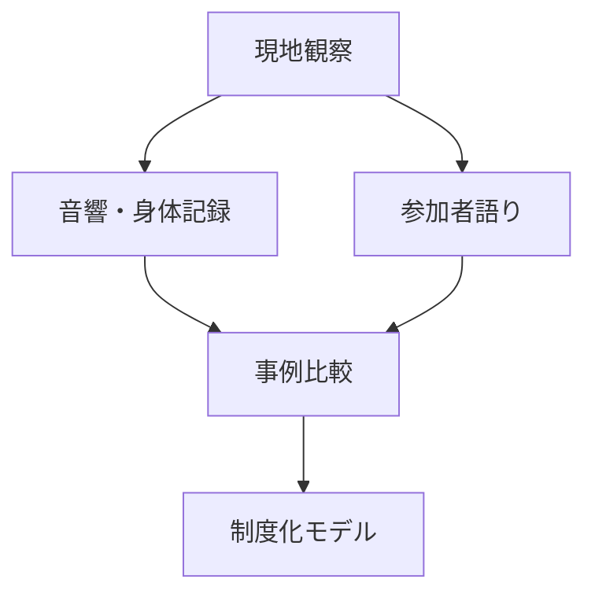

# 音響的トランスは宗教の起源をどう照らすか

## 1. エグゼクティブサマリー

本レポートで立てる文化人類学的な調査テーマは、「音楽による集団的変性意識が、どの条件で宗教的意味、治癒、共同体記憶、規範へ制度化されるのか」である。出発点は、レイブのような反復音楽と身体同期によってトランス状態に入る集団が現在も存在するか、という問いである。しかし、その問いをそのまま「原始宗教の生き残り探し」にすると、現代の宗教共同体や音楽文化を進化段階の標本として扱う危険がある。したがって、ここでは「原始宗教」を実体名ではなく、宗教起源論をめぐる仮説群として扱う。

結論は四点である。

1. 音楽、反復リズム、踊り、睡眠不足、薬物、断食、祈祷を組み合わせるトランス儀礼は現在もある。Gnawa、Mevlevi Sema、zār、シャーマニックな実践、Pentecostal/charismatic worship、psytrance/rave festival は、それぞれ異なる制度と解釈を持つ。
2. それらは「宗教の起源を再現する化石」ではない。むしろ、身体同期という生理学的アフォーダンスが、神霊、祖霊、治癒、自己変容、共同体帰属という意味体系に組み込まれる複数の道筋を示している。
3. 生理学的には、反復音響、運動同期、呼吸、疲労、覚醒、報酬系、痛覚閾値、注意制御が関与する。ただし、音が自動的に宗教的トランスを生むわけではない。Rouget が強調したように、音楽とトランスの関係は文化的意味体系に依存する。<SourceNote>Rouget の古典的整理は University of Chicago Press の [Music and Trance](https://press.uchicago.edu/ucp/books/book/chicago/M/bo5956162.html) に要約されている。出版社解説は、音楽とトランスの間に普遍法則はなく、文化的文脈の意味体系に依存すると説明する。</SourceNote>
4. 価値ある調査テーマは、宗教を「信念体系」だけでなく「音響、身体、場、解釈、記憶、制度が結合した技術」として見る比較民族誌である。

この図は、音楽がトランスを直接「発生」させるという単線モデルではない。音楽は身体を同期させ、同期した身体が変性意識を経験し、その経験が共同体の語彙で解釈され、反復可能な儀礼制度へ組み込まれる、という研究仮説である。

## 2. 問いの立て直し

「原始宗教」という言葉は慎重に扱う必要がある。19世紀の宗教起源論では、Tylor の animism 論や比較進化論が、宗教の発生を人類文化の段階論として説明しようとした。現代の文化人類学では、この発想をそのまま採用しない。現在生きている宗教や音楽文化を「過去の残存」と見ると、当事者の歴史、政治、都市化、メディア、商品化、自己解釈を消してしまうからである。<SourceNote>Timothy Larsen の [E.B. Tylor, religion and anthropology](https://www.cambridge.org/core/journals/british-journal-for-the-history-of-science/article/eb-tylor-religion-and-anthropology/9108520252707FA2B1623D0DD6402410) は、Tylor が宗教の発生、animism、比較法、文化進化論をどのように結び付けたかを歴史的に検討している。</SourceNote>

そこで、本レポートの研究テーマを次のように定義する。

> 音楽誘導トランスは、身体同期と変性意識を、どのように宗教的意味、治癒、社会的絆、集団記憶へ変換するのか。

この問いの文化人類学的価値は、宗教を「信じる内容」だけでなく、「身体を揃え、場を作り、経験を分類し、共同体がそれを記憶する実践」として分析できる点にある。レイブはこの問いにとって重要な比較対象である。なぜなら、レイブや psytrance festival は、必ずしも教義宗教ではないのに、反復音響、夜通しの踊り、境界的な時間、集団的高揚、自己変容の語彙を持つからである。<SourceNote>Newson et al. の Frontiers in Psychology 論文 [I Get High With a Little Help From My Friends](https://www.frontiersin.org/journals/psychology/articles/10.3389/fpsyg.2021.719596/full) は、rave/free party における dance, drums, sleep deprivation, drugs の組み合わせを 4Ds と呼び、liminality と awe を介した個人変容、local raver group への結合、向社会行動との関連を調べている。</SourceNote>

## 3. 現在存在する比較対象

現代に存在する音楽誘導トランスの場は、一つの型に収まらない。比較するなら、少なくとも「神霊・祖霊との関係」「修行・祈り」「治癒」「世俗的祝祭」「自己変容」を分けて見る必要がある。

| 事例 | 現在の存在形態 | 歴史的背景 | 宗教的・文化的解釈 |
| --- | --- | --- | --- |
| Gnawa | モロッコで音楽、友愛組織、治癒儀礼、祭礼として継承 | 少なくとも16世紀以降の奴隷制・奴隷交易、Sufi、アフリカ、Arab-Muslim、Berber の重層 | 祖霊・精霊の喚起、治癒、all-night rhythm and trance、secular と sacred の混合 |
| Mevlevi Sema | Konya、Istanbul、世界のトルコ系共同体で継承されるSufi儀礼 | 1273年にKonyaで成立した Mevlevi order | whirling、断食、ney や tanbur を含む音楽、魂の上昇として解釈される訓練された儀礼 |
| zār | エジプト、Sudan、Ethiopia、Iran などで形を変えながら存続 | 北東アフリカ起源の possession ritual。公共空間の制約、移住、録音、スマートフォンで変容 | 霊的所有、身体・心理的苦痛の解釈、合唱的音楽療法、女性の治癒ネットワーク |
| shamanistic trance | Indigenous tradition と neo-shamanic practice の双方で研究対象 | 地域差が大きく、単一の「シャーマニズム」に還元できない | 太鼓、歌、踊り、断食、感覚制限などで意識状態を変え、不可視世界との交渉として語られる |
| rave / psytrance festival | free party、rave、psytrance festival、festival spirituality | counterculture、club culture、psychedelic culture、音響技術、薬物文化の交差 | 教義宗教ではないが、liminality、awe、identity fusion、neotrance、the vibe として経験される |

Gnawa は、現在存在する宗教的音楽トランスの強い事例である。UNESCO は Gnawa を、世俗と聖性を混ぜる音楽イベント、友愛実践、治癒儀礼として説明し、都市部では all-night rhythm and trance による therapeutic possession ritual があると記述している。<SourceNote>UNESCO Intangible Cultural Heritage の [Gnawa](https://ich.unesco.org/en/RL/gnawa-01170) は、2019年登録の項目として、Sufi brotherhood music、祖先・精霊の喚起、奴隷制・奴隷交易に遡る歴史、治癒的 possession ritual を説明している。</SourceNote>

Mevlevi Sema は、レイブ的な「解放」よりも、訓練、型、教団、象徴に重心を置く。UNESCO は Mevleviye を1273年にKonyaで成立した ascetic Sufi order と説明し、今日も世界のトルコ系共同体に存在し、Konya と Istanbul が中心だと述べる。<SourceNote>UNESCO Intangible Cultural Heritage の [Mevlevi Sema ceremony](https://ich.unesco.org/en/RL/mevlevi-sema-ceremony-00100) は、whirling dance、断食、音楽、魂の上昇の象徴、世代間伝承をまとめている。</SourceNote>

zār は、治癒と possession をめぐる比較に有効である。2025年の OpenEdition 論文は、Cairo と Nile Delta の zār 録音史を追い、1932年 Arab Music Congress の録音、1970-1990年代の村落実践者の録音、スマートフォン上の流通を分析している。ここで重要なのは、zār が単に「消えゆく伝統」ではなく、公共空間の制約、共同体の移動、私的空間への移行、録音メディアによって実践形態を変えている点である。<SourceNote>Kawkab Tawfik の [History, Technologies, and Circulation of Zâr Recordings in Cairo and the Nile Delta](https://journals.openedition.org/esma/7272?lang=en) は、zâr を北東アフリカ起源の possession ritual とし、choric-musical therapy、trance、録音、スマートフォン流通、私的空間化を扱う。</SourceNote>

レイブや psytrance festival は、宗教ではなくても、比較から外すべきではない。St John は Dancecult の論文で psytrance festival の religio-spiritual characteristics を neotrance として論じ、festival を liminal な場、technology と spirituality が交差する場として読む。<SourceNote>Graham St John の [Neotrance and the Psychedelic Festival](https://dj.dancecult.net/index.php/dancecult/article/view/270/230) は、psytrance festival の宗教的・霊性的特徴、New Age と techno の接合、technology、liminality、the vibe を分析している。</SourceNote>

## 4. 歴史的背景: 連続ではなく収束

音楽誘導トランスの歴史を一本の系譜にすることはできない。Mevlevi Sema はSufi修行の歴史を持ち、Gnawa は奴隷制、Sufi実践、都市祭礼、治癒儀礼を横断し、zār は公共空間とメディア環境の変化に応じて姿を変え、rave は20世紀後半の電子音響技術、club culture、counterculture、薬物政策の中で形成された。

したがって、「レイブは原始宗教の再来である」とは言えない。より正確には、異なる社会が似た身体的資源を別々に制度化してきた、という収束の仮説である。人間の身体は、反復リズム、集団運動、疲労、呼吸、音量、暗闇、期待、注意集中に反応する。社会は、その反応を神霊、祖霊、治癒、祈り、自己変容、友情、反抗、商品化の語彙で解釈する。

Rouget の価値は、まさにこの点にある。彼は音楽とトランスの結び付きを認めながら、太鼓やリズムの普遍的な神経効果だけで説明する還元主義を退けた。Becker はこの議論を、音楽、emotion、trancing の科学的・文化的接合へ広げた。<SourceNote>Indiana University Press の [Deep Listeners](https://iupress.org/9780253216724/deep-listeners/) は、Judith Becker が科学的アプローチと文化的アプローチを結び、music, emotion, trancing を論じた書籍として紹介している。</SourceNote>

この観点からは、宗教起源論の焦点も変わる。宗教は、最初から教義、聖典、神学として現れたのではなく、身体、音、場、語り、記憶、専門家、禁忌、贈与、治癒、死者との関係が結び付く過程で制度化された可能性がある。これは「宗教の真の起源」を断定する主張ではなく、観察可能な現代事例から、初期宗教形成にあり得たメカニズムをモデル化する研究テーマである。

## 5. 宗教的解釈: トランスの意味は共同体が決める

同じように見える身体状態でも、宗教的解釈は大きく異なる。

第一に、possession 型では、音楽は霊や神格を呼び、参加者がそれと関係を結ぶ媒介になる。Gnawa や zār はこの型に近い。ただし、possession は単なる「乗っ取り」ではない。苦痛の診断、交渉、治療、共同体のケア、ジェンダー化された役割、専門家の権威を含む。

第二に、mystical discipline 型では、音楽と運動は自我の放棄や神への接近を表す。Mevlevi Sema の whirling は、自由な陶酔ではなく、訓練された身体技法であり、Sufi的な上昇の象徴として理解される。

第三に、charismatic worship 型では、音楽は神への注意を集中させ、共同体で経験される divine presence を強める。2022年の実験研究は、60人の信者を対象に worship experience の音楽条件と注意制御を調べ、神への focus が強いほど宗教経験が強くなること、宗教曲が世俗曲より深い経験を生むことを示した。<SourceNote>Walter and Altorfer の [The psychological role of music and attentional control for religious experiences in worship](https://pmc.ncbi.nlm.nih.gov/articles/PMC9619243/) は、Quarterly Journal of Experimental Psychology 掲載、DOI [10.1177/17470218221075330](https://doi.org/10.1177/17470218221075330) の実験研究である。</SourceNote>

第四に、rave/psytrance 型では、経験は必ずしも神霊語彙で説明されない。参加者は awe、liminality、vibe、tribe、self-transformation、belonging の語彙を使うことがある。この型は「宗教ではないから関係ない」のではなく、宗教的制度がなくても、身体同期が集団帰属と意味生成を生む条件を示す。

## 6. 生理学的には何が起きているのか

生理学的説明は必要だが、それだけでは足りない。現時点で比較的堅いのは、音楽と集団運動が同期、覚醒、報酬、痛覚、注意、社会的接近を変えるという範囲である。

| 入力 | あり得る生理・心理機構 | 根拠の強さ | 人類学的な注意点 |
| --- | --- | --- | --- |
| 反復リズム | 予測、entrainment、注意の固定 | 中 | リズムだけで宗教的意味は生まれない |
| 同期運動 | self-other merging、協調、信頼 | 中から強 | 誰と同期するか、誰が除外されるかが重要 |
| 強い運動 | 痛覚閾値上昇、内因性 opioid 系の関与可能性 | 中 | pain threshold は endorphin の代理指標であり直接測定ではない |
| 音楽による情動 | dopamine、cortisol、oxytocin、opioid peptides などの関与 | 中 | 臨床・日常音楽研究から儀礼へそのまま外挿できない |
| 儀礼文脈 | 期待、役割、許可、解釈、記憶 | 強い定性的根拠 | 生理状態を宗教経験として分類する社会的条件が必要 |

Tarr, Launay, Cohen, and Dunbar の実験は、dance における synchrony と exertion がそれぞれ pain threshold と in-group bonding を高めることを示した。これは、集団で踊ることが単なる娯楽ではなく、身体を通じて集団結合を変える可能性を示す。<SourceNote>Biology Letters の [Synchrony and exertion during dance independently raise pain threshold and encourage social bonding](https://royalsocietypublishing.org/doi/10.1098/rsbl.2015.0767) は、DOI [10.1098/rsbl.2015.0767](https://doi.org/10.1098/rsbl.2015.0767) の実験研究である。</SourceNote>

Tarr, Launay, and Dunbar のレビューは、music による social bonding を self-other merging と neurohormonal mechanisms の二つから説明する。ここで重要なのは、音楽が外部の rhythmic framework を提供し、大規模な同期を可能にするという点である。<SourceNote>Frontiers in Psychology の [Music and social bonding: self-other merging and neurohormonal mechanisms](https://www.frontiersin.org/journals/psychology/articles/10.3389/fpsyg.2014.01096/full) は、DOI [10.3389/fpsyg.2014.01096](https://doi.org/10.3389/fpsyg.2014.01096) のレビューである。</SourceNote>

音楽の神経化学については、Chanda and Levitin が reward, motivation, pleasure、stress and arousal、immunity、social affiliation に関わる神経化学系をレビューした。ただし、彼ら自身も科学的 inquiry はまだ初期段階だと位置づけている。<SourceNote>PubMed の [The neurochemistry of music](https://pubmed.ncbi.nlm.nih.gov/23541122/) は、Chanda and Levitin, Trends in Cognitive Sciences, 2013, DOI [10.1016/j.tics.2013.02.007](https://doi.org/10.1016/j.tics.2013.02.007) を記録している。</SourceNote>

シャーマニック・トランス研究も同じ限界を持つ。2024年の scoping review は、27本の研究を phenomenology、psychology、neuro-physiological functions、clinical applications に分類し、shamanic trance が非病理的で、通常意識とは現象学的・神経生理学的に異なる可能性を示す一方、研究の小規模性、統制群の不足、一般化の難しさを強調する。<SourceNote>Marie et al. の [Scoping review on shamanistic trances practices](https://link.springer.com/article/10.1186/s12906-024-04678-w) は、BMC Complementary Medicine and Therapies, 2024, DOI [10.1186/s12906-024-04678-w](https://doi.org/10.1186/s12906-024-04678-w) のオープンアクセス論文である。</SourceNote>

## 7. 提案する調査テーマ

本レポートから導ける調査テーマは、次のように定式化できる。

> 音響的同期化が宗教的意味へ制度化される条件の比較民族誌。

対象は、「音でトランスになる集団」ではなく、「トランスをどう分類し、誰が正当化し、どのように記憶し、次回の儀礼へ接続するか」である。

### 研究質問

1. 反復音響、踊り、歌、断食、睡眠不足、薬物、祈祷のどの組み合わせが、参加者の変性意識を安定的に誘導するのか。
2. その状態は、possession、ecstasy、healing、divine presence、awe、vibe、identity fusion のどの語彙で解釈されるのか。
3. 経験後に何が残るのか。治癒、帰属、義務、寄付、禁忌、弟子入り、友情、政治性、消費行動のどれへ接続されるのか。
4. 録音、スマートフォン、巨大音響、SNS、festival economy は、儀礼の正当性と伝承をどう変えるのか。

### 比較デザイン

方法は、短期の印象記ではなく、比較民族誌が望ましい。候補は Gnawa の lila、Mevlevi Sema、zār の私的実践、psytrance festival、charismatic worship である。各ケースで、儀礼前準備、音の始まり、身体同期、ピーク経験、専門家の介入、終了後の語り、次回参加への接続を同じ観察単位で記録する。

生理学的測定を加えるなら、心拍、動作同期、主観的変性意識尺度、痛覚閾値、睡眠不足、音量、テンポを最小限にする。録音やウェアラブルは、聖性、秘匿性、ジェンダー、安全、薬物使用、法的リスクに触れるため、当事者の同意と研究倫理審査を前提にする。ここでの目的は「神秘体験の正体を暴く」ことではなく、身体的条件、文化的解釈、制度的帰結の結合を説明することである。

## 8. 仮説と応用上の注意

このテーマは、次の仮説を検証できる。

1. 身体同期は宗教的トランスの十分条件ではないが、集団経験を強める基盤条件である。
2. トランスが宗教制度に変わるには、専門家、物語、診断、禁忌、反復日程、参加者の役割、終了後の解釈が必要である。
3. レイブ的経験が宗教に近づくのは、音響と薬物の強度が高い時ではなく、liminality と awe が個人変容と長期の帰属へ接続される時である。
4. 録音とスマートフォンは儀礼を弱めるだけではない。zār のように、公共空間から追いやられた実践を私的空間で持続させることもある。
5. 「宗教の起源」は、単一の信念の発明ではなく、身体同期、超越解釈、治癒、死者・霊との関係、共同体記憶が束になって反復可能になる過程として研究できる。

実務的には、この研究は宗教理解だけでなく、音楽フェス、スポーツ応援、政治集会、軍事訓練、企業イベント、オンラインコミュニティにも応用できる。どれも、反復音響、身体同期、境界的時間、強い感情を使って帰属を作る。ただし、宗教儀礼と商業イベントを同一視してはいけない。違いは、経験後に残る義務、倫理、救済、治癒、系譜、権威、禁止の厚みにある。

## 9. リスク・限界

第一のリスクは、現代の実践を「原始宗教」と呼んでしまうことである。これは説明ではなく、当事者を過去に閉じ込める分類である。研究上は「初期宗教形成に関する仮説を照らす現代比較事例」と呼ぶべきである。

第二のリスクは、トランスを病理化することである。zār や possession trance は、精神医学的カテゴリーと接触することがあるが、それだけで説明できない。Mianji and Semnani は zār を DSM-IV/DSM-5 の文脈で検討しつつ、cultural concept of distress として理解する必要を示している。<SourceNote>Mianji and Semnani の [Zār Spirit Possession in Iran and African Countries](https://ijps.tums.ac.ir/index.php/ijps/article/view/574) は、Iranian Journal of Psychiatry 掲載の narrative review で、zār を group distress、culture-bound syndrome、cultural concept of distress の観点から扱う。</SourceNote>

第三のリスクは、生理学的還元である。リズム、脳波、dopamine、endorphin、oxytocin は重要だが、それだけでは「なぜこの状態が神、霊、治癒、共同体の経験として読まれるのか」を説明できない。

第四のリスクは、レイブ研究の一般化である。rave/free party の研究には retrospective self-report や drug-use context の限界がある。ある参加者にとっての awe や identity fusion は、別の参加者にとっては娯楽、逃避、商業消費、危険経験かもしれない。

## 10. 結論

現在、レイブのような音楽、反復リズム、踊りによってトランス状態を得る集団は存在する。宗教的儀礼としては Gnawa、Mevlevi Sema、zār、各地の shamanistic practice、charismatic worship があり、世俗的・準宗教的比較対象として rave や psytrance festival がある。

しかし、文化人類学的に価値があるのは、「それらは原始宗教か」と問うことではない。価値があるのは、音響的同期化がどのように身体を変え、その身体経験がどのように神霊、治癒、共同体、自己変容、制度へ翻訳されるのかを比較することである。

この研究テーマは、宗教の起源を断定しない。その代わり、宗教が成立し得る条件を分解する。反復音、同期する身体、境界的な時間、解釈する共同体、経験を引き受ける制度。その結合が、宗教を信念の体系ではなく、身体と社会を同時に編成する文化技術として見せてくれる。

## 参考情報

- Gilbert Rouget, [Music and Trance](https://press.uchicago.edu/ucp/books/book/chicago/M/bo5956162.html), University of Chicago Press.
- Judith Becker, [Deep Listeners](https://iupress.org/9780253216724/deep-listeners/), Indiana University Press.
- UNESCO Intangible Cultural Heritage, [Gnawa](https://ich.unesco.org/en/RL/gnawa-01170).
- UNESCO Intangible Cultural Heritage, [Mevlevi Sema ceremony](https://ich.unesco.org/en/RL/mevlevi-sema-ceremony-00100).
- Kawkab Tawfik, [History, Technologies, and Circulation of Zâr Recordings in Cairo and the Nile Delta](https://journals.openedition.org/esma/7272?lang=en).
- Martha Newson et al., [I Get High With a Little Help From My Friends](https://www.frontiersin.org/journals/psychology/articles/10.3389/fpsyg.2021.719596/full).
- Bronwyn Tarr, Jacques Launay, and Robin Dunbar, [Music and social bonding](https://www.frontiersin.org/journals/psychology/articles/10.3389/fpsyg.2014.01096/full).
- Bronwyn Tarr et al., [Synchrony and exertion during dance](https://royalsocietypublishing.org/doi/10.1098/rsbl.2015.0767).
- Nolwenn Marie et al., [Scoping review on shamanistic trances practices](https://link.springer.com/article/10.1186/s12906-024-04678-w).
