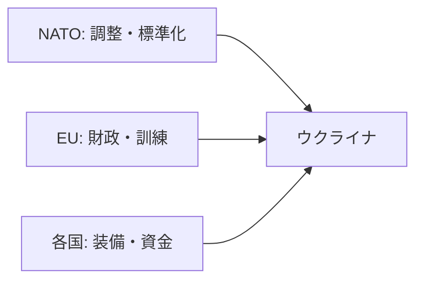

# NATOと欧米諸国のウクライナ支援の最新状況

## 1. エグゼクティブサマリー

2026年5月時点の対ウクライナ支援は、NATOという組織が単独で支える構図ではなく、NATOが「調整・標準化・訓練の器」を提供し、実際の資金と装備はEU・米国・英独仏・北欧・東欧の各国が分担する構図になっている。NATO公式資料でも、支援の大半は同盟国とパートナー国から来ており、NATO自体の役割は NSATU、CAP、JATEC、PURL などの枠組みを通じた束ね役に近い。<SourceNote>[NATO, Ukraine support and NATO's role](https://www.nato.int/cps/en/natohq/topics_192648.htm), [NATO Summit, NATO's support for Ukraine](https://www.nato.int/cps/en/natohq/official_texts_236621.htm).</SourceNote>

EU は財政支援と訓練の重心を担っている。2026年4月には、EU理事会がウクライナ向け支援ローン総額900億ユーロ規模の設計を固め、欧州委員会は Ukraine Facility で中期の流動性を供給している。さらに EUMAM Ukraine は 9万人規模の訓練を実施し、戦場への直接介入ではなく、後方の持久力を底上げする役割を持つ。<SourceNote>[Council, 90 billion support loan to Ukraine](https://www.consilium.europa.eu/en/press/press-releases/2026/04/23/council-finalises-90-billion-support-loan-to-ukraine/), [European Commission, Ukraine Facility](https://commission.europa.eu/strategy-and-policy/eu-budget/eu-borrowings/ukraine-facility_en), [NATO on EUMAM training numbers](https://www.nato.int/cps/en/natohq/topics_192648.htm).</SourceNote>

米国は依然として最大級の単独支援国だが、支援の性格は「追加の大規模補正予算」よりも、既存の軍事支援枠、同盟国負担、武器販売、産業基盤強化を組み合わせる方向に寄っている。米国防省系の最新公表では、2026年3月31日までに米国の対ウクライナ直接支援は 678億ドル規模、NATO同盟国とパートナー国を含む安全保障支援は約1300億ドル規模と整理されている。また、ホワイトハウスの Arms Transfer Strategy は、軍需生産力・供給網・同盟国の自助努力を重視する設計を明示している。<SourceNote>[DoD / OAR report, Ukraine assistance through 2026-03-31](https://media.defense.gov/2026/Apr/01/2003695701/-1/-1/0/US-DIRECT-ASSISTANCE-TO-UKRAINE-THROUGH-MARCH-31-2026.PDF), [The White House, America First Arms Transfer Strategy](https://www.whitehouse.gov/fact-sheets/2026/04/fact-sheet-president-donald-j-trump-unveils-the-america-first-arms-transfer-strategy/).</SourceNote>

英国、ドイツ、北欧、バルト、ポーランドは、総額の大きさだけでなく、訓練、砲弾、防空、ドローン、前線ロジスティクス、共同生産の面で効いている。特に英国は訓練と継続的な年次支援、ドイツは規模と防空、北欧は早い意思決定と大きな対GDP比、バルト・ポーランドは地理的近接性を生かした即応性が強い。逆にフランスは、公開総額の見え方は相対的に薄いが、安全保障保証、連立形成、産業協力の面で存在感がある。<SourceNote>[UK government support for Ukraine](https://www.gov.uk/government/publications/uk-support-for-ukraine-factsheet/uk-support-for-ukraine-factsheet), [Germany support for Ukraine](https://www.bundesregierung.de/breg-en/news/support-to-ukraine-2328576), [France diplomatic support / coalition statements](https://www.elysee.fr/en/emmanuel-macron/2026/01/24/ukraine-european-leaders-summit), [Norway support for Ukraine](https://www.regjeringen.no/en/topics/foreign-affairs/peace-and-conflict/support-to-ukraine/id2958149/), [Denmark support for Ukraine](https://um.dk/en/foreign-policy/danish-support-for-ukraine), [Sweden support for Ukraine](https://www.government.se/government-policy/sweden-and-ukraine/), [Lithuania support for Ukraine](https://urm.lt/default/en/ukraine), [Estonia support for Ukraine](https://www.kaitseministeerium.ee/en/ukraine), [Poland support for Ukraine](https://www.gov.pl/web/diplomacy/poland-supports-ukraine).</SourceNote>

実務的には、対ウクライナ支援の中心論点は「いくら出すか」よりも、「防空、弾薬、無人機、保守、訓練、共同生産をどのチャネルで回すか」に移っている。今後の主要な不確実性は、米国議会と行政府の優先順位、EU内の財政・政治合意、そして砲弾と防空ミサイルの生産能力である。<SourceNote>[NATO role page](https://www.nato.int/cps/en/natohq/topics_192648.htm), [EU Ukraine Facility](https://commission.europa.eu/strategy-and-policy/eu-budget/eu-borrowings/ukraine-facility_en), [White House arms transfer strategy](https://www.whitehouse.gov/fact-sheets/2026/04/fact-sheet-president-donald-j-trump-unveils-the-america-first-arms-transfer-strategy/).</SourceNote>

## 2. まず結論: NATOと各国支援は別物として見る

NATO は「資金の財布」ではなく、同盟国の支援を束ねる制度設計の場である。NATO 公式資料では、NATO 自体は NSATU、CAP、JATEC、PURL などを通じて支援の調整、訓練、機材の標準化を担い、実際の供給の大半は加盟国とパートナー国が負担している。したがって、読者が「NATO がどれだけ拠出したか」を見るだけでは、実態の半分しか見えない。<SourceNote>[NATO, Ukraine support and NATO's role](https://www.nato.int/cps/en/natohq/topics_192648.htm), [NATO Summit declaration](https://www.nato.int/cps/en/natohq/official_texts_236621.htm).</SourceNote>

EU は別の意味で重要である。EU は装備の供与よりも、予算、融資、訓練、制度維持に強い。2026年春の時点では、Ukraine Facility、EUMAM、そして新たな支援ローン設計が、戦時国家の流動性を下支えしている。<SourceNote>[Council, 90 billion support loan to Ukraine](https://www.consilium.europa.eu/en/press/press-releases/2026/04/23/council-finalises-90-billion-support-loan-to-ukraine/), [European Commission, Ukraine Facility](https://commission.europa.eu/strategy-and-policy/eu-budget/eu-borrowings/ukraine-facility_en).</SourceNote>

## 3. 比較表: いま何を誰が担っているか

| 役割       | 主な担い手                                                             | 2026年春時点の中身                                                                            | 制約                                         |
| ---------- | ---------------------------------------------------------------------- | --------------------------------------------------------------------------------------------- | -------------------------------------------- |
| NATO       | NATO本体 + 同盟国                                                      | NSATU、CAP、JATEC、PURL、NATO-Ukraine Council。調整、標準化、訓練、米国装備の共同調達を束ねる | NATO自体に大きな拠出原資はない               |
| EU         | 欧州委員会、理事会、加盟国                                             | Ukraine Facility、EUMAM、支援ローン、マクロ金融支援                                           | 財政合意、加盟国間の足並み、輸送・生産能力   |
| 米国       | 行政府、議会、国防省                                                   | 直接軍事支援、武器販売、同盟国の調達支援、情報・訓練支援                                      | 国内生産優先、議会政治、在庫・生産能力       |
| 英国       | 英政府                                                                 | 年次の軍事支援、Interflex訓練、防空・ドローン支援                                             | 在庫補充と財政規律                           |
| ドイツ     | 独政府                                                                 | 大口の軍事・防空支援、訓練、欧州内の調整                                                      | 政治合意、製造リードタイム                   |
| フランス   | 仏政府                                                                 | 安全保障保証、連立形成、産業協力、訓練・装備支援                                              | 公開総額が見えにくい、共同生産の立ち上げ速度 |
| 北欧・東欧 | ノルウェー、スウェーデン、デンマーク、フィンランド、バルト、ポーランド | GDP比で高い拠出、砲弾、防空、ドローン、前線ロジ、訓練                                         | 小国ほど在庫制約は強いが、意思決定は速い     |

<SourceNote>NATO は [NATO role page](https://www.nato.int/cps/en/natohq/topics_192648.htm)、EU は [Council support loan](https://www.consilium.europa.eu/en/press/press-releases/2026/04/23/council-finalises-90-billion-support-loan-to-ukraine/) と [Ukraine Facility](https://commission.europa.eu/strategy-and-policy/eu-budget/eu-borrowings/ukraine-facility_en)、米国は [DoD/OAR report](https://media.defense.gov/2026/Apr/01/2003695701/-1/-1/0/US-DIRECT-ASSISTANCE-TO-UKRAINE-THROUGH-MARCH-31-2026.PDF) と [White House strategy](https://www.whitehouse.gov/fact-sheets/2026/04/fact-sheet-president-donald-j-trump-unveils-the-america-first-arms-transfer-strategy/)、英国は [UK factsheet](https://www.gov.uk/government/publications/uk-support-for-ukraine-factsheet/uk-support-for-ukraine-factsheet)、独仏・北欧・東欧は各政府公表資料に基づく。</SourceNote>

## 4. NATO: 組織としての関与

NATO の関与は、戦闘への直接参加ではなく、支援の標準化と持続化である。特に重要なのは次の4点である。

1. `NSATU` で支援の運用を調整する。
2. `CAP` で訓練・能力構築を支える。
3. `JATEC` でウクライナ軍の教訓を同盟の能力開発に戻す。
4. `PURL` で米国製装備の共同調達を通し、各国の負担をまとめる。

NATO 公式資料は、同盟国とパートナー国が支援のほぼ全てを担っていると整理し、支援の政治的レイヤーと兵站レイヤーを分けている。これは、NATO を「援助機関」ではなく「支援の増幅器」と見るほうが実態に近いことを意味する。<SourceNote>[NATO, Ukraine support and NATO's role](https://www.nato.int/cps/en/natohq/topics_192648.htm), [NATO Summit declaration](https://www.nato.int/cps/en/natohq/official_texts_236621.htm).</SourceNote>

## 5. EU: 財政・訓練・制度維持

EU の強みは、装備単体ではなく「国家機能を支えるお金」と「欧州内で回る訓練・調達制度」にある。2026年春の EU 支援は、Ukraine Facility による中期流動性、EUMAM による訓練、そして新たな支援ローンの組み合わせである。EU 公式資料では、Ukraine Facility は 500億ユーロ規模の枠組みで、EU はさらに 2026年4月に総額900億ユーロ規模の支援ローン設計を固めた。<SourceNote>[European Commission, Ukraine Facility](https://commission.europa.eu/strategy-and-policy/eu-budget/eu-borrowings/ukraine-facility_en), [Council support loan](https://www.consilium.europa.eu/en/press/press-releases/2026/04/23/council-finalises-90-billion-support-loan-to-ukraine/).</SourceNote>

また、NATO の資料によれば、EU の軍事支援訓練ミッション EUMAM は 8万7,500人超の兵士を訓練している。これは前線での即時戦力というより、部隊再建、教範更新、ローテーション維持を支える層である。<SourceNote>[NATO, Ukraine support and NATO's role](https://www.nato.int/cps/en/natohq/topics_192648.htm).</SourceNote>

## 6. 米国: 最大の軍事供給国だが、支援のやり方が変わった

米国の対ウクライナ支援は、依然として全体規模では最大級である。ただし、最新の公表資料を見る限り、支援の中心は「無償の大規模追加」から、既存の軍事支援枠、同盟国負担、武器販売、在庫補充、産業基盤強化の組み合わせへ移っている。これは断定ではなく、公表情報からの推定である。<SourceNote>[DoD / OAR report](https://media.defense.gov/2026/Apr/01/2003695701/-1/-1/0/US-DIRECT-ASSISTANCE-TO-UKRAINE-THROUGH-MARCH-31-2026.PDF), [White House arms transfer strategy](https://www.whitehouse.gov/fact-sheets/2026/04/fact-sheet-president-donald-j-trump-unveils-the-america-first-arms-transfer-strategy/).</SourceNote>

国防省系の最新報告では、2026年3月31日までに、米国の直接支援は 678億ドル規模、NATO同盟国とパートナー国を含む安全保障支援は約1300億ドル規模とされる。つまり、米国単独の支援額だけでなく、同盟システム全体の積み上げが重要である。<SourceNote>[DoD / OAR report](https://media.defense.gov/2026/Apr/01/2003695701/-1/-1/0/US-DIRECT-ASSISTANCE-TO-UKRAINE-THROUGH-MARCH-31-2026.PDF).</SourceNote>

## 7. 英国: 継続的な軍事支援と訓練

英国は、欧州の中では最も一貫して「継続年次支援 + 訓練 + 兵器供与」を組み合わせている。政府の 2026年公開資料では、英国は 2025/26会計年度を含め、ウクライナ向けに長期の軍事支援枠を持ち、訓練プログラム `Operation Interflex` も継続している。政府資料は、英国の対ウクライナ支援が軍事支援の大きな柱であることを明示している。<SourceNote>[UK government factsheet](https://www.gov.uk/government/publications/uk-support-for-ukraine-factsheet/uk-support-for-ukraine-factsheet), [UK government on Operation Interflex](https://www.gov.uk/government/news/operation-interflex-ukraine-training-programme-has-trained-over-50-000-ukrainian-recruits).</SourceNote>

英国の強みは、単年度の金額そのものより、訓練と供与の運用継続性にある。短期で派手なパッケージを出す国ではなく、継続配備と人的訓練で効く国と見るのが実態に近い。<SourceNote>[UK government factsheet](https://www.gov.uk/government/publications/uk-support-for-ukraine-factsheet/uk-support-for-ukraine-factsheet).</SourceNote>

## 8. ドイツ: 規模と防空で中核

ドイツは、欧州大陸の中で最も大きな供給国の一つであり、特に防空、弾薬、訓練で重要である。独連邦政府の公開資料では、2026年春時点でドイツの対ウクライナ支援は軍事・民間を合わせて 550億ユーロ超の規模で整理され、軍事面では防空や装甲、砲弾が中心になっている。<SourceNote>[German government support page](https://www.bundesregierung.de/breg-en/news/support-to-ukraine-2328576).</SourceNote>

ドイツの位置づけは、米国の代替ではないが、米国の変動を吸収する「欧州の基軸」である。特に防空ミサイル、砲弾、車両整備、訓練の供給が止まると、ウクライナの防衛計画全体が崩れやすい。<SourceNote>[German government support page](https://www.bundesregierung.de/breg-en/news/support-to-ukraine-2328576), [NATO role page](https://www.nato.int/cps/en/natohq/topics_192648.htm).</SourceNote>

## 9. フランス: 公開総額より、連立形成と安全保障保証

フランスは、英国やドイツほど「総額の見えやすさ」はないが、外交面では重要である。2026年初頭のパリでは、フランスはウクライナへの安全保障保証と欧州の結束を前面に出した。つまり、フランスの役割は、装備供与の量だけでなく、政治的連立形成と戦後保証の設計にある。これは公表情報からの推定である。<SourceNote>[Elysée, robust security guarantees for a solid and lasting peace in Ukraine](https://www.elysee.fr/en/emmanuel-macron/2026/01/06/robust-security-guarantees-for-a-solid-and-lasting-peace-in-ukraine).</SourceNote>

このため、フランスを評価するときは「何億ユーロ出したか」だけではなく、「欧州の合意形成を前に進めたか」「共同生産と防衛産業の結節点を作ったか」で見る必要がある。<SourceNote>[Elysée security guarantees statement](https://www.elysee.fr/en/emmanuel-macron/2026/01/06/robust-security-guarantees-for-a-solid-and-lasting-peace-in-ukraine).</SourceNote>

## 10. 北欧・東欧: 早い意思決定と高い対GDP比

北欧・東欧諸国の特徴は、絶対額よりも「迅速さ」と「対GDP比の高さ」にある。

| 国           | 2026年春時点の特徴                                                                    | 読み方                             |
| ------------ | ------------------------------------------------------------------------------------- | ---------------------------------- |
| ノルウェー   | 2026年の対ウクライナ支援は Nansen Program の下で大規模。軍事支援、無人機、PURL を含む | 資源国の財政余力を活かした継続支援 |
| スウェーデン | 軍事支援の長期枠を明示し、防空・砲弾・訓練・産業協力を重視                            | 北欧の中で装備供与と産業支援が強い |
| デンマーク   | 高い対GDP比で軍事支援を続け、Ukraine Fund を運用                                      | 小国でも即応性が高い               |
| フィンランド | 地理的近接性を背景に、EU・NATO経由の支援と訓練を重視                                  | 直接介入ではなく制度面で貢献       |
| リトアニア   | 国防予算比での支援を明示し、共同生産と防空を重視                                      | 小国だが政治的コミットが強い       |
| エストニア   | 0.25% GDP 相当の支援方針で、無人機・対ドローンを重視                                  | 技術寄りのニッチ支援が強い         |
| ポーランド   | 物流、訓練、弾薬、国境インフラ、共同生産が主戦場                                      | 地理的近接性が支援設計を決める     |

<SourceNote>[Norway support to Ukraine](https://www.regjeringen.no/en/topics/foreign-affairs/peace-and-conflict/support-to-ukraine/id2958149/), [Sweden and Ukraine](https://www.government.se/government-policy/sweden-and-ukraine/), [Denmark support for Ukraine](https://um.dk/en/foreign-policy/danish-support-for-ukraine), [Lithuania / Ukraine page](https://urm.lt/default/en/ukraine), [Estonia support page](https://www.kaitseministeerium.ee/en/ukraine), [Poland support page](https://www.gov.pl/web/diplomacy/poland-supports-ukraine).</SourceNote>

このグループは、英国やドイツよりも在庫は小さいが、政治的に早く動ける。とくに北欧は国防産業と共同調達の回し方が速く、バルト・ポーランドは地理的に前線へ近いぶん、補給、修理、訓練、避難受け入れの実務で効く。<SourceNote>[NATO role page](https://www.nato.int/cps/en/natohq/topics_192648.htm), [Estonia support page](https://www.kaitseministeerium.ee/en/ukraine), [Poland support page](https://www.gov.pl/web/diplomacy/poland-supports-ukraine).</SourceNote>

## 11. 支援パッケージを読むときの注意点

対ウクライナ支援は、各国が同じ「金額」を出しているように見えて、実際には中身がかなり違う。比較する際は、次の4点を切り分ける必要がある。

1. `承認額` と `実執行額` は違う。
2. `軍事支援` と `財政支援` は別のボトルネックを持つ。
3. `訓練` は即時の弾薬供与と同じではない。
4. `兵器供与` は在庫ではなく生産能力に制約される。

例えば、EU の支援ローンは国家財政を下支えするが、前線で今夜使える砲弾には直結しない。逆に、英国や北欧の弾薬・防空支援は戦術的には即効性があるが、国家財政の穴を直接埋めるわけではない。<SourceNote>[Council support loan](https://www.consilium.europa.eu/en/press/press-releases/2026/04/23/council-finalises-90-billion-support-loan-to-ukraine/), [UK support factsheet](https://www.gov.uk/government/publications/uk-support-for-ukraine-factsheet/uk-support-for-ukraine-factsheet), [NATO role page](https://www.nato.int/cps/en/natohq/topics_192648.htm).</SourceNote>

## 12. 政治的制約: いま支援を遅らせるもの

政治的制約は、主に3層ある。

1. 米国の国内政治
   - 行政府の対外支援優先順位が変わると、供与の速度と形式が変わる。
   - White House の Arms Transfer Strategy は、同盟国の自助努力、供給網、産業基盤を重視する。
2. EU の財政と合意形成
   - 支援ローンや基金は大きいが、加盟国間の合意、凍結資産の扱い、予算規律が常につきまとう。
3. 装備生産能力
   - 防空ミサイル、155mm 砲弾、無人機、補修部品は、発注してもすぐに増えない。

この3点が重なると、支援国は「何を送るか」よりも「何を先に生産ラインへ乗せるか」を考えるようになる。したがって、2026年の支援は、在庫の放出よりも、共同生産、長期契約、相互運用性の確保が中心論点になっている。これは公表情報からの推定である。<SourceNote>[White House arms transfer strategy](https://www.whitehouse.gov/fact-sheets/2026/04/fact-sheet-president-donald-j-trump-unveils-the-america-first-arms-transfer-strategy/), [Council support loan](https://www.consilium.europa.eu/en/press/press-releases/2026/04/23/council-finalises-90-billion-support-loan-to-ukraine/), [NATO role page](https://www.nato.int/cps/en/natohq/topics_192648.htm).</SourceNote>

## 13. 短期見通し

公表情報からの推定として、今後数か月で最も起こりやすいのは次の3つである。

1. NATO では、PURL や NSATU のような「同盟国が米国装備を共同で買う」枠がさらに使われる。
2. EU では、財政支援と訓練は継続するが、弾薬・防空の生産制約がより強く意識される。
3. 各国では、単年度の大型発表より、複数年の契約と産業投資が増える。

したがって、支援の評価軸も「何ドル出したか」から「どの機能を止めずに回したか」へ移すべきである。特に、ウクライナにとって重要なのは、前線の補充、防空、保守、訓練、冬季前のエネルギー・インフラ復旧であり、ここに資源が偏る国ほど実効性が高い。<SourceNote>[NATO role page](https://www.nato.int/cps/en/natohq/topics_192648.htm), [EU Ukraine Facility](https://commission.europa.eu/strategy-and-policy/eu-budget/eu-borrowings/ukraine-facility_en), [UK support factsheet](https://www.gov.uk/government/publications/uk-support-for-ukraine-factsheet/uk-support-for-ukraine-factsheet).</SourceNote>

## 14. 実務的な含意

日本の政策担当者、輸出管理担当、サプライチェーン担当にとっての含意は明確である。

1. 防空・弾薬・無人機・保守部材の供給網は、欧州の安全保障と同時に市場機会でもある。
2. 共同生産やライセンス供与は、単発納入よりも継続案件になりやすい。
3. EU と NATO の制度は別なので、案件設計では財政枠と軍事調達枠を分けて考える必要がある。
4. 米国の政策変更は、供与の速度だけでなく、同盟国の購入方式にも波及する。

このため、実務では「支援国ごとの発表額」を追うだけでは不十分で、どの国が何を供給し、どの制度で回しているかを見ないと、案件の継続性と納期が読めない。<SourceNote>[NATO role page](https://www.nato.int/cps/en/natohq/topics_192648.htm), [EU Ukraine Facility](https://commission.europa.eu/strategy-and-policy/eu-budget/eu-borrowings/ukraine-facility_en), [White House arms transfer strategy](https://www.whitehouse.gov/fact-sheets/2026/04/fact-sheet-president-donald-j-trump-unveils-the-america-first-arms-transfer-strategy/).</SourceNote>

## 15. リスク・限界

本稿の限界は4つある。第一に、各国の支援額は「累計」「年度予算」「承認済み枠」「実際の引渡し」が混在しやすい。第二に、NATO と EU の枠組みは政治的に重なるが法的には別であり、同じ支援でも別勘定である。第三に、フランスのように公開総額が見えにくい国は比較が難しい。第四に、装備供与の可否は日々の在庫と生産能力で変わるため、ここでの評価は 2026年5月23日時点の公表情報に限る。<SourceNote>[NATO role page](https://www.nato.int/cps/en/natohq/topics_192648.htm), [Council support loan](https://www.consilium.europa.eu/en/press/press-releases/2026/04/23/council-finalises-90-billion-support-loan-to-ukraine/), [UK factsheet](https://www.gov.uk/government/publications/uk-support-for-ukraine-factsheet/uk-support-for-ukraine-factsheet).</SourceNote>

## 16. 参考情報

- [NATO, Ukraine support and NATO's role](https://www.nato.int/cps/en/natohq/topics_192648.htm)
- [NATO Summit declaration](https://www.nato.int/cps/en/natohq/official_texts_236621.htm)
- [Council of the EU, 90 billion support loan to Ukraine](https://www.consilium.europa.eu/en/press/press-releases/2026/04/23/council-finalises-90-billion-support-loan-to-ukraine/)
- [European Commission, Ukraine Facility](https://commission.europa.eu/strategy-and-policy/eu-budget/eu-borrowings/ukraine-facility_en)
- [DoD / OAR report, US direct assistance to Ukraine through 2026-03-31](https://media.defense.gov/2026/Apr/01/2003695701/-1/-1/0/US-DIRECT-ASSISTANCE-TO-UKRAINE-THROUGH-MARCH-31-2026.PDF)
- [The White House, America First Arms Transfer Strategy](https://www.whitehouse.gov/fact-sheets/2026/04/fact-sheet-president-donald-j-trump-unveils-the-america-first-arms-transfer-strategy/)
- [UK government, Support for Ukraine factsheet](https://www.gov.uk/government/publications/uk-support-for-ukraine-factsheet/uk-support-for-ukraine-factsheet)
- [German government, Support to Ukraine](https://www.bundesregierung.de/breg-en/news/support-to-ukraine-2328576)
- [Elysée, Ukraine European leaders summit](https://www.elysee.fr/en/emmanuel-macron/2026/01/24/ukraine-european-leaders-summit)
- [Norway, Support to Ukraine](https://www.regjeringen.no/en/topics/foreign-affairs/peace-and-conflict/support-to-ukraine/id2958149/)
- [Sweden, Sweden and Ukraine](https://www.government.se/government-policy/sweden-and-ukraine/)
- [Denmark, Danish support for Ukraine](https://um.dk/en/foreign-policy/danish-support-for-ukraine)
- [Lithuania, Ukraine](https://urm.lt/default/en/ukraine)
- [Estonia, Ukraine](https://www.kaitseministeerium.ee/en/ukraine)
- [Poland, Poland supports Ukraine](https://www.gov.pl/web/diplomacy/poland-supports-ukraine)
