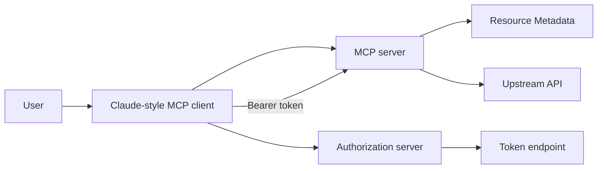
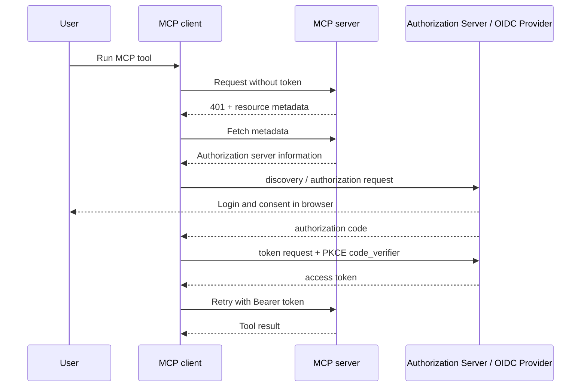
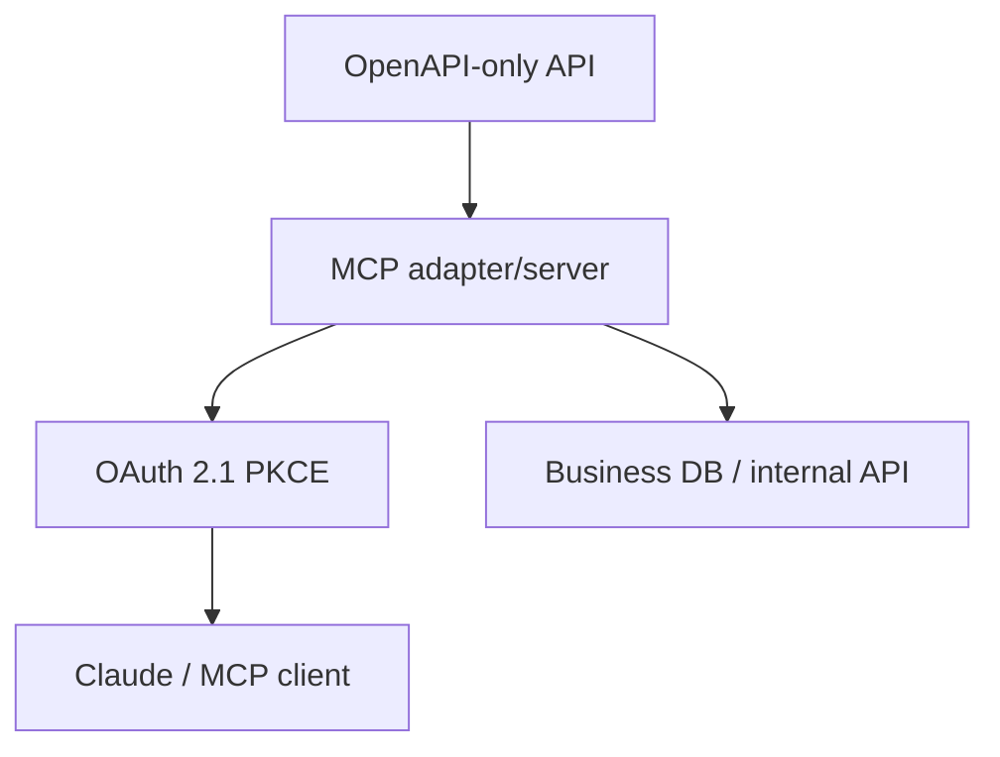
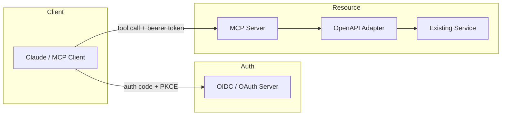

# OAuth 2.1 PKCE flow and MCP authentication authorization practical guide

## 1. Executive Summary

In practice, MCP server authentication and authorization can be easily understood as the flow of "The MCP server acts as a protected resource, obtains a token with OAuth 2.1 Authorization Code + PKCE, and uses that Bearer token to permit MCP tool calls." In the latest published specifications of MCP, HTTP-based MCP servers publish Protected Resource Metadata, and clients are assumed to identify the authorization server by tracing Authorization Server Metadata and OIDC Discovery from there. OAuth 2.1 is still Internet-Draft as of May 2026, and is mainly organized based on the Authorization Code flow and PKCE.
Source note: See [MCP Authorization](https://modelcontextprotocol.io/specification/2025-11-25/basic/authorization), [draft-ietf-oauth-v2-1](https://datatracker.ietf.org/doc/draft-ietf-oauth-v2-1/), [RFC 7636](https://www.rfc-editor.org/rfc/rfc7636), [OpenID Connect Discovery 1.0](https://openid.net/specs/openid-connect-discovery-1_0.html), [RFC 8414](https://www.rfc-editor.org/rfc/rfc8414).
With Claude's remote connector, the user adds the connection destination URL and, if necessary, passes the OAuth client ID / secret to connect. According to Anthropic's official information, remote MCP is handled via Anthropic's cloud, and a custom client ID/secret can be set even if the server side does not have DCR.
Source note: See [Anthropic: Getting started with custom integrations using remote MCP](https://support.anthropic.com/en/articles/11175166-getting-started-with-custom-integrations-using-remote-mcp) and Anthropic's connector configuration guide.
The implementation points are as follows.

1. The MCP server is not a "business API" but a "protected resource" and guides the authorization server with 401 responses and resource metadata.
2. OIDC provider exposes `authorization_endpoint`, `token_endpoint`, etc. through Authorization Server Metadata or OIDC Discovery.
3. The OAuth client receives the authorization code in the browser and exchanges tokens with `code_verifier` of PKCE.
4. Claude plays this client role in the form of a remote connector. When setting up, the important things to consider are the "Connection URL", "Client ID/Secret", and "Required Scope".
5. Existing services that only have OpenAPI cannot be used as connection destinations for MCP clients. It is practical to wrap OpenAPI in an MCP server and receive OAuth 2.1 PKCE there. This is an inference from the specification that MCP is a standard for connecting to external systems and that clients connect to MCP servers.
   Source note: See [MCP Authorization](https://modelcontextprotocol.io/specification/2025-11-25/basic/authorization). The handling of OpenAPI-only is estimated based on this specification.

## 2. Terms you should know first

MCP, OIDC, and OAuth have different roles. If you confuse this, the settings will be corrupted.
| Role | What it does | Typical entity |
| ----------------- | ------------------------------------------------------------------------------- | ------------------------------------------------ |
| MCP Server | Publish Tools Resource Prompt. Acts as a protected resource in HTTP. | Self-made MCP server, MCP wrapper for business systems |
| OAuth authorization server | Responsible for issuing authorization codes, issuing tokens, and authenticating clients. | Auth0, Keycloak, Entra ID, Okta |
| OIDC provider | Add ID token and Discovery to OAuth. | Same as above. Often publishes OIDC Discovery |
| OAuth client | Initiates browser authorization and exchanges code for token. | Claude-based clients, original MCP clients |
| Resource Server | Validate access token and authorize API. | MCP Server, Upstream API, API Gateway |
In the authorization chapter of the MCP specification, the HTTP server exposes Protected Resource Metadata, from which the client can find the authorization server's metadata and proceed with authorization using the rules of OAuth 2.1. OAuth 2.1 itself is a draft, but it is organized around the Authorization Code and PKCE, and does not include implicit flows.
Source note: See [MCP Authorization](https://modelcontextprotocol.io/specification/2025-11-25/basic/authorization) and [draft-ietf-oauth-v2-1](https://datatracker.ietf.org/doc/draft-ietf-oauth-v2-1/).

## 3. Communication flow

The basic flow is Authorization Code + PKCE. The MCP server first returns 401, the client looks at the resource metadata, finds the authorization server, authorizes with the browser, passes the code to the token endpoint to get a token, and then makes MCP calls with the Bearer token attached. PKCE is a mechanism that prevents token exchange even if the authorization code via the browser is stolen, and was designed primarily for public clients.
Source note: See [RFC 7636](https://www.rfc-editor.org/rfc/rfc7636) and [draft-ietf-oauth-v2-1](https://datatracker.ietf.org/doc/draft-ietf-oauth-v2-1/).

### 3.1 First response

When an MCP server receives unauthorized access to a protected endpoint, instead of simply ending with a 403, it returns resource metadata that includes authorization server information. In the MCP specification, it is through this metadata that the client takes the next discovery step.
Source note: See [MCP Authorization](https://modelcontextprotocol.io/specification/2025-11-25/basic/authorization).

### 3.2 Discovering the authorization server

The client first looks at the Authorization Server Metadata based on the information obtained from the MCP server. If you have an OIDC provider, you can also use OIDC Discovery. Both convey information such as authorization endpoint, token endpoint, and issuer to the client.
Source note: See [RFC 8414](https://www.rfc-editor.org/rfc/rfc8414) and [OpenID Connect Discovery 1.0](https://openid.net/specs/openid-connect-discovery-1_0.html).

### 3.3 Authorization code with PKCE

The client prepares `code_verifier` and `code_challenge` and sends an authorization request. The user authenticates and consents on the IdP and receives an authorization code. The client sends the code and `code_verifier` to the token endpoint to obtain an access token. When organizing OAuth 2.1, this flow is the standard, and it is practical to treat PKCE as an essential premise.
Source note: See [RFC 7636](https://www.rfc-editor.org/rfc/rfc7636) and [draft-ietf-oauth-v2-1](https://datatracker.ietf.org/doc/draft-ietf-oauth-v2-1/).

### 3.4 MCP Tool Call

Subsequent MCP calls will be regular HTTP requests with a Bearer token attached. The MCP server verifies the signature, issuer, audience, and scope of the token and returns only authorized tools. The MCP server can directly view the contents of the token using JWT validation, or it can be used in conjunction with introspection, but in any case, it is important to have a design that does not give full authority to the token by just having it. This is a recommendation as a practical design for OAuth rather than a specification requirement for MCP.
Source note: See [MCP Authorization](https://modelcontextprotocol.io/specification/2025-11-25/basic/authorization) and [RFC 6749](https://www.rfc-editor.org/rfc/rfc6749).

## 4. What to set for which component?

### 4.1 MCP Server

The MCP server first decides what to make public as protected resources. In practice, the MCP server is not directly connected to the business system, but is often an authorization boundary placed in front of the business API.
The following items are required as a minimum:

- Publishing Protected Resource Metadata
- Presentation of authorization server information
- Definition of scope to accept
- Validate access token
- Proper return classification of 401/403
  The MCP specification assumes that HTTP-based servers will use this authorization metadata. In other words, the MCP server itself needs to be an API boundary that understands authorization, rather than a "tool server that doesn't know OAuth."
  Source note: See [MCP Authorization](https://modelcontextprotocol.io/specification/2025-11-25/basic/authorization).

### 4.2 OIDC provider / OAuth authorization server

On the authorization server side, set at least the following:

- Authorization endpoint
  -Token endpoint
  -Issuer
- Client registration policy
- Redirect URI permission
  -Scopes
- DCR or client metadata document if necessary
  The MCP specification assumes that clients can trace Authorization Server Metadata and OIDC Discovery. Therefore, the IdP must at least be able to return Discovery correctly.
  Source note: See [RFC 8414](https://www.rfc-editor.org/rfc/rfc8414) and [OpenID Connect Discovery 1.0](https://openid.net/specs/openid-connect-discovery-1_0.html).

### 4.3 OAuth Client

The OAuth client is either the MCP client implementation itself or the authorization broker behind it. The following settings should be made.
-client_id

- client_secret if needed
  -redirect URI
- Use scopes
  -PKCE support
- Handling of refresh token
  OAuth 2.1 assumes PKCE and is organized to use code flow safely even on public clients. There's no reason to go with the old implicit flow.
  Source note: See [draft-ietf-oauth-v2-1](https://datatracker.ietf.org/doc/draft-ietf-oauth-v2-1/) and [RFC 7636](https://www.rfc-editor.org/rfc/rfc7636).

### 4.4 Claude-based clients

According to Anthropic's official guide, you can add a connection destination to the remote MCP connector and set a custom client ID / secret as necessary. In other words, Claude acts as an OAuth client, at least in the context of the remote connector. The core of OAuth settings is "which client registration to use for this MCP server."
Source note: See [Anthropic: Getting started with custom integrations using remote MCP](https://support.anthropic.com/en/articles/11175166-getting-started-with-custom-integrations-using-remote-mcp) and Anthropic's connector configuration guide.
The setting order in practice is as follows.

1. Register the MCP server URL.
2. Check the IdP from the resource metadata returned by the server.
3. Register client_id on Claude side.
4. Register client_secret if necessary.
5. Agree on scope.
6. Log in with your browser and agree.
7. Once the token is saved, run the MCP tool.

### 4.5 Existing OpenAPI-only services

You need to be a little careful here. OpenAPI is an API description format, not an MCP. Therefore, existing services that only have OpenAPI usually cannot be connected to Claude's MCP connector as is. In practice, one MCP server is installed, each OpenAPI operation is mapped to the MCP tool, and the MCP server is configured to receive OAuth 2.1 PKCE. This is an inference from the specification that MCP is a standard for connecting to external systems and that clients connect to MCP servers.
Source note: See [MCP Authorization](https://modelcontextprotocol.io/specification/2025-11-25/basic/authorization). The handling of OpenAPI-only is estimated based on this specification.

With this configuration, OpenAPI operations can be exposed as tools as they are. Conversely, even if you add only authorization with OpenAPI, what the MCP client understands is the MCP tool schema, so a conversion layer is necessary.

## 5. Shortest understanding for beginners

In a nutshell, "Who is authenticating whom?" is as follows.

- The user instructs Claude that he/she wants to use this MCP tool.
- Claude accesses the MCP server.
- The MCP server replies, "Please check with OAuth whether the user can use it."
- Claude opens the IdP screen and asks the user to log in.
- The IdP hands over a token to Claude saying, "This person can use this scope."
- Claude accesses the MCP server again with the token.
- The MCP server returns the tool result if the token is correct.
  In short, the MCP server is the "entrance", the OIDC provider is the "identity verification and consent", and the OAuth client is the "person who collects the information on your behalf".

## 6. Common pitfalls in practice

### 6.1 Ends with vague error without returning 401

If you return a 500 or a generic 403 when authorization is required, the client won't know what to do. In MCP, it is meaningful to return resource metadata, so it is better to tell machine-readable information that authorization is required.
Source note: See [MCP Authorization](https://modelcontextprotocol.io/specification/2025-11-25/basic/authorization).

### 6.2 Only OIDC Discovery is implemented

It is safe to make the MCP specification readable assuming both Authorization Server Metadata and OIDC Discovery. If only one is issued due to the IdP's circumstances, client compatibility will deteriorate.
Source note: See [RFC 8414](https://www.rfc-editor.org/rfc/rfc8414) and [OpenID Connect Discovery 1.0](https://openid.net/specs/openid-connect-discovery-1_0.html).

### 6.3 Omit PKCE

Authorization codes without PKCE should be avoided in current practice. The direction of OAuth 2.1 is to require PKCE, which is a prerequisite for safely using code flow even on public clients.
Source note: See [draft-ietf-oauth-v2-1](https://datatracker.ietf.org/doc/draft-ietf-oauth-v2-1/) and [RFC 7636](https://www.rfc-editor.org/rfc/rfc7636).

### 6.4 Scope design is too rough

`read` and `write` alone tend to be too much or too little for the actual MCP tool. It is better to narrow down your choices according to your work scope and actions, such as `invoice:read`, `incident:close`, and `customer:search`. This is not a mandatory specification, but a practical principle of least privilege.

### 6.5 I think OpenAPI is just MCP

OpenAPI is an API description, and MCP is a tool connection protocol. Since the roles are different, existing systems that only have OpenAPI must be designed with an MCP adapter in mind. This is an estimate based on a reinterpretation of the specifications.
Source note: See [MCP Authorization](https://modelcontextprotocol.io/specification/2025-11-25/basic/authorization).

## 7. Recommended configuration

The easiest configuration to use is:

1. Place the MCP server at the front.
2. MCP server exposes Protected Resource Metadata.
3. IdP returns OIDC Discovery.
4. OAuth client uses Authorization Code + PKCE.
5. For Claude-based clients, connect with remote connector and set client ID / secret if necessary.
6. Wrap existing OpenAPI services with MCP adapter.

With this configuration, it is easy to separate authorization responsibilities and it is easy to reuse it for MCP clients other than Claude.

## 8. Conclusion

For MCP's OAuth 2.1 PKCE flow, it is easier to think about the roles separately than to remember detailed setting items. The MCP server is the protected resource, the OIDC provider is the issuer of authorization, and the OAuth client is the performer of browser authorization and token exchange. Claude-based clients can play the role of this client using a remote connector. Existing OpenAPI-only APIs are difficult to connect as is without an MCP adapter. In practice, the minimum configuration is Authorization Code + PKCE, fine-grained scope, explicit resource metadata, and the introduction of MCP adapter.
Source note: See [MCP Authorization](https://modelcontextprotocol.io/specification/2025-11-25/basic/authorization), [draft-ietf-oauth-v2-1](https://datatracker.ietf.org/doc/draft-ietf-oauth-v2-1/), [RFC 7636](https://www.rfc-editor.org/rfc/rfc7636), [Anthropic remote MCP](https://support.anthropic.com/en/articles/11175166-getting-started-with-custom-integrations-using-remote-mcp).

## Reference information

- [Model Context Protocol - Authorization](https://modelcontextprotocol.io/specification/2025-11-25/basic/authorization)
- [draft-ietf-oauth-v2-1](https://datatracker.ietf.org/doc/draft-ietf-oauth-v2-1/)
- [RFC 7636: Proof Key for Code Exchange by OAuth Public Clients](https://www.rfc-editor.org/rfc/rfc7636)
- [RFC 6749: The OAuth 2.0 Authorization Framework](https://www.rfc-editor.org/rfc/rfc6749)
- [RFC 8414: OAuth 2.0 Authorization Server Metadata](https://www.rfc-editor.org/rfc/rfc8414)
- [OpenID Connect Discovery 1.0](https://openid.net/specs/openid-connect-discovery-1_0.html)
- [Anthropic: Getting started with custom integrations using remote MCP](https://support.anthropic.com/en/articles/11175166-getting-started-with-custom-integrations-using-remote-mcp)
