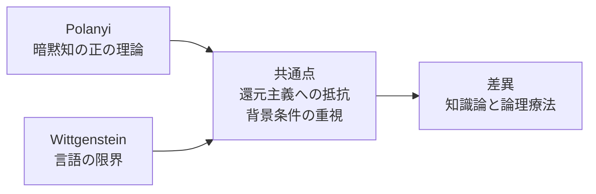
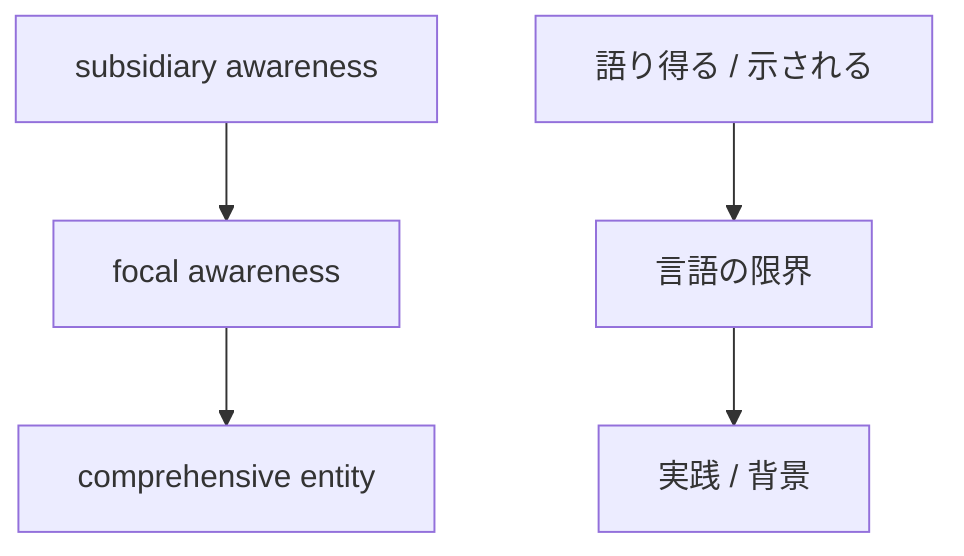

# ポランニーの暗黙知と『論理哲学論考』の接点

## 1. エグゼクティブサマリー

ポランニーと初期ウィトゲンシュタインは、どちらも「知識は明示命題だけでは尽くせない」と示した。ただし、同じ結論に見えても到達点は違う。ポランニーは、知ることの内部にある暗黙的な支えを積極的に描く。『論理哲学論考』は、言えることの限界を論理的に引き、限界の外側については沈黙を要請する。

本稿の結論は次の通りである。

1. ポランニーの tacit knowledge は、焦点化された対象を支える subsidiary awareness の働きであり、知る行為は「from-to」の統合として理解すべきである。
2. focal awareness は単なる注意の中心ではなく、複数の手がかりが統合されて立ち上がる comprehensive entity への気づきである。
3. 『論理哲学論考』の「語り得るもの」と「示されるもの」は、事実の記述可能性と論理形式・価値・世界の限界の関係を分ける装置である。
4. 両者の共通点は、還元主義への抵抗、背景条件の重視、言語の限界意識にある。
5. しかし、同一視はできない。ポランニーは知識論、ウィトゲンシュタインは論理の境界設定であり、沈黙の意味も異なる。
6. 実務上は、熟達者の語りを要約しすぎないこと、元ケースと元表現を残すこと、説明可能な部分と実践として保持すべき部分を分けることが重要である。

<SourceNote>ポランニーの中心命題は University of Chicago Press の [The Tacit Dimension](https://press.uchicago.edu/ucp/books/book/chicago/T/bo6035368.html) と Polanyi Society の [The Structure of Consciousness](https://polanyisociety.org/mp-structure.htm) に整理がある。『論理哲学論考』の 6.522, 6.53, 6.54, 7 は [Wikisource の全文](https://en.wikisource.org/wiki/Tractatus_Logico-Philosophicus) で確認できる。解釈の全体像は Stanford Encyclopedia of Philosophy の [Wittgenstein](https://plato.stanford.edu/archives/fall2023/entries/wittgenstein/) が有用である。</SourceNote>

## 2. 研究史と一次文献

この論点を読むときは、まず文献の時系列を押さえると混乱が減る。

| 年        | 文献                                           | 位置づけ                                                                 |
| --------- | ---------------------------------------------- | ------------------------------------------------------------------------ |
| 1921/1922 | Wittgenstein, _Tractatus Logico-Philosophicus_ | 語り得るものと示されるものを分け、哲学の仕事を言語の限界設定として捉える |
| 1958      | Polanyi, _Personal Knowledge_                  | 知る行為の個人的・責任的・暗黙的側面を前面化する                         |
| 1966      | Polanyi, _The Tacit Dimension_                 | "we can know more than we can tell" を軸に tacit knowing を定式化する    |

ポランニーの議論は、しばしば「言語化できない技能」だけに矮小化されるが、実際にはもっと広い。彼は科学的認識、技能、観察、判断、価値づけが、命題化以前の支えを持つと考えた。ウィトゲンシュタインの『論理哲学論考』は、逆に、世界の事実を写す命題の論理形式を明確にし、その外側にあるものを「示される」領域として残す。

<SourceNote>Polanyi の [The Tacit Dimension](https://press.uchicago.edu/ucp/books/book/chicago/T/bo6035368.html) は tacit dimension を科学的実践、伝統、価値づけと結びつけて紹介している。『論理哲学論考』は [Wikisource](https://en.wikisource.org/wiki/Tractatus_Logico-Philosophicus) で原文が確認でき、SEP の [Wittgenstein](https://plato.stanford.edu/archives/fall2023/entries/wittgenstein/) は Tractatus を前期の論理的境界設定として位置づけている。</SourceNote>

## 3. ポランニーの暗黙知

### 3.1 tacit knowledge は「足りない知識」ではない

ポランニーの tacit knowledge は、単に「まだ文書化されていない知識」を意味しない。むしろ、知る行為そのものが、明示的に把握されていない支えを必要とするという主張である。私たちは、個々の手がかりをばらばらに並べてから対象を見ているのではない。手がかりを subsidiary awareness として用いながら、焦点的には一つの対象を把握する。

たとえば顔認識では、目・鼻・口・輪郭を別々の命題として逐一確認しているのではなく、それらを支えとして「この人だ」と把握する。熟達した観察、診断、設計、研究、職人技能でも同様である。ここでの暗黙知は、欠如ではなく、知ることを成立させる構造である。

<SourceNote>Polanyi Society の [The Structure of Consciousness](https://polanyisociety.org/mp-structure.htm) は、subsidiary awareness と focal awareness の関係を説明する。University of Chicago Press の [The Tacit Dimension](https://press.uchicago.edu/ucp/books/book/chicago/T/bo6035368.html) は "we can know more than we can tell" を中心命題として示す。</SourceNote>

### 3.2 subsidiary awareness / focal awareness / comprehensive entity

この三つは、ポランニー理解の中核である。

| 用語                 | 意味                           | 役割                             |
| -------------------- | ------------------------------ | -------------------------------- |
| subsidiary awareness | 焦点対象を支える周辺的な気づき | 手がかり、背景、依拠点として働く |
| focal awareness      | いま注意の中心にある把握       | 統合された対象への気づき         |
| comprehensive entity | 手がかりが統合されて現れる全体 | 意味ある対象として立ち上がる結果 |

重要なのは、subsidiary awareness を単独に取り出しても、知ることにはならない点である。ポランニーの「from-to」構造では、私たちは手がかりから対象へと移るのであって、手がかりを対象として眺め続けるわけではない。したがって、熟達とは「全部を言えること」ではなく、言えない支えを使って対象へ到達することに近い。

<SourceNote>Polanyi Society の [The Structure of Consciousness](https://polanyisociety.org/mp-structure.htm) は from-to structure と focal/subsidiary の関係を説明する。ここでの `comprehensive entity` は、単なる部品の総和ではなく、統合された把握の結果として理解される。</SourceNote>

### 3.3 ポランニーが強調したもの

ポランニーは、科学や専門実践が純粋に明示的な規則運用ではないことを強く意識していた。何を問題とみなすか、何を異常と感じるか、どの観察を重要視するか、どこで判断を止めるかは、記述できるルール以前に身についていることが多い。

この意味で、ポランニーの理論は「暗黙知は正しく語れない」という悲観ではない。むしろ、知る行為に責任、信頼、コミットメント、訓練、師弟関係が含まれることを肯定的に記述する理論である。

<SourceNote>[The Tacit Dimension](https://press.uchicago.edu/ucp/books/book/chicago/T/bo6035368.html) の解説は、暗黙知を tradition、inherited practices、implied values、prejudgments と関係づける。これは暗黙知を個人の勘だけでなく、実践共同体の背景条件として読む根拠になる。</SourceNote>

## 4. 『論理哲学論考』の語り得るものと示されるもの

### 4.1 語れることの境界

『論理哲学論考』では、命題は世界の事実を写し取るとされる。したがって、意味のある言明は、事実として成立しうる内容を持たなければならない。倫理、美、形而上学、論理形式の一部は、事実の記述として語り尽くせない。

この枠組みでは、哲学の仕事は新しい理論を足すことではなく、語りの境界を明らかにすることにある。言えることを明確にし、言えないことを混同しない。それが Tractatus の基本姿勢である。

<SourceNote>『論理哲学論考』の [Wikisource 版](https://en.wikisource.org/wiki/Tractatus_Logico-Philosophicus) で 4.x 以降の命題群を確認できる。SEP の [Wittgenstein](https://plato.stanford.edu/archives/fall2023/entries/wittgenstein/) は、Tractatus を事実の写像理論と境界設定として整理している。</SourceNote>

### 4.2 示されるもの

Tractatus 6.522 は、言い表せないものが「示される」と述べる。6.53 は、語りうることだけを言えという哲学の方法を示し、6.54 はその命題をはしごとして捨てよと言う。最後の 7 は、語りえないことについては沈黙せよと結ぶ。

ここでの「沈黙」は、単なる無口さではない。むしろ、論理的に言明できることと、言明としては扱えないが、世界のあり方や価値の次元で現れるものを分ける、方法論的な沈黙である。

<SourceNote>『論理哲学論考』の 6.522, 6.53, 6.54, 7 は [Wikisource](https://en.wikisource.org/wiki/Tractatus_Logico-Philosophicus) で確認できる。SEP の [Wittgenstein](https://plato.stanford.edu/archives/fall2023/entries/wittgenstein/) は、Tractatus の「say/show」区別を前期の中核論点として扱う。</SourceNote>

### 4.3 沈黙の要請は、知識の否定ではない

Tractatus の沈黙は、知識そのものを否定するものではない。むしろ、言語が事実をどう写せるかを厳密にした結果、言語の外側に残るものを、理論の対象として安易に取り込まない態度である。ここには、ポランニーの肯定的な tacit knowledge 理論とは異なる緊張がある。

<SourceNote>『論理哲学論考』の 6.54 と 7 は、命題が自己解消するような構造を持つ。SEP の [Wittgenstein](https://plato.stanford.edu/archives/fall2023/entries/wittgenstein/) は、この自己解消を含む方法論を、後期 Wittgenstein の言語ゲーム論とは区別している。</SourceNote>

## 5. 両者の接点

ポランニーと Tractatus の接点は、表面的には「言えないものがある」という一点に見える。だが、実際にはもう少し精密に言う必要がある。

1. **明示知への還元に抵抗する**: どちらも、知ることや意味を、明示命題の総和に還元しない。
2. **背景条件を重視する**: ポランニーは subsidiary awareness を、Wittgenstein は論理形式や限界条件を重視する。
3. **対象の見え方が先行する**: ポランニーは焦点化された対象への統合を、Tractatus は事実の写像可能性とその外側を示す。
4. **言語の働きに限界がある**: どちらも、言語がすべてを直接対象化できるとは考えない。

ここでの接点は、「言語化できない何か」へのロマンではない。むしろ、知ることや意味が、言葉の外にある絶対的な神秘ではなく、言葉が成立する条件や、実践の内部で作動する支えに依存しているという点にある。

<SourceNote>ポランニー側は [The Tacit Dimension](https://press.uchicago.edu/ucp/books/book/chicago/T/bo6035368.html) と Polanyi Society の [glossary](https://polanyisociety.org/) を参照。Tractatus 側は [Wikisource](https://en.wikisource.org/wiki/Tractatus_Logico-Philosophicus) と SEP の [Wittgenstein](https://plato.stanford.edu/archives/fall2023/entries/wittgenstein/) を参照。</SourceNote>

## 6. 重要な差異

### 6.1 ポランニーは知識論、Tractatus は論理療法

ポランニーは、知る主体がどう世界にコミットするかを描く。そこでは、熟達、注意、身体化、伝達、信頼が積極的なテーマになる。一方、Tractatus の主要関心は、世界を正しく記述する論理と、その外側に無理に踏み込まないための限界設定にある。

したがって、ポランニーを Tractatus の注解にしてしまうのも、Tractatus を暗黙知の理論にしてしまうのも、どちらも不正確である。

<SourceNote>ポランニーの [The Tacit Dimension](https://press.uchicago.edu/ucp/books/book/chicago/T/bo6035368.html) と 『論理哲学論考』 [Wikisource](https://en.wikisource.org/wiki/Tractatus_Logico-Philosophicus) の問題設定は異なる。SEP の [Wittgenstein](https://plato.stanford.edu/archives/fall2023/entries/wittgenstein/) は、Tractatus を哲学的療法の先駆けとして読む流れも示す。</SourceNote>

### 6.2 tacit knowledge と showable / sayable は同義ではない

ポランニーの tacit knowledge は、技能、観察、判断、価値づけ、共同体的伝承を含む広い概念である。これに対して Tractatus の shown / unsaid は、論理形式や価値の側に関わる境界概念である。両者は重なる部分があるが、範囲が同じではない。

とくに注意したいのは、Tractatus の「示されるもの」をそのまま「暗黙知」と読み替えることだ。これは後代の比較解釈としては理解できるが、テキストそのものが同じことを言っているわけではない。

<SourceNote>『論理哲学論考』の [Wikisource](https://en.wikisource.org/wiki/Tractatus_Logico-Philosophicus) と Polanyi Society の [Tacit Knowledge glossary](https://polanyisociety.org/) を比較すると、前者は論理と限界、後者は知る行為の構造を扱う。ここからの同一視は解釈上の飛躍である。</SourceNote>

### 6.3 沈黙の意味が違う

Tractatus での沈黙は、言明不可能なものを無理に理論化しないという方法論である。ポランニーでの「言い切れなさ」は、むしろ実践の内部にある支えとして肯定される。沈黙は、前者では境界の尊重、後者では背景的支えの承認に近い。

<SourceNote>7 の沈黙は [Wikisource](https://en.wikisource.org/wiki/Tractatus_Logico-Philosophicus) で確認できる。ポランニー側は [The Tacit Dimension](https://press.uchicago.edu/ucp/books/book/chicago/T/bo6035368.html) と Polanyi Society の [The Structure of Consciousness](https://polanyisociety.org/) を参照。</SourceNote>

## 7. 主要解釈

### 7.1 ポランニーの読み

ポランニー研究では、暗黙知は個人の頭の中の曖昧な勘ではなく、訓練された注意と責任的コミットメントとして読むのが基本である。Polanyi Society の整理は、この方向を明確に支えている。

この読みでは、focal awareness に対する subsidiary awareness は、認識の欠陥ではなく、認識の成立条件である。したがって、暗黙知は「いずれ完全に明示化される未完成の知識」ではない。

<SourceNote>Polanyi Society の [The Structure of Consciousness](https://polanyisociety.org/mp-structure.htm) は、この読みを支える。University of Chicago Press の [The Tacit Dimension](https://press.uchicago.edu/ucp/books/book/chicago/T/bo6035368.html) も同じ方向にある。</SourceNote>

### 7.2 Tractatus の読み

Tractatus の主要解釈は、素朴な神秘主義ではなく、論理的な表象限界の提示である。言えることは言い切るが、言えないものは理論の形で捕まえない。これは、哲学を「説明の追加」ではなく「混同の解消」として行う姿勢である。

<SourceNote>SEP の [Wittgenstein](https://plato.stanford.edu/archives/fall2023/entries/wittgenstein/) は、前期 Wittgenstein を論理構造と境界設定の文脈で整理する。『論理哲学論考』の [Wikisource](https://en.wikisource.org/wiki/Tractatus_Logico-Philosophicus) は、その一次文献である。</SourceNote>

### 7.3 両者をつなぐ二次文献の系譜

二次文献には、Polanyi を Wittgenstein 的に読む系譜がある。ただし、その多くは「言語に先行する実践」「規則を使う能力」「共同体的な判定」を重視する方向であり、Tractatus の沈黙論と完全に重なるわけではない。

この系譜は、両者を雑に同一視するのではなく、「言語化しきれないが、実践では作動しているもの」がどう成立するかを考えるための橋として使うと有益である。

<SourceNote>たとえば [Tacit Knowledge: A Wittgensteinian Approach](https://www.polanyisociety.org/TAD%20WEB%20ARCHIVE/TAD33-3/TAD33-3-fnl-pg9-25-pdf.pdf) といった二次的整理は、Polanyi の tacit knowledge を Wittgenstein 的問題系に接続する。ただし、これは比較解釈であり、一次文献の同一性ではない。</SourceNote>

## 8. 実務的含意

この論点が実務に効くのは、暗黙知の抽出や知識移転で「要約しすぎない」判断を与えるからである。

1. **元ケースを残す**: 熟達者の一般論だけでなく、具体例、失敗例、例外例を残す。
2. **元の語りを残す**: 先に標準用語へ置換しない。言い回しの癖や比喩が、判断の手がかりであることが多い。
3. **手がかりと結論を分ける**: 何を見てそう判断したかを、結論と別に記録する。
4. **言えない部分を無理に言わせない**: 無理な形式化は、かえって判断の質を下げる。
5. **実践で検証する**: 文書化したルールは、現場で使って初めて意味を持つ。

ここでの重要な教訓は、説明可能性を上げることと、実践知を平板化することは同じではない、という点である。ポランニー的に言えば、知識は支えを失うと対象そのものも失う。Tractatus 的に言えば、言えるものの限界を越えて説明した気になった瞬間に、哲学的混乱が始まる。

<SourceNote>実務上の読みに関する帰結は、ポランニーの [The Tacit Dimension](https://press.uchicago.edu/ucp/books/book/chicago/T/bo6035368.html) と 『論理哲学論考』 [Wikisource](https://en.wikisource.org/wiki/Tractatus_Logico-Philosophicus) からの解釈である。ここでの「要約しすぎない」は原文の一語ではなく、二次的な実務含意である。</SourceNote>

## 9. リスク・限界

この比較には三つの落とし穴がある。

第一に、ポランニーを「なんとなく言えない知識」の話に縮めること。第二に、Tractatus の「示されるもの」を暗黙知と短絡させること。第三に、後期ウィトゲンシュタインの言語ゲーム論まで混ぜて、前期の論点を曖昧にすることである。

本稿は、一次文献と主要な解釈文献から、両者の共通点と差異を分けて読もうとする試みである。したがって、詳細な文献史や翻訳差の厳密比較まではカバーしていない。

<SourceNote>『論理哲学論考』の一次文献は [Wikisource](https://en.wikisource.org/wiki/Tractatus_Logico-Philosophicus)、後期 Wittgenstein の文脈は SEP の [Wittgenstein](https://plato.stanford.edu/archives/fall2023/entries/wittgenstein/) を参照。ポランニー側は [Polanyi Society](https://polanyisociety.org/) と [The Tacit Dimension](https://press.uchicago.edu/ucp/books/book/chicago/T/bo6035368.html) を参照。</SourceNote>

## 10. 推奨方針

実務や研究でこの二つを使うなら、次の順で扱うのがよい。

1. まずポランニーで、知る行為の内部構造を確認する。
2. 次に Tractatus で、語り得ることの限界を確認する。
3. そのうえで、両者を安易に同一視せず、共通点は「背景条件への感度」、差異は「理論の目的」に置く。
4. 最後に、知識移転や文書化では、要約よりもケース、手がかり、場面、例外を残す。

この順序にすると、暗黙知を「言えない神秘」として崇めることも、「全部マニュアル化できる」と誤解することも避けやすい。

<SourceNote>以上は、ポランニーの [The Tacit Dimension](https://press.uchicago.edu/ucp/books/book/chicago/T/bo6035368.html)、Polanyi Society の [The Structure of Consciousness](https://polanyisociety.org/mp-structure.htm)、Tractatus の [Wikisource](https://en.wikisource.org/wiki/Tractatus_Logico-Philosophicus)、SEP の [Wittgenstein](https://plato.stanford.edu/archives/fall2023/entries/wittgenstein/) を踏まえた統合的な整理である。</SourceNote>

## 参考情報

- Michael Polanyi, [The Tacit Dimension](https://press.uchicago.edu/ucp/books/book/chicago/T/bo6035368.html), University of Chicago Press.
- Polanyi Society, [The Structure of Consciousness](https://polanyisociety.org/mp-structure.htm).
- Ludwig Wittgenstein, [Tractatus Logico-Philosophicus](https://en.wikisource.org/wiki/Tractatus_Logico-Philosophicus), Wikisource.
- Stanford Encyclopedia of Philosophy, [Wittgenstein](https://plato.stanford.edu/archives/fall2023/entries/wittgenstein/).
- Ludwig Wittgenstein, _Philosophical Investigations_ は本稿の中心対象ではないが、後期の比較軸として有用である。
- Tacit Knowledge に関する比較解釈の一例として、[Tacit Knowledge: A Wittgensteinian Approach](https://www.polanyisociety.org/TAD%20WEB%20ARCHIVE/TAD33-3/TAD33-3-fnl-pg9-25-pdf.pdf) を参照。
