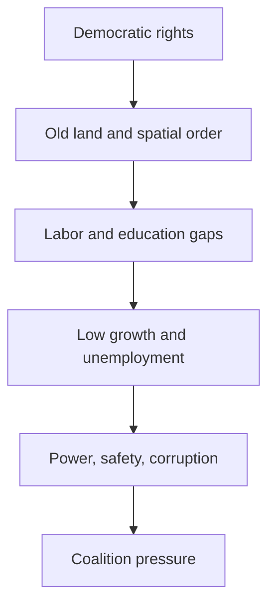
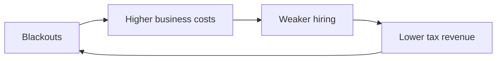

# South Africa's Post-Apartheid Social and Economic Problems

## 1. Executive Summary

South Africa's democratization ended white minority rule, restored universal suffrage, and expanded constitutional rights and social protection. But the apartheid-era map of land, space, education, and work did not disappear. The most useful way to read the country is as a democracy whose social and economic layers are still split in two. <SourceNote>[World Bank, South Africa overview](https://www.worldbank.org/en/country/southafrica/overview), [South African History Online, History of apartheid in South Africa](https://www.sahistory.org.za/article/history-apartheid-south-africa)</SourceNote>

The key takeaways are threefold. First, democracy delivered real gains, but it did not quickly reduce unemployment or inequality. Second, B-BBEE, land reform, education, and urban restructuring were necessary redress tools, but they also created incentives for distributional politics and implementation distortions. Third, after the 2024 election the ANC lost its parliamentary majority for the first time, so economic policy now runs through coalition bargaining rather than single-party rule. <SourceNote>[AP News, South Africa's ANC loses majority, setting up coalition talks](https://apnews.com/article/d9da7582ca98a4e00fec2da6a5fe1e91), [AP News, South Africa's Ramaphosa wins second term after election setback](https://apnews.com/article/2e3de777cb7deb1956bbffe6e607f006), [World Bank, South Africa overview](https://www.worldbank.org/en/country/southafrica/overview)</SourceNote>

This diagram shows South Africa's social economy as a loop linking historical space, current state capacity, and coalition politics, not as a single policy failure. <SourceNote>The diagram synthesizes [World Bank, South Africa overview](https://www.worldbank.org/en/country/southafrica/overview), [AP News, South Africa's ANC loses majority, setting up coalition talks](https://apnews.com/article/d9da7582ca98a4e00fec2da6a5fe1e91), and [South African History Online](https://www.sahistory.org.za/article/history-apartheid-south-africa).</SourceNote>

## 2. What Improved After Democratization

After 1994, South Africans gained equal political participation under law. The state could now expand social protection, education, health, housing, and electricity without the formal racial restrictions of apartheid. The biggest democratic gain was not only voting rights but the shift from governing Black South Africans as subjects to governing them as citizens. <SourceNote>[South African History Online, History of apartheid in South Africa](https://www.sahistory.org.za/article/history-apartheid-south-africa), [World Bank, South Africa overview](https://www.worldbank.org/en/country/southafrica/overview)</SourceNote>

Social grants and basic services mattered. South Africa did not erase poverty, but it did build a larger protection net and soften the most extreme exclusions. Still, grants are not the same as job creation, and service quality remains uneven across regions. <SourceNote>[World Bank, South Africa overview](https://www.worldbank.org/en/country/southafrica/overview), [AP News, South Africa budget: tax hike reversed after coalition backlash](https://apnews.com/article/8665b73d7526ae2f44cbf2994ee0bb70)</SourceNote>

| Area of improvement | Ongoing friction |
| --- | --- |
| Universal suffrage and constitutional order | Coalition bargaining slows decision-making |
| Social protection and public investment | Grants do not absorb unemployment |
| Legal equality | Land, wealth, and education gaps remain |
| A larger Black middle class | Spatial apartheid still raises transport costs and commute times |

The point of the table is not to judge South Africa as a success or failure. It is to separate political inclusion from social and economic redistribution. <SourceNote>[World Bank, South Africa overview](https://www.worldbank.org/en/country/southafrica/overview)</SourceNote>

## 3. The Structural Inequalities That Remain

South African inequality is locked in through income, assets, land, residence, schools, and transport access. Former townships and peripheral settlements remain far from major job centers, with higher commuting costs and more uneven public services. That is both an apartheid inheritance and the result of insufficient post-1994 spatial repair. <SourceNote>[World Bank, South Africa overview](https://www.worldbank.org/en/country/southafrica/overview), [South African History Online, History of apartheid in South Africa](https://www.sahistory.org.za/article/history-apartheid-south-africa)</SourceNote>

Unemployment is the clearest pressure point. South Africa does not only lack jobs; it also has a large cohort of young people who cannot enter work early enough for labor markets to reproduce household stability. AP reported in 2025 that the country continues to face very high unemployment and low growth, with electricity and transport bottlenecks dragging on job creation. <SourceNote>[AP News, World Bank loan backs South Africa reforms as blackouts, joblessness and crime bite](https://apnews.com/article/ceb8af11c31241e9508ec612fccdc2a5), [World Bank, South Africa overview](https://www.worldbank.org/en/country/southafrica/overview)</SourceNote>

Education remains unequal as well. Access expanded, but quality still tracks income and geography. The Guardian reported in 2025 that most 10-year-olds in South Africa still cannot read for meaning, which shows that school enrollment and actual learning outcomes are very different things. <SourceNote>[The Guardian, South Africa's children are in school - but many still can't read for meaning](https://www.theguardian.com/global-development/2025/mar/11/children-school-south-africa-early-learning-sector-funding)</SourceNote>

So the problem is not simply that South Africa is poor. It is that the country has state capacity for an upper-middle-income economy, but land, space, schools, jobs, and transport do not improve in the same direction. That is a longer-lasting apartheid legacy than any single legal reform. <SourceNote>[World Bank, South Africa overview](https://www.worldbank.org/en/country/southafrica/overview), [South African History Online, History of apartheid in South Africa](https://www.sahistory.org.za/article/history-apartheid-south-africa)</SourceNote>

## 4. B-BBEE, Land Reform, Education, and Urban Space

B-BBEE is South Africa's redress framework for ownership, procurement, skills, and enterprise participation. In principle, it is meant to widen economic access rather than merely transfer shares. <SourceNote>[South Africa Department of Trade, Industry and Competition, Broad-Based Black Economic Empowerment](https://www.thedtic.gov.za/financial-and-non-financial-support/b-bbee/broad-based-black-economic-empowerment/)</SourceNote>

In practice, redress policies can turn into distributional politics. If implementation leans too much toward ownership transfers or procurement access, it can look like a channel for rents through political and bureaucratic networks rather than a way to expand productive capacity. That is an inference from the policy design and from the corruption environment around it, not a blanket claim about every B-BBEE program. <SourceNote>[South Africa Department of Trade, Industry and Competition, Broad-Based Black Economic Empowerment](https://www.thedtic.gov.za/financial-and-non-financial-support/b-bbee/broad-based-black-economic-empowerment/), [AP News, South Africa's police minister is suspended while under investigation](https://apnews.com/article/13107d0f89b7beb1a587d3e5b1b5b7c3)</SourceNote>

Land reform remains one of the most sensitive issues in the country. South Africa's 2025 Expropriation Act changed the legal framework so that land can be taken for public purpose or public interest, with limited cases where compensation can be zero if negotiations fail. But legal change does not automatically produce redistribution, and it does not resolve the conflict among farm reform, investor predictability, and urban land pressure. <SourceNote>[AP News, South Africa passes land expropriation law, angering some white farmers and the US](https://apnews.com/article/7930f26fbac90468d26053c1b99a4c)</SourceNote>

Education and urban space sit underneath the land question. If school quality depends on neighborhood and income, young people can finish school without gaining real labor-market access. If housing is far from jobs, transport eats wages and makes work fragile even when employment exists. South Africa's urban problem is therefore not only a housing shortage; it is a spatial system that keeps reproducing inequality. <SourceNote>[World Bank, South Africa overview](https://www.worldbank.org/en/country/southafrica/overview), [The Guardian, South Africa's children are in school - but many still can't read for meaning](https://www.theguardian.com/global-development/2025/mar/11/children-school-south-africa-early-learning-sector-funding)</SourceNote>

## 5. Power, Safety, and Corruption

Eskom's power crisis is more than an outage problem. It lowers factory utilization, disrupts logistics, weakens hospitals and schools, and pulls down tax revenues by reducing output. AP reported, in its coverage of World Bank support, that repeated blackouts have hurt mining and auto manufacturing. Even if South Africa is past the worst stage of rolling outages, the system remains fragile enough to cap growth quickly. <SourceNote>[AP News, World Bank loan backs South Africa reforms as blackouts, joblessness and crime bite](https://apnews.com/article/ceb8af11c31241e9508ec612fccdc2a5)</SourceNote>

The diagram shows how outages spill from household inconvenience into a loop that hits investment, employment, and the state budget. <SourceNote>The diagram simplifies the power-and-jobs linkage reported by [AP News](https://apnews.com/article/ceb8af11c31241e9508ec612fccdc2a5).</SourceNote>

Safety is also an economic issue. High crime raises commuting risk, night-time mobility costs, cash-handling costs, and logistics costs for informal and formal firms alike. When police corruption or collusion with criminal syndicates becomes visible, enforcement capacity itself weakens. AP reported in 2025 and 2026 on the suspension of the police minister and on corruption allegations against senior police officials, which shows that safety in South Africa is partly a state-capacity problem, not only a street-crime problem. <SourceNote>[AP News, South Africa's police minister is suspended while under investigation](https://apnews.com/article/13107d0f89b7beb1a587d3e5b1b5b7c3), [AP News, South Africa's police commissioner faces corruption allegations](https://apnews.com/article/5e1899af8da9182597db1fffd82eda4c)</SourceNote>

On corruption, the Zondo Commission is the starting point because it documented state capture at scale. But documentation is not the same as punishment. If prosecutions, asset recovery, and institutional reform move slowly, corruption remains a present-day cost of governing rather than a closed chapter. <SourceNote>[State Capture Inquiry / Zondo Commission](https://www.statecapture.org.za/site/information/reports), [AP News, South Africa's police minister is suspended while under investigation](https://apnews.com/article/13107d0f89b7beb1a587d3e5b1b5b7c3)</SourceNote>

## 6. The Latest Election and the Changing ANC Order

In the 2024 national election, the ANC lost its parliamentary majority for the first time and South Africa moved into a GNU-style coalition arrangement. AP reported that the ANC fell to just over 40 percent, while the DA and MK emerged as major forces. The significance is larger than a seat count: the assumption that the ANC could govern the state on its own after 1994 has broken. <SourceNote>[AP News, South Africa's ANC loses majority, setting up coalition talks](https://apnews.com/article/d9da7582ca98a4e00fec2da6a5fe1e91), [AP News, South Africa's Ramaphosa wins second term after election setback](https://apnews.com/article/2e3de777cb7deb1956bbffe6e607f006)</SourceNote>

GNU politics mean that policy now has to pass through coalition bargaining before it becomes implementation. In the 2025 budget debate, a proposed VAT increase triggered coalition conflict and was later reversed. That shows that fiscal policy, redistribution, and growth are now negotiated inside the coalition rather than imposed by a single governing party. <SourceNote>[AP News, South Africa budget: tax hike reversed after coalition backlash](https://apnews.com/article/8665b73d7526ae2f44cbf2994ee0bb70)</SourceNote>

| 2024 change | Practical meaning |
| --- | --- |
| ANC loses its majority | The country shifts from single-party dominance to coalition politics |
| MK rises | Disaffected ANC voters became a new political force |
| Cooperation with the DA | Fiscal and institutional reform now depends on coalition terms |
| Policy disputes move to the foreground | Power, safety, land, and jobs remain post-election flashpoints |

The real shift is not an ANC "failure" or a democratic "success." South Africa now looks more like a normal fragmented multiparty system, where no party can automatically solve the social economy on its own. <SourceNote>[AP News, South Africa's ANC loses majority, setting up coalition talks](https://apnews.com/article/d9da7582ca98a4e00fec2da6a5fe1e91), [AP News, South Africa's Ramaphosa wins second term after election setback](https://apnews.com/article/2e3de777cb7deb1956bbffe6e607f006)</SourceNote>

## 7. How to Read the Institutional Shift

The biggest mistake is to read South Africa as either a total failure or a normal middle-income success story. In reality, central cities, formal finance, courts, and the constitution are relatively strong, while peripheral settlements, youth employment, municipalities, and the power system remain extremely weak. <SourceNote>[World Bank, South Africa overview](https://www.worldbank.org/en/country/southafrica/overview), [AP News, World Bank loan backs South Africa reforms as blackouts, joblessness and crime bite](https://apnews.com/article/ceb8af11c31241e9508ec612fccdc2a5)</SourceNote>

The policy priority list is short. First, electricity, ports, rail, and municipal accounts need to be fixed together. Second, B-BBEE and land reform need to be tied to productive capacity rather than only to redistribution politics. Third, school quality, early learning, and urban settlement patterns need to be treated as direct anti-youth-unemployment policy. <SourceNote>[AP News, World Bank loan backs South Africa reforms as blackouts, joblessness and crime bite](https://apnews.com/article/ceb8af11c31241e9508ec612fccdc2a5), [The Guardian, South Africa's children are in school - but many still can't read for meaning](https://www.theguardian.com/global-development/2025/mar/11/children-school-south-africa-early-learning-sector-funding), [South Africa Department of Trade, Industry and Competition, Broad-Based Black Economic Empowerment](https://www.thedtic.gov.za/financial-and-non-financial-support/b-bbee/broad-based-black-economic-empowerment/)</SourceNote>

The research conclusion is simple. South Africa's democracy was a real advance, but it was never going to dissolve inequality automatically. Political inclusion and social-economic restructuring are separate tasks, and the latter will only move if power, land, schools, safety, municipalities, and coalition politics are pushed together. <SourceNote>[World Bank, South Africa overview](https://www.worldbank.org/en/country/southafrica/overview), [AP News, South Africa's ANC loses majority, setting up coalition talks](https://apnews.com/article/d9da7582ca98a4e00fec2da6a5fe1e91)</SourceNote>

## References

- [World Bank, South Africa overview](https://www.worldbank.org/en/country/southafrica/overview)
- [AP News, South Africa's ANC loses majority, setting up coalition talks](https://apnews.com/article/d9da7582ca98a4e00fec2da6a5fe1e91)
- [AP News, South Africa's Ramaphosa wins second term after election setback](https://apnews.com/article/2e3de777cb7deb1956bbffe6e607f006)
- [AP News, South Africa budget: tax hike reversed after coalition backlash](https://apnews.com/article/8665b73d7526ae2f44cbf2994ee0bb70)
- [AP News, World Bank loan backs South Africa reforms as blackouts, joblessness and crime bite](https://apnews.com/article/ceb8af11c31241e9508ec612fccdc2a5)
- [AP News, South Africa passes land expropriation law, angering some white farmers and the US](https://apnews.com/article/7930f26fbac90468d26053c1b99a789f)
- [AP News, South Africa's police minister is suspended while under investigation](https://apnews.com/article/13107d0f89b7beb1a587d3e5b1b5b7c3)
- [AP News, South Africa's police commissioner faces corruption allegations](https://apnews.com/article/5e1899af8da9182597db1fffd82eda4c)
- [The Guardian, South Africa's children are in school - but many still can't read for meaning](https://www.theguardian.com/global-development/2025/mar/11/children-school-south-africa-early-learning-sector-funding)
- [South Africa Department of Trade, Industry and Competition, Broad-Based Black Economic Empowerment](https://www.thedtic.gov.za/financial-and-non-financial-support/b-bbee/broad-based-black-economic-empowerment/)
- [State Capture Inquiry / Zondo Commission](https://www.statecapture.org.za/site/information/reports)
