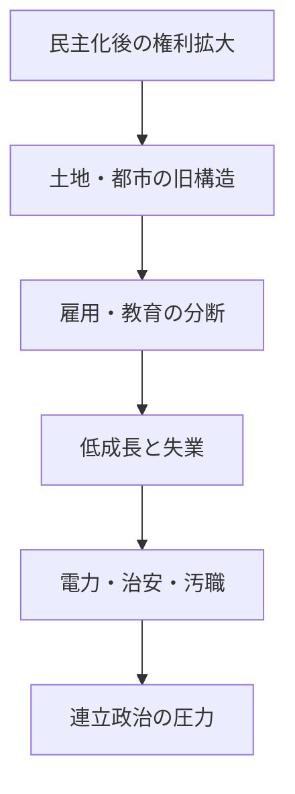
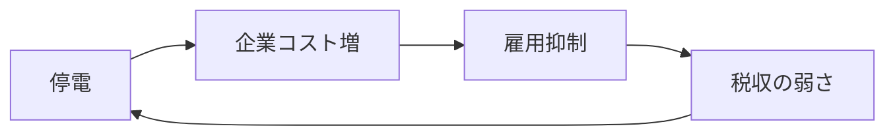

# 民主化後の南アフリカの社会経済問題

## 1. エグゼクティブサマリー

南アフリカの民主化は、白人少数支配の終結、普遍選挙、憲法上の権利、社会給付の拡大をもたらした。しかし、アパルトヘイトが残した土地配分、都市空間、教育、雇用の分断は消えていない。南アフリカは「政治制度は民主化したが、社会経済の地層はなお二重化している」国として読むのが最も実務的である。<SourceNote>[World Bank, South Africa overview](https://www.worldbank.org/en/country/southafrica/overview), [South African History Online, History of apartheid in South Africa](https://www.sahistory.org.za/article/history-apartheid-south-africa)</SourceNote>

この報告の要点は三つある。第一に、民主化で得られたものは大きいが、失業と格差の縮小は限定的だった。第二に、B-BBEE、土地改革、教育、都市再編は是正政策として必要だった一方、実装過程で配分競争や政治的な歪みを招きやすかった。第三に、2024年選挙で ANC は初めて国政で過半数を失い、GNU 体制に移ったため、社会経済政策は単独支配ではなく連立交渉の中で動くようになった。<SourceNote>[AP News, South Africa's ANC loses majority, setting up coalition talks](https://apnews.com/article/d9da7582ca98a4e00fec2da6a5fe1e91), [AP News, South Africa's Ramaphosa wins second term after election setback](https://apnews.com/article/2e3de777cb7deb1956bbffe6e607f006), [World Bank, South Africa overview](https://www.worldbank.org/en/country/southafrica/overview)</SourceNote>

この図は、南アフリカの社会経済問題を単独の政策失敗ではなく、歴史的な空間配置と現在の統治能力が結びついた循環として示したものである。<SourceNote>図は [World Bank, South Africa overview](https://www.worldbank.org/en/country/southafrica/overview)、[AP News, South Africa's ANC loses majority, setting up coalition talks](https://apnews.com/article/d9da7582ca98a4e00fec2da6a5fe1e91)、[South African History Online](https://www.sahistory.org.za/article/history-apartheid-south-africa) を要約した公開情報の整理である。</SourceNote>

## 2. 民主化で改善した点

1994年以降、南アフリカの市民は法の上では平等な政治参加を得た。アパルトヘイト期のように人種で公民権が制度的に分割されることはなくなり、国家は社会給付、教育、保健、住宅、電力などに広く手を伸ばせるようになった。民主化の成果は、制度的な権利の回復と、国家が「黒人多数派を統治対象ではなく市民として扱う」枠組みに移った点にある。<SourceNote>[South African History Online, History of apartheid in South Africa](https://www.sahistory.org.za/article/history-apartheid-south-africa), [World Bank, South Africa overview](https://www.worldbank.org/en/country/southafrica/overview)</SourceNote>

実務上は、社会給付の広がりと基礎サービスの拡張が重要だった。南アフリカは、貧困を完全には解消できなかったが、民主化後の国家能力を使って保護網を広げ、極端な排除を和らげてきた。とはいえ、給付の拡大は雇用創出の代わりにはならず、地域差も大きい。<SourceNote>[World Bank, South Africa overview](https://www.worldbank.org/en/country/southafrica/overview), [AP News, South Africa budget: tax hike reversed after coalition backlash](https://apnews.com/article/8665b73d7526ae2f44cbf2994ee0bb70)</SourceNote>

| 改善した点 | まだ残る摩擦 |
| --- | --- |
| 普遍選挙と憲法秩序 | 連立交渉が政策決定を遅らせやすい |
| 社会給付と公共投資 | 給付だけでは失業を吸収できない |
| 法の上の平等 | 土地・資産・教育の格差は残る |
| 公的な黒人中間層の拡大 | 旧来の空間分断はなお交通費と通勤時間を押し上げる |

この表は、民主化を「成功か失敗か」の二分法で読むのではなく、政治的権利の改善と社会経済的再配分の遅れを分けて考えるための整理である。<SourceNote>[World Bank, South Africa overview](https://www.worldbank.org/en/country/southafrica/overview)</SourceNote>

## 3. 残った構造的不平等

南アフリカの格差は、所得だけでなく資産、土地、居住地、学校、交通アクセスの組み合わせで固定されている。旧タウンシップや周縁部の居住地は、雇用中心地から遠く、通勤コストが高く、公共サービスの質もばらつきやすい。これはアパルトヘイトの名残であると同時に、民主化後も空間再編が十分に進まなかった結果でもある。<SourceNote>[World Bank, South Africa overview](https://www.worldbank.org/en/country/southafrica/overview), [South African History Online, History of apartheid in South Africa](https://www.sahistory.org.za/article/history-apartheid-south-africa)</SourceNote>

失業は最もわかりやすい圧力である。南アフリカでは、雇用が不足するだけでなく、初職に入れない若者が厚く積み上がるため、労働市場が家計の再生産装置になりにくい。AP は 2025 年の世界銀行支援報道の中で、南アフリカが非常に高い失業率と低成長に悩んでいること、そして黒字化しにくい電力・交通・物流の制約が雇用を抑えていることを指摘した。<SourceNote>[AP News, World Bank loan backs South Africa reforms as blackouts, joblessness and crime bite](https://apnews.com/article/ceb8af11c31241e9508ec612fccdc2a5), [World Bank, South Africa overview](https://www.worldbank.org/en/country/southafrica/overview)</SourceNote>

教育の不均等も残る。公教育へのアクセスは広がったが、学力の分布は依然として所得と地域に強く引っ張られる。The Guardian が 2025 年に報じたところでは、南アフリカでは 10 歳児の大半が意味を理解して読む段階に達しておらず、制度上の就学率が高くても学習成果は低いという問題が続いている。<SourceNote>[The Guardian, South Africa's children are in school - but many still can't read for meaning](https://www.theguardian.com/global-development/2025/mar/11/children-school-south-africa-early-learning-sector-funding)</SourceNote>

つまり、南アフリカの問題は「貧しい国だから困っている」のではない。中所得国としての国家能力はあるのに、土地と都市空間、学校、雇用、交通が同じ方向に改善していないため、民主化の恩恵が生活実感に変わりにくいのである。これは政策失敗というより、アパルトヘイトの制度遺産が長期にわたって残っているという方が正確だ。<SourceNote>[World Bank, South Africa overview](https://www.worldbank.org/en/country/southafrica/overview), [South African History Online, History of apartheid in South Africa](https://www.sahistory.org.za/article/history-apartheid-south-africa)</SourceNote>

## 4. B-BBEE、土地改革、教育、都市空間

B-BBEE は、人種排除で形成された所有権、調達、技能、取引機会の偏りを是正するための政策枠組みである。狙いは black ownership の拡大ではなく、サプライチェーン、技能形成、企業育成を通じた経済参加の広げ直しにある。<SourceNote>[South Africa Department of Trade, Industry and Competition, Broad-Based Black Economic Empowerment](https://www.thedtic.gov.za/financial-and-non-financial-support/b-bbee/broad-based-black-economic-empowerment/)</SourceNote>

ただし、是正政策は配分政治になりやすい。制度が所有移転や調達配分に偏ると、真に新しい生産能力を増やすよりも、既存の政治・官僚ネットワークを通じた利得配分に見えやすくなる。これは B-BBEE の理念そのものではなく、実装が供給制約と監督不足にぶつかったときに起きる典型的な歪みだというのが、公開情報からの推定である。<SourceNote>[South Africa Department of Trade, Industry and Competition, Broad-Based Black Economic Empowerment](https://www.thedtic.gov.za/financial-and-non-financial-support/b-bbee/broad-based-black-economic-empowerment/), [AP News, South Africa investigates police corruption and crime syndicates](https://apnews.com/article/13107d0f89b7beb1a587d3e5b1b5b7c3)</SourceNote>

土地改革は、なお最も政治的に敏感な論点の一つである。2025 年の Expropriation Act により、南アフリカは公共目的と公共利益を理由に土地を収用でき、交渉が不調なら補償なし収用が限定的に可能だと定めたが、それは自動的な再配分を意味しない。農地改革、都市周縁の居住再編、投資の予見可能性の三つを同時に満たすのは難しい。<SourceNote>[AP News, South Africa passes land expropriation law, angering some white farmers and the US](https://apnews.com/article/7930f26fbac90468d26053c1b99a789f)</SourceNote>

教育と都市空間は、土地問題の裏側にある。学校の質が地域と所得に左右されると、若者は都市で学んでも都市で働けない。住宅が職場から遠ければ、通勤費が賃金を食い、失業していなくても生活が厳しくなる。南アフリカの都市問題は、単に「住宅不足」ではなく、空間が不平等を再生産する構造そのものにある。<SourceNote>[World Bank, South Africa overview](https://www.worldbank.org/en/country/southafrica/overview), [The Guardian, South Africa's children are in school - but many still can't read for meaning](https://www.theguardian.com/global-development/2025/mar/11/children-school-south-africa-early-learning-sector-funding)</SourceNote>

## 5. 電力危機、治安、汚職

Eskom の電力危機は、単なる停電問題ではない。工場、物流、鉱山、病院、学校、小売の稼働率をまとめて下げる供給制約であり、雇用と税収の両方を圧迫する。AP は世界銀行の支援報道の中で、頻発する停電が鉱業や自動車産業を含む経済活動を損ねていると伝えた。電力危機は最悪期を脱した局面があるとしても、供給網と送電網が脆弱なままでは、成長率はすぐに頭打ちになる。<SourceNote>[AP News, World Bank loan backs South Africa reforms as blackouts, joblessness and crime bite](https://apnews.com/article/ceb8af11c31241e9508ec612fccdc2a5)</SourceNote>

この図は、停電が家計の不便だけでなく、投資、雇用、財政に波及する循環を示している。<SourceNote>図は [AP News](https://apnews.com/article/ceb8af11c31241e9508ec612fccdc2a5) の電力・雇用・治安に関する報道を単純化したものである。</SourceNote>

治安も同様に、経済問題である。犯罪率の高さは通勤、夜間移動、零細商売、現金商取引、物流コストを押し上げる。さらに、警察組織の腐敗や、犯罪シンジケートとの癒着が疑われると、取り締まりの実効性そのものが落ちる。AP は 2025 年から 2026 年にかけて、警察相の停職、上級警察幹部の腐敗疑惑、犯罪ネットワークとの関係をめぐる捜査を報じており、治安問題が単純な街頭犯罪ではなく、国家の執行能力の問題になっていることを示した。<SourceNote>[AP News, South Africa's police minister is suspended while under investigation](https://apnews.com/article/13107d0f89b7beb1a587d3e5b1b5b7c3), [AP News, South Africa's police commissioner faces corruption allegations](https://apnews.com/article/5e1899af8da9182597db1fffd82eda4c)</SourceNote>

汚職については、Zondo 委員会が国家捕獲の広がりを記録したことが出発点になる。だが、文書化と実際の処罰は別物である。公開記録は十分でも、訴追、回収、制度改革が遅れれば、汚職は「過去の事件」ではなく「現在進行形の統治コスト」として残る。<SourceNote>[State Capture Inquiry / Zondo Commission](https://www.statecapture.org.za/site/information/reports), [AP News, South Africa's police minister is suspended while under investigation](https://apnews.com/article/13107d0f89b7beb1a587d3e5b1b5b7c3)</SourceNote>

## 6. 最新選挙と ANC 支配の変化

2024 年総選挙で ANC は国政で初めて過半数を失い、連立前提の GNU 体制に入った。AP の報道によれば、ANC は約 4 割台に低下し、DA と MK が存在感を増した。これは単なる議席変動ではなく、1994 年以来の「ANC が国家を単独で動かす」前提が壊れたことを意味する。<SourceNote>[AP News, South Africa's ANC loses majority, setting up coalition talks](https://apnews.com/article/d9da7582ca98a4e00fec2da6a5fe1e91), [AP News, South Africa's Ramaphosa wins second term after election setback](https://apnews.com/article/2e3de777cb7deb1956bbffe6e607f006)</SourceNote>

GNU 化の実務的な含意は、政策が「実装」より前に「連立内交渉」を通るようになったことだ。2025 年の予算では付加価値税引き上げをめぐって連立内対立が起き、政府は後に方針を取り下げた。これは財政・再分配・成長の優先順位が、今や党内独裁ではなく連立調整で決まることを示している。<SourceNote>[AP News, South Africa budget: tax hike reversed after coalition backlash](https://apnews.com/article/8665b73d7526ae2f44cbf2994ee0bb70)</SourceNote>

| 2024 年の変化 | 実務上の意味 |
| --- | --- |
| ANC の過半数喪失 | 単独支配から連立政治へ移行した |
| MK の台頭 | 旧ANC不満票が新たな政治勢力になった |
| DA との協調 | 財政・制度改革の速度が連立条件に左右される |
| 政策争点の前面化 | 電力、治安、土地、雇用が選挙後も争点のまま残る |

この表で重要なのは、ANC の弱体化が「民主化の成功」でも「国家の失敗」でもない点である。むしろ、旧与党が支配力を失っても、代替勢力が直ちに社会経済問題を解決するわけではない、という正常な多党化への移行と見るべきだ。<SourceNote>[AP News, South Africa's ANC loses majority, setting up coalition talks](https://apnews.com/article/d9da7582ca98a4e00fec2da6a5fe1e91), [AP News, South Africa's Ramaphosa wins second term after election setback](https://apnews.com/article/2e3de777cb7deb1956bbffe6e607f006)</SourceNote>

## 7. 実務含意

南アフリカを読むとき、最も危険なのは「一枚岩の失敗国」か「制度が整った中所得国」のどちらか一方としてだけ見ることだ。実際には、都市の中心部、正式雇用、資本市場、司法制度は比較的近代的だが、郊外、若年失業者、非公式経済、地方自治体、電力網は非常に脆い。<SourceNote>[World Bank, South Africa overview](https://www.worldbank.org/en/country/southafrica/overview), [AP News, World Bank loan backs South Africa reforms as blackouts, joblessness and crime bite](https://apnews.com/article/ceb8af11c31241e9508ec612fccdc2a5)</SourceNote>

政策面の優先順位は三つに絞れる。第一に、電力、港湾、鉄道、自治体会計を同時に立て直すこと。第二に、B-BBEE と土地改革を、政治的配分ではなく生産能力の拡張につなげること。第三に、学校の質、初等教育、都市の居住配置を、若年失業への直接対策として扱うことだ。<SourceNote>[AP News, World Bank loan backs South Africa reforms as blackouts, joblessness and crime bite](https://apnews.com/article/ceb8af11c31241e9508ec612fccdc2a5), [The Guardian, South Africa's children are in school - but many still can't read for meaning](https://www.theguardian.com/global-development/2025/mar/11/children-school-south-africa-early-learning-sector-funding), [South Africa Department of Trade, Industry and Competition, Broad-Based Black Economic Empowerment](https://www.thedtic.gov.za/financial-and-non-financial-support/b-bbee/broad-based-black-economic-empowerment/)</SourceNote>

研究上の結論は明快である。南アフリカの民主化は本物の進歩だったが、それは格差の自動解消ではなかった。政治的権利の拡大と社会経済の再編は別工程であり、後者は電力、土地、学校、治安、自治体、連立政治という複数のレバーを同時に動かさない限り進みにくい。<SourceNote>[World Bank, South Africa overview](https://www.worldbank.org/en/country/southafrica/overview), [AP News, South Africa's ANC loses majority, setting up coalition talks](https://apnews.com/article/d9da7582ca98a4e00fec2da6a5fe1e91)</SourceNote>

## 参考情報

- [World Bank, South Africa overview](https://www.worldbank.org/en/country/southafrica/overview)
- [AP News, South Africa's ANC loses majority, setting up coalition talks](https://apnews.com/article/d9da7582ca98a4e00fec2da6a5fe1e91)
- [AP News, South Africa's Ramaphosa wins second term after election setback](https://apnews.com/article/2e3de777cb7deb1956bbffe6e607f006)
- [AP News, South Africa budget: tax hike reversed after coalition backlash](https://apnews.com/article/8665b73d7526ae2f44cbf2994ee0bb70)
- [AP News, World Bank loan backs South Africa reforms as blackouts, joblessness and crime bite](https://apnews.com/article/ceb8af11c31241e9508ec612fccdc2a5)
- [AP News, South Africa passes land expropriation law, angering some white farmers and the US](https://apnews.com/article/7930f26fbac90468d26053c1b99a789f)
- [AP News, South Africa's police minister is suspended while under investigation](https://apnews.com/article/13107d0f89b7beb1a587d3e5b1b5b7c3)
- [AP News, South Africa's police commissioner faces corruption allegations](https://apnews.com/article/5e1899af8da9182597db1fffd82eda4c)
- [The Guardian, South Africa's children are in school - but many still can't read for meaning](https://www.theguardian.com/global-development/2025/mar/11/children-school-south-africa-early-learning-sector-funding)
- [South Africa Department of Trade, Industry and Competition, Broad-Based Black Economic Empowerment](https://www.thedtic.gov.za/financial-and-non-financial-support/b-bbee/broad-based-black-economic-empowerment/)
- [State Capture Inquiry / Zondo Commission](https://www.statecapture.org.za/site/information/reports)
