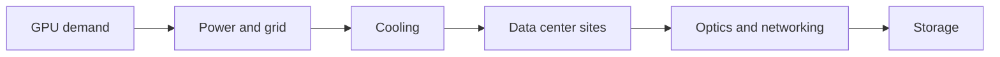
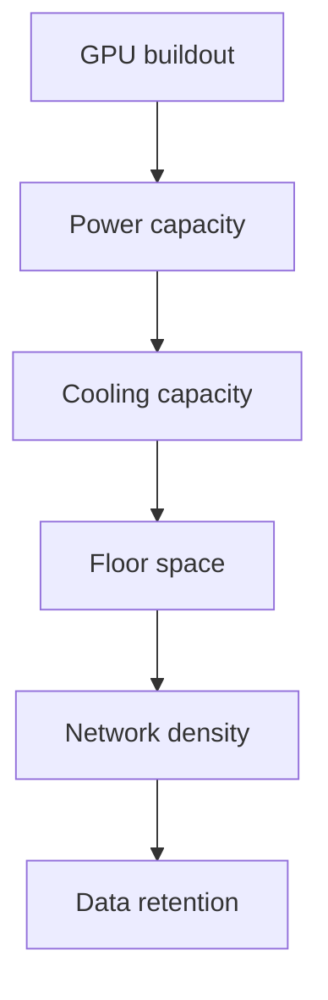

# What Comes After Semiconductors in AI Infrastructure?

## 1. Executive Summary

If you trace the spillover from GPU demand, the next large AI infrastructure bets are not one industry. The first bottleneck is power and grid connection. The next is cooling, then data center land and buildings, then optics and networking, and only later storage. AI infrastructure is "after semiconductors" only in the sense that the chip is the visible center; in practice it is a bundle of constraints around the chip. <SourceNote>[IEA, Energy and AI](https://www.iea.org/reports/energy-and-ai) estimates that data centers consumed about 415 TWh in 2024, or roughly 1.5% of global electricity demand, and notes that AI-focused sites can exceed 100 MW. [CBRE, Global Data Center Trends 2025](https://www.cbre.com/insights/reports/global-data-center-trends-2025) says power constraints and permitting delays are the main bottlenecks to growth.</SourceNote>

The report's conclusions are straightforward:

1. Power is the first constraint. GPU expansion can hit transformers, substations, and grid interconnection before it hits semiconductors.
2. Cooling comes next. High-density racks often need liquid cooling and heat-exchange infrastructure beyond conventional air cooling.
3. Data center real estate monetizes early but stays supply constrained. Land, buildings, and power all have to line up before capacity can be sold.
4. Optics and networking matter when clusters scale, not when a single GPU is purchased. The key revenue moments are generational jumps such as 400G to 800G and, later, 1.6T.
5. Storage is later but durable. Training data, logs, inference outputs, and retention policies all add up over time.

As a public-information inference, short-term monetization should be strongest in power, cooling, and data center real estate, followed by networking and optics, and then storage. The practical takeaway is that "AI infrastructure" is not a single trade. It is a stack of bottlenecks that should be read from the top down.

The ordering is not a fixed causal chain, but in practice it tends to clog in this sequence. If power is unavailable, more cooling does not matter. If the building exists but cannot be energized, revenue does not start. Networking and storage benefit later, once compute and data volumes are actually deployed.

## 2. What the Next Bottleneck Is

AI GPUs move as systems, not as isolated chips. The real constraint is not whether a GPU can be purchased. It is whether a dense rack can be powered, cooled, and operated continuously at the required density. The IEA estimates that data centers and data transmission networks consumed about 415 TWh in 2024 and could exceed 1,000 TWh by 2030. That makes AI a core infrastructure demand, not a side effect. <SourceNote>[IEA, Energy and AI](https://www.iea.org/reports/energy-and-ai) and [IEA, Powering Data Centres in the Age of AI](https://www.iea.org/reports/powering-data-centres-in-the-age-of-ai) provide the underlying estimates.</SourceNote>

The point is simple. More GPUs require more power. More power requires more cooling. Once power and cooling are in place, floor space becomes the next issue. As clusters get larger, network density rises, and as training and inference expand, retained data grows as well.

NREL and U.S. Department of Energy material reinforce why liquid cooling matters. Liquids move heat far more effectively than air, which makes them critical for very high-density racks. <SourceNote>[NREL, Warm-Water Liquid Cooling](https://www.nrel.gov/computational-science/warm-water-liquid-cooling.html) shows why liquid cooling matters for high-density data centers. [U.S. Department of Energy, DOE announces more efficient cooling for data centers](https://www.energy.gov/articles/doe-announces-40-million-more-efficient-cooling-data-centers) treats cooling and efficiency as major data center issues.</SourceNote>

## 3. Area-by-Area Comparison

The table below compares the AI spillover layers by what is sold, how quickly it monetizes, and where it runs into constraints. The sequence is an inference from public information, not an official roadmap.

| Area | What gets sold | Monetization speed | Main constraints | Representative examples |
| --- | --- | --- | --- | --- |
| Power and grid interconnection | Transformers, substations, UPS, distribution, backup generation | Fastest | Grid queues, transmission limits, permits, and land | Eaton, Vertiv, utilities |
| Cooling | Air-side upgrades, liquid cooling, CDUs, heat exchangers, monitoring | Early | Water, heat rejection, building codes, retrofit complexity | Vertiv, Eaton, Schneider Electric |
| Data center real estate | Site prep, buildings, colocation, hyperscale shell capacity | Early but supply constrained | Land, interconnection, zoning, permitting, vacancy | Digital Realty, Equinix, DTCR, IDGT |
| Optics and networking | 400G/800G/1.6T optics, switches, DCI | Mid-cycle | Product transitions, supply constraints, export controls, efficiency | Arista, Corning, Coherent, Ciena |
| Storage | HDD, SSD, object storage, data management | Mid to late | Budget discipline, media mix, retention requirements | Seagate, NetApp, Western Digital |

<SourceNote>[Vertiv](https://www.vertiv.com/) and [Eaton](https://www.eaton.com/) frame AI data centers as a growth driver for power and thermal management. [Digital Realty](https://www.digitalrealty.com/) and [Equinix](https://www.equinix.com/) show how tight the data center supply picture remains. [Arista](https://www.arista.com/), [Corning](https://www.corning.com/), [Coherent](https://www.coherent.com/), and [Ciena](https://www.ciena.com/) are representative public companies for AI networking and optics. [Seagate](https://www.seagate.com/) and [NetApp](https://www.netapp.com/) are representative public names for storage and data management.</SourceNote>

## 4. Monetization Timing and Capex Cycles

Speed of monetization is driven less by the size of the opportunity than by the distance to purchase order. GPU demand does not become revenue immediately. It passes through power contracts, design freeze, construction, and go-live.

| Area | Monetization trigger | Typical lag | Interpretation |
| --- | --- | --- | --- |
| Power and grid | Interconnection requests and electrical design | Short | Orders come first, but delivery times are long |
| Cooling | Rack density and facility design freeze | Short to medium | Retrofit work can monetize quickly |
| Data center real estate | Land control and pre-leasing | Short to medium | Demand is strong, but supply is slow |
| Optics and networking | Cluster expansion and generation upgrades | Medium | Revenue rises with 400G → 800G → 1.6T transitions |
| Storage | Retention policy and data durability needs | Medium to long | Data growth compounds after compute ramps |

This timing gap matters. Power and cooling are needed as soon as the facility ramps. Optics and storage become stronger only after AI clusters are actually running and the data policy is set. As a result, a theme can look crowded long before it turns into revenue. <SourceNote>[IEA, Energy and AI](https://www.iea.org/reports/energy-and-ai) and [CBRE, Global Data Center Trends 2025](https://www.cbre.com/insights/reports/global-data-center-trends-2025) show that growth is being limited by power, space, and permitting. [Arista](https://www.arista.com/) and [Corning](https://www.corning.com/) show how networking grows through product generations. [Seagate](https://www.seagate.com/) and [NetApp](https://www.netapp.com/) show how data growth becomes recurring storage demand.</SourceNote>

## 5. Regulation and Constraints

AI infrastructure is often delayed more by siting and regulation than by technology. Power and cooling are especially exposed to grid interconnection, land use, permits, water, and environmental rules.

1. Power is first constrained by grid connection queues.
2. Cooling can be limited by water availability and heat rejection rules.
3. Data center real estate faces zoning, noise, visual, and transmission-line constraints.
4. Optics is affected by component supply and export controls.
5. Storage demand is shaped by data sovereignty and retention policy.

Eaton and Vertiv materials show that AI facilities assume higher power density and thermal load than traditional data centers. CBRE says vacancy remains extremely low and that power, not just supply, is the issue in 2025. The IEA also frames data center growth as a policy and grid problem as much as a technology problem. <SourceNote>[Eaton](https://www.eaton.com/), [Vertiv](https://www.vertiv.com/), [CBRE, Global Data Center Trends 2025](https://www.cbre.com/insights/reports/global-data-center-trends-2025), and [IEA, Powering Data Centres in the Age of AI](https://www.iea.org/reports/powering-data-centres-in-the-age-of-ai) support this reading.</SourceNote>

## 6. Representative Companies, ETFs, and Listed Sectors

This is not a stock recommendation. It is a map of where capital is likely to flow.

| Layer | Example companies | ETF lens | Note |
| --- | --- | --- | --- |
| Power, power electronics, and thermal management | Eaton, Vertiv, Schneider Electric | Infrastructure ETFs, utilities ETFs | Power delivery and cooling move together |
| Data center real estate | Digital Realty, Equinix | DTCR, IDGT | Tight supply makes rent and utilization matter |
| Optics and networking | Arista, Corning, Coherent, Ciena | Communications equipment, digital infrastructure | Revenue tends to rise at product-generation shifts |
| Storage | Seagate, NetApp, Western Digital | Broad IT hardware ETFs | AI data growth turns into steady storage demand |

Pure-play AI infrastructure ETFs are still relatively limited. In practice, investors often combine broad infrastructure ETFs with individual stocks. Examples include DTCR and IDGT on the data center side, and broader products such as IGF, IFRA, and POWR for infrastructure exposure. Fund compositions differ, so the label is not enough on its own. <SourceNote>[Global X Data Center REITs & Digital Infrastructure ETF](https://www.globalxetfs.com/funds/srvr/), [Global X Digital Infrastructure ETF](https://www.globalxetfs.com/funds/idgt/), [iShares Global Infrastructure ETF](https://www.ishares.com/us/products/239502/ishares-global-infrastructure-etf), [iShares U.S. Infrastructure ETF](https://www.ishares.com/us/products/239522/ishares-us-infrastructure-etf), and [iShares U.S. Power Infrastructure ETF](https://www.ishares.com/us/literature/fact-sheet/powr-ishares-us-power-infrastructure-etf-fund-fact-sheet-en-us.pdf) are examples of how ETF exposure is packaged differently by issuer.</SourceNote>

## 7. Practical Implications

The most useful indicators are not GPU counts by themselves. They are the adjacent investments that make GPUs usable.

1. Substation builds, power agreements, and interconnection queues.
2. Liquid cooling orders and retrofit work.
3. Colocation pre-leasing and vacancy trends.
4. The 400G, 800G, and 1.6T transition cycle.
5. Storage capacity growth and retention policy changes.

When those move first, AI demand is spreading beyond semiconductors into construction, power, communications, and storage. If only GPU sales look strong, but power and buildings are stuck, the demand has not become deployed capacity yet. To understand what comes after semiconductors, you have to read both upstream constraints and downstream order books. <SourceNote>The sequence above is a public-information inference based on [IEA, Energy and AI](https://www.iea.org/reports/energy-and-ai), [CBRE, Global Data Center Trends 2025](https://www.cbre.com/insights/reports/global-data-center-trends-2025), and company disclosures from [Arista](https://www.arista.com/) and [Corning](https://www.corning.com/).</SourceNote>

## 8. Risks and Limits

This map has limits. First, AI power forecasts can move if model efficiency improves or workloads change. Second, company disclosures are forward-looking, so revenue realization may lag the build cycle. Third, regional power costs and regulation differ sharply, so the same theme can behave differently in different markets.

The report therefore does not claim to identify the single "winner" after semiconductors. It is a map of where GPU demand gets converted into cash first. Reading the order of deployment, from grid connection to buildings, cooling, communications, and storage, is the shortest path to understanding the next AI infrastructure cycle.

## References

- [IEA, Energy and AI](https://www.iea.org/reports/energy-and-ai)
- [IEA, Powering Data Centres in the Age of AI](https://www.iea.org/reports/powering-data-centres-in-the-age-of-ai)
- [CBRE, Global Data Center Trends 2025](https://www.cbre.com/insights/reports/global-data-center-trends-2025)
- [NREL, Warm-Water Liquid Cooling](https://www.nrel.gov/computational-science/warm-water-liquid-cooling.html)
- [U.S. Department of Energy, DOE announces more efficient cooling for data centers](https://www.energy.gov/articles/doe-announces-40-million-more-efficient-cooling-data-centers)
- [Eaton](https://www.eaton.com/)
- [Vertiv](https://www.vertiv.com/)
- [Digital Realty](https://www.digitalrealty.com/)
- [Equinix](https://www.equinix.com/)
- [Arista](https://www.arista.com/)
- [Corning](https://www.corning.com/)
- [Coherent](https://www.coherent.com/)
- [Ciena](https://www.ciena.com/)
- [Seagate](https://www.seagate.com/)
- [NetApp](https://www.netapp.com/)
