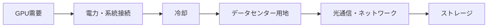
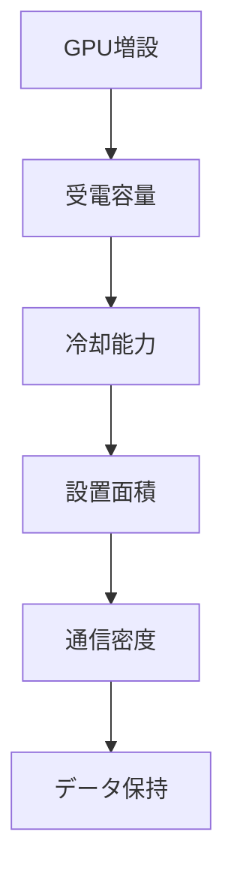

# 半導体の次に来るAIインフラ投資先はどこか

## 1. エグゼクティブサマリー

GPU需要の派生需要を追うと、次に大きくなる投資先は単一の業種ではない。最初に詰まるのは電力と系統接続で、そこから冷却、データセンター用地と建屋、光通信・ネットワーク、最後にストレージへ波及する。AIインフラは「半導体の次」ではあるが、実際には半導体の外側にある制約の束である。<SourceNote>[IEA, Energy and AI](https://www.iea.org/reports/energy-and-ai) は、2024年のデータセンター電力需要を約415TWh、世界電力消費の約1.5%と推計し、AI中心の施設は100MW超に達しうると整理している。 [CBRE, Global Data Center Trends 2025](https://www.cbre.com/insights/reports/global-data-center-trends-2025) は、需要に対して電力制約と許認可の遅れが成長の主ボトルネックだと述べている。</SourceNote>

このレポートの結論は次の通りである。

1. 最優先のボトルネックは電力である。GPUの増設は、半導体より先に変電設備、系統接続、受電容量で止まる。
2. 冷却は電力の次に来る。高密度ラックでは空冷だけでは追いつかず、液冷と熱交換設備の投資が必要になる。
3. データセンター不動産は遅れやすいが、需要が強い局面では最も早く埋まる。用地、建屋、電力の三点が揃わないと供給できないからである。
4. 光通信・ネットワークは、単一GPUではなくクラスター規模の拡張で効いてくる。400Gから800G、さらに1.6Tへの世代更新が収益化の節目になる。
5. ストレージは遅行だが継続性が高い。学習データ、ログ、推論結果、データ保全が増えるほど需要は積み上がる。

公表情報からの推定としては、短期の収益化は電力・冷却・データセンター不動産が先行し、中期にネットワークと光部品、後期にストレージが厚くなる。したがって「AIインフラの次の勝ち筋」は一つの銘柄群ではなく、上流の制約から順に見るのが実務的である。

この順番は厳密な因果の固定列ではないが、実務ではこの順で先に詰まりやすい。電力が足りなければ冷却設備を増やしても稼働できず、建屋があっても受電できなければ売上にならない。ネットワークやストレージは、その先にある計算需要とデータ需要が立ち上がったときに伸びやすい。

## 2. 何が次のボトルネックか

AI向けGPUは、単体のチップではなく高密度なシステムとして動く。したがって、本当の制約は「チップを買えるか」ではなく、「チップを載せたラックを安全に、連続的に、十分な密度で動かせるか」にある。IEAは、2024年のデータセンターとデータ伝送網の電力消費を約415TWhと見積もり、2030年には1,000TWh超もあり得ると示した。これは、AIが電力需要を単なる補助線ではなく、インフラ投資の主軸に押し上げていることを意味する。<SourceNote>[IEA, Energy and AI](https://www.iea.org/reports/energy-and-ai) と [IEA, Powering Data Centres in the Age of AI](https://www.iea.org/reports/powering-data-centres-in-the-age-of-ai) を参照した。</SourceNote>

この図の意味は単純である。GPUが増えるほど、まず電力が必要になり、電力が増えるほど冷却が必要になり、冷却と受電が揃うと設置面積が必要になる。さらにクラスターが大きくなると通信密度が上がり、学習と推論が増えると保存すべきデータが増える。

NRELとDOE系の公開資料は、液冷が高密度ラックで重要になる理由を補強している。液体は空気よりはるかに大きな熱輸送能力を持つため、空冷では難しい高発熱ラックを扱いやすい。<SourceNote>[NREL, Warm-Water Liquid Cooling](https://www.nrel.gov/computational-science/warm-water-liquid-cooling.html) は、高密度データセンターで液冷が重要になる背景を示している。 [U.S. Department of Energy, DOE announces more efficient cooling for data centers](https://www.energy.gov/articles/doe-announces-40-million-more-efficient-cooling-data-centers) も、冷却と効率が主要課題であることを示す。</SourceNote>

## 3. 領域別比較

以下は、AI需要の派生先を「何が売れるか」「どのくらい早く収益化するか」「どこで規制にぶつかるか」で並べたものである。ここでの順序は公表情報からの推定であり、公式ロードマップではない。

| 領域 | 何が売れるか | 収益化の早さ | 主な制約 | 代表例 |
| --- | --- | --- | --- | --- |
| 電力・系統接続 | 変電設備、受電設備、UPS、配電、発電補完 | 最速 | 接続待ち、送電網、許認可、需要地の土地 | Eaton、Vertiv、各国のユーティリティ |
| 冷却 | 空冷の強化、液冷、CDU、熱交換、監視 | 早い | 水資源、熱排出、建築規制、改修難度 | Vertiv、Eaton、Schneider Electric |
| データセンター不動産 | 造成、建屋、コロケーション、ハイパースケール用床 | 早いが供給制約が強い | 用地、系統接続、建築許認可、空室率 | Digital Realty、Equinix、DTCR、IDGT |
| 光通信・ネットワーク | 400G/800G/1.6T光部品、スイッチ、DCI | 中位 | 世代交代、供給制約、輸出規制、電力効率 | Arista、Corning、Coherent、Ciena |
| ストレージ | HDD、SSD、オブジェクト保管、データ管理 | 中位から遅行 | 企業の支出規律、媒体構成、データ保全要件 | Seagate、NetApp、Western Digital |

<SourceNote>[Vertiv](https://www.vertiv.com/) と [Eaton](https://www.eaton.com/) は、AIデータセンター向けの電源・熱管理需要を主力事業の伸びとして説明している。 [Digital Realty](https://www.digitalrealty.com/) と [Equinix](https://www.equinix.com/) は、需要と供給制約の両方が強いデータセンター市場を示している。 [Arista](https://www.arista.com/)、[Corning](https://www.corning.com/) 、[Coherent](https://www.coherent.com/) 、[Ciena](https://www.ciena.com/) は、AIネットワークと光部品の世代更新を追う代表例である。 [Seagate](https://www.seagate.com/) と [NetApp](https://www.netapp.com/) は、AI時代のデータ保持とストレージ管理を示す代表例である。</SourceNote>

## 4. 収益化タイミングとcapexサイクル

収益化の早さは、需要の大きさよりも「受注までの距離」で決まる。GPUが増えた瞬間に売上が立つわけではなく、電力契約、設計凍結、建設開始、稼働開始という複数の段階を経て設備投資が流れる。

| 領域 | 収益化の起点 | 典型的なラグ | 解釈 |
| --- | --- | --- | --- |
| 電力・系統接続 | 受電・変電の設計と系統申請 | 短い | 先に注文が出るが、納期は長い |
| 冷却 | 高密度ラックの設計凍結 | 短いから中位 | 既存施設の改修案件でも売上化しやすい |
| データセンター不動産 | 用地確保と事前リーシング | 短いから中位 | 需要は強いが、供給は遅い |
| 光通信・ネットワーク | クラスター拡張と世代更新 | 中位 | 400G→800G→1.6Tで受注が積み上がる |
| ストレージ | データ保持と保全ポリシー | 中位から長い | 学習と推論の後に蓄積需要が増える |

この時間差は重要である。電力と冷却は施設の立ち上がりと同時に必要になるため、最初の受注が早い。一方で、光通信やストレージは、AIクラスタが実際に動き、データ保持ポリシーが固まってから強くなる。したがって、投資テーマとしては「いつ売上に変わるか」を見ないと、人気先行で時間だけ失いやすい。<SourceNote>[IEA, Energy and AI](https://www.iea.org/reports/energy-and-ai) と [CBRE, Global Data Center Trends 2025](https://www.cbre.com/insights/reports/global-data-center-trends-2025) は、AI需要の伸びが電力・設置能力・許認可に制約されることを示している。 [Arista](https://www.arista.com/) や [Corning](https://www.corning.com/) の決算・開示は、AIネットワークが世代更新ごとに伸びることを示している。 [Seagate](https://www.seagate.com/) と [NetApp](https://www.netapp.com/) は、データ成長が後段で継続的な需要になることを示す。</SourceNote>

## 5. 規制・制約

AIインフラは、技術よりも立地と規制で遅れることが多い。特に電力と冷却は、半導体の供給制約ではなく、系統接続、用地、許認可、水、環境規制で詰まりやすい。

1. 電力は系統接続待ちが最初の障害になる。
2. 冷却は水資源と熱排出で制約を受ける。
3. データセンター不動産は、用途地域、騒音、景観、送電線の距離に縛られる。
4. 光通信は、部材供給と輸出規制の影響を受ける。
5. ストレージは、データ主権や保全ポリシーの違いで需要の形が変わる。

EatonやVertivの資料は、AI向け設備が従来より高い電力密度と熱管理を前提にしていることを示す。CBREは、2025年のデータセンター市場で空室率が極めて低く、供給増よりも電力制約が問題だと整理している。IEAは、データセンターの伸びが政策、グリッド、需要地のインフラと結びつくと指摘する。<SourceNote>[Eaton](https://www.eaton.com/) と [Vertiv](https://www.vertiv.com/) のAIデータセンター関連資料、[CBRE, Global Data Center Trends 2025](https://www.cbre.com/insights/reports/global-data-center-trends-2025)、[IEA, Powering Data Centres in the Age of AI](https://www.iea.org/reports/powering-data-centres-in-the-age-of-ai) を参照した。</SourceNote>

## 6. 代表企業・ETF・上場セクター

これは銘柄推奨ではない。実務上は、どの層にマネーが流れているかを把握するための見取り図である。

| 層 | 企業例 | ETFの見方 | 補足 |
| --- | --- | --- | --- |
| 電力・電源・熱管理 | Eaton、Vertiv、Schneider Electric | インフラETF、公益ETF | 受電、配電、冷却が一体で動く |
| データセンター不動産 | Digital Realty、Equinix | DTCR、IDGT | 需給が逼迫すると賃料と稼働率が効く |
| 光通信・ネットワーク | Arista、Corning、Coherent、Ciena | 通信機器ETF、デジタルインフラETF | 世代交代の節目で受注が増える |
| ストレージ | Seagate、NetApp、Western Digital | 広義のITハードウェアETF | AIデータの蓄積と保全でじわじわ効く |

純粋なAIインフラETFはまだ少ないため、実務では広いインフラETFと個別株を組み合わせることが多い。データセンター系ではDTCRやIDGT、広域インフラではIGF、IFRA、POWRのような商品が参照されることがあるが、地域や構成比は異なるため、名前だけで中身を決めない方がよい。<SourceNote>[Global X Data Center REITs & Digital Infrastructure ETF](https://www.globalxetfs.com/funds/srvr/)、[Global X Digital Infrastructure ETF](https://www.globalxetfs.com/funds/idgt/)、[iShares Global Infrastructure ETF](https://www.ishares.com/us/products/239502/ishares-global-infrastructure-etf)、[iShares U.S. Infrastructure ETF](https://www.ishares.com/us/products/239522/ishares-us-infrastructure-etf)、[iShares U.S. Power Infrastructure ETF](https://www.ishares.com/us/literature/fact-sheet/powr-ishares-us-power-infrastructure-etf-fund-fact-sheet-en-us.pdf) など、ETFは発行体ごとに対象が異なる。 [Global X Digital Infrastructure ETF](https://www.globalxetfs.com/funds/idgt/) や [Global X Data Center REITs & Digital Infrastructure ETF](https://www.globalxetfs.com/funds/srvr/) は、データセンター寄りの上場投資商品の例である。</SourceNote>

## 7. 実務含意

実務で見るべき指標は、GPU台数そのものより、GPUを動かすための周辺投資である。

1. 変電設備、受電契約、系統接続待ちの改善
2. 液冷やCDUの受注、改修案件の増加
3. コロケーションの事前リーシングと空室率
4. 400G、800G、1.6Tの世代更新
5. ストレージの容量増加とデータ保持ポリシーの強化

これらが先に動くほど、AI需要は半導体だけでなく、建設、電力、通信、保管に波及していると読める。逆に、GPUの販売だけが強くても、電力と建屋が詰まれば実需には変わらない。AIインフラを追うなら、上流の供給制約と下流の受注残を同時に見る必要がある。<SourceNote>[IEA, Energy and AI](https://www.iea.org/reports/energy-and-ai)、[CBRE, Global Data Center Trends 2025](https://www.cbre.com/insights/reports/global-data-center-trends-2025)、[Arista](https://www.arista.com/)、[Corning](https://www.corning.com/) の開示と決算資料を踏まえた公表情報からの推定である。</SourceNote>

## 8. リスク・限界

この整理には限界がある。第一に、AI需要の電力推計や設備需要は、モデル効率の改善やワークロードの変化で上下する。第二に、会社側の開示は将来見通しを含み、実際の売上化にはラグがある。第三に、地域ごとに規制と電力コストが違うため、同じテーマでも市場ごとに勝ち筋が変わる。

したがって、このレポートは「どの業種が上がるか」を断定するものではない。むしろ、GPU需要がどの層で最初に現金化されるかを整理するための地図である。短期のテーマ性だけでなく、系統接続、建屋、冷却、通信、保管という実装順を読むことが、半導体の次を理解する近道になる。

## 参考情報

- [IEA, Energy and AI](https://www.iea.org/reports/energy-and-ai)
- [IEA, Powering Data Centres in the Age of AI](https://www.iea.org/reports/powering-data-centres-in-the-age-of-ai)
- [CBRE, Global Data Center Trends 2025](https://www.cbre.com/insights/reports/global-data-center-trends-2025)
- [NREL, Warm-Water Liquid Cooling](https://www.nrel.gov/computational-science/warm-water-liquid-cooling.html)
- [U.S. Department of Energy, DOE announces more efficient cooling for data centers](https://www.energy.gov/articles/doe-announces-40-million-more-efficient-cooling-data-centers)
- [Eaton](https://www.eaton.com/)
- [Vertiv](https://www.vertiv.com/)
- [Digital Realty](https://www.digitalrealty.com/)
- [Equinix](https://www.equinix.com/)
- [Arista](https://www.arista.com/)
- [Corning](https://www.corning.com/)
- [Coherent](https://www.coherent.com/)
- [Ciena](https://www.ciena.com/)
- [Seagate](https://www.seagate.com/)
- [NetApp](https://www.netapp.com/)
