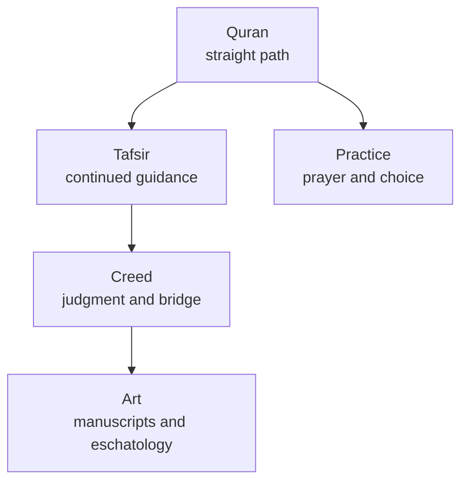

# Sirat in the Quran: straight path, bridge, and judgment

## 1. Executive Summary

The word often rendered as "Sirat" has at least two layers. In the Quran, `ṣirāṭ` primarily means a path, way, or straight path. In hadith and creed, `al-Ṣirāṭ` also becomes the bridge laid over Hell on the Day of Judgment. These layers are related, but they are not identical. The first concerns the direction of life; the second dramatizes that direction as an eschatological crossing.

Missing this distinction makes it seem as if the Quran itself directly describes the bridge as "thinner than hair and sharper than a sword." The Quranic center is the prayer "guide us along the Straight Path." The concrete bridge image is developed mainly through prophetic traditions, creed, preaching, popular eschatology, and visual culture. <SourceNote>[Quran.com 1:6](https://previous.quran.com/1:6?font=v2&translations=131%2C20) renders `al-ṣirāṭ al-mustaqīm` as the "Straight Path." [Quranic Arabic Corpus](https://corpus.quran.com/qurandictionary.jsp?q=SrT) lists `ṣirāṭ` as a Quranic noun occurring 45 times. [Sahih al-Bukhari 806](https://sunnah.com/bukhari:806) and [Sunan Ibn Majah 4280](https://sunnah.com/ibnmajah:4280) present `al-Ṣirāṭ` as a bridge.</SourceNote>

The practical reading is that sirat asks not only whether a believer knows the right path, but whether that path is maintained. The repeated prayer of al-Fātiḥah, ethical forks in daily life, communal norms, and postmortem accountability all gather around one metaphor. Sirat is not just an afterlife image; it is a device that links guidance, submission, freedom, responsibility, and salvation in Islamic thought.

## 2. Quran Overview

The Quran is the sacred scripture of Islam. In Islamic belief it is God's speech revealed to the Prophet Muhammad through the angel Jibril. Historically, the revelation is usually described as unfolding in Mecca and Medina from around 610 until Muhammad's death in 632. The Arabic text is divided into 114 surahs and addresses prayer, recitation, law, ethics, eschatology, narrative, polemic, and divine unity. <SourceNote>[Britannica, Qurʾān](https://www.britannica.com/topic/Quran) summarizes the Islamic understanding of revelation, the 610-632 chronology, the 114-surah structure, and the text's legal, eschatological, and narrative material.</SourceNote>

The Quran is not simply a book for silent reading. It is a recited word. The Arabic word `qurʾān` is itself connected with reading or recitation, and Islamic culture has treated voice, memory, prayer, writing, and illumination as mutually reinforcing ways of honoring scripture. <SourceNote>[Smarthistory, Folio from a Qur’an](https://smarthistory.org/folio-from-a-quran/) explains how the Quran manuscript form developed to match the dignity of divine revelation while stressing that "Qur'an" means recitation and points to the priority of oral tradition.</SourceNote>

Historical research separates belief in divine revelation from questions that can be examined historically or philologically. The latter include transmission, collection, and standardization. Islamic tradition describes post-prophetic collection under Zayd ibn Thabit and later standardization under the caliph Uthman to reduce divergence in recitation. Manuscript evidence broadly fits the view that the received consonantal text existed by about the mid-seventh century, while leaving room for scholarly questions about early editing and reading traditions. <SourceNote>[Britannica, Origin and compilation](https://www.britannica.com/topic/Quran/Origin-and-compilation) distinguishes religious claims from historical analysis and summarizes Zayd's collection, Uthman's standardization, and early manuscript dating.</SourceNote>

## 3. What Sirat Means

The Arabic `ṣirāṭ` means a path, way, or route. Its most famous occurrence is al-Fātiḥah 1:6, `ihdinā al-ṣirāṭ al-mustaqīm`, "guide us along the Straight Path." Verse 1:7 then identifies that path as the path of those blessed by God. <SourceNote>[Quran.com 1:6](https://previous.quran.com/1:6?font=v2&translations=131%2C20) and [Quran.com 1:7](https://quran.com/1/7) render the word as "Straight Path" and "Path."</SourceNote>

It should not be confused with `sīrah`, the genre of prophetic biography. `Ṣirāṭ` is the path; `sīrah` is biography or life narrative. The two words are close in romanization but distinct in meaning and scholarly use. <SourceNote>[Britannica, sīrah](https://www.britannica.com/topic/sirah) describes `sīrah` as prophetic biography literature and points to the Ibn Ishaq tradition.</SourceNote>

Across the Quran, `ṣirāṭ` marks divine guidance, prophetic calling, communal ethics, and sometimes a path toward Hell. Quran 6:153 contrasts God's single straight path with other ways that scatter people away from His way. In this verse, the path is a metaphor, but it also names concrete moral orientation. <SourceNote>[Quranic Arabic Corpus](https://corpus.quran.com/qurandictionary.jsp?q=SrT) lists Quranic occurrences of `ṣirāṭ`. [Quran.com 6:153](https://quran.com/6/153) contrasts "My Path" with other ways that lead away from God's way.</SourceNote>

## 4. Scriptural Meaning and Teaching

The sirat of al-Fātiḥah is embedded in prayer. Muslims repeatedly recite al-Fātiḥah in the daily prayers, and its core request is guidance. The prayer is not a declaration that the believer has already arrived. It positions the believer as someone who continually needs guidance, firmness, correction, and continuity. <SourceNote>[Smarthistory, Illumination of the Qur’an](https://smarthistory.org/illumination-quran/) notes the special significance of Surat al-Fātiḥah because it is recited in the five daily prayers. [Quran.com 1:6 Ma'arif al-Qur'an](https://quran.com/en/1:6/tafsirs/en-tafsir-maarif-ul-quran) explains repeated guidance as a question of degrees and continuity.</SourceNote>

Classical tafsir reads `al-ṣirāṭ al-mustaqīm` as the clear path without branching and connects it with Islam, God's guidance, God's limits, and correct obedience. The English Ibn Kathir page on Alim.org cites al-Tabari's explanation and presents a tradition in which the straight path is Islam, the walls are God's limits, the open doors are prohibitions, and the callers are the Book of God and divine admonition in the believer's heart. <SourceNote>[Alim.org, Tafsir Ibn Kathir on al-Fātiḥah 1:6](https://www.alim.org/quran/tafsir/ibn-kathir/surah/1/6/) gives al-Tabari's "clear path without branches" explanation, identifies the straight path with Islam, and explains the continuing need to ask for guidance.</SourceNote>

The teaching is therefore larger than rule compliance. Quranic sirat asks not only which rule a person followed, but which direction a life is taking. Quran 6:153 makes this explicit by opposing one straight path to multiple diverging ways. That structure connects prayer, daily ethics, communal discipline, and final accountability.

## 5. Al-Sirat as the Bridge

Hadith literature presents `al-Ṣirāṭ` as the bridge laid over Hell on the Day of Judgment. Sahih al-Bukhari 806 places the bridge within a resurrection and judgment scene and says it will be laid across Hell. Sunan Ibn Majah 4280 says the Sirat will be placed across Hell and that people will cross it: some safe, some detained, and some falling. <SourceNote>[Sahih al-Bukhari 806](https://sunnah.com/bukhari:806) describes `As-Sirat` as laid across Hell. [Sunan Ibn Majah 4280](https://sunnah.com/ibnmajah:4280) describes the Sirat placed across Hell and marks the report as Hasan in the Darussalam grading.</SourceNote>

This image overlays the earthly straight path with the afterlife crossing. The way one walked in life becomes visible as one's passage at judgment. If the bridge is read only as physical spectacle, it can look like folklore. Its theological function is more precise: it compresses belief, action, mercy, judgment, and communal belonging into one scene.

The bridge also enters creed. The English translation of al-Aqidah al-Tahawiyyah lists belief in resurrection, recompense, presentation of deeds, reckoning, reading of the book of deeds, reward and punishment, the bridge over Hell `al-sirat`, and the scale `al-mizan`. In that setting, the Sirat is part of eschatological doctrine rather than an optional story. <SourceNote>[Al-Aqidah al-Tahawiyyah in English and Arabic](https://www.abuaminaelias.com/aqeedah-tahawiyyah/) lists faith in resurrection, deeds, reckoning, the book, reward and punishment, `al-sirat`, and `al-mizan`.</SourceNote>

## 6. Historical Interpretation

Historically, three layers should be kept separate. The first is Quranic vocabulary: `ṣirāṭ` as path. The second is tafsir: the straight path as Islam, divine guidance, God's limits, and continued guidance. The third is hadith, creed, preaching, and popular eschatology: the earthly path dramatized as the bridge over Hell.

The bridge image also has a comparative religious context. Zoroastrianism has the Chinvat Bridge, crossed by the soul after death; it becomes broad and comfortable for the righteous and narrow and perilous for the wicked. This comparison is useful, but similarity does not by itself prove direct borrowing. Late antique and early Islamic West Asia included Jewish, Christian, Zoroastrian, Manichaean, and Arabian religious materials, so bridge, scale, judgment, and afterlife motifs could circulate and be reworked through multiple channels. <SourceNote>[Encyclopaedia Iranica, Eschatology i](https://www.iranicaonline.org/articles/eschatology-i/) describes Zoroastrian influence on neighboring religions and explains the Chinvat Bridge as broad for the righteous and narrow for the wicked.</SourceNote>

Modern historical method should therefore not treat Quranic text, early reports, later creed, sermons, and art as evidence of the same kind. The firm distinction is between the Quranic word and the bridge image matured in religious culture. The path is unambiguously Quranic; the bridge must be read through hadith and reception history.

## 7. Religious Interpretation

In Sunni creed, the Sirat bridge belongs to resurrection, judgment, and recompense. Creeds such as al-Tahawiyyah tend to receive it as an afterlife reality rather than dissolving it into allegory. In preaching and tafsir, however, the bridge also becomes an ethical warning: correct the path you are walking now.

In Twelver Shia contexts, Sirat can be linked more directly with recognition of the Imams, obedience, and wilayah. The Al-Islam.org translation of Haqq al-Yaqin describes Sirat as a bridge over Hell and then presents interpretations that connect the worldly Sirat with the religion of truth, wilayah, and love and obedience toward the Imams. Here the bridge visualizes relation to legitimate spiritual authority, not only general morality. <SourceNote>[Al-Islam.org, Haqq al-Yaqin, Section 13: Sirat Bridge](https://al-islam.org/haqq-al-yaqin-muhammad-baqir-al-majlisi/section-13-sirat-bridge) presents the bridge over Hell and Shia interpretations connecting the worldly Sirat with wilayah and recognition of the Imams.</SourceNote>

In ethical and mystical readings, Sirat is also interior orientation. The path to God is not only external rule-following; it involves habits, desire, self-command, and the direction of the heart. The fear of the bridge becomes moral fear, and the prayer for guidance becomes a daily audit of one's own footing.

## 8. Artworks and Visual Culture

The first artistic field is the Quran manuscript. Because al-Fātiḥah contains the prayer for the straight path, illuminated openings of al-Fātiḥah are visual entrances into the concept. The Metropolitan Museum of Art records a late eighteenth- to early nineteenth-century Quran manuscript attributed to Kashmir, whose opening surahs, including al-Fātiḥah, use a blue and gold palette. <SourceNote>[The Met, Qur'an Manuscript, 2009.294](https://www.metmuseum.org/art/collection/search/456964) records illuminations at the openings of several surahs, including al-Fātiḥah, a Kashmir attribution, and public-domain images.</SourceNote>

Mamluk Quran manuscripts provide a second example. The Museum With No Frontiers record for a Quran associated with Sultan Jaqmaq describes a double-page opening for al-Fātiḥah and al-Baqara, thuluth script, vegetal motifs, and golden tri-petalled verse separators. This shows how the prayer for the straight path was made visible through recitation, writing, patronage, and ornament. <SourceNote>[Discover Islamic Art, Qur’an](https://islamicart.museumwnf.org/database_item.php?id=object;isl;eg;mus01;9;en) describes the al-Fātiḥah opening, thuluth script, vegetal ornament, verse markers, and Mamluk patronage context.</SourceNote>

The bridge image appears less often as a museum object title and more often inside Mi'raj, hell, last judgment, paradise, and hell-tour imagery. The 1436 Mi'rajnameh image of Muhammad visiting Hell with Jibril is not titled as the Sirat bridge, but it is important for the broader visual culture of afterlife, punishment, and salvation. <SourceNote>[Wikimedia Commons record for BnF Supplément Turc 190 fol. 61r](https://commons.wikimedia.org/wiki/File:Paris,_BnF,_Suppl%C3%A9ment_Turc_190_fol._61r_Muhammad_visits_Hell.jpg) records the 1436 miniature and links to the Gallica source. The manuscript and image context for Mi'raj art can be checked in [The Ascension of the Prophet and the Stations of His Journey](https://sites.lsa.umich.edu/christianegruber/wp-content/uploads/sites/846/2022/09/Gruber-The-Mirajnamas-Afterlife-in-Ottoman-Palace-Circles.pdf).</SourceNote>

There are therefore two good entry points for artworks. The first is Quran calligraphy and illumination around al-Fātiḥah, where the straight path is expressed through script, light, geometry, and vegetal ornament. The second is Mi'raj and eschatological painting, where bridge, Hell, judgment, and salvation are narrated visually. A simple rule such as "Islamic art never depicts figures" does not hold. Figural practice varies by region, period, genre, and devotional context.

## 9. Limits of Interpretation

Three limits matter. First, the Quranic `ṣirāṭ` and the bridge of hadith and creed should not be collapsed. Second, the bridge should not be forced into a binary of literal versus allegorical. Communities may receive it as an afterlife reality, use it as moral warning, and internalize it spiritually at the same time. Third, the comparison with the Zoroastrian Chinvat Bridge should not be overstated as proof of origin. Comparison is valuable only when textual layer, chronology, and transmission route remain visible.

The best reading treats Sirat as a theology of the path. The Quranic straight path is the guidance a believer asks for every day. The hadith bridge is the scene in which one's response to that guidance is judged. Artworks make both layers visible through script, light, ornament, hell journeys, and judgment imagery.

## References

- [Quran.com 1:6](https://previous.quran.com/1:6?font=v2&translations=131%2C20)
- [Quran.com 6:153](https://quran.com/6/153)
- [Quranic Arabic Corpus, ṣād rā ṭā](https://corpus.quran.com/qurandictionary.jsp?q=SrT)
- [Sahih al-Bukhari 806](https://sunnah.com/bukhari:806)
- [Sunan Ibn Majah 4280](https://sunnah.com/ibnmajah:4280)
- [Alim.org, Tafsir Ibn Kathir on al-Fātiḥah 1:6](https://www.alim.org/quran/tafsir/ibn-kathir/surah/1/6/)
- [Britannica, Qurʾān](https://www.britannica.com/topic/Quran)
- [Britannica, Origin and compilation](https://www.britannica.com/topic/Quran/Origin-and-compilation)
- [Britannica, Interpretation](https://www.britannica.com/topic/Quran/Interpretation)
- [Encyclopaedia Iranica, Eschatology i](https://www.iranicaonline.org/articles/eschatology-i/)
- [The Met, Qur'an Manuscript, 2009.294](https://www.metmuseum.org/art/collection/search/456964)
- [Smarthistory, Illumination of the Qur’an](https://smarthistory.org/illumination-quran/)
- [Discover Islamic Art, Qur’an](https://islamicart.museumwnf.org/database_item.php?id=object;isl;eg;mus01;9;en)
