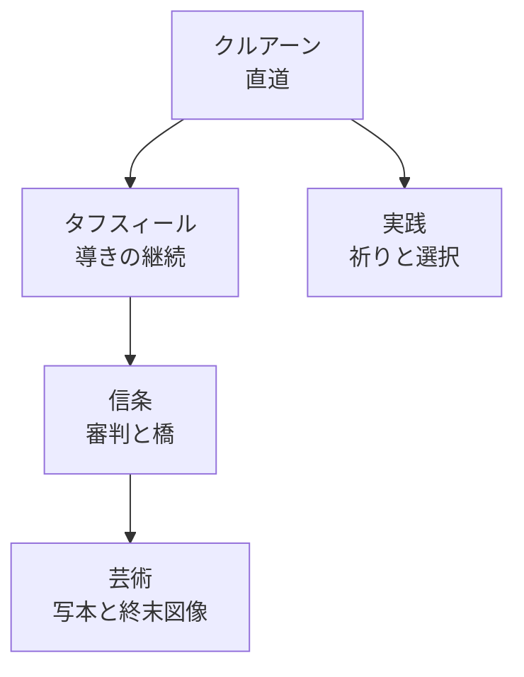

# コーランのシラート: 直道、橋、審判の解釈史

## 1. エグゼクティブサマリー

本稿の結論は単純である。日本語で「シラート」と呼ばれる語には、少なくとも二つの層がある。第一に、クルアーン本文の `ṣirāṭ` は、神が示す「道」「直道」を指す語である。第二に、ハディースと信条文献では、`al-Ṣirāṭ` が終末の日に地獄の上に架けられる橋として語られる。両者は別概念ではないが、同じでもない。前者は生の方向づけ、後者はその方向づけが審判で可視化される図像である。

この区別を外すと、クルアーンが直接「髪より細く剣より鋭い橋」を描いているように読んでしまう。実際には、クルアーンの中心表現は「われらを直道へ導きたまえ」であり、橋の具体像は主に預言者伝承、信条、説教、民衆的終末論、図像文化のなかで発達した。<SourceNote>[Quran.com 1:6](https://previous.quran.com/1:6?font=v2&translations=131%2C20) は `al-ṣirāṭ al-mustaqīm` を「Straight Path」と訳す。[Quranic Arabic Corpus](https://corpus.quran.com/qurandictionary.jsp?q=SrT) は `ṣirāṭ` がクルアーンで45回、名詞として出ると整理している。[Sahih al-Bukhari 806](https://sunnah.com/bukhari:806) と [Sunan Ibn Majah 4280](https://sunnah.com/ibnmajah:4280) は橋としての `al-Ṣirāṭ` を伝える。</SourceNote>

実務的に読むなら、シラートは「正しい道を知っているか」だけでなく、「その道を日々保ち続けるか」を問う概念である。礼拝で繰り返される『開端章』の祈り、倫理的な分岐、共同体の規範、死後の責任が一つの比喩軸に乗る。だからシラートは、単なる終末怪奇譚ではなく、イスラム思想における導き、服従、自由意思、責任、救済を結びつける装置として読むべきである。

## 2. クルアーンの概要

クルアーン、またはコーランは、イスラムにおける聖典である。イスラム信仰では、天使ジブリールを通じて預言者ムハンマドに下された神の言葉とされる。歴史的記述としては、啓示は610年頃から632年のムハンマドの死まで、メッカとメディナで段階的に語られたものと説明される。本文はアラビア語で、114のスーラに分かれ、礼拝、朗誦、法、倫理、終末、物語、論争、神の唯一性をめぐる説諭を含む。<SourceNote>[Britannica, Qurʾān](https://www.britannica.com/topic/Quran) は、イスラム信仰上の啓示理解、610年から632年までの啓示時期、114スーラ構成、法・終末・物語を含む内容を整理している。</SourceNote>

クルアーンは単なる読書用の本ではなく、朗誦される言葉として理解されてきた。アラビア語の `qurʾān` 自体も「読む」「朗誦する」と関係づけられる。写本は重要だが、イスラム文化では声、記憶、礼拝、書写、装飾が一体となって聖典を支えてきた。<SourceNote>[Smarthistory, Folio from a Qur’an](https://smarthistory.org/folio-from-a-quran/) は、クルアーン写本の発展を神的啓示の尊厳に応じた造形として説明しつつ、`Qur’an` が「recitation」を意味する点から口誦伝統の重要性を指摘している。</SourceNote>

歴史研究では、啓示の神的起源そのものは信仰命題であり、歴史学や文献学で証明・反証する対象ではない。検討対象になるのは、本文がどの時期に、どのような伝達・標準化過程を経たかである。伝統的説明では、ムハンマドの死後にザイド・イブン・サービトによる収集が行われ、第三代カリフのウスマーン期に朗誦の差異を抑えるため標準化された。近年の写本研究は、受容された本文が7世紀半ば頃に存在していたという伝統的理解と大きく矛盾しない結果も示している。<SourceNote>[Britannica, Origin and compilation](https://www.britannica.com/topic/Quran/Origin-and-compilation) は、啓示の神的起源を歴史学の検証対象から分け、ザイドによる収集、ウスマーン期の標準化、初期写本の年代を整理している。</SourceNote>

## 3. シラートとは何か

アラビア語の `ṣirāṭ` は、クルアーンでは「道」「進路」「まっすぐな道」を指す。代表例は『開端章』1章6節の `ihdinā al-ṣirāṭ al-mustaqīm`、すなわち「われらを直道へ導きたまえ」である。続く1章7節では、その道が「恵みを受けた者たちの道」として説明される。<SourceNote>[Quran.com 1:6](https://previous.quran.com/1:6?font=v2&translations=131%2C20) と [Quran.com 1:7](https://quran.com/1/7) は、『開端章』の `ṣirāṭ` を「Straight Path」「Path」と訳している。</SourceNote>

ただし、発音が近い `sīrah` と混同してはいけない。`sīrah` は預言者ムハンマドの伝記文学を指す語であり、日本語でも「スィーラ」「シーラ」と表記される。`ṣirāṭ` は道、`sīrah` は伝記・生涯記述であり、学術的には別の語である。<SourceNote>[Britannica, sīrah](https://www.britannica.com/topic/sirah) は、`sīrah` を預言者伝記文学として説明し、イブン・イスハーク系統の伝記資料に触れている。</SourceNote>

クルアーン全体では、`ṣirāṭ` は神の導き、預言者の呼びかけ、共同体の倫理的方向、時に地獄へ向かう道を表す。6章153節は「これがわが直道である。これに従い、ほかの道に従うな」と述べ、単数の直道と複数の分岐する道を対比する。ここでは「道」は比喩であると同時に、具体的な生の選択を指す。<SourceNote>[Quranic Arabic Corpus](https://corpus.quran.com/qurandictionary.jsp?q=SrT) は `ṣirāṭ` の用例を一覧化している。[Quran.com 6:153](https://quran.com/6/153) は、神の直道と人を神の道から離す複数の道の対比を示す。</SourceNote>

## 4. 経典上の意味と教示

『開端章』のシラートは、イスラムの礼拝実践と直結している。『開端章』は日々の礼拝で繰り返し朗誦される章であり、その中核に「導き」の祈りが置かれる。つまりシラートは、すでに信仰者である者が、自分は完成していると宣言する言葉ではない。むしろ、神の導きを毎日必要とする存在として自分を置き直す言葉である。<SourceNote>[Smarthistory, Illumination of the Qur’an](https://smarthistory.org/illumination-quran/) は、アル＝ファーティハが五回の礼拝で朗誦されるため特に重要だと説明している。[Quran.com 1:6 Ma'arif al-Qur'an](https://quran.com/en/1:6/tafsirs/en-tafsir-maarif-ul-quran) は、導きを持つ者も繰り返し導きを祈る理由を、導きの継続と程度の問題として解説する。</SourceNote>

古典的タフスィールでは、`al-ṣirāṭ al-mustaqīm` は「枝分かれのない明白な道」と説明され、イスラムそのもの、神の書、神の境界、正しい服従と結びつけられる。イブン・カスィールの英訳ページは、アル＝タバリーの説明を引きつつ、直道をイスラム、二つの壁を神の境界、扉を禁じられたもの、呼びかけを神の書と内なる訓戒として読む伝承を紹介する。<SourceNote>[Alim.org, Tafsir Ibn Kathir on al-Fātiḥah 1:6](https://www.alim.org/quran/tafsir/ibn-kathir/surah/1/6/) は、アル＝タバリーの「枝分かれのない明白な道」という説明、直道をイスラムとする解釈、導きの継続を祈る意味を掲載している。</SourceNote>

この教示が意味しているのは、倫理を単なる規則遵守に縮めないことである。クルアーンのシラートは「どの規則を守ったか」だけでなく、「どの方向へ歩いているか」を問う。6章153節の対比が示すように、道は一つの大きな方向性であり、分岐する道は人を神の道から離す力である。この構造は、礼拝、日常倫理、共同体の規範、終末の責任をつなぐ。

## 5. 終末の橋としてのアル＝シラート

ハディースでは、`al-Ṣirāṭ` は終末の日に地獄の上に置かれる橋として語られる。『サヒーフ・ブハーリー』806では、復活の日の審判場面で、地獄の上にシラートが架けられ、ムハンマドとその共同体が渡るとされる。『スナン・イブン・マージャ』4280では、シラートが地獄の上に置かれ、人々が通過し、ある者は安全に渡り、ある者は留められ、ある者は落ちるとされる。<SourceNote>[Sahih al-Bukhari 806](https://sunnah.com/bukhari:806) は `As-Sirat` が地獄の上に置かれると述べる。[Sunan Ibn Majah 4280](https://sunnah.com/ibnmajah:4280) は、シラートを地獄の上に置かれるものとして描き、伝承等級を Hasan と表示している。</SourceNote>

この橋のイメージは、現世の「直道」と来世の「通過」を重ねる。現世で人がどの道を選んだかが、終末に渡れるかどうかとして現れる。したがって、橋の物理的描写だけを見ると民話的に見えるが、宗教的機能は明確である。シラートは、信仰、行為、神の慈悲、審判、共同体帰属を一つの緊張ある場面に集約する。

この点は信条文献にも入る。『アル＝アキーダ・アル＝タハーウィーヤ』の英訳は、復活、行為の提示、清算、書の読誦、報酬と罰、地獄の上の橋 `al-sirat`、秤 `al-mizan` への信仰を列挙する。ここではシラートは周辺的逸話ではなく、終末論の一部である。<SourceNote>[Al-Aqidah al-Tahawiyyah in English and Arabic](https://www.abuaminaelias.com/aqeedah-tahawiyyah/) は、復活の日の報い、行為の提示、清算、書、報酬と罰、`al-sirat`、`al-mizan` を信じると列挙している。</SourceNote>

## 6. 歴史的解釈

歴史的には、三つの層を分けると理解しやすい。第一層はクルアーンの語彙であり、`ṣirāṭ` は「道」として現れる。第二層はタフスィールであり、1章6節の「直道」を、イスラム、神の導き、神の境界、導きの継続として説明する。第三層はハディース・信条・説教文学であり、現世の直道が終末の橋として劇的に可視化される。

この橋のイメージには、比較宗教学上の近似もある。ゾロアスター教には、死者の魂が渡るチンワト橋があり、正しい者には広く快適に、悪しき者には狭く危険になると説明される。これはイスラムのシラート橋とよく比較される。ただし、類似があることは、直ちに直接借用を証明しない。古代末期から初期イスラム期の西アジアには、ユダヤ教、キリスト教、ゾロアスター教、マニ教、アラブ宗教文化が交差しており、終末・審判・橋・秤のようなモチーフは複数の回路で共有・再構成されうる。<SourceNote>[Encyclopaedia Iranica, Eschatology i](https://www.iranicaonline.org/articles/eschatology-i/) は、ゾロアスター教終末論が近隣宗教、特にユダヤ教を経由してキリスト教とイスラムにも影響したと述べ、チンワト橋が正しい者には広く、悪しき者には狭く危険になると説明している。</SourceNote>

近代的な歴史研究では、クルアーン本文、初期伝承、後代信条、民衆的説教、図像表現を同じ強度の根拠として扱わない。最も堅い区別は、「クルアーンにある語」と「後代の宗教文化で成熟した像」である。シラートの場合、道という語はクルアーンに明確にある。橋としての具体像は、ハディースとその受容史を通じて理解する必要がある。

## 7. 宗教上の解釈

スンナ派の信条では、シラート橋は復活の日の審判と報いの一部として語られる。『タハーウィーヤ』のような信条文献では、橋を過度に寓意化するより、来世の事柄として受け入れる姿勢が強い。とはいえ、説教やタフスィールでは、橋の描写は現世の倫理的警告として用いられる。つまり、橋は「後で起きる出来事」であるだけでなく、「いま歩いている道を正せ」という教化の装置でもある。

十二イマーム派シーア派の文脈では、シラートはさらにイマームへの認識、服従、ウィラーヤと結びつけられることがある。アル＝イスラーム財団掲載の『Haqq al-Yaqin』該当節は、シラートを地獄の上の橋として説明したうえで、現世のシラートを真理の宗教、ウィラーヤ、イマームへの愛と服従として解釈する伝承を載せる。ここでは、橋は単なる一般的道徳ではなく、正統な霊的権威への関係を可視化する。<SourceNote>[Al-Islam.org, Haqq al-Yaqin, Section 13: Sirat Bridge](https://al-islam.org/haqq-al-yaqin-muhammad-baqir-al-majlisi/section-13-sirat-bridge) は、シラートを地獄上の橋として述べ、現世のシラートをウィラーヤやイマームへの認識と結びつけるシーア派的解釈を紹介している。</SourceNote>

神秘主義的・倫理的に読む場合、シラートは内面の方向づけでもある。神へ向かう道を外から与えられた規則だけでなく、心の傾き、習慣、欲望、自己統御の問題として読む。ここでは、橋の恐怖は道徳的恐怖であり、導きの祈りは自分の足元を毎日点検する行為になる。

## 8. 芸術作品と視覚文化

シラートの芸術表現を考えるとき、まずクルアーン写本を外せない。『開端章』は直道の祈りを含むため、アル＝ファーティハの装飾写本はシラート理解の視覚的入口になる。メトロポリタン美術館のカシミール由来とされる18世紀末から19世紀初頭のクルアーン写本は、アル＝ファーティハなど複数章の冒頭に青と金の豪華な装飾を施している。<SourceNote>[The Met, Qur'an Manuscript, 2009.294](https://www.metmuseum.org/art/collection/search/456964) は、アル＝ファーティハなど九つのスーラ冒頭の装飾、カシミールに特徴的な青と金の配色、Public Domain 画像を記録している。</SourceNote>

マムルーク朝期のクルアーン写本も重要である。Museum With No Frontiers の記録するスルタン・ジャクマク期の写本では、アル＝ファーティハとアル＝バカラ冒頭が見開きで装飾され、トゥルス体、植物文、金の三弁花形の区切りが用いられる。これは直道の祈りが、単に読まれる文ではなく、礼拝・朗誦・書写・権力の庇護を通じて視覚化されることを示す。<SourceNote>[Discover Islamic Art, Qur’an](https://islamicart.museumwnf.org/database_item.php?id=object;isl;eg;mus01;9;en) は、アル＝ファーティハの見開き装飾、トゥルス体、植物文、マムルーク朝の寄進文化を説明している。</SourceNote>

一方、橋としてのシラートは、写本カタログでは作品名として直接出るよりも、ミウラージュ、地獄、最後の審判、楽園・地獄巡りの図像群のなかに近接して現れる。1436年の『ミウラージュ・ナーマ』写本に含まれる「ムハンマドがジブリールに導かれて地獄を訪れる」細密画は、橋そのものを題名にしたものではないが、終末・地獄・救済の視覚文化を理解する重要な例である。<SourceNote>[Wikimedia Commons record for BnF Supplément Turc 190 fol. 61r](https://commons.wikimedia.org/wiki/File:Paris,_BnF,_Suppl%C3%A9ment_Turc_190_fol._61r_Muhammad_visits_Hell.jpg) は、1436年の細密画「Muhammad visiting Hell guided by Jibril」と Gallica の原資料リンクを示す。ミウラージュ図像の文献・写本環境は [The Ascension of the Prophet and the Stations of His Journey](https://sites.lsa.umich.edu/christianegruber/wp-content/uploads/sites/846/2022/09/Gruber-The-Mirajnamas-Afterlife-in-Ottoman-Palace-Circles.pdf) の目次と資料一覧で確認できる。</SourceNote>

したがって、芸術作品としてのシラートを探すときは、二つの入口を使うべきである。第一はアル＝ファーティハを含むクルアーン写本とカリグラフィで、ここでは直道の祈りが文字・光・幾何学・植物文として表現される。第二はミウラージュや終末図像で、ここでは橋、地獄、審判、救済が物語画として展開する。ただし、イスラム美術では預言者像を避ける、顔を覆う、火炎光背で示す、地域や時代によって許容度が違うなどの制約があるため、「イスラム美術は偶像を描かない」と単純化すると誤る。

## 9. 読み方の限界

シラートを読むときの限界は三つある。第一に、クルアーン本文の `ṣirāṭ` とハディース・信条の橋を混同しないこと。第二に、橋の描写をすべて文字通りか寓意かの二択にしないこと。宗教共同体の内部では、来世の事柄として受け入れる読み、倫理的警告として用いる読み、神秘主義的に内面化する読みが重なっている。第三に、ゾロアスター教のチンワト橋との類似を「起源の証明」として過剰に使わないこと。比較は有効だが、伝播経路、時代、文献層を分ける必要がある。

本稿の要点は、シラートを「橋の怪異」としてではなく、「道の神学」として読むことにある。クルアーンの直道は、信仰者が日々求める導きである。ハディースの橋は、その導きへの応答が終末において問われる場面である。芸術作品は、その二つを文字、光、装飾、地獄巡り、審判図像として見える形にした。

## 参考情報

- [Quran.com 1:6](https://previous.quran.com/1:6?font=v2&translations=131%2C20)
- [Quran.com 6:153](https://quran.com/6/153)
- [Quranic Arabic Corpus, ṣād rā ṭā](https://corpus.quran.com/qurandictionary.jsp?q=SrT)
- [Sahih al-Bukhari 806](https://sunnah.com/bukhari:806)
- [Sunan Ibn Majah 4280](https://sunnah.com/ibnmajah:4280)
- [Alim.org, Tafsir Ibn Kathir on al-Fātiḥah 1:6](https://www.alim.org/quran/tafsir/ibn-kathir/surah/1/6/)
- [Britannica, Qurʾān](https://www.britannica.com/topic/Quran)
- [Britannica, Origin and compilation](https://www.britannica.com/topic/Quran/Origin-and-compilation)
- [Britannica, Interpretation](https://www.britannica.com/topic/Quran/Interpretation)
- [Encyclopaedia Iranica, Eschatology i](https://www.iranicaonline.org/articles/eschatology-i/)
- [The Met, Qur'an Manuscript, 2009.294](https://www.metmuseum.org/art/collection/search/456964)
- [Smarthistory, Illumination of the Qur’an](https://smarthistory.org/illumination-quran/)
- [Discover Islamic Art, Qur’an](https://islamicart.museumwnf.org/database_item.php?id=object;isl;eg;mus01;9;en)
