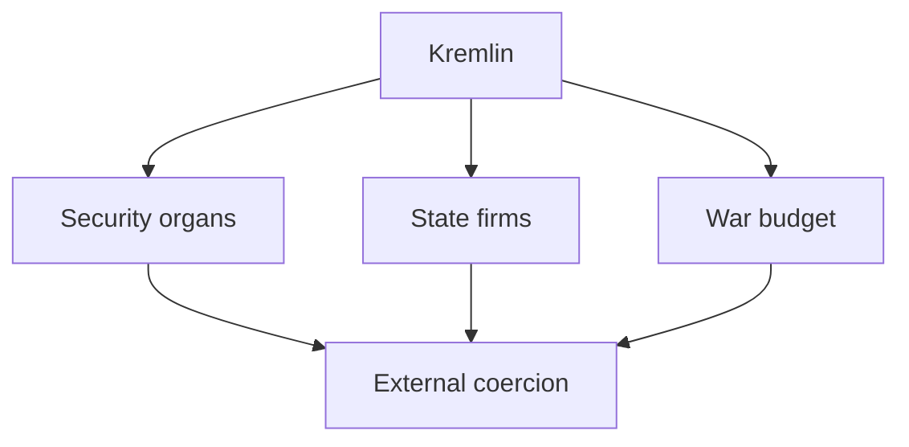
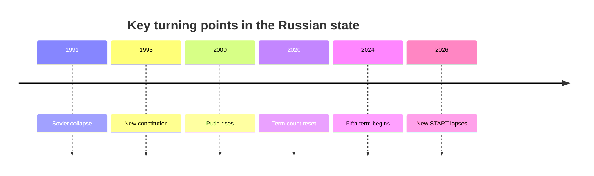
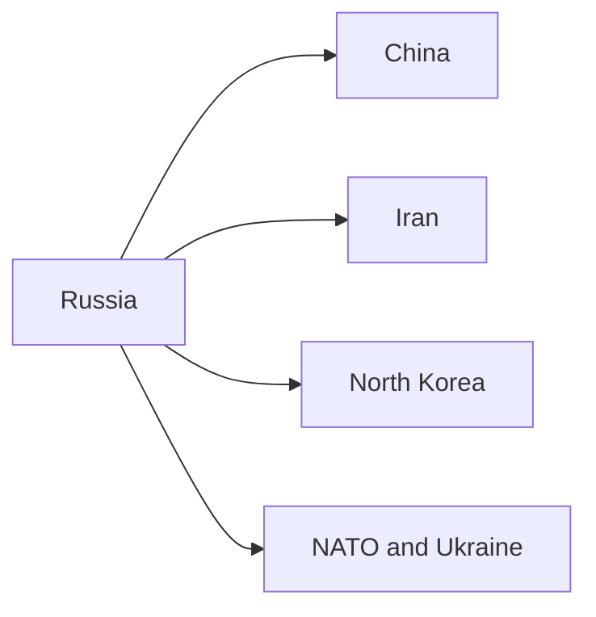

# Russia Geopolitical Profile 2026

## 1. Executive Summary

Russia is a nuclear-armed permanent member of the UN Security Council and a major energy exporter, but after the 2022 full-scale invasion it moved into a wartime posture built around sanctions and isolation. <SourceNote>[IMF, Russian Federation and the IMF](https://www.imf.org/en/countries/rus), [World Bank, Russia Overview](https://www.worldbank.org/en/country/russia/overview)</SourceNote>

Putin entered a fifth term after the 2024 presidential election, and Mikhail Mishustin was reappointed as prime minister. The public face of the system still includes elections and a bureaucracy, but real power is concentrated in the Kremlin and the security apparatus. <SourceNote>[AP News, Putin begins his fifth term as president, more in control of Russia than ever](https://apnews.com/article/355bd36a2e833800187af848dc24a7dc), [AP News, Putin reappoints his prime minister, a technocrat who has kept a low political profile](https://apnews.com/article/5915b06308d722e17a875892a6d1bdb5)</SourceNote>

The economy has not collapsed, but it is running with less slack. The World Bank expects growth of 0.9 percent in 2025 and about 1 percent in 2026 and 2027. The IMF projects 1.1 percent real growth and 5.6 percent consumer-price inflation in 2026. <SourceNote>[World Bank, Russia Overview](https://www.worldbank.org/en/country/russia/overview), [IMF, Russian Federation and the IMF](https://www.imf.org/en/countries/rus)</SourceNote>

The right way to read Russia is not to ask whether it is simply strong or weak. The more useful question is how domestic control, the Ukraine war, nuclear signaling, resource diplomacy, and dependence on China, Iran, and North Korea appear in policy and in what order. <SourceNote>[AP News, Xi heads to Russia to show support for Putin as the Ukraine war drags on](https://apnews.com/article/0c0086341e9694122a49fb7054b41d97), [AP News, North Korea says it sent troops to Russia and may send more to help in Ukraine war](https://apnews.com/article/559e604356bdd6976a7cb6dd159663e3), [AP News, Russia stages nuclear drills after the New START treaty expired earlier this year](https://apnews.com/article/cce4ba1be04956f7a91222a24c61a819)</SourceNote>

## 2. Historical and Institutional Base

The Russian state sits on top of discontinuities: empire, revolution, the Soviet Union, the 1991 collapse, and the 1993 constitution. The consolidation of power after 2012, combined with the 2020 constitutional amendments that reset the term count, institutionalized Putin’s long rule. <SourceNote>[Fifth inauguration of Vladimir Putin](https://en.wikipedia.org/wiki/Fifth_inauguration_of_Vladimir_Putin)</SourceNote>

The system keeps the appearance of federalism, but in practice it prioritizes loyalty and control. Elections reinforce regime legitimacy, while the courts and media operate more as parts of regime maintenance than as independent oversight institutions.

## 3. Current Power Configuration

In today’s Russia, the line between foreign policy and security policy is thin. The Kremlin, the security organs, the Defense Ministry, the Foreign Ministry, state media, and state firms are linked vertically, so crisis response and external messaging move together. <SourceNote>[AP News, Putin reappoints his prime minister, a technocrat who has kept a low political profile](https://apnews.com/article/5915b06308d722e17a875892a6d1bdb5)</SourceNote>

| Actor | Role | How to read it |
| --- | --- | --- |
| Kremlin | Final coordination of strategy and personnel | Center of final authority |
| Prime Minister’s office | Fiscal, industrial, and administrative execution | Operating layer for wartime economics |
| Security organs | War, deterrence, and domestic monitoring | Core coercive capacity |
| Central bank | Inflation and rate management | Stability tool under sanctions |
| Parliament and courts | Formal institutions | Legitimacy support |
| Civil society and exiles | Limited pressure | Hard to turn into a domestic coalition |

Alexei Navalny died in custody in February 2024, and the remaining national opposition axis became even weaker. Opposition activity was pushed further into exile, prisons, and silence, and domestic competition fell sharply. <SourceNote>[AP News, Russian opposition leader Alexei Navalny has died, prison officials say](https://apnews.com/article/0722708e19e51b10699b2cc73ece0bae)</SourceNote>

That means Russian politics cannot be explained by saying that the president is simply strong. More precisely, the presidency ties together the security apparatus and the state economy while shrinking the space in which opposition politics can form.

## 4. War, Nuclear Signaling, and External Relations

The Ukraine war remains the center of Russian foreign policy. NATO has published its support framework for Ukraine, and European deterrence remains organized around resistance to Russia. <SourceNote>[NATO, NATO's support for Ukraine](https://www.nato.int/en/what-we-do/partnerships-and-cooperation/natos-support-for-ukraine)</SourceNote>

The New START treaty expired in February 2026, and the last major nuclear arms-control framework became thinner still. Russia then staged nuclear force drills, keeping nuclear deterrence at the center of external pressure. <SourceNote>[The Washington Post, U.S.-Russia nuclear arms treaty expires after years of collapse](https://www.washingtonpost.com/national-security/2026/02/04/us-russia-nuclear-arms-treaty-new-start/), [AP News, Russia stages nuclear drills after the New START treaty expired earlier this year](https://apnews.com/article/cce4ba1be04956f7a91222a24c61a819)</SourceNote>

China is the most important external pillar, while Iran and North Korea function as alternative channels under sanctions. Public reporting in 2025 and 2026 shows Russia deepening ties with those partners both to sustain the war and to reduce the pressure of sanctions. <SourceNote>[AP News, Xi heads to Russia to show support for Putin as the Ukraine war drags on](https://apnews.com/article/0c0086341e9694122a49fb7054b41d97), [AP News, North Korea says it sent troops to Russia and may send more to help in Ukraine war](https://apnews.com/article/559e604356bdd6976a7cb6dd159663e3)</SourceNote>

The China relationship is not an alliance, but it supports Russia through trade, technology, energy, and diplomacy. The North Korea relationship is even more dangerous because ammunition, personnel, engineering support, and reconstruction cooperation make Northeast Asia’s security environment more fragile. The Iran relationship is best read as a pairing of sanctions-hardened states that cover each other’s weak spots. <SourceNote>[AP News, North Korea says it sent troops to Russia and may send more to help in Ukraine war](https://apnews.com/article/559e604356bdd6976a7cb6dd159663e3)</SourceNote>

## 5. Economy and Society Under Wartime Adaptation

Russia’s economy now runs on a distorted wartime pattern of demand. The World Bank expects slow growth in 2025 and 2026 because sanctions, lower energy prices, and high borrowing costs continue to weigh on activity. <SourceNote>[World Bank, Russia Overview](https://www.worldbank.org/en/country/russia/overview)</SourceNote>

The central bank has prioritized inflation control, but borrowing costs are still high. Market reporting in June 2026 said the Russian central bank cut its policy rate to 14.25 percent, yet inflation and war demand pressures remained. <SourceNote>[The Wall Street Journal, Russia's Central Bank Cuts Key Rate After Economy Contracts](https://www.wsj.com/pro/central-banking/russias-central-bank-cuts-key-rate-after-economy-contracts-e321b388)</SourceNote>

Russian society is not one block. Metropolitan middle classes, low-wage regional workers, ethnic republics, defense-sector employees, exiles, and men of draft age all experience the war differently. Yet the regime combines censorship, policing, pensions, wage support, and state media to prevent dissatisfaction from turning into a political coalition. That is a public-information inference. <SourceNote>[AP News, Russian opposition leader Alexei Navalny has died, prison officials say](https://apnews.com/article/0722708e19e51b10699b2cc73ece0bae)</SourceNote>

The result is that public sentiment should not be summarized in one word. Patriotism, war fatigue, silence, pragmatism, and exit all coexist, and the key question is not who supports the war but where people are unwilling to take risks.

## 6. Implications for Japan and East Asia

First, sanctions on Russia are not just a legal issue. They cut across procurement, insurance, shipping, payments, and export control, so Japanese firms need to check counterparties, ownership, end use, and third-country diversion as a single risk package. <SourceNote>[World Bank, Russia Overview](https://www.worldbank.org/en/country/russia/overview), [AP News, Xi heads to Russia to show support for Putin as the Ukraine war drags on](https://apnews.com/article/0c0086341e9694122a49fb7054b41d97)</SourceNote>

Second, energy is not only a price problem. Russian resources can reappear through third-country routing, blended cargoes, marine insurance, or financial intermediation, even when direct trade becomes harder. Japan’s risk management therefore has to follow the supply chain rather than just the country name. <SourceNote>[World Bank, Russia Overview](https://www.worldbank.org/en/country/russia/overview)</SourceNote>

Third, military cooperation with North Korea worsens the deterrence environment around Japan. The more Russia absorbs North Korea’s capacity, the more closely the Korean Peninsula, the Sea of Japan, and the Russian Far East move together as a risk zone. <SourceNote>[AP News, North Korea says it sent troops to Russia and may send more to help in Ukraine war](https://apnews.com/article/559e604356bdd6976a7cb6dd159663e3)</SourceNote>

Fourth, Russia is not fully fused with China, but rising dependence on China means East Asian security is shaped not only by U.S.-China rivalry but also by the strength of the Russia-China link. For Japan, that argues for a view that does not separate the China policy file from the Russia policy file too cleanly. <SourceNote>[AP News, Xi heads to Russia to show support for Putin as the Ukraine war drags on](https://apnews.com/article/0c0086341e9694122a49fb7054b41d97)</SourceNote>

## 7. Monitoring Points

If you want to read Russia as a country profile for news consumption, five indicators matter most.

1. How the wear and tear of the Ukraine war feeds back into conscription, fiscal pressure, and internal security.
1. Where the terms of trade with China shift, especially in energy, military industry, and digital technology.
1. How cooperation with North Korea or Iran expands in weapons, ammunition, and sanctions evasion.
1. How central-bank rates and inflation affect the durability of the wartime economy.
1. Whether personnel changes or health issues inside the regime begin to reveal post-Putin sequencing.

These five indicators matter before any official statement does.

## 8. Risks and Limits

This profile has three limits. First, it relies on public information as of June 20, 2026, so battlefield shifts, sanctions, interest-rate changes, and foreign meetings can move the baseline quickly. Second, internal figures for nuclear forces, the security apparatus, and fiscal operations are opaque, so some conclusions are inference from public signals. Third, Russian public sentiment varies widely by region and class, so it should not be collapsed into a single national reaction.

As a matter of public-information inference, the near-term Russian pattern is likely to remain: keep the war going, absorb sanctions pressure through China and sanctions-evasion networks, and preserve bargaining power through nuclear deterrence. <SourceNote>[AP News, Xi heads to Russia to show support for Putin as the Ukraine war drags on](https://apnews.com/article/0c0086341e9694122a49fb7054b41d97), [AP News, North Korea says it sent troops to Russia and may send more to help in Ukraine war](https://apnews.com/article/559e604356bdd6976a7cb6dd159663e3), [AP News, Russia stages nuclear drills after the New START treaty expired earlier this year](https://apnews.com/article/cce4ba1be04956f7a91222a24c61a819)</SourceNote>

## Reference Material

- [IMF, Russian Federation and the IMF](https://www.imf.org/en/countries/rus)
- [World Bank, Russia Overview](https://www.worldbank.org/en/country/russia/overview)
- [NATO, NATO's support for Ukraine](https://www.nato.int/en/what-we-do/partnerships-and-cooperation/natos-support-for-ukraine)
- [AP News, Russia's Putin reappoints Mishustin as prime minister in the first step of a new Kremlin government](https://apnews.com/article/5915b06308d722e17a875892a6d1bdb5)
- [AP News, Russian opposition leader Alexei Navalny has died, prison officials say](https://apnews.com/article/0722708e19e51b10699b2cc73ece0bae)
- [AP News, Xi heads to Russia to show support for Putin as the Ukraine war drags on](https://apnews.com/article/0c0086341e9694122a49fb7054b41d97)
- [AP News, North Korea says it sent troops to Russia and may send more to help in Ukraine war](https://apnews.com/article/559e604356bdd6976a7cb6dd159663e3)
- [AP News, Russia stages nuclear drills after the New START treaty expired earlier this year](https://apnews.com/article/cce4ba1be04956f7a91222a24c61a819)
