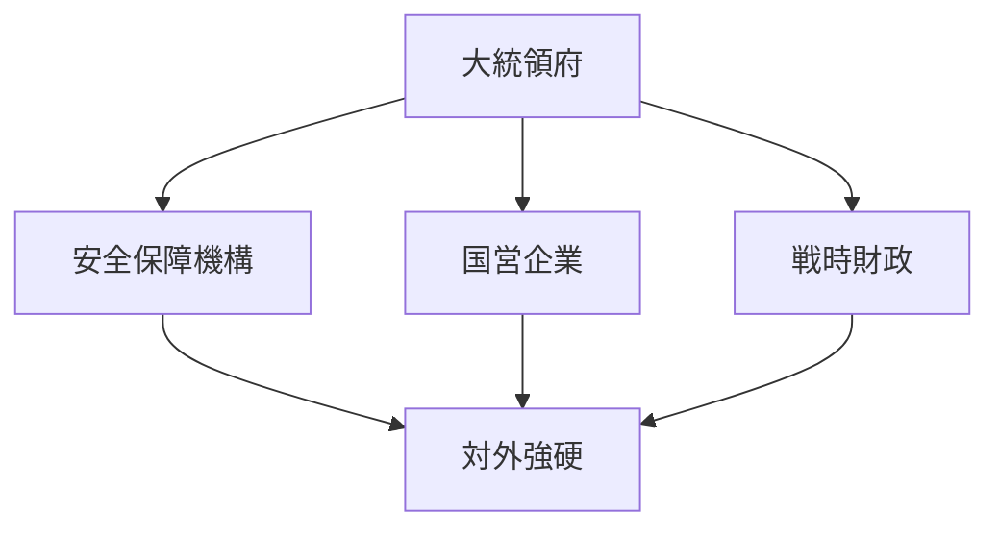
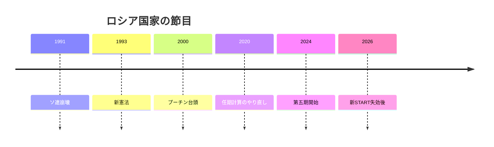
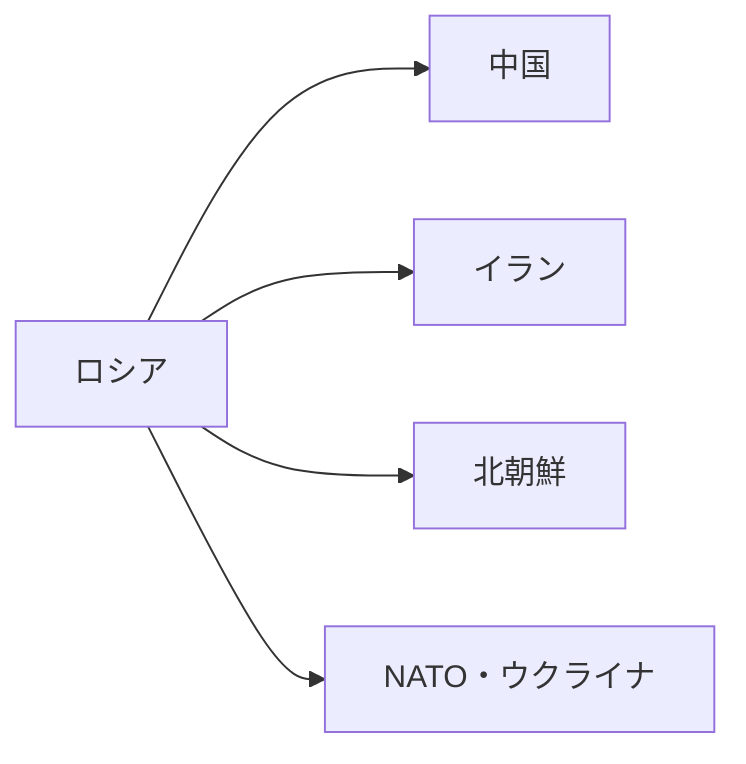

# ロシアの国際政治プロファイル 2026年版

## 1. エグゼクティブサマリー

ロシアは、核兵器、国連安全保障理事会常任理事国、エネルギー輸出国という地位を持ちながら、2022年の全面侵攻以後は制裁と孤立を前提にした戦時体制へ移った。<SourceNote>[IMF, Russian Federation and the IMF](https://www.imf.org/en/countries/rus), [World Bank, Russia Overview](https://www.worldbank.org/en/country/russia/overview)</SourceNote>

2024年の大統領選でプーチンは第五期に入り、ミハイル・ミシュスチンは首相に再任された。表向きは選挙と官僚制が残っていても、実権は大統領府と安全保障機構に強く集中している。<SourceNote>[AP News, Putin begins his fifth term as president, more in control of Russia than ever](https://apnews.com/article/355bd36a2e833800187af848dc24a7dc), [AP News, Putin reappoints his prime minister, a technocrat who has kept a low political profile](https://apnews.com/article/5915b06308d722e17a875892a6d1bdb5)</SourceNote>

経済は崩壊していないが、余力は細っている。世界銀行は2025年の成長率を0.9%と見込み、2026年と2027年も約1%成長を見込む。IMFは2026年の実質成長率を1.1%、消費者物価を5.6%と見積もる。<SourceNote>[World Bank, Russia Overview](https://www.worldbank.org/en/country/russia/overview), [IMF, Russian Federation and the IMF](https://www.imf.org/en/countries/rus)</SourceNote>

したがって、ロシアを読む軸は「強いか弱いか」ではない。国内統制、ウクライナ戦争、核抑止、資源外交、そして中国・イラン・北朝鮮との相互依存が、どの順序で政策に現れるかを見ることにある。<SourceNote>[AP News, Xi heads to Russia to show support for Putin as the Ukraine war drags on](https://apnews.com/article/0c0086341e9694122a49fb7054b41d97), [AP News, North Korea says it sent troops to Russia and may send more to help in Ukraine war](https://apnews.com/article/559e604356bdd6976a7cb6dd159663e3), [AP News, Russia stages nuclear drills after the New START treaty expired earlier this year](https://apnews.com/article/cce4ba1be04956f7a91222a24c61a819)</SourceNote>

## 2. 背景と制度の骨格

ロシア国家は、帝国、革命、ソ連、1991年の崩壊、1993年憲法という断層の上にある。2012年以降の権力集中と、2020年の憲法改正による任期計算のやり直しが、プーチンの長期統治を制度化した。<SourceNote>[Wikipedia, Fifth inauguration of Vladimir Putin](https://en.wikipedia.org/wiki/Fifth_inauguration_of_Vladimir_Putin)</SourceNote>

この制度は、地方分権の外観を残しつつ、実際には忠誠と統制を優先する。選挙は政権の正統性を補強する儀式として機能し、司法とメディアは独立した監視装置というより、体制維持の一部として扱われる。

## 3. 現在の権力配置

現在のロシアでは、外交と安全保障の境界が薄い。大統領府、治安機構、国防省、外務省、国営メディア、国営企業が縦につながり、危機対応と対外メッセージが一体で動く。<SourceNote>[AP News, Putin reappoints his prime minister, a technocrat who has kept a low political profile](https://apnews.com/article/5915b06308d722e17a875892a6d1bdb5)</SourceNote>

| アクター | 役割 | 読み方 |
| --- | --- | --- |
| 大統領府 | 対外戦略と人事の最終調整 | 最終決定権の中心 |
| 首相府 | 財政、産業、行政の実装 | 戦時経済の運用窓口 |
| 安全保障機構 | 戦争、抑止、国内監視 | 実力部門の中核 |
| 中央銀行 | インフレと金利の管理 | 制裁下の安定装置 |
| 議会と裁判所 | 形式上の制度 | 正統性の補完 |
| 市民社会と亡命反対派 | 限定的な圧力 | 体制を揺らしにくい |

アレクセイ・ナワリヌイは2024年2月に収監先で死亡し、体制内に残っていた全国的野党の軸はさらに弱まった。反対派は国外、地下、獄中に分散し、国内政治の競争性は目に見えて低下した。<SourceNote>[AP News, Russian opposition leader Alexei Navalny has died, prison officials say](https://apnews.com/article/0722708e19e51b10699b2cc73ece0bae)</SourceNote>

この構図は、ロシア政治を「大統領が強い」だけでは説明できないことを示す。正確には、大統領が安全保障機構と国営経済を束ね、反対派の空間を狭めることで、政策選択肢そのものを減らしている。

## 4. 戦争・核・対外関係

ウクライナ戦争は、ロシア外交の中心であり続ける。NATOはウクライナ支援の枠組みを公表し、欧州の抑止はロシアへの対抗軸として維持されている。<SourceNote>[NATO, NATO's support for Ukraine](https://www.nato.int/en/what-we-do/partnerships-and-cooperation/natos-support-for-ukraine)</SourceNote>

2026年2月に新START条約は失効し、核軍縮の最後の大枠はさらに細くなった。ロシアはその後も核戦力演習を行い、核抑止を対外圧力の中心に置き続けている。<SourceNote>[The Washington Post, U.S.-Russia nuclear arms treaty expires after years of collapse](https://www.washingtonpost.com/national-security/2026/02/04/us-russia-nuclear-arms-treaty-new-start/), [AP News, Russia stages nuclear drills after the New START treaty expired earlier this year](https://apnews.com/article/cce4ba1be04956f7a91222a24c61a819)</SourceNote>

中国との関係は最も重要な対外支柱であり、イランと北朝鮮は制裁下の代替回路として働く。2025年から2026年にかけての公表情報は、ロシアがこれらの相手国との連携を戦争遂行と制裁回避の両面で深めていることを示す。<SourceNote>[AP News, Xi heads to Russia to show support for Putin as the Ukraine war drags on](https://apnews.com/article/0c0086341e9694122a49fb7054b41d97), [AP News, North Korea says it sent troops to Russia and may send more to help in Ukraine war](https://apnews.com/article/559e604356bdd6976a7cb6dd159663e3)</SourceNote>

中国との関係は同盟ではないが、交易、技術、エネルギー、外交の四つでロシアを支える。北朝鮮との関係はさらに危険で、弾薬、兵員、工兵、再建支援の往復が、東アジアの安全保障環境を悪化させる。イランとの関係は、制裁慣れした国家どうしが互いの弱点を補う構図として読むのが妥当である。<SourceNote>[AP News, North Korea says it sent troops to Russia and may send more to help in Ukraine war](https://apnews.com/article/559e604356bdd6976a7cb6dd159663e3)</SourceNote>

## 5. 経済・社会と戦時適応

ロシア経済は、戦争に合わせて歪んだ需要配分の上で動いている。世界銀行は、制裁の継続、低いエネルギー価格、借入コストの高さを前提に、2025年と2026年の成長率が鈍いとみている。<SourceNote>[World Bank, Russia Overview](https://www.worldbank.org/en/country/russia/overview)</SourceNote>

中央銀行は物価抑制を優先してきたが、借り入れコストはなお高い。2026年6月の市場報道では、ロシア中銀は政策金利を14.25%に引き下げたが、物価と戦時需要の圧力は残ると報じられた。<SourceNote>[The Wall Street Journal, Russia's Central Bank Cuts Key Rate After Economy Contracts](https://www.wsj.com/pro/central-banking/russias-central-bank-cuts-key-rate-after-economy-contracts-e321b388)</SourceNote>

ロシア社会は一枚岩ではない。大都市の中間層、地方の低賃金層、少数民族地域、軍関連産業の労働者、亡命者、徴兵対象年齢の男性は、それぞれ戦争の受け止め方が違う。だが体制は、報道統制、治安、年金、賃上げ、国営メディアを組み合わせて、不満が政治連合に変わるのを防いでいる。これは公表情報からの推定である。<SourceNote>[AP News, Russian opposition leader Alexei Navalny has died, prison officials say](https://apnews.com/article/0722708e19e51b10699b2cc73ece0bae)</SourceNote>

このため、市民の感情を一語でまとめるのは危険である。愛国、戦争疲れ、沈黙、実利、国外退避が混在しており、賛成か反対かではなく、どの領域でリスクを取らないかが重要になっている。

## 6. 日本・東アジアへの含意

第一に、対露制裁は法務だけではなく、調達、保険、海運、決済、輸出管理をまたぐ。日本企業は、相手先の実体、所有構造、最終用途、第三国迂回の可能性を一体で点検しないと、意図せぬ制裁違反を起こしやすい。<SourceNote>[World Bank, Russia Overview](https://www.worldbank.org/en/country/russia/overview), [AP News, Xi heads to Russia to show support for Putin as the Ukraine war drags on](https://apnews.com/article/0c0086341e9694122a49fb7054b41d97)</SourceNote>

第二に、エネルギーは価格だけの問題ではない。ロシア産資源は、直取引が難しくなっても、第三国経由、混合貨物、海上保険、金融仲介のどこかで再び現れる。日本のリスク管理は、調達先の国名よりも、サプライチェーンの経路を追う必要がある。<SourceNote>[World Bank, Russia Overview](https://www.worldbank.org/en/country/russia/overview)</SourceNote>

第三に、北朝鮮との軍事協力は日本海側の抑止環境を悪化させる。ロシアが北朝鮮の能力を受け入れるほど、朝鮮半島、日本海、シベリア極東のリスクは連動しやすくなる。<SourceNote>[AP News, North Korea says it sent troops to Russia and may send more to help in Ukraine war](https://apnews.com/article/559e604356bdd6976a7cb6dd159663e3)</SourceNote>

第四に、ロシアは中国と完全に一体化しているわけではないが、中国への依存が高まるほど、東アジアの安全保障は米中対立だけでなく、露中連携の強度にも左右される。日本にとっては、北方領土問題や海洋警備だけでなく、対中政策と対露政策を切り分けすぎない視点が必要である。<SourceNote>[AP News, Xi heads to Russia to show support for Putin as the Ukraine war drags on](https://apnews.com/article/0c0086341e9694122a49fb7054b41d97)</SourceNote>

## 7. 監視点

ロシアをニュース読解用の国別プロファイルとして見るなら、次の5点を定点観測するのがよい。

1. ウクライナ戦争の消耗度が、徴兵、財政、治安にどう跳ね返るか。
1. 中国との取引条件が、エネルギー、軍需、デジタル技術のどこで変わるか。
1. 北朝鮮やイランとの連携が、兵器、弾薬、制裁回避のどこに広がるか。
1. 中央銀行の金利とインフレが、戦時経済の持続力をどこまで削るか。
1. 体制内部の人事や健康問題が、ポスト・プーチンの順序をどう示し始めるか。

この5点は、宣言よりも先に、ロシアの行動を変える。

## 8. リスク・限界

本稿の限界は三つある。第一に、2026年6月20日時点の公開情報に依拠しているため、戦況、制裁、金利、対外会談はすぐに前提を変えうる。第二に、核戦力、治安機構、財政の内部数字は不透明で、公開情報からの推定に頼る部分がある。第三に、ロシア社会の感情は地域差と階層差が大きく、全国を一つの反応でまとめるべきではない。

公表情報からの推定として、当面のロシアは「戦争を続けながら、制裁圧力を中国と制裁回避ネットワークで吸収し、核抑止で交渉力を維持する」方向を取りやすい。<SourceNote>[AP News, Xi heads to Russia to show support for Putin as the Ukraine war drags on](https://apnews.com/article/0c0086341e9694122a49fb7054b41d97), [AP News, North Korea says it sent troops to Russia and may send more to help in Ukraine war](https://apnews.com/article/559e604356bdd6976a7cb6dd159663e3), [AP News, Russia stages nuclear drills after the New START treaty expired earlier this year](https://apnews.com/article/cce4ba1be04956f7a91222a24c61a819)</SourceNote>

## 参考情報

- [IMF, Russian Federation and the IMF](https://www.imf.org/en/countries/rus)
- [World Bank, Russia Overview](https://www.worldbank.org/en/country/russia/overview)
- [NATO, NATO's support for Ukraine](https://www.nato.int/en/what-we-do/partnerships-and-cooperation/natos-support-for-ukraine)
- [AP News, Russia's Putin reappoints Mishustin as prime minister in the first step of a new Kremlin government](https://apnews.com/article/5915b06308d722e17a875892a6d1bdb5)
- [AP News, Russian opposition leader Alexei Navalny has died, prison officials say](https://apnews.com/article/0722708e19e51b10699b2cc73ece0bae)
- [AP News, Xi heads to Russia to show support for Putin as the Ukraine war drags on](https://apnews.com/article/0c0086341e9694122a49fb7054b41d97)
- [AP News, North Korea says it sent troops to Russia and may send more to help in Ukraine war](https://apnews.com/article/559e604356bdd6976a7cb6dd159663e3)
- [AP News, Russia stages nuclear drills after the New START treaty expired earlier this year](https://apnews.com/article/cce4ba1be04956f7a91222a24c61a819)
