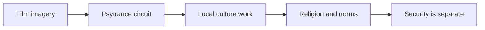
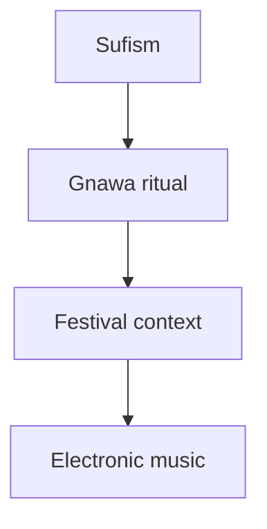

# Desert raves in Morocco and Mauritania: organizers and religious context

## 1. Executive Summary

"Desert rave" around southern Morocco and Mauritania is not one organization or movement. It should be split into at least four categories: the free-party image made visible by the film *Sirât*, Transahara-style psytrance festival travel around Merzouga, community music and education projects such as Joudour Sahara/Zamane in M'hamid El Ghizlane, and commercial electronic music festivals around places such as Ouarzazate. <SourceNote>The *Sirât* context is based on [Festival de Cannes](https://www.festival-cannes.com/en/2025/sirat-oliver-laxes-mystical-odyssey-in-the-desert/) and [The Guardian](https://www.theguardian.com/film/2026/feb/09/cinemas-new-rave-desert-thriller-sirat-deep-dives-into-dance-culture-oliver-laxe). Transahara is based on [Underground Sound](https://undergroundsound.eu/festivals/transahara-the-most-authentic-desert-psy-trance-festival/), and Zamane/Joudour Sahara is based on [Joudour Sahara](https://joudoursahara.org/zamane/).</SourceNote>

The available evidence does not show a religious or political organization centrally directing these events. Transahara is best read as part of an international psytrance/festival-travel circuit. Joudour Sahara is a Playing For Change Foundation-linked music education and local culture program. Oasis-type events are commercial festivals. The desert rave in *Sirât* draws on real rave culture, but a staged film event should not be treated as proof of a recurring public event led by one local organization. <SourceNote>Transahara's organizer context is based on [Underground Sound](https://undergroundsound.eu/festivals/transahara-the-most-authentic-desert-psy-trance-festival/) and [Transahara Instagram](https://www.instagram.com/transaharafestival/?hl=en). Joudour Sahara's program structure is based on [Joudour Sahara About](https://joudoursahara.org/about/).</SourceNote>

The religious profile is clear. Morocco and Mauritania are overwhelmingly Sunni Muslim societies. Morocco is more than 99 percent Sunni Muslim, and the state gives special weight to Maliki Sunni-Ashari religious education and regulation. Mauritania's government estimates place Sunni Muslims at about 99 percent of the population; Islam is defined as the sole religion of the state and citizenry. The religious relevance of desert raves is therefore not that religious groups run them. It is that conservative Islamic social norms, tourism, youth culture, European free-party culture, and Gnawa/Sufi musical traditions meet in the same social space. <SourceNote>[U.S. Department of State, Morocco 2023 IRF Report](https://www.state.gov/reports/2023-report-on-international-religious-freedom/morocco/) and [Mauritania 2023 IRF Report](https://www.state.gov/reports/2023-report-on-international-religious-freedom/mauritania/) provide the religious demography. Gnawa is based on [UNESCO, Gnawa decision 14.COM 10.B.26](https://ich.unesco.org/en/decisions/14.COM/10.B.26).</SourceNote>

Islamic mysticism, usually called Sufism in English and taṣawwuf in Arabic, is better read as a spiritual tradition within Islam than as a separate sect parallel to Sunni and Shia Islam. It emphasizes inward purification, teacher-student lineages, discipline, and drawing near to God. For this report, the point is not that Sufi orders organize desert raves. It is that Gnawa, described as Sufi brotherhood music, creates a cultural bridge through repeated rhythm, all-night bodily experience, trance, healing ritual, and sacred/secular overlap that can resonate with world music, electronic music, and rave culture. <SourceNote>Sufism and tariqa are based on [Britannica, Sufism](https://www.britannica.com/topic/Sufism/Sufi-thought-and-practice) and [Britannica, Tariqa](https://www.britannica.com/topic/tariqa). Gnawa's ritual context is based on [UNESCO](https://ich.unesco.org/en/decisions/14.COM/10.B.26) and [Penn Museum / Deborah Kapchan](https://www.penn.museum/sites/expedition/moroccan-gnawa-and-transglobal-trance/).</SourceNote>

Landmines, the Mauritanian iron-ore railway, and the Western Sahara conflict matter, but they are not the central subject of this report. They are not supporting details about rave organizers; they are a separate question about mobility, security, infrastructure, and conflict history. This PR therefore separates them into a second report, "Landmine belts and railways in Western Sahara and Mauritania." <SourceNote>The mine, railway, and conflict-history analysis is separated into `/reports/western-sahara-mauritania-mines-railways/`.</SourceNote>

## 2. Who Is Leading These Events?

Transahara is not, on the public record, a religious movement or political group. Underground Sound describes it as a psytrance desert festival at an undisclosed dune location north of Merzouga and names Nomadstribe as the related organizing collective. Because the location is undisclosed, the exact site and year-to-year continuity should be treated carefully. The better reading is not local religious organization, but the overlap of international psytrance, traveler communities, and desert tourism. <SourceNote>[Underground Sound, Transahara](https://undergroundsound.eu/festivals/transahara-the-most-authentic-desert-psy-trance-festival/) and [Transahara Instagram](https://www.instagram.com/transaharafestival/?hl=en) are the sources.</SourceNote>

Joudour Sahara/Zamane is not a rave. Zamane takes place in M'hamid El Ghizlane. Its 2025 edition included more than 225 youth and musician performers, including more than 150 Gnawa youth and musicians. Joudour Sahara is a Playing For Change Foundation program focused on music education, girls' and youth opportunity, environmental work, anti-desertification, and cultural heritage. Grouping it with electronic dance events because both happen in the desert would misstate its purpose and institutional form. <SourceNote>[Joudour Sahara, Zamane](https://joudoursahara.org/zamane/) and [Joudour Sahara, About](https://joudoursahara.org/about/) are the sources.</SourceNote>

Commercial electronic festivals such as Oasis: Into the Wild belong to Morocco's tourism and electronic-music economy. They involve international DJs, hospitality, tourism, and brand operations. They should not be collapsed into the mine and railway questions of Western Sahara and Mauritania. <SourceNote>Oasis-type festival context is based on [OkayAfrica, Oasis Into the Wild](https://www.okayafrica.com/oasis-into-the-wild-is-bringing-electronic-music-to-the-moroccan-desert/143200).</SourceNote>

| Type | Example | Lead actor | Common misreading |
| --- | --- | --- | --- |
| Cinematic free party | The desert rave in *Sirât* | Film production plus European rave participants | Treating staged film imagery as evidence of a recurring event |
| Psytrance desert festival | Transahara | Nomadstribe, according to available coverage | Treating a festival-travel collective as a religious or political group |
| Local cultural work | Zamane / Joudour Sahara | Playing For Change Foundation-linked program and local partners | Calling a music education project a rave |
| Commercial electronic festival | Oasis-type events | Commercial festival organizers | Conflating Moroccan tourism events with Western Sahara/Mauritania risk zones |

## 3. Religious Distribution and Sectarian Background

Morocco's State Department profile gives a population of 37.4 million, more than 99 percent Sunni Muslim, and less than one percent combined Christians, Jews, Shia Muslims, Baha'is, and other minorities. It also describes state supervision of religious education, sermons, and Islamic materials around the Maliki Sunni-Ashari tradition. Strong religious administration does not mean desert festivals are run by religious institutions. <SourceNote>[U.S. Department of State, Morocco 2023 IRF Report](https://www.state.gov/reports/2023-report-on-international-religious-freedom/morocco/).</SourceNote>

In Mauritania, government estimates put Sunni Muslims at about 99 percent of the population. Islam is designated as the sole religion of the state and citizenry. Apostasy and blasphemy are defined as capital crimes, although the State Department says the death penalty has never been applied for those crimes. Any discussion of desert music, tourism, or night events in Mauritania has to account for this stronger institutional religious frame. <SourceNote>[U.S. Department of State, Mauritania 2023 IRF Report](https://www.state.gov/reports/2023-report-on-international-religious-freedom/mauritania/).</SourceNote>

## 4. What Is Islamic Mysticism?

Islamic mysticism is usually called Sufism in English and taṣawwuf in Arabic. Britannica treats Sufism as Islamic mysticism: a tradition concerned with drawing near to God through inward purification, love, discipline, teacher-student lineages, and tariqa, the Sufi path or order. For this report, Sufism should not be read as a sect parallel to Sunni and Shia Islam. It is better read as a set of spiritual disciplines, institutions, and embodied practices within Islam. <SourceNote>[Britannica, Sufism](https://www.britannica.com/topic/Sufism/Sufi-thought-and-practice) and [Britannica, Tariqa](https://www.britannica.com/topic/tariqa) are the sources.</SourceNote>

In the Moroccan context, the most relevant bridge is not abstract Sufism but Gnawa. UNESCO describes Gnawa as Sufi brotherhood music and notes all-night rhythm and trance healing ceremonies in which ancestral African practices and Islamic saint veneration overlap. Deborah Kapchan's work likewise treats Gnawa as a trance-inducing musical and ritual practice whose sacred styles have moved into global music markets. <SourceNote>[UNESCO, Gnawa decision 14.COM 10.B.26](https://ich.unesco.org/en/decisions/14.COM/10.B.26), [Penn Museum / Deborah Kapchan](https://www.penn.museum/sites/expedition/moroccan-gnawa-and-transglobal-trance/), and [Kapchan, Moroccan Gnawa and Transglobal Trance](https://www2.umbc.edu/MA/index/number7/kapchan/kap_01.htm) are the sources.</SourceNote>

The Sufism-rave link is therefore indirect. It is not evidence that Sufi orders organize desert raves. The connection lies in repeated rhythm, all-night collective bodily experience, trance, sacred/secular boundary work, and the relocation of ritual aesthetics into tourism, world music, and electronic-music festival settings. Essaouira's Gnaoua and World Music Festival and MOGA-style electronic festival contexts show how Gnawa heritage and electronic/world music can share festival space. They do not prove that Transahara or similar desert raves are religiously led. <SourceNote>[Gnaoua Festival official](https://www.festival-gnaoua.net/en/home/), [MOGA Festival](https://www.mogafestival.com/), [Mixmag MENA on MOGA](https://mixmagmena.com/read/the-sixth-moroccan-edition-of-moga-festival-arrives-in-essaouira-this-week-news), and [OpenEdition Gradhiva](https://journals.openedition.org/gradhiva/1014) support the festival and recontextualization point. The link here is an inference from public information, not confirmation of organizer identity.</SourceNote>

## 5. How Raves and Religion Intersect

The relationship has three layers. First, organizer identity: the major examples identified here are psytrance/festival travel, music education, or commercial events, not religious institutions. Second, social friction: alcohol, drugs, mixed-gender night events, and tourist behavior operate within police administration, family expectations, local reputation, and Islamic norms. Third, musical tradition: UNESCO describes Gnawa as Sufi brotherhood music tied to therapeutic ritual and performance, which should not be collapsed into electronic dance festivals. <SourceNote>The organizer comparison is based on [Underground Sound](https://undergroundsound.eu/festivals/transahara-the-most-authentic-desert-psy-trance-festival/), [Joudour Sahara](https://joudoursahara.org/about/), and [OkayAfrica](https://www.okayafrica.com/oasis-into-the-wild-is-bringing-electronic-music-to-the-moroccan-desert/143200). Gnawa is based on [UNESCO](https://ich.unesco.org/en/decisions/14.COM/10.B.26).</SourceNote>

The connection should be framed through form, market, and symbol rather than institutional lineage. At the level of form, both Gnawa trance practice and rave culture can rely on repeated rhythm and long bodily immersion. At the level of market, sacred Gnawa music has moved into world music, tourism, and festival spaces. At the level of symbol, desert space, passage, community, and altered everyday experience can be reinterpreted in both religious and rave settings. These are similarities and recontextualizations, not evidence that a desert rave is a Sufi ritual. <SourceNote>Gnawa's global-market movement is informed by [Afropop Worldwide, Deborah Kapchan interview](https://www.afropop.org/articles/deborah-kapchan-on-the-gnawa-of-morocco), [Google Books, Traveling Spirit Masters](https://books.google.mn/books?cad=1&id=KTwUAQAAIAAJ&source=gbs_book_other_versions_r), and [OpenEdition Gradhiva](https://journals.openedition.org/gradhiva/1014).</SourceNote>

The religious frame of *Sirât* is different. The title refers to the Sirat Bridge, which Cannes describes as the bridge in Islamic tradition separating hell from heaven. The film uses the rave not as a religious ritual, but as a symbolic space for loss, passage, death, and community. That matters for film interpretation, but it is not evidence about real event organizers or religious demography. <SourceNote>[Festival de Cannes](https://www.festival-cannes.com/en/2025/sirat-oliver-laxes-mystical-odyssey-in-the-desert/) and [Film Comment](https://www.filmcomment.com/interview-oliver-laxe-on-sirat/).</SourceNote>

## 6. Practical Reading

For research or travel decisions, the relevant unit is not the phrase "desert rave." It is the event location, permit status, organizer, participant profile, and relationship with local communities. Cinematic lawlessness, traveler marketing, local music education, and commercial festival operations are different phenomena. For undisclosed-location events such as Transahara, organizer, announcement channel, transport, local law, and drug/alcohol risk should be evaluated separately. <SourceNote>This reading is an inference from the film-festival materials, event sources, religious-freedom reports, and Joudour Sahara materials cited above.</SourceNote>

The Western Sahara mine belt and Mauritania's SNIM railway remain important for understanding the region, but they should not be forced into a report about rave organizers. They are questions of mobility, security, state infrastructure, and mining dependence. <SourceNote>The separate report `/reports/western-sahara-mauritania-mines-railways/` handles those issues using UNMAS, MINURSO, Landmine Monitor, and SNIM sources.</SourceNote>

## References

- [Festival de Cannes, Sirât, Oliver Laxe's mystical odyssey in the desert](https://www.festival-cannes.com/en/2025/sirat-oliver-laxes-mystical-odyssey-in-the-desert/)
- [The Guardian, how Sirāt went on a road trip to the dark heart of rave](https://www.theguardian.com/film/2026/feb/09/cinemas-new-rave-desert-thriller-sirat-deep-dives-into-dance-culture-oliver-laxe)
- [Film Comment, Interview: Oliver Laxe on Sirât](https://www.filmcomment.com/interview-oliver-laxe-on-sirat/)
- [Underground Sound, Transahara](https://undergroundsound.eu/festivals/transahara-the-most-authentic-desert-psy-trance-festival/)
- [Joudour Sahara, Zamane](https://joudoursahara.org/zamane/)
- [Joudour Sahara, About](https://joudoursahara.org/about/)
- [U.S. Department of State, 2023 Report on International Religious Freedom: Morocco](https://www.state.gov/reports/2023-report-on-international-religious-freedom/morocco/)
- [U.S. Department of State, 2023 Report on International Religious Freedom: Mauritania](https://www.state.gov/reports/2023-report-on-international-religious-freedom/mauritania/)
- [Britannica, Sufism](https://www.britannica.com/topic/Sufism/Sufi-thought-and-practice)
- [Britannica, Tariqa](https://www.britannica.com/topic/tariqa)
- [UNESCO, Gnawa decision 14.COM 10.B.26](https://ich.unesco.org/en/decisions/14.COM/10.B.26)
- [Penn Museum, Moroccan Gnawa and Transglobal Trance](https://www.penn.museum/sites/expedition/moroccan-gnawa-and-transglobal-trance/)
- [Afropop Worldwide, Deborah Kapchan on the Gnawa of Morocco](https://www.afropop.org/articles/deborah-kapchan-on-the-gnawa-of-morocco)
- [Kapchan, Moroccan Gnawa and Transglobal Trance](https://www2.umbc.edu/MA/index/number7/kapchan/kap_01.htm)
- [Gnaoua Festival official](https://www.festival-gnaoua.net/en/home/)
- [MOGA Festival](https://www.mogafestival.com/)
- [Mixmag MENA, MOGA Festival in Essaouira](https://mixmagmena.com/read/the-sixth-moroccan-edition-of-moga-festival-arrives-in-essaouira-this-week-news)
- [OpenEdition Gradhiva, La trance mondialisée](https://journals.openedition.org/gradhiva/1014)
- [OkayAfrica, Oasis Into the Wild](https://www.okayafrica.com/oasis-into-the-wild-is-bringing-electronic-music-to-the-moroccan-desert/143200)
